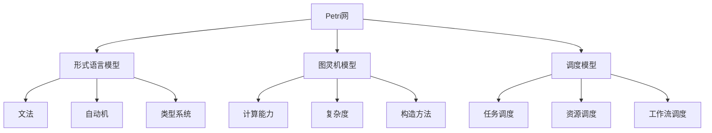
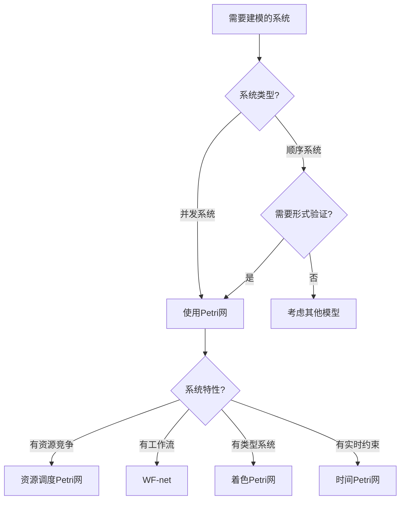

# Petri网多视角对应关系总览

> **文档版本**: v1.0
> **创建日期**: 2025-12-02
> **文档性质**: 跨视角综合文档

---

## 📋 目录

- [Petri网多视角对应关系总览](#petri网多视角对应关系总览)
  - [📋 目录](#-目录)
  - [1 概述](#1-概述)
  - [2 Petri网与形式语言模型](#2-petri网与形式语言模型)
  - [3 Petri网与图灵机模型](#3-petri网与图灵机模型)
  - [4 Petri网与调度模型](#4-petri网与调度模型)
  - [5 统一映射框架](#5-统一映射框架)
  - [6 思维表征方式](#6-思维表征方式)
  - [7 应用案例](#7-应用案例)

---

## 1 概述

### 1.1 目标

本文档全面梳理Petri网与**形式语言模型**、**图灵机模型**、**调度模型**等多视角的对应关系，建立统一的知识框架。

### 1.2 核心洞察

**Petri网作为统一建模框架**：

- **形式语言视角**：Petri网可以表示文法、自动机
- **计算理论视角**：Petri网与图灵机等效
- **调度系统视角**：Petri网可以建模任务调度、资源分配

---

## 2 Petri网与形式语言模型

### 2.1 概念映射表

| Petri网概念 | 形式语言概念 | 映射关系 |
|------------|------------|---------|
| **库所（Place）** | **状态（State）** | 库所表示自动机状态 |
| **变迁（Transition）** | **转换函数（Transition Function）** | 变迁表示状态转换 |
| **标记（Marking）** | **当前状态（Current State）** | 标记表示当前状态配置 |
| **初始标记（M₀）** | **初始状态（q₀）** | 初始标记对应初始状态 |
| **最终标记（M_f）** | **接受状态（F）** | 最终标记对应接受状态 |
| **点火序列（Firing Sequence）** | **输入字符串（Input String）** | 点火序列对应输入处理 |
| **可达性（Reachability）** | **语言识别（Language Recognition）** | 可达性对应语言识别 |

### 2.2 文法与Petri网

#### 2.2.1 上下文无关文法到Petri网

**映射规则**：

```text
对于上下文无关文法G = (V, T, P, S)：

1. 非终结符 → 库所
   V → P：每个非终结符对应一个库所

2. 产生式 → 变迁
   P → T：每个产生式对应一个变迁

3. 产生式规则：
   A → α 映射到变迁t：
     •t = {p_A}（输入：非终结符A）
     t• = {p_X | X ∈ α}（输出：产生式右部的符号）

4. 初始标记：
   M₀(p_S) = 1（开始符号有标记）
   M₀(p) = 0（其他库所无标记）
```

**示例**：

```text
文法：S → aSb | ε

Petri网表示：
  库所：p_S, p_a, p_b
  变迁：
    t₁: p_S → p_a, p_S, p_b  (S → aSb)
    t₂: p_S → ε              (S → ε)
```

#### 2.2.2 Petri网到文法的映射

**构造方法**：

```text
对于Petri网N = (P, T, F, W, M₀)：

1. 库所 → 非终结符
   P → V：每个库所对应一个非终结符

2. 变迁 → 产生式
   T → P：每个变迁对应一个产生式

3. 产生式规则：
   变迁t: •t → t• 映射到产生式：
     A → α₁α₂...αₙ

   其中：
     A对应•t中的库所
     αᵢ对应t•中的库所
```

### 2.3 自动机与Petri网

#### 2.3.1 有限状态自动机到Petri网

**映射规则**：

```text
对于有限状态自动机A = (Q, Σ, δ, q₀, F)：

1. 状态 → 库所
   Q → P：每个状态对应一个库所

2. 转换 → 变迁
   δ → T：每个转换对应一个变迁

3. 变迁规则：
   δ(q, a) = q' 映射到变迁t：
     •t = {p_q}（输入：状态q）
     t• = {p_q'}（输出：状态q'）
     标签：t标记为a

4. 初始标记：
   M₀(p_q₀) = 1（初始状态有标记）
   M₀(p) = 0（其他库所无标记）

5. 接受标记：
   M_f(p_q) > 0 当且仅当 q ∈ F
```

#### 2.3.2 下推自动机到Petri网

**映射规则**：

```text
对于下推自动机PDA = (Q, Σ, Γ, δ, q₀, Z₀, F)：

1. 状态 → 库所
   Q → P_Q：状态库所集合

2. 栈符号 → 库所
   Γ → P_Γ：栈符号库所集合

3. 转换 → 变迁
   δ → T：每个转换对应一个变迁

4. 变迁规则：
   δ(q, a, Z) = {(q', γ)} 映射到变迁t：
     •t = {p_q, p_Z}（输入：状态q和栈顶Z）
     t• = {p_q', p_γ}（输出：状态q'和栈符号γ）
     标签：t标记为a
```

### 2.4 类型系统与Petri网

#### 2.4.1 类型系统到着色Petri网

**映射规则**：

```text
对于类型系统TS = (Types, Terms, Rules)：

1. 类型 → 颜色
   Types → Colors：每个类型对应一个颜色

2. 项 → 标记
   Terms → Tokens：每个项对应一个带颜色的标记

3. 类型规则 → 变迁
   Rules → T：每个类型规则对应一个变迁

4. 变迁规则：
   类型规则 Γ ⊢ e: τ 映射到变迁t：
     •t = {p_Γ}（输入：上下文类型）
     t• = {p_τ}（输出：结果类型）
     守卫：G(t) = type_check(e, Γ, τ)
```

#### 2.4.2 类型安全与Petri网性质

**对应关系**：

```text
类型安全 ⟺ Petri网性质：

1. 类型检查 ⟺ 可达性分析
   项e有类型τ ⟺ 从初始标记可达包含p_τ的标记

2. 类型错误 ⟺ 死锁
   类型错误 ⟺ 无使能变迁（无法继续类型检查）

3. 类型推断 ⟺ 标记计算
   推断类型 ⟺ 计算可达标记
```

---

## 3 Petri网与图灵机模型

### 3.1 概念映射表

| Petri网概念 | 图灵机概念 | 映射关系 |
|------------|-----------|---------|
| **库所（Place）** | **磁带单元（Tape Cell）** | 库所表示磁带位置 |
| **标记（Marking）** | **磁带内容（Tape Content）** | 标记表示磁带符号 |
| **变迁（Transition）** | **转换规则（Transition Rule）** | 变迁表示状态转换 |
| **状态库所** | **控制状态（Control State）** | 状态库所表示图灵机状态 |
| **点火序列** | **计算历史（Computation History）** | 点火序列对应计算步骤 |
| **可达性** | **可计算性（Computability）** | 可达性对应可计算性 |

### 3.2 图灵机到Petri网的构造

#### 3.2.1 基本构造方法

**构造步骤**：

```text
对于图灵机TM = (Q, Σ, Γ, δ, q₀, B, F)：

1. 磁带表示：
   为每个磁带位置创建库所：
     P_tape = {p_i | i ∈ ℤ}

   为每个磁带符号创建库所：
     P_symbol = {p_σ | σ ∈ Γ}

2. 状态表示：
   为每个状态创建库所：
     P_state = {p_q | q ∈ Q}

3. 转换规则：
   δ(q, σ) = (q', σ', D) 映射到变迁t：
     •t = {p_q, p_σ, p_i}（输入：状态q、符号σ、位置i）
     t• = {p_q', p_σ', p_i'}（输出：状态q'、符号σ'、位置i'）

     其中：
       i' = i + 1（如果D = R）
       i' = i - 1（如果D = L）
       i' = i（如果D = N）

4. 初始标记：
   M₀(p_q₀) = 1（初始状态）
   M₀(p_σ) = 1（输入符号）
   M₀(p) = 0（其他库所）
```

#### 3.2.2 通用Petri网构造（Zaitsev方法）

**关键思想**：

```text
Zaitsev（2013）构造了小的通用Petri网：

1. 使用14个库所和42个变迁
2. 可以模拟任何图灵机
3. 证明了Petri网的图灵完备性

构造特点：
  - 最小化库所和变迁数量
  - 优化了构造复杂度
  - 提供了实际可用的构造方法
```

### 3.3 Petri网到图灵机的构造

**构造方法**：

```text
对于Petri网N = (P, T, F, W, M₀)：

1. 状态表示：
   图灵机状态 = Petri网标记
   Q = R(N, M₀)（所有可达标记）

2. 转换规则：
   变迁t的点火对应图灵机转换：
     δ(M, t) = M' 当且仅当 M[t⟩M'

3. 接受条件：
   图灵机接受 ⟺ Petri网可达目标标记
```

### 3.4 计算复杂度对比

| 问题 | 图灵机复杂度 | Petri网复杂度 | 说明 |
|------|------------|--------------|------|
| **可达性** | 可判定 | 可判定（有界） | Petri网可达性在无界情况下不可判定 |
| **停机问题** | 不可判定 | 不可判定 | 等价于可达性问题 |
| **语言识别** | 递归可枚举 | 递归可枚举 | 两者计算能力等效 |
| **复杂度类** | RE | RE | 递归可枚举语言类 |

---

## 4 Petri网与调度模型

### 4.1 概念映射表

| Petri网概念 | 调度系统概念 | 映射关系 |
|------------|------------|---------|
| **库所（Place）** | **资源状态（Resource State）** | 库所表示资源可用性 |
| **标记（Marking）** | **资源数量（Resource Amount）** | 标记表示可用资源数 |
| **变迁（Transition）** | **调度动作（Scheduling Action）** | 变迁表示任务执行 |
| **输入库所（•t）** | **资源需求（Resource Requirement）** | 输入库所对应所需资源 |
| **输出库所（t•）** | **资源释放（Resource Release）** | 输出库所对应释放资源 |
| **点火序列** | **调度序列（Schedule Sequence）** | 点火序列对应任务调度顺序 |
| **可达性** | **调度可行性（Schedulability）** | 可达性对应调度可行性 |
| **活性** | **无死锁（Deadlock-free）** | 活性对应无死锁 |
| **有界性** | **资源有限（Resource Bounded）** | 有界性对应资源有限 |

### 4.2 任务调度Petri网模型

#### 4.2.1 基本映射

```text
任务调度系统 → Petri网：

1. 任务 → 变迁
   Task T → Transition t

2. 资源 → 库所
   Resource R → Place p

3. 资源需求 → 输入库所
   Required(R, T) → •t包含p_R

4. 资源释放 → 输出库所
   Released(R, T) → t•包含p_R

5. 资源数量 → 初始标记
   Available(R) → M₀(p_R)
```

#### 4.2.2 调度模式Petri网表示

**顺序调度**：

```text
任务序列：T₁ → T₂ → T₃

Petri网：
  t₁ →[p₁]→ t₂ →[p₂]→ t₃

结构：
  t₁• = {p₁}
  •t₂ = {p₁}
  t₂• = {p₂}
  •t₃ = {p₂}
```

**并行调度**：

```text
并行任务：T₁ || T₂ || T₃

Petri网：
  p_start →[t₁]→ p₁
  p_start →[t₂]→ p₂
  p_start →[t₃]→ p₃

结构：
  •t₁ = •t₂ = •t₃ = {p_start}
```

**选择调度**：

```text
选择任务：T₁ | T₂

Petri网：
  p_condition →[t₁]→ p_path1
  p_condition →[t₂]→ p_path2

冲突：
  M(p_condition) < W(p_condition, t₁) + W(p_condition, t₂)
```

### 4.3 工作流调度Petri网模型（WF-net）

#### 4.3.1 WF-net定义

```text
工作流网（Workflow Net, WF-net）是Petri网的特化：

1. 单一源库所：存在唯一的i ∈ P，使得•i = ∅
2. 单一汇库所：存在唯一的o ∈ P，使得o• = ∅
3. 强连通性：所有节点都在从i到o的路径上

形式化：
  WF-net N = (P, T, F, W, M₀)满足：
    ∃!i ∈ P. •i = ∅
    ∃!o ∈ P. o• = ∅
    ∀x ∈ P ∪ T. 存在从i到x和从x到o的路径
```

#### 4.3.2 工作流性质与Petri网性质

**对应关系**：

```text
工作流性质 ⟺ Petri网性质：

1. 可终止性 ⟺ 可达性
   工作流可终止 ⟺ 从[i]可达[o]

2. 适当完成 ⟺ 有界性
   工作流适当完成 ⟺ 到达[o]时其他库所为空

3. 无死任务 ⟺ 活性
   工作流无死任务 ⟺ 所有变迁都是活的

4. 健全性 ⟺ 活性 + 有界性
   工作流健全 ⟺ 扩展网是活的和有界的
```

### 4.4 资源调度Petri网模型

#### 4.4.1 资源分配模型

```text
资源分配 → Petri网：

1. 资源类型 → 库所类型
   Resource Type → Place Type

2. 资源数量 → 标记数量
   Resource Amount → Token Count

3. 资源分配 → 变迁点火
   Resource Allocation → Transition Firing

4. 资源释放 → 标记产生
   Resource Release → Token Production
```

#### 4.4.2 死锁检测

**Petri网死锁定义**：

```text
调度系统在标记M下死锁，当且仅当：
  1. M ≠ M_final（未达到最终状态）
  2. 不存在使能的变迁（无法继续）

Petri网表示：
  Deadlock(N, M) ⟺ (M ≠ M_final) ∧ (∀t ∈ T. ¬M[t⟩)
```

**死锁预防策略**：

```text
1. 资源排序：
   对所有资源排序，按顺序请求资源

2. 超时机制：
   资源请求设置超时，超时后释放资源

3. 死锁检测与恢复：
   定期检测死锁，检测到后回滚
```

---

## 5 统一映射框架

### 5.1 三层映射结构

```text
统一映射框架：

┌─────────────────────────────────────┐
│         Petri网核心概念              │
│  (库所、变迁、标记、点火规则)         │
└─────────────────────────────────────┘
           ↓        ↓        ↓
    ┌─────────┐ ┌─────────┐ ┌─────────┐
    │形式语言 │ │图灵机   │ │调度模型 │
    │模型     │ │模型     │ │模型     │
    └─────────┘ └─────────┘ └─────────┘
```

### 5.2 核心概念统一映射

| Petri网 | 形式语言 | 图灵机 | 调度系统 |
|---------|---------|--------|---------|
| **库所** | 状态 | 磁带单元 | 资源状态 |
| **变迁** | 转换函数 | 转换规则 | 调度动作 |
| **标记** | 当前状态 | 磁带内容 | 资源数量 |
| **点火** | 状态转换 | 计算步骤 | 任务执行 |
| **可达性** | 语言识别 | 可计算性 | 调度可行性 |
| **活性** | 接受性 | 停机性 | 无死锁 |
| **有界性** | 有限性 | 有界性 | 资源有限 |

### 5.3 性质对应关系

| Petri网性质 | 形式语言性质 | 图灵机性质 | 调度性质 |
|------------|------------|-----------|---------|
| **可达性** | 语言识别 | 可计算性 | 调度可行性 |
| **活性** | 接受性 | 停机性 | 无死锁 |
| **有界性** | 有限性 | 有界性 | 资源有限 |
| **安全性** | 确定性 | 确定性 | 资源安全 |
| **公平性** | 公平性 | 公平性 | 公平调度 |

---

## 6 思维表征方式

### 6.1 概念关系图



### 6.2 对应关系矩阵

| 维度 | 形式语言 | 图灵机 | 调度系统 | 权重 |
|------|---------|--------|---------|------|
| **建模能力** | 高 | 极高 | 高 | 1.0 |
| **并发支持** | 中 | 低 | 高 | 0.8 |
| **验证能力** | 高 | 中 | 高 | 0.9 |
| **应用广度** | 中 | 低 | 极高 | 1.0 |

### 6.3 决策树：选择Petri网应用场景



---

## 7 应用案例

### 7.1 形式语言应用

**案例**：上下文无关文法解析

```text
文法：S → aSb | ε

Petri网模型：
  库所：p_S, p_a, p_b
  变迁：
    t₁: p_S → p_a, p_S, p_b
    t₂: p_S → ε

解析过程：
  输入"aabb"：
    M₀ = [1, 0, 0]  (S有标记)
    → t₁点火 → [1, 1, 0]  (S, a有标记)
    → t₁点火 → [1, 2, 0]  (S, a, a有标记)
    → t₂点火 → [0, 2, 0]  (a, a有标记)
    → 匹配b → [0, 1, 0]
    → 匹配b → [0, 0, 0]  (接受)
```

### 7.2 图灵机应用

**案例**：通用Petri网（Zaitsev构造）

```text
使用14个库所和42个变迁构造的通用Petri网：
  - 可以模拟任何图灵机
  - 证明了Petri网的图灵完备性
  - 提供了实际可用的构造方法
```

### 7.3 调度系统应用

**案例**：工作流调度（WF-net）

```text
业务流程：
  订单处理 → 支付验证 → 库存检查 → 发货

WF-net模型：
  库所：p_start, p_order, p_payment, p_inventory, p_ship, p_end
  变迁：
    t₁: p_start → p_order
    t₂: p_order → p_payment
    t₃: p_payment → p_inventory
    t₄: p_inventory → p_ship
    t₅: p_ship → p_end

验证：
  - 健全性：可终止、适当完成、无死任务
  - 性能：吞吐量、延迟、资源利用率
```

---

**文档状态**: ✅ 基础框架完成，持续扩展中
**最后更新**: 2025-12-02
