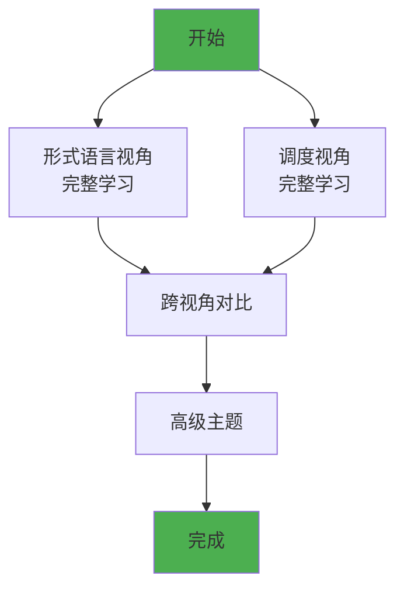
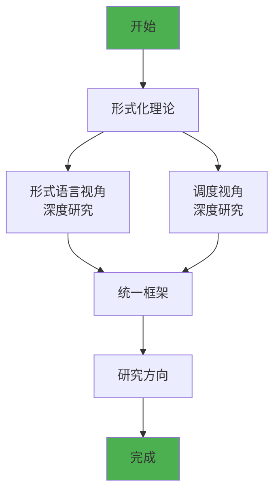

# Composed：组合视角知识体系

> **文档版本**: v1.1
> **创建日期**: 2025-01-XX
> **最后更新**: 2025-12-02
> **文档性质**: [组合视角] - 多个视角的组合知识体系
> **目的**: 提供跨视角的系统化知识组织和可视化

---

## 📋 目录

- [Composed：组合视角知识体系](#composed组合视角知识体系)
  - [📋 目录](#-目录)
  - [1 概述](#1-概述)
  - [2 视角概览](#2-视角概览)
    - [2.1 形式语言视角](#21-形式语言视角)
    - [2.2 调度视角](#22-调度视角)
  - [3 可视化文档索引](#3-可视化文档索引)
    - [3.0 知识图谱可视化总览](#30-知识图谱可视化总览)
    - [3.1 思维导图文档](#31-思维导图文档)
    - [3.2 知识矩阵文档](#32-知识矩阵文档)
    - [3.3 跨视角对比文档](#33-跨视角对比文档)
  - [4 快速导航](#4-快速导航)
    - [4.1 按学习目标导航](#41-按学习目标导航)
    - [4.2 按技术领域导航](#42-按技术领域导航)
  - [5 学习路径](#5-学习路径)
    - [5.1 初学者路径](#51-初学者路径)
    - [5.2 进阶路径](#52-进阶路径)
    - [5.3 专家路径](#53-专家路径)
  - [6 文档结构](#6-文档结构)
  - [7 总结](#7-总结)

---

## 1 概述

**Composed** 目录包含多个视角的**组合知识体系**，通过系统化的思维导图和多维知识矩阵，提供：

- **跨视角**的知识关联
- **系统化**的思维导图
- **多维度**的对比分析
- **可视化**的知识结构

---

## 2 视角概览

### 2.1 形式语言视角

**路径**: `formal_lang_view/`

**核心主题**: 类型系统与基础设施的映射

**主题模块** (9个):

- 01 核心概念映射
- 02 递归结构
- 03 程序控制
- 04 类型检查与验证
- 05 高级类型特性
- 06 动态性与反射
- 07 效应系统
- 08 实践启示
- 09 形式化理论

**可视化文档**:

- [思维导图与知识矩阵](./formal_lang_view/思维导图与知识矩阵.md) ⭐ **新增**
- [形式化分析与认知图谱](./formal_lang_view/形式化分析与认知图谱.md)

**新增内容** (2025-12):

- [线性类型与资源安全](./formal_lang_view/05_高级类型特性/05.4_线性类型与资源安全.md)
- [WASM组件模型](./formal_lang_view/05_高级类型特性/05.6_WASM组件模型.md)
- [形式化验证代码库](./formal_lang_view/proofs/) (Coq/Lean4/TLA+)

**特点**:

- ✅ 理论完备性高
- ✅ 形式化程度深
- ✅ 类型系统映射清晰
- ✅ 形式化证明可验证

### 2.2 调度视角

**路径**: `schedule_formal_view/`

**核心主题**: 硬件-OS-应用全栈调度体系

**主题模块** (27个):

- 01 CPU硬件层
- 02 系统总线层
- 03 OS抽象层 (含eBPF调度扩展)
- 04 同步通信机制
- 05 虚拟化容器化沙盒化
- 06 调度模型
- 07 性能优化与安全
- 08 技术演进与对标
- 09 形式化理论与证明
- 10-24 扩展主题 (AI驱动、企业架构、存储、网络、GPU等)
- **25 LLM推理调度** ⭐ 2025-12新增
- **26 Serverless调度** ⭐ 2025-12新增
- **27 机密计算调度** ⭐ 2025-12新增

**可视化文档**:

- [思维导图与知识矩阵](./schedule_formal_view/思维导图与知识矩阵.md) ⭐ **新增**
- [知识图谱总览](./schedule_formal_view/知识图谱总览.md)

**特点**:

- ✅ 实践应用丰富
- ✅ 技术覆盖全面
- ✅ 性能优化深入

---

## 3 可视化文档索引

### 3.0 知识图谱可视化总览

**总览文档**: [知识图谱可视化总览](./知识图谱可视化总览.md) ⭐ **新增**

提供所有知识图谱和可视化文档的完整导航和索引，包括：

- 核心知识图谱索引
- 主题知识图谱索引（33个主题）
- 多维知识矩阵索引（16个矩阵）
- 可视化工具使用指南
- 知识图谱应用场景

**完成报告**:

- [可视化体系完成报告](./可视化体系完成报告.md) - 完整的可视化体系完成情况
- [可视化推进总结报告](./可视化推进总结报告.md) ⭐ **新增** - 本次推进工作详细总结
- [可视化体系最终完成状态](./可视化体系最终完成状态.md) ⭐ **新增** - 最终完成状态总结

### 3.1 思维导图文档

| 文档 | 视角 | 内容 | 链接 |
|------|------|------|------|
| **思维导图与知识矩阵** | 形式语言 | 9个主题模块思维导图 | [查看](./formal_lang_view/思维导图与知识矩阵.md) |
| **思维导图与知识矩阵** | 调度 | 24个主题模块思维导图 | [查看](./schedule_formal_view/思维导图与知识矩阵.md) |
| **跨视角多维知识矩阵** | 跨视角 | 两个视角的对比分析 | [查看](./跨视角多维知识矩阵.md) |

### 3.2 知识矩阵文档

| 矩阵类型 | 形式语言视角 | 调度视角 | 跨视角对比 |
|---------|------------|---------|-----------|
| **核心概念映射** | ✅ | ✅ | ✅ |
| **技术演进时间线** | ✅ | ✅ | ✅ |
| **形式化验证工具** | ✅ | ✅ | ✅ |
| **技术成熟度** | ✅ | ✅ | ✅ |
| **实践应用场景** | ✅ | ✅ | ✅ |
| **学习路径** | ✅ | ✅ | ✅ |

### 3.3 跨视角对比文档

**文档**: [跨视角多维知识矩阵](./跨视角多维知识矩阵.md)

**内容**:

- 核心概念映射矩阵
- 主题模块对比矩阵
- 技术栈映射矩阵
- 形式化程度对比矩阵
- 实践应用对比矩阵
- 时间维度对比矩阵
- 跨视角关联网络
- 统一框架思维导图

### 3.4 新增分析与改进文档 ⭐ 2025-12

| 文档 | 内容 | 链接 |
|------|------|------|
| **批判性分析** | 全面分析+改进计划 | [查看](./全面批判性分析与改进计划_2025-12.md) |
| **任务清单** | 改进任务+实施方案 | [查看](./改进任务清单与实施方案_2025-12.md) |
| **同构理论** | 类型-调度同构证明 | [查看](./类型-调度同构理论.md) |
| **引用规范** | 交叉引用格式规范 | [查看](./跨视角引用规范.md) |
| **术语表** | 统一术语定义 | [查看](./统一术语表.md) |
| **完成报告** | 任务完成状态 | [查看](./任务完成报告_2025-12-02.md) |

---

## 4 快速导航

### 4.1 按学习目标导航

| 学习目标 | 推荐视角 | 推荐文档 |
|---------|---------|---------|
| **理解类型系统** | 形式语言 | [形式语言视角思维导图](./formal_lang_view/思维导图与知识矩阵.md) |
| **理解调度系统** | 调度 | [调度视角思维导图](./schedule_formal_view/思维导图与知识矩阵.md) |
| **对比两个视角** | 跨视角 | [跨视角多维知识矩阵](./跨视角多维知识矩阵.md) |
| **系统设计** | 形式语言 | [形式语言视角实践](./formal_lang_view/08_实践启示/) |
| **性能优化** | 调度 | [调度视角性能优化](./schedule_formal_view/07_性能优化与安全/) |
| **形式化验证** | 两个视角 | [形式化理论](./formal_lang_view/09_形式化理论/) |

### 4.2 按技术领域导航

| 技术领域 | 形式语言视角 | 调度视角 |
|---------|------------|---------|
| **容器技术** | [类型系统映射](./formal_lang_view/01_核心概念映射/) | [容器调度](./schedule_formal_view/05_虚拟化容器化沙盒化/) |
| **类型检查** | [类型检查与验证](./formal_lang_view/04_类型检查与验证/) | [调度验证](./schedule_formal_view/09_形式化理论与证明/) |
| **资源管理** | [效应系统](./formal_lang_view/07_效应系统/) | [资源调度](./schedule_formal_view/06_调度模型/) |
| **性能优化** | [实践启示](./formal_lang_view/08_实践启示/) | [性能优化](./schedule_formal_view/07_性能优化与安全/) |

---

## 5 学习路径

### 5.1 初学者路径


**推荐文档**:

1. [形式语言视角 - 01 核心概念映射](./formal_lang_view/01_核心概念映射/)
2. [调度视角 - 01 CPU硬件层](./schedule_formal_view/01_CPU硬件层/)
3. [跨视角多维知识矩阵](./跨视角多维知识矩阵.md)

### 5.2 进阶路径



**推荐文档**:

1. [形式语言视角思维导图](./formal_lang_view/思维导图与知识矩阵.md)
2. [调度视角思维导图](./schedule_formal_view/思维导图与知识矩阵.md)
3. [跨视角多维知识矩阵](./跨视角多维知识矩阵.md)

### 5.3 专家路径



**推荐文档**:

1. [形式语言视角 - 09 形式化理论](./formal_lang_view/09_形式化理论/)
2. [调度视角 - 09 形式化理论与证明](./schedule_formal_view/09_形式化理论与证明/)
3. [跨视角多维知识矩阵 - 统一框架](./跨视角多维知识矩阵.md#9-统一框架思维导图)

---

## 6 文档结构

```text
Composed/
├── README.md                          ← 📍 您在这里
├── 跨视角多维知识矩阵.md                ← 🌐 跨视角对比
│
├── formal_lang_view/                  ← 📐 形式语言视角
│   ├── README.md
│   ├── 思维导图与知识矩阵.md            ← 🧠 思维导图
│   ├── 形式化分析与认知图谱.md
│   └── [9个主题模块]/
│
└── schedule_formal_view/              ← ⚙️ 调度视角
    ├── README.md
    ├── 思维导图与知识矩阵.md            ← 🧠 思维导图
    ├── 知识图谱总览.md
    └── [24个主题模块]/
```

---

## 7 总结

**Composed** 目录提供了：

✅ **两个视角**的系统化知识体系
✅ **思维导图**和**多维知识矩阵**的可视化
✅ **跨视角对比**的统一框架
✅ **学习路径**和实践应用指南

**下一步**：

- 选择适合的视角开始学习
- 使用思维导图快速定位知识点
- 通过跨视角对比理解统一框架

---

**相关链接**:

- [Concept目录](../Concept/README.md) - 核心概念和理论框架
- [形式语言视角](./formal_lang_view/README.md) - 类型系统映射
- [调度视角](./schedule_formal_view/README.md) - 硬件-OS调度体系
