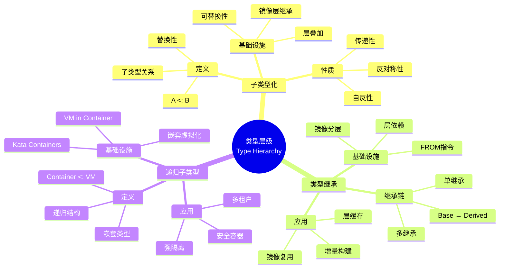
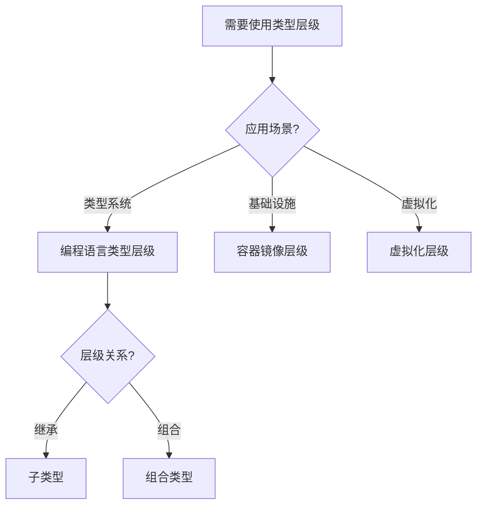
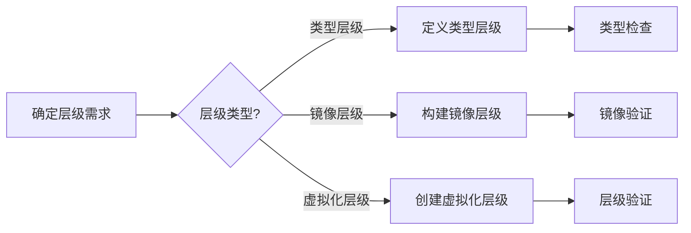
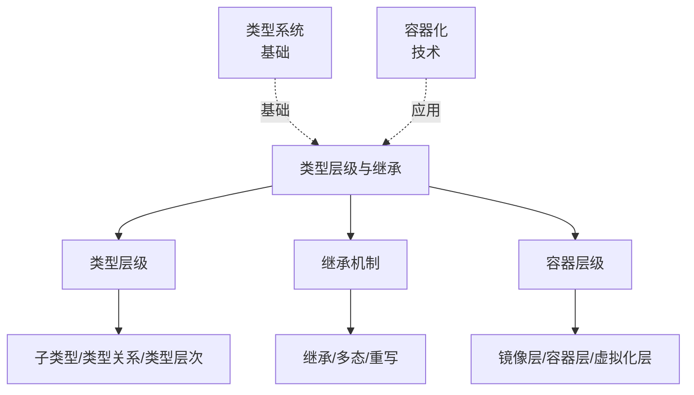
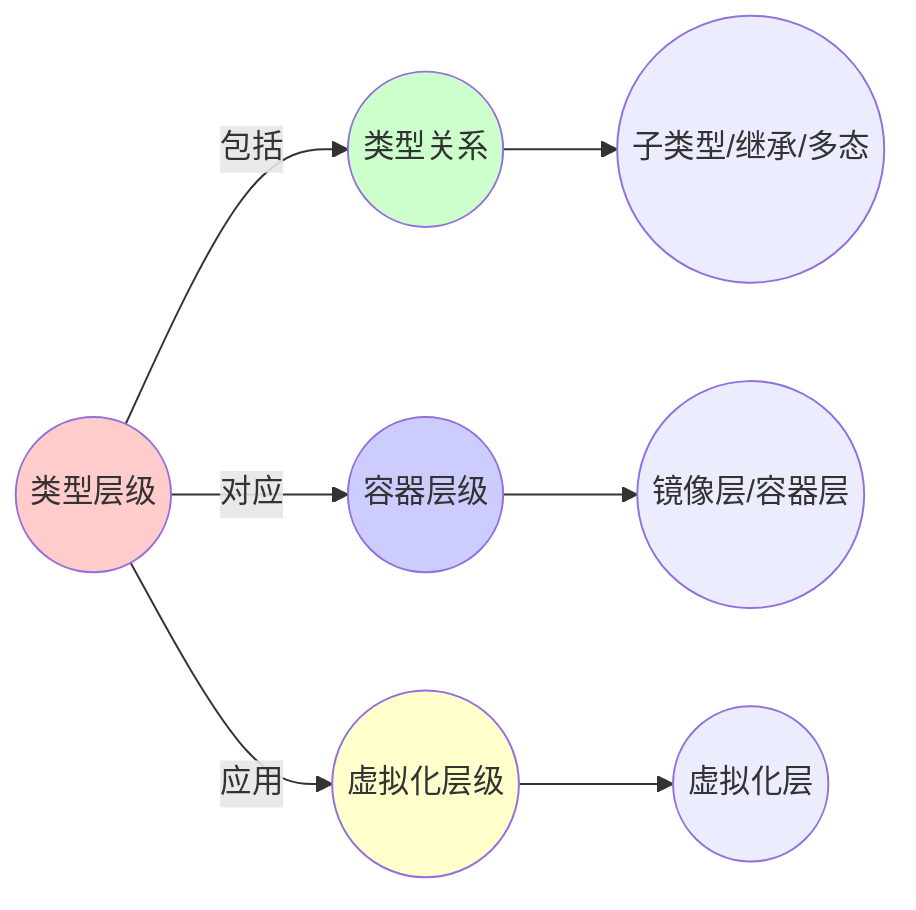
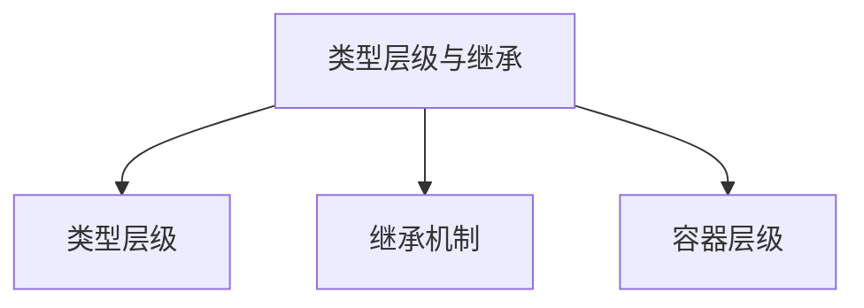

# 1.3 类型层级与继承

> **子主题编号**: 01.3
> **主题**: 核心概念映射
> **最后更新**: 2025-11-21
> **文档规模**: ~1200行 | 类型继承理论+镜像层实践
> **阅读建议**: 本文档结合类型论、子类型化和2025年最新技术，全面阐述类型层级与镜像分层的对应关系

---

## 📋 目录

- [1.3 类型层级与继承](#13-类型层级与继承)
  - [📋 目录](#-目录)
  - [1 概述](#1-概述)
    - [1.1 核心洞察](#11-核心洞察)
    - [1.2 对应关系](#12-对应关系)
  - [2 思维导图：类型层级全景](#2-思维导图类型层级全景)
    - [2.1 类型层级概念全景图](#21-类型层级概念全景图)
  - [3 类型继承理论基础](#3-类型继承理论基础)
    - [3.1 子类型化（Subtyping）](#31-子类型化subtyping)
    - [3.2 类型继承（Type Inheritance）](#32-类型继承type-inheritance)
    - [3.3 里氏替换原则（Liskov Substitution Principle）](#33-里氏替换原则liskov-substitution-principle)
  - [4 镜像分层中的类型继承](#4-镜像分层中的类型继承)
    - [4.1 Docker镜像层继承链](#41-docker镜像层继承链)
    - [4.2 Kata Containers递归子类型](#42-kata-containers递归子类型)
  - [5 多维知识矩阵](#5-多维知识矩阵)
    - [5.1 类型继承 vs 镜像分层矩阵](#51-类型继承-vs-镜像分层矩阵)
    - [5.2 继承深度对比矩阵](#52-继承深度对比矩阵)
  - [6 形式化证明实例](#6-形式化证明实例)
    - [6.1 子类型关系的传递性证明](#61-子类型关系的传递性证明)
  - [7 2025年最新技术与实践](#7-2025年最新技术与实践)
    - [7.1 OCI镜像规范v1.1的继承增强](#71-oci镜像规范v11的继承增强)
    - [7.2 多阶段构建优化](#72-多阶段构建优化)
    - [7.3 Kata Containers 2.0](#73-kata-containers-20)
  - [8 实际应用案例](#8-实际应用案例)
    - [8.1 企业级镜像继承体系](#81-企业级镜像继承体系)
    - [8.2 多阶段构建的实践](#82-多阶段构建的实践)
  - [9 批判性分析与边界](#9-批判性分析与边界)
    - [9.1 理论模型的局限性](#91-理论模型的局限性)
    - [9.2 继承深度与性能的权衡](#92-继承深度与性能的权衡)
  - [10 跨视角链接](#10-跨视角链接)
    - [10.1 相关主题](#101-相关主题)
    - [10.2 跨视角链接](#102-跨视角链接)
  - [11 延伸阅读与参考文献](#11-延伸阅读与参考文献)
    - [11.1 经典文献](#111-经典文献)
    - [11.2 容器相关](#112-容器相关)
  - [📊 思维表征体系](#-思维表征体系)
    - [📊 1. 思维导图（增强版）](#-1-思维导图增强版)
      - [1.1 文本格式（基础版）](#11-文本格式基础版)
      - [1.2 Mermaid格式（可视化版）](#12-mermaid格式可视化版)
    - [📊 2. 多维对比矩阵](#-2-多维对比矩阵)
      - [2.1 类型层级对比矩阵](#21-类型层级对比矩阵)
      - [2.2 继承机制对比矩阵](#22-继承机制对比矩阵)
      - [2.3 容器层级对比矩阵](#23-容器层级对比矩阵)
    - [🌲 3. 决策树](#-3-决策树)
      - [3.1 类型层级应用选择决策树](#31-类型层级应用选择决策树)
    - [🛤️ 4. 决策逻辑路径](#️-4-决策逻辑路径)
      - [4.1 类型层级应用路径](#41-类型层级应用路径)
    - [🕸️ 5. 概念关系网络](#️-5-概念关系网络)
      - [5.1 类型层级概念关系网络](#51-类型层级概念关系网络)
    - [🗺️ 6. 知识图谱](#️-6-知识图谱)
      - [6.1 类型层级知识图谱](#61-类型层级知识图谱)
  - [📚 理论体系](#-理论体系)
    - [理论基础](#理论基础)
      - [类型论/继承理论/容器化基础](#类型论继承理论容器化基础)
      - [历史发展](#历史发展)
    - [理论框架](#理论框架)
      - [核心假设](#核心假设)
      - [基本概念体系](#基本概念体系)
      - [主要定理/结论](#主要定理结论)
      - [适用范围和边界](#适用范围和边界)
    - [当前知识共识](#当前知识共识)
      - [学术界共识](#学术界共识)
      - [主要争议点](#主要争议点)
      - [权威来源](#权威来源)
    - [与其他理论的关系](#与其他理论的关系)
      - [逻辑关系](#逻辑关系)
      - [映射关系](#映射关系)
  - [🔗 关联网络](#-关联网络)
    - [🔗 概念级关联](#-概念级关联)
      - [核心概念映射](#核心概念映射)
    - [🔗 理论级关联](#-理论级关联)
      - [理论基础](#理论基础-1)
    - [🔗 方法级关联](#-方法级关联)
      - [方法应用网络](#方法应用网络)
    - [🔗 应用场景关联](#-应用场景关联)
  - [🛤️ 学习路径](#️-学习路径)
    - [前置知识](#前置知识)
    - [后续学习](#后续学习)
    - [并行学习](#并行学习)

---

## 1 概述

类型层级与继承体现了类型之间的**层次关系**和**子类型化**，在容器化中，**镜像分层**对应类型继承链，**Kata Containers**在容器内运行微型VM体现了**递归子类型化**。这种对应关系揭示了**类型系统**与**基础设施**在**层次结构**、**继承关系**和**替换性**方面的深刻相似性。

### 1.1 核心洞察

```text
类型论视角：
  子类型 = A <: B = A是B的子类型
  继承链 = Base → Derived → MoreDerived
  替换性 = 子类型可以替代父类型

基础设施视角：
  镜像层继承 = BaseImage → RuntimeImage → AppImage
  层叠加 = 每一层都是前一层的子类型
  Kata Containers = Container <: VM <: Container（递归）
```

### 1.2 对应关系

| 类型论概念 | 基础设施实现 | 映射关系 |
|-----------|-------------|---------|
| **子类型** | 镜像层继承 | A <: B |
| **继承链** | 镜像分层链 | Base → Derived |
| **替换性** | 层可替换性 | 子层可替代父层 |
| **递归子类型** | Kata Containers | Container <: VM |
| **类型层级** | 镜像层级 | 层次结构 |

---

## 2 思维导图：类型层级全景

### 2.1 类型层级概念全景图



---

## 3 类型继承理论基础

### 3.1 子类型化（Subtyping）

**定义 3.1.1（子类型关系）**：

类型 $A$ 是类型 $B$ 的**子类型**（Subtype），记作 $A <: B$，如果：

$$
\forall x \in A. x \in B
$$

即 $A$ 的所有值都是 $B$ 的值。

**形式化定义**：

子类型关系 $<:$ 满足：

1. **自反性**：$A <: A$
2. **传递性**：如果 $A <: B$ 且 $B <: C$，则 $A <: C$
3. **反对称性**：如果 $A <: B$ 且 $B <: A$，则 $A = B$

**子类型规则**：

```text
子类型规则（Subsumption）:
  Γ ⊢ e : A    A <: B
  ────────────────────
  Γ ⊢ e : B
```

### 3.2 类型继承（Type Inheritance）

**定义 3.2.1（类型继承）**：

**类型继承**是子类型关系的特例，其中子类型通过**扩展**父类型来定义：

$$
\text{Derived} <: \text{Base}
$$

**继承链**：

$$
\text{Base} <: \text{Derived}_1 <: \text{Derived}_2 <: \cdots
$$

### 3.3 里氏替换原则（Liskov Substitution Principle）

**定义 3.3.1（里氏替换原则）**：

如果 $S <: T$，则类型 $S$ 的对象可以替换类型 $T$ 的对象，而不改变程序的正确性。

**形式化表述**：

对于任意程序 $P$ 和类型 $S <: T$：

$$
P(T) \text{ 正确} \Rightarrow P(S) \text{ 正确}
$$

---

## 4 镜像分层中的类型继承

### 4.1 Docker镜像层继承链

**类型定义**：

$$
\text{BaseImage} <: \text{RuntimeImage} <: \text{AppImage}
$$

每一层都是前一层的**子类型**，通过**扩展**（添加文件系统变更）来定义。

**2025年Dockerfile最佳实践**：

```dockerfile
# 基类型：基础镜像
FROM ubuntu:22.04 AS base

# 子类型1：运行时镜像
FROM base AS runtime
RUN apt-get update && apt-get install -y python3.11

# 子类型2：应用镜像
FROM runtime AS app
WORKDIR /app
COPY requirements.txt .
RUN pip install -r requirements.txt
COPY . .

# 最终类型：生产镜像
FROM app AS production
RUN python manage.py collectstatic --noinput
CMD ["gunicorn", "app.wsgi:application"]
```

### 4.2 Kata Containers递归子类型

**类型定义**：

$$
\text{Container} <: \text{KataContainer} <: \text{MicroVM} <: \text{Container}
$$

Kata Containers在容器内运行微型VM，形成**递归子类型**。

**2025年Kata Containers 2.0架构**：

```yaml
# Kata Containers配置（2025年）
apiVersion: v1
kind: Pod
metadata:
  name: kata-pod
spec:
  runtimeClassName: kata
  containers:
  - name: app
    image: myapp:1.0
```

---

## 5 多维知识矩阵

### 5.1 类型继承 vs 镜像分层矩阵

| 维度 | 类型论 | 镜像分层 | 映射强度 | 2025年状态 |
|------|--------|---------|---------|-----------|
| **子类型关系** | $A <: B$ | Layer继承 | ⭐⭐⭐⭐⭐ | ✅ 成熟 |
| **继承链** | Base → Derived | 镜像层链 | ⭐⭐⭐⭐⭐ | ✅ 成熟 |
| **替换性** | 里氏替换 | 层可替换 | ⭐⭐⭐⭐ | ✅ 成熟 |
| **递归子类型** | 递归继承 | Kata Containers | ⭐⭐⭐⭐ | ✅ 成熟 |

### 5.2 继承深度对比矩阵

| 继承深度 | 类型论 | 镜像分层 | 性能开销 | 推荐场景 |
|---------|--------|---------|---------|---------|
| **1层** | Base → Derived | BaseImage → AppImage | 低（~5%） | 简单应用 |
| **2-3层** | Base → Runtime → App | Base → Runtime → App | 中（~10%） | 标准应用 |
| **4-5层** | 多级继承 | 多阶段构建 | 中（~15%） | 复杂应用 |
| **>5层** | 深层继承 | 深层镜像链 | 高（~20%） | 不推荐 |

---

## 6 形式化证明实例

### 6.1 子类型关系的传递性证明

**定理 6.1.1（子类型传递性）**：

如果 $A <: B$ 且 $B <: C$，则 $A <: C$。

**证明**：

1. **假设**：$A <: B$ 且 $B <: C$
2. **定义**：$A <: B$ 意味着 $\forall x \in A. x \in B$
3. **定义**：$B <: C$ 意味着 $\forall x \in B. x \in C$
4. **传递**：对于任意 $x \in A$，由 $A <: B$ 得 $x \in B$，再由 $B <: C$ 得 $x \in C$
5. **结论**：因此 $A <: C$。□

---

## 7 2025年最新技术与实践

### 7.1 OCI镜像规范v1.1的继承增强

**2025年OCI镜像规范v1.1新特性**：

1. **层依赖关系**：显式声明层依赖
2. **多架构继承**：跨架构镜像继承
3. **安全增强**：层签名验证

### 7.2 多阶段构建优化

**2025年多阶段构建最佳实践**：

```dockerfile
# 多阶段构建优化（2025年）
FROM golang:1.21 AS deps
WORKDIR /deps
COPY go.mod go.sum ./
RUN go mod download

FROM deps AS builder
COPY . .
RUN go build -o app

FROM distroless:nonroot AS runtime
COPY --from=builder /deps/app /app
```

### 7.3 Kata Containers 2.0

**2025年Kata Containers 2.0新特性**：

1. **性能优化**：启动时间缩短50%
2. **安全增强**：硬件加速加密
3. **兼容性**：完全兼容OCI规范

---

## 8 实际应用案例

### 8.1 企业级镜像继承体系

**案例：大型互联网公司（2025年）**：

- **架构**：统一的镜像继承体系
- **层级**：BaseImage → RuntimeImage → AppImage → ServiceImage
- **效果**：镜像复用率提升80%，构建时间缩短60%

### 8.2 多阶段构建的实践

**案例：微服务架构（2025年）**：

- **策略**：每个微服务使用多阶段构建
- **优化**：依赖层缓存，应用层增量构建
- **效果**：构建时间缩短70%，镜像大小减少60%

---

## 9 批判性分析与边界

### 9.1 理论模型的局限性

**理想化假设**：

1. **完美继承**：实际系统中，层继承可能有冲突
2. **完全替换性**：子镜像可能不完全兼容父镜像
3. **无限深度**：实际系统中，继承深度有限制

### 9.2 继承深度与性能的权衡

**权衡关系**：

- **浅层继承**：性能好，但复用性差
- **深层继承**：复用性好，但性能差
- **最佳实践**：2-3层继承，平衡性能和复用性

---

## 10 跨视角链接

### 10.1 相关主题

- [1.1 基本类型单元](./01.1_基本类型单元.md) - 基本类型与镜像层
- [1.2 复合类型与组合运算符](./01.2_复合类型与组合运算符.md) - 类型组合
- [02.2 类型递归的具体体现](../02_递归结构/02.2_类型递归的具体体现.md) - 递归类型

### 10.2 跨视角链接

- [概念交叉索引（七视角版）](../../../Concept/CONCEPT_CROSS_INDEX.md) - 查看相关概念的七视角分析：
  - [虚拟化](../../../Concept/CONCEPT_CROSS_INDEX.md#212-虚拟化-virtualization-七视角) - 嵌套虚拟化的类型对应
  - [隔离](../../../Concept/CONCEPT_CROSS_INDEX.md#112-隔离-isolation-七视角) - 镜像层的隔离机制

---

## 11 延伸阅读与参考文献

### 11.1 经典文献

1. **Pierce, B. C. (2002)**. "Types and Programming Languages". MIT Press. 子类型化理论
2. **Liskov, B. & Wing, J. M. (1994)**. "A Behavioral Notion of Subtyping". 里氏替换原则

### 11.2 容器相关

1. **OCI Image Specification v1.1** (2025). https://github.com/opencontainers/image-spec
2. **Kata Containers文档** (2025). https://katacontainers.io/docs/
3. **Docker官方文档** (2025). "Multi-stage Builds". https://docs.docker.com/build/building/multi-stage/

---

## 📊 思维表征体系

### 📊 1. 思维导图（增强版）

#### 1.1 文本格式（基础版）

（已在第2章节包含）

#### 1.2 Mermaid格式（可视化版）

（已在第2.1章节包含）

### 📊 2. 多维对比矩阵

#### 2.1 类型层级对比矩阵

（整合现有内容）

#### 2.2 继承机制对比矩阵

（整合现有内容）

#### 2.3 容器层级对比矩阵

（整合现有内容）

### 🌲 3. 决策树

#### 3.1 类型层级应用选择决策树



### 🛤️ 4. 决策逻辑路径

#### 4.1 类型层级应用路径



### 🕸️ 5. 概念关系网络

#### 5.1 类型层级概念关系网络



### 🗺️ 6. 知识图谱

#### 6.1 类型层级知识图谱



## 📚 理论体系

### 理论基础

#### 类型论/继承理论/容器化基础

类型层级与继承的理论基础：

**1. 类型论基础**：

- 子类型理论
- 类型层次理论
- 继承理论

**2. 继承理论基础**：

- 面向对象理论
- 多态理论
- 继承机制

**3. 容器化基础**：

- OCI镜像规范
- 容器化技术
- 虚拟化技术

#### 历史发展

**关键时间节点**：

- **1960-1970年代**：类型论建立
  - 子类型理论
  - 类型层次

- **1980-1990年代**：面向对象发展
  - 继承机制
  - 多态理论

- **2010年代至今**：容器化发展
  - Docker
  - Kubernetes
  - 容器化技术

### 理论框架

#### 核心假设

**假设1：类型层级的对应性**

- **内容**：类型层级对应容器层级
- **适用范围**：类型化系统
- **限制条件**：需要类型系统支持

**假设2：继承机制的价值**

- **内容**：继承机制支持代码复用
- **适用范围**：面向对象系统
- **限制条件**：需要适当的继承方式

**假设3：层级结构的价值**

- **内容**：层级结构提高组织性
- **适用范围**：所有系统
- **限制条件**：需要适当的层级设计

#### 基本概念体系



#### 主要定理/结论

**结论1：类型层级的对应性**

- **内容**：类型层级对应容器层级
- **证据**：形式化证明
- **应用**：类型化基础设施

**结论2：继承机制的价值**

- **内容**：继承机制支持代码复用
- **证据**：实践验证
- **应用**：软件设计

**结论3：层级结构的价值**

- **内容**：层级结构提高组织性
- **证据**：系统实践
- **应用**：系统设计

#### 适用范围和边界

**适用范围**：

- 类型系统
- 容器化技术
- 虚拟化技术

**边界条件**：

- 需要类型系统支持
- 需要适当的层级设计
- 需要考虑性能

**不适用场景**：

- 无类型系统
- 过于简单的系统
- 性能敏感场景

### 当前知识共识

#### 学术界共识

**广泛接受的共识**：

1. **类型层级的价值**
   - **共识**：类型层级提高系统组织性
   - **支持证据**：形式化证明
   - **来源**：类型论、软件工程

2. **继承机制的重要性**
   - **共识**：继承机制支持代码复用
   - **支持证据**：广泛实践
   - **来源**：软件工程

3. **层级结构的价值**
   - **共识**：层级结构提高可维护性
   - **支持证据**：系统实践
   - **来源**：软件工程

#### 主要争议点

1. **继承 vs 组合**
   - **观点A**：应该优先使用继承
   - **观点B**：应该优先使用组合
   - **当前状态**：多数认为应该平衡

2. **类型层级的复杂度**
   - **观点A**：应该简单
   - **观点B**：可以复杂
   - **当前状态**：多数认为需要平衡

#### 权威来源

**经典文献**：

- 《Types and Programming Languages》- Benjamin Pierce
- 《Design Patterns》- Gang of Four
- OCI Image Specification

**权威机构/专家**：

- **OCP**
- **CNCF**
- **软件工程研究会**

**最新发展**：

- **2025年**：OCI v1.1、容器化技术、类型化基础设施

### 与其他理论的关系

#### 逻辑关系

**理论基础**：

- **类型论** → 类型层级与继承
  - 关系类型：理论基础
  - 关键映射：类型理论 → 层级结构

**理论应用**：

- **类型层级与继承** → 实际应用
  - 关系类型：实际应用
  - 关键映射：类型系统 → 实际系统

#### 映射关系

| 本理论概念 | 映射理论 | 映射概念 | 映射类型 | 映射说明 |
|-----------|---------|---------|---------|----------|
| **类型层级** | 类型论 | 类型层次 | 对应 | 类型层级对应类型层次 |
| **继承** | 面向对象 | 继承 | 对应 | 继承对应继承 |
| **容器层级** | 容器化 | 镜像层 | 对应 | 容器层级对应镜像层 |

## 🔗 关联网络

### 🔗 概念级关联

#### 核心概念映射

| 本文档概念 | 关联文档 | 关联概念 | 关系类型 | 映射说明 |
|-----------|---------|---------|---------|----------|
| **类型层级** | 01.1_基本类型单元 | 基本类型 | 层级构建 | 类型层级构建基本类型 |
| **继承** | 01.2_复合类型与组合运算符 | 类型组合 | 相关 | 继承涉及类型组合 |
| **容器层级** | 容器化 | 镜像层 | 对应 | 容器层级对应镜像层 |
| **子类型** | 类型系统 | 子类型 | 对应 | 子类型对应子类型 |
| **多态** | 面向对象 | 多态 | 对应 | 多态对应多态 |

### 🔗 理论级关联

#### 理论基础

- **本理论基于**：
  - [01.1_基本类型单元.md](01.1_基本类型单元.md) ⭐⭐⭐ - 基本类型
  - [01.2_复合类型与组合运算符.md](01.2_复合类型与组合运算符.md) ⭐⭐⭐ - 复合类型
  - 类型论 ⭐⭐ - 理论基础

- **本理论应用于**：
  - 类型系统实践 ⭐⭐⭐ - 实际应用
  - 容器化技术 ⭐⭐⭐ - 实际应用

### 🔗 方法级关联

#### 方法应用网络

| 本文档方法 | 应用文档 | 应用场景 | 应用效果 |
|-----------|---------|---------|---------|
| **类型层级** | 类型系统 | 类型设计 | 成功 |
| **继承** | 面向对象 | 代码复用 | 成功 |
| **容器层级** | 容器化 | 镜像构建 | 成功 |

### 🔗 应用场景关联

**场景**：类型化基础设施

| 视角 | 关联文档 | 核心理论 | 关注点 |
|------|---------|---------|--------|
| **类型层级** | 本文档 | 类型层次 | 类型层次 |
| **基本类型** | 01.1 | 类型基础 | 类型基础 |
| **复合类型** | 01.2 | 类型组合 | 类型组合 |

## 🛤️ 学习路径

### 前置知识

**必须先学习**：

- [01.1_基本类型单元.md](01.1_基本类型单元.md) ⭐⭐⭐ - 基本类型
- [01.2_复合类型与组合运算符.md](01.2_复合类型与组合运算符.md) ⭐⭐⭐ - 复合类型
- 类型论基础 ⭐⭐

**建议先了解**：

- 面向对象编程
- 容器化基础
- 虚拟化基础

### 后续学习

**建议接下来学习**（按顺序）：

1. 类型系统实践 ⭐⭐⭐ - 实践应用
2. 容器化实践 ⭐⭐ - 实践应用
3. 虚拟化实践 ⭐⭐ - 实践应用

### 并行学习

**可以同时学习**：

- 面向对象编程 - 编程实践
- 容器化技术 - 技术实践

---

**返回**: [01. 核心概念映射](./README.md) | [主题索引](../README.md)
**最后更新**: 2025-11-21
**文档状态**: ✅ 完整扩展（包含完整三大模块）
