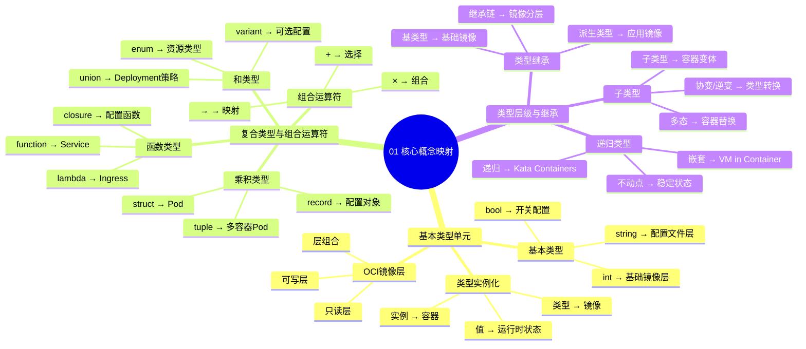

# 01. 核心概念映射：从类型到资源

> **主题编号**: 01
> **主题名称**: 核心概念映射
> **最后更新**: 2025-01-XX

---

## 📋 目录

- [01. 核心概念映射：从类型到资源](#01-核心概念映射从类型到资源)
  - [📋 目录](#-目录)
  - [1 主题概述](#1-主题概述)
    - [1.0 核心概念映射思维导图](#10-核心概念映射思维导图)
  - [2 子主题导航](#2-子主题导航)
    - [2.1 11 基本类型单元](#21-11-基本类型单元)
    - [2.2 12 复合类型与组合运算符](#22-12-复合类型与组合运算符)
    - [2.3 13 类型层级与继承](#23-13-类型层级与继承)
  - [3 相关主题](#3-相关主题)
  - [4 核心概念矩阵](#4-核心概念矩阵)
  - [5 学习路径](#5-学习路径)

---

## 1 主题概述

本主题探讨**类型系统**与**基础设施资源**之间的核心映射关系，揭示编程语言中的类型概念如何对应到虚拟化、容器化和沙盒化技术中的资源抽象。

### 1.0 核心概念映射思维导图

**可视化文档**: 查看 [思维导图与知识矩阵](../思维导图与知识矩阵.md#31-01-核心概念映射) 获取更详细的思维导图。

---

## 2 子主题导航

### 2.1 [11 基本类型单元](011_基本类型单元md)

- OCI镜像层作为原子类型单元
- 镜像层哈希与类型签名的对应
- 不可变性与类型安全

### 2.2 [12 复合类型与组合运算符](012_复合类型与组合运算符md)

- Pod作为容器的乘积类型
- Deployment作为Pod的Σ类型
- 组合运算符（+、×、→）在基础设施中的体现

### 2.3 [13 类型层级与继承](013_类型层级与继承md)

- 镜像分层与类型继承链
- Kata Containers的递归子类型化
- 类型层级在容器化中的体现

---

## 3 相关主题

- [02. 递归结构：分形基础设施](../02_递归结构/README.md)
- [03. 程序控制：声明式即类型推导](../03_程序控制/README.md)
- [09. 形式化理论框架](../09_形式化理论/README.md)

---

## 4 核心概念矩阵

| 编程语言概念 | 基础设施实现 | 类型论对应 |
|------------|-------------|-----------|
| 原子类型 (`int`, `string`) | OCI镜像层 | 基本类型 |
| 乘积类型 (`struct`) | Pod | 积类型 (×) |
| 和类型 (`enum`) | Deployment | 和类型 (+) |
| 函数类型 (`→`) | Service调用 | 函数类型 |
| 子类型 (`extends`) | 镜像分层 | 子类型关系 |

---

## 5 学习路径

1. **入门**: 从 [1.1 基本类型单元](./01.1_基本类型单元.md) 开始
2. **进阶**: 学习 [1.2 复合类型与组合运算符](./01.2_复合类型与组合运算符.md)
3. **深入**: 理解 [1.3 类型层级与继承](./01.3_类型层级与继承.md)

---

**返回**: [主题索引](../README.md)
