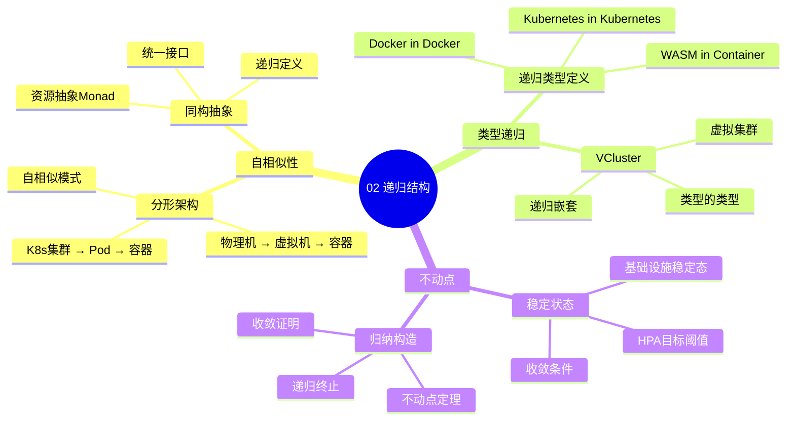

# 02. 递归结构：分形基础设施

> **主题编号**: 02
> **主题名称**: 递归结构
> **最后更新**: 2025-01-XX

---

## 📋 目录

- [02. 递归结构：分形基础设施](#02-递归结构分形基础设施)
  - [📋 目录](#-目录)
  - [1 主题概述](#1-主题概述)
  - [2 子主题导航](#2-子主题导航)
    - [2.1 21 自相似性Fractal Architecture](#21-21-自相似性fractal-architecture)
    - [2.2 22 类型递归的具体体现](#22-22-类型递归的具体体现)
    - [2.3 23 不动点Fixed Point](#23-23-不动点fixed-point)
  - [3 相关主题](#3-相关主题)
  - [4 递归结构层次](#4-递归结构层次)
  - [5 学习路径](#5-学习路径)

---

## 1 主题概述

本主题探讨基础设施的**递归结构**和**分形特性**，揭示虚拟化、容器化和沙盒化技术中的自相似性，以及类型递归在基础设施中的具体体现。

### 1.0 递归结构思维导图



**可视化文档**: 查看 [思维导图与知识矩阵](../思维导图与知识矩阵.md#32-02-递归结构) 获取更详细的思维导图。

---

## 2 子主题导航

### 2.1 [21 自相似性Fractal Architecture](021_自相似性md)

- 物理机到WASM沙盒的分层结构
- 同构的资源抽象Monad
- 分形基础设施的层次模型

### 2.2 [22 类型递归的具体体现](022_类型递归的具体体现md)

- Docker in Docker
- Kubernetes in Kubernetes
- WASM in Container
- VCluster作为类型的类型

### 2.3 [23 不动点Fixed Point](023_不动点md)

- 基础设施的稳定状态
- 归纳构造终点
- HPA达到目标CPU阈值

---

## 3 相关主题

- [01. 核心概念映射：从类型到资源](../01_核心概念映射/README.md)
- [03. 程序控制：声明式即类型推导](../03_程序控制/README.md)
- [09. 形式化理论框架](../09_形式化理论/README.md)

---

## 4 递归结构层次

```text
物理机 (Type-0)
└── 虚拟机监控器 (Type-1 Hypervisor)
    └── 虚拟机 (Type-2)
        └── 容器运行时 (Containerd)
            └── Pod (Container的容器)
                └── 应用进程 (gRPC服务器)
                    └── WASM沙盒 (函数级容器)
                        └── ...
```

---

## 5 学习路径

1. **入门**: 从 [2.1 自相似性](./02.1_自相似性.md) 开始
2. **进阶**: 学习 [2.2 类型递归的具体体现](./02.2_类型递归的具体体现.md)
3. **深入**: 理解 [2.3 不动点](./02.3_不动点.md)

---

**返回**: [主题索引](../README.md)
