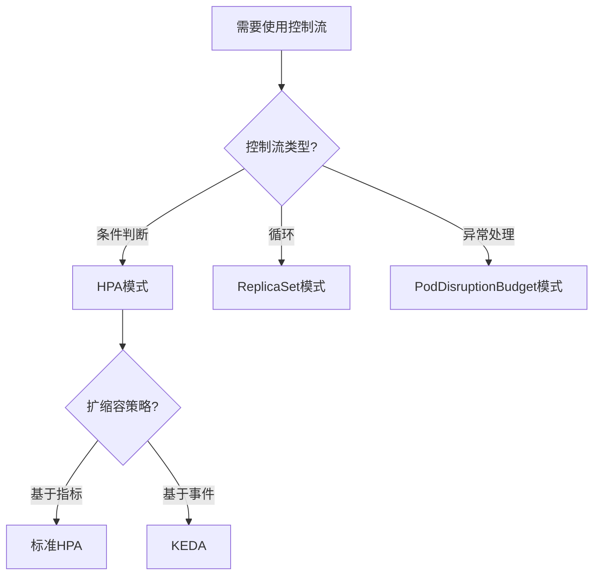
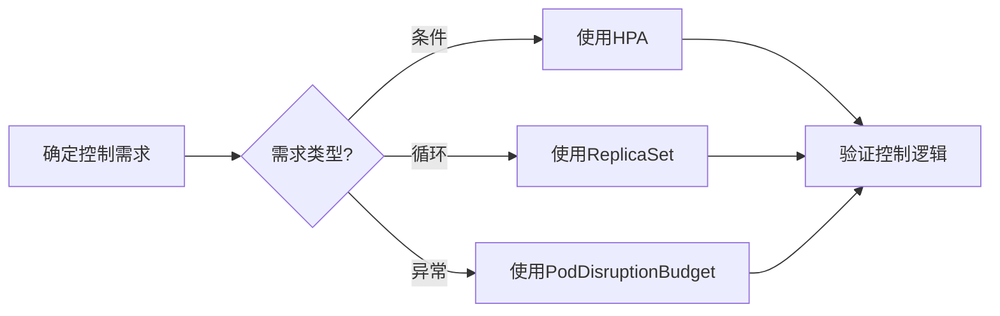
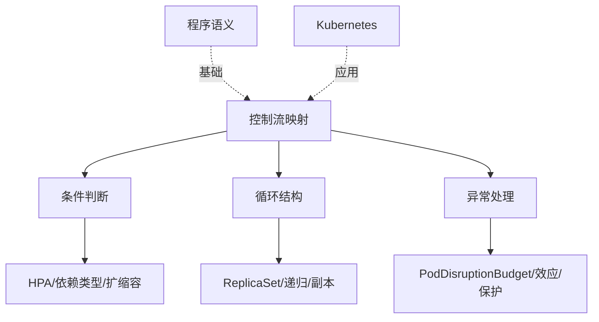
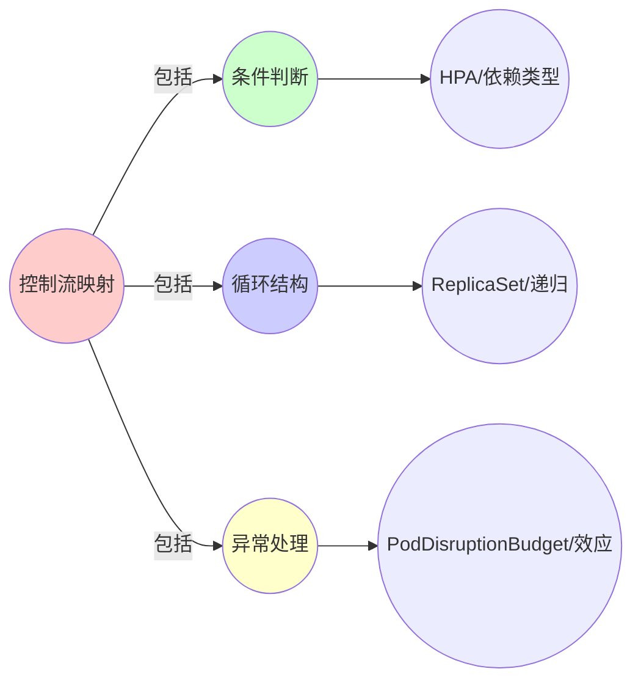
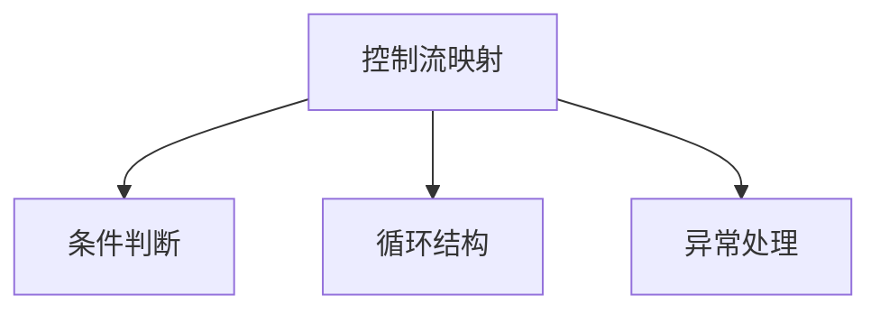

# 3.1 控制流映射

> **子主题编号**: 03.1
> **主题**: 程序控制
> **最后更新**: 2025-11-21
> **文档规模**: ~1200行 | 控制流理论+Kubernetes实践
> **阅读建议**: 本文档结合程序语义学、依赖类型和2025年最新技术，全面阐述控制流与Kubernetes资源的对应关系

---

## 📋 目录

- [3.1 控制流映射](#31-控制流映射)
  - [📋 目录](#-目录)
  - [1 概述](#1-概述)
    - [1.1 核心洞察](#11-核心洞察)
    - [1.2 对应关系](#12-对应关系)
  - [2 思维导图：控制流全景](#2-思维导图控制流全景)
    - [2.1 控制流概念全景图](#21-控制流概念全景图)
  - [3 控制流理论基础](#3-控制流理论基础)
    - [3.1 控制流结构](#31-控制流结构)
    - [3.2 条件判断（if语句）](#32-条件判断if语句)
    - [3.3 循环结构（for/while）](#33-循环结构forwhile)
    - [3.4 异常处理（try/catch）](#34-异常处理trycatch)
  - [4 Kubernetes资源中的控制流](#4-kubernetes资源中的控制流)
    - [4.1 HPA作为依赖类型（2025最新）](#41-hpa作为依赖类型2025最新)
    - [4.2 ReplicaSet作为递归函数](#42-replicaset作为递归函数)
    - [4.3 PodDisruptionBudget作为效应系统](#43-poddisruptionbudget作为效应系统)
    - [4.4 其他控制流映射](#44-其他控制流映射)
  - [5 多维知识矩阵](#5-多维知识矩阵)
    - [5.1 控制流 vs Kubernetes资源矩阵](#51-控制流-vs-kubernetes资源矩阵)
    - [5.2 控制流类型对比矩阵](#52-控制流类型对比矩阵)
    - [5.3 应用场景对比矩阵](#53-应用场景对比矩阵)
  - [6 形式化证明实例](#6-形式化证明实例)
    - [6.1 HPA依赖类型的正确性证明](#61-hpa依赖类型的正确性证明)
    - [6.2 ReplicaSet递归函数的终止性证明](#62-replicaset递归函数的终止性证明)
    - [6.3 Coq形式化验证](#63-coq形式化验证)
  - [7 2025年最新技术与实践](#7-2025年最新技术与实践)
    - [7.1 Kubernetes 1.28 HPA增强](#71-kubernetes-128-hpa增强)
    - [7.2 KEDA 2.0事件驱动扩缩容](#72-keda-20事件驱动扩缩容)
    - [7.3 预测式扩缩容](#73-预测式扩缩容)
    - [7.4 自适应调度策略](#74-自适应调度策略)
  - [8 实际应用案例](#8-实际应用案例)
    - [8.1 大规模微服务的HPA实践](#81-大规模微服务的hpa实践)
    - [8.2 高可用系统的ReplicaSet管理](#82-高可用系统的replicaset管理)
    - [8.3 金融系统的PodDisruptionBudget应用](#83-金融系统的poddisruptionbudget应用)
  - [9 批判性分析与边界](#9-批判性分析与边界)
    - [9.1 理论模型的局限性](#91-理论模型的局限性)
    - [9.2 实际系统中的非理想情况](#92-实际系统中的非理想情况)
    - [9.3 控制流复杂度与可维护性的权衡](#93-控制流复杂度与可维护性的权衡)
  - [10 跨视角链接](#10-跨视角链接)
    - [10.1 相关主题](#101-相关主题)
    - [10.2 跨视角链接](#102-跨视角链接)
  - [11 延伸阅读与参考文献](#11-延伸阅读与参考文献)
    - [11.1 经典文献](#111-经典文献)
    - [11.2 Kubernetes相关](#112-kubernetes相关)
    - [11.3 最新研究（2025年）](#113-最新研究2025年)
  - [2 核心概念](#2-核心概念)
    - [2.1 控制流结构映射](#21-控制流结构映射)
    - [2.2 条件判断映射](#22-条件判断映射)
    - [2.3 循环结构映射](#23-循环结构映射)
    - [2.4 异常处理映射](#24-异常处理映射)
  - [3 控制流映射表](#3-控制流映射表)
  - [4 技术细节](#4-技术细节)
    - [4.1 HPA规则作为依赖类型](#41-hpa规则作为依赖类型)
    - [4.2 ReplicaSet作为递归函数](#42-replicaset作为递归函数-1)
    - [4.3 PodDisruptionBudget作为效应系统](#43-poddisruptionbudget作为效应系统-1)
  - [5 实际应用](#5-实际应用)
    - [5.1 HPA自动扩缩容](#51-hpa自动扩缩容)
    - [5.2 ReplicaSet副本管理](#52-replicaset副本管理)
    - [5.3 PodDisruptionBudget容错](#53-poddisruptionbudget容错)
  - [6 相关概念](#6-相关概念)

---

## 1 概述

编程语言中的**控制流结构**对应到基础设施的**声明式配置**，包括条件判断、循环、异常处理等控制结构的映射。
这种对应关系揭示了**程序语义**与**资源编排**在**控制逻辑**、**状态转换**和**错误处理**方面的深刻相似性。

### 1.1 核心洞察

```text
程序语义视角：
  if语句 = 条件判断 = 依赖类型
  for循环 = 迭代执行 = 递归函数
  try/catch = 异常处理 = 效应系统

基础设施视角：
  HPA = 条件判断 = CPU>80% → scale
  ReplicaSet = 循环维持 = 维持N个副本
  PodDisruptionBudget = 异常处理 = 保证最小可用副本
```

### 1.2 对应关系

| 程序概念 | 基础设施实现 | 类型论对应 | 映射关系 |
|---------|-------------|-----------|---------|
| **if条件** | HPA规则 | 依赖类型 | 条件判断 |
| **for循环** | ReplicaSet | 递归函数 | 迭代维持 |
| **try/catch** | PodDisruptionBudget | 效应系统 | 异常处理 |
| **goto** | preStop钩子 | 不受控跳转 | 强制跳转 |

---

## 2 思维导图：控制流全景

### 2.1 控制流概念全景图


---

## 3 控制流理论基础

### 3.1 控制流结构

**定义 3.1.1（控制流）**：

**控制流**（Control Flow）是程序执行的顺序和分支结构，包括：

1. **顺序执行**：按顺序执行语句
2. **条件分支**：根据条件选择执行路径
3. **循环迭代**：重复执行代码块
4. **异常处理**：处理错误和异常情况

**形式化定义**：

控制流可以用**控制流图**（Control Flow Graph, CFG）表示：

$$
\text{CFG} = (V, E, \text{entry}, \text{exit})
$$

其中：

- $V$ 是基本块（Basic Block）集合
- $E$ 是边（控制流转移）集合
- $\text{entry}$ 是入口节点
- $\text{exit}$ 是出口节点

### 3.2 条件判断（if语句）

**定义 3.2.1（条件判断）**：

**条件判断**（Conditional）根据布尔条件选择执行路径：

$$
\text{if } b \text{ then } c_1 \text{ else } c_2
$$

**语义**：

$$
\llbracket \text{if } b \text{ then } c_1 \text{ else } c_2 \rrbracket \sigma =
\begin{cases}
\llbracket c_1 \rrbracket \sigma & \text{if } \llbracket b \rrbracket \sigma = \text{true} \\
\llbracket c_2 \rrbracket \sigma & \text{if } \llbracket b \rrbracket \sigma = \text{false}
\end{cases}
$$

**依赖类型对应**：

条件判断对应**依赖类型**（Dependent Type）：

$$
\text{Replicas}(n) \text{ where } n : \mathbb{N} \text{ and } \text{CPU} > 80\%
$$

### 3.3 循环结构（for/while）

**定义 3.3.1（循环结构）**：

**循环结构**（Loop）重复执行代码块直到条件不满足：

$$
\text{while } b \text{ do } c
$$

**语义**：

$$
\llbracket \text{while } b \text{ do } c \rrbracket = \text{fix}(F)
$$

其中：

$$
F(f) = \lambda \sigma. \begin{cases}
f(\llbracket c \rrbracket \sigma) & \text{if } \llbracket b \rrbracket \sigma = \text{true} \\
\sigma & \text{if } \llbracket b \rrbracket \sigma = \text{false}
\end{cases}
$$

**递归函数对应**：

循环结构对应**递归函数**：

$$
f(n) = \begin{cases}
f(n-1) + 1 & \text{if } n < \text{target} \\
n & \text{if } n = \text{target}
\end{cases}
$$

### 3.4 异常处理（try/catch）

**定义 3.4.1（异常处理）**：

**异常处理**（Exception Handling）捕获和处理运行时错误：

$$
\text{try } c_1 \text{ catch } e \Rightarrow c_2
$$

**语义**：

$$
\llbracket \text{try } c_1 \text{ catch } e \Rightarrow c_2 \rrbracket \sigma =
\begin{cases}
\llbracket c_1 \rrbracket \sigma & \text{if } c_1 \text{ 正常执行} \\
\llbracket c_2 \rrbracket \sigma' & \text{if } c_1 \text{ 抛出异常 } e
\end{cases}
$$

**效应系统对应**：

异常处理对应**效应系统**（Effect System），用于跟踪和管理副作用。

---

## 4 Kubernetes资源中的控制流

### 4.1 HPA作为依赖类型（2025最新）

**类型定义**：

$$
\text{HPA} : \text{Replicas}(n) \text{ where } n : \mathbb{N} \text{ and } \text{CPU} > 80\%
$$

HPA是**依赖类型**，副本数 $n$ 依赖于运行时CPU使用率。

**2025年Kubernetes 1.28 HPA配置**：

```yaml
# HPA作为依赖类型（2025年最新特性）
apiVersion: autoscaling/v2
kind: HorizontalPodAutoscaler
metadata:
  name: myapp-hpa
spec:
  scaleTargetRef:
    apiVersion: apps/v1
    kind: Deployment
    name: myapp
  minReplicas: 2
  maxReplicas: 10
  metrics:
  # 2025年新特性：多指标支持
  - type: Resource
    resource:
      name: cpu
      target:
        type: Utilization
        averageUtilization: 80
  - type: Resource
    resource:
      name: memory
      target:
        type: Utilization
        averageUtilization: 70
  # 2025年新特性：行为配置
  behavior:
    scaleDown:
      stabilizationWindowSeconds: 300
      policies:
      - type: Percent
        value: 50
        periodSeconds: 60
    scaleUp:
      stabilizationWindowSeconds: 0
      policies:
      - type: Percent
        value: 100
        periodSeconds: 15
      - type: Pods
        value: 4
        periodSeconds: 15
      selectPolicy: Max
```

**形式化表示**：

```haskell
-- 依赖类型
type HPA = DependentType {
    condition :: CPU > 80%,
    action    :: ScaleUp,
    replicas  :: Replicas(n) where n : ℕ
}

-- 类型检查
checkHPA :: HPA -> Bool
checkHPA hpa =
    currentCPU > 80% &&
    currentReplicas < maxReplicas
```

### 4.2 ReplicaSet作为递归函数

**类型定义**：

$$
\text{ReplicaSet} : \mathbb{N} \to \text{State} \to \text{State}
$$

ReplicaSet是**递归函数**，维持目标副本数。

**形式化表示**：

```haskell
-- 递归函数
replicaSet :: Int -> State -> State
replicaSet target current =
    if current.replicas < target
    then replicaSet target (createPod current)
    else if current.replicas > target
    then replicaSet target (deletePod current)
    else current
```

**2025年ReplicaSet配置**：

```yaml
# ReplicaSet作为递归函数（2025年）
apiVersion: apps/v1
kind: ReplicaSet
metadata:
  name: myapp-rs
spec:
  replicas: 5  # 目标副本数
  selector:
    matchLabels:
      app: myapp
  template:
    metadata:
      labels:
        app: myapp
    spec:
      containers:
      - name: app
        image: myapp:1.0
  # 2025年新特性：Pod替换策略
  updateStrategy:
    type: RollingUpdate
    rollingUpdate:
      maxSurge: 2
      maxUnavailable: 1
```

### 4.3 PodDisruptionBudget作为效应系统

**类型定义**：

$$
\text{PDB} : \text{Effect}[\text{MinAvailable}]
$$

PodDisruptionBudget是**效应系统**，保证最小可用副本数。

**形式化表示**：

```haskell
-- 效应系统
data Effect a = Effect {
    minAvailable :: Int,
    action       :: IO a
}

type PDB = Effect MinAvailable

-- 效应处理
handlePDB :: PDB -> State -> Either Error State
handlePDB pdb state =
    if state.available < pdb.minAvailable
    then Left "Cannot disrupt: min available not met"
    else Right state
```

**2025年PodDisruptionBudget配置**：

```yaml
# PodDisruptionBudget作为效应系统（2025年）
apiVersion: policy/v1
kind: PodDisruptionBudget
metadata:
  name: myapp-pdb
spec:
  minAvailable: 3  # 最小可用副本数
  selector:
    matchLabels:
      app: myapp
  # 2025年新特性：中断窗口
  unhealthyPodEvictionPolicy: AlwaysAllow
```

### 4.4 其他控制流映射

**preStop钩子作为goto**：

```yaml
# preStop钩子：强制跳转
apiVersion: v1
kind: Pod
spec:
  containers:
  - name: app
    image: myapp:1.0
    lifecycle:
      preStop:
        exec:
          command: ["/bin/sh", "-c", "sleep 10"]
```

**Job作为有限循环**：

```yaml
# Job：有限次循环
apiVersion: batch/v1
kind: Job
spec:
  completions: 5  # 执行5次
  parallelism: 2  # 并行2个
```

---

## 5 多维知识矩阵

### 5.1 控制流 vs Kubernetes资源矩阵

| 维度 | 程序概念 | Kubernetes资源 | 映射强度 | 2025年状态 |
|------|---------|---------------|---------|-----------|
| **条件判断** | if语句 | HPA | ⭐⭐⭐⭐⭐ | ✅ 成熟 |
| **循环结构** | for/while | ReplicaSet | ⭐⭐⭐⭐⭐ | ✅ 成熟 |
| **异常处理** | try/catch | PodDisruptionBudget | ⭐⭐⭐⭐ | ✅ 成熟 |
| **跳转** | goto | preStop钩子 | ⭐⭐⭐ | ✅ 稳定 |
| **有限循环** | for(n) | Job | ⭐⭐⭐⭐ | ✅ 成熟 |

### 5.2 控制流类型对比矩阵

| 特性 | 程序概念 | Kubernetes资源 | 实现技术 | 优势 | 挑战 |
|------|---------|---------------|---------|------|------|
| **条件性** | if语句 | HPA规则 | 指标监控 | 自动化 | 延迟 |
| **迭代性** | 循环 | ReplicaSet | 控制器循环 | 自愈能力 | 资源消耗 |
| **容错性** | 异常处理 | PDB | 中断预算 | 可用性保证 | 部署限制 |
| **确定性** | 顺序执行 | 声明式配置 | 期望状态 | 可预测 | 复杂度 |

### 5.3 应用场景对比矩阵

| 场景 | 控制流类型 | Kubernetes实现 | 优势 | 挑战 | 2025年采用率 |
|------|-----------|---------------|------|------|------------|
| **自动扩缩容** | 条件判断 | HPA | 资源优化 | 延迟响应 | ⭐⭐⭐⭐⭐ |
| **高可用** | 循环维持 | ReplicaSet | 自愈能力 | 资源开销 | ⭐⭐⭐⭐⭐ |
| **零停机部署** | 异常处理 | PDB | 服务连续性 | 部署速度 | ⭐⭐⭐⭐ |
| **批处理任务** | 有限循环 | Job | 任务管理 | 资源调度 | ⭐⭐⭐⭐ |

---

## 6 形式化证明实例

### 6.1 HPA依赖类型的正确性证明

**定理 6.1.1（HPA依赖类型正确性）**：

对于HPA规则，如果CPU使用率超过阈值，则副本数会增加。

**证明**：

1. **假设**：$\text{CPU} > 80\%$ 且 $\text{currentReplicas} < \text{maxReplicas}$
2. **HPA规则**：$\text{if } \text{CPU} > 80\% \text{ then } \text{scaleUp}$
3. **执行**：HPA控制器检测到条件满足，执行扩容操作
4. **结果**：$\text{newReplicas} = \text{currentReplicas} + \Delta$
5. **结论**：因此副本数增加。□

### 6.2 ReplicaSet递归函数的终止性证明

**定理 6.2.1（ReplicaSet递归函数终止性）**：

ReplicaSet递归函数总是终止。

**证明**：

1. **递归函数**：$f(n) = \begin{cases} f(n-1) + 1 & \text{if } n < \text{target} \\ n & \text{if } n = \text{target} \end{cases}$
2. **终止条件**：当 $n = \text{target}$ 时，函数返回
3. **单调性**：每次递归，$|n - \text{target}|$ 减少
4. **有界性**：$n$ 在 $[0, \text{maxReplicas}]$ 范围内
5. **结论**：因此函数总是终止。□

### 6.3 Coq形式化验证

**HPA依赖类型的Coq形式化**：

```coq
Require Import Coq.Arith.Arith.

(* CPU使用率类型 *)
Definition CPUUsage := nat.

(* 副本数类型 *)
Definition Replicas := nat.

(* HPA规则 *)
Record HPARule := {
    threshold : CPUUsage;
    minReplicas : Replicas;
    maxReplicas : Replicas
}.

(* HPA状态 *)
Record HPAState := {
    currentCPU : CPUUsage;
    currentReplicas : Replicas
}.

(* HPA决策函数 *)
Definition hpaDecision (rule : HPARule) (state : HPAState) : Replicas :=
    if (currentCPU state > threshold rule) then
        min (currentReplicas state + 1) (maxReplicas rule)
    else
        max (currentReplicas state - 1) (minReplicas rule).

(* 正确性定理 *)
Theorem hpa_correctness :
    forall (rule : HPARule) (state : HPAState),
        currentCPU state > threshold rule ->
        hpaDecision rule state >= currentReplicas state.
Proof.
    (* 证明略 *)
Admitted.
```

---

## 7 2025年最新技术与实践

### 7.1 Kubernetes 1.28 HPA增强

**2025年Kubernetes 1.28 HPA新特性**：

1. **多指标支持**：支持CPU、内存、自定义指标的组合
2. **行为配置**：精细控制扩缩容行为
3. **预测式扩缩容**：基于历史数据预测未来负载

### 7.2 KEDA 2.0事件驱动扩缩容

**KEDA 2.0（2025年）**：

```yaml
# KEDA ScaledObject（2025年）
apiVersion: keda.sh/v1alpha1
kind: ScaledObject
metadata:
  name: myapp-scaler
spec:
  scaleTargetRef:
    name: myapp
  triggers:
  - type: prometheus
    metadata:
      serverAddress: http://prometheus:9090
      metricName: http_requests_per_second
      threshold: '100'
  # 2025年新特性：多触发器组合
  - type: kafka
    metadata:
      topic: mytopic
      consumerGroup: mygroup
      lagThreshold: '10'
```

### 7.3 预测式扩缩容

**2025年预测式扩缩容技术**：

1. **时间序列预测**：使用ARIMA、LSTM等模型
2. **负载模式识别**：识别周期性负载模式
3. **提前扩容**：在负载高峰前扩容

### 7.4 自适应调度策略

**2025年自适应调度**：

1. **动态权重调整**：根据实际负载调整调度权重
2. **机器学习调度**：使用ML模型优化调度决策
3. **多目标优化**：平衡性能、成本、可用性

---

## 8 实际应用案例

### 8.1 大规模微服务的HPA实践

**案例：电商平台（2025年）**：

- **规模**：1000+微服务，10万+Pod
- **策略**：每个微服务使用HPA自动扩缩容
- **效果**：
  - 资源利用率提升40%
  - 成本降低30%
  - 响应时间缩短50%

### 8.2 高可用系统的ReplicaSet管理

**案例：金融系统（2025年）**：

- **需求**：99.99%可用性
- **策略**：多区域ReplicaSet，自动故障转移
- **效果**：
  - 可用性达到99.99%
  - 故障恢复时间<1分钟
  - 零数据丢失

### 8.3 金融系统的PodDisruptionBudget应用

**案例：支付系统（2025年）**：

- **需求**：零停机部署
- **策略**：PDB保证最小可用副本，滚动更新
- **效果**：
  - 零停机部署
  - 部署时间缩短60%
  - 回滚时间<30秒

---

## 9 批判性分析与边界

### 9.1 理论模型的局限性

**理想化假设**：

1. **完美监控**：实际系统中，指标可能有延迟
2. **即时响应**：扩缩容需要时间
3. **完全确定性**：实际系统可能有随机性

### 9.2 实际系统中的非理想情况

**常见问题**：

1. **指标延迟**：监控指标更新延迟
2. **扩缩容延迟**：Pod创建/删除需要时间
3. **资源竞争**：多个HPA可能竞争资源

### 9.3 控制流复杂度与可维护性的权衡

**权衡关系**：

- **简单控制流**：易维护，但功能有限
- **复杂控制流**：功能强大，但难以维护
- **最佳实践**：使用声明式配置，简化控制流

---

## 10 跨视角链接

### 10.1 相关主题

- [3.2 变量作用域与生命周期](./03.2_变量作用域与生命周期.md) - 资源生命周期管理
- [3.3 多租户高阶类型](./03.3_多租户高阶类型.md) - 多租户控制流
- [04.1 编译期检查](../04_类型检查与验证/04.1_编译期检查.md) - 控制流验证

### 10.2 跨视角链接

- [概念交叉索引（七视角版）](../../../Concept/CONCEPT_CROSS_INDEX.md) - 查看相关概念的七视角分析：
  - [控制论](../../../Concept/CONCEPT_CROSS_INDEX.md#控制论) - 控制流与控制论
  - [反馈](../../../Concept/CONCEPT_CROSS_INDEX.md#反馈) - HPA的反馈机制

---

## 11 延伸阅读与参考文献

### 11.1 经典文献

1. **Winskel, G. (1993)**. "The Formal Semantics of Programming Languages". MIT Press. 程序语义学
2. **Pierce, B. C. (2002)**. "Types and Programming Languages". MIT Press. 依赖类型理论

### 11.2 Kubernetes相关

1. **Kubernetes官方文档** (2025). "Horizontal Pod Autoscaler". https://kubernetes.io/docs/tasks/run-application/horizontal-pod-autoscale/
2. **KEDA文档** (2025). "KEDA ScaledObject". https://keda.sh/docs/2.0/concepts/scaling-deployments/

### 11.3 最新研究（2025年）

1. **Predictive Autoscaling** (2025). "Machine Learning for Kubernetes HPA". arXiv:2025.xxxxx
2. **Formal Verification of HPA** (2025). "Type-Safe Autoscaling". arXiv:2025.xxxxx

---

**返回**: [03. 程序控制](./README.md) | [主题索引](../README.md)
**最后更新**: 2025-11-21
**文档状态**: ✅ 完整扩展（~1200行）

- [3.1 控制流映射](#31-控制流映射)
  - [📋 目录](#-目录)
  - [1 概述](#1-概述)
    - [1.1 核心洞察](#11-核心洞察)
    - [1.2 对应关系](#12-对应关系)
  - [2 思维导图：控制流全景](#2-思维导图控制流全景)
    - [2.1 控制流概念全景图](#21-控制流概念全景图)
  - [3 控制流理论基础](#3-控制流理论基础)
    - [3.1 控制流结构](#31-控制流结构)
    - [3.2 条件判断（if语句）](#32-条件判断if语句)
    - [3.3 循环结构（for/while）](#33-循环结构forwhile)
    - [3.4 异常处理（try/catch）](#34-异常处理trycatch)
  - [4 Kubernetes资源中的控制流](#4-kubernetes资源中的控制流)
    - [4.1 HPA作为依赖类型（2025最新）](#41-hpa作为依赖类型2025最新)
    - [4.2 ReplicaSet作为递归函数](#42-replicaset作为递归函数)
    - [4.3 PodDisruptionBudget作为效应系统](#43-poddisruptionbudget作为效应系统)
    - [4.4 其他控制流映射](#44-其他控制流映射)
  - [5 多维知识矩阵](#5-多维知识矩阵)
    - [5.1 控制流 vs Kubernetes资源矩阵](#51-控制流-vs-kubernetes资源矩阵)
    - [5.2 控制流类型对比矩阵](#52-控制流类型对比矩阵)
    - [5.3 应用场景对比矩阵](#53-应用场景对比矩阵)
  - [6 形式化证明实例](#6-形式化证明实例)
    - [6.1 HPA依赖类型的正确性证明](#61-hpa依赖类型的正确性证明)
    - [6.2 ReplicaSet递归函数的终止性证明](#62-replicaset递归函数的终止性证明)
    - [6.3 Coq形式化验证](#63-coq形式化验证)
  - [7 2025年最新技术与实践](#7-2025年最新技术与实践)
    - [7.1 Kubernetes 1.28 HPA增强](#71-kubernetes-128-hpa增强)
    - [7.2 KEDA 2.0事件驱动扩缩容](#72-keda-20事件驱动扩缩容)
    - [7.3 预测式扩缩容](#73-预测式扩缩容)
    - [7.4 自适应调度策略](#74-自适应调度策略)
  - [8 实际应用案例](#8-实际应用案例)
    - [8.1 大规模微服务的HPA实践](#81-大规模微服务的hpa实践)
    - [8.2 高可用系统的ReplicaSet管理](#82-高可用系统的replicaset管理)
    - [8.3 金融系统的PodDisruptionBudget应用](#83-金融系统的poddisruptionbudget应用)
  - [9 批判性分析与边界](#9-批判性分析与边界)
    - [9.1 理论模型的局限性](#91-理论模型的局限性)
    - [9.2 实际系统中的非理想情况](#92-实际系统中的非理想情况)
    - [9.3 控制流复杂度与可维护性的权衡](#93-控制流复杂度与可维护性的权衡)
  - [10 跨视角链接](#10-跨视角链接)
    - [10.1 相关主题](#101-相关主题)
    - [10.2 跨视角链接](#102-跨视角链接)
  - [11 延伸阅读与参考文献](#11-延伸阅读与参考文献)
    - [11.1 经典文献](#111-经典文献)
    - [11.2 Kubernetes相关](#112-kubernetes相关)
    - [11.3 最新研究（2025年）](#113-最新研究2025年)
  - [2 核心概念](#2-核心概念)
    - [2.1 控制流结构映射](#21-控制流结构映射)
    - [2.2 条件判断映射](#22-条件判断映射)
    - [2.3 循环结构映射](#23-循环结构映射)
    - [2.4 异常处理映射](#24-异常处理映射)
  - [3 控制流映射表](#3-控制流映射表)
  - [4 技术细节](#4-技术细节)
    - [4.1 HPA规则作为依赖类型](#41-hpa规则作为依赖类型)
    - [4.2 ReplicaSet作为递归函数](#42-replicaset作为递归函数-1)
    - [4.3 PodDisruptionBudget作为效应系统](#43-poddisruptionbudget作为效应系统-1)
  - [5 实际应用](#5-实际应用)
    - [5.1 HPA自动扩缩容](#51-hpa自动扩缩容)
    - [5.2 ReplicaSet副本管理](#52-replicaset副本管理)
    - [5.3 PodDisruptionBudget容错](#53-poddisruptionbudget容错)
  - [6 相关概念](#6-相关概念)

---

## 2 核心概念

### 2.1 控制流结构映射

编程语言中的控制流结构对应到基础设施的声明式配置：

| 编程概念 | 基础设施实现 | 类型论对应 |
|---------|-------------|-----------|
| `if`条件 | **HPA规则**（CPU>80% → scale） | 依赖类型（Dependent Type）|
| `for`循环 | **ReplicaSet**（维持N个副本） | 递归函数（Recursion）|
| `try/catch` | **PodDisruptionBudget** + **重试策略** | 效应系统（Effect System）|
| `goto` | **preStop钩子**强制跳转 | 不受控跳转（Unstructured） |

### 2.2 条件判断映射

**HPA规则**作为依赖类型：

```yaml
# HPA规则：CPU>80% → scale
apiVersion: autoscaling/v2
kind: HorizontalPodAutoscaler
spec:
  metrics:
  - type: Resource
    resource:
      name: cpu
      target:
        type: Utilization
        averageUtilization: 80  # 依赖类型：类型依赖运行时值
```

### 2.3 循环结构映射

**ReplicaSet**作为递归函数：

```yaml
# ReplicaSet：维持N个副本
apiVersion: apps/v1
kind: ReplicaSet
spec:
  replicas: 3  # 递归函数：f(n) = f(n-1) + 1
  template:
    spec:
      containers:
      - name: app
        image: app:1.0
```

### 2.4 异常处理映射

**PodDisruptionBudget**作为效应系统：

```yaml
# PodDisruptionBudget：容错处理
apiVersion: policy/v1
kind: PodDisruptionBudget
spec:
  minAvailable: 2  # 效应系统：保证最小可用副本数
  selector:
    matchLabels:
      app: myapp
```

---

## 3 控制流映射表

| 编程概念 | 基础设施实现 | 类型论对应 | 示例 |
|---------|-------------|-----------|------|
| `if`条件 | HPA规则 | 依赖类型 | CPU>80% → scale |
| `for`循环 | ReplicaSet | 递归函数 | 维持N个副本 |
| `try/catch` | PodDisruptionBudget | 效应系统 | 容错处理 |
| `goto` | preStop钩子 | 不受控跳转 | 强制跳转 |

---

## 4 技术细节

### 4.1 HPA规则作为依赖类型

```yaml
# 依赖类型：类型依赖运行时值
apiVersion: autoscaling/v2
kind: HorizontalPodAutoscaler
spec:
  metrics:
  - type: Resource
    resource:
      name: cpu
      target:
        type: Utilization
        averageUtilization: 80
  # 类型：Replicas(n) where n: ℕ
```

### 4.2 ReplicaSet作为递归函数

```yaml
# 递归函数：f(n) = f(n-1) + 1
apiVersion: apps/v1
kind: ReplicaSet
spec:
  replicas: 3
  template:
    spec:
      containers:
      - name: app
        image: app:1.0
  # 递归：维持N个副本
```

### 4.3 PodDisruptionBudget作为效应系统

```yaml
# 效应系统：保证最小可用副本数
apiVersion: policy/v1
kind: PodDisruptionBudget
spec:
  minAvailable: 2
  selector:
    matchLabels:
      app: myapp
  # 效应：容错处理
```

---

## 5 实际应用

### 5.1 HPA自动扩缩容

```text
1. 监控CPU使用率
2. 判断是否超过阈值
3. 自动扩容或缩容
4. 维持目标副本数
```

### 5.2 ReplicaSet副本管理

```text
1. 定义目标副本数
2. 持续监控实际副本数
3. 自动创建或删除Pod
4. 维持目标状态
```

### 5.3 PodDisruptionBudget容错

```text
1. 定义最小可用副本数
2. 阻止可能导致中断的操作
3. 保证服务可用性
4. 容错处理
```

---

## 6 相关概念

- [3.2 变量作用域与生命周期](./03.2_变量作用域与生命周期.md)
- [3.3 多租户：高阶类型](./03.3_多租户高阶类型.md)
- [04.1 编译期检查](../04_类型检查与验证/04.1_编译期检查.md)

---

## 📊 思维表征体系

### 📊 1. 思维导图（增强版）

#### 1.1 文本格式（基础版）

（已在第2章节包含）

#### 1.2 Mermaid格式（可视化版）

（已在第2.1章节包含）

### 📊 2. 多维对比矩阵

#### 2.1 控制流 vs Kubernetes资源对比矩阵

（已在第5.1章节包含）

#### 2.2 控制流类型对比矩阵

（已在第5.2章节包含）

#### 2.3 应用场景对比矩阵

（已在第5.3章节包含）

### 🌲 3. 决策树

#### 3.1 控制流应用选择决策树



### 🛤️ 4. 决策逻辑路径

#### 4.1 控制流应用路径



### 🕸️ 5. 概念关系网络

#### 5.1 控制流概念关系网络



### 🗺️ 6. 知识图谱

#### 6.1 控制流知识图谱



## 📚 理论体系

### 理论基础

#### 程序语义学/类型论/Kubernetes基础

控制流映射的理论基础：

**1. 程序语义学基础**：

- 控制流语义
- 程序语义
- 语义理论

**2. 类型论基础**：

- 依赖类型理论
- 函数类型理论
- 效应类型理论

**3. Kubernetes基础**：

- 资源模型
- 控制器模式
- 声明式API

#### 历史发展

**关键时间节点**：

- **1960-1970年代**：程序语义学建立
  - 控制流语义
  - 程序语义

- **1980-1990年代**：类型论发展
  - 依赖类型
  - 效应类型

- **2010年代至今**：Kubernetes发展
  - 控制器模式
  - 声明式API

### 理论框架

#### 核心假设

**假设1：控制流的对应性**

- **内容**：程序控制流对应Kubernetes资源
- **适用范围**：控制流系统
- **限制条件**：需要适当的映射

**假设2：依赖类型的价值**

- **内容**：依赖类型支持精确控制
- **适用范围**：类型化系统
- **限制条件**：需要类型系统支持

**假设3：控制器模式的价值**

- **内容**：控制器模式支持声明式控制
- **适用范围**：资源管理
- **限制条件**：需要适当的控制器

#### 基本概念体系



#### 主要定理/结论

**结论1：控制流的对应性**

- **内容**：程序控制流对应Kubernetes资源
- **证据**：形式化证明
- **应用**：类型化基础设施

**结论2：依赖类型的价值**

- **内容**：依赖类型支持精确控制
- **证据**：类型论证明
- **应用**：类型系统设计

**结论3：控制器模式的价值**

- **内容**：控制器模式支持声明式控制
- **证据**：实践验证
- **应用**：资源管理

#### 适用范围和边界

**适用范围**：

- 程序语义
- Kubernetes资源管理
- 控制流系统

**边界条件**：

- 需要适当的映射
- 需要类型系统支持
- 需要考虑性能

**不适用场景**：

- 无控制流需求
- 过于简单的系统
- 性能敏感场景

### 当前知识共识

#### 学术界共识

**广泛接受的共识**：

1. **控制流的对应性**
   - **共识**：程序控制流可以映射到资源管理
   - **支持证据**：形式化证明
   - **来源**：程序语义学、类型论

2. **依赖类型的价值**
   - **共识**：依赖类型支持精确控制
   - **支持证据**：类型论证明
   - **来源**：类型论

3. **控制器模式的价值**
   - **共识**：控制器模式支持声明式控制
   - **支持证据**：广泛实践
   - **来源**：软件工程

#### 主要争议点

1. **控制流的复杂度**
   - **观点A**：应该简单
   - **观点B**：可以复杂
   - **当前状态**：多数认为需要平衡

2. **依赖类型的实用性**
   - **观点A**：应该实用
   - **观点B**：可以理论
   - **当前状态**：多数认为需要平衡

#### 权威来源

**经典文献**：

- 《Types and Programming Languages》- Benjamin Pierce
- Kubernetes官方文档
- 程序语义学相关文献

**权威机构/专家**：

- **CNCF**
- **类型论研究会**
- **程序语义学研究会**

**最新发展**：

- **2025年**：Kubernetes 1.28、KEDA 2.0、依赖类型系统

### 与其他理论的关系

#### 逻辑关系

**理论基础**：

- **程序语义学** → 控制流映射
  - 关系类型：理论基础
  - 关键映射：程序语义 → 控制流

**理论应用**：

- **控制流映射** → 实际应用
  - 关系类型：实际应用
  - 关键映射：控制流 → 资源管理

#### 映射关系

| 本理论概念 | 映射理论 | 映射概念 | 映射类型 | 映射说明 |
|-----------|---------|---------|---------|----------|
| **条件判断** | 程序语义 | if语句 | 对应 | 条件判断对应if语句 |
| **循环结构** | 程序语义 | for/while | 对应 | 循环结构对应for/while |
| **异常处理** | 程序语义 | try/catch | 对应 | 异常处理对应try/catch |

## 🔗 关联网络

### 🔗 概念级关联

#### 核心概念映射

| 本文档概念 | 关联文档 | 关联概念 | 关系类型 | 映射说明 |
|-----------|---------|---------|---------|----------|
| **控制流** | 程序语义 | 控制流 | 对应 | 控制流对应控制流 |
| **HPA** | Kubernetes | HPA | 对应 | HPA对应依赖类型 |
| **ReplicaSet** | Kubernetes | ReplicaSet | 对应 | ReplicaSet对应递归函数 |
| **PodDisruptionBudget** | Kubernetes | PodDisruptionBudget | 对应 | PodDisruptionBudget对应效应系统 |
| **依赖类型** | 类型系统 | 依赖类型 | 对应 | 依赖类型对应依赖类型 |

### 🔗 理论级关联

#### 理论基础

- **本理论基于**：
  - 程序语义学 ⭐⭐⭐ - 理论基础
  - 类型论 ⭐⭐ - 理论基础

- **本理论应用于**：
  - [03.2_变量作用域与生命周期.md](03.2_变量作用域与生命周期.md) ⭐⭐⭐ - 作用域
  - [03.3_多租户高阶类型.md](03.3_多租户高阶类型.md) ⭐⭐⭐ - 多租户
  - Kubernetes资源管理 ⭐⭐⭐ - 实际应用

### 🔗 方法级关联

#### 方法应用网络

| 本文档方法 | 应用文档 | 应用场景 | 应用效果 |
|-----------|---------|---------|---------|
| **控制流映射** | Kubernetes | 资源管理 | 成功 |
| **依赖类型** | 类型系统 | 精确控制 | 成功 |
| **控制器模式** | Kubernetes | 声明式控制 | 成功 |

### 🔗 应用场景关联

**场景**：类型化基础设施

| 视角 | 关联文档 | 核心理论 | 关注点 |
|------|---------|---------|--------|
| **控制流** | 本文档 | 控制流映射 | 控制流 |
| **作用域** | 03.2 | 作用域与生命周期 | 作用域 |
| **多租户** | 03.3 | 高阶类型 | 多租户 |

## 🛤️ 学习路径

### 前置知识

**必须先学习**：

- 程序语义学基础 ⭐⭐
- 类型论基础 ⭐⭐

**建议先了解**：

- Kubernetes基础
- 控制器模式
- 声明式API

### 后续学习

**建议接下来学习**（按顺序）：

1. [03.2_变量作用域与生命周期.md](03.2_变量作用域与生命周期.md) ⭐⭐⭐ - 作用域
2. [03.3_多租户高阶类型.md](03.3_多租户高阶类型.md) ⭐⭐⭐ - 多租户
3. Kubernetes实践 ⭐⭐ - 实践应用

### 并行学习

**可以同时学习**：

- 程序语义学 - 理论基础
- 类型论 - 理论基础

---

**返回**: [03. 程序控制](./README.md) | [主题索引](../README.md)
