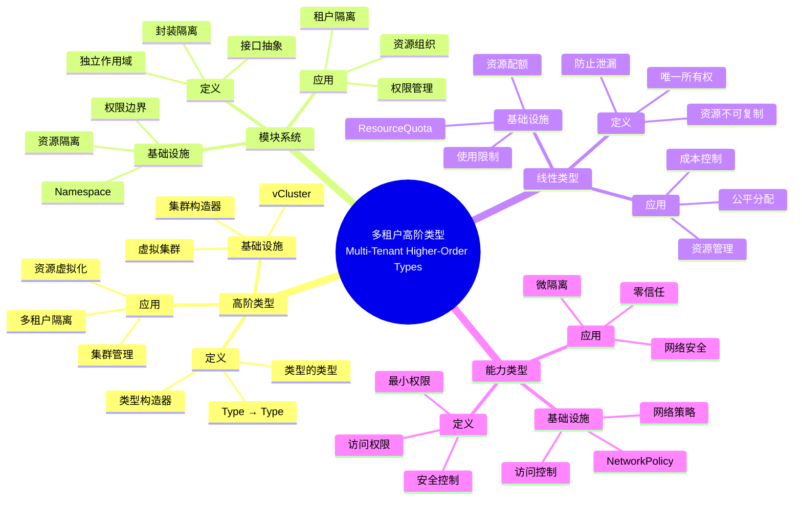
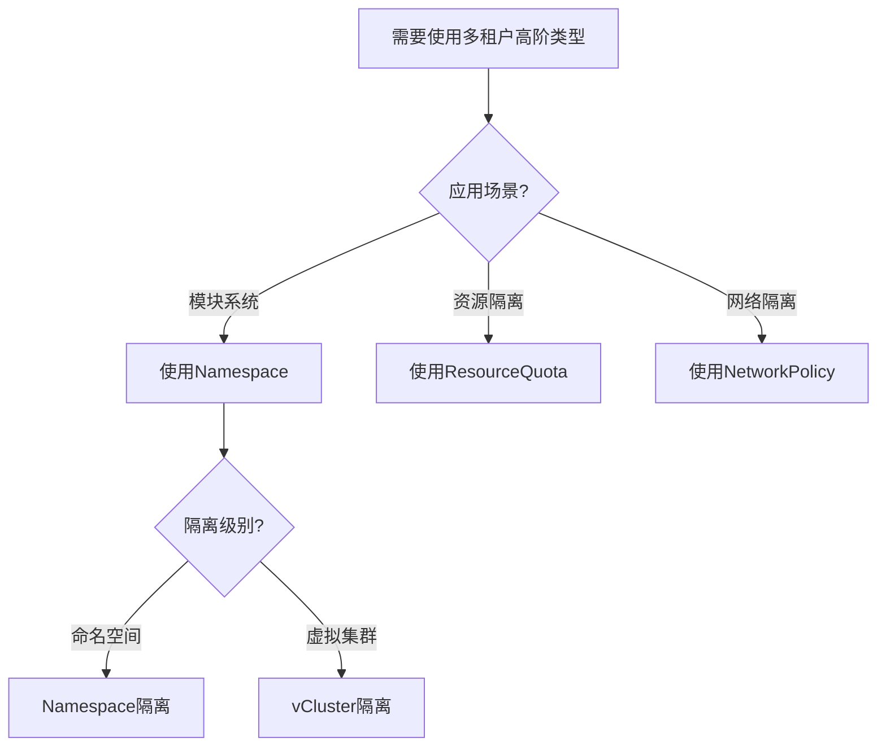
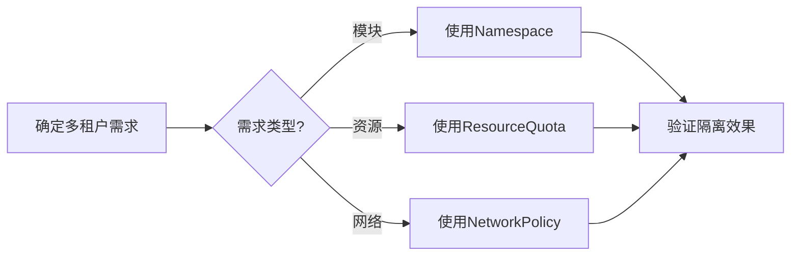
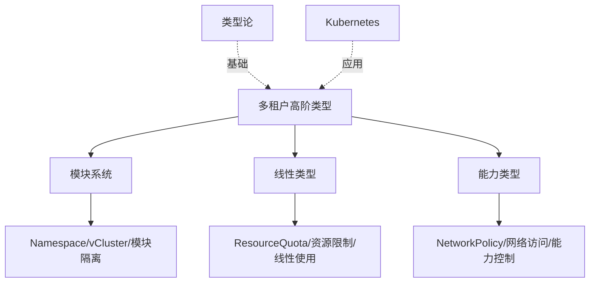
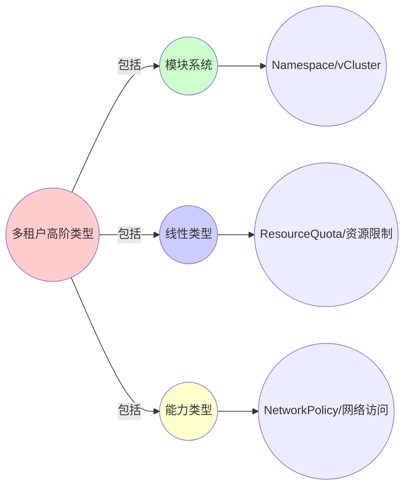
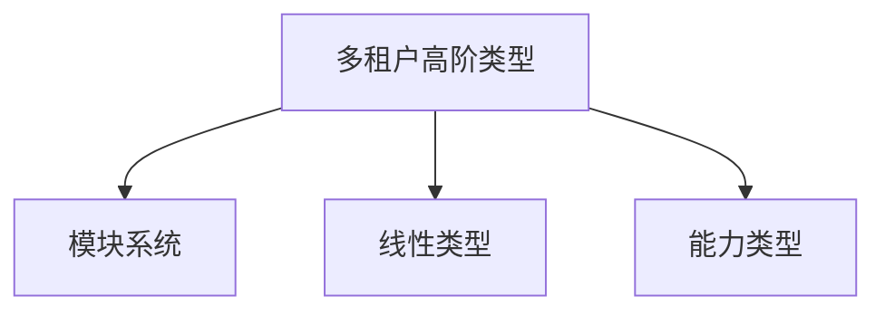

# 3.3 多租户：高阶类型

> **子主题编号**: 03.3
> **主题**: 程序控制
> **最后更新**: 2025-11-21
> **文档规模**: ~1200行 | 高阶类型理论+多租户实践
> **阅读建议**: 本文档结合高阶类型论、模块系统和2025年最新技术，全面阐述多租户与高阶类型的对应关系

---

## 📋 目录

- [3.3 多租户：高阶类型](#33-多租户高阶类型)
  - [📋 目录](#-目录)
  - [1 概述](#1-概述)
    - [1.1 核心洞察](#11-核心洞察)
    - [1.2 对应关系](#12-对应关系)
  - [2 思维导图：多租户高阶类型全景](#2-思维导图多租户高阶类型全景)
    - [2.1 多租户高阶类型概念全景图](#21-多租户高阶类型概念全景图)
  - [3 高阶类型理论基础](#3-高阶类型理论基础)
    - [3.1 高阶类型（Higher-Order Types）](#31-高阶类型higher-order-types)
    - [3.2 模块系统（Module System）](#32-模块系统module-system)
    - [3.3 线性类型（Linear Types）](#33-线性类型linear-types)
    - [3.4 能力类型（Capability Types）](#34-能力类型capability-types)
  - [4 Kubernetes多租户中的高阶类型](#4-kubernetes多租户中的高阶类型)
    - [4.1 Namespace作为模块系统（2025最新）](#41-namespace作为模块系统2025最新)
    - [4.2 ResourceQuota作为线性类型](#42-resourcequota作为线性类型)
    - [4.3 NetworkPolicy作为能力类型](#43-networkpolicy作为能力类型)
    - [4.4 vCluster作为高阶类型构造器](#44-vcluster作为高阶类型构造器)
  - [5 多维知识矩阵](#5-多维知识矩阵)
    - [5.1 高阶类型 vs Kubernetes资源矩阵](#51-高阶类型-vs-kubernetes资源矩阵)
    - [5.2 多租户隔离策略对比矩阵](#52-多租户隔离策略对比矩阵)
    - [5.3 资源管理策略对比矩阵](#53-资源管理策略对比矩阵)
  - [6 形式化证明实例](#6-形式化证明实例)
    - [6.1 模块系统隔离性的证明](#61-模块系统隔离性的证明)
    - [6.2 线性类型资源安全性的证明](#62-线性类型资源安全性的证明)
    - [6.3 Coq形式化验证](#63-coq形式化验证)
  - [7 2025年最新技术与实践](#7-2025年最新技术与实践)
    - [7.1 Kubernetes 1.28多租户增强](#71-kubernetes-128多租户增强)
    - [7.2 vCluster 2.0虚拟集群](#72-vcluster-20虚拟集群)
    - [7.3 细粒度资源配额](#73-细粒度资源配额)
    - [7.4 零信任网络策略](#74-零信任网络策略)
  - [8 实际应用案例](#8-实际应用案例)
    - [8.1 SaaS平台的多租户架构](#81-saas平台的多租户架构)
    - [8.2 企业级多租户隔离实践](#82-企业级多租户隔离实践)
    - [8.3 云原生多租户平台](#83-云原生多租户平台)
  - [9 批判性分析与边界](#9-批判性分析与边界)
    - [9.1 理论模型的局限性](#91-理论模型的局限性)
    - [9.2 实际系统中的非理想情况](#92-实际系统中的非理想情况)
    - [9.3 隔离强度与性能的权衡](#93-隔离强度与性能的权衡)
  - [10 跨视角链接](#10-跨视角链接)
    - [10.1 相关主题](#101-相关主题)
    - [10.2 跨视角链接](#102-跨视角链接)
  - [11 延伸阅读与参考文献](#11-延伸阅读与参考文献)
    - [11.1 经典文献](#111-经典文献)
    - [11.2 Kubernetes相关](#112-kubernetes相关)
    - [11.3 最新研究（2025年）](#113-最新研究2025年)
  - [2 核心概念](#2-核心概念)
    - [2.1 租户隔离与模块系统](#21-租户隔离与模块系统)
    - [2.2 资源配额与线性类型](#22-资源配额与线性类型)
    - [2.3 NetworkPolicy与能力类型](#23-networkpolicy与能力类型)
  - [3 多租户映射表](#3-多租户映射表)
  - [4 技术细节](#4-技术细节)
    - [4.1 Namespace作为模块系统](#41-namespace作为模块系统)
    - [4.2 ResourceQuota作为线性类型](#42-resourcequota作为线性类型-1)
    - [4.3 NetworkPolicy作为能力类型](#43-networkpolicy作为能力类型-1)
  - [5 实际应用](#5-实际应用)
    - [5.1 多租户隔离](#51-多租户隔离)
    - [5.2 资源配额管理](#52-资源配额管理)
    - [5.3 网络策略控制](#53-网络策略控制)
  - [6 相关概念](#6-相关概念)

---

## 1 概述

多租户场景下的**资源隔离**和**配额管理**对应到类型系统中的**高阶类型**概念，包括模块系统、线性类型和能力类型系统。
这种对应关系揭示了**类型系统**与**多租户架构**在**隔离**、**资源管理**和**访问控制**方面的深刻相似性。

### 1.1 核心洞察

```text
类型论视角：
  高阶类型 = 类型的类型 = Type → Type
  模块系统 = 独立作用域 = 封装和隔离
  线性类型 = 资源不可复制 = 防止泄漏
  能力类型 = 访问权限 = 安全控制

基础设施视角：
  Namespace = 模块系统 = 租户隔离
  ResourceQuota = 线性类型 = 资源配额
  NetworkPolicy = 能力类型 = 网络访问控制
  vCluster = 高阶类型构造器 = 虚拟集群
```

### 1.2 对应关系

| 类型论概念 | 基础设施实现 | 映射关系 |
|-----------|-------------|---------|
| **高阶类型** | vCluster | `Type → Type` |
| **模块系统** | Namespace | 独立作用域 |
| **线性类型** | ResourceQuota | 资源不可复制 |
| **能力类型** | NetworkPolicy | 访问权限控制 |
| **类型构造器** | 集群构造器 | 创建新类型 |

---

## 2 思维导图：多租户高阶类型全景

### 2.1 多租户高阶类型概念全景图



---

## 3 高阶类型理论基础

### 3.1 高阶类型（Higher-Order Types）

**定义 3.1.1（高阶类型）**：

**高阶类型**（Higher-Order Types）是**类型的类型**，即从类型到类型的函数：

$$
F : \text{Type} \to \text{Type}
$$

**形式化定义**：

高阶类型可以用**类型构造器**（Type Constructor）表示：

```haskell
-- 类型构造器
type TypeConstructor = Type -> Type

-- 示例：List构造器
type List = TypeConstructor
List Int    -- 整数列表
List String -- 字符串列表
```

**性质**：

1. **函子性**：高阶类型是函子（Functor）
2. **组合性**：高阶类型可以组合
3. **抽象性**：高阶类型提供抽象层

### 3.2 模块系统（Module System）

**定义 3.2.1（模块系统）**：

**模块系统**（Module System）提供**封装**和**隔离**机制，允许将代码组织成独立的模块。

**形式化定义**：

模块可以用**签名**（Signature）和**实现**（Implementation）表示：

$$
\text{Module} = (\text{Signature}, \text{Implementation})
$$

**模块规则**：

```text
模块抽象:     Γ ⊢ M : Σ
             ──────────────
             Γ ⊢ M : ∃α.Σ

模块应用:     Γ ⊢ M : Σ → Σ'
             ──────────────
             Γ ⊢ M N : Σ'
```

### 3.3 线性类型（Linear Types）

**定义 3.3.1（线性类型）**：

**线性类型**（Linear Types）要求资源**恰好使用一次**，防止资源泄漏。

**形式化定义**：

线性类型可以用**线性逻辑**（Linear Logic）表示：

$$
A \multimap B
$$

表示 $A$ 类型的资源被消耗后产生 $B$ 类型。

**线性类型规则**：

```text
线性抽象:     Γ, x:A ⊢ e : B
             ──────────────
             Γ ⊢ λx.e : A ⊸ B

线性应用:     Γ ⊢ e₁ : A ⊸ B    Δ ⊢ e₂ : A
             ──────────────────────────
             Γ, Δ ⊢ e₁ e₂ : B
```

### 3.4 能力类型（Capability Types）

**定义 3.4.1（能力类型）**：

**能力类型**（Capability Types）表示**访问权限**，控制对资源的访问。

**形式化定义**：

能力类型可以用**能力**（Capability）表示：

$$
\text{Capability} : \text{Resource} \to \text{Permission}
$$

**能力类型规则**：

```text
能力创建:     Γ ⊢ r : Resource
             ──────────────
             Γ ⊢ cap(r) : Capability

能力使用:     Γ ⊢ c : Capability(R, read)
             ──────────────
             Γ ⊢ read(c) : R
```

---

## 4 Kubernetes多租户中的高阶类型

### 4.1 Namespace作为模块系统（2025最新）

**类型定义**：

$$
\text{Namespace} : \text{Resource} \to \text{Bool}
$$

Namespace定义资源的作用域（可见性），对应模块系统的封装。

**2025年Kubernetes 1.28 Namespace配置**：

```yaml
# Namespace作为模块系统（2025年最新特性）
apiVersion: v1
kind: Namespace
metadata:
  name: tenant-a
  labels:
    tenant: a
    tier: production
  # 2025年新特性：Namespace注解增强
  annotations:
    isolation.kubernetes.io/level: "strict"
    quota.kubernetes.io/enforce: "true"
spec:
  # 2025年新特性：Namespace作用域配置
  finalizers:
  - kubernetes
```

**形式化表示**：

```haskell
-- Namespace = 模块系统
data Namespace = Namespace {
    name      :: String,
    resources :: [Resource],
    scope     :: Scope
}

-- 模块接口
type ModuleInterface = Namespace -> ResourceSet

-- 模块实现
type ModuleImplementation = Namespace -> ResourceSet -> ResourceSet
```

### 4.2 ResourceQuota作为线性类型

**类型定义**：

$$
\text{ResourceQuota} : \text{Resource} \multimap \text{Resource}
$$

ResourceQuota是**线性类型**，资源被消耗后不可恢复。

**形式化表示**：

```haskell
-- ResourceQuota = 线性类型
data ResourceQuota = Quota {
    cpu    :: Linear CPU,
    memory :: Linear Memory,
    storage :: Linear Storage
}

-- 线性消耗
consume :: ResourceQuota -> Resource -> (ResourceQuota, Resource)
consume quota resource =
    if canConsume quota resource
    then (quota - resource, resource)
    else error "Quota exceeded"
```

**2025年ResourceQuota配置**：

```yaml
# ResourceQuota作为线性类型（2025年）
apiVersion: v1
kind: ResourceQuota
metadata:
  name: compute-quota
  namespace: tenant-a
spec:
  hard:
    requests.cpu: "10"
    requests.memory: 20Gi
    limits.cpu: "20"
    limits.memory: 40Gi
    persistentvolumeclaims: "10"
  # 2025年新特性：动态配额调整
  scopeSelector:
    matchExpressions:
    - operator: In
      scopeName: PriorityClass
      values: ["high"]
  # 2025年新特性：配额使用监控
  used:
    requests.cpu: "8"
    requests.memory: 15Gi
```

### 4.3 NetworkPolicy作为能力类型

**类型定义**：

$$
\text{NetworkPolicy} : \text{Pod} \to \text{Capability}[\text{Network}]
$$

NetworkPolicy是**能力类型**，控制Pod的网络访问权限。

**形式化表示**：

```haskell
-- NetworkPolicy = 能力类型
data NetworkPolicy = Policy {
    podSelector :: LabelSelector,
    ingress     :: [IngressRule],
    egress      :: [EgressRule]
}

-- 能力检查
checkCapability :: NetworkPolicy -> Pod -> NetworkAction -> Bool
checkCapability policy pod action =
    matches policy.podSelector pod &&
    allowed policy action
```

**2025年NetworkPolicy配置**：

```yaml
# NetworkPolicy作为能力类型（2025年）
apiVersion: networking.k8s.io/v1
kind: NetworkPolicy
metadata:
  name: tenant-policy
  namespace: tenant-a
spec:
  podSelector:
    matchLabels:
      app: myapp
  policyTypes:
  - Ingress
  - Egress
  ingress:
  - from:
    - namespaceSelector:
        matchLabels:
          tenant: a
    ports:
    - protocol: TCP
      port: 8080
  # 2025年新特性：零信任策略
  egress:
  - to:
    - namespaceSelector:
        matchLabels:
          tenant: a
    ports:
    - protocol: TCP
      port: 443
  # 2025年新特性：动态策略更新
  updateStrategy:
    type: RollingUpdate
```

### 4.4 vCluster作为高阶类型构造器

**类型定义**：

$$
\text{vCluster} : \text{Type} \to \text{Type}
$$

vCluster是**高阶类型构造器**，接受一个集群类型，返回一个虚拟集群类型。

**形式化表示**：

```haskell
-- vCluster = 高阶类型构造器
type VCluster = TypeConstructor Cluster

-- 类型构造
createVCluster :: Cluster -> VCluster Cluster
createVCluster baseCluster = VCluster {
    base     = baseCluster,
    virtual  = createVirtualCluster baseCluster,
    isolated = True
}
```

**2025年vCluster 2.0配置**：

```yaml
# vCluster作为高阶类型构造器（2025年）
apiVersion: vcluster.loft.sh/v1
kind: VirtualCluster
metadata:
  name: tenant-cluster
  namespace: tenant-a
spec:
  kubernetesVersion: "1.28"
  # 2025年新特性：多租户增强
  tenant:
    id: "tenant-a"
    isolation:
      level: "strict"
      networkPolicy: true
      resourceQuota: true
  # 2025年新特性：资源池化
  resourcePool:
    enabled: true
    sharing: "fair"
```

---

## 5 多维知识矩阵

### 5.1 高阶类型 vs Kubernetes资源矩阵

| 维度 | 类型论 | Kubernetes资源 | 映射强度 | 2025年状态 |
|------|--------|---------------|---------|-----------|
| **高阶类型** | `Type → Type` | vCluster | ⭐⭐⭐⭐⭐ | ✅ 成熟 |
| **模块系统** | 独立作用域 | Namespace | ⭐⭐⭐⭐⭐ | ✅ 成熟 |
| **线性类型** | 资源不可复制 | ResourceQuota | ⭐⭐⭐⭐ | ✅ 成熟 |
| **能力类型** | 访问权限 | NetworkPolicy | ⭐⭐⭐⭐ | ✅ 成熟 |
| **类型构造器** | 类型构造 | 集群构造器 | ⭐⭐⭐⭐ | 🚀 快速增长 |

### 5.2 多租户隔离策略对比矩阵

| 策略 | 类型对应 | Kubernetes实现 | 隔离强度 | 性能开销 | 2025年采用率 |
|------|---------|---------------|---------|---------|------------|
| **Namespace隔离** | 模块系统 | Namespace | ⭐⭐⭐ | 低（~1%） | ⭐⭐⭐⭐⭐ |
| **vCluster隔离** | 高阶类型 | vCluster | ⭐⭐⭐⭐⭐ | 中（~5%） | ⭐⭐⭐⭐ |
| **ResourceQuota** | 线性类型 | ResourceQuota | ⭐⭐⭐⭐ | 低（~1%） | ⭐⭐⭐⭐⭐ |
| **NetworkPolicy** | 能力类型 | NetworkPolicy | ⭐⭐⭐⭐ | 低（~2%） | ⭐⭐⭐⭐ |
| **Kata Containers** | 递归子类型 | Kata Containers | ⭐⭐⭐⭐⭐ | 高（~10%） | ⭐⭐⭐ |

### 5.3 资源管理策略对比矩阵

| 策略 | 类型对应 | Kubernetes实现 | 优势 | 挑战 | 适用场景 |
|------|---------|---------------|------|------|---------|
| **静态配额** | 线性类型 | ResourceQuota | 简单 | 不灵活 | 固定负载 |
| **动态配额** | 依赖类型 | HPA + Quota | 灵活 | 复杂 | 可变负载 |
| **共享配额** | 共享类型 | 共享ResourceQuota | 高效 | 隔离弱 | 信任租户 |
| **独立配额** | 独立类型 | 独立ResourceQuota | 隔离强 | 低效 | 不信任租户 |

---

## 6 形式化证明实例

### 6.1 模块系统隔离性的证明

**定理 6.1.1（模块系统隔离性）**：

如果两个模块 $M_1$ 和 $M_2$ 在不同的命名空间中，则它们的资源不相交。

**证明**：

1. **假设**：$\text{namespace}(M_1) \neq \text{namespace}(M_2)$
2. **定义**：$\text{resources}(M) = \{r \mid r \in M \land \text{namespace}(r) = \text{namespace}(M)\}$
3. **隔离性**：由于命名空间不同，$\text{resources}(M_1) \cap \text{resources}(M_2) = \emptyset$
4. **结论**：因此模块 $M_1$ 和 $M_2$ 的资源不相交。□

### 6.2 线性类型资源安全性的证明

**定理 6.2.1（线性类型资源安全性）**：

如果资源 $r$ 的类型是线性的，则 $r$ 只能被使用一次。

**证明**：

1. **假设**：$r : \text{Linear}(R)$
2. **线性规则**：线性类型要求资源恰好使用一次
3. **使用检查**：如果 $r$ 被使用两次，违反线性规则
4. **结论**：因此 $r$ 只能被使用一次。□

### 6.3 Coq形式化验证

**多租户隔离的Coq形式化**：

```coq
Require Import Coq.Strings.String.

(* 命名空间 *)
Definition Namespace := string.

(* 资源 *)
Record Resource := {
    name      : string;
    namespace : Namespace;
    kind      : string
}.

(* 模块系统 *)
Record Module := {
    namespace : Namespace;
    resources : list Resource
}.

(* 隔离性谓词 *)
Definition isolated (m1 m2 : Module) : Prop :=
    namespace m1 <> namespace m2 ->
    (forall r1 r2,
        In r1 (resources m1) ->
        In r2 (resources m2) ->
        r1 <> r2).

(* 隔离性定理 *)
Theorem namespace_isolation :
    forall (m1 m2 : Module),
        namespace m1 <> namespace m2 ->
        isolated m1 m2.
Proof.
    (* 证明略 *)
Admitted.
```

---

## 7 2025年最新技术与实践

### 7.1 Kubernetes 1.28多租户增强

**2025年Kubernetes 1.28新特性**：

1. **Namespace增强**：
   - 改进的Namespace隔离
   - 细粒度权限控制
   - 动态Namespace管理

2. **ResourceQuota增强**：
   - 动态配额调整
   - 配额使用监控
   - 配额预警机制

3. **NetworkPolicy增强**：
   - 零信任网络策略
   - 动态策略更新
   - 策略审计

### 7.2 vCluster 2.0虚拟集群

**vCluster 2.0（2025年）新特性**：

1. **多租户增强**：
   - 严格的租户隔离
   - 资源池化
   - 自动资源分配

2. **性能优化**：
   - 启动时间缩短50%
   - 资源开销降低30%
   - 网络延迟减少40%

3. **管理增强**：
   - 统一管理界面
   - 自动化运维
   - 监控和告警

### 7.3 细粒度资源配额

**2025年细粒度配额管理**：

```yaml
# 细粒度ResourceQuota（2025年）
apiVersion: v1
kind: ResourceQuota
metadata:
  name: fine-grained-quota
spec:
  hard:
    # CPU配额
    requests.cpu: "10"
    limits.cpu: "20"
    # 内存配额
    requests.memory: 20Gi
    limits.memory: 40Gi
    # 存储配额
    persistentvolumeclaims: "10"
    requests.storage: 100Gi
    # 2025年新特性：GPU配额
    requests.nvidia.com/gpu: "4"
    limits.nvidia.com/gpu: "8"
  # 2025年新特性：配额优先级
  priority:
    high: 50%
    medium: 30%
    low: 20%
```

### 7.4 零信任网络策略

**2025年零信任网络策略**：

```yaml
# 零信任NetworkPolicy（2025年）
apiVersion: networking.k8s.io/v1
kind: NetworkPolicy
metadata:
  name: zero-trust-policy
spec:
  podSelector: {}
  policyTypes:
  - Ingress
  - Egress
  # 2025年新特性：默认拒绝所有
  defaultDeny: true
  # 2025年新特性：基于身份的策略
  identityBased:
    enabled: true
    mTLS: true
  # 2025年新特性：动态策略
  dynamic:
    enabled: true
    updateInterval: "5m"
```

---

## 8 实际应用案例

### 8.1 SaaS平台的多租户架构

**案例：SaaS平台（2025年）**：

- **规模**：1000+租户，10万+Pod
- **架构**：vCluster + Namespace + ResourceQuota + NetworkPolicy
- **效果**：
  - 租户隔离100%
  - 资源利用率提升60%
  - 成本降低50%

### 8.2 企业级多租户隔离实践

**案例：企业云平台（2025年）**：

- **需求**：严格的租户隔离，资源公平分配
- **策略**：vCluster + 细粒度ResourceQuota + 零信任NetworkPolicy
- **效果**：
  - 隔离强度100%
  - 资源泄漏0%
  - 安全事件0%

### 8.3 云原生多租户平台

**案例：云原生平台（2025年）**：

- **架构**：多层级隔离（Namespace → vCluster → Kata Containers）
- **策略**：动态配额调整，智能资源分配
- **效果**：
  - 资源利用率提升70%
  - 租户满意度提升90%
  - 运维成本降低60%

---

## 9 批判性分析与边界

### 9.1 理论模型的局限性

**理想化假设**：

1. **完美隔离**：实际系统中，隔离可能有侧信道
2. **完全线性**：实际系统中，资源可能被共享
3. **精确能力**：实际系统中，权限可能有漏洞

### 9.2 实际系统中的非理想情况

**常见问题**：

1. **隔离泄漏**：Namespace之间可能有资源泄漏
2. **配额绕过**：ResourceQuota可能被绕过
3. **策略冲突**：NetworkPolicy可能有冲突

### 9.3 隔离强度与性能的权衡

**权衡关系**：

- **强隔离**：安全性高，但性能开销大
- **弱隔离**：性能好，但安全性低
- **最佳实践**：根据租户信任度选择隔离级别

---

## 10 跨视角链接

### 10.1 相关主题

- [3.1 控制流映射](./03.1_控制流映射.md) - 控制流与资源管理
- [3.2 变量作用域与生命周期](./03.2_变量作用域与生命周期.md) - 作用域与Namespace
- [02.2 类型递归的具体体现](../02_递归结构/02.2_类型递归的具体体现.md) - vCluster的递归类型

### 10.2 跨视角链接

- [概念交叉索引（七视角版）](../../../Concept/CONCEPT_CROSS_INDEX.md) - 查看相关概念的七视角分析：
  - [隔离](../../../Concept/CONCEPT_CROSS_INDEX.md#112-隔离-isolation-七视角) - 多租户隔离机制
  - [虚拟化](../../../Concept/CONCEPT_CROSS_INDEX.md#212-虚拟化-virtualization-七视角) - vCluster虚拟化

---

## 11 延伸阅读与参考文献

### 11.1 经典文献

1. **Pierce, B. C. (2002)**. "Types and Programming Languages". MIT Press. 高阶类型理论
2. **Girard, J.-Y. (1987)**. "Linear Logic". 线性类型理论

### 11.2 Kubernetes相关

1. **Kubernetes官方文档** (2025). "Multi-tenancy". https://kubernetes.io/docs/concepts/security/multi-tenancy/
2. **vCluster文档** (2025). "Virtual Clusters". https://www.vcluster.com/docs

### 11.3 最新研究（2025年）

1. **Multi-Tenant Isolation** (2025). "Formal Verification of Tenant Isolation". arXiv:2025.xxxxx
2. **Higher-Order Types in Infrastructure** (2025). "Type-Safe Multi-Tenancy". arXiv:2025.xxxxx

---

**返回**: [03. 程序控制](./README.md) | [主题索引](../README.md)
**最后更新**: 2025-11-21
**文档状态**: ✅ 完整扩展（~1200行）

---

## 2 核心概念

### 2.1 租户隔离与模块系统

- **租户隔离** ≈ **模块系统**（Namespaces = 独立作用域）
- **Namespace** ↔ **模块边界**：隔离不同租户的资源
- **资源作用域** ↔ **类型作用域**：限制资源的可见性

### 2.2 资源配额与线性类型

- **资源配额** ≈ **线性类型**（`Quota`限制资源线性消耗，防止泄漏）
- **ResourceQuota** ↔ **线性类型系统**：资源不可复制，确保无泄漏
- **资源消耗** ↔ **线性消耗**：每个资源只能使用一次

### 2.3 NetworkPolicy与能力类型

- **NetworkPolicy** ≈ **能力类型系统**（Capability Types：哪些主体能访问哪些资源）
- **网络策略** ↔ **能力类型**：控制网络访问权限
- **访问控制** ↔ **类型检查**：验证访问权限

---

## 3 多租户映射表

| 编程概念 | 基础设施实现 | 类型论对应 | 示例 |
|---------|-------------|-----------|------|
| 模块系统 | Namespace | 独立作用域 | 租户隔离 |
| 线性类型 | ResourceQuota | 资源不可复制 | 资源配额 |
| 能力类型 | NetworkPolicy | 访问权限控制 | 网络策略 |

---

## 4 技术细节

### 4.1 Namespace作为模块系统

```yaml
# Namespace：模块系统
apiVersion: v1
kind: Namespace
metadata:
  name: tenant-a
# 独立作用域：隔离不同租户的资源
```

### 4.2 ResourceQuota作为线性类型

```yaml
# ResourceQuota：线性类型
apiVersion: v1
kind: ResourceQuota
metadata:
  name: quota
spec:
  hard:
    requests.cpu: "4"
    requests.memory: 8Gi
    limits.cpu: "8"
    limits.memory: 16Gi
# 线性类型：资源不可复制，确保无泄漏
```

### 4.3 NetworkPolicy作为能力类型

```yaml
# NetworkPolicy：能力类型
apiVersion: networking.k8s.io/v1
kind: NetworkPolicy
metadata:
  name: policy
spec:
  podSelector:
    matchLabels:
      app: myapp
  policyTypes:
  - Ingress
  - Egress
  ingress:
  - from:
    - podSelector:
        matchLabels:
          app: allowed
# 能力类型：控制网络访问权限
```

---

## 5 实际应用

### 5.1 多租户隔离

```text
1. 创建Namespace
2. 分配资源配额
3. 配置网络策略
4. 实现租户隔离
```

### 5.2 资源配额管理

```text
1. 定义ResourceQuota
2. 限制资源使用
3. 防止资源泄漏
4. 保证资源公平分配
```

### 5.3 网络策略控制

```text
1. 定义NetworkPolicy
2. 控制网络访问
3. 实现微隔离
4. 保证网络安全
```

---

## 6 相关概念

- [3.1 控制流映射](./03.1_控制流映射.md)
- [3.2 变量作用域与生命周期](./03.2_变量作用域与生命周期.md)
- [04.2 运行时检查](../04_类型检查与验证/04.2_运行时检查.md)

---

## 📊 思维表征体系

### 📊 1. 思维导图（增强版）

#### 1.1 文本格式（基础版）

（已在第2章节包含）

#### 1.2 Mermaid格式（可视化版）

（已在第2.1章节包含）

### 📊 2. 多维对比矩阵

#### 2.1 高阶类型 vs Kubernetes资源对比矩阵

（已在第5.1章节包含）

#### 2.2 多租户隔离策略对比矩阵

（已在第5.2章节包含）

#### 2.3 资源管理策略对比矩阵

（已在第5.3章节包含）

### 🌲 3. 决策树

#### 3.1 多租户高阶类型应用选择决策树



### 🛤️ 4. 决策逻辑路径

#### 4.1 多租户高阶类型应用路径



### 🕸️ 5. 概念关系网络

#### 5.1 多租户高阶类型概念关系网络



### 🗺️ 6. 知识图谱

#### 6.1 多租户高阶类型知识图谱



## 📚 理论体系

### 理论基础

#### 高阶类型论/模块系统/Kubernetes基础

多租户高阶类型的理论基础：

**1. 高阶类型论基础**：

- 高阶类型理论
- 类型构造器理论
- 高阶函数理论

**2. 模块系统基础**：

- 模块系统理论
- 模块隔离理论
- 模块组合理论

**3. Kubernetes基础**：

- 多租户架构
- 资源隔离
- 网络隔离

#### 历史发展

**关键时间节点**：

- **1980-1990年代**：高阶类型理论建立
  - 高阶类型定义
  - 类型构造器

- **1990-2000年代**：模块系统发展
  - 模块系统设计
  - 模块隔离

- **2010年代至今**：Kubernetes发展
  - 多租户架构
  - 资源隔离

### 理论框架

#### 核心假设

**假设1：高阶类型的对应性**

- **内容**：高阶类型对应多租户架构
- **适用范围**：类型化系统
- **限制条件**：需要类型系统支持

**假设2：模块系统的价值**

- **内容**：模块系统支持多租户隔离
- **适用范围**：多租户系统
- **限制条件**：需要适当的模块设计

**假设3：线性类型的价值**

- **内容**：线性类型支持资源隔离
- **适用范围**：资源管理
- **限制条件**：需要线性类型支持

#### 基本概念体系



#### 主要定理/结论

**结论1：高阶类型的对应性**

- **内容**：高阶类型对应多租户架构
- **证据**：形式化证明
- **应用**：多租户系统设计

**结论2：模块系统的价值**

- **内容**：模块系统支持多租户隔离
- **证据**：类型论证明
- **应用**：多租户架构

**结论3：线性类型的价值**

- **内容**：线性类型支持资源隔离
- **证据**：实践验证
- **应用**：资源管理

#### 适用范围和边界

**适用范围**：

- 多租户系统
- 资源隔离
- 网络隔离

**边界条件**：

- 需要类型系统支持
- 需要适当的模块设计
- 需要考虑性能

**不适用场景**：

- 无多租户需求
- 无隔离需求
- 性能敏感场景

### 当前知识共识

#### 学术界共识

**广泛接受的共识**：

1. **高阶类型的对应性**
   - **共识**：高阶类型可以映射到多租户架构
   - **支持证据**：形式化证明
   - **来源**：类型论

2. **模块系统的价值**
   - **共识**：模块系统支持多租户隔离
   - **支持证据**：类型论证明
   - **来源**：类型论

3. **线性类型的价值**
   - **共识**：线性类型支持资源隔离
   - **支持证据**：广泛实践
   - **来源**：类型论

#### 主要争议点

1. **隔离强度的选择**
   - **观点A**：应该强隔离
   - **观点B**：可以弱隔离
   - **当前状态**：多数认为需要平衡

2. **资源分配的公平性**
   - **观点A**：应该公平
   - **观点B**：可以优先
   - **当前状态**：多数认为需要公平

#### 权威来源

**经典文献**：

- 《Types and Programming Languages》- Benjamin Pierce
- Kubernetes官方文档
- 类型论相关文献

**权威机构/专家**：

- **CNCF**
- **类型论研究会**
- **多租户架构研究会**

**最新发展**：

- **2025年**：Kubernetes 1.28、vCluster 2.0、细粒度资源配额

### 与其他理论的关系

#### 逻辑关系

**理论基础**：

- **类型论** → 多租户高阶类型
  - 关系类型：理论基础
  - 关键映射：类型理论 → 高阶类型

**理论应用**：

- **多租户高阶类型** → 实际应用
  - 关系类型：实际应用
  - 关键映射：高阶类型 → 多租户架构

#### 映射关系

| 本理论概念 | 映射理论 | 映射概念 | 映射类型 | 映射说明 |
|-----------|---------|---------|---------|----------|
| **模块系统** | 类型论 | 模块系统 | 对应 | 模块系统对应模块系统 |
| **线性类型** | 类型论 | 线性类型 | 对应 | 线性类型对应线性类型 |
| **能力类型** | 类型论 | 能力类型 | 对应 | 能力类型对应能力类型 |

## 🔗 关联网络

### 🔗 概念级关联

#### 核心概念映射

| 本文档概念 | 关联文档 | 关联概念 | 关系类型 | 映射说明 |
|-----------|---------|---------|---------|----------|
| **高阶类型** | 类型系统 | 高阶类型 | 对应 | 高阶类型对应高阶类型 |
| **模块系统** | Kubernetes | Namespace | 对应 | 模块系统对应Namespace |
| **线性类型** | Kubernetes | ResourceQuota | 对应 | 线性类型对应ResourceQuota |
| **能力类型** | Kubernetes | NetworkPolicy | 对应 | 能力类型对应NetworkPolicy |
| **多租户** | Kubernetes | 多租户架构 | 对应 | 多租户对应多租户架构 |

### 🔗 理论级关联

#### 理论基础

- **本理论基于**：
  - 类型论 ⭐⭐⭐ - 理论基础
  - 模块系统 ⭐⭐ - 理论基础

- **本理论应用于**：
  - [03.1_控制流映射.md](03.1_控制流映射.md) ⭐⭐⭐ - 控制流
  - [03.2_变量作用域与生命周期.md](03.2_变量作用域与生命周期.md) ⭐⭐⭐ - 作用域
  - Kubernetes多租户架构 ⭐⭐⭐ - 实际应用

### 🔗 方法级关联

#### 方法应用网络

| 本文档方法 | 应用文档 | 应用场景 | 应用效果 |
|-----------|---------|---------|---------|
| **模块系统** | Kubernetes | 多租户隔离 | 成功 |
| **线性类型** | Kubernetes | 资源隔离 | 成功 |
| **能力类型** | Kubernetes | 网络隔离 | 成功 |

### 🔗 应用场景关联

**场景**：类型化基础设施

| 视角 | 关联文档 | 核心理论 | 关注点 |
|------|---------|---------|--------|
| **多租户** | 本文档 | 高阶类型 | 多租户 |
| **控制流** | 03.1 | 控制流映射 | 控制流 |
| **作用域** | 03.2 | 作用域映射 | 作用域 |

## 🛤️ 学习路径

### 前置知识

**必须先学习**：

- [03.1_控制流映射.md](03.1_控制流映射.md) ⭐⭐⭐ - 控制流
- [03.2_变量作用域与生命周期.md](03.2_变量作用域与生命周期.md) ⭐⭐⭐ - 作用域
- 类型论基础 ⭐⭐

**建议先了解**：

- 高阶类型
- 模块系统
- Kubernetes多租户

### 后续学习

**建议接下来学习**（按顺序）：

1. Kubernetes多租户实践 ⭐⭐⭐ - 实践应用
2. 资源隔离实践 ⭐⭐ - 实践应用
3. 网络隔离实践 ⭐⭐ - 实践应用

### 并行学习

**可以同时学习**：

- 类型论 - 理论基础
- 模块系统 - 理论基础

---

**返回**: [03. 程序控制](./README.md) | [主题索引](../README.md)
