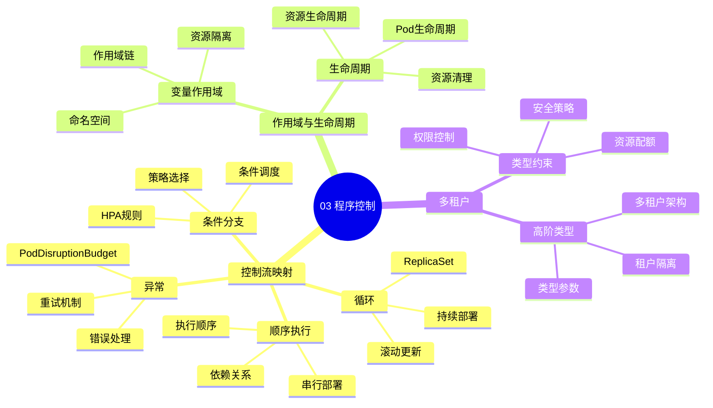

# 03. 程序控制：声明式即类型推导

> **主题编号**: 03
> **主题名称**: 程序控制
> **最后更新**: 2025-01-XX

---

## 📋 目录

- [03. 程序控制：声明式即类型推导](#03-程序控制声明式即类型推导)
  - [📋 目录](#-目录)
  - [1 主题概述](#1-主题概述)
    - [1.0 程序控制思维导图](#10-程序控制思维导图)
  - [2 子主题导航](#2-子主题导航)
    - [2.1 31 控制流映射](#21-31-控制流映射)
    - [2.2 32 变量作用域与生命周期](#22-32-变量作用域与生命周期)
    - [2.3 33 多租户：高阶类型](#23-33-多租户高阶类型)
  - [3 相关主题](#3-相关主题)
  - [4 控制流映射表](#4-控制流映射表)

---

## 1 主题概述

本主题探讨**程序控制流**与**基础设施声明式配置**之间的对应关系，揭示编程语言中的控制结构如何映射到Kubernetes等基础设施的声明式API。

### 1.0 程序控制思维导图

**可视化文档**: 查看 [思维导图与知识矩阵](../思维导图与知识矩阵.md#33-03-程序控制) 获取更详细的思维导图。

---

## 2 子主题导航

### 2.1 [31 控制流映射](031_控制流映射md)

- if条件 ↔ HPA规则
- for循环 ↔ ReplicaSet
- try/catch ↔ PodDisruptionBudget
- goto ↔ preStop钩子

### 2.2 [32 变量作用域与生命周期](032_变量作用域与生命周期md)

- 栈帧 ↔ Pod生命周期
- 堆 ↔ PersistentVolume
- RAII ↔ Init Container
- 垃圾回收 ↔ Failed Pod清理

### 2.3 [33 多租户：高阶类型](033_多租户高阶类型md)

- 租户隔离 ≈ 模块系统
- 资源配额 ≈ 线性类型
- NetworkPolicy ≈ 能力类型系统

---

## 3 相关主题

- [01. 核心概念映射：从类型到资源](../01_核心概念映射/README.md)
- [02. 递归结构：分形基础设施](../02_递归结构/README.md)
- [04. 类型检查与验证](../04_类型检查与验证/README.md)

---

## 4 控制流映射表

| 编程概念 | 基础设施实现 | 类型论对应 |
|---------|-------------|-----------|
| `if`条件 | HPA规则（CPU>80% → scale） | 依赖类型 |
| `for`循环 | ReplicaSet（维持N个副本） | 递归函数 |
| `try/catch` | PodDisruptionBudget + 重试策略 | 效应系统 |
| `goto` | preStop钩子强制跳转 | 不受控跳转 |

---

**返回**: [主题索引](../README.md)
