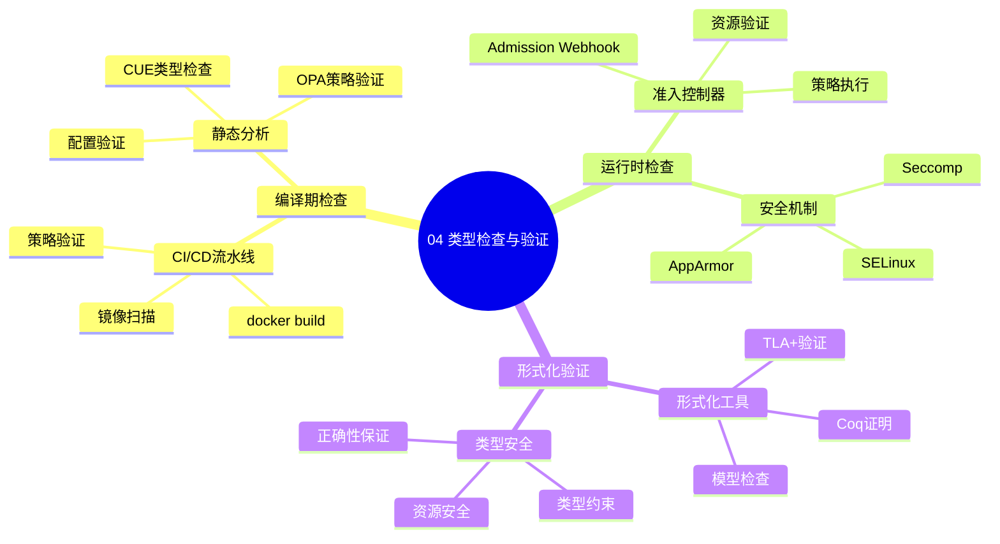

# 04. 类型检查与验证

> **主题编号**: 04
> **主题名称**: 类型检查与验证
> **最后更新**: 2025-01-XX

---

## 📋 目录

- [04. 类型检查与验证](#04-类型检查与验证)
  - [📋 目录](#-目录)
  - [1 主题概述](#1-主题概述)
  - [2 子主题导航](#2-子主题导航)
    - [2.1 41 编译期检查 CICD 流水线](#21-41-编译期检查-cicd-流水线)
    - [2.2 42 运行时检查 准入控制器](#22-42-运行时检查-准入控制器)
    - [2.3 43 形式化验证](#23-43-形式化验证)
  - [3 相关主题](#3-相关主题)
  - [4 验证层次表](#4-验证层次表)

---

## 1 主题概述

本主题探讨**类型检查与验证**在基础设施中的应用，包括编译期检查、运行时检查和形式化验证等不同层次的验证机制。

### 1.0 类型检查与验证思维导图

**可视化文档**: 查看 [思维导图与知识矩阵](../思维导图与知识矩阵.md#34-04-类型检查与验证) 获取更详细的思维导图。

---

## 2 子主题导航

### 2.1 [41 编译期检查 CICD 流水线](041_编译期检查md)

- docker build ≈ 语法分析
- trivy镜像扫描 ≈ 类型错误检查
- OPA/Rego策略验证

### 2.2 [42 运行时检查 准入控制器](042_运行时检查md)

- Admission Webhook
- Seccomp/AppArmor
- eBPF ≈ JIT编译

### 2.3 [43 形式化验证](043_形式化验证md)

- TLA+/PlusCal验证
- Coq证明
- 类型安全性保证

---

## 3 相关主题

- [03. 程序控制：声明式即类型推导](../03_程序控制/README.md)
- [05. 高级类型特性映射](../05_高级类型特性/README.md)
- [09. 形式化理论框架](../09_形式化理论/README.md)

---

## 4 验证层次表

| 验证层次 | 编程语言 | 基础设施 | 工具 |
|---------|---------|---------|------|
| 编译期 | 类型检查器 | CI/CD流水线 | docker build, trivy |
| 运行时 | 运行时检查 | 准入控制器 | Admission Webhook |
| 形式化 | 证明助手 | 形式化验证 | TLA+, Coq |

---

**返回**: [主题索引](../README.md)
