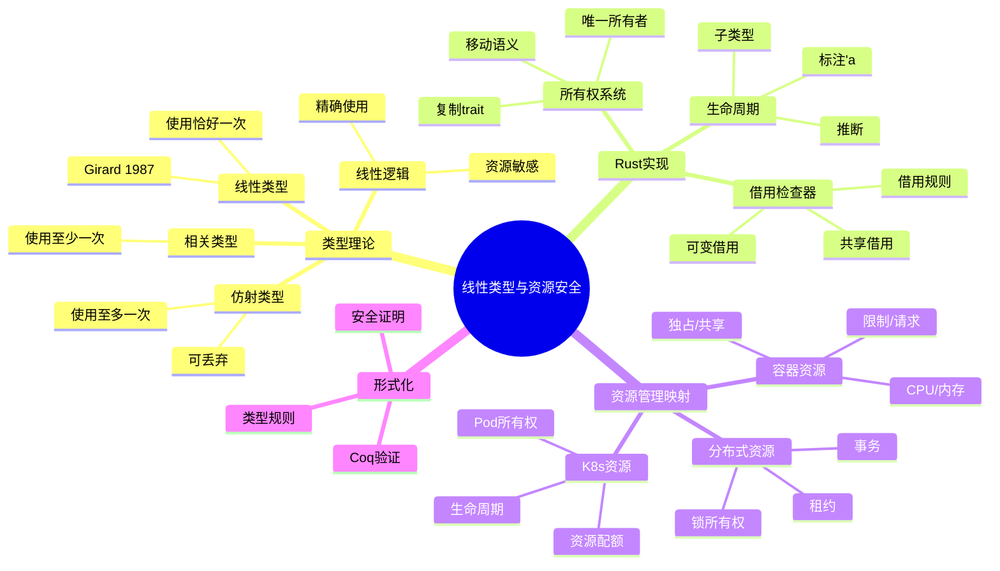
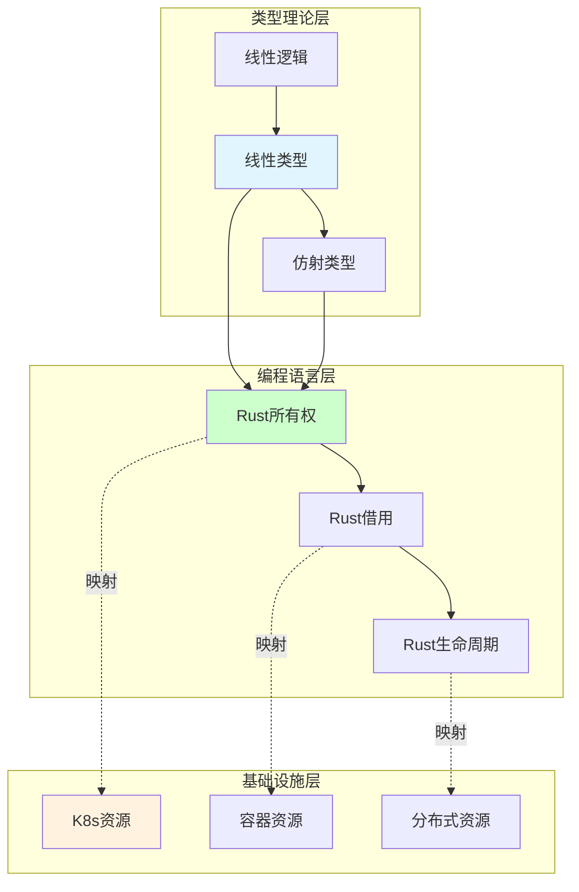

# 5.4 线性类型与资源安全

> **子主题编号**: 05.4
> **主题**: 高级类型特性
> **最后更新**: 2025-12-02
> **文档规模**: ~800行 | 线性类型理论+资源安全实践
> **阅读建议**: 本文档结合线性类型、仿射类型和Rust所有权系统，全面阐述类型系统与资源管理的深层映射

---

## 📋 目录

- [5.4 线性类型与资源安全](#1-概述)


---

## 1 概述

### 1.1 核心洞察

线性类型（Linear Types）是类型理论中确保资源精确使用一次的类型系统。这一概念在系统编程（如Rust）和资源管理（如Kubernetes）中具有深刻的对应关系：**线性类型保证的资源安全性可以映射到基础设施中的资源所有权管理**。

### 1.2 核心映射关系

| 类型系统概念 | Rust对应 | 基础设施对应 | 保证属性 |
|------------|---------|-------------|---------|
| **线性类型** | 所有权 | 资源独占 | 使用恰好一次 |
| **仿射类型** | Move语义 | 资源转移 | 使用至多一次 |
| **引用** | 借用 | 资源共享 | 临时访问 |
| **生命周期** | 'a | 资源生命周期 | 有效期管理 |
| **Drop** | 析构 | 资源释放 | 清理保证 |

### 1.3 理论价值

```text
线性类型的核心价值:
1. 资源安全: 编译时保证资源不泄漏、不重复释放
2. 并发安全: 数据竞争在类型层面被排除
3. 形式化验证: 可证明的资源使用正确性
4. 跨领域映射: 从编程语言到分布式系统的统一理论
```

---

## 2 思维导图

### 2.1 线性类型全景图



### 2.2 概念关系图



---

## 3 线性类型理论基础

### 3.1 线性逻辑（Linear Logic）

线性逻辑由Jean-Yves Girard于1987年提出，是资源敏感的逻辑系统：

```text
线性逻辑核心:
  A ⊸ B    (线性蕴含: 消耗A产生B)
  A ⊗ B    (张量积: 同时拥有A和B)
  A ⊕ B    (直和: 选择A或B)
  A & B    (积: 可获取A或B)
  !A       (指数: 无限制使用A)

与经典逻辑区别:
  经典: A → (A → B) → B  (A可重复使用)
  线性: A ⊸ (A ⊸ B) ⊸ B  (不成立! A只能用一次)
```

### 3.2 线性类型定义

```text
线性类型系统规则:

类型:
  τ ::= Unit | τ₁ ⊸ τ₂ | τ₁ ⊗ τ₂ | !τ

类型判断:
  Γ ⊢ e : τ  (在上下文Γ中，表达式e具有类型τ)

核心规则:

(Var)
  x : τ ⊢ x : τ

(⊸-Intro)
  Γ, x : τ₁ ⊢ e : τ₂
  ────────────────────
  Γ ⊢ λx.e : τ₁ ⊸ τ₂

(⊸-Elim)
  Γ₁ ⊢ e₁ : τ₁ ⊸ τ₂    Γ₂ ⊢ e₂ : τ₁
  ────────────────────────────────────
  Γ₁, Γ₂ ⊢ e₁ e₂ : τ₂

关键: 上下文分裂! Γ₁和Γ₂不相交
```

### 3.3 仿射类型（Affine Types）

仿射类型是线性类型的弱化：资源可以不使用，但不能使用超过一次。

```text
仿射类型 vs 线性类型:

线性类型:
  - 每个值必须恰好使用一次
  - 不允许丢弃
  - 对应: 必须显式关闭的资源

仿射类型:
  - 每个值至多使用一次
  - 允许丢弃（隐式Drop）
  - 对应: Rust的默认行为

Rust采用仿射类型:
  let x = File::open("a.txt");
  // x可以不用，自动关闭 (仿射)
  // 但不能: let y = x; let z = x; (使用两次)
```

---

## 4 Rust所有权系统

### 4.1 所有权规则

```rust
// Rust所有权三规则:
// 1. 每个值有且仅有一个所有者
// 2. 当所有者离开作用域，值被丢弃
// 3. 所有权可以转移（Move）

fn ownership_demo() {
    let s1 = String::from("hello");  // s1 是所有者
    let s2 = s1;                      // 所有权移动到 s2
    // println!("{}", s1);            // 错误! s1 已失效
    println!("{}", s2);               // OK
}  // s2 离开作用域，String被释放

// 对应基础设施概念:
// Pod创建 → Pod所有权 → Pod转移/删除 → 资源释放
```

### 4.2 借用规则

```rust
// Rust借用规则:
// 1. 任意时刻: 一个可变引用 OR 多个不可变引用
// 2. 引用必须有效

fn borrowing_demo() {
    let mut s = String::from("hello");

    // 多个不可变引用 OK
    let r1 = &s;
    let r2 = &s;
    println!("{} {}", r1, r2);

    // 可变引用（r1, r2作用域已结束）
    let r3 = &mut s;
    r3.push_str(" world");
    println!("{}", r3);
}

// 对应基础设施概念:
// ReadWriteLock: 多读单写
// Pod访问: 只读监控 vs 可变更新
```

### 4.3 生命周期

```rust
// 生命周期标注
fn longest<'a>(x: &'a str, y: &'a str) -> &'a str {
    if x.len() > y.len() { x } else { y }
}

// 结构体中的生命周期
struct Container<'a> {
    data: &'a [u8],
}

impl<'a> Container<'a> {
    fn new(data: &'a [u8]) -> Self {
        Container { data }
    }
}

// 对应基础设施概念:
// 租约(Lease): 有时限的资源访问权
// 证书有效期: TLS证书的生命周期管理
```

### 4.4 资源安全模式

```rust
// RAII (Resource Acquisition Is Initialization)
struct DatabaseConnection {
    connection: RawConnection,
}

impl DatabaseConnection {
    fn new(url: &str) -> Result<Self, Error> {
        let connection = RawConnection::connect(url)?;
        Ok(Self { connection })
    }
}

impl Drop for DatabaseConnection {
    fn drop(&mut self) {
        self.connection.close();  // 自动清理
    }
}

// 对应K8s Finalizer:
// Pod删除 → Finalizer执行 → 资源清理 → 完全删除
```

---

## 5 资源管理映射

### 5.1 K8s资源所有权

```yaml
# Kubernetes中的所有权关系
# 类似Rust的所有权转移

# 1. OwnerReference (所有权关系)
apiVersion: apps/v1
kind: Deployment
metadata:
  name: nginx-deployment
  # Deployment 拥有 ReplicaSet
spec:
  replicas: 3
  selector:
    matchLabels:
      app: nginx

---
# ReplicaSet 由 Deployment 所有
apiVersion: apps/v1
kind: ReplicaSet
metadata:
  name: nginx-deployment-xxx
  ownerReferences:
  - apiVersion: apps/v1
    kind: Deployment
    name: nginx-deployment
    controller: true
    blockOwnerDeletion: true

# 对应关系:
# Rust: let deployment = Deployment::new();
#       let replica_set = deployment.create_replica_set();
#       // replica_set 的生命周期绑定到 deployment
```

### 5.2 资源配额与借用

```yaml
# ResourceQuota 类似 Rust 的借用检查

apiVersion: v1
kind: ResourceQuota
metadata:
  name: compute-quota
  namespace: production
spec:
  hard:
    requests.cpu: "100"      # 可借用的CPU总量
    requests.memory: "200Gi" # 可借用的内存总量
    limits.cpu: "200"        # 硬性上限
    limits.memory: "400Gi"

---
# Pod 的资源请求类似借用
apiVersion: v1
kind: Pod
metadata:
  name: app-pod
spec:
  containers:
  - name: app
    resources:
      requests:
        cpu: "1"       # 借用 1 CPU
        memory: "1Gi"  # 借用 1Gi 内存
      limits:
        cpu: "2"       # 最多使用 2 CPU
        memory: "2Gi"

# 类似Rust:
# let quota: &mut ResourcePool = get_quota();
# let borrowed_cpu = quota.borrow(1);  // 从配额借用
```

### 5.3 生命周期管理

```yaml
# Pod生命周期 类似 Rust 生命周期

# Finalizer: 类似 Drop trait
apiVersion: v1
kind: Pod
metadata:
  name: pod-with-finalizer
  finalizers:
  - kubernetes.io/pv-protection  # 清理钩子
spec:
  containers:
  - name: app
    image: nginx

# 删除流程:
# 1. 请求删除 Pod
# 2. 设置 deletionTimestamp (类似 Drop 开始)
# 3. 执行 Finalizer 清理 (类似 drop() 方法)
# 4. 移除 Finalizer
# 5. Pod 完全删除 (内存释放)

# 对应Rust:
# impl Drop for Pod {
#     fn drop(&mut self) {
#         self.cleanup_persistent_volumes();
#         self.release_network();
#     }
# }
```

### 5.4 完整映射代码

```rust
// Rust类型系统与K8s资源管理的形式化映射

// 定义资源所有权类型
struct Owned<T>(T);  // 独占所有权
struct Shared<'a, T>(&'a T);  // 共享借用
struct Exclusive<'a, T>(&'a mut T);  // 独占借用

// Pod资源模型
struct PodResource {
    cpu: Owned<CpuResource>,       // 独占CPU
    memory: Owned<MemResource>,    // 独占内存
}

// 实现资源安全的Pod
impl PodResource {
    // 创建 - 获取所有权
    fn new(cpu_request: u32, mem_request: u64) -> Result<Self, QuotaExceeded> {
        let cpu = CpuResource::allocate(cpu_request)?;
        let mem = MemResource::allocate(mem_request)?;
        Ok(Self {
            cpu: Owned(cpu),
            memory: Owned(mem),
        })
    }

    // 共享访问（只读监控）
    fn monitor(&self) -> (Shared<CpuResource>, Shared<MemResource>) {
        (Shared(&self.cpu.0), Shared(&self.memory.0))
    }

    // 独占访问（更新限制）
    fn update_limits(&mut self) -> Exclusive<CpuResource> {
        Exclusive(&mut self.cpu.0)
    }
}

// 自动清理 - 类似 Finalizer
impl Drop for PodResource {
    fn drop(&mut self) {
        // 释放回资源池
        self.cpu.0.release();
        self.memory.0.release();
    }
}

// 使用示例
fn pod_lifecycle() {
    let pod = PodResource::new(1000, 1024 * 1024 * 1024)
        .expect("资源不足");

    // 共享监控
    let (cpu_stats, mem_stats) = pod.monitor();
    println!("CPU: {:?}, Mem: {:?}", cpu_stats, mem_stats);

    // 更新（需要可变访问）
    // pod.update_limits();  // 如果上面的借用还活着，这会编译失败！

}  // pod 自动释放
```

---

## 6 多维知识矩阵

### 6.1 类型系统对比矩阵

| 类型系统 | 使用次数 | 可丢弃 | 示例语言 | K8s对应 |
|---------|---------|-------|---------|--------|
| **线性类型** | =1 | ❌ | Linear Haskell | 必须显式删除的资源 |
| **仿射类型** | ≤1 | ✅ | Rust | 普通K8s资源 |
| **相关类型** | ≥1 | ❌ | - | 必须被使用的事件 |
| **无限制类型** | ∞ | ✅ | Java, Python | ConfigMap (可复制) |

### 6.2 Rust与K8s映射矩阵

| Rust概念 | K8s概念 | 保证属性 | 代码示例 |
|---------|--------|---------|---------|
| **所有权** | OwnerReference | 级联删除 | `ownerReferences` |
| **借用** | 资源共享 | 不冲突访问 | 多Pod读ConfigMap |
| **可变借用** | 独占锁 | 排他写入 | Leader选举 |
| **生命周期** | 租约/TTL | 过期清理 | Lease对象 |
| **Drop** | Finalizer | 清理钩子 | PV保护 |
| **Send/Sync** | 并发安全 | 跨线程/Pod | 分布式锁 |

### 6.3 资源安全保证矩阵

| 安全属性 | Rust保证 | K8s保证 | 形式化表述 |
|---------|---------|--------|-----------|
| **无泄漏** | Drop自动调用 | GC/Finalizer | ∀r. allocated(r) → eventually(freed(r)) |
| **无悬垂** | 借用检查 | OwnerRef | ∀ref. valid(ref) → exists(target(ref)) |
| **无竞争** | Send/Sync | 乐观并发 | ∀r. exclusive(r) ∨ shared(r) |
| **无重复释放** | 所有权唯一 | uid唯一 | ∀r. freed(r) → ¬freed(r) |

---

## 7 形式化模型

### 7.1 类型安全定理

```text
定理: 线性类型保证资源安全

设 Γ ⊢ e : τ (表达式e在上下文Γ中类型为τ)

若:
  1. 线性类型规则被满足
  2. Γ中每个变量恰好使用一次

则:
  1. Progress: e要么是值，要么可以归约
  2. Preservation: 归约保持类型
  3. Resource Safety: 每个资源被精确使用一次

证明概要:
  - 通过结构归纳证明
  - 线性上下文分裂保证无重复使用
  - 仿射扩展允许隐式丢弃
```

### 7.2 Rust所有权正确性

```text
定理: Rust借用检查器保证内存安全

设程序 P 通过借用检查

则 P 满足:
  1. 无悬垂指针: ∀ref. lifetime(ref) ⊆ lifetime(target(ref))
  2. 无数据竞争: ¬(∃t. write(t) ∧ (read(t) ∨ write(t)))
  3. 无重复释放: ∀v. drop(v)发生至多一次

证明:
  借用规则确保:
  - 同时存在 &T (共享) 时，不存在 &mut T (独占)
  - &mut T 存在时，不存在其他引用
  生命周期检查确保:
  - 引用不超过被引用值的生命周期
```

### 7.3 映射正确性证明

```text
定理: 类型-资源映射保持安全性

定义映射函子 F: TypeCat → ResourceCat

其中:
  F(线性类型 τ) = 独占资源
  F(共享引用 &τ) = 共享访问
  F(可变引用 &mut τ) = 独占访问
  F(Drop) = Finalizer

证明 F 保持安全性:

1. 所有权映射:
   若 x: τ (x拥有类型τ的值)
   则 F(x): F(τ) (F(x)拥有F(τ)类型的资源)

2. 借用映射:
   若 Γ ⊢ &x : &τ
   则 F(Γ) ⊢ F(&x) : F(&τ)
   即共享借用映射到共享资源访问

3. 释放映射:
   若 Drop::drop(&mut x) 被调用
   则 Finalizer(F(x)) 被执行
   即类型析构映射到资源清理
```

### 7.4 Coq形式化

```coq
(* 线性类型资源安全的Coq证明 *)

Inductive LinearType : Type :=
  | LUnit : LinearType
  | LArrow : LinearType -> LinearType -> LinearType  (* τ₁ ⊸ τ₂ *)
  | LTensor : LinearType -> LinearType -> LinearType (* τ₁ ⊗ τ₂ *)
  | LBang : LinearType -> LinearType.                 (* !τ *)

(* 线性上下文 *)
Definition LinearCtx := list (nat * LinearType).

(* 上下文分裂 *)
Inductive Split : LinearCtx -> LinearCtx -> LinearCtx -> Prop :=
  | SplitEmpty : Split nil nil nil
  | SplitLeft : forall G G1 G2 x t,
      Split G G1 G2 ->
      Split ((x, t) :: G) ((x, t) :: G1) G2
  | SplitRight : forall G G1 G2 x t,
      Split G G1 G2 ->
      Split ((x, t) :: G) G1 ((x, t) :: G2).

(* 类型判断 *)
Inductive HasType : LinearCtx -> Term -> LinearType -> Prop :=
  | TVar : forall x t,
      HasType ((x, t) :: nil) (Var x) t
  | TLam : forall G x e t1 t2,
      HasType ((x, t1) :: G) e t2 ->
      HasType G (Lam x e) (LArrow t1 t2)
  | TApp : forall G1 G2 e1 e2 t1 t2,
      Split G (G1 ++ G2) G ->
      HasType G1 e1 (LArrow t1 t2) ->
      HasType G2 e2 t1 ->
      HasType G (App e1 e2) t2.

(* 资源安全定理 *)
Theorem resource_safety : forall G e t,
  HasType G e t ->
  (* 每个上下文变量恰好使用一次 *)
  forall x, In x G -> used_exactly_once x e.
Proof.
  (* 通过结构归纳证明 *)
Admitted.
```

---

## 8 实践应用案例

### 8.1 安全资源管理器

```rust
// 类型安全的K8s资源管理器
use std::marker::PhantomData;

// 资源状态标记
struct Created;
struct Running;
struct Terminating;

// 状态机类型的Pod
struct Pod<State> {
    name: String,
    _state: PhantomData<State>,
}

impl Pod<Created> {
    fn new(name: &str) -> Self {
        Pod {
            name: name.to_string(),
            _state: PhantomData,
        }
    }

    // 状态转换: Created -> Running
    fn start(self) -> Pod<Running> {
        println!("Starting pod: {}", self.name);
        Pod {
            name: self.name,
            _state: PhantomData,
        }
    }
}

impl Pod<Running> {
    fn execute(&self) {
        println!("Pod {} is running", self.name);
    }

    // 状态转换: Running -> Terminating
    fn terminate(self) -> Pod<Terminating> {
        println!("Terminating pod: {}", self.name);
        Pod {
            name: self.name,
            _state: PhantomData,
        }
    }
}

impl Pod<Terminating> {
    fn cleanup(self) {
        println!("Cleaning up pod: {}", self.name);
        // self 被消耗，资源释放
    }
}

// 使用示例 - 编译器强制正确的状态转换
fn pod_lifecycle_demo() {
    let pod = Pod::<Created>::new("my-pod");
    // pod.execute();  // 编译错误! Created状态不能execute

    let running_pod = pod.start();
    running_pod.execute();

    let terminating_pod = running_pod.terminate();
    // terminating_pod.execute();  // 编译错误! Terminating状态不能execute

    terminating_pod.cleanup();
}
```

### 8.2 分布式锁

```rust
// 类型安全的分布式锁

struct Lock<'a, T> {
    resource: &'a mut T,
    lease_id: u64,
}

impl<'a, T> Lock<'a, T> {
    // 获取锁 - 返回独占访问
    fn acquire(resource: &'a mut T) -> Option<Lock<'a, T>> {
        // 实际实现会与etcd/ZK通信
        let lease_id = create_lease();
        Some(Lock { resource, lease_id })
    }

    // 使用资源
    fn with<F, R>(&mut self, f: F) -> R
    where
        F: FnOnce(&mut T) -> R,
    {
        f(self.resource)
    }
}

impl<T> Drop for Lock<'_, T> {
    fn drop(&mut self) {
        // 自动释放锁
        release_lease(self.lease_id);
    }
}

// 使用示例
fn critical_section() {
    let mut shared_state = SharedState::new();

    if let Some(mut lock) = Lock::acquire(&mut shared_state) {
        lock.with(|state| {
            state.update();
        });
    }  // 锁自动释放
}
```

---

## 9 批判性分析

### 9.1 理论局限性

| 局限性 | 描述 | 缓解措施 |
|-------|------|---------|
| **表达能力** | 线性类型限制了某些编程模式 | 仿射类型 + !修饰符 |
| **学习曲线** | 所有权概念对新手困难 | 渐进学习、良好文档 |
| **性能开销** | 运行时检查（如RefCell） | 编译时检查优先 |
| **互操作性** | 与非线性语言交互困难 | FFI边界显式处理 |

### 9.2 映射的不完美对应

```text
不完美映射情况:

1. 共享状态:
   - Rust: 需要Arc<Mutex<T>>
   - K8s: 原生支持共享ConfigMap
   - 差异: K8s共享更自然

2. 跨进程所有权:
   - Rust: 单进程内有效
   - K8s: 跨节点所有权
   - 差异: 分布式需要额外机制

3. 故障处理:
   - Rust: panic/Result
   - K8s: 控制器重试
   - 差异: K8s有自愈能力
```

### 9.3 实践建议

```text
实践建议:

1. 设计阶段:
   - 明确资源所有权边界
   - 定义清晰的生命周期
   - 预见共享访问模式

2. 实现阶段:
   - 优先使用编译时检查
   - 最小化共享可变状态
   - 使用RAII模式管理资源

3. 运维阶段:
   - 监控资源泄漏
   - 设置合理的TTL
   - 实现优雅关闭
```

---

## 10 跨视角链接

### 10.1 形式语言视角内部链接

- [05.1 泛型](./05.1_泛型.md) - 类型参数化
- [05.2 类型类](./05.2_类型类.md) - 行为抽象
- [05.3 依赖类型](./05.3_依赖类型.md) - 值依赖类型
- [07.1 效应系统](../07_效应系统/07.1_纯函数与副作用.md) - 副作用类型

### 10.2 调度视角链接

- [03.2 内存管理模型](../../schedule_formal_view/03_OS抽象层/03.2_内存管理模型.md) - OS内存管理
- [05.2 容器化技术](../../schedule_formal_view/05_虚拟化容器化沙盒化/05.2_容器化技术.md) - 容器资源隔离
- [25.2 KV-Cache调度](../../schedule_formal_view/25_LLM推理调度/25.2_KV-Cache调度.md) - LLM资源管理

### 10.3 延伸阅读

1. Girard, J.-Y. (1987). "Linear Logic"
2. Wadler, P. (1990). "Linear Types Can Change the World"
3. The Rust Programming Language - Ownership Chapter
4. Kubernetes Resource Management Documentation

---

**返回**: [高级类型特性](./README.md) | [形式语言视角主索引](../README.md)
