# 5.6 WASM组件模型

> **子主题编号**: 05.6
> **主题**: 高级类型特性
> **最后更新**: 2025-12-02
> **文档状态**: ✅ 完成

---

## 📋 目录

- [1 概述](#1-概述)
- [2 思维导图](#2-思维导图)
- [3 WIT类型系统](#3-wit类型系统)
- [4 组件模型类型](#4-组件模型类型)
- [5 资源类型](#5-资源类型)
- [6 知识矩阵](#6-知识矩阵)
- [7 跨视角链接](#7-跨视角链接)

---

## 1 概述

### 1.1 核心洞察

WASM组件模型（Component Model）是WebAssembly的下一代模块化标准，引入了**高级类型系统**来实现跨语言互操作。其类型系统设计融合了代数数据类型、线性类型和接口类型的概念。

### 1.2 组件模型特性

| 特性 | 描述 | 类型系统对应 |
|------|------|------------|
| **组件隔离** | 独立实例，明确边界 | 模块类型系统 |
| **接口定义** | WIT语言定义接口 | 接口类型 |
| **资源管理** | 所有权与生命周期 | 线性/仿射类型 |
| **规范ABI** | 语言无关的调用约定 | 表示类型 |
| **组合性** | 组件可组合 | 函子/模块组合 |

### 1.3 形式化定义

```text
WASM组件模型类型系统 T_wasm:

基本值类型 ValType:
  τ ::= bool | s8 | s16 | s32 | s64 | u8 | u16 | u32 | u64
      | f32 | f64 | char | string

复合类型 CompType:
  τ ::= (record field*) | (variant case*) | (list τ) | (tuple τ*)
      | (option τ) | (result τ τ) | (flags name*) | (enum name*)

资源类型 ResType:
  τ ::= (own handle) | (borrow handle)

接口类型 IfaceType:
  I ::= (interface (func name (param τ*) (result τ*))*)
      | (interface (resource name)*)

组件类型 CompType:
  C ::= (component (import I*) (export I*) (instance I*)*)
```

---

## 2 思维导图

```mermaid
mindmap
  root((WASM组件模型))
    WIT类型
      基本类型
        bool/数值
        char/string
      复合类型
        record
        variant
        enum/flags
        list/tuple
      特殊类型
        option
        result
    资源模型
      所有权
        own
        borrow
      生命周期
        自动释放
        借用检查
    组件
      接口
        import
        export
      组合
        链接
        实例化
    互操作
      语言绑定
        Rust
        Go
        JS
      规范ABI
```



---

## 3 WIT类型系统

### 3.1 WIT语法

```wit
// WIT (WebAssembly Interface Type) 示例

package example:types@1.0.0;

// 基本类型定义
interface basic-types {
    // 原始类型
    type byte = u8;
    type size = u32;

    // 记录类型 (Product Type)
    record point {
        x: f64,
        y: f64,
    }

    // 变体类型 (Sum Type)
    variant shape {
        circle(f64),           // 圆形，半径
        rectangle(point),      // 矩形，宽高
        polygon(list<point>),  // 多边形，顶点列表
    }

    // 枚举类型
    enum color {
        red,
        green,
        blue,
    }

    // 标志类型
    flags permissions {
        read,
        write,
        execute,
    }

    // Option类型
    type optional-string = option<string>;

    // Result类型
    type io-result = result<list<u8>, string>;
}
```

### 3.2 类型映射关系

| WIT类型 | 类型理论 | Rust对应 | 说明 |
|--------|---------|---------|------|
| `record` | 乘积类型 | `struct` | 字段积 |
| `variant` | 和类型 | `enum` | 带数据的变体 |
| `enum` | 枚举 | `enum` | 无数据枚举 |
| `flags` | 位集 | `bitflags` | 位标志 |
| `list<T>` | 列表 | `Vec<T>` | 变长序列 |
| `tuple<T*>` | 元组 | `(T,...)` | 固定元组 |
| `option<T>` | Maybe | `Option<T>` | 可选值 |
| `result<T,E>` | Either | `Result<T,E>` | 结果/错误 |

### 3.3 类型等价规则

```text
类型等价关系 ≡:

结构等价:
  record{f₁:τ₁,...,fₙ:τₙ} ≡ record{f_π(1):τ_π(1),...,f_π(n):τ_π(n)}
  (字段顺序不重要，但名称必须匹配)

变体等价:
  variant{c₁(τ₁),...,cₙ(τₙ)} ≡ variant{c_π(1)(τ_π(1)),...,c_π(n)(τ_π(n))}
  (case顺序不重要)

展开等价:
  type-alias ≡ underlying-type
  (类型别名等价于底层类型)
```

---

## 4 组件模型类型

### 4.1 组件定义

```wit
// 组件接口定义
package myapp:http@0.1.0;

// HTTP请求/响应接口
interface types {
    record request {
        method: string,
        uri: string,
        headers: list<tuple<string, string>>,
        body: option<list<u8>>,
    }

    record response {
        status: u16,
        headers: list<tuple<string, string>>,
        body: list<u8>,
    }

    variant http-error {
        network-error(string),
        timeout,
        invalid-url,
    }
}

// HTTP客户端接口
interface http-client {
    use types.{request, response, http-error};

    fetch: func(req: request) -> result<response, http-error>;
}

// HTTP服务器接口
interface http-handler {
    use types.{request, response};

    handle: func(req: request) -> response;
}

// 组件世界定义
world http-server {
    import http-client;
    export http-handler;
}
```

### 4.2 组件组合

```text
组件组合模型:

组件 A:
  import: {I₁, I₂}
  export: {E₁}

组件 B:
  import: {E₁}    // 匹配A的导出
  export: {E₂}

组合 A ⊗ B:
  import: {I₁, I₂}  // A的导入
  export: {E₂}      // B的导出
  internal: A.E₁ → B.import

组合规则:
  ∀ I ∈ B.import. ∃ E ∈ A.export. I ≡ E
  (B的每个导入必须能从A的导出满足)
```

### 4.3 实例化模型

```mermaid
graph LR
    subgraph "组件A"
        A_IMP[Import I1]
        A_CORE[Core]
        A_EXP[Export E1]
        A_IMP --> A_CORE
        A_CORE --> A_EXP
    end

    subgraph "组件B"
        B_IMP[Import E1]
        B_CORE[Core]
        B_EXP[Export E2]
        B_IMP --> B_CORE
        B_CORE --> B_EXP
    end

    A_EXP -->|链接| B_IMP

    I1[外部I1] --> A_IMP
    B_EXP --> E2[最终E2]
```



---

## 5 资源类型

### 5.1 所有权模型

```wit
// 资源类型定义
interface filesystem {
    // 资源声明
    resource file-handle {
        // 构造函数
        constructor(path: string);

        // 方法
        read: func(size: u32) -> list<u8>;
        write: func(data: list<u8>) -> result<u32, string>;

        // 静态方法
        exists: static func(path: string) -> bool;
    }

    // 使用所有权类型
    open-file: func(path: string) -> own<file-handle>;

    // 使用借用类型
    read-file: func(file: borrow<file-handle>) -> list<u8>;

    // 转移所有权
    close-file: func(file: own<file-handle>);
}
```

### 5.2 借用检查规则

```text
资源借用规则:

1. own<T> - 拥有的资源
   - 持有者负责释放
   - 可以转移所有权
   - 可以创建借用

2. borrow<T> - 借用的资源
   - 不负责释放
   - 不能转移
   - 生命周期受限于调用

类型规则:
  Γ ⊢ e : own<T>
  ──────────────────
  Γ ⊢ borrow(e) : borrow<T>

  Γ ⊢ f : borrow<T> → R
  Γ ⊢ e : borrow<T>
  ──────────────────
  Γ ⊢ f(e) : R

资源释放:
  当 own<T> 离开作用域时，自动调用 drop
```

### 5.3 资源生命周期

```mermaid
sequenceDiagram
    participant Caller
    participant Component
    participant Resource

    Caller->>Component: open(path) -> own<handle>
    Component->>Resource: allocate
    Resource-->>Component: handle
    Component-->>Caller: own<handle>

    Caller->>Component: read(borrow<handle>)
    Note over Component: 借用期间资源有效
    Component-->>Caller: data

    Caller->>Component: close(own<handle>)
    Component->>Resource: deallocate
    Resource-->>Component: done
    Component-->>Caller: ()
```



---

## 6 知识矩阵

### 6.1 类型系统特性对比

| 特性 | WASM CM | Rust | Haskell | 说明 |
|------|--------|------|---------|------|
| **代数类型** | ✅ record/variant | ✅ struct/enum | ✅ data | 基础支持 |
| **泛型** | ❌ 计划中 | ✅ | ✅ | 尚未支持 |
| **线性类型** | ⚠️ own/borrow | ✅ 完整 | ❌ | 资源特定 |
| **类型推断** | ❌ | ✅ 局部 | ✅ 完整 | 显式标注 |
| **子类型** | ❌ | ❌ | ❌ | 不支持 |

### 6.2 资源模型对比

| 模型 | WASM CM | Rust | Cap'n Proto |
|------|--------|------|-------------|
| **所有权** | own | Box/值 | 客户端持有 |
| **借用** | borrow | &/&mut | 能力引用 |
| **生命周期** | 调用级 | 词法级 | 无限制 |
| **释放** | 自动drop | 自动 | GC/手动 |

---

## 7 跨视角链接

### 7.1 形式语言视角关联

- [线性类型与资源安全](./05.4_线性类型与资源安全.md) - 所有权理论基础
- [模块系统](../06_模块系统/) - 组件组合理论
- [范畴论视角](../09_形式化理论/09.1_范畴论视角.md) - 组合语义

### 7.2 调度视角关联

| 调度概念 | WASM CM对应 | 映射说明 |
|---------|-------------|---------|
| **资源分配** | own创建 | 资源获取 |
| **资源释放** | drop调用 | 资源回收 |
| **容器隔离** | 组件边界 | 沙盒隔离 |
| **服务组合** | 组件链接 | 服务编排 |

### 7.3 应用场景

| 场景 | 使用方式 | 收益 |
|------|---------|------|
| **插件系统** | 组件热加载 | 动态扩展 |
| **边缘计算** | 轻量沙盒 | 安全隔离 |
| **Serverless** | 函数组件 | 快速冷启动 |
| **跨语言调用** | WIT接口 | 语言无关 |

---

## 参考资源

1. [WASM Component Model Spec](https://github.com/WebAssembly/component-model)
2. [WIT语法参考](https://component-model.bytecodealliance.org/design/wit.html)
3. [Bytecode Alliance](https://bytecodealliance.org/)
4. [Wasmtime运行时](https://wasmtime.dev/)

---

**返回**: [高级类型特性主索引](./README.md) | [形式语言视角主索引](../README.md)
