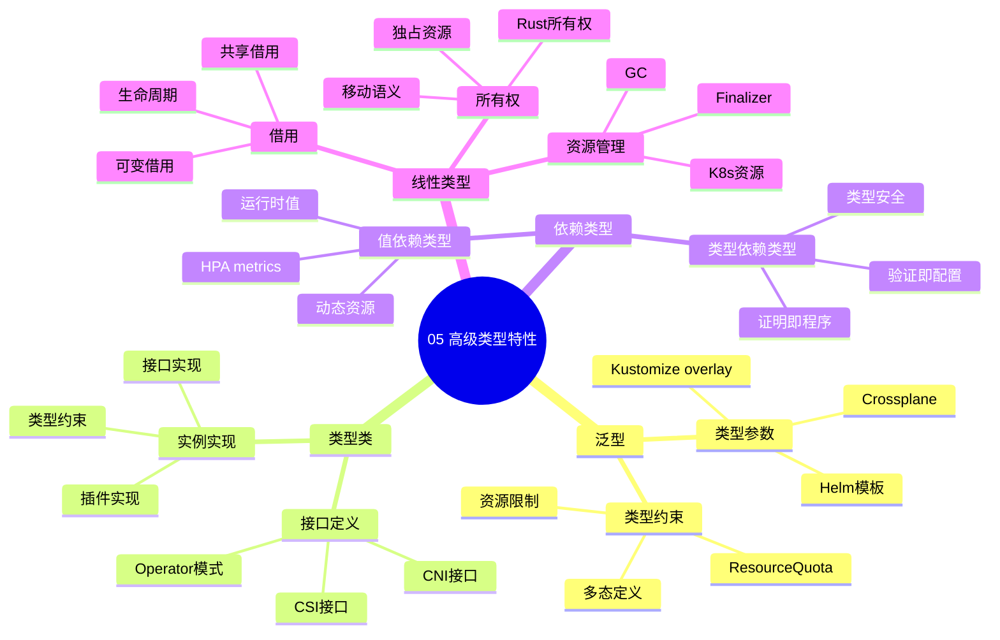

# 05. 高级类型特性映射

> **主题编号**: 05
> **主题名称**: 高级类型特性
> **最后更新**: 2025-12-02

---

## 📋 目录

- [05. 高级类型特性映射](#05-高级类型特性映射)
  - [📋 目录](#-目录)
  - [1 主题概述](#1-主题概述)
    - [1.0 高级类型特性思维导图](#10-高级类型特性思维导图)
  - [2 子主题导航](#2-子主题导航)
    - [2.1 51 泛型Generics](#21-51-泛型generics)
    - [2.2 52 类型类Type Classes](#22-52-类型类type-classes)
    - [2.3 53 依赖类型Dependent Types](#23-53-依赖类型dependent-types)
    - [2.4 54 线性类型与资源安全](#24-54-线性类型与资源安全)
  - [3 相关主题](#3-相关主题)

---

## 1 主题概述

本主题探讨**高级类型特性**在基础设施中的应用，包括泛型、类型类和依赖类型等高级类型系统概念。

### 1.0 高级类型特性思维导图

**可视化文档**: 查看 [思维导图与知识矩阵](../思维导图与知识矩阵.md#35-05-高级类型特性) 获取更详细的思维导图。

---

## 2 子主题导航

### 2.1 [51 泛型Generics](051_泛型md)

- Helm Charts ≈ 类型参数
- Kustomize overlay机制
- Crossplane Composite Resource

### 2.2 [52 类型类Type Classes](052_类型类md)

- CNI接口
- CSI接口
- Operator模式

### 2.3 [53 依赖类型Dependent Types](053_依赖类型md)

- HPA metrics
- 类型依赖运行时值
- 证明即程序

### 2.4 [54 线性类型与资源安全](05.4_线性类型与资源安全.md)

- 线性类型理论基础
- Rust所有权系统映射
- K8s资源生命周期管理
- 形式化安全证明

---

## 3 相关主题

- [04. 类型检查与验证](../04_类型检查与验证/README.md)
- [06. 动态性与反射](../06_动态性与反射/README.md)
- [09. 形式化理论框架](../09_形式化理论/README.md)

---

**返回**: [主题索引](../README.md)
