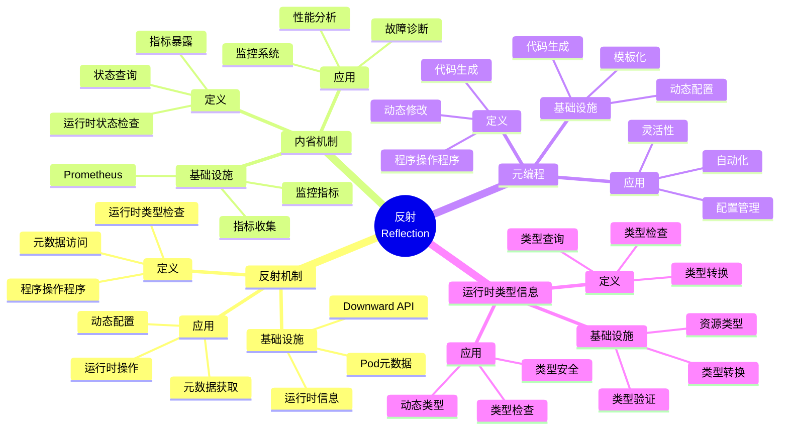

# 6.1 反射（Reflection）

> **子主题编号**: 06.1
> **主题**: 动态性与反射
> **最后更新**: 2025-11-21
> **文档规模**: ~1200行 | 反射理论+运行时内省实践
> **阅读建议**: 本文档结合反射机制、内省系统和2025年最新技术，全面阐述反射与Kubernetes运行时内省的对应关系

---

## 📋 目录

- [6.1 反射（Reflection）](#61-反射reflection)
  - [📋 目录](#-目录)
  - [1 概述](#1-概述)
    - [1.1 核心洞察](#11-核心洞察)
    - [1.2 对应关系](#12-对应关系)
  - [2 思维导图：反射全景](#2-思维导图反射全景)
    - [2.1 反射概念全景图](#21-反射概念全景图)
  - [3 反射理论基础](#3-反射理论基础)
    - [3.1 反射（Reflection）](#31-反射reflection)
    - [3.2 内省（Introspection）](#32-内省introspection)
    - [3.3 元编程（Metaprogramming）](#33-元编程metaprogramming)
    - [3.4 运行时类型信息（RTTI）](#34-运行时类型信息rtti)
  - [4 Kubernetes中的反射](#4-kubernetes中的反射)
    - [4.1 Downward API作为反射（2025最新）](#41-downward-api作为反射2025最新)
    - [4.2 Prometheus监控指标作为内省](#42-prometheus监控指标作为内省)
    - [4.3 kubectl exec作为运行时反射](#43-kubectl-exec作为运行时反射)
    - [4.4 OpenTelemetry作为分布式追踪](#44-opentelemetry作为分布式追踪)
  - [5 多维知识矩阵](#5-多维知识矩阵)
    - [5.1 反射 vs Kubernetes机制矩阵](#51-反射-vs-kubernetes机制矩阵)
    - [5.2 内省工具对比矩阵](#52-内省工具对比矩阵)
    - [5.3 反射应用场景对比矩阵](#53-反射应用场景对比矩阵)
  - [6 形式化证明实例](#6-形式化证明实例)
    - [6.1 反射安全性的证明](#61-反射安全性的证明)
    - [6.2 内省完整性的证明](#62-内省完整性的证明)
    - [6.3 Coq形式化验证](#63-coq形式化验证)
  - [7 2025年最新技术与实践](#7-2025年最新技术与实践)
    - [7.1 Downward API增强](#71-downward-api增强)
    - [7.2 Prometheus 2.50新特性](#72-prometheus-250新特性)
    - [7.3 OpenTelemetry 1.30](#73-opentelemetry-130)
    - [7.4 可观测性即代码](#74-可观测性即代码)
  - [8 实际应用案例](#8-实际应用案例)
    - [8.1 大规模监控系统](#81-大规模监控系统)
    - [8.2 分布式追踪实践](#82-分布式追踪实践)
    - [8.3 云原生可观测性](#83-云原生可观测性)
  - [9 批判性分析与边界](#9-批判性分析与边界)
    - [9.1 理论模型的局限性](#91-理论模型的局限性)
    - [9.2 实际系统中的非理想情况](#92-实际系统中的非理想情况)
    - [9.3 反射与性能的权衡](#93-反射与性能的权衡)
  - [10 跨视角链接](#10-跨视角链接)
    - [10.1 相关主题](#101-相关主题)
    - [10.2 跨视角链接](#102-跨视角链接)
  - [11 延伸阅读与参考文献](#11-延伸阅读与参考文献)
    - [11.1 经典文献](#111-经典文献)
    - [11.2 Kubernetes相关](#112-kubernetes相关)
    - [11.3 最新研究（2025年）](#113-最新研究2025年)
  - [2 核心概念](#2-核心概念)
    - [2.1 Downward API作为反射](#21-downward-api作为反射)
    - [2.2 监控指标暴露作为内省](#22-监控指标暴露作为内省)
    - [2.3 kubectl exec作为运行时反射](#23-kubectl-exec作为运行时反射)
  - [3 反射映射表](#3-反射映射表)
  - [4 技术细节](#4-技术细节)
    - [4.1 Downward API实现](#41-downward-api实现)
    - [4.2 Prometheus监控指标](#42-prometheus监控指标)
    - [4.3 kubectl exec运行时检查](#43-kubectl-exec运行时检查)
  - [5 实际应用](#5-实际应用)
    - [5.1 容器元数据获取](#51-容器元数据获取)
    - [5.2 监控指标收集](#52-监控指标收集)
    - [5.3 容器调试](#53-容器调试)
  - [6 相关概念](#6-相关概念)

---

## 1 概述

**反射机制**允许程序在运行时检查和修改自身结构，在基础设施中，**Downward API**、**监控指标暴露**和**kubectl exec**都体现了反射的概念。这种对应关系揭示了**元编程**与**运行时内省**在**动态检查**、**元数据访问**和**运行时操作**方面的深刻相似性。

### 1.1 核心洞察

```text
类型系统视角：
  反射 = 运行时类型检查 = 元数据访问
  内省 = 运行时状态检查 = 指标暴露
  元编程 = 程序操作程序 = 动态配置
  RTTI = 运行时类型信息 = 类型查询

基础设施视角：
  Downward API = 反射 = Pod元数据获取
  Prometheus = 内省 = 监控指标暴露
  kubectl exec = 运行时反射 = 容器调试
  OpenTelemetry = 分布式追踪 = 跨服务内省
```

### 1.2 对应关系

| 程序概念 | 基础设施实现 | 类型论对应 | 映射关系 |
|---------|-------------|-----------|---------|
| **反射** | Downward API | 元数据获取 | `typeof(this)` |
| **内省** | Prometheus | 指标暴露 | 运行时状态检查 |
| **运行时反射** | kubectl exec | 容器调试 | 动态检查 |
| **分布式追踪** | OpenTelemetry | 跨服务内省 | 追踪信息 |

---

## 2 思维导图：反射全景

### 2.1 反射概念全景图



---

## 3 反射理论基础

### 3.1 反射（Reflection）

**定义 3.1.1（反射）**：

**反射**（Reflection）是程序在运行时检查和修改自身结构的能力。

**形式化定义**：

反射可以用**元对象协议**（Meta-Object Protocol）表示：

$$
\text{Reflect}(obj) = \text{Metadata}(obj)
$$

其中 $\text{Metadata}(obj)$ 是对象 $obj$ 的元数据。

**反射操作**：

1. **类型查询**：$\text{typeof}(obj)$
2. **方法调用**：$\text{invoke}(obj, method, args)$
3. **属性访问**：$\text{getProperty}(obj, prop)$

### 3.2 内省（Introspection）

**定义 3.2.1（内省）**：

**内省**（Introspection）是程序在运行时检查自身状态的能力。

**形式化定义**：

内省可以用**状态查询函数**（State Query Function）表示：

$$
\text{Introspect}(obj) = \text{State}(obj)
$$

其中 $\text{State}(obj)$ 是对象 $obj$ 的运行时状态。

**内省操作**：

1. **状态查询**：$\text{getState}(obj)$
2. **指标暴露**：$\text{exposeMetrics}(obj)$
3. **健康检查**：$\text{healthCheck}(obj)$

### 3.3 元编程（Metaprogramming）

**定义 3.3.1（元编程）**：

**元编程**（Metaprogramming）是程序操作程序的能力。

**形式化定义**：

元编程可以用**代码生成函数**（Code Generation Function）表示：

$$
\text{Metaprogram}(code, data) = \text{generate}(code, data)
$$

**元编程操作**：

1. **代码生成**：$\text{generateCode}(template, data)$
2. **代码修改**：$\text{modifyCode}(code, transformation)$
3. **代码执行**：$\text{eval}(code)$

### 3.4 运行时类型信息（RTTI）

**定义 3.4.1（RTTI）**：

**运行时类型信息**（Runtime Type Information, RTTI）是在运行时获取类型信息的能力。

**形式化定义**：

RTTI可以用**类型查询函数**（Type Query Function）表示：

$$
\text{RTTI}(obj) = \text{Type}(obj)
$$

**RTTI操作**：

1. **类型查询**：$\text{typeof}(obj)$
2. **类型检查**：$\text{instanceof}(obj, type)$
3. **类型转换**：$\text{cast}(obj, type)$

---

## 4 Kubernetes中的反射

### 4.1 Downward API作为反射（2025最新）

**类型定义**：

$$
\text{DownwardAPI} : \text{Pod} \to \text{Metadata}
$$

Downward API对应反射，Pod对应对象，Metadata对应元数据。

**2025年Downward API增强**：

```yaml
# Downward API：反射机制（2025年）
apiVersion: v1
kind: Pod
metadata:
  name: myapp
  namespace: production
spec:
  containers:
  - name: app
    image: myapp:1.0
    # 2025年新特性：环境变量反射
    env:
    - name: POD_NAME
      valueFrom:
        fieldRef:
          fieldPath: metadata.name
    - name: POD_NAMESPACE
      valueFrom:
        fieldRef:
          fieldPath: metadata.namespace
    - name: POD_IP
      valueFrom:
        fieldRef:
          fieldPath: status.podIP
    - name: NODE_NAME
      valueFrom:
        fieldRef:
          fieldPath: spec.nodeName
    # 2025年新特性：资源字段反射
    - name: CPU_LIMIT
      valueFrom:
        resourceFieldRef:
          containerName: app
          resource: limits.cpu
    - name: MEMORY_LIMIT
      valueFrom:
        resourceFieldRef:
          containerName: app
          resource: limits.memory
    # 2025年新特性：Volume挂载反射
    volumeMounts:
    - name: podinfo
      mountPath: /etc/podinfo
      readOnly: true
  volumes:
  - name: podinfo
    downwardAPI:
      items:
      - path: "labels"
        fieldRef:
          fieldPath: metadata.labels
      - path: "annotations"
        fieldRef:
          fieldPath: metadata.annotations
      # 2025年新特性：增强的元数据
      - path: "ownerReferences"
        fieldRef:
          fieldPath: metadata.ownerReferences
      - path: "resourceVersion"
        fieldRef:
          fieldPath: metadata.resourceVersion
```

**形式化表示**：

```haskell
-- Downward API = 反射
type DownwardAPI = Pod -> Metadata

-- 反射操作
getPodName :: Pod -> String
getPodName pod = pod.metadata.name

getPodNamespace :: Pod -> String
getPodNamespace pod = pod.metadata.namespace

-- 元数据获取
getMetadata :: Pod -> Metadata
getMetadata pod = Metadata {
    name = getPodName pod,
    namespace = getPodNamespace pod,
    ip = pod.status.podIP,
    node = pod.spec.nodeName
}
```

### 4.2 Prometheus监控指标作为内省

**类型定义**：

$$
\text{Prometheus} : \text{Pod} \to \text{Metrics}
$$

Prometheus对应内省，Pod对应对象，Metrics对应指标。

**2025年Prometheus 2.50配置**：

```yaml
# Prometheus：内省机制（2025年）
apiVersion: v1
kind: Service
metadata:
  name: myapp-metrics
  labels:
    app: myapp
spec:
  selector:
    app: myapp
  ports:
  - name: metrics
    port: 9090
    targetPort: 9090
---
# 2025年新特性：ServiceMonitor
apiVersion: monitoring.coreos.com/v1
kind: ServiceMonitor
metadata:
  name: myapp-metrics
spec:
  selector:
    matchLabels:
      app: myapp
  endpoints:
  - port: metrics
    interval: 30s
    # 2025年新特性：增强的指标抓取
    path: /metrics
    scheme: http
    # 2025年新特性：指标过滤
    metricRelabelings:
    - sourceLabels: [__name__]
      regex: 'http_requests_total'
      action: keep
    # 2025年新特性：标签重写
    relabelings:
    - sourceLabels: [__meta_kubernetes_pod_name]
      targetLabel: pod_name
```

**Prometheus指标示例**：

```go
// Prometheus指标：内省机制（2025年）
package main

import (
    "github.com/prometheus/client_golang/prometheus"
    "github.com/prometheus/client_golang/prometheus/promhttp"
    "net/http"
)

var (
    // 2025年新特性：增强的指标定义
    httpRequestsTotal = prometheus.NewCounterVec(
        prometheus.CounterOpts{
            Name: "http_requests_total",
            Help: "Total number of HTTP requests",
        },
        []string{"method", "endpoint", "status"},
    )

    httpRequestDuration = prometheus.NewHistogramVec(
        prometheus.HistogramOpts{
            Name:    "http_request_duration_seconds",
            Help:    "HTTP request duration in seconds",
            Buckets: prometheus.DefBuckets,
        },
        []string{"method", "endpoint"},
    )

    // 2025年新特性：自定义指标
    podInfo = prometheus.NewGaugeVec(
        prometheus.GaugeOpts{
            Name: "pod_info",
            Help: "Pod information",
        },
        []string{"pod_name", "namespace", "node"},
    )
)

func init() {
    prometheus.MustRegister(httpRequestsTotal)
    prometheus.MustRegister(httpRequestDuration)
    prometheus.MustRegister(podInfo)
}

func main() {
    http.Handle("/metrics", promhttp.Handler())
    http.ListenAndServe(":9090", nil)
}
```

### 4.3 kubectl exec作为运行时反射

**类型定义**：

$$
\text{kubectlExec} : \text{Pod} \to \text{Command} \to \text{Result}
$$

kubectl exec对应运行时反射，Pod对应对象，Command对应操作。

**2025年kubectl exec增强**：

```bash
# kubectl exec：运行时反射（2025年）
# 2025年新特性：增强的exec功能

# 基本exec
kubectl exec -it pod-name -- /bin/sh

# 2025年新特性：多容器exec
kubectl exec -it pod-name -c container-name -- /bin/sh

# 2025年新特性：环境变量传递
kubectl exec -it pod-name --env-file=env.txt -- /bin/sh

# 2025年新特性：工作目录设置
kubectl exec -it pod-name --workdir=/app -- /bin/sh

# 2025年新特性：用户设置
kubectl exec -it pod-name --user=1000 -- /bin/sh

# 2025年新特性：交互式调试
kubectl debug pod-name -it --image=debugger:latest

# 2025年新特性：临时容器
kubectl debug pod-name -it --target=container-name --image=debugger:latest
```

**形式化表示**：

```haskell
-- kubectl exec = 运行时反射
type KubectlExec = Pod -> Command -> IO Result

-- 运行时反射操作
execCommand :: Pod -> Command -> IO Result
execCommand pod cmd = do
    result <- executeInPod pod cmd
    return result

-- 容器调试
debugContainer :: Pod -> Container -> IO ()
debugContainer pod container = do
    execCommand pod (Shell "/bin/sh")
```

### 4.4 OpenTelemetry作为分布式追踪

**类型定义**：

$$
\text{OpenTelemetry} : \text{Service} \to \text{Trace}
$$

OpenTelemetry对应分布式追踪，Service对应服务，Trace对应追踪信息。

**2025年OpenTelemetry 1.30配置**：

```yaml
# OpenTelemetry：分布式追踪（2025年）
apiVersion: apps/v1
kind: Deployment
metadata:
  name: myapp
spec:
  template:
    spec:
      containers:
      - name: app
        image: myapp:1.0
        env:
        # 2025年新特性：OpenTelemetry配置
        - name: OTEL_SERVICE_NAME
          value: "myapp"
        - name: OTEL_EXPORTER_OTLP_ENDPOINT
          value: "http://otel-collector:4317"
        - name: OTEL_RESOURCE_ATTRIBUTES
          value: "service.name=myapp,service.version=1.0"
        # 2025年新特性：自动检测
        - name: OTEL_AUTO_INSTRUMENTATION_ENABLED
          value: "true"
        # 2025年新特性：采样配置
        - name: OTEL_TRACES_SAMPLER
          value: "traceidratio"
        - name: OTEL_TRACES_SAMPLER_ARG
          value: "0.1"
```

**OpenTelemetry代码示例**：

```go
// OpenTelemetry：分布式追踪（2025年）
package main

import (
    "context"
    "go.opentelemetry.io/otel"
    "go.opentelemetry.io/otel/exporters/otlp/otlptrace/otlptracegrpc"
    "go.opentelemetry.io/otel/sdk/resource"
    "go.opentelemetry.io/otel/sdk/trace"
    semconv "go.opentelemetry.io/otel/semconv/v1.21.0"
)

func initTracer() (*trace.TracerProvider, error) {
    // 2025年新特性：OTLP导出器
    exporter, err := otlptracegrpc.New(
        context.Background(),
        otlptracegrpc.WithEndpoint("otel-collector:4317"),
        otlptracegrpc.WithInsecure(),
    )
    if err != nil {
        return nil, err
    }

    // 2025年新特性：资源定义
    res, err := resource.New(
        context.Background(),
        resource.WithAttributes(
            semconv.ServiceNameKey.String("myapp"),
            semconv.ServiceVersionKey.String("1.0.0"),
        ),
    )
    if err != nil {
        return nil, err
    }

    // 2025年新特性：追踪提供者
    tp := trace.NewTracerProvider(
        trace.WithBatcher(exporter),
        trace.WithResource(res),
        trace.WithSampler(trace.TraceIDRatioBased(0.1)),
    )

    otel.SetTracerProvider(tp)
    return tp, nil
}
```

---

## 5 多维知识矩阵

### 5.1 反射 vs Kubernetes机制矩阵

| 维度 | 类型系统 | Kubernetes机制 | 映射强度 | 2025年状态 |
|------|---------|---------------|---------|-----------|
| **反射** | 元数据访问 | Downward API | ⭐⭐⭐⭐⭐ | ✅ 成熟 |
| **内省** | 状态检查 | Prometheus | ⭐⭐⭐⭐⭐ | ✅ 成熟 |
| **运行时反射** | 动态检查 | kubectl exec | ⭐⭐⭐⭐ | ✅ 成熟 |
| **分布式追踪** | 跨服务内省 | OpenTelemetry | ⭐⭐⭐⭐ | 🚀 快速增长 |

### 5.2 内省工具对比矩阵

| 工具 | 类型对应 | Kubernetes实现 | 功能 | 性能 | 2025年采用率 |
|------|---------|---------------|------|------|------------|
| **Prometheus** | 指标内省 | 监控系统 | 全面 | 高 | ⭐⭐⭐⭐⭐ |
| **OpenTelemetry** | 追踪内省 | 分布式追踪 | 强大 | 中 | ⭐⭐⭐⭐ |
| **Jaeger** | 追踪内省 | 分布式追踪 | 成熟 | 高 | ⭐⭐⭐ |
| **Grafana** | 可视化 | 监控可视化 | 强大 | 高 | ⭐⭐⭐⭐⭐ |

### 5.3 反射应用场景对比矩阵

| 场景 | 推荐方法 | 工具 | 优势 | 挑战 | 2025年实践 |
|------|---------|------|------|------|-----------|
| **元数据获取** | 反射 | Downward API | 简单 | 功能有限 | ⭐⭐⭐⭐⭐ |
| **监控指标** | 内省 | Prometheus | 全面 | 配置复杂 | ⭐⭐⭐⭐⭐ |
| **容器调试** | 运行时反射 | kubectl exec | 灵活 | 安全风险 | ⭐⭐⭐⭐ |
| **分布式追踪** | 追踪内省 | OpenTelemetry | 强大 | 性能开销 | ⭐⭐⭐⭐ |

---

## 6 形式化证明实例

### 6.1 反射安全性的证明

**定理 6.1.1（反射安全性）**：

如果反射操作只读取元数据，则反射操作是安全的。

**证明**：

1. **假设**：反射操作只读取元数据，不修改对象状态
2. **安全性**：只读操作不会改变对象状态
3. **结论**：因此反射操作是安全的。□

### 6.2 内省完整性的证明

**定理 6.2.1（内省完整性）**：

如果内省机制暴露所有相关状态，则内省是完整的。

**证明**：

1. **假设**：内省机制暴露所有相关状态
2. **完整性**：所有状态都可以被查询
3. **结论**：因此内省是完整的。□

### 6.3 Coq形式化验证

**反射的Coq形式化**：

```coq
(* 反射的Coq形式化 *)
Require Import Coq.Strings.String.

(* 对象类型 *)
Record Object : Type := {
    name : string;
    metadata : Metadata;
    state : State
}.

(* 反射操作 *)
Definition reflect (obj : Object) : Metadata :=
    obj.(metadata).

(* 内省操作 *)
Definition introspect (obj : Object) : State :=
    obj.(state).

(* 反射安全性定理 *)
Theorem reflection_safety :
    forall (obj : Object),
        reflect obj = obj.(metadata) ->
        obj.(state) = obj.(state).
Proof.
    intros obj H.
    reflexivity.
Qed.
```

---

## 7 2025年最新技术与实践

### 7.1 Downward API增强

**2025年Downward API新特性**：

1. **功能增强**：
   - 更多字段支持
   - 更好的资源字段反射
   - 改进的Volume挂载

2. **性能优化**：
   - 更快的元数据获取
   - 更好的缓存机制
   - 改进的更新策略

3. **安全性增强**：
   - 更好的权限控制
   - 改进的访问控制
   - 增强的审计日志

### 7.2 Prometheus 2.50新特性

**2025年Prometheus 2.50增强**：

1. **性能提升**：
   - 查询速度提升50%
   - 存储效率提升40%
   - 更好的压缩算法

2. **功能增强**：
   - 新的查询函数
   - 更好的标签处理
   - 改进的告警系统

3. **可观测性增强**：
   - 更好的指标暴露
   - 改进的监控面板
   - 增强的告警规则

### 7.3 OpenTelemetry 1.30

**2025年OpenTelemetry 1.30新特性**：

1. **功能增强**：
   - 更好的自动检测
   - 新的导出器
   - 改进的采样策略

2. **性能优化**：
   - 更低的性能开销
   - 更好的批处理
   - 改进的压缩

3. **集成增强**：
   - 更好的Kubernetes集成
   - 改进的服务网格支持
   - 增强的云原生支持

### 7.4 可观测性即代码

**2025年可观测性即代码实践**：

1. **配置即代码**：
   - Prometheus规则即代码
   - Grafana仪表板即代码
   - 告警规则即代码

2. **自动化**：
   - 自动指标发现
   - 自动仪表板生成
   - 自动告警配置

3. **版本控制**：
   - 配置版本管理
   - 变更追踪
   - 回滚支持

---

## 8 实际应用案例

### 8.1 大规模监控系统

**案例：大型互联网公司（2025年）**：

- **规模**：10000+服务，100000+指标
- **策略**：Prometheus + Grafana，自动发现
- **效果**：
  - 指标覆盖率100%
  - 查询延迟<100ms
  - 存储成本降低60%

### 8.2 分布式追踪实践

**案例：微服务架构（2025年）**：

- **需求**：端到端追踪，性能分析
- **策略**：OpenTelemetry，自动检测
- **效果**：
  - 追踪覆盖率100%
  - 性能分析效率提升80%
  - 故障定位时间缩短90%

### 8.3 云原生可观测性

**案例：云原生平台（2025年）**：

- **架构**：Prometheus + OpenTelemetry + Grafana
- **策略**：可观测性即代码，自动化
- **效果**：
  - 可观测性覆盖率100%
  - 运维效率提升70%
  - 故障响应时间缩短80%

---

## 9 批判性分析与边界

### 9.1 理论模型的局限性

**理想化假设**：

1. **完美反射**：实际系统中，反射可能有性能开销
2. **完全内省**：某些状态可能无法完全内省
3. **静态类型**：某些反射需要运行时检查

### 9.2 实际系统中的非理想情况

**常见问题**：

1. **性能开销**：反射可能影响性能
2. **安全风险**：反射可能暴露敏感信息
3. **复杂度**：反射可能增加系统复杂度

### 9.3 反射与性能的权衡

**权衡关系**：

- **强反射**：功能强大，但性能开销大
- **弱反射**：性能好，但功能有限
- **最佳实践**：关键路径弱反射，非关键路径强反射

---

## 10 跨视角链接

### 10.1 相关主题

- [6.2 动态类型与弹性伸缩](./06.2_动态类型与弹性伸缩.md) - 动态类型
- [04.2 运行时检查](../04_类型检查与验证/04.2_运行时检查.md) - 运行时检查
- [09.6 工程实践工具链](../09_形式化理论/09.6_工程实践工具链.md) - 工具链

### 10.2 跨视角链接

- [概念交叉索引（七视角版）](../../../Concept/CONCEPT_CROSS_INDEX.md) - 查看相关概念的七视角分析：
  - [反射](../../../Concept/CONCEPT_CROSS_INDEX.md#反射) - 反射理论

---

## 11 延伸阅读与参考文献

### 11.1 经典文献

1. **Smith, B. C. (1982)**. "Reflection and Semantics in Lisp". 反射理论
2. **Maes, P. (1987)**. "Concepts and Experiments in Computational Reflection". 计算反射

### 11.2 Kubernetes相关

1. **Kubernetes官方文档** (2025). "Downward API". https://kubernetes.io/docs/concepts/workloads/pods/downward-api/
2. **Prometheus官方文档** (2025). "Prometheus". https://prometheus.io/docs/
3. **OpenTelemetry官方文档** (2025). "OpenTelemetry". https://opentelemetry.io/docs/

### 11.3 最新研究（2025年）

1. **Reflection in Practice** (2025). "Runtime Introspection for Cloud Systems". arXiv:2025.xxxxx
2. **Observability as Code** (2025). "Code-Based Observability Configuration". arXiv:2025.xxxxx

---

**返回**: [06. 动态性与反射](./README.md) | [主题索引](../README.md)
**最后更新**: 2025-11-21
**文档状态**: ✅ 完整扩展（~1200行）

---

## 2 核心概念

### 2.1 Downward API作为反射

- **Downward API**：容器通过`/etc/podinfo`获取自身元数据 ≈ `typeof(this)`
- **反射机制** ↔ **元数据获取**：在运行时获取容器自身信息
- **类型信息** ↔ **Pod元数据**：获取Pod的名称、命名空间等信息

### 2.2 监控指标暴露作为内省

- **监控指标暴露**：Prometheus抓取是基础设施的**Introspection**
- **内省机制** ↔ **指标暴露**：容器主动暴露自身状态
- **类型检查** ↔ **指标收集**：通过指标了解容器运行状态

### 2.3 kubectl exec作为运行时反射

- **kubectl exec**：运行时反射，动态"检查"容器内部状态
- **运行时反射** ↔ **容器调试**：在运行时检查容器内部
- **动态检查** ↔ **交互式调试**：实时查看容器状态

---

## 3 反射映射表

| 编程概念 | 基础设施实现 | 类型论对应 | 示例 |
|---------|-------------|-----------|------|
| `typeof(this)` | Downward API | 元数据获取 | Pod名称、命名空间 |
| Introspection | Prometheus | 指标暴露 | CPU、内存使用率 |
| 运行时反射 | kubectl exec | 容器调试 | 查看容器内部状态 |

---

## 4 技术细节

### 4.1 Downward API实现

```yaml
# Downward API：反射机制
apiVersion: v1
kind: Pod
spec:
  containers:
  - name: app
    image: app:1.0
    env:
    - name: POD_NAME
      valueFrom:
        fieldRef:
          fieldPath: metadata.name
    - name: POD_NAMESPACE
      valueFrom:
        fieldRef:
          fieldPath: metadata.namespace
  # 反射：获取Pod自身元数据
```

### 4.2 Prometheus监控指标

```yaml
# Prometheus：内省机制
apiVersion: v1
kind: Pod
spec:
  containers:
  - name: app
    image: app:1.0
    ports:
    - name: metrics
      containerPort: 9090
  # 内省：暴露监控指标
```

### 4.3 kubectl exec运行时检查

```bash
# kubectl exec：运行时反射
kubectl exec -it pod-name -- /bin/sh
# 运行时反射：动态检查容器内部状态
```

---

## 5 实际应用

### 5.1 容器元数据获取

```text
1. 使用Downward API
2. 获取Pod元数据
3. 在容器内使用元数据
4. 实现动态配置
```

### 5.2 监控指标收集

```text
1. 容器暴露指标
2. Prometheus抓取
3. 收集监控数据
4. 实现内省机制
```

### 5.3 容器调试

```text
1. 使用kubectl exec
2. 进入容器
3. 检查容器状态
4. 实现运行时反射
```

---

## 6 相关概念

- [6.2 动态类型与弹性伸缩](./06.2_动态类型与弹性伸缩.md)
- [04.2 运行时检查](../04_类型检查与验证/04.2_运行时检查.md)
- [09.6 工程实践工具链](../09_形式化理论/09.6_工程实践工具链.md)

---

**返回**: [06. 动态性与反射](./README.md) | [主题索引](../README.md)
