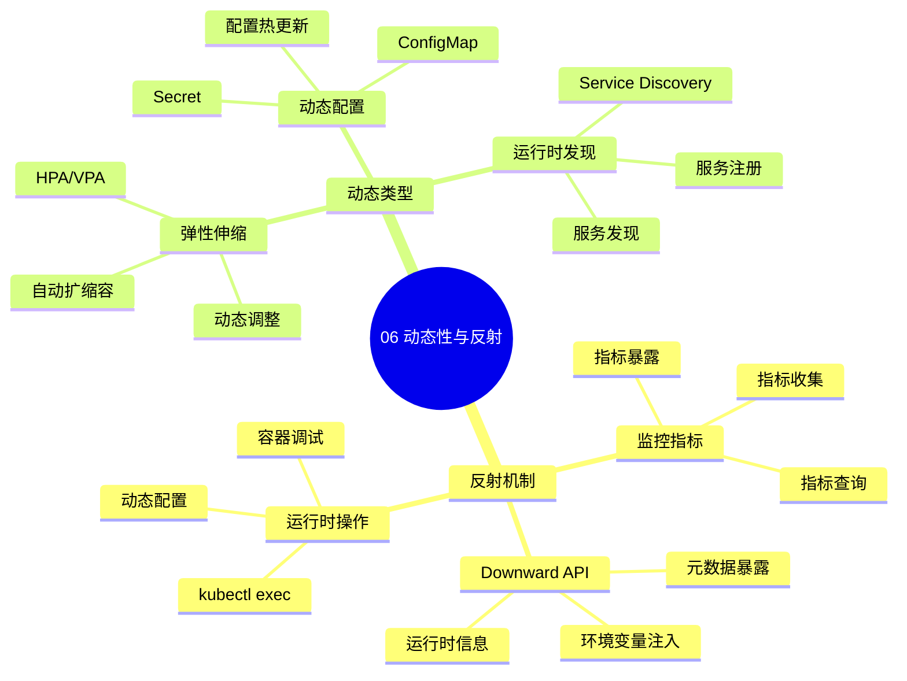

# 06. 动态性与反射

> **主题编号**: 06
> **主题名称**: 动态性与反射
> **最后更新**: 2025-01-XX

---

## 📋 目录

- [06. 动态性与反射](#06-动态性与反射)
  - [📋 目录](#-目录)
  - [1 主题概述](#1-主题概述)
  - [2 子主题导航](#2-子主题导航)
    - [2.1 61 反射Reflection](#21-61-反射reflection)
    - [2.2 62 动态类型 弹性伸缩](#22-62-动态类型-弹性伸缩)
  - [3 相关主题](#3-相关主题)

---

## 1 主题概述

本主题探讨**动态性与反射**在基础设施中的应用，包括反射机制和动态类型在弹性伸缩中的应用。

### 1.0 动态性与反射思维导图

**可视化文档**: 查看 [思维导图与知识矩阵](../思维导图与知识矩阵.md#36-06-动态性与反射) 获取更详细的思维导图。

---

## 2 子主题导航

### 2.1 [61 反射Reflection](061_反射md)

- Downward API
- 监控指标暴露
- kubectl exec

### 2.2 [62 动态类型 弹性伸缩](062_动态类型与弹性伸缩md)

- 无服务器计算
- 虚拟节点（Virtual Kubelet）
- 动态类型创建

---

## 3 相关主题

- [05. 高级类型特性映射](../05_高级类型特性/README.md)
- [07. 效应系统与副作用](../07_效应系统/README.md)
- [09. 形式化理论框架](../09_形式化理论/README.md)

---

**返回**: [主题索引](../README.md)
