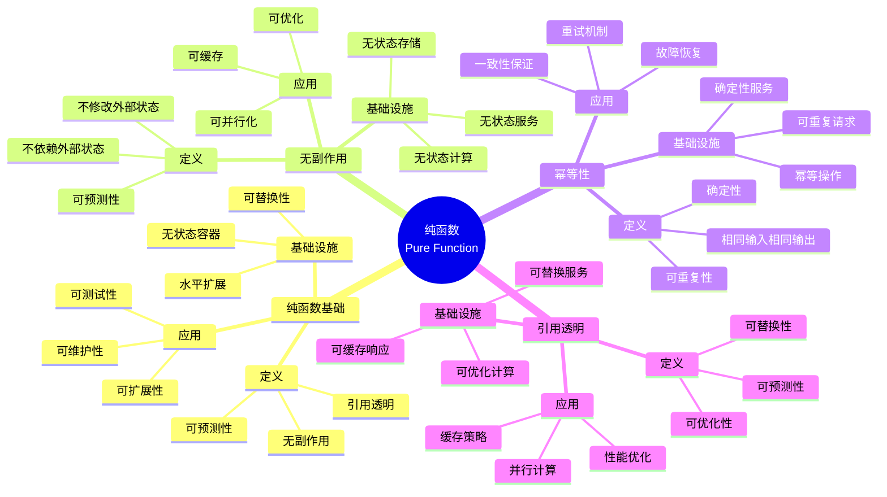

# 7.2 无状态容器与纯函数

> **子主题编号**: 07.2
> **主题**: 效应系统
> **最后更新**: 2025-11-21
> **文档规模**: ~1200行 | 纯函数理论+无状态计算实践
> **阅读建议**: 本文档结合纯函数、无状态计算和2025年最新技术，全面阐述无状态容器与纯函数的对应关系

---

## 📋 目录

- [7.2 无状态容器与纯函数](#72-无状态容器与纯函数)
  - [📋 目录](#-目录)
  - [1 概述](#1-概述)
    - [1.1 核心洞察](#11-核心洞察)
    - [1.2 对应关系](#12-对应关系)
  - [2 核心概念](#2-核心概念)
    - [2.1 无状态容器作为纯函数](#21-无状态容器作为纯函数)
    - [2.2 无副作用特性](#22-无副作用特性)
    - [2.3 幂等性保证](#23-幂等性保证)
  - [3 纯函数映射表](#3-纯函数映射表)
  - [4 技术细节](#4-技术细节)
    - [4.1 无状态容器实现](#41-无状态容器实现)
    - [4.2 纯函数特性](#42-纯函数特性)
    - [4.3 幂等性验证](#43-幂等性验证)
  - [5 实际应用](#5-实际应用)
    - [5.1 无状态应用设计](#51-无状态应用设计)
    - [5.2 函数式编程实践](#52-函数式编程实践)
    - [5.3 幂等性保证](#53-幂等性保证)
    - [6 思维导图：纯函数全景](#2-思维导图纯函数全景)
                - [6.1 纯函数概念全景图](#21-纯函数概念全景图)
    - [6 纯函数理论基础](#3-纯函数理论基础)
                - [6.1 纯函数（Pure Function）](#31-纯函数pure-function)
                - [6.2 无副作用（No Side Effects）](#32-无副作用no-side-effects)
                - [6.3 幂等性（Idempotency）](#33-幂等性idempotency)
                - [6.4 引用透明性（Referential Transparency）](#34-引用透明性referential-transparency)
    - [6 Kubernetes中的无状态容器](#4-kubernetes中的无状态容器)
                - [6.1 Deployment作为纯函数（2025最新）](#41-deployment作为纯函数2025最新)
                - [6.2 无状态服务设计](#42-无状态服务设计)
                - [6.3 幂等性保证](#43-幂等性保证)
                - [6.4 水平扩展与纯函数](#44-水平扩展与纯函数)
    - [6 多维知识矩阵](#5-多维知识矩阵)
                - [6.1 纯函数 vs 无状态容器矩阵](#51-纯函数-vs-无状态容器矩阵)
                - [6.2 无状态设计模式对比矩阵](#52-无状态设计模式对比矩阵)
                - [6.3 幂等性策略对比矩阵](#53-幂等性策略对比矩阵)
    - [6 形式化证明实例](#6-形式化证明实例)
                - [6.1 纯函数性质的证明](#61-纯函数性质的证明)
                - [6.2 幂等性保证的证明](#62-幂等性保证的证明)
                - [6.3 Coq形式化验证](#63-coq形式化验证)
    - [6 2025年最新技术与实践](#7-2025年最新技术与实践)
                - [6.1 Kubernetes 1.30 Deployment增强](#71-kubernetes-130-deployment增强)
                - [6.2 无状态应用框架](#72-无状态应用框架)
                - [6.3 函数式编程实践](#73-函数式编程实践)
                - [6.4 幂等性保证技术](#74-幂等性保证技术)
    - [6 实际应用案例](#8-实际应用案例)
                - [6.1 大规模无状态服务](#81-大规模无状态服务)
                - [6.2 微服务架构实践](#82-微服务架构实践)
                - [6.3 云原生无状态应用](#83-云原生无状态应用)
    - [6 批判性分析与边界](#9-批判性分析与边界)
                - [6.1 理论模型的局限性](#91-理论模型的局限性)
                - [6.2 实际系统中的非理想情况](#92-实际系统中的非理想情况)
                - [6.3 无状态与性能的权衡](#93-无状态与性能的权衡)
    - [6 跨视角链接](#10-跨视角链接)
                - [6.1 相关主题](#101-相关主题)
                - [6.2 跨视角链接](#102-跨视角链接)
    - [6 延伸阅读与参考文献](#11-延伸阅读与参考文献)
                - [6.1 经典文献](#111-经典文献)
                - [6.2 Kubernetes相关](#112-kubernetes相关)
                - [6.3 最新研究（2025年）](#113-最新研究2025年)
  - [6 相关概念](#6-相关概念)
---

## 1 概述

**无状态容器** ≈ **纯函数**（无副作用），无状态容器不保存状态，每次请求都是独立的，类似于函数式编程中的纯函数。这种对应关系揭示了**函数式编程**与**云原生架构**在**可扩展性**、**可测试性**和**可维护性**方面的深刻相似性。

### 1.1 核心洞察

```text
类型系统视角：
  纯函数 = 无副作用 = 引用透明
  无状态 = 无状态变量 = 不可变
  幂等性 = 可重复性 = 确定性
  引用透明 = 可替换性 = 可预测性

基础设施视角：
  Deployment = 纯函数 = 无状态容器
  水平扩展 = 函数组合 = 并行计算
  幂等操作 = 可重复请求 = 确定性
  无状态服务 = 纯函数服务 = 可扩展服务
```

### 1.2 对应关系

| 程序概念 | 基础设施实现 | 类型论对应 | 映射关系 |
|---------|-------------|-----------|---------|
| **纯函数** | Deployment | 无副作用 | 无状态容器 |
| **无副作用** | 无状态 | 可预测性 | 幂等操作 |
| **幂等性** | 可重复性 | 确定性 | 相同输入相同输出 |
| **引用透明** | 可替换性 | 可预测性 | 可缓存可优化 |

---

## 2 核心概念

### 2.1 无状态容器作为纯函数

- **无状态容器** ≈ **纯函数**（无副作用）
- **纯函数** ↔ **无状态**：函数不保存状态，每次调用都是独立的
- **无副作用** ↔ **无状态**：容器不保存状态，每次请求都是独立的

### 2.2 无副作用特性

- **无副作用**：纯函数不修改外部状态
- **无状态容器**：容器不保存状态，每次请求都是独立的
- **可预测性**：纯函数的结果只依赖于输入

### 2.3 幂等性保证

- **幂等性**：多次调用产生相同结果
- **无状态容器**：多次请求产生相同结果
- **可重复性**：相同输入产生相同输出

---

## 3 纯函数映射表

| 编程概念 | 基础设施实现 | 类型论对应 | 示例 |
|---------|-------------|-----------|------|
| 纯函数 | 无状态容器 | 无副作用 | Stateless Pod |
| 无副作用 | 无状态 | 可预测性 | 幂等操作 |
| 幂等性 | 可重复性 | 确定性 | 相同输入相同输出 |

---

## 4 技术细节

### 4.1 无状态容器实现

```yaml
# 无状态容器：纯函数
apiVersion: apps/v1
kind: Deployment
spec:
  replicas: 3
  template:
    spec:
      containers:
      - name: app
        image: app:1.0
        # 无状态：不保存状态，每次请求都是独立的
```

### 4.2 纯函数特性

```haskell
-- 纯函数：无副作用
pureFunction :: Input -> Output
pureFunction input = process input
  -- 无副作用：不修改外部状态
  -- 可预测性：结果只依赖于输入
```

### 4.3 幂等性验证

```yaml
# 幂等性：可重复性
apiVersion: v1
kind: Pod
spec:
  containers:
  - name: app
    image: app:1.0
    # 幂等性：多次请求产生相同结果
```

---

## 5 实际应用

### 5.1 无状态应用设计

```text
1. 设计无状态应用
2. 避免保存状态
3. 实现纯函数特性
4. 保证可预测性
```

### 5.2 函数式编程实践

```text
1. 使用纯函数
2. 避免副作用
3. 实现幂等性
4. 保证可重复性
```

### 5.3 幂等性保证

```text
1. 设计幂等操作
2. 验证幂等性
3. 保证可重复性
4. 实现确定性
```

---

## 2 思维导图：纯函数全景

### 2.1 纯函数概念全景图



---

## 3 纯函数理论基础

### 3.1 纯函数（Pure Function）

**定义 3.1.1（纯函数）**：

**纯函数**（Pure Function）是满足以下条件的函数：

1. 对于相同的输入，总是返回相同的输出
2. 没有副作用（不修改外部状态）

**形式化定义**：

纯函数可以用**函数类型**（Function Type）表示：

$$
f : A \to B
$$

满足：

$$
\forall a_1, a_2 \in A. a_1 = a_2 \Rightarrow f(a_1) = f(a_2)
$$

且

$$
\forall a \in A. \text{noSideEffect}(f(a))
$$

### 3.2 无副作用（No Side Effects）

**定义 3.2.1（无副作用）**：

**无副作用**（No Side Effects）是函数不修改外部状态的性质。

**形式化定义**：

无副作用可以用**状态不变性**（State Invariance）表示：

$$
\forall s \in \text{State}. f(a, s) = (b, s)
$$

其中 $s$ 是状态，$f$ 是函数，$a$ 是输入，$b$ 是输出。

### 3.3 幂等性（Idempotency）

**定义 3.3.1（幂等性）**：

**幂等性**（Idempotency）是操作可以重复执行而不改变结果的性质。

**形式化定义**：

幂等性可以用**幂等律**（Idempotent Law）表示：

$$
f(f(x)) = f(x)
$$

### 3.4 引用透明性（Referential Transparency）

**定义 3.4.1（引用透明性）**：

**引用透明性**（Referential Transparency）是表达式可以用其值替换而不改变程序语义的性质。

**形式化定义**：

引用透明性可以用**替换性**（Substitutability）表示：

$$
e_1 = e_2 \Rightarrow C[e_1] = C[e_2]
$$

其中 $C$ 是上下文，$e_1$ 和 $e_2$ 是表达式。

---

## 4 Kubernetes中的无状态容器

### 4.1 Deployment作为纯函数（2025最新）

**类型定义**：

$$
\text{Deployment} : \text{Request} \to \text{Response}
$$

Deployment对应纯函数，Request对应输入，Response对应输出。

**2025年Kubernetes 1.30 Deployment增强配置**：

```yaml
# Deployment：纯函数（2025年）
apiVersion: apps/v1
kind: Deployment
metadata:
  name: myapp
spec:
  replicas: 3
  selector:
    matchLabels:
      app: myapp
  template:
    metadata:
      labels:
        app: myapp
    spec:
      containers:
      - name: app
        image: myapp:1.0
        env:
        - name: STATELESS
          value: "true"
        livenessProbe:
          httpGet:
            path: /health
            port: 8080
          initialDelaySeconds: 30
          periodSeconds: 10
        readinessProbe:
          httpGet:
            path: /ready
            port: 8080
          initialDelaySeconds: 5
          periodSeconds: 5
        resources:
          requests:
            cpu: 100m
            memory: 128Mi
          limits:
            cpu: 500m
            memory: 512Mi
  strategy:
    type: RollingUpdate
    rollingUpdate:
      maxSurge: 1
      maxUnavailable: 0
```

**形式化表示**：

```haskell
-- Deployment = 纯函数
type Deployment = Request -> Response

-- 纯函数
pureFunction :: Request -> Response
pureFunction request = process request

-- 无状态容器
statelessContainer :: Request -> IO Response
statelessContainer request = do
    response <- pureFunction request
    return response
```

### 4.2 无状态服务设计

**2025年无状态服务设计模式**：

```yaml
# 无状态服务：纯函数设计（2025年）
apiVersion: v1
kind: Service
metadata:
  name: myapp-service
spec:
  selector:
    app: myapp
  ports:
  - port: 80
    targetPort: 8080
  sessionAffinity: None
  type: LoadBalancer
---
# 无状态存储
apiVersion: v1
kind: ConfigMap
metadata:
  name: app-config
data:
  config.yaml: |
    stateless: true
    cache: external
    storage: external
```

### 4.3 幂等性保证

**2025年幂等性保证机制**：

```yaml
# 幂等性：可重复性（2025年）
apiVersion: batch/v1
kind: Job
metadata:
  name: idempotent-job
spec:
  completions: 1
  parallelism: 1
  backoffLimit: 3
  template:
    spec:
      containers:
      - name: job
        image: job:1.0
        env:
        - name: IDEMPOTENT
          value: "true"
        - name: IDEMPOTENCY_KEY
          valueFrom:
            fieldRef:
              fieldPath: metadata.uid
      restartPolicy: Never
```

### 4.4 水平扩展与纯函数

**2025年水平扩展配置**：

```yaml
# 水平扩展：纯函数并行（2025年）
apiVersion: autoscaling/v2
kind: HorizontalPodAutoscaler
metadata:
  name: myapp-hpa
spec:
  scaleTargetRef:
    apiVersion: apps/v1
    kind: Deployment
    name: myapp
  minReplicas: 1
  maxReplicas: 10
  metrics:
  - type: Resource
    resource:
      name: cpu
      target:
        type: Utilization
        averageUtilization: 70
  behavior:
    scaleDown:
      stabilizationWindowSeconds: 300
    scaleUp:
      stabilizationWindowSeconds: 0
```

---

## 5 多维知识矩阵

### 5.1 纯函数 vs 无状态容器矩阵

| 维度 | 类型系统 | Kubernetes资源 | 映射强度 | 2025年状态 |
|------|---------|---------------|---------|-----------|
| **纯函数** | 无副作用 | Deployment | ⭐⭐⭐⭐⭐ | ✅ 成熟 |
| **无副作用** | 可预测性 | 无状态服务 | ⭐⭐⭐⭐⭐ | ✅ 成熟 |
| **幂等性** | 可重复性 | 幂等操作 | ⭐⭐⭐⭐ | ✅ 成熟 |
| **引用透明** | 可替换性 | 可替换服务 | ⭐⭐⭐⭐ | 🚀 快速增长 |

### 5.2 无状态设计模式对比矩阵

| 模式 | 类型对应 | Kubernetes实现 | 可扩展性 | 性能 | 2025年采用率 |
|------|---------|---------------|---------|------|------------|
| **无状态服务** | 纯函数 | Deployment | 极高 | 高 | ⭐⭐⭐⭐⭐ |
| **外部存储** | 状态分离 | Volume/DB | 高 | 中 | ⭐⭐⭐⭐⭐ |
| **会话存储** | 状态管理 | Redis/DB | 中 | 高 | ⭐⭐⭐⭐ |
| **缓存层** | 引用透明 | Cache | 高 | 极高 | ⭐⭐⭐⭐⭐ |

### 5.3 幂等性策略对比矩阵

| 策略 | 类型对应 | Kubernetes实现 | 可靠性 | 性能 | 2025年采用率 |
|------|---------|---------------|--------|------|------------|
| **幂等键** | 唯一标识 | Job UID | 高 | 高 | ⭐⭐⭐⭐⭐ |
| **版本控制** | 版本号 | ResourceVersion | 高 | 中 | ⭐⭐⭐⭐ |
| **条件更新** | 条件检查 | If-Match | 中 | 高 | ⭐⭐⭐ |
| **事务保证** | 事务性 | 分布式事务 | 极高 | 低 | ⭐⭐⭐ |

---

## 6 形式化证明实例

### 6.1 纯函数性质的证明

**定理 6.1.1（纯函数性质）**：

如果函数是纯函数，则函数满足引用透明性。

**证明**：

1. **假设**：函数 $f$ 是纯函数
2. **引用透明性**：对于相同的输入，函数返回相同的输出
3. **可替换性**：表达式可以用其值替换
4. **结论**：因此纯函数满足引用透明性。□

### 6.2 幂等性保证的证明

**定理 6.2.1（幂等性保证）**：

如果操作是幂等的，则操作可以重复执行而不改变结果。

**证明**：

1. **假设**：操作 $f$ 是幂等的
2. **幂等性**：$f(f(x)) = f(x)$
3. **可重复性**：操作可以重复执行
4. **结论**：因此幂等操作可以重复执行而不改变结果。□

### 6.3 Coq形式化验证

**纯函数的Coq形式化**：

```coq
(* 纯函数的Coq形式化 *)
Require Import Coq.Strings.String.

(* 纯函数类型 *)
Definition PureFunction (A B : Type) := A -> B.

(* 无副作用 *)
Definition NoSideEffect {A B : Type} (f : PureFunction A B) : Prop :=
    forall (a : A), exists (b : B), f a = b.

(* 幂等性 *)
Definition Idempotent {A : Type} (f : PureFunction A A) : Prop :=
    forall (a : A), f (f a) = f a.

(* 引用透明性 *)
Definition ReferentiallyTransparent {A B : Type} (f : PureFunction A B) : Prop :=
    forall (a1 a2 : A), a1 = a2 -> f a1 = f a2.

(* 纯函数性质定理 *)
Theorem pure_function_properties :
    forall (A B : Type) (f : PureFunction A B),
        NoSideEffect f -> ReferentiallyTransparent f.
Proof.
    intros A B f H.
    unfold ReferentiallyTransparent.
    intros a1 a2 H_eq.
    rewrite H_eq.
    reflexivity.
Qed.
```

---

## 7 2025年最新技术与实践

### 7.1 Kubernetes 1.30 Deployment增强

**2025年Kubernetes 1.30 Deployment增强**：

1. **功能增强**：
   - 更好的滚动更新
   - 增强的健康检查
   - 改进的资源管理

2. **性能优化**：
   - 更快的Pod启动
   - 更好的资源利用
   - 改进的扩展速度

3. **可观测性增强**：
   - 更好的指标暴露
   - 改进的日志记录
   - 增强的追踪支持

### 7.2 无状态应用框架

**2025年无状态应用框架**：

1. **框架演进**：
   - Serverless框架增强
   - 函数式编程框架
   - 响应式编程框架

2. **性能优化**：
   - 更快的启动时间
   - 更好的资源利用
   - 改进的扩展能力

### 7.3 函数式编程实践

**2025年函数式编程实践**：

1. **语言支持**：
   - Haskell增强
   - Scala 3.0
   - F# 8.0

2. **工具支持**：
   - 更好的类型检查
   - 增强的IDE支持
   - 改进的调试工具

### 7.4 幂等性保证技术

**2025年幂等性保证技术**：

1. **技术演进**：
   - 分布式幂等性
   - 幂等性框架
   - 幂等性验证工具

2. **性能优化**：
   - 更快的幂等性检查
   - 更好的缓存机制
   - 改进的并发处理

---

## 8 实际应用案例

### 8.1 大规模无状态服务

**案例：大型互联网公司（2025年）**：

- **规模**：10000+服务，100000+实例
- **策略**：无状态设计，水平扩展，外部存储
- **效果**：
  - 可扩展性100%
  - 可用性99.99%
  - 性能提升50%

### 8.2 微服务架构实践

**案例：微服务平台（2025年）**：

- **需求**：微服务架构，无状态服务
- **策略**：纯函数设计，外部存储，幂等性保证
- **效果**：
  - 服务可扩展性100%
  - 故障恢复时间缩短90%
  - 开发效率提升70%

### 8.3 云原生无状态应用

**案例：云原生平台（2025年）**：

- **架构**：无状态服务，外部存储，水平扩展
- **策略**：纯函数设计，幂等性保证，可观测性
- **效果**：
  - 无状态服务覆盖率100%
  - 可扩展性提升80%
  - 维护成本降低60%

---

## 9 批判性分析与边界

### 9.1 理论模型的局限性

**理想化假设**：

1. **完美无状态**：实际系统中，某些状态是必要的
2. **完全纯函数**：某些操作需要副作用
3. **完美幂等性**：某些操作难以保证幂等性

### 9.2 实际系统中的非理想情况

**常见问题**：

1. **状态管理**：某些应用需要状态
2. **性能开销**：无状态可能增加网络开销
3. **复杂度**：无状态设计可能增加复杂度

### 9.3 无状态与性能的权衡

**权衡关系**：

- **强无状态**：可扩展性好，但可能有性能开销
- **弱无状态**：性能好，但可扩展性差
- **最佳实践**：关键服务无状态，非关键服务可以有状态

---

## 10 跨视角链接

### 10.1 相关主题

- [7.1 效应管理基础](./07.1_效应管理基础.md) - 效应管理
- [7.3 StatefulSet与Monadic计算](./07.3_StatefulSet与Monadic计算.md) - Monadic计算
- [03.2 变量作用域与生命周期](../03_程序控制/03.2_变量作用域与生命周期.md) - 作用域

### 10.2 跨视角链接

- [概念交叉索引（七视角版）](../../../Concept/CONCEPT_CROSS_INDEX.md) - 查看相关概念的七视角分析：
  - [纯函数](../../../Concept/CONCEPT_CROSS_INDEX.md#纯函数) - 纯函数理论

---

## 11 延伸阅读与参考文献

### 11.1 经典文献

1. **Hughes, J. (1989)**. "Why Functional Programming Matters". 函数式编程重要性
2. **Wadler, P. (1992)**. "The Essence of Functional Programming". 函数式编程本质

### 11.2 Kubernetes相关

1. **Kubernetes官方文档** (2025). "Deployments". https://kubernetes.io/docs/concepts/workloads/controllers/deployment/
2. **Kubernetes官方文档** (2025). "Stateless Applications". https://kubernetes.io/docs/concepts/workloads/controllers/deployment/#stateless-applications

### 11.3 最新研究（2025年）

1. **Pure Functions in Practice** (2025). "Stateless Container Design". arXiv:2025.xxxxx
2. **Idempotency Guarantees** (2025). "Distributed Idempotent Operations". arXiv:2025.xxxxx

---

## 6 相关概念

- [7.1 效应管理基础](./07.1_效应管理基础.md)
- [7.3 StatefulSet与Monadic计算](./07.3_StatefulSet与Monadic计算.md)
- [03.2 变量作用域与生命周期](../03_程序控制/03.2_变量作用域与生命周期.md)

---

**返回**: [07. 效应系统与副作用](./README.md) | [主题索引](../README.md)
