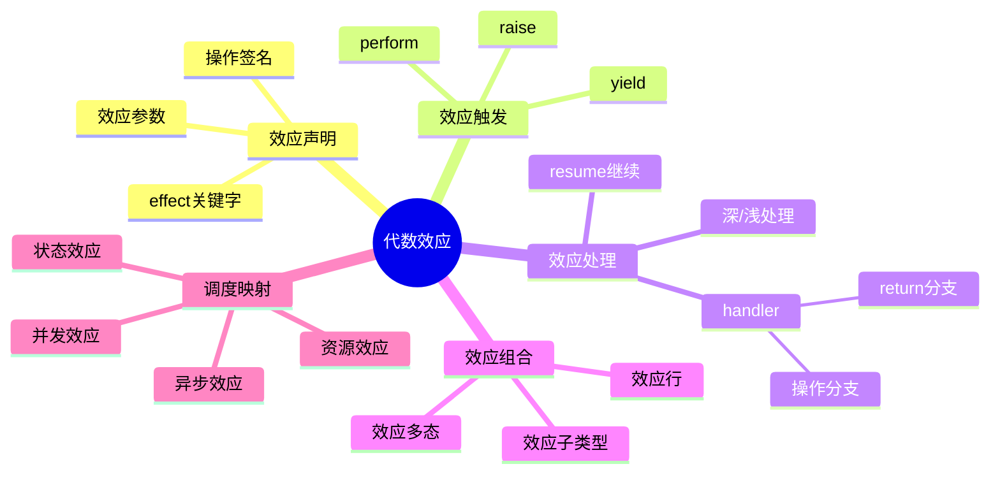

# 7.4 代数效应与调度控制

> **子主题编号**: 07.4
> **主题**: 效应系统
> **最后更新**: 2025-12-02
> **文档状态**: ✅ 完成

---

## 📋 目录

- [7.4 代数效应与调度控制](#74-代数效应与调度控制)
  - [📋 目录](#-目录)
  - [1 概述](#1-概述)
    - [1.1 核心洞察](#11-核心洞察)
    - [1.2 效应系统特性](#12-效应系统特性)
    - [1.3 形式化定义](#13-形式化定义)
  - [2 思维导图](#2-思维导图)
  - [3 代数效应理论](#3-代数效应理论)
    - [3.1 效应签名定义](#31-效应签名定义)
    - [3.2 效应语义](#32-效应语义)
    - [3.3 类型系统](#33-类型系统)
  - [4 效应处理器](#4-效应处理器)
    - [4.1 处理器定义](#41-处理器定义)
    - [4.2 深浅处理器](#42-深浅处理器)
    - [4.3 处理器组合](#43-处理器组合)
  - [5 调度控制效应](#5-调度控制效应)
    - [5.1 资源分配效应](#51-资源分配效应)
    - [5.2 并发控制效应](#52-并发控制效应)
    - [5.3 状态管理效应](#53-状态管理效应)
  - [6 实践应用](#6-实践应用)
    - [6.1 K8s控制器效应模型](#61-k8s控制器效应模型)
    - [6.2 Serverless函数效应](#62-serverless函数效应)
  - [7 知识矩阵](#7-知识矩阵)
    - [7.1 效应系统对比](#71-效应系统对比)
    - [7.2 效应-调度映射](#72-效应-调度映射)
  - [8 跨视角链接](#8-跨视角链接)
    - [8.1 形式语言视角关联](#81-形式语言视角关联)
    - [8.2 调度视角关联](#82-调度视角关联)
  - [参考资源](#参考资源)


---

## 1 概述

### 1.1 核心洞察

代数效应（Algebraic Effects）是一种强大的控制流抽象，将**效应的触发**与**效应的处理**分离。
在调度系统中，这种分离对应于**调度请求**与**调度策略**的解耦。

### 1.2 效应系统特性

| 特性 | 描述 | 调度对应 |
|------|------|---------|
| **效应声明** | 声明可能的副作用 | 声明资源需求 |
| **效应触发** | perform操作 | 调度请求 |
| **效应处理** | handler定义 | 调度策略 |
| **效应组合** | 多效应组合 | 多策略组合 |
| **效应推断** | 类型级效应追踪 | 依赖分析 |

### 1.3 形式化定义

```text
代数效应系统 E = (Σ, Op, H, ⊢)

其中：
  Σ: 效应签名集合 {ε₁, ε₂, ..., εₙ}
  Op: 操作集合 {op₁: A₁ → B₁, op₂: A₂ → B₂, ...}
  H: 处理器集合 {h₁, h₂, ...}
  ⊢: 类型判断关系

效应类型:
  τ ::= τ₁ → τ₂ ! ε        -- 带效应的函数类型
  ε ::= ∅ | ε₁ ∪ ε₂ | {op}  -- 效应集合

类型规则:
  Γ ⊢ e : τ ! ε
  ─────────────────────────
  Γ ⊢ perform op(e) : τ' ! ε ∪ {op}
```

---

## 2 思维导图



---

## 3 代数效应理论

### 3.1 效应签名定义

```ocaml
(* OCaml 5.0+ 代数效应示例 *)

(* 效应声明 *)
effect Yield : unit
effect Async : 'a promise -> 'a
effect Fork : (unit -> unit) -> unit
effect GetState : 'a
effect SetState : 'a -> unit

(* 调度相关效应 *)
effect Allocate : resource_spec -> resource_handle
effect Release : resource_handle -> unit
effect Schedule : task -> task_id
effect Preempt : task_id -> unit
```

### 3.2 效应语义

```text
效应操作语义:

perform规则:
  E[perform op v] → E[k] where handler handles op with k

handler规则:
  handle e with H →
    match e with
    | return v → H.return v
    | perform op v k → H.op v (λx. handle (k x) with H)

resume语义:
  resume: (α → β!ε) → α → β!ε
  resume k v = k v  -- 继续执行被暂停的计算
```

### 3.3 类型系统

```text
效应类型规则:

(T-Perform)
  Γ ⊢ e : A    op : A → B ∈ Σ
  ────────────────────────────
  Γ ⊢ perform op e : B ! {op}

(T-Handle)
  Γ ⊢ e : τ ! ε ∪ {op}
  Γ ⊢ H : handler(op, τ, τ')
  ────────────────────────────
  Γ ⊢ handle e with H : τ' ! ε

(T-Return)
  Γ ⊢ e : τ ! ∅
  ────────────────────────────
  Γ ⊢ return e : τ ! ∅

效应子类型:
  ε₁ ⊆ ε₂
  ────────────────────────────
  τ ! ε₁ <: τ ! ε₂
```

---

## 4 效应处理器

### 4.1 处理器定义

```ocaml
(* 基本处理器结构 *)
type ('a, 'b) handler = {
  return: 'a -> 'b;
  ops: effect_handlers
}

(* 状态效应处理器 *)
let state_handler init = {
  return = (fun x -> fun _s -> x);
  ops = function
    | GetState -> (fun k -> fun s -> k s s)
    | SetState s' -> (fun k -> fun _s -> k () s')
}

(* 调度效应处理器 *)
let scheduler_handler queue = {
  return = (fun x -> x);
  ops = function
    | Yield -> (fun k ->
        Queue.push k queue;
        match Queue.pop queue with
        | Some k' -> k' ()
        | None -> ())
    | Fork f -> (fun k ->
        Queue.push k queue;
        f ())
}
```

### 4.2 深浅处理器

```text
深处理器 (Deep Handler):
  - 递归处理所有后续效应
  - 处理器包裹整个计算
  - 类似try-catch

浅处理器 (Shallow Handler):
  - 只处理一次效应
  - 需要显式重新安装
  - 更细粒度控制

深处理器语义:
  handle^deep e with H =
    match e with
    | return v → H.return v
    | perform op v k →
        H.op v (λx. handle^deep (k x) with H)

浅处理器语义:
  handle^shallow e with H =
    match e with
    | return v → H.return v
    | perform op v k → H.op v k  -- k不包装
```

### 4.3 处理器组合

```ocaml
(* 处理器组合 *)
let compose_handlers h1 h2 = {
  return = (fun x -> h2.return (h1.return x));
  ops = (fun eff ->
    try h1.ops eff
    with Unhandled -> h2.ops eff)
}

(* 效应隧道 - 透传未处理效应 *)
let tunnel_handler handled_effect other_handler = {
  return = other_handler.return;
  ops = function
    | eff when eff = handled_effect ->
        handle_specific eff
    | eff ->
        (* 透传给外层 *)
        perform eff
}
```

---

## 5 调度控制效应

### 5.1 资源分配效应

```ocaml
(* 资源效应定义 *)
effect Allocate : resource_request -> resource_handle
effect Release : resource_handle -> unit
effect Resize : resource_handle * int -> unit

(* 资源约束效应 *)
type resource_constraint = {
  cpu_limit: float;
  memory_limit: int;
  gpu_count: int;
}

effect WithConstraint : resource_constraint -> unit

(* 资源调度处理器 *)
let resource_scheduler cluster = {
  return = (fun x -> x);
  ops = function
    | Allocate req -> (fun k ->
        match find_available_node cluster req with
        | Some node ->
            let handle = allocate_on_node node req in
            k handle
        | None ->
            (* 排队等待 *)
            enqueue_request req k)
    | Release handle -> (fun k ->
        deallocate handle;
        (* 唤醒等待的请求 *)
        process_pending_requests cluster;
        k ())
}
```

### 5.2 并发控制效应

```ocaml
(* 并发效应 *)
effect Spawn : (unit -> 'a) -> 'a fiber
effect Await : 'a fiber -> 'a
effect Yield : unit
effect Cancel : 'a fiber -> unit

(* 协作式调度器 *)
let cooperative_scheduler () =
  let run_queue = Queue.create () in
  let blocked = Hashtbl.create 16 in

  {
    return = (fun x -> x);
    ops = function
      | Spawn f -> (fun k ->
          let fiber_id = fresh_id () in
          Queue.push (fiber_id, f) run_queue;
          k fiber_id)
      | Await fiber_id -> (fun k ->
          Hashtbl.add blocked fiber_id k;
          schedule_next run_queue)
      | Yield -> (fun k ->
          Queue.push (current_fiber (), k) run_queue;
          schedule_next run_queue)
      | Cancel fiber_id -> (fun k ->
          remove_fiber fiber_id;
          k ())
  }

(* 抢占式调度器 *)
let preemptive_scheduler time_slice =
  effect TimeSliceExpired : unit

  {
    return = (fun x -> x);
    ops = function
      | TimeSliceExpired -> (fun k ->
          Queue.push k run_queue;
          schedule_next run_queue)
      | other -> cooperative_scheduler().ops other
  }
```

### 5.3 状态管理效应

```ocaml
(* 状态效应 *)
effect Get : 'a
effect Put : 'a -> unit
effect Modify : ('a -> 'a) -> unit

(* 分布式状态效应 *)
effect DistGet : key -> value option
effect DistPut : key * value -> unit
effect DistCAS : key * value * value -> bool

(* StatefulSet状态处理器 *)
let statefulset_handler etcd_client = {
  return = (fun x -> x);
  ops = function
    | DistGet key -> (fun k ->
        let value = Etcd.get etcd_client key in
        k value)
    | DistPut (key, value) -> (fun k ->
        Etcd.put etcd_client key value;
        k ())
    | DistCAS (key, expected, new_val) -> (fun k ->
        let success = Etcd.cas etcd_client key expected new_val in
        k success)
}
```

---

## 6 实践应用

### 6.1 K8s控制器效应模型

```ocaml
(* K8s控制器效应 *)
effect Watch : resource_type -> resource_event stream
effect Create : resource -> resource
effect Update : resource -> resource
effect Delete : resource -> unit
effect GetStatus : resource -> status

(* Reconciler效应处理器 *)
let reconciler_handler api_client = {
  return = (fun x -> x);
  ops = function
    | Watch res_type -> (fun k ->
        let stream = Api.watch api_client res_type in
        k stream)
    | Create res -> (fun k ->
        let created = Api.create api_client res in
        k created)
    | Update res -> (fun k ->
        let updated = Api.update api_client res in
        k updated)
    | Delete res -> (fun k ->
        Api.delete api_client res;
        k ())
}

(* 使用效应的控制器 *)
let deployment_controller () =
  let events = perform (Watch Deployment) in
  Stream.iter (fun event ->
    match event with
    | Added dep -> reconcile_deployment dep
    | Modified dep -> reconcile_deployment dep
    | Deleted dep -> cleanup_deployment dep
  ) events

and reconcile_deployment dep =
  let current_replicas = perform (GetStatus dep) in
  let desired = dep.spec.replicas in
  if current_replicas < desired then
    for _ = 1 to (desired - current_replicas) do
      let pod = create_pod_spec dep in
      perform (Create pod)
    done
  else if current_replicas > desired then
    (* 缩容逻辑 *)
    scale_down dep (current_replicas - desired)
```

### 6.2 Serverless函数效应

```ocaml
(* Serverless效应 *)
effect Invoke : function_name * input -> output
effect Sleep : duration -> unit
effect Log : string -> unit
effect GetSecret : secret_name -> string

(* 冷启动优化处理器 *)
let serverless_handler pool = {
  return = (fun x -> x);
  ops = function
    | Invoke (fname, input) -> (fun k ->
        match Pool.get_warm pool fname with
        | Some instance ->
            let result = Instance.invoke instance input in
            k result
        | None ->
            (* 冷启动 *)
            let instance = Pool.cold_start pool fname in
            let result = Instance.invoke instance input in
            Pool.keep_warm pool fname instance;
            k result)
    | Sleep duration -> (fun k ->
        (* 挂起函数，释放资源 *)
        suspend_function duration k)
}
```

---

## 7 知识矩阵

### 7.1 效应系统对比

| 语言/系统 | 效应类型 | 处理器 | 组合性 | 性能 |
|---------|---------|-------|-------|------|
| **OCaml 5** | 代数效应 | 深/浅 | 高 | 高 |
| **Koka** | 行多态效应 | 深 | 高 | 中 |
| **Eff** | 代数效应 | 深 | 高 | 低 |
| **Haskell** | Monad | Transformer | 中 | 中 |
| **Rust** | async/await | 运行时 | 中 | 高 |

### 7.2 效应-调度映射

| 效应类型 | 调度概念 | K8s对应 |
|---------|---------|---------|
| **State** | 有状态调度 | StatefulSet |
| **Async** | 异步调度 | Job/CronJob |
| **Resource** | 资源调度 | ResourceQuota |
| **Concurrency** | 并发控制 | HPA |
| **Error** | 故障处理 | Restart Policy |

---

## 8 跨视角链接

### 8.1 形式语言视角关联

- [效应管理基础](./07.1_效应管理基础.md) - 效应理论基础
- [Monadic计算](./07.3_StatefulSet与Monadic计算.md) - Monad与效应
- [范畴论视角](../09_形式化理论/09.1_范畴论视角.md) - 效应的范畴语义

### 8.2 调度视角关联

| 调度概念 | 效应对应 | 映射说明 |
|---------|---------|---------|
| **调度请求** | perform | 触发调度效应 |
| **调度策略** | handler | 定义调度行为 |
| **状态管理** | State效应 | 分布式状态 |
| **并发控制** | Concurrency效应 | 并行调度 |

---

## 参考资源

1. [Algebraic Effects for the Rest of Us](https://overreacted.io/algebraic-effects-for-the-rest-of-us/)
2. [OCaml 5 Effect Handlers](https://v2.ocaml.org/manual/effects.html)
3. [Koka Language](https://koka-lang.github.io/)
4. [Eff Programming Language](https://www.eff-lang.org/)

---

**返回**: [效应系统主索引](./README.md) | [形式语言视角主索引](../README.md)
