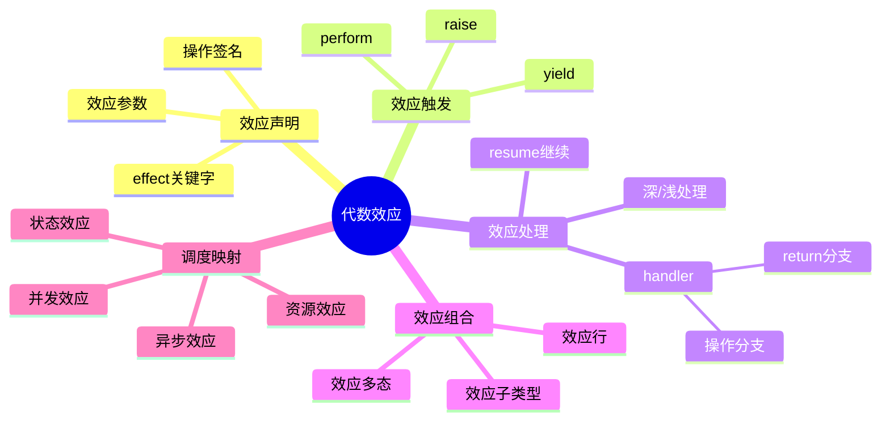
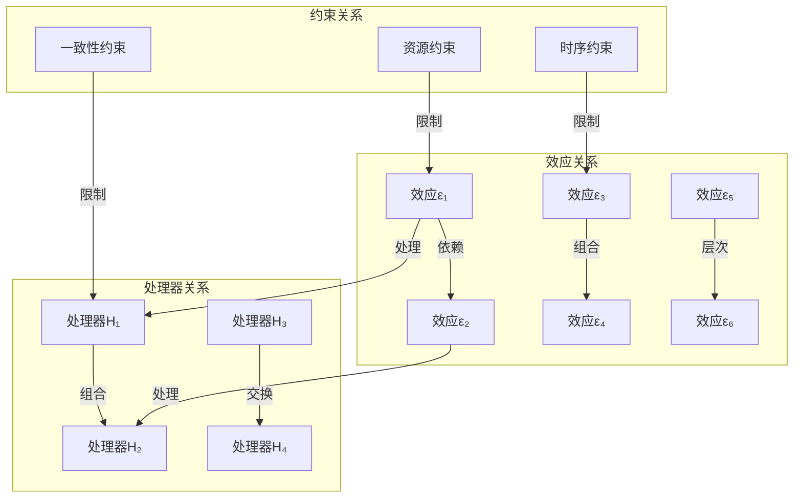

# 7.4 代数效应与调度控制

> **子主题编号**: 07.4
> **主题**: 效应系统
> **最后更新**: 2025-12-02
> **文档状态**: ✅ 完成

---

## 📋 目录

- [7.4 代数效应与调度控制](#74-代数效应与调度控制)
  - [📋 目录](#-目录)
  - [1 概述](#1-概述)
    - [1.1 核心洞察](#11-核心洞察)
    - [1.2 效应系统特性](#12-效应系统特性)
    - [1.3 形式化定义](#13-形式化定义)
    - [1.4 核心概念精确定义](#14-核心概念精确定义)
      - [1.4.1 代数效应（Algebraic Effect）](#141-代数效应algebraic-effect)
      - [1.4.2 效应处理器（Effect Handler）](#142-效应处理器effect-handler)
      - [1.4.3 效应与调度的同构关系](#143-效应与调度的同构关系)
    - [1.5 设计原理与动机](#15-设计原理与动机)
      - [1.5.1 为什么分离效应触发与处理？](#151-为什么分离效应触发与处理)
      - [1.5.2 调度系统的效应抽象](#152-调度系统的效应抽象)
  - [2 思维导图](#2-思维导图)
  - [3 代数效应理论](#3-代数效应理论)
    - [3.1 效应签名定义](#31-效应签名定义)
    - [3.2 效应语义](#32-效应语义)
    - [3.3 类型系统](#33-类型系统)
      - [3.3.1 类型系统的语义解释](#331-类型系统的语义解释)
      - [3.3.2 类型安全性质](#332-类型安全性质)
      - [3.3.3 效应推断算法](#333-效应推断算法)
  - [4 效应处理器](#4-效应处理器)
    - [4.1 处理器定义](#41-处理器定义)
    - [4.2 深浅处理器](#42-深浅处理器)
      - [4.2.1 深浅处理器的形式化定义](#421-深浅处理器的形式化定义)
      - [4.2.2 深浅处理器的选择原则](#422-深浅处理器的选择原则)
      - [4.2.3 处理器转换定理](#423-处理器转换定理)
    - [4.3 处理器组合](#43-处理器组合)
  - [5 调度控制效应](#5-调度控制效应)
    - [5.1 资源分配效应](#51-资源分配效应)
    - [5.2 并发控制效应](#52-并发控制效应)
    - [5.3 状态管理效应](#53-状态管理效应)
  - [6 实践应用](#6-实践应用)
    - [6.1 K8s控制器效应模型](#61-k8s控制器效应模型)
    - [6.2 Serverless函数效应](#62-serverless函数效应)
  - [7 知识矩阵](#7-知识矩阵)
    - [7.1 效应系统对比](#71-效应系统对比)
    - [7.2 效应-调度映射](#72-效应-调度映射)
  - [8 关系属性与依赖分析](#8-关系属性与依赖分析)
    - [8.1 效应之间的关系](#81-效应之间的关系)
      - [8.1.1 效应依赖关系](#811-效应依赖关系)
      - [8.1.2 效应组合关系](#812-效应组合关系)
      - [8.1.3 效应层次结构](#813-效应层次结构)
    - [8.2 处理器之间的关系](#82-处理器之间的关系)
      - [8.2.1 处理器组合律](#821-处理器组合律)
      - [8.2.2 处理器交换律](#822-处理器交换律)
      - [8.2.3 处理器单位元](#823-处理器单位元)
    - [8.3 效应与调度的约束关系](#83-效应与调度的约束关系)
      - [8.3.1 资源约束](#831-资源约束)
      - [8.3.2 时序约束](#832-时序约束)
      - [8.3.3 一致性约束](#833-一致性约束)
    - [8.4 形式化关系图](#84-形式化关系图)
  - [9 跨视角链接](#9-跨视角链接)
    - [9.1 形式语言视角关联](#91-形式语言视角关联)
    - [9.2 调度视角关联](#92-调度视角关联)
    - [9.3 关系属性映射](#93-关系属性映射)
  - [参考资源](#参考资源)


---

## 1 概述

### 1.1 核心洞察

代数效应（Algebraic Effects）是一种强大的控制流抽象，将**效应的触发**与**效应的处理**分离。
在调度系统中，这种分离对应于**调度请求**与**调度策略**的解耦。

### 1.2 效应系统特性

| 特性 | 描述 | 调度对应 |
|------|------|---------|
| **效应声明** | 声明可能的副作用 | 声明资源需求 |
| **效应触发** | perform操作 | 调度请求 |
| **效应处理** | handler定义 | 调度策略 |
| **效应组合** | 多效应组合 | 多策略组合 |
| **效应推断** | 类型级效应追踪 | 依赖分析 |

### 1.3 形式化定义

```text
代数效应系统 E = (Σ, Op, H, ⊢)

其中：
  Σ: 效应签名集合 {ε₁, ε₂, ..., εₙ}
  Op: 操作集合 {op₁: A₁ → B₁, op₂: A₂ → B₂, ...}
  H: 处理器集合 {h₁, h₂, ...}
  ⊢: 类型判断关系

效应类型:
  τ ::= τ₁ → τ₂ ! ε        -- 带效应的函数类型
  ε ::= ∅ | ε₁ ∪ ε₂ | {op}  -- 效应集合

类型规则:
  Γ ⊢ e : τ ! ε
  ─────────────────────────
  Γ ⊢ perform op(e) : τ' ! ε ∪ {op}
```

### 1.4 核心概念精确定义

#### 1.4.1 代数效应（Algebraic Effect）

**定义**：代数效应是一种**可组合的副作用抽象机制**，通过代数结构（签名、操作、方程）描述计算中的非局部控制流。

**关键属性**：

- **可组合性**：多个效应可以组合而不相互干扰
- **可交换性**：效应处理的顺序不影响最终结果（在满足交换律的情况下）
- **可替换性**：同一效应的不同处理器可以互换

**形式化表述**：

```text
效应 ε 是代数的，当且仅当：
  ∀ handlers H₁, H₂: handle(handle(e, H₁), H₂) = handle(e, compose(H₁, H₂))
```

#### 1.4.2 效应处理器（Effect Handler）

**定义**：效应处理器是一个**从效应操作到具体实现的映射**，定义了当遇到特定效应时如何执行。

**结构**：

```text
Handler H = {
  return: α → β,              -- 正常返回处理
  op₁: A₁ → (B₁ → β) → β,     -- 操作1的处理
  op₂: A₂ → (B₂ → β) → β,     -- 操作2的处理
  ...
}
```

**关键性质**：

- **类型安全**：处理器必须处理所有可能的效应操作
- **组合性**：处理器可以组合形成复合处理器
- **可扩展性**：可以添加新操作而不修改现有代码

#### 1.4.3 效应与调度的同构关系

**定理 1.1**（效应-调度同构）：

```text
调度系统 (S, A, T, σ) 与效应系统 (Σ, Op, H, ⊢) 之间存在同构映射：

  S (调度状态)    ↔  Σ (效应签名)
  A (调度动作)    ↔  Op (效应操作)
  T (调度策略)    ↔  H (效应处理器)
  σ (调度函数)    ↔  handle (效应处理)
```

**证明思路**：

1. **状态映射**：调度状态对应效应签名，两者都描述系统的可能行为
2. **动作映射**：调度动作（分配、抢占）对应效应操作（Allocate、Preempt）
3. **策略映射**：调度策略（FIFO、优先级）对应效应处理器（不同handler实现）
4. **函数映射**：调度函数σ与handle都执行状态转换

**推论 1.1**：调度系统的组合性由效应系统的代数性质保证。

### 1.5 设计原理与动机

#### 1.5.1 为什么分离效应触发与处理？

**问题**：传统Monad将效应与计算紧密耦合，导致：

- 难以组合多个效应
- 难以替换效应实现
- 难以测试和模拟

**解决方案**：代数效应通过分离**声明**（perform）和**实现**（handler）实现解耦。

**优势论证**：

```text
传统Monad方式:
  compute :: State s a → State s b
  问题：State效应硬编码，无法替换为其他状态管理方式

代数效应方式:
  compute :: (Has State ε) => a → b ! ε
  优势：可以传入不同的State handler，实现可替换
```

#### 1.5.2 调度系统的效应抽象

**核心洞察**：调度决策本质上是**控制流效应**，而非数据计算。

**论证**：

1. **非局部性**：调度决策影响整个系统，不局限于单个函数
2. **可组合性**：多个调度策略需要组合（如优先级+公平性）
3. **可替换性**：同一作业在不同调度策略下行为不同

**形式化表述**：

```text
调度效应 ε_schedule = {
  Allocate: ResourceSpec → ResourceHandle,
  Release: ResourceHandle → Unit,
  Schedule: Task → TaskId,
  Preempt: TaskId → Unit
}

调度处理器 H_schedule = {
  Allocate → 资源分配策略,
  Release → 资源释放策略,
  Schedule → 任务调度策略,
  Preempt → 抢占策略
}
```

---

## 2 思维导图



---

## 3 代数效应理论

### 3.1 效应签名定义

```ocaml
(* OCaml 5.0+ 代数效应示例 *)

(* 效应声明 *)
effect Yield : unit
effect Async : 'a promise -> 'a
effect Fork : (unit -> unit) -> unit
effect GetState : 'a
effect SetState : 'a -> unit

(* 调度相关效应 *)
effect Allocate : resource_spec -> resource_handle
effect Release : resource_handle -> unit
effect Schedule : task -> task_id
effect Preempt : task_id -> unit
```

### 3.2 效应语义

```text
效应操作语义:

perform规则:
  E[perform op v] → E[k] where handler handles op with k

handler规则:
  handle e with H →
    match e with
    | return v → H.return v
    | perform op v k → H.op v (λx. handle (k x) with H)

resume语义:
  resume: (α → β!ε) → α → β!ε
  resume k v = k v  -- 继续执行被暂停的计算
```

### 3.3 类型系统

```text
效应类型规则:

(T-Perform)
  Γ ⊢ e : A    op : A → B ∈ Σ
  ────────────────────────────
  Γ ⊢ perform op e : B ! {op}

(T-Handle)
  Γ ⊢ e : τ ! ε ∪ {op}
  Γ ⊢ H : handler(op, τ, τ')
  ────────────────────────────
  Γ ⊢ handle e with H : τ' ! ε

(T-Return)
  Γ ⊢ e : τ ! ∅
  ────────────────────────────
  Γ ⊢ return e : τ ! ∅

效应子类型:
  ε₁ ⊆ ε₂
  ────────────────────────────
  τ ! ε₁ <: τ ! ε₂
```

#### 3.3.1 类型系统的语义解释

**类型规则的含义**：

1. **T-Perform规则**：
   - **前提**：表达式e有类型A，操作op将A映射到B
   - **结论**：perform操作产生类型B的值，并引入效应{op}
   - **语义**：执行操作op会触发相应的效应，类型系统追踪这个效应

2. **T-Handle规则**：
   - **前提**：表达式e有效应ε∪{op}，处理器H可以处理op
   - **结论**：处理后效应减少为ε（移除了{op}）
   - **语义**：处理器"消费"了效应，将其转换为具体实现

3. **效应子类型规则**：
   - **含义**：效应集合的包含关系对应类型的子类型关系
   - **直觉**：能处理更多效应的函数更通用（协变）

#### 3.3.2 类型安全性质

**定理 3.1**（效应类型安全）：

```text
如果 Γ ⊢ e : τ ! ε，则：
  1. e的所有效应都在ε中
  2. 所有perform操作都有对应的handler
  3. 效应不会"泄漏"到未声明的上下文
```

**证明**：通过结构归纳在类型推导树上进行。

**定理 3.2**（效应组合性）：

```text
如果 Γ ⊢ e₁ : τ₁ ! ε₁ 且 Γ ⊢ e₂ : τ₂ ! ε₂，
则 Γ ⊢ (e₁, e₂) : (τ₁, τ₂) ! (ε₁ ∪ ε₂)
```

**证明**：效应的并集运算满足结合律和交换律。

#### 3.3.3 效应推断算法

**算法描述**：

```text
infer_effects(expr):
  case expr:
    | perform op e ->
        let (τ, ε) = infer_effects(e)
        in (op.result_type, ε ∪ {op})

    | handle e with H ->
        let (τ, ε) = infer_effects(e)
        in (τ, ε - H.handled_effects)

    | e₁; e₂ ->
        let (τ₁, ε₁) = infer_effects(e₁)
        let (τ₂, ε₂) = infer_effects(e₂)
        in (τ₂, ε₁ ∪ ε₂)
```

**复杂度**：O(n·m)，其中n是表达式大小，m是效应数量。

**正确性**：算法保证推断的效应集合是**最小上界**（least upper bound）。

---

## 4 效应处理器

### 4.1 处理器定义

```ocaml
(* 基本处理器结构 *)
type ('a, 'b) handler = {
  return: 'a -> 'b;
  ops: effect_handlers
}

(* 状态效应处理器 *)
let state_handler init = {
  return = (fun x -> fun _s -> x);
  ops = function
    | GetState -> (fun k -> fun s -> k s s)
    | SetState s' -> (fun k -> fun _s -> k () s')
}

(* 调度效应处理器 *)
let scheduler_handler queue = {
  return = (fun x -> x);
  ops = function
    | Yield -> (fun k ->
        Queue.push k queue;
        match Queue.pop queue with
        | Some k' -> k' ()
        | None -> ())
    | Fork f -> (fun k ->
        Queue.push k queue;
        f ())
}
```

### 4.2 深浅处理器

```text
深处理器 (Deep Handler):
  - 递归处理所有后续效应
  - 处理器包裹整个计算
  - 类似try-catch

浅处理器 (Shallow Handler):
  - 只处理一次效应
  - 需要显式重新安装
  - 更细粒度控制

深处理器语义:
  handle^deep e with H =
    match e with
    | return v → H.return v
    | perform op v k →
        H.op v (λx. handle^deep (k x) with H)

浅处理器语义:
  handle^shallow e with H =
    match e with
    | return v → H.return v
    | perform op v k → H.op v k  -- k不包装
```

#### 4.2.1 深浅处理器的形式化定义

**深处理器（Deep Handler）**：

**定义 4.1**：深处理器H^deep递归地处理计算中的所有效应操作。

**形式化语义**：

```text
handle^deep : ∀α,β,ε. (α ! ε) → Handler(ε, α, β) → β ! ε'

其中：
  - 计算e的类型为 α ! ε
  - 处理器H处理效应ε，将α转换为β
  - 结果类型为 β ! ε'（ε' ⊆ ε，未处理的效应）
```

**关键性质**：

- **递归性**：处理器自动包裹所有后续计算
- **透明性**：计算内部看不到处理器存在
- **组合性**：多个深处理器可以嵌套

**定理 4.1**（深处理器组合律）：

```text
handle^deep (handle^deep e with H₁) with H₂
  = handle^deep e with (compose_deep H₁ H₂)
```

**浅处理器（Shallow Handler）**：

**定义 4.2**：浅处理器H^shallow只处理一次效应操作，不递归包裹后续计算。

**形式化语义**：

```text
handle^shallow : ∀α,β,ε. (α ! ε) → Handler(ε, α, β) → β ! ε

其中：
  - 只处理当前层的效应
  - 后续计算中的效应需要显式处理
```

**关键性质**：

- **一次性**：只处理当前效应，不递归
- **显式性**：需要显式重新安装处理器
- **灵活性**：可以动态切换处理器

#### 4.2.2 深浅处理器的选择原则

**何时使用深处理器**：

1. **透明抽象**：希望计算代码不感知效应处理
2. **全局策略**：效应处理策略适用于整个计算
3. **简单场景**：不需要动态切换处理器

**何时使用浅处理器**：

1. **细粒度控制**：需要针对不同阶段使用不同处理器
2. **性能优化**：避免不必要的处理器包装开销
3. **动态策略**：处理器选择依赖于运行时状态

**调度系统对应**：

- **深处理器** ↔ **全局调度策略**（如整个集群的统一调度器）
- **浅处理器** ↔ **局部调度策略**（如特定命名空间的调度策略）

#### 4.2.3 处理器转换定理

**定理 4.2**（深浅转换）：

```text
对于任何深处理器H^deep，存在等价的浅处理器序列：

  handle^deep e with H^deep
    = handle^shallow (handle^shallow ... (handle^shallow e with H₁) ... with Hₙ) with Hₙ₊₁

其中H₁, ..., Hₙ₊₁是H^deep的分解。
```

**证明思路**：通过结构归纳，将递归处理展开为显式序列。

**应用**：在需要性能优化的场景，可以将深处理器转换为浅处理器序列。

### 4.3 处理器组合

```ocaml
(* 处理器组合 *)
let compose_handlers h1 h2 = {
  return = (fun x -> h2.return (h1.return x));
  ops = (fun eff ->
    try h1.ops eff
    with Unhandled -> h2.ops eff)
}

(* 效应隧道 - 透传未处理效应 *)
let tunnel_handler handled_effect other_handler = {
  return = other_handler.return;
  ops = function
    | eff when eff = handled_effect ->
        handle_specific eff
    | eff ->
        (* 透传给外层 *)
        perform eff
}
```

---

## 5 调度控制效应

### 5.1 资源分配效应

```ocaml
(* 资源效应定义 *)
effect Allocate : resource_request -> resource_handle
effect Release : resource_handle -> unit
effect Resize : resource_handle * int -> unit

(* 资源约束效应 *)
type resource_constraint = {
  cpu_limit: float;
  memory_limit: int;
  gpu_count: int;
}

effect WithConstraint : resource_constraint -> unit

(* 资源调度处理器 *)
let resource_scheduler cluster = {
  return = (fun x -> x);
  ops = function
    | Allocate req -> (fun k ->
        match find_available_node cluster req with
        | Some node ->
            let handle = allocate_on_node node req in
            k handle
        | None ->
            (* 排队等待 *)
            enqueue_request req k)
    | Release handle -> (fun k ->
        deallocate handle;
        (* 唤醒等待的请求 *)
        process_pending_requests cluster;
        k ())
}
```

### 5.2 并发控制效应

```ocaml
(* 并发效应 *)
effect Spawn : (unit -> 'a) -> 'a fiber
effect Await : 'a fiber -> 'a
effect Yield : unit
effect Cancel : 'a fiber -> unit

(* 协作式调度器 *)
let cooperative_scheduler () =
  let run_queue = Queue.create () in
  let blocked = Hashtbl.create 16 in

  {
    return = (fun x -> x);
    ops = function
      | Spawn f -> (fun k ->
          let fiber_id = fresh_id () in
          Queue.push (fiber_id, f) run_queue;
          k fiber_id)
      | Await fiber_id -> (fun k ->
          Hashtbl.add blocked fiber_id k;
          schedule_next run_queue)
      | Yield -> (fun k ->
          Queue.push (current_fiber (), k) run_queue;
          schedule_next run_queue)
      | Cancel fiber_id -> (fun k ->
          remove_fiber fiber_id;
          k ())
  }

(* 抢占式调度器 *)
let preemptive_scheduler time_slice =
  effect TimeSliceExpired : unit

  {
    return = (fun x -> x);
    ops = function
      | TimeSliceExpired -> (fun k ->
          Queue.push k run_queue;
          schedule_next run_queue)
      | other -> cooperative_scheduler().ops other
  }
```

### 5.3 状态管理效应

```ocaml
(* 状态效应 *)
effect Get : 'a
effect Put : 'a -> unit
effect Modify : ('a -> 'a) -> unit

(* 分布式状态效应 *)
effect DistGet : key -> value option
effect DistPut : key * value -> unit
effect DistCAS : key * value * value -> bool

(* StatefulSet状态处理器 *)
let statefulset_handler etcd_client = {
  return = (fun x -> x);
  ops = function
    | DistGet key -> (fun k ->
        let value = Etcd.get etcd_client key in
        k value)
    | DistPut (key, value) -> (fun k ->
        Etcd.put etcd_client key value;
        k ())
    | DistCAS (key, expected, new_val) -> (fun k ->
        let success = Etcd.cas etcd_client key expected new_val in
        k success)
}
```

---

## 6 实践应用

### 6.1 K8s控制器效应模型

```ocaml
(* K8s控制器效应 *)
effect Watch : resource_type -> resource_event stream
effect Create : resource -> resource
effect Update : resource -> resource
effect Delete : resource -> unit
effect GetStatus : resource -> status

(* Reconciler效应处理器 *)
let reconciler_handler api_client = {
  return = (fun x -> x);
  ops = function
    | Watch res_type -> (fun k ->
        let stream = Api.watch api_client res_type in
        k stream)
    | Create res -> (fun k ->
        let created = Api.create api_client res in
        k created)
    | Update res -> (fun k ->
        let updated = Api.update api_client res in
        k updated)
    | Delete res -> (fun k ->
        Api.delete api_client res;
        k ())
}

(* 使用效应的控制器 *)
let deployment_controller () =
  let events = perform (Watch Deployment) in
  Stream.iter (fun event ->
    match event with
    | Added dep -> reconcile_deployment dep
    | Modified dep -> reconcile_deployment dep
    | Deleted dep -> cleanup_deployment dep
  ) events

and reconcile_deployment dep =
  let current_replicas = perform (GetStatus dep) in
  let desired = dep.spec.replicas in
  if current_replicas < desired then
    for _ = 1 to (desired - current_replicas) do
      let pod = create_pod_spec dep in
      perform (Create pod)
    done
  else if current_replicas > desired then
    (* 缩容逻辑 *)
    scale_down dep (current_replicas - desired)
```

### 6.2 Serverless函数效应

```ocaml
(* Serverless效应 *)
effect Invoke : function_name * input -> output
effect Sleep : duration -> unit
effect Log : string -> unit
effect GetSecret : secret_name -> string

(* 冷启动优化处理器 *)
let serverless_handler pool = {
  return = (fun x -> x);
  ops = function
    | Invoke (fname, input) -> (fun k ->
        match Pool.get_warm pool fname with
        | Some instance ->
            let result = Instance.invoke instance input in
            k result
        | None ->
            (* 冷启动 *)
            let instance = Pool.cold_start pool fname in
            let result = Instance.invoke instance input in
            Pool.keep_warm pool fname instance;
            k result)
    | Sleep duration -> (fun k ->
        (* 挂起函数，释放资源 *)
        suspend_function duration k)
}
```

---

## 7 知识矩阵

### 7.1 效应系统对比

| 语言/系统 | 效应类型 | 处理器 | 组合性 | 性能 |
|---------|---------|-------|-------|------|
| **OCaml 5** | 代数效应 | 深/浅 | 高 | 高 |
| **Koka** | 行多态效应 | 深 | 高 | 中 |
| **Eff** | 代数效应 | 深 | 高 | 低 |
| **Haskell** | Monad | Transformer | 中 | 中 |
| **Rust** | async/await | 运行时 | 中 | 高 |

### 7.2 效应-调度映射

| 效应类型 | 调度概念 | K8s对应 |
|---------|---------|---------|
| **State** | 有状态调度 | StatefulSet |
| **Async** | 异步调度 | Job/CronJob |
| **Resource** | 资源调度 | ResourceQuota |
| **Concurrency** | 并发控制 | HPA |
| **Error** | 故障处理 | Restart Policy |

---

## 8 关系属性与依赖分析

### 8.1 效应之间的关系

#### 8.1.1 效应依赖关系

**定义 8.1**（效应依赖）：

```text
效应ε₁依赖于效应ε₂，记作 ε₁ ⪯ ε₂，当且仅当：
  处理ε₁的计算必须发生在处理ε₂之后，或
  ε₁的实现需要ε₂提供的功能
```

**调度对应**：

- **资源分配** ⪯ **任务调度**：必须先分配资源才能调度任务
- **状态读取** ⪯ **状态写入**：某些写入操作需要先读取当前状态

**性质**：

- **传递性**：如果ε₁ ⪯ ε₂且ε₂ ⪯ ε₃，则ε₁ ⪯ ε₃
- **反对称性**：如果ε₁ ⪯ ε₂且ε₂ ⪯ ε₁，则ε₁ = ε₂（无循环依赖）

#### 8.1.2 效应组合关系

**定义 8.2**（效应组合）：

```text
两个效应ε₁和ε₂可以组合，当且仅当：
  1. 它们不冲突（无资源竞争）
  2. 它们的处理器可以共存
  3. 组合后的效应满足交换律或结合律
```

**组合类型**：

1. **独立组合**（Independent）：

   ```text
   ε₁ ⊗ ε₂：两个效应完全独立，可以任意顺序处理
   性质：handle(e, H₁ ⊗ H₂) = handle(handle(e, H₁), H₂)
   ```

2. **顺序组合**（Sequential）：

   ```text
   ε₁ ∘ ε₂：必须按顺序处理，ε₁先于ε₂
   性质：handle(e, H₁ ∘ H₂) ≠ handle(e, H₂ ∘ H₁)
   ```

3. **互斥组合**（Mutually Exclusive）：

   ```text
   ε₁ ⊕ ε₂：两个效应互斥，只能处理其中一个
   性质：handle(e, H₁ ⊕ H₂) = handle(e, H₁) 或 handle(e, H₂)
   ```

#### 8.1.3 效应层次结构

**定义 8.3**（效应层次）：

```text
效应层次是一个偏序集 (E, ≤)，其中：
  - E是效应集合
  - ≤是"更具体"关系
  - 如果ε₁ ≤ ε₂，则ε₂的处理器可以处理ε₁
```

**调度系统层次**：

```text
ResourceEffect (资源效应)
  ├─ CPUAllocation (CPU分配)
  ├─ MemoryAllocation (内存分配)
  └─ GPUAllocation (GPU分配)

SchedulingEffect (调度效应)
  ├─ TaskScheduling (任务调度)
  ├─ Preemption (抢占)
  └─ Migration (迁移)

StateEffect (状态效应)
  ├─ LocalState (本地状态)
  └─ DistributedState (分布式状态)
```

### 8.2 处理器之间的关系

#### 8.2.1 处理器组合律

**定理 8.1**（处理器结合律）：

```text
对于处理器H₁, H₂, H₃：
  compose(compose(H₁, H₂), H₃) = compose(H₁, compose(H₂, H₃))
```

**证明**：通过处理器语义的展开和重新组合。

**调度对应**：多个调度策略的组合顺序不影响最终结果（在满足结合律的情况下）。

#### 8.2.2 处理器交换律

**定理 8.2**（处理器交换律）：

```text
如果两个处理器H₁和H₂处理的效应集合不相交，则：
  compose(H₁, H₂) = compose(H₂, H₁)
```

**证明**：不相交的效应可以独立处理，顺序无关。

**调度对应**：处理不同资源的调度策略可以并行应用。

#### 8.2.3 处理器单位元

**定义 8.4**（单位处理器）：

```text
单位处理器Id满足：
  compose(Id, H) = H = compose(H, Id)
```

**性质**：单位处理器不改变任何效应，直接透传。

### 8.3 效应与调度的约束关系

#### 8.3.1 资源约束

**定义 8.5**（资源约束）：

```text
资源约束C是一个谓词，限制效应的执行：
  C: Effect → Bool

  如果C(ε) = false，则效应ε不能执行
```

**调度对应**：

- **CPU约束**：限制CPU分配效应
- **内存约束**：限制内存分配效应
- **网络约束**：限制网络带宽效应

#### 8.3.2 时序约束

**定义 8.6**（时序约束）：

```text
时序约束T定义效应之间的时间关系：
  T: Effect × Effect → TimeRelation

  其中TimeRelation ∈ {before, after, concurrent, exclusive}
```

**调度对应**：

- **依赖约束**：任务A必须在任务B之前完成
- **并发约束**：两个任务可以并发执行
- **互斥约束**：两个任务不能同时执行

#### 8.3.3 一致性约束

**定义 8.7**（一致性约束）：

```text
一致性约束Consistency确保效应处理的正确性：
  Consistency: Handler × Effect → Bool

  如果Consistency(H, ε) = false，则处理器H不能正确处理效应ε
```

**调度对应**：

- **策略一致性**：调度策略必须与系统配置一致
- **资源一致性**：资源分配必须满足物理约束
- **状态一致性**：状态更新必须保持系统一致性

### 8.4 形式化关系图



## 9 跨视角链接

### 9.1 形式语言视角关联

- [效应管理基础](./07.1_效应管理基础.md) - 效应理论基础
- [Monadic计算](./07.3_StatefulSet与Monadic计算.md) - Monad与效应
- [范畴论视角](../09_形式化理论/09.1_范畴论视角.md) - 效应的范畴语义

### 9.2 调度视角关联

| 调度概念 | 效应对应 | 映射说明 |
|---------|---------|---------|
| **调度请求** | perform | 触发调度效应 |
| **调度策略** | handler | 定义调度行为 |
| **状态管理** | State效应 | 分布式状态 |
| **并发控制** | Concurrency效应 | 并行调度 |

### 9.3 关系属性映射

| 效应关系 | 调度关系 | 映射说明 |
|---------|---------|---------|
| **效应依赖** | 任务依赖 | 调度顺序约束 |
| **效应组合** | 策略组合 | 多策略协同 |
| **效应层次** | 调度层次 | 多级调度器 |
| **资源约束** | 资源限制 | 物理资源边界 |
| **时序约束** | 时间窗口 | 调度时间约束 |
| **一致性约束** | 策略一致性 | 系统状态一致性 |

---

## 参考资源

1. [Algebraic Effects for the Rest of Us](https://overreacted.io/algebraic-effects-for-the-rest-of-us/)
2. [OCaml 5 Effect Handlers](https://v2.ocaml.org/manual/effects.html)
3. [Koka Language](https://koka-lang.github.io/)
4. [Eff Programming Language](https://www.eff-lang.org/)

---

**返回**: [效应系统主索引](./README.md) | [形式语言视角主索引](../README.md)
