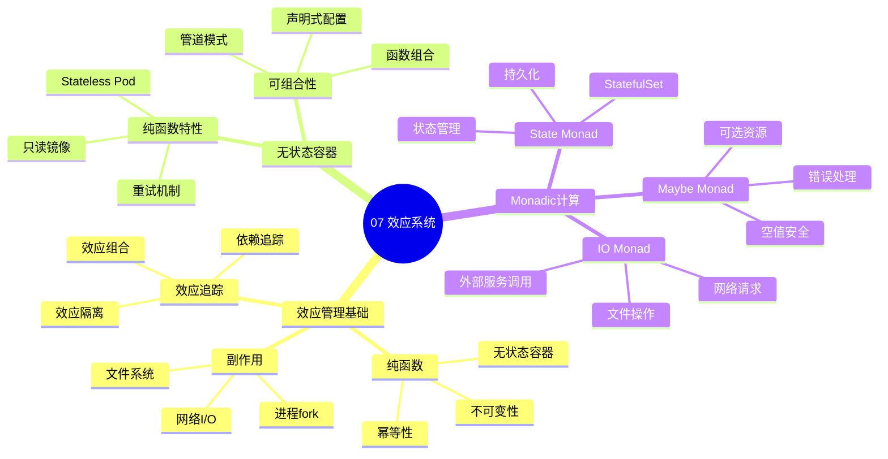

# 07. 效应系统与副作用

> **主题编号**: 07
> **主题名称**: 效应系统
> **最后更新**: 2025-01-XX

---

## 📋 目录

- [07. 效应系统与副作用](#07-效应系统与副作用)
  - [📋 目录](#-目录)
  - [1 主题概述](#1-主题概述)
    - [1.0 效应系统思维导图](#10-效应系统思维导图)
  - [2 子主题导航](#2-子主题导航)
    - [2.1 71 效应管理基础](#21-71-效应管理基础)
    - [2.2 72 无状态容器与纯函数](#22-72-无状态容器与纯函数)
    - [2.3 73 StatefulSet与Monadic计算](#23-73-statefulset与monadic计算)
  - [3 相关主题](#3-相关主题)

---

## 1 主题概述

本主题探讨**效应系统与副作用**在基础设施中的应用，容器化本质是效应管理，包括网络I/O、文件系统和进程fork等效应。

### 1.0 效应系统思维导图

**可视化文档**: 查看 [思维导图与知识矩阵](../思维导图与知识矩阵.md#37-07-效应系统) 获取更详细的思维导图。

---

## 2 子主题导航

### 2.1 [71 效应管理基础](071_效应管理基础md)

- 网络I/O → Effect[Network]
- 文件系统 → Effect[Storage]
- 进程fork → Effect[Fork]

### 2.2 [72 无状态容器与纯函数](072_无状态容器与纯函数md)

- 无状态容器 ≈ 纯函数
- 无副作用保证
- 可组合性

### 2.3 [73 StatefulSet与Monadic计算](073_StatefulSet与Monadic计算md)

- StatefulSet ≈ 带状态效应的Monadic计算
- 状态管理
- 效应组合

---

## 3 相关主题

- [06. 动态性与反射](../06_动态性与反射/README.md)
- [08. 实践启示：新设计模式](../08_实践启示/README.md)
- [09. 形式化理论框架](../09_形式化理论/README.md)

---

**返回**: [主题索引](../README.md)
