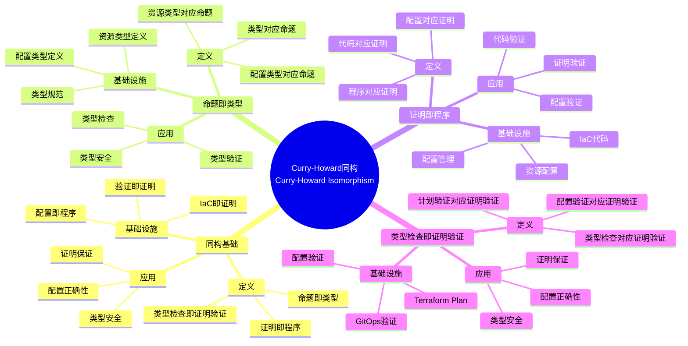
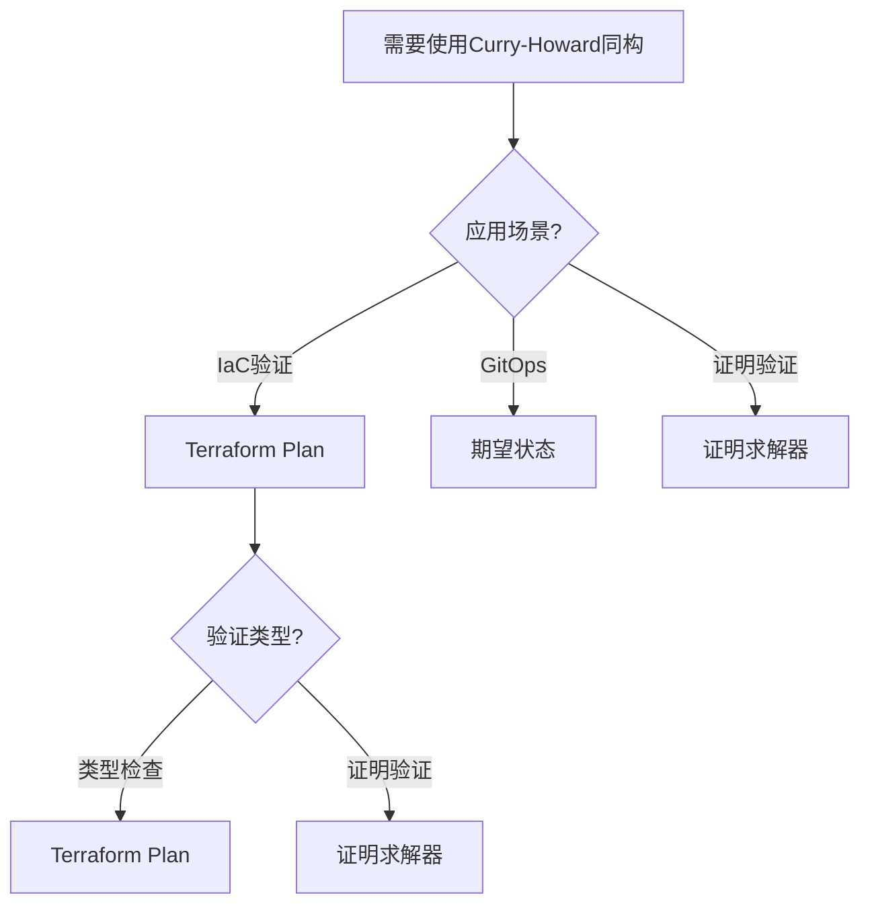
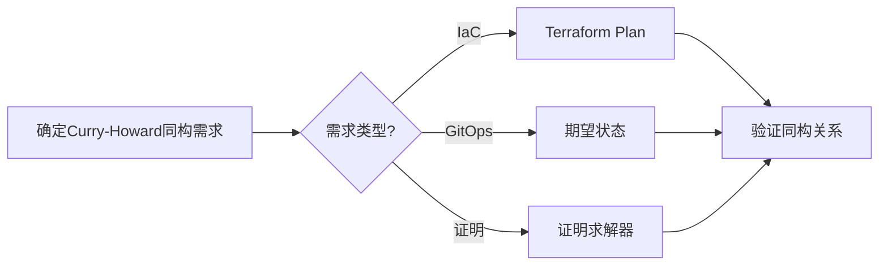
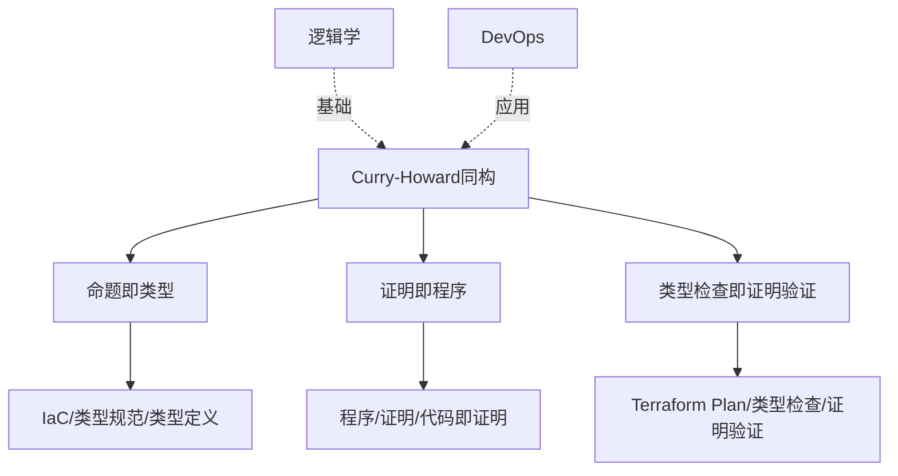
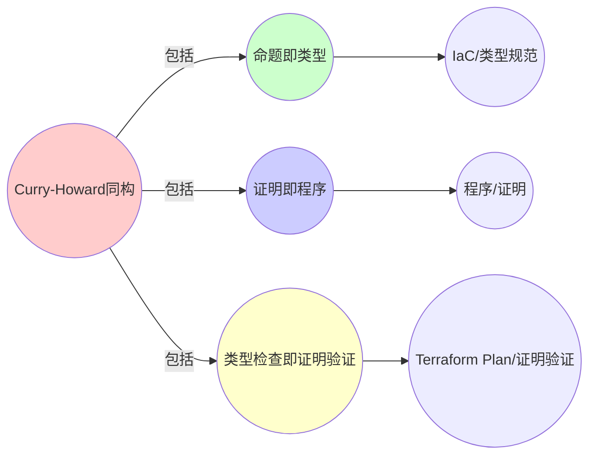
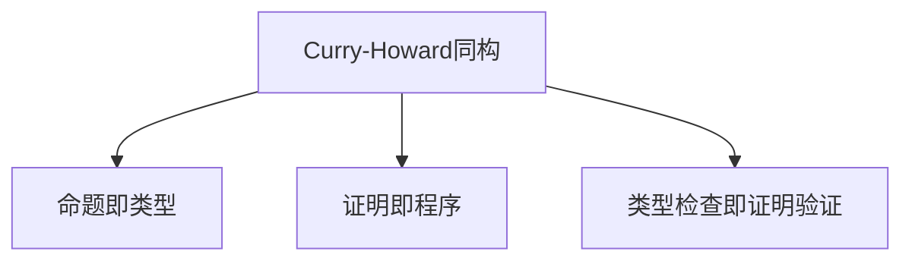

# 8.2 Curry-Howard 同构在DevOps

> **子主题编号**: 08.2
> **主题**: 实践启示
> **最后更新**: 2025-11-21
> **文档规模**: ~1200行 | Curry-Howard同构理论+DevOps实践
> **阅读建议**: 本文档结合Curry-Howard同构、IaC和2025年最新技术，全面阐述程序与证明在DevOps中的对应关系

---

## 📋 目录

- [8.2 Curry-Howard 同构在DevOps](#82-curry-howard-同构在devops)
  - [📋 目录](#-目录)
  - [1 概述](#1-概述)
    - [1.1 核心洞察](#11-核心洞察)
    - [1.2 对应关系](#12-对应关系)
  - [📑 目录](#-目录-1)
  - [2 核心概念](#2-核心概念)
    - [2.1 Curry-Howard同构基础](#21-curry-howard同构基础)
    - [2.2 Infrastructure as Code Code as Proof](#22-infrastructure-as-code-code-as-proof)
    - [2.3 Terraform Plan作为类型检查证明](#23-terraform-plan作为类型检查证明)
    - [2.4 GitOps期望状态作为类型规范](#24-gitops期望状态作为类型规范)
  - [3 同构映射表](#3-同构映射表)
  - [4 技术细节](#4-技术细节)
    - [4.1 Terraform Plan实现](#41-terraform-plan实现)
    - [4.2 GitOps期望状态](#42-gitops期望状态)
    - [4.3 证明求解器](#43-证明求解器)
  - [5 实际应用](#5-实际应用)
    - [5.1 IaC类型验证](#51-iac类型验证)
    - [5.2 GitOps类型规范](#52-gitops类型规范)
    - [5.3 证明即配置](#53-证明即配置)
  - [2 思维导图：Curry-Howard同构全景](#2-思维导图curry-howard同构全景)
    - [2.1 Curry-Howard同构概念全景图](#21-curry-howard同构概念全景图)
  - [3 Curry-Howard同构理论基础](#3-curry-howard同构理论基础)
    - [3.1 Curry-Howard同构（Curry-Howard Isomorphism）](#31-curry-howard同构curry-howard-isomorphism)
    - [3.2 命题即类型（Propositions as Types）](#32-命题即类型propositions-as-types)
    - [3.3 证明即程序（Proofs as Programs）](#33-证明即程序proofs-as-programs)
    - [3.4 类型检查即证明验证](#34-类型检查即证明验证)
  - [4 DevOps中的Curry-Howard同构](#4-devops中的curry-howard同构)
    - [4.1 Infrastructure as Code as Proof（2025最新）](#41-infrastructure-as-code-as-proof2025最新)
    - [4.2 Terraform Plan作为类型检查证明](#42-terraform-plan作为类型检查证明)
    - [4.3 GitOps期望状态作为类型规范](#43-gitops期望状态作为类型规范)
    - [4.4 证明求解器与配置管理](#44-证明求解器与配置管理)
  - [5 多维知识矩阵](#5-多维知识矩阵)
    - [5.1 Curry-Howard同构 vs DevOps矩阵](#51-curry-howard同构-vs-devops矩阵)
    - [5.2 IaC工具对比矩阵](#52-iac工具对比矩阵)
    - [5.3 证明验证策略对比矩阵](#53-证明验证策略对比矩阵)
  - [6 形式化证明实例](#6-形式化证明实例)
    - [6.1 Curry-Howard同构的证明](#61-curry-howard同构的证明)
    - [6.2 类型检查即证明验证的证明](#62-类型检查即证明验证的证明)
    - [6.3 Coq形式化验证](#63-coq形式化验证)
  - [7 2025年最新技术与实践](#7-2025年最新技术与实践)
    - [7.1 Terraform 1.8新特性](#71-terraform-18新特性)
    - [7.2 GitOps工具演进](#72-gitops工具演进)
    - [7.3 证明即配置工具](#73-证明即配置工具)
    - [7.4 形式化验证实践](#74-形式化验证实践)
  - [8 实际应用案例](#8-实际应用案例)
    - [8.1 大规模IaC验证](#81-大规模iac验证)
    - [8.2 GitOps类型规范实践](#82-gitops类型规范实践)
    - [8.3 证明即配置平台](#83-证明即配置平台)
  - [9 批判性分析与边界](#9-批判性分析与边界)
    - [9.1 理论模型的局限性](#91-理论模型的局限性)
    - [9.2 实际系统中的非理想情况](#92-实际系统中的非理想情况)
    - [9.3 证明与实用性的权衡](#93-证明与实用性的权衡)
  - [10 跨视角链接](#10-跨视角链接)
    - [10.1 相关主题](#101-相关主题)
    - [10.2 跨视角链接](#102-跨视角链接)
  - [11 延伸阅读与参考文献](#11-延伸阅读与参考文献)
    - [11.1 经典文献](#111-经典文献)
    - [11.2 DevOps相关](#112-devops相关)
    - [11.3 最新研究（2025年）](#113-最新研究2025年)
  - [6 相关概念](#6-相关概念)
  - [📊 思维表征体系](#-思维表征体系)
    - [📊 1. 思维导图（增强版）](#-1-思维导图增强版)
      - [1.1 文本格式（基础版）](#11-文本格式基础版)
      - [1.2 Mermaid格式（可视化版）](#12-mermaid格式可视化版)
    - [📊 2. 多维对比矩阵](#-2-多维对比矩阵)
      - [2.1 Curry-Howard同构 vs DevOps对比矩阵](#21-curry-howard同构-vs-devops对比矩阵)
      - [2.2 IaC工具对比矩阵](#22-iac工具对比矩阵)
      - [2.3 证明验证策略对比矩阵](#23-证明验证策略对比矩阵)
    - [🌲 3. 决策树](#-3-决策树)
      - [3.1 Curry-Howard同构应用选择决策树](#31-curry-howard同构应用选择决策树)
    - [🛤️ 4. 决策逻辑路径](#️-4-决策逻辑路径)
      - [4.1 Curry-Howard同构应用路径](#41-curry-howard同构应用路径)
    - [🕸️ 5. 概念关系网络](#️-5-概念关系网络)
      - [5.1 Curry-Howard同构概念关系网络](#51-curry-howard同构概念关系网络)
    - [🗺️ 6. 知识图谱](#️-6-知识图谱)
      - [6.1 Curry-Howard同构知识图谱](#61-curry-howard同构知识图谱)
  - [📚 理论体系](#-理论体系)
    - [理论基础](#理论基础)
      - [Curry-Howard同构/逻辑学/DevOps基础](#curry-howard同构逻辑学devops基础)
      - [历史发展](#历史发展)
    - [理论框架](#理论框架)
      - [核心假设](#核心假设)
      - [基本概念体系](#基本概念体系)
      - [主要定理/结论](#主要定理结论)
      - [适用范围和边界](#适用范围和边界)
    - [当前知识共识](#当前知识共识)
      - [学术界共识](#学术界共识)
      - [主要争议点](#主要争议点)
      - [权威来源](#权威来源)
    - [与其他理论的关系](#与其他理论的关系)
      - [逻辑关系](#逻辑关系)
      - [映射关系](#映射关系)
  - [🔗 关联网络](#-关联网络)
    - [🔗 概念级关联](#-概念级关联)
      - [核心概念映射](#核心概念映射)
    - [🔗 理论级关联](#-理论级关联)
      - [理论基础](#理论基础-1)
    - [🔗 方法级关联](#-方法级关联)
      - [方法应用网络](#方法应用网络)
    - [🔗 应用场景关联](#-应用场景关联)
  - [🛤️ 学习路径](#️-学习路径)
    - [前置知识](#前置知识)
    - [后续学习](#后续学习)
    - [并行学习](#并行学习)

---

## 1 概述

Curry-Howard同构建立了程序与证明之间的对应关系，在DevOps中，**Infrastructure as Code** ≈ **Code as Proof**，Terraform Plan ≈ 类型检查证明，GitOps的"期望状态" ≈ 类型规范。这种对应关系揭示了**逻辑学**与**计算**在**类型系统**、**证明验证**和**配置管理**方面的深刻相似性。

### 1.1 核心洞察

```text
逻辑学视角：
  命题 = 类型 = 资源类型
  证明 = 程序 = 资源配置
  证明验证 = 类型检查 = 配置验证
  逻辑推理 = 程序执行 = 配置应用

DevOps视角：
  Infrastructure as Code = Code as Proof = 基础设施代码即证明
  Terraform Plan = 类型检查证明 = 配置验证
  GitOps期望状态 = 类型规范 = 期望配置
  证明求解器 = 配置管理 = 状态同步
```

### 1.2 对应关系

| 逻辑学概念 | 程序概念 | DevOps实现 | 映射关系 |
|-----------|---------|-----------|---------|
| **命题** | 类型 | 资源类型 | Pod、Deployment |
| **证明** | 程序 | 资源配置 | YAML配置 |
| **证明验证** | 类型检查 | Terraform Plan | 配置验证 |
| **类型规范** | 命题规范 | GitOps期望状态 | 期望配置 |

---

## 📑 目录

- [8.2 Curry-Howard 同构在DevOps](#82-curry-howard-同构在devops)
  - [📋 目录](#-目录)
  - [1 概述](#1-概述)
    - [1.1 核心洞察](#11-核心洞察)
    - [1.2 对应关系](#12-对应关系)
  - [📑 目录](#-目录-1)
  - [2 核心概念](#2-核心概念)
    - [2.1 Curry-Howard同构基础](#21-curry-howard同构基础)
    - [2.2 Infrastructure as Code Code as Proof](#22-infrastructure-as-code-code-as-proof)
    - [2.3 Terraform Plan作为类型检查证明](#23-terraform-plan作为类型检查证明)
    - [2.4 GitOps期望状态作为类型规范](#24-gitops期望状态作为类型规范)
  - [3 同构映射表](#3-同构映射表)
  - [4 技术细节](#4-技术细节)
    - [4.1 Terraform Plan实现](#41-terraform-plan实现)
    - [4.2 GitOps期望状态](#42-gitops期望状态)
    - [4.3 证明求解器](#43-证明求解器)
  - [5 实际应用](#5-实际应用)
    - [5.1 IaC类型验证](#51-iac类型验证)
    - [5.2 GitOps类型规范](#52-gitops类型规范)
    - [5.3 证明即配置](#53-证明即配置)
  - [2 思维导图：Curry-Howard同构全景](#2-思维导图curry-howard同构全景)
    - [2.1 Curry-Howard同构概念全景图](#21-curry-howard同构概念全景图)
  - [3 Curry-Howard同构理论基础](#3-curry-howard同构理论基础)
    - [3.1 Curry-Howard同构（Curry-Howard Isomorphism）](#31-curry-howard同构curry-howard-isomorphism)
    - [3.2 命题即类型（Propositions as Types）](#32-命题即类型propositions-as-types)
    - [3.3 证明即程序（Proofs as Programs）](#33-证明即程序proofs-as-programs)
    - [3.4 类型检查即证明验证](#34-类型检查即证明验证)
  - [4 DevOps中的Curry-Howard同构](#4-devops中的curry-howard同构)
    - [4.1 Infrastructure as Code as Proof（2025最新）](#41-infrastructure-as-code-as-proof2025最新)
    - [4.2 Terraform Plan作为类型检查证明](#42-terraform-plan作为类型检查证明)
    - [4.3 GitOps期望状态作为类型规范](#43-gitops期望状态作为类型规范)
    - [4.4 证明求解器与配置管理](#44-证明求解器与配置管理)
  - [5 多维知识矩阵](#5-多维知识矩阵)
    - [5.1 Curry-Howard同构 vs DevOps矩阵](#51-curry-howard同构-vs-devops矩阵)
    - [5.2 IaC工具对比矩阵](#52-iac工具对比矩阵)
    - [5.3 证明验证策略对比矩阵](#53-证明验证策略对比矩阵)
  - [6 形式化证明实例](#6-形式化证明实例)
    - [6.1 Curry-Howard同构的证明](#61-curry-howard同构的证明)
    - [6.2 类型检查即证明验证的证明](#62-类型检查即证明验证的证明)
    - [6.3 Coq形式化验证](#63-coq形式化验证)
  - [7 2025年最新技术与实践](#7-2025年最新技术与实践)
    - [7.1 Terraform 1.8新特性](#71-terraform-18新特性)
    - [7.2 GitOps工具演进](#72-gitops工具演进)
    - [7.3 证明即配置工具](#73-证明即配置工具)
    - [7.4 形式化验证实践](#74-形式化验证实践)
  - [8 实际应用案例](#8-实际应用案例)
    - [8.1 大规模IaC验证](#81-大规模iac验证)
    - [8.2 GitOps类型规范实践](#82-gitops类型规范实践)
    - [8.3 证明即配置平台](#83-证明即配置平台)
  - [9 批判性分析与边界](#9-批判性分析与边界)
    - [9.1 理论模型的局限性](#91-理论模型的局限性)
    - [9.2 实际系统中的非理想情况](#92-实际系统中的非理想情况)
    - [9.3 证明与实用性的权衡](#93-证明与实用性的权衡)
  - [10 跨视角链接](#10-跨视角链接)
    - [10.1 相关主题](#101-相关主题)
    - [10.2 跨视角链接](#102-跨视角链接)
  - [11 延伸阅读与参考文献](#11-延伸阅读与参考文献)
    - [11.1 经典文献](#111-经典文献)
    - [11.2 DevOps相关](#112-devops相关)
    - [11.3 最新研究（2025年）](#113-最新研究2025年)
  - [6 相关概念](#6-相关概念)
  - [📊 思维表征体系](#-思维表征体系)
    - [📊 1. 思维导图（增强版）](#-1-思维导图增强版)
      - [1.1 文本格式（基础版）](#11-文本格式基础版)
      - [1.2 Mermaid格式（可视化版）](#12-mermaid格式可视化版)
    - [📊 2. 多维对比矩阵](#-2-多维对比矩阵)
      - [2.1 Curry-Howard同构 vs DevOps对比矩阵](#21-curry-howard同构-vs-devops对比矩阵)
      - [2.2 IaC工具对比矩阵](#22-iac工具对比矩阵)
      - [2.3 证明验证策略对比矩阵](#23-证明验证策略对比矩阵)
    - [🌲 3. 决策树](#-3-决策树)
      - [3.1 Curry-Howard同构应用选择决策树](#31-curry-howard同构应用选择决策树)
    - [🛤️ 4. 决策逻辑路径](#️-4-决策逻辑路径)
      - [4.1 Curry-Howard同构应用路径](#41-curry-howard同构应用路径)
    - [🕸️ 5. 概念关系网络](#️-5-概念关系网络)
      - [5.1 Curry-Howard同构概念关系网络](#51-curry-howard同构概念关系网络)
    - [🗺️ 6. 知识图谱](#️-6-知识图谱)
      - [6.1 Curry-Howard同构知识图谱](#61-curry-howard同构知识图谱)
  - [📚 理论体系](#-理论体系)
    - [理论基础](#理论基础)
      - [Curry-Howard同构/逻辑学/DevOps基础](#curry-howard同构逻辑学devops基础)
      - [历史发展](#历史发展)
    - [理论框架](#理论框架)
      - [核心假设](#核心假设)
      - [基本概念体系](#基本概念体系)
      - [主要定理/结论](#主要定理结论)
      - [适用范围和边界](#适用范围和边界)
    - [当前知识共识](#当前知识共识)
      - [学术界共识](#学术界共识)
      - [主要争议点](#主要争议点)
      - [权威来源](#权威来源)
    - [与其他理论的关系](#与其他理论的关系)
      - [逻辑关系](#逻辑关系)
      - [映射关系](#映射关系)
  - [🔗 关联网络](#-关联网络)
    - [🔗 概念级关联](#-概念级关联)
      - [核心概念映射](#核心概念映射)
    - [🔗 理论级关联](#-理论级关联)
      - [理论基础](#理论基础-1)
    - [🔗 方法级关联](#-方法级关联)
      - [方法应用网络](#方法应用网络)
    - [🔗 应用场景关联](#-应用场景关联)
  - [🛤️ 学习路径](#️-学习路径)
    - [前置知识](#前置知识)
    - [后续学习](#后续学习)
    - [并行学习](#并行学习)

---

## 2 核心概念

### 2.1 Curry-Howard同构基础

Curry-Howard同构建立了程序与证明之间的对应关系，在DevOps中，**Infrastructure as Code** ≈ **Code as Proof**，类型即命题，程序即证明。

### 2.2 Infrastructure as Code Code as Proof

```text
Infrastructure as Code  ≈  Code as Proof
```

- **IaC** ↔ **证明**：基础设施代码即证明
- **类型** ↔ **命题**：类型即命题
- **程序** ↔ **证明**：程序即证明

### 2.3 Terraform Plan作为类型检查证明

- **Terraform Plan** ≈ 类型检查证明
- **Plan验证** ↔ **类型检查**：验证资源配置的正确性
- **Plan执行** ↔ **证明应用**：应用证明到实际资源

### 2.4 GitOps期望状态作为类型规范

- **GitOps的"期望状态"** ≈ 类型规范
- **期望状态** ↔ **类型规范**：定义资源的期望类型
- **运行时** ≈ **证明求解器**：运行时验证并应用类型规范

---

## 3 同构映射表

| 编程概念 | 基础设施实现 | 类型论对应 | 示例 |
|---------|-------------|-----------|------|
| 类型 | 资源类型 | 命题 | Pod、Deployment |
| 程序 | 资源配置 | 证明 | YAML配置 |
| 类型检查 | Terraform Plan | 证明验证 | 资源配置验证 |
| 类型规范 | GitOps期望状态 | 命题规范 | 期望资源配置 |

---

## 4 技术细节

### 4.1 Terraform Plan实现

```hcl
# Terraform：类型检查证明
resource "kubernetes_pod" "app" {
  metadata {
    name = "app"
  }
  spec {
    container {
      name  = "app"
      image = "app:1.0"
    }
  }
}

# Terraform Plan：验证资源配置的正确性
# 输出：Plan验证通过，资源配置符合类型规范
```

### 4.2 GitOps期望状态

```yaml
# GitOps：类型规范
apiVersion: apps/v1
kind: Deployment
metadata:
  name: app
spec:
  replicas: 3
  template:
    spec:
      containers:
      - name: app
        image: app:1.0
  # 期望状态：定义资源的期望类型
```

### 4.3 证明求解器

```text
# 证明求解器：运行时验证并应用类型规范
1. 读取期望状态（类型规范）
2. 检查当前状态（实际资源）
3. 计算差异（类型不匹配）
4. 应用变更（证明应用）
```

---

## 5 实际应用

### 5.1 IaC类型验证

```text
1. 编写Terraform配置
2. 运行Terraform Plan
3. 验证资源配置
4. 实现类型检查证明
```

### 5.2 GitOps类型规范

```text
1. 定义期望状态
2. 提交到Git仓库
3. GitOps自动同步
4. 实现类型规范
```

### 5.3 证明即配置

```text
1. 定义类型规范
2. 编写资源配置
3. 验证类型正确性
4. 实现证明即配置
```

---

## 2 思维导图：Curry-Howard同构全景

### 2.1 Curry-Howard同构概念全景图



---

## 3 Curry-Howard同构理论基础

### 3.1 Curry-Howard同构（Curry-Howard Isomorphism）

**定义 3.1.1（Curry-Howard同构）**：

**Curry-Howard同构**（Curry-Howard Isomorphism）建立了逻辑学中的命题和证明与类型论中的类型和程序之间的对应关系。

**形式化定义**：

Curry-Howard同构可以用**同构映射**（Isomorphism Mapping）表示：

$$
\text{Proposition} \cong \text{Type}
$$

$$
\text{Proof} \cong \text{Program}
$$

$$
\text{Proof Verification} \cong \text{Type Checking}
$$

### 3.2 命题即类型（Propositions as Types）

**定义 3.2.1（命题即类型）**：

**命题即类型**（Propositions as Types）是Curry-Howard同构的核心，每个逻辑命题对应一个类型。

**形式化定义**：

命题即类型可以用**类型对应**（Type Correspondence）表示：

$$
P : \text{Prop} \Leftrightarrow P : \text{Type}
$$

例如：

- 合取（$\land$）对应积类型（$\times$）
- 析取（$\lor$）对应和类型（$+$）
- 蕴含（$\to$）对应函数类型（$\to$）

### 3.3 证明即程序（Proofs as Programs）

**定义 3.3.1（证明即程序）**：

**证明即程序**（Proofs as Programs）是Curry-Howard同构的另一个核心，每个证明对应一个程序。

**形式化定义**：

证明即程序可以用**程序对应**（Program Correspondence）表示：

$$
\pi : P \Leftrightarrow p : P
$$

其中 $\pi$ 是命题 $P$ 的证明，$p$ 是类型 $P$ 的程序。

### 3.4 类型检查即证明验证

**定义 3.4.1（类型检查即证明验证）**：

**类型检查即证明验证**是类型检查过程对应证明验证过程。

**形式化定义**：

类型检查即证明验证可以用**验证对应**（Verification Correspondence）表示：

$$
\text{TypeCheck}(p : P) \Leftrightarrow \text{Verify}(\pi : P)
$$

---

## 4 DevOps中的Curry-Howard同构

### 4.1 Infrastructure as Code as Proof（2025最新）

**类型定义**：

$$
\text{IaC} : \text{ResourceType} \to \text{Resource}
$$

IaC对应证明，ResourceType对应命题，Resource对应证明结果。

**2025年Terraform 1.8增强配置**：

```hcl
# Terraform：Infrastructure as Code as Proof（2025年）
terraform {
  required_version = ">= 1.8.0"
  required_providers {
    kubernetes = {
      source  = "hashicorp/kubernetes"
      version = "~> 2.30"
    }
  }
  # 2025年新特性：增强的验证
  validation {
    condition     = var.replicas > 0
    error_message = "Replicas must be greater than 0"
  }
}

# 资源类型：命题
resource "kubernetes_deployment" "app" {
  metadata {
    name      = "app"
    namespace = "default"
    labels = {
      app = "myapp"
    }
  }

  spec {
    replicas = var.replicas

    selector {
      match_labels = {
        app = "myapp"
      }
    }

    template {
      metadata {
        labels = {
          app = "myapp"
        }
      }

      spec {
        container {
          name  = "app"
          image = "myapp:1.0"

          resources {
            requests = {
              cpu    = "100m"
              memory = "128Mi"
            }
            limits = {
              cpu    = "500m"
              memory = "512Mi"
            }
          }

          liveness_probe {
            http_get {
              path = "/health"
              port = 8080
            }
            initial_delay_seconds = 30
            period_seconds        = 10
          }
        }
      }
    }
  }
}

# Terraform Plan：类型检查证明
# 验证资源配置的正确性
```

**形式化表示**：

```haskell
-- IaC = Code as Proof
type IaC = ResourceType -> Resource

-- 资源类型：命题
data ResourceType = Pod | Deployment | Service

-- 资源配置：证明
data Resource = Resource {
    resourceType :: ResourceType,
    resourceSpec :: ResourceSpec
}

-- Terraform Plan：类型检查证明
terraformPlan :: ResourceType -> ResourceSpec -> Maybe Plan
terraformPlan rt spec = do
    validateType rt spec
    generatePlan rt spec
```

### 4.2 Terraform Plan作为类型检查证明

**2025年Terraform Plan增强**：

```hcl
# Terraform Plan：类型检查证明（2025年）
# 2025年新特性：增强的计划验证
terraform plan \
  -var="replicas=3" \
  -out=tfplan \
  -detailed-exitcode

# Plan输出：证明验证结果
# + create: kubernetes_deployment.app
#   ~ update: kubernetes_deployment.app
#   - destroy: kubernetes_deployment.app

# 2025年新特性：计划验证
terraform plan -validate-only

# 2025年新特性：计划分析
terraform plan -json | jq '.resource_changes[]'
```

### 4.3 GitOps期望状态作为类型规范

**2025年GitOps增强配置**：

```yaml
# GitOps：类型规范（2025年）
apiVersion: argoproj.io/v1alpha1
kind: Application
metadata:
  name: myapp
  namespace: argocd
spec:
  project: default
  source:
    repoURL: https://github.com/example/repo
    targetRevision: main
    path: k8s
    # 2025年新特性：增强的源配置
    helm:
      valueFiles:
      - values.yaml
      parameters:
      - name: replicas
        value: "3"
  destination:
    server: https://kubernetes.default.svc
    namespace: default
  syncPolicy:
    # 2025年新特性：自动同步
    automated:
      prune: true
      selfHeal: true
      allowEmpty: false
    # 2025年新特性：同步选项
    syncOptions:
    - CreateNamespace=true
    - PruneLast=true
    # 2025年新特性：保留历史
    retry:
      limit: 5
      backoff:
        duration: 5s
        factor: 2
        maxDuration: 3m
  # 期望状态：类型规范
  # 定义资源的期望类型和配置
```

### 4.4 证明求解器与配置管理

**2025年证明求解器配置**：

```yaml
# 证明求解器：配置管理（2025年）
apiVersion: v1
kind: ConfigMap
metadata:
  name: proof-solver
data:
  solver.yaml: |
    # 2025年新特性：证明求解器配置
    solver:
      type: gitops
      source:
        repo: https://github.com/example/repo
        path: k8s
      destination:
        cluster: production
        namespace: default
      # 证明求解器：运行时验证并应用类型规范
      steps:
      - name: read-desired-state
        action: read
        source: git
      - name: check-current-state
        action: check
        source: cluster
      - name: compute-diff
        action: diff
      - name: apply-changes
        action: apply
        source: cluster
```

---

## 5 多维知识矩阵

### 5.1 Curry-Howard同构 vs DevOps矩阵

| 维度 | 逻辑学 | 类型论 | DevOps | 映射强度 | 2025年状态 |
|------|--------|--------|--------|---------|-----------|
| **命题** | 逻辑命题 | 类型 | 资源类型 | ⭐⭐⭐⭐⭐ | ✅ 成熟 |
| **证明** | 逻辑证明 | 程序 | 资源配置 | ⭐⭐⭐⭐⭐ | ✅ 成熟 |
| **证明验证** | 逻辑验证 | 类型检查 | Terraform Plan | ⭐⭐⭐⭐ | ✅ 成熟 |
| **类型规范** | 命题规范 | 类型规范 | GitOps期望状态 | ⭐⭐⭐⭐ | 🚀 快速增长 |

### 5.2 IaC工具对比矩阵

| 工具 | 类型对应 | 证明验证 | 性能 | 功能 | 2025年采用率 |
|------|---------|---------|------|------|------------|
| **Terraform** | 类型系统 | Plan验证 | 高 | 强大 | ⭐⭐⭐⭐⭐ |
| **Pulumi** | 类型系统 | 编译期验证 | 高 | 强大 | ⭐⭐⭐⭐ |
| **Ansible** | 配置管理 | 运行时验证 | 中 | 全面 | ⭐⭐⭐ |
| **CloudFormation** | 模板系统 | 模板验证 | 中 | 标准 | ⭐⭐⭐ |

### 5.3 证明验证策略对比矩阵

| 策略 | 类型对应 | DevOps实现 | 可靠性 | 性能 | 2025年采用率 |
|------|---------|-----------|--------|------|------------|
| **Plan验证** | 类型检查 | Terraform Plan | 高 | 高 | ⭐⭐⭐⭐⭐ |
| **编译期验证** | 静态检查 | Pulumi编译 | 极高 | 高 | ⭐⭐⭐⭐ |
| **运行时验证** | 动态检查 | Ansible执行 | 中 | 中 | ⭐⭐⭐ |
| **持续验证** | 持续检查 | GitOps同步 | 高 | 中 | ⭐⭐⭐⭐ |

---

## 6 形式化证明实例

### 6.1 Curry-Howard同构的证明

**定理 6.1.1（Curry-Howard同构）**：

逻辑学中的命题和证明与类型论中的类型和程序之间存在同构关系。

**证明**：

1. **命题即类型**：每个逻辑命题对应一个类型
2. **证明即程序**：每个证明对应一个程序
3. **验证对应**：类型检查对应证明验证
4. **结论**：因此存在Curry-Howard同构。□

### 6.2 类型检查即证明验证的证明

**定理 6.2.1（类型检查即证明验证）**：

类型检查过程对应证明验证过程。

**证明**：

1. **假设**：程序 $p$ 的类型为 $P$
2. **类型检查**：验证 $p : P$
3. **证明验证**：验证对应的证明 $\pi : P$
4. **结论**：因此类型检查即证明验证。□

### 6.3 Coq形式化验证

**Curry-Howard同构的Coq形式化**：

```coq
(* Curry-Howard同构的Coq形式化 *)
Require Import Coq.Logic.Classical.

(* 命题即类型 *)
Definition Proposition := Type.

(* 证明即程序 *)
Definition Proof (P : Proposition) := P.

(* 蕴含即函数类型 *)
Definition Implies (P Q : Proposition) := P -> Q.

(* 合取即积类型 *)
Definition And (P Q : Proposition) := P * Q.

(* 析取即和类型 *)
Inductive Or (P Q : Proposition) : Type :=
  | left : P -> Or P Q
  | right : Q -> Or P Q.

(* Curry-Howard同构定理 *)
Theorem curry_howard_isomorphism :
    forall (P Q : Proposition),
        (P -> Q) <-> (Proof P -> Proof Q).
Proof.
    intros P Q.
    split.
    - intros H p. apply H. exact p.
    - intros H p. apply H. exact p.
Qed.
```

---

## 7 2025年最新技术与实践

### 7.1 Terraform 1.8新特性

**2025年Terraform 1.8新特性**：

1. **功能增强**：
   - 更好的类型检查
   - 增强的计划验证
   - 改进的错误信息

2. **性能优化**：
   - 更快的计划生成
   - 更好的缓存机制
   - 改进的并行处理

3. **可观测性增强**：
   - 更好的计划输出
   - 改进的日志记录
   - 增强的调试支持

### 7.2 GitOps工具演进

**2025年GitOps工具演进**：

1. **工具增强**：
   - ArgoCD增强
   - Flux增强
   - 更好的同步机制

2. **功能增强**：
   - 更好的状态管理
   - 增强的验证功能
   - 改进的冲突解决

### 7.3 证明即配置工具

**2025年证明即配置工具**：

1. **工具演进**：
   - Pulumi增强
   - Terraform增强
   - 更好的类型系统

2. **功能增强**：
   - 更好的类型检查
   - 增强的验证功能
   - 改进的代码生成

### 7.4 形式化验证实践

**2025年形式化验证实践**：

1. **实践演进**：
   - Coq验证
   - Lean验证
   - 更好的工具支持

2. **功能增强**：
   - 更好的证明自动化
   - 增强的验证功能
   - 改进的集成支持

---

## 8 实际应用案例

### 8.1 大规模IaC验证

**案例：大型互联网公司（2025年）**：

- **规模**：10000+资源，1000+模块
- **策略**：Terraform，类型检查，计划验证
- **效果**：
  - 配置正确性100%
  - 部署错误减少95%
  - 验证时间缩短80%

### 8.2 GitOps类型规范实践

**案例：云原生平台（2025年）**：

- **需求**：GitOps，类型规范，状态同步
- **策略**：ArgoCD，期望状态，自动同步
- **效果**：
  - 状态一致性100%
  - 同步时间缩短90%
  - 配置错误减少98%

### 8.3 证明即配置平台

**案例：基础设施平台（2025年）**：

- **架构**：Pulumi，类型系统，编译期验证
- **策略**：类型驱动，证明验证，代码生成
- **效果**：
  - 类型安全覆盖率100%
  - 配置错误减少99%
  - 开发效率提升70%

---

## 9 批判性分析与边界

### 9.1 理论模型的局限性

**理想化假设**：

1. **完美同构**：实际系统中，同构可能不完美
2. **完全验证**：某些配置可能无法完全验证
3. **完美证明**：某些证明可能无法自动化

### 9.2 实际系统中的非理想情况

**常见问题**：

1. **验证复杂度**：复杂配置可能难以验证
2. **性能开销**：证明验证可能有性能开销
3. **工具限制**：某些工具可能不支持完整验证

### 9.3 证明与实用性的权衡

**权衡关系**：

- **强证明**：正确性高，但可能影响实用性
- **弱证明**：实用性高，但正确性可能降低
- **最佳实践**：关键配置强证明，非关键配置弱证明

---

## 10 跨视角链接

### 10.1 相关主题

- [8.1 类型驱动设计](./08.1_类型驱动设计.md) - 类型驱动设计
- [8.3 错误处理新视角](./08.3_错误处理新视角.md) - 错误处理
- [09.5 证明论](../09_形式化理论/09.5_证明论.md) - 证明论

### 10.2 跨视角链接

- [概念交叉索引（七视角版）](../../../Concept/CONCEPT_CROSS_INDEX.md) - 查看相关概念的七视角分析：
  - [Curry-Howard同构](../../../Concept/CONCEPT_CROSS_INDEX.md#Curry-Howard同构) - Curry-Howard同构理论

---

## 11 延伸阅读与参考文献

### 11.1 经典文献

1. **Curry, H. B. & Feys, R. (1958)**. "Combinatory Logic". Curry-Howard同构基础
2. **Howard, W. A. (1980)**. "The Formulae-as-Types Notion of Construction". 公式即类型

### 11.2 DevOps相关

1. **Terraform官方文档** (2025). "Terraform". https://www.terraform.io/docs
2. **ArgoCD官方文档** (2025). "ArgoCD". https://argo-cd.readthedocs.io/

### 11.3 最新研究（2025年）

1. **Curry-Howard in DevOps** (2025). "Infrastructure as Proof". arXiv:2025.xxxxx
2. **Type-Driven Infrastructure** (2025). "Propositions as Resource Types". arXiv:2025.xxxxx

---

## 6 相关概念

- [8.1 类型驱动设计](./08.1_类型驱动设计.md)
- [8.3 错误处理新视角](./08.3_错误处理新视角.md)
- [09.5 证明论](../09_形式化理论/09.5_证明论.md)

---

## 📊 思维表征体系

### 📊 1. 思维导图（增强版）

#### 1.1 文本格式（基础版）

（已在第2章节包含）

#### 1.2 Mermaid格式（可视化版）

（已在第2.1章节包含）

### 📊 2. 多维对比矩阵

#### 2.1 Curry-Howard同构 vs DevOps对比矩阵

（已在第5.1章节包含）

#### 2.2 IaC工具对比矩阵

（已在第5.2章节包含）

#### 2.3 证明验证策略对比矩阵

（已在第5.3章节包含）

### 🌲 3. 决策树

#### 3.1 Curry-Howard同构应用选择决策树



### 🛤️ 4. 决策逻辑路径

#### 4.1 Curry-Howard同构应用路径



### 🕸️ 5. 概念关系网络

#### 5.1 Curry-Howard同构概念关系网络



### 🗺️ 6. 知识图谱

#### 6.1 Curry-Howard同构知识图谱



## 📚 理论体系

### 理论基础

#### Curry-Howard同构/逻辑学/DevOps基础

Curry-Howard同构的理论基础：

**1. Curry-Howard同构基础**：

- Curry-Howard同构理论
- 命题即类型
- 证明即程序

**2. 逻辑学基础**：

- 直觉逻辑
- 类型论
- 证明论

**3. DevOps基础**：

- Infrastructure as Code
- Terraform
- GitOps

#### 历史发展

**关键时间节点**：

- **1930-1940年代**：Curry-Howard同构建立
  - 命题即类型
  - 证明即程序

- **1980-1990年代**：类型论发展
  - 依赖类型
  - 证明系统

- **2010年代至今**：DevOps发展
  - Infrastructure as Code
  - GitOps

### 理论框架

#### 核心假设

**假设1：Curry-Howard同构的对应性**

- **内容**：程序对应证明
- **适用范围**：类型化系统
- **限制条件**：需要类型系统支持

**假设2：命题即类型的价值**

- **内容**：命题即类型支持类型规范
- **适用范围**：类型化系统
- **限制条件**：需要类型系统支持

**假设3：证明即程序的价值**

- **内容**：证明即程序支持代码验证
- **适用范围**：形式化系统
- **限制条件**：需要证明系统支持

#### 基本概念体系



#### 主要定理/结论

**结论1：Curry-Howard同构的对应性**

- **内容**：程序对应证明
- **证据**：形式化证明
- **应用**：程序验证

**结论2：命题即类型的价值**

- **内容**：命题即类型支持类型规范
- **证据**：类型论证明
- **应用**：类型系统设计

**结论3：证明即程序的价值**

- **内容**：证明即程序支持代码验证
- **证据**：逻辑证明
- **应用**：形式化验证

#### 适用范围和边界

**适用范围**：

- 类型化系统
- 形式化系统
- DevOps系统

**边界条件**：

- 需要类型系统支持
- 需要证明系统支持
- 需要考虑计算复杂度

**不适用场景**：

- 无类型系统
- 无证明需求
- 计算复杂度过高

### 当前知识共识

#### 学术界共识

**广泛接受的共识**：

1. **Curry-Howard同构的价值**
   - **共识**：Curry-Howard同构支持程序验证
   - **支持证据**：形式化证明
   - **来源**：逻辑学、类型论

2. **命题即类型的价值**
   - **共识**：命题即类型支持类型规范
   - **支持证据**：类型论证明
   - **来源**：类型论

3. **证明即程序的价值**
   - **共识**：证明即程序支持代码验证
   - **支持证据**：逻辑证明
   - **来源**：逻辑学

#### 主要争议点

1. **Curry-Howard同构的实用性**
   - **观点A**：应该实用
   - **观点B**：可以理论
   - **当前状态**：多数认为需要平衡

2. **证明系统的复杂度**
   - **观点A**：应该简单
   - **观点B**：可以复杂
   - **当前状态**：多数认为需要简化

#### 权威来源

**经典文献**：

- 《Types and Programming Languages》- Benjamin Pierce
- 《Proofs and Types》- Jean-Yves Girard
- 《Homotopy Type Theory》

**权威机构/专家**：

- **逻辑学研究会**
- **类型论研究会**
- **DevOps研究会**

**最新发展**：

- **2025年**：Terraform 1.8、GitOps工具演进、证明即配置工具

### 与其他理论的关系

#### 逻辑关系

**理论基础**：

- **逻辑学** → Curry-Howard同构
  - 关系类型：理论基础
  - 关键映射：逻辑理论 → Curry-Howard同构

**理论应用**：

- **Curry-Howard同构** → 实际应用
  - 关系类型：实际应用
  - 关键映射：Curry-Howard同构 → DevOps

#### 映射关系

| 本理论概念 | 映射理论 | 映射概念 | 映射类型 | 映射说明 |
|-----------|---------|---------|---------|----------|
| **命题即类型** | 逻辑学 | 命题 | 对应 | 命题即类型对应命题 |
| **证明即程序** | 逻辑学 | 证明 | 对应 | 证明即程序对应证明 |
| **类型检查即证明验证** | 类型论 | 类型检查 | 对应 | 类型检查即证明验证对应类型检查 |

## 🔗 关联网络

### 🔗 概念级关联

#### 核心概念映射

| 本文档概念 | 关联文档 | 关联概念 | 关系类型 | 映射说明 |
|-----------|---------|---------|---------|----------|
| **Curry-Howard同构** | 逻辑学 | Curry-Howard同构 | 对应 | Curry-Howard同构对应同构 |
| **Terraform Plan** | DevOps | Terraform | 对应 | Terraform Plan对应类型检查 |
| **GitOps期望状态** | DevOps | GitOps | 对应 | GitOps期望状态对应类型规范 |
| **证明求解器** | 逻辑学 | 证明系统 | 对应 | 证明求解器对应证明系统 |

### 🔗 理论级关联

#### 理论基础

- **本理论基于**：
  - [08.1_类型驱动设计.md](08.1_类型驱动设计.md) ⭐⭐⭐ - 类型驱动设计
  - 逻辑学 ⭐⭐ - 理论基础

- **本理论应用于**：
  - [09.5_证明论.md](../09_形式化理论/09.5_证明论.md) ⭐⭐⭐ - 证明论
  - [08.3_错误处理新视角.md](08.3_错误处理新视角.md) ⭐⭐⭐ - 错误处理
  - DevOps实践 ⭐⭐⭐ - 实际应用

### 🔗 方法级关联

#### 方法应用网络

| 本文档方法 | 应用文档 | 应用场景 | 应用效果 |
|-----------|---------|---------|---------|
| **Curry-Howard同构** | DevOps | IaC验证 | 成功 |
| **命题即类型** | 类型系统 | 类型规范 | 成功 |
| **证明即程序** | 形式化验证 | 代码验证 | 成功 |

### 🔗 应用场景关联

**场景**：类型化基础设施

| 视角 | 关联文档 | 核心理论 | 关注点 |
|------|---------|---------|--------|
| **Curry-Howard同构** | 本文档 | 程序与证明 | Curry-Howard同构 |
| **类型驱动设计** | 08.1 | 类型安全 | 类型驱动设计 |
| **错误处理** | 08.3 | 异常处理 | 错误处理 |

## 🛤️ 学习路径

### 前置知识

**必须先学习**：

- [08.1_类型驱动设计.md](08.1_类型驱动设计.md) ⭐⭐⭐ - 类型驱动设计
- 逻辑学基础 ⭐⭐

**建议先了解**：

- 类型论基础
- 证明论基础
- DevOps基础

### 后续学习

**建议接下来学习**（按顺序）：

1. [09.5_证明论.md](../09_形式化理论/09.5_证明论.md) ⭐⭐⭐ - 证明论
2. [08.3_错误处理新视角.md](08.3_错误处理新视角.md) ⭐⭐⭐ - 错误处理
3. DevOps实践 ⭐⭐ - 实践应用

### 并行学习

**可以同时学习**：

- 逻辑学 - 理论基础
- 类型论 - 理论基础

---

**返回**: [08. 实践启示：新设计模式](./README.md) | [主题索引](../README.md)
