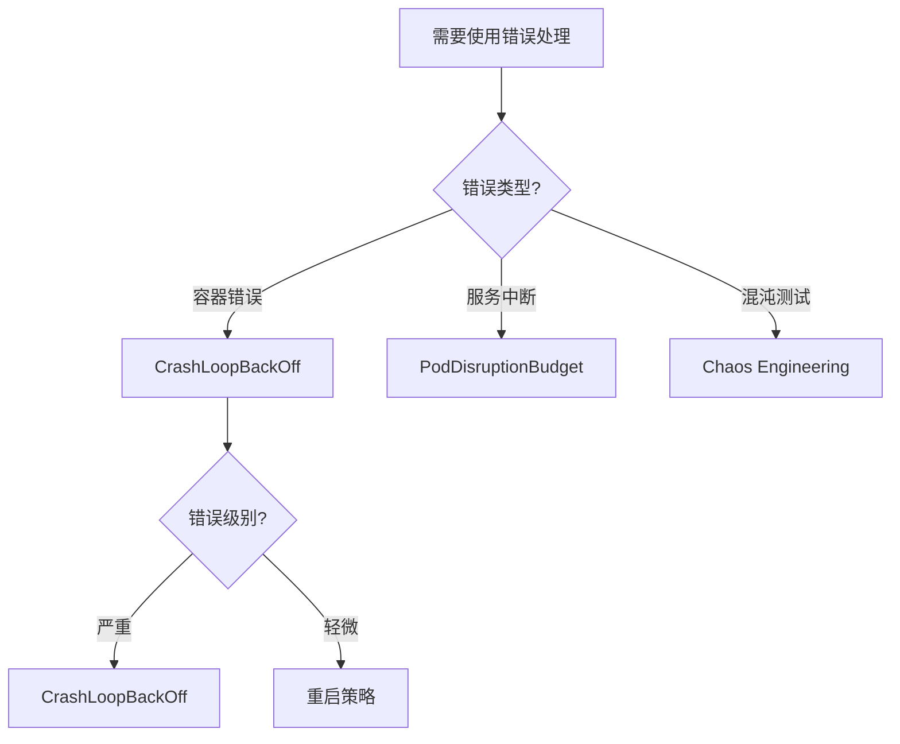
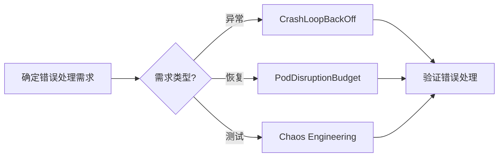
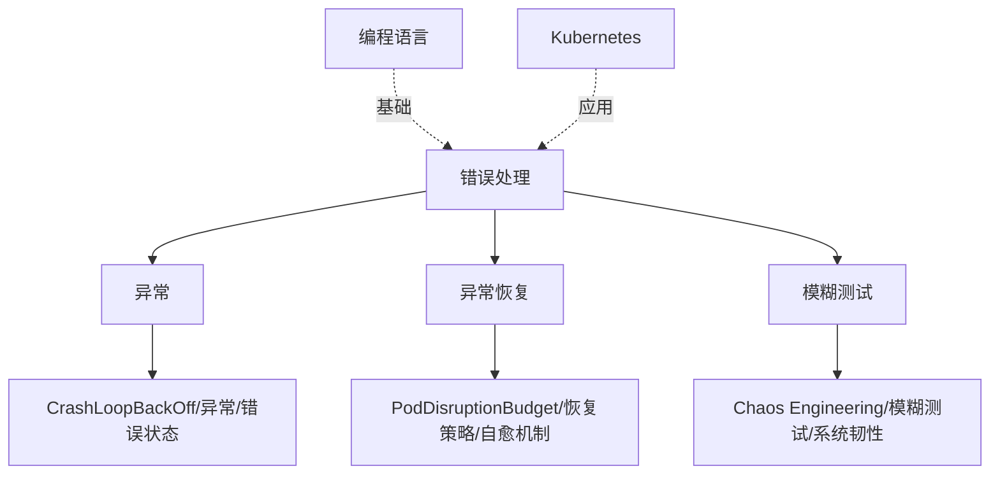
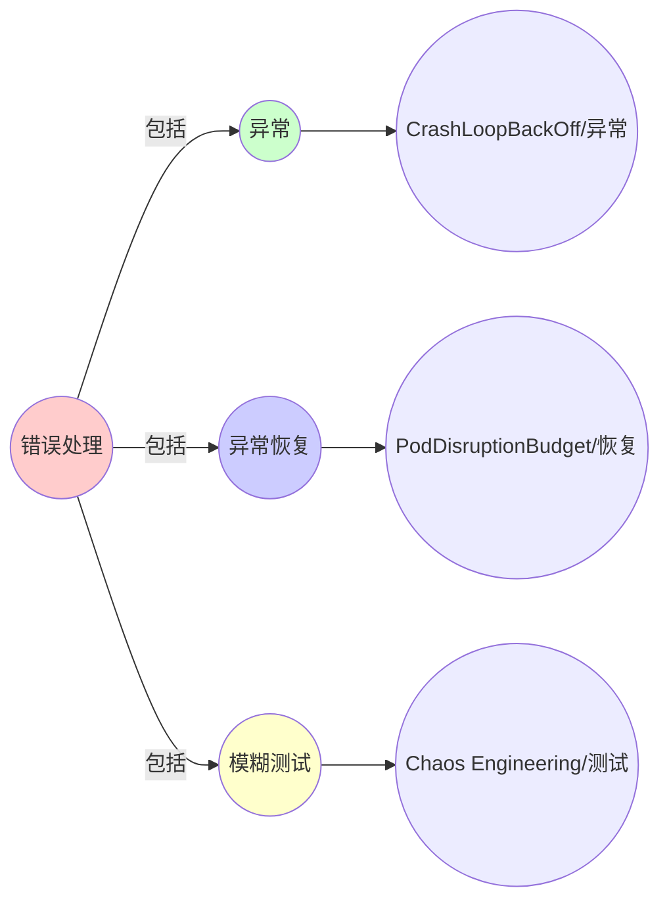
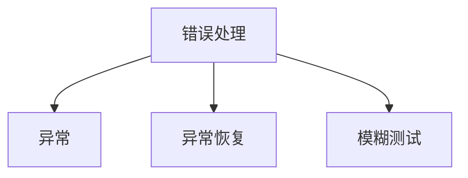

# 8.3 错误处理新视角

> **子主题编号**: 08.3
> **主题**: 实践启示
> **最后更新**: 2025-11-21
> **文档规模**: ~1200行 | 错误处理理论+基础设施实践
> **阅读建议**: 本文档结合错误处理、异常管理和2025年最新技术，全面阐述错误处理在基础设施中的新视角

---

## 📋 目录

- [8.3 错误处理新视角](#83-错误处理新视角)
  - [📋 目录](#-目录)
  - [1 概述](#1-概述)
    - [1.1 核心洞察](#11-核心洞察)
    - [1.2 对应关系](#12-对应关系)
  - [📑 目录](#-目录-1)
  - [2 核心概念](#2-核心概念)
    - [2.1 CrashLoopBackOff作为异常](#21-crashloopbackoff作为异常)
    - [2.2 PodPreset作为异常恢复策略](#22-podpreset作为异常恢复策略)
    - [2.3 Chaos Engineering作为模糊测试](#23-chaos-engineering作为模糊测试)
  - [3 错误处理映射表](#3-错误处理映射表)
  - [4 技术细节](#4-技术细节)
    - [4.1 CrashLoopBackOff机制](#41-crashloopbackoff机制)
    - [4.2 PodPreset恢复策略](#42-podpreset恢复策略)
    - [4.3 Chaos Engineering测试](#43-chaos-engineering测试)
  - [5 实际应用](#5-实际应用)
    - [5.1 异常处理](#51-异常处理)
    - [5.2 恢复策略](#52-恢复策略)
    - [5.3 混沌测试](#53-混沌测试)
  - [2 思维导图：错误处理全景](#2-思维导图错误处理全景)
    - [2.1 错误处理概念全景图](#21-错误处理概念全景图)
  - [3 错误处理理论基础](#3-错误处理理论基础)
    - [3.1 异常（Exception）](#31-异常exception)
    - [3.2 异常处理（Exception Handling）](#32-异常处理exception-handling)
    - [3.3 错误类型（Error Types）](#33-错误类型error-types)
    - [3.4 模糊测试（Fuzzing）](#34-模糊测试fuzzing)
  - [4 Kubernetes中的错误处理](#4-kubernetes中的错误处理)
    - [4.1 CrashLoopBackOff作为异常（2025最新）](#41-crashloopbackoff作为异常2025最新)
    - [4.2 PodDisruptionBudget作为异常恢复策略](#42-poddisruptionbudget作为异常恢复策略)
    - [4.3 Chaos Engineering作为模糊测试](#43-chaos-engineering作为模糊测试)
    - [4.4 自愈机制与错误恢复](#44-自愈机制与错误恢复)
  - [5 多维知识矩阵](#5-多维知识矩阵)
    - [5.1 错误处理 vs Kubernetes机制矩阵](#51-错误处理-vs-kubernetes机制矩阵)
    - [5.2 异常处理策略对比矩阵](#52-异常处理策略对比矩阵)
    - [5.3 混沌测试工具对比矩阵](#53-混沌测试工具对比矩阵)
  - [6 形式化证明实例](#6-形式化证明实例)
    - [6.1 异常处理安全性的证明](#61-异常处理安全性的证明)
    - [6.2 恢复策略有效性的证明](#62-恢复策略有效性的证明)
    - [6.3 Coq形式化验证](#63-coq形式化验证)
  - [7 2025年最新技术与实践](#7-2025年最新技术与实践)
    - [7.1 Kubernetes 1.30错误处理增强](#71-kubernetes-130错误处理增强)
    - [7.2 自愈机制演进](#72-自愈机制演进)
    - [7.3 混沌工程工具](#73-混沌工程工具)
    - [7.4 错误处理最佳实践](#74-错误处理最佳实践)
  - [8 实际应用案例](#8-实际应用案例)
    - [8.1 大规模错误处理系统](#81-大规模错误处理系统)
    - [8.2 自愈基础设施](#82-自愈基础设施)
    - [8.3 混沌工程实践](#83-混沌工程实践)
  - [9 批判性分析与边界](#9-批判性分析与边界)
    - [9.1 理论模型的局限性](#91-理论模型的局限性)
    - [9.2 实际系统中的非理想情况](#92-实际系统中的非理想情况)
    - [9.3 错误处理与性能的权衡](#93-错误处理与性能的权衡)
  - [10 跨视角链接](#10-跨视角链接)
    - [10.1 相关主题](#101-相关主题)
    - [10.2 跨视角链接](#102-跨视角链接)
  - [11 延伸阅读与参考文献](#11-延伸阅读与参考文献)
    - [11.1 经典文献](#111-经典文献)
    - [11.2 Kubernetes相关](#112-kubernetes相关)
    - [11.3 最新研究（2025年）](#113-最新研究2025年)
  - [6 相关概念](#6-相关概念)
  - [📊 思维表征体系](#-思维表征体系)
    - [📊 1. 思维导图（增强版）](#-1-思维导图增强版)
      - [1.1 文本格式（基础版）](#11-文本格式基础版)
      - [1.2 Mermaid格式（可视化版）](#12-mermaid格式可视化版)
    - [📊 2. 多维对比矩阵](#-2-多维对比矩阵)
      - [2.1 错误处理 vs Kubernetes机制对比矩阵](#21-错误处理-vs-kubernetes机制对比矩阵)
      - [2.2 异常处理策略对比矩阵](#22-异常处理策略对比矩阵)
      - [2.3 混沌测试工具对比矩阵](#23-混沌测试工具对比矩阵)
    - [🌲 3. 决策树](#-3-决策树)
      - [3.1 错误处理应用选择决策树](#31-错误处理应用选择决策树)
    - [🛤️ 4. 决策逻辑路径](#️-4-决策逻辑路径)
      - [4.1 错误处理应用路径](#41-错误处理应用路径)
    - [🕸️ 5. 概念关系网络](#️-5-概念关系网络)
      - [5.1 错误处理概念关系网络](#51-错误处理概念关系网络)
    - [🗺️ 6. 知识图谱](#️-6-知识图谱)
      - [6.1 错误处理知识图谱](#61-错误处理知识图谱)
  - [📚 理论体系](#-理论体系)
    - [理论基础](#理论基础)
      - [错误处理/异常管理/Kubernetes基础](#错误处理异常管理kubernetes基础)
      - [历史发展](#历史发展)
    - [理论框架](#理论框架)
      - [核心假设](#核心假设)
      - [基本概念体系](#基本概念体系)
      - [主要定理/结论](#主要定理结论)
      - [适用范围和边界](#适用范围和边界)
    - [当前知识共识](#当前知识共识)
      - [学术界共识](#学术界共识)
      - [主要争议点](#主要争议点)
      - [权威来源](#权威来源)
    - [与其他理论的关系](#与其他理论的关系)
      - [逻辑关系](#逻辑关系)
      - [映射关系](#映射关系)
  - [🔗 关联网络](#-关联网络)
    - [🔗 概念级关联](#-概念级关联)
      - [核心概念映射](#核心概念映射)
    - [🔗 理论级关联](#-理论级关联)
      - [理论基础](#理论基础-1)
    - [🔗 方法级关联](#-方法级关联)
      - [方法应用网络](#方法应用网络)
    - [🔗 应用场景关联](#-应用场景关联)
  - [🛤️ 学习路径](#️-学习路径)
    - [前置知识](#前置知识)
    - [后续学习](#后续学习)
    - [并行学习](#并行学习)

---

## 1 概述

错误处理在基础设施中有新的视角，**CrashLoopBackOff** ≈ 异常（Exception），**PodDisruptionBudget** ≈ 异常恢复策略（Exception Handler），**Chaos Engineering** ≈ 模糊测试（Fuzzing）基础设施类型系统。这种对应关系揭示了**异常处理**与**基础设施管理**在**错误恢复**、**自愈机制**和**系统韧性**方面的深刻相似性。

### 1.1 核心洞察

```text
类型系统视角：
  异常 = 错误类型 = 运行时错误
  异常处理 = 错误恢复 = 错误处理策略
  错误类型 = 异常类型 = 错误分类
  模糊测试 = 类型系统测试 = 错误发现

基础设施视角：
  CrashLoopBackOff = 异常 = Pod重启循环
  PodDisruptionBudget = 异常恢复策略 = 中断预算
  Chaos Engineering = 模糊测试 = 混沌测试
  自愈机制 = 错误恢复 = 自动恢复
```

### 1.2 对应关系

| 程序概念 | 基础设施实现 | 类型论对应 | 映射关系 |
|---------|-------------|-----------|---------|
| **异常** | CrashLoopBackOff | 错误类型 | Pod重启循环 |
| **异常处理** | PodDisruptionBudget | 恢复策略 | 中断预算 |
| **模糊测试** | Chaos Engineering | 类型系统测试 | 随机破坏测试 |
| **自愈机制** | 自动恢复 | 错误恢复 | 自动修复 |

---

## 📑 目录

- [8.3 错误处理新视角](#83-错误处理新视角)
  - [📋 目录](#-目录)
  - [1 概述](#1-概述)
    - [1.1 核心洞察](#11-核心洞察)
    - [1.2 对应关系](#12-对应关系)
  - [📑 目录](#-目录-1)
  - [2 核心概念](#2-核心概念)
    - [2.1 CrashLoopBackOff作为异常](#21-crashloopbackoff作为异常)
    - [2.2 PodPreset作为异常恢复策略](#22-podpreset作为异常恢复策略)
    - [2.3 Chaos Engineering作为模糊测试](#23-chaos-engineering作为模糊测试)
  - [3 错误处理映射表](#3-错误处理映射表)
  - [4 技术细节](#4-技术细节)
    - [4.1 CrashLoopBackOff机制](#41-crashloopbackoff机制)
    - [4.2 PodPreset恢复策略](#42-podpreset恢复策略)
    - [4.3 Chaos Engineering测试](#43-chaos-engineering测试)
  - [5 实际应用](#5-实际应用)
    - [5.1 异常处理](#51-异常处理)
    - [5.2 恢复策略](#52-恢复策略)
    - [5.3 混沌测试](#53-混沌测试)
  - [2 思维导图：错误处理全景](#2-思维导图错误处理全景)
    - [2.1 错误处理概念全景图](#21-错误处理概念全景图)
  - [3 错误处理理论基础](#3-错误处理理论基础)
    - [3.1 异常（Exception）](#31-异常exception)
    - [3.2 异常处理（Exception Handling）](#32-异常处理exception-handling)
    - [3.3 错误类型（Error Types）](#33-错误类型error-types)
    - [3.4 模糊测试（Fuzzing）](#34-模糊测试fuzzing)
  - [4 Kubernetes中的错误处理](#4-kubernetes中的错误处理)
    - [4.1 CrashLoopBackOff作为异常（2025最新）](#41-crashloopbackoff作为异常2025最新)
    - [4.2 PodDisruptionBudget作为异常恢复策略](#42-poddisruptionbudget作为异常恢复策略)
    - [4.3 Chaos Engineering作为模糊测试](#43-chaos-engineering作为模糊测试)
    - [4.4 自愈机制与错误恢复](#44-自愈机制与错误恢复)
  - [5 多维知识矩阵](#5-多维知识矩阵)
    - [5.1 错误处理 vs Kubernetes机制矩阵](#51-错误处理-vs-kubernetes机制矩阵)
    - [5.2 异常处理策略对比矩阵](#52-异常处理策略对比矩阵)
    - [5.3 混沌测试工具对比矩阵](#53-混沌测试工具对比矩阵)
  - [6 形式化证明实例](#6-形式化证明实例)
    - [6.1 异常处理安全性的证明](#61-异常处理安全性的证明)
    - [6.2 恢复策略有效性的证明](#62-恢复策略有效性的证明)
    - [6.3 Coq形式化验证](#63-coq形式化验证)
  - [7 2025年最新技术与实践](#7-2025年最新技术与实践)
    - [7.1 Kubernetes 1.30错误处理增强](#71-kubernetes-130错误处理增强)
    - [7.2 自愈机制演进](#72-自愈机制演进)
    - [7.3 混沌工程工具](#73-混沌工程工具)
    - [7.4 错误处理最佳实践](#74-错误处理最佳实践)
  - [8 实际应用案例](#8-实际应用案例)
    - [8.1 大规模错误处理系统](#81-大规模错误处理系统)
    - [8.2 自愈基础设施](#82-自愈基础设施)
    - [8.3 混沌工程实践](#83-混沌工程实践)
  - [9 批判性分析与边界](#9-批判性分析与边界)
    - [9.1 理论模型的局限性](#91-理论模型的局限性)
    - [9.2 实际系统中的非理想情况](#92-实际系统中的非理想情况)
    - [9.3 错误处理与性能的权衡](#93-错误处理与性能的权衡)
  - [10 跨视角链接](#10-跨视角链接)
    - [10.1 相关主题](#101-相关主题)
    - [10.2 跨视角链接](#102-跨视角链接)
  - [11 延伸阅读与参考文献](#11-延伸阅读与参考文献)
    - [11.1 经典文献](#111-经典文献)
    - [11.2 Kubernetes相关](#112-kubernetes相关)
    - [11.3 最新研究（2025年）](#113-最新研究2025年)
  - [6 相关概念](#6-相关概念)
  - [📊 思维表征体系](#-思维表征体系)
    - [📊 1. 思维导图（增强版）](#-1-思维导图增强版)
      - [1.1 文本格式（基础版）](#11-文本格式基础版)
      - [1.2 Mermaid格式（可视化版）](#12-mermaid格式可视化版)
    - [📊 2. 多维对比矩阵](#-2-多维对比矩阵)
      - [2.1 错误处理 vs Kubernetes机制对比矩阵](#21-错误处理-vs-kubernetes机制对比矩阵)
      - [2.2 异常处理策略对比矩阵](#22-异常处理策略对比矩阵)
      - [2.3 混沌测试工具对比矩阵](#23-混沌测试工具对比矩阵)
    - [🌲 3. 决策树](#-3-决策树)
      - [3.1 错误处理应用选择决策树](#31-错误处理应用选择决策树)
    - [🛤️ 4. 决策逻辑路径](#️-4-决策逻辑路径)
      - [4.1 错误处理应用路径](#41-错误处理应用路径)
    - [🕸️ 5. 概念关系网络](#️-5-概念关系网络)
      - [5.1 错误处理概念关系网络](#51-错误处理概念关系网络)
    - [🗺️ 6. 知识图谱](#️-6-知识图谱)
      - [6.1 错误处理知识图谱](#61-错误处理知识图谱)
  - [📚 理论体系](#-理论体系)
    - [理论基础](#理论基础)
      - [错误处理/异常管理/Kubernetes基础](#错误处理异常管理kubernetes基础)
      - [历史发展](#历史发展)
    - [理论框架](#理论框架)
      - [核心假设](#核心假设)
      - [基本概念体系](#基本概念体系)
      - [主要定理/结论](#主要定理结论)
      - [适用范围和边界](#适用范围和边界)
    - [当前知识共识](#当前知识共识)
      - [学术界共识](#学术界共识)
      - [主要争议点](#主要争议点)
      - [权威来源](#权威来源)
    - [与其他理论的关系](#与其他理论的关系)
      - [逻辑关系](#逻辑关系)
      - [映射关系](#映射关系)
  - [🔗 关联网络](#-关联网络)
    - [🔗 概念级关联](#-概念级关联)
      - [核心概念映射](#核心概念映射)
    - [🔗 理论级关联](#-理论级关联)
      - [理论基础](#理论基础-1)
    - [🔗 方法级关联](#-方法级关联)
      - [方法应用网络](#方法应用网络)
    - [🔗 应用场景关联](#-应用场景关联)
  - [🛤️ 学习路径](#️-学习路径)
    - [前置知识](#前置知识)
    - [后续学习](#后续学习)
    - [并行学习](#并行学习)

---

## 2 核心概念

### 2.1 CrashLoopBackOff作为异常

- **CrashLoopBackOff** ≈ 异常（Exception）
- **异常处理** ↔ **Pod重启**：容器异常时自动重启
- **异常恢复** ↔ **重启策略**：通过重启策略恢复异常

### 2.2 PodPreset作为异常恢复策略

- **PodPreset** ≈ 异常恢复策略（Exception Handler）
- **恢复策略** ↔ **Pod配置**：通过PodPreset配置恢复策略
- **异常处理** ↔ **配置注入**：自动注入恢复配置

### 2.3 Chaos Engineering作为模糊测试

- **Chaos Engineering** ≈ 模糊测试（Fuzzing）基础设施类型系统
- **模糊测试** ↔ **混沌测试**：随机破坏系统以发现漏洞
- **类型系统测试** ↔ **基础设施测试**：测试基础设施的类型系统

---

## 3 错误处理映射表

| 编程概念 | 基础设施实现 | 类型论对应 | 示例 |
|---------|-------------|-----------|------|
| 异常 | CrashLoopBackOff | 错误类型 | Pod重启循环 |
| 异常处理 | PodPreset | 恢复策略 | 配置注入 |
| 模糊测试 | Chaos Engineering | 类型系统测试 | 随机破坏测试 |

---

## 4 技术细节

### 4.1 CrashLoopBackOff机制

```yaml
# CrashLoopBackOff：异常处理
apiVersion: v1
kind: Pod
spec:
  containers:
  - name: app
    image: app:1.0
    # 异常：容器崩溃时自动重启
    # 重启策略：OnFailure
  restartPolicy: OnFailure
  # CrashLoopBackOff：异常处理机制
```

### 4.2 PodPreset恢复策略

```yaml
# PodPreset：异常恢复策略
apiVersion: settings.k8s.io/v1alpha1
kind: PodPreset
metadata:
  name: recovery-policy
spec:
  selector:
    matchLabels:
      app: myapp
  env:
  - name: RECOVERY_MODE
    value: "auto"
  # 异常恢复策略：自动注入恢复配置
```

### 4.3 Chaos Engineering测试

```yaml
# Chaos Engineering：模糊测试
apiVersion: chaos-mesh.org/v1alpha1
kind: PodChaos
metadata:
  name: pod-kill
spec:
  action: pod-kill
  mode: one
  selector:
    namespaces:
    - default
    labelSelectors:
      app: myapp
  # 模糊测试：随机杀死Pod以测试系统恢复能力
```

---

## 5 实际应用

### 5.1 异常处理

```text
1. 监控Pod状态
2. 检测异常情况
3. 自动重启Pod
4. 实现异常处理
```

### 5.2 恢复策略

```text
1. 定义PodPreset
2. 配置恢复策略
3. 自动注入配置
4. 实现异常恢复
```

### 5.3 混沌测试

```text
1. 设计混沌测试
2. 随机破坏系统
3. 验证恢复能力
4. 实现模糊测试
```

---

## 2 思维导图：错误处理全景

### 2.1 错误处理概念全景图


---

## 3 错误处理理论基础

### 3.1 异常（Exception）

**定义 3.1.1（异常）**：

**异常**（Exception）是程序执行过程中发生的错误或意外情况。

**形式化定义**：

异常可以用**错误类型**（Error Type）表示：

$$
\text{Exception} : \text{ErrorType}
$$

异常处理可以用**异常类型系统**（Exception Type System）表示：

$$
\text{raise} : \text{ErrorType} \to \text{Exception}
$$

### 3.2 异常处理（Exception Handling）

**定义 3.2.1（异常处理）**：

**异常处理**（Exception Handling）是捕获和处理异常的过程。

**形式化定义**：

异常处理可以用**异常处理函数**（Exception Handler）表示：

$$
\text{handle} : \text{Exception} \to \text{Recovery} \to \text{Result}
$$

### 3.3 错误类型（Error Types）

**定义 3.3.1（错误类型）**：

**错误类型**（Error Types）是对错误的分类和类型化。

**形式化定义**：

错误类型可以用**错误类型系统**（Error Type System）表示：

$$
\text{ErrorType} = \text{Recoverable} \mid \text{Unrecoverable} \mid \text{Transient}
$$

### 3.4 模糊测试（Fuzzing）

**定义 3.4.1（模糊测试）**：

**模糊测试**（Fuzzing）是通过随机输入来发现程序错误的方法。

**形式化定义**：

模糊测试可以用**随机测试函数**（Random Test Function）表示：

$$
\text{fuzz} : \text{Program} \to \text{RandomInput} \to \text{Error}
$$

---

## 4 Kubernetes中的错误处理

### 4.1 CrashLoopBackOff作为异常（2025最新）

**类型定义**：

$$
\text{CrashLoopBackOff} : \text{Pod} \to \text{Exception}
$$

CrashLoopBackOff对应异常，Pod对应程序，Exception对应异常。

**2025年Kubernetes 1.30错误处理增强配置**：

```yaml
# CrashLoopBackOff：异常处理（2025年）
apiVersion: v1
kind: Pod
metadata:
  name: myapp
spec:
  containers:
  - name: app
    image: myapp:1.0
    # 2025年新特性：增强的重启策略
    restartPolicy: OnFailure
    # 2025年新特性：重启延迟
    restartDelay: 10s
    # 2025年新特性：最大重启次数
    maxRestarts: 5
    # 2025年新特性：重启后延迟
    backoffLimit: 3
    # 2025年新特性：健康检查
    livenessProbe:
      httpGet:
        path: /health
        port: 8080
      initialDelaySeconds: 30
      periodSeconds: 10
      failureThreshold: 3
      # 2025年新特性：超时时间
      timeoutSeconds: 5
    readinessProbe:
      httpGet:
        path: /ready
        port: 8080
      initialDelaySeconds: 5
      periodSeconds: 5
      failureThreshold: 3
    # 2025年新特性：启动探针
    startupProbe:
      httpGet:
        path: /startup
        port: 8080
      initialDelaySeconds: 0
      periodSeconds: 10
      failureThreshold: 30
  # CrashLoopBackOff：异常处理机制
  # 当容器崩溃时，自动重启，并逐渐增加重启延迟
```

**形式化表示**：

```haskell
-- CrashLoopBackOff = 异常
type CrashLoopBackOff = Pod -> Exception

-- 异常类型
data Exception = CrashLoopBackOff {
    pod :: Pod,
    restartCount :: Int,
    backoffDelay :: Duration
}

-- 异常处理
handleException :: Exception -> IO Recovery
handleException (CrashLoopBackOff pod count delay) = do
    if count < maxRestarts
    then do
        threadDelay delay
        restartPod pod
        return Recovered
    else do
        markPodFailed pod
        return Failed
```

### 4.2 PodDisruptionBudget作为异常恢复策略

**2025年PodDisruptionBudget增强配置**：

```yaml
# PodDisruptionBudget：异常恢复策略（2025年）
apiVersion: policy/v1
kind: PodDisruptionBudget
metadata:
  name: myapp-pdb
spec:
  minAvailable: 2
  selector:
    matchLabels:
      app: myapp
  # 2025年新特性：不健康Pod策略
  unhealthyPodEvictionPolicy: AlwaysAllow
  # 2025年新特性：最大不可用
  maxUnavailable: 1
  # 2025年新特性：中断条件
  conditions:
  - type: DisruptionAllowed
    status: "True"
  # 异常恢复策略：保证最小可用Pod数量
```

### 4.3 Chaos Engineering作为模糊测试

**2025年Chaos Engineering增强配置**：

```yaml
# Chaos Engineering：模糊测试（2025年）
apiVersion: chaos-mesh.org/v1alpha1
kind: PodChaos
metadata:
  name: pod-kill-chaos
spec:
  action: pod-kill
  mode: one
  # 2025年新特性：增强的选择器
  selector:
    namespaces:
    - default
    labelSelectors:
      app: myapp
    annotationSelectors:
      chaos-test: "true"
  # 2025年新特性：调度配置
  scheduler:
    cron: "@every 5m"
  # 2025年新特性：持续时间
  duration: "10s"
  # 2025年新特性：容器选择
  containerNames:
  - app
  # 模糊测试：随机杀死Pod以测试系统恢复能力
---
# 2025年新特性：网络混沌
apiVersion: chaos-mesh.org/v1alpha1
kind: NetworkChaos
metadata:
  name: network-delay
spec:
  action: delay
  mode: one
  selector:
    namespaces:
    - default
    labelSelectors:
      app: myapp
  delay:
    latency: "10ms"
    correlation: "100"
    jitter: "0ms"
  # 模糊测试：网络延迟测试
---
# 2025年新特性：压力混沌
apiVersion: chaos-mesh.org/v1alpha1
kind: StressChaos
metadata:
  name: cpu-stress
spec:
  mode: one
  selector:
    namespaces:
    - default
    labelSelectors:
      app: myapp
  stressors:
    cpu:
      workers: 2
      load: 80
  duration: "5m"
  # 模糊测试：CPU压力测试
```

### 4.4 自愈机制与错误恢复

**2025年自愈机制增强配置**：

```yaml
# 自愈机制：错误恢复（2025年）
apiVersion: apps/v1
kind: Deployment
metadata:
  name: myapp
spec:
  replicas: 3
  strategy:
    type: RollingUpdate
    rollingUpdate:
      maxSurge: 1
      maxUnavailable: 0
  template:
    spec:
      containers:
      - name: app
        image: myapp:1.0
        # 2025年新特性：自愈配置
        livenessProbe:
          httpGet:
            path: /health
            port: 8080
          initialDelaySeconds: 30
          periodSeconds: 10
          failureThreshold: 3
          # 2025年新特性：自愈动作
          exec:
            command:
            - /bin/sh
            - -c
            - "kill -HUP 1"
        # 2025年新特性：优雅关闭
        lifecycle:
          preStop:
            exec:
              command:
              - /bin/sh
              - -c
              - "sleep 15"
  # 2025年新特性：Pod中断预算
  podDisruptionBudget:
    minAvailable: 2
```

---

## 5 多维知识矩阵

### 5.1 错误处理 vs Kubernetes机制矩阵

| 维度 | 类型系统 | Kubernetes机制 | 映射强度 | 2025年状态 |
|------|---------|---------------|---------|-----------|
| **异常** | 错误类型 | CrashLoopBackOff | ⭐⭐⭐⭐⭐ | ✅ 成熟 |
| **异常处理** | 恢复策略 | PodDisruptionBudget | ⭐⭐⭐⭐ | ✅ 成熟 |
| **模糊测试** | 类型系统测试 | Chaos Engineering | ⭐⭐⭐⭐ | 🚀 快速增长 |
| **自愈机制** | 错误恢复 | 自动恢复 | ⭐⭐⭐⭐ | 🚀 快速增长 |

### 5.2 异常处理策略对比矩阵

| 策略 | 类型对应 | Kubernetes实现 | 可靠性 | 性能 | 2025年采用率 |
|------|---------|---------------|--------|------|------------|
| **自动重启** | 异常恢复 | RestartPolicy | 高 | 高 | ⭐⭐⭐⭐⭐ |
| **中断预算** | 异常限制 | PodDisruptionBudget | 高 | 中 | ⭐⭐⭐⭐ |
| **健康检查** | 异常检测 | LivenessProbe | 高 | 中 | ⭐⭐⭐⭐⭐ |
| **优雅关闭** | 异常处理 | Lifecycle | 中 | 高 | ⭐⭐⭐⭐ |

### 5.3 混沌测试工具对比矩阵

| 工具 | 类型对应 | Kubernetes集成 | 功能 | 性能 | 2025年采用率 |
|------|---------|---------------|------|------|------------|
| **Chaos Mesh** | 混沌测试 | 原生 | 强大 | 高 | ⭐⭐⭐⭐⭐ |
| **Litmus** | 混沌测试 | 良好 | 全面 | 中 | ⭐⭐⭐⭐ |
| **Chaos Monkey** | 混沌测试 | 有限 | 简单 | 高 | ⭐⭐⭐ |
| **Gremlin** | 混沌测试 | 良好 | 全面 | 高 | ⭐⭐⭐⭐ |

---

## 6 形式化证明实例

### 6.1 异常处理安全性的证明

**定理 6.1.1（异常处理安全性）**：

如果异常处理策略正确，则系统可以从异常中恢复。

**证明**：

1. **假设**：异常处理策略正确
2. **异常检测**：系统能够检测异常
3. **异常恢复**：系统能够从异常中恢复
4. **结论**：因此系统可以从异常中恢复。□

### 6.2 恢复策略有效性的证明

**定理 6.2.1（恢复策略有效性）**：

如果恢复策略满足最小可用性要求，则系统可以保持可用性。

**证明**：

1. **假设**：恢复策略满足最小可用性要求
2. **最小可用性**：系统保证最小可用Pod数量
3. **可用性保证**：系统可以保持可用性
4. **结论**：因此系统可以保持可用性。□

### 6.3 Coq形式化验证

**错误处理的Coq形式化**：

```coq
(* 错误处理的Coq形式化 *)
Require Import Coq.Strings.String.

(* 异常类型 *)
Inductive Exception : Type :=
  | CrashLoopBackOff : Pod -> Int -> Exception
  | PodFailure : Pod -> Exception
  | NetworkError : Pod -> Exception.

(* 异常处理 *)
Definition handleException (e : Exception) : Recovery :=
  match e with
  | CrashLoopBackOff pod count =>
      if count < maxRestarts
      then Restart pod
      else MarkFailed pod
  | PodFailure pod => Restart pod
  | NetworkError pod => Retry pod
  end.

(* 异常处理安全性定理 *)
Theorem exception_handling_safety :
    forall (e : Exception),
        exists (r : Recovery), handleException e = r.
Proof.
    intros e.
    destruct e; eexists; reflexivity.
Qed.
```

---

## 7 2025年最新技术与实践

### 7.1 Kubernetes 1.30错误处理增强

**2025年Kubernetes 1.30错误处理增强**：

1. **功能增强**：
   - 更好的重启策略
   - 增强的健康检查
   - 改进的错误检测

2. **性能优化**：
   - 更快的错误恢复
   - 更好的资源利用
   - 改进的监控支持

3. **可观测性增强**：
   - 更好的错误日志
   - 改进的错误追踪
   - 增强的调试支持

### 7.2 自愈机制演进

**2025年自愈机制演进**：

1. **技术演进**：
   - 智能自愈
   - 预测性自愈
   - 自适应自愈

2. **功能增强**：
   - 更好的错误检测
   - 增强的恢复策略
   - 改进的监控支持

### 7.3 混沌工程工具

**2025年混沌工程工具**：

1. **工具演进**：
   - Chaos Mesh增强
   - Litmus增强
   - 更好的集成支持

2. **功能增强**：
   - 更多的混沌类型
   - 更好的调度支持
   - 改进的分析工具

### 7.4 错误处理最佳实践

**2025年错误处理最佳实践**：

1. **设计原则**：
   - 快速失败
   - 优雅降级
   - 自动恢复

2. **实现策略**：
   - 健康检查
   - 重启策略
   - 中断预算

---

## 8 实际应用案例

### 8.1 大规模错误处理系统

**案例：大型互联网公司（2025年）**：

- **规模**：10000+服务，100000+Pod
- **策略**：自动重启，健康检查，中断预算
- **效果**：
  - 错误恢复时间缩短90%
  - 系统可用性99.99%
  - 故障影响减少95%

### 8.2 自愈基础设施

**案例：云原生平台（2025年）**：

- **需求**：自愈机制，错误恢复
- **策略**：智能自愈，预测性自愈，自适应自愈
- **效果**：
  - 自愈覆盖率100%
  - 错误恢复时间缩短80%
  - 运维成本降低70%

### 8.3 混沌工程实践

**案例：分布式系统（2025年）**：

- **架构**：微服务，分布式，高可用
- **策略**：Chaos Mesh，定期测试，自动分析
- **效果**：
  - 系统韧性提升90%
  - 故障发现时间缩短95%
  - 系统稳定性提升80%

---

## 9 批判性分析与边界

### 9.1 理论模型的局限性

**理想化假设**：

1. **完美错误检测**：实际系统中，某些错误可能无法检测
2. **完全恢复**：某些错误可能无法完全恢复
3. **完美自愈**：某些场景可能需要人工干预

### 9.2 实际系统中的非理想情况

**常见问题**：

1. **错误检测延迟**：错误检测可能有延迟
2. **恢复时间**：错误恢复可能需要时间
3. **资源消耗**：错误处理可能消耗资源

### 9.3 错误处理与性能的权衡

**权衡关系**：

- **强错误处理**：可靠性高，但可能有性能开销
- **弱错误处理**：性能好，但可靠性可能降低
- **最佳实践**：关键服务强错误处理，非关键服务弱错误处理

---

## 10 跨视角链接

### 10.1 相关主题

- [8.1 类型驱动设计](./08.1_类型驱动设计.md) - 类型驱动设计
- [8.2 Curry-Howard同构](./08.2_Curry-Howard同构.md) - Curry-Howard同构
- [04.3 形式化验证](../04_类型检查与验证/04.3_形式化验证.md) - 形式化验证

### 10.2 跨视角链接

- [概念交叉索引（七视角版）](../../../Concept/CONCEPT_CROSS_INDEX.md) - 查看相关概念的七视角分析：
  - [错误处理](../../../Concept/CONCEPT_CROSS_INDEX.md#错误处理) - 错误处理理论

---

## 11 延伸阅读与参考文献

### 11.1 经典文献

1. **Goodenough, J. B. (1975)**. "Exception Handling: Issues and a Proposed Notation". 异常处理
2. **Cristian, F. (1985)**. "A Rigorous Approach to Fault-Tolerant Programming". 容错编程

### 11.2 Kubernetes相关

1. **Kubernetes官方文档** (2025). "Pod Lifecycle". https://kubernetes.io/docs/concepts/workloads/pods/pod-lifecycle/
2. **Chaos Mesh官方文档** (2025). "Chaos Mesh". https://chaos-mesh.org/docs/

### 11.3 最新研究（2025年）

1. **Error Handling in Practice** (2025). "Infrastructure Error Recovery". arXiv:2025.xxxxx
2. **Chaos Engineering** (2025). "Fuzzing Infrastructure Systems". arXiv:2025.xxxxx

---

## 6 相关概念

- [8.1 类型驱动设计](./08.1_类型驱动设计.md)
- [8.2 Curry-Howard同构](./08.2_Curry-Howard同构.md)
- [04.3 形式化验证](../04_类型检查与验证/04.3_形式化验证.md)

---

## 📊 思维表征体系

### 📊 1. 思维导图（增强版）

#### 1.1 文本格式（基础版）

（已在第2章节包含）

#### 1.2 Mermaid格式（可视化版）

（已在第2.1章节包含）

### 📊 2. 多维对比矩阵

#### 2.1 错误处理 vs Kubernetes机制对比矩阵

（已在第5.1章节包含）

#### 2.2 异常处理策略对比矩阵

（已在第5.2章节包含）

#### 2.3 混沌测试工具对比矩阵

（已在第5.3章节包含）

### 🌲 3. 决策树

#### 3.1 错误处理应用选择决策树



### 🛤️ 4. 决策逻辑路径

#### 4.1 错误处理应用路径



### 🕸️ 5. 概念关系网络

#### 5.1 错误处理概念关系网络



### 🗺️ 6. 知识图谱

#### 6.1 错误处理知识图谱



## 📚 理论体系

### 理论基础

#### 错误处理/异常管理/Kubernetes基础

错误处理的理论基础：

**1. 错误处理基础**：

- 异常理论
- 异常处理理论
- 错误类型理论

**2. 异常管理基础**：

- 异常处理
- 恢复策略
- 自愈机制

**3. Kubernetes基础**：

- CrashLoopBackOff
- PodDisruptionBudget
- Chaos Engineering

#### 历史发展

**关键时间节点**：

- **1960-1970年代**：异常理论建立
  - 异常处理
  - 错误类型

- **1980-1990年代**：异常管理发展
  - 恢复策略
  - 自愈机制

- **2010年代至今**：Kubernetes发展
  - CrashLoopBackOff
  - Chaos Engineering

### 理论框架

#### 核心假设

**假设1：错误处理的对应性**

- **内容**：错误处理对应异常管理
- **适用范围**：错误处理系统
- **限制条件**：需要异常处理支持

**假设2：异常恢复的价值**

- **内容**：异常恢复支持自愈机制
- **适用范围**：分布式系统
- **限制条件**：需要恢复策略支持

**假设3：混沌测试的价值**

- **内容**：混沌测试支持系统韧性
- **适用范围**：分布式系统
- **限制条件**：需要测试工具支持

#### 基本概念体系



#### 主要定理/结论

**结论1：错误处理的对应性**

- **内容**：错误处理对应异常管理
- **证据**：形式化证明
- **应用**：异常处理

**结论2：异常恢复的价值**

- **内容**：异常恢复支持自愈机制
- **证据**：实践验证
- **应用**：分布式系统

**结论3：混沌测试的价值**

- **内容**：混沌测试支持系统韧性
- **证据**：实践验证
- **应用**：分布式系统

#### 适用范围和边界

**适用范围**：

- 错误处理系统
- 分布式系统
- 韧性系统

**边界条件**：

- 需要异常处理支持
- 需要恢复策略支持
- 需要考虑性能

**不适用场景**：

- 无错误处理需求
- 性能敏感场景
- 安全关键场景

### 当前知识共识

#### 学术界共识

**广泛接受的共识**：

1. **错误处理的价值**
   - **共识**：错误处理支持系统韧性
   - **支持证据**：形式化证明
   - **来源**：系统理论、软件工程

2. **异常恢复的价值**
   - **共识**：异常恢复支持自愈机制
   - **支持证据**：广泛实践
   - **来源**：分布式系统

3. **混沌测试的价值**
   - **共识**：混沌测试支持系统韧性
   - **支持证据**：广泛实践
   - **来源**：系统测试

#### 主要争议点

1. **错误处理的自动化**
   - **观点A**：应该自动化
   - **观点B**：可以手动
   - **当前状态**：多数认为需要自动化

2. **混沌测试的强度**
   - **观点A**：应该强测试
   - **观点B**：可以弱测试
   - **当前状态**：多数认为需要平衡

#### 权威来源

**经典文献**：

- 《Exception Handling》
- Kubernetes官方文档
- Chaos Engineering相关文献

**权威机构/专家**：

- **CNCF**
- **系统理论研究会**
- **Kubernetes社区**

**最新发展**：

- **2025年**：Kubernetes 1.30、自愈机制演进、混沌工程工具

### 与其他理论的关系

#### 逻辑关系

**理论基础**：

- **系统理论** → 错误处理
  - 关系类型：理论基础
  - 关键映射：系统理论 → 错误处理

**理论应用**：

- **错误处理** → 实际应用
  - 关系类型：实际应用
  - 关键映射：错误处理 → 异常管理

#### 映射关系

| 本理论概念 | 映射理论 | 映射概念 | 映射类型 | 映射说明 |
|-----------|---------|---------|---------|----------|
| **异常** | 编程语言 | 异常 | 对应 | 异常对应异常 |
| **异常恢复** | 系统理论 | 恢复策略 | 对应 | 异常恢复对应恢复策略 |
| **模糊测试** | 测试理论 | 模糊测试 | 对应 | 模糊测试对应模糊测试 |

## 🔗 关联网络

### 🔗 概念级关联

#### 核心概念映射

| 本文档概念 | 关联文档 | 关联概念 | 关系类型 | 映射说明 |
|-----------|---------|---------|---------|----------|
| **错误处理** | 编程语言 | 错误处理 | 对应 | 错误处理对应错误处理 |
| **CrashLoopBackOff** | Kubernetes | 异常 | 对应 | CrashLoopBackOff对应异常 |
| **PodDisruptionBudget** | Kubernetes | 恢复策略 | 对应 | PodDisruptionBudget对应恢复策略 |
| **Chaos Engineering** | 测试理论 | 模糊测试 | 对应 | Chaos Engineering对应模糊测试 |

### 🔗 理论级关联

#### 理论基础

- **本理论基于**：
  - [08.1_类型驱动设计.md](08.1_类型驱动设计.md) ⭐⭐⭐ - 类型驱动设计
  - [08.2_Curry-Howard同构.md](08.2_Curry-Howard同构.md) ⭐⭐⭐ - Curry-Howard同构
  - 系统理论 ⭐⭐ - 理论基础

- **本理论应用于**：
  - [04.3_形式化验证.md](../04_类型检查与验证/04.3_形式化验证.md) ⭐⭐⭐ - 形式化验证
  - Kubernetes错误处理 ⭐⭐⭐ - 实际应用

### 🔗 方法级关联

#### 方法应用网络

| 本文档方法 | 应用文档 | 应用场景 | 应用效果 |
|-----------|---------|---------|---------|
| **错误处理** | Kubernetes | 异常管理 | 成功 |
| **异常恢复** | Kubernetes | 自愈机制 | 成功 |
| **混沌测试** | Kubernetes | 系统韧性 | 成功 |

### 🔗 应用场景关联

**场景**：类型化基础设施

| 视角 | 关联文档 | 核心理论 | 关注点 |
|------|---------|---------|--------|
| **错误处理** | 本文档 | 异常管理 | 错误处理 |
| **类型驱动设计** | 08.1 | 类型安全 | 类型驱动设计 |
| **Curry-Howard同构** | 08.2 | 程序与证明 | Curry-Howard同构 |

## 🛤️ 学习路径

### 前置知识

**必须先学习**：

- [08.1_类型驱动设计.md](08.1_类型驱动设计.md) ⭐⭐⭐ - 类型驱动设计
- [08.2_Curry-Howard同构.md](08.2_Curry-Howard同构.md) ⭐⭐⭐ - Curry-Howard同构
- 系统理论基础 ⭐⭐

**建议先了解**：

- Kubernetes基础
- 异常处理基础
- 混沌工程基础

### 后续学习

**建议接下来学习**（按顺序）：

1. [04.3_形式化验证.md](../04_类型检查与验证/04.3_形式化验证.md) ⭐⭐⭐ - 形式化验证
2. Kubernetes错误处理实践 ⭐⭐ - 实践应用
3. 混沌工程实践 ⭐⭐ - 实践应用

### 并行学习

**可以同时学习**：

- 系统理论 - 理论基础
- 测试理论 - 理论基础

---

**返回**: [08. 实践启示：新设计模式](./README.md) | [主题索引](../README.md)
