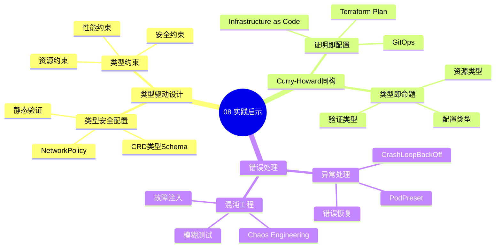

# 08. 实践启示：新设计模式

> **主题编号**: 08
> **主题名称**: 实践启示
> **最后更新**: 2025-01-XX

---

## 📋 目录

- [08. 实践启示：新设计模式](#08-实践启示新设计模式)
  - [📋 目录](#-目录)
  - [1 主题概述](#1-主题概述)
    - [1.0 实践启示思维导图](#10-实践启示思维导图)
  - [2 子主题导航](#2-子主题导航)
    - [2.1 81 类型驱动的基础设施设计](#21-81-类型驱动的基础设施设计)
    - [2.2 82 Curry-Howard 同构在DevOps](#22-82-curry-howard-同构在devops)
    - [2.3 83 错误处理新视角](#23-83-错误处理新视角)
  - [3 相关主题](#3-相关主题)

---

## 1 主题概述

本主题探讨**实践启示**和**新设计模式**，包括类型驱动的基础设施设计、Curry-Howard同构在DevOps中的应用和错误处理新视角。

### 1.0 实践启示思维导图

**可视化文档**: 查看 [思维导图与知识矩阵](../思维导图与知识矩阵.md#38-08-实践启示) 获取更详细的思维导图。

---

## 2 子主题导航

### 2.1 [81 类型驱动的基础设施设计](081_类型驱动设计md)

- CRD类型Schema
- NetworkPolicy作为函数签名
- 静态验证

### 2.2 [82 Curry-Howard 同构在DevOps](082_Curry-Howard同构md)

- Infrastructure as Code ≈ Code as Proof
- Terraform Plan ≈ 类型检查证明
- GitOps期望状态

### 2.3 [83 错误处理新视角](083_错误处理新视角md)

- CrashLoopBackOff ≈ 异常
- PodPreset ≈ 异常恢复策略
- Chaos Engineering ≈ 模糊测试

---

## 3 相关主题

- [07. 效应系统与副作用](../07_效应系统/README.md)
- [09. 形式化理论框架](../09_形式化理论/README.md)

---

**返回**: [主题索引](../README.md)
