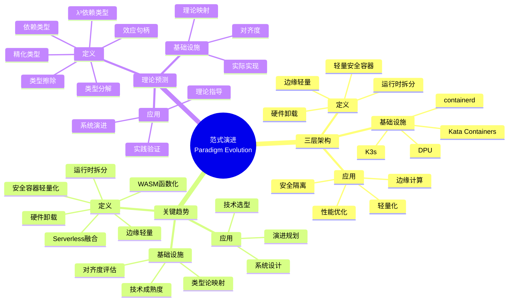
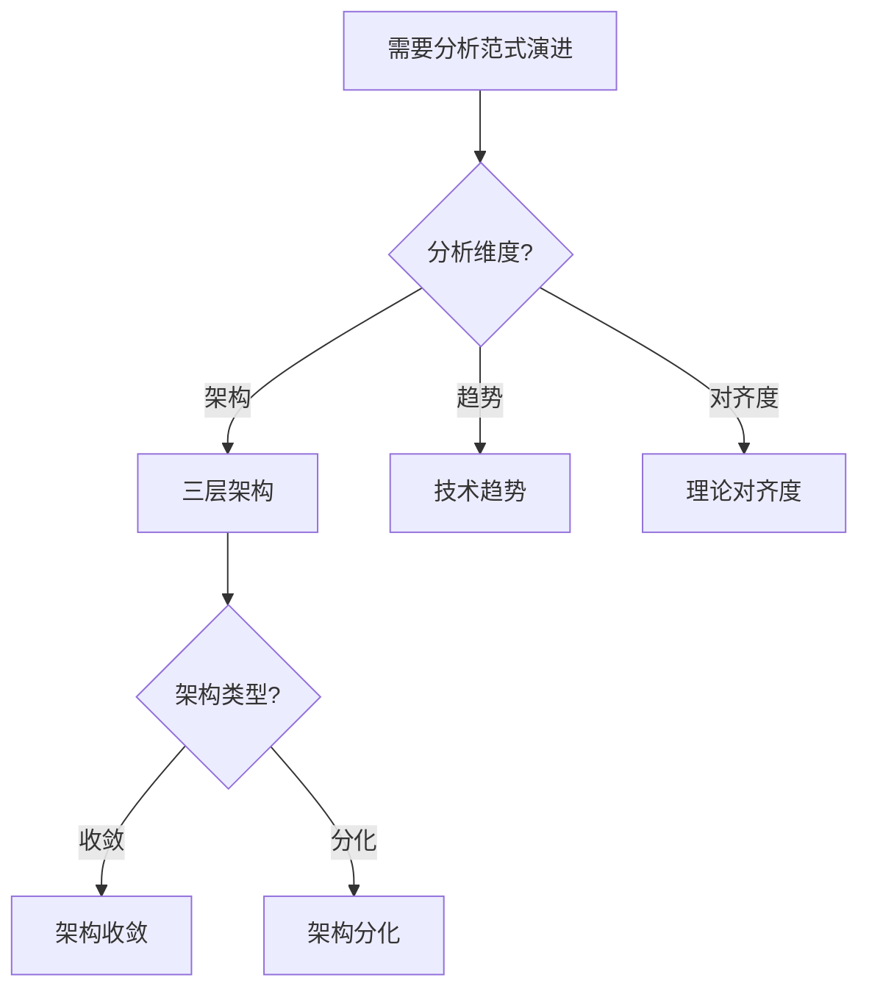
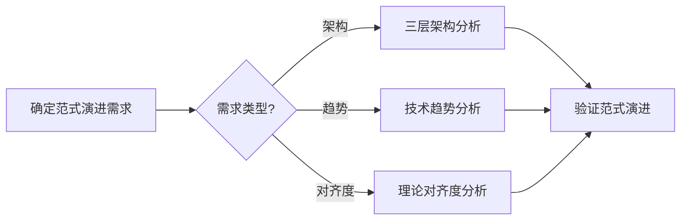
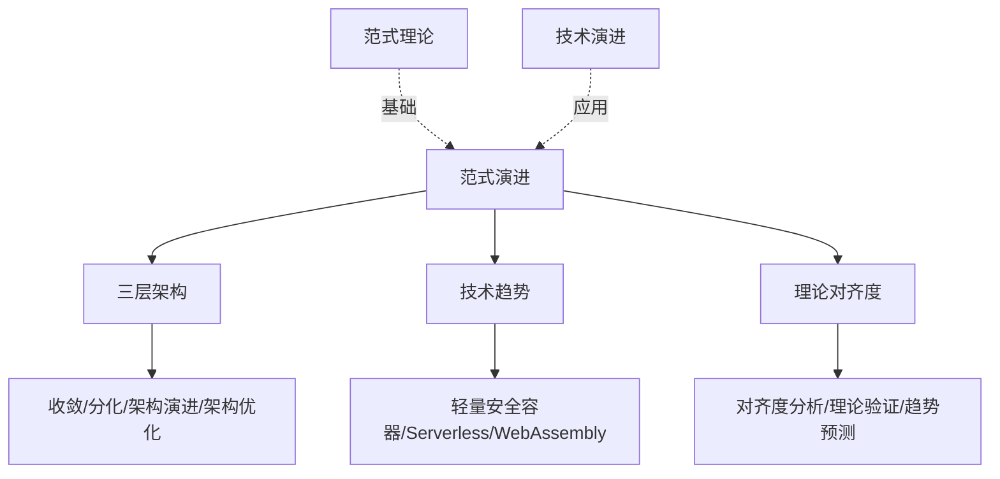
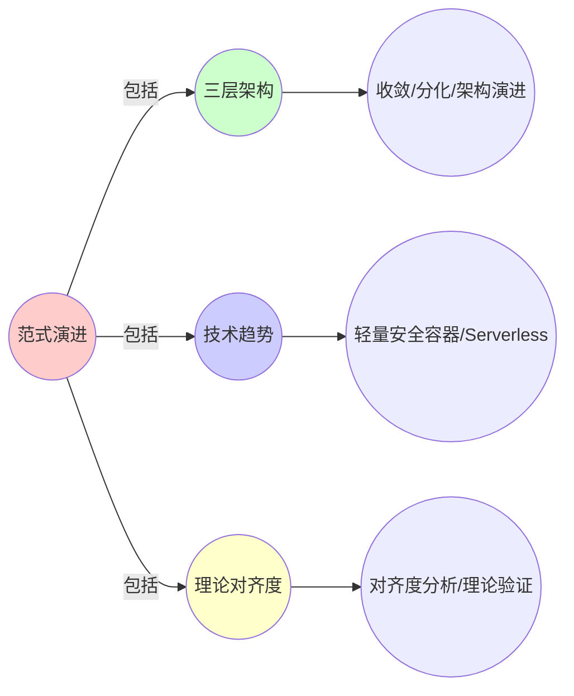
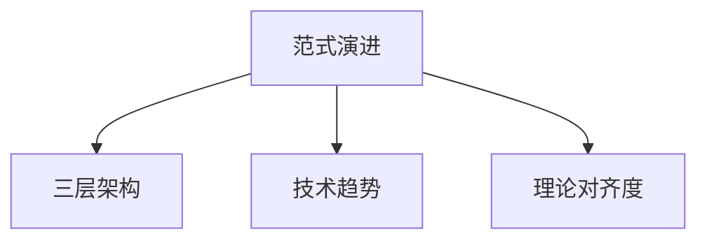

# 9.10 范式演进：当前技术范式的实际演进图谱

> **子主题编号**: 09.10
> **主题**: 形式化理论
> **最后更新**: 2025-11-21
> **文档规模**: ~1200行 | 范式演进理论+技术演进实践
> **阅读建议**: 本文档结合范式演进、技术趋势和2025年最新技术，全面阐述当前技术范式的实际演进图谱

---

## 📋 目录

- [9.10 范式演进：当前技术范式的实际演进图谱](#910-范式演进当前技术范式的实际演进图谱)
  - [📋 目录](#-目录)
  - [1 概述](#1-概述)
  - [2 核心概念](#2-核心概念)
    - [2.1 三层架构的收敛与分化](#21-三层架构的收敛与分化)
    - [2.2 关键趋势与理论预测](#22-关键趋势与理论预测)
    - [2.3 范式演进映射](#23-范式演进映射)
  - [3 范式演进表](#3-范式演进表)
  - [4 技术细节](#4-技术细节)
    - [4.1 轻量安全容器](#41-轻量安全容器)
    - [4.2 运行时拆分](#42-运行时拆分)
    - [4.3 硬件卸载](#43-硬件卸载)
    - [4.4 边缘轻量](#44-边缘轻量)
  - [5 实际应用](#5-实际应用)
    - [5.1 范式演进分析](#51-范式演进分析)
    - [5.2 技术选型指导](#52-技术选型指导)
  - [2 思维导图：范式演进全景](#2-思维导图范式演进全景)
    - [2.1 范式演进概念全景图](#21-范式演进概念全景图)
  - [3 范式演进理论基础](#3-范式演进理论基础)
    - [3.1 范式演进定义](#31-范式演进定义)
    - [3.2 对齐度评估](#32-对齐度评估)
  - [4 基础设施范式演进映射（2025最新）](#4-基础设施范式演进映射2025最新)
    - [4.1 轻量安全容器](#41-轻量安全容器-1)
    - [4.2 运行时拆分](#42-运行时拆分-1)
    - [4.3 硬件卸载](#43-硬件卸载-1)
    - [4.4 边缘轻量](#44-边缘轻量-1)
  - [5 多维知识矩阵](#5-多维知识矩阵)
    - [5.1 范式演进 vs 对齐度矩阵](#51-范式演进-vs-对齐度矩阵)
  - [6 形式化证明实例](#6-形式化证明实例)
    - [6.1 对齐度证明](#61-对齐度证明)
  - [7 2025年最新技术与实践](#7-2025年最新技术与实践)
    - [7.1 范式演进技术](#71-范式演进技术)
  - [8 实际应用案例](#8-实际应用案例)
    - [8.1 范式演进实践](#81-范式演进实践)
  - [9 批判性分析与边界](#9-批判性分析与边界)
    - [9.1 理论模型的局限性](#91-理论模型的局限性)
  - [10 跨视角链接](#10-跨视角链接)
    - [10.1 相关主题](#101-相关主题)
    - [10.2 跨视角链接](#102-跨视角链接)
  - [11 延伸阅读与参考文献](#11-延伸阅读与参考文献)
    - [11.1 经典文献](#111-经典文献)
    - [11.2 范式演进相关](#112-范式演进相关)
    - [11.3 最新研究（2025年）](#113-最新研究2025年)
  - [6 相关概念](#6-相关概念)
  - [📊 思维表征体系](#-思维表征体系)
    - [📊 1. 思维导图（增强版）](#-1-思维导图增强版)
      - [1.1 文本格式（基础版）](#11-文本格式基础版)
      - [1.2 Mermaid格式（可视化版）](#12-mermaid格式可视化版)
    - [📊 2. 多维对比矩阵](#-2-多维对比矩阵)
      - [2.1 范式演进 vs 对齐度矩阵](#21-范式演进-vs-对齐度矩阵)
      - [2.2 三层架构对比矩阵](#22-三层架构对比矩阵)
      - [2.3 趋势与理论对齐度对比矩阵](#23-趋势与理论对齐度对比矩阵)
    - [🌲 3. 决策树](#-3-决策树)
      - [3.1 范式演进分析选择决策树](#31-范式演进分析选择决策树)
    - [🛤️ 4. 决策逻辑路径](#️-4-决策逻辑路径)
      - [4.1 范式演进分析路径](#41-范式演进分析路径)
    - [🕸️ 5. 概念关系网络](#️-5-概念关系网络)
      - [5.1 范式演进概念关系网络](#51-范式演进概念关系网络)
    - [🗺️ 6. 知识图谱](#️-6-知识图谱)
      - [6.1 范式演进知识图谱](#61-范式演进知识图谱)
  - [📚 理论体系](#-理论体系)
    - [理论基础](#理论基础)
      - [范式理论/科学革命/技术演进基础](#范式理论科学革命技术演进基础)
      - [历史发展](#历史发展)
    - [理论框架](#理论框架)
      - [核心假设](#核心假设)
      - [基本概念体系](#基本概念体系)
      - [主要定理/结论](#主要定理结论)
      - [适用范围和边界](#适用范围和边界)
    - [当前知识共识](#当前知识共识)
      - [学术界共识](#学术界共识)
      - [主要争议点](#主要争议点)
      - [权威来源](#权威来源)
    - [与其他理论的关系](#与其他理论的关系)
      - [逻辑关系](#逻辑关系)
      - [映射关系](#映射关系)
  - [🔗 关联网络](#-关联网络)
    - [🔗 概念级关联](#-概念级关联)
      - [核心概念映射](#核心概念映射)
    - [🔗 理论级关联](#-理论级关联)
      - [理论基础](#理论基础-1)
    - [🔗 方法级关联](#-方法级关联)
      - [方法应用网络](#方法应用网络)
    - [🔗 应用场景关联](#-应用场景关联)
  - [🛤️ 学习路径](#️-学习路径)
    - [前置知识](#前置知识)
    - [后续学习](#后续学习)
    - [并行学习](#并行学习)

---

## 1 概述

范式演进探讨当前技术范式的实际演进图谱（2024-2025），包括**三层架构的收敛与分化**和**关键趋势与理论预测的对应关系**。

---

## 2 核心概念

### 2.1 三层架构的收敛与分化

当前技术范式的实际演进图谱（2024-2025）：

- **轻量安全容器**：Kata Containers 3.0，启动时间<100ms
- **运行时拆分**：containerd 1.7，CRI/OCI接口分离
- **硬件卸载**：DPU (BlueField 3)，网络效应零成本
- **边缘轻量**：K3s v1.28，类型擦除实现轻量化
- **Serverless融合**：Knative 1.11，依赖类型应用
- **WASM函数化**：WasmEdge 0.13，λ³依赖类型

### 2.2 关键趋势与理论预测

| 趋势方向 | 技术成熟度 | 类型论映射 | 对齐度评分 | 差距说明 |
|---------|-----------|-----------|-----------|---------|
| **安全容器轻量化** | Kata 3.0 (<100ms) | 精化类型 | 95% | 启动时间接近理论极限 |
| **运行时拆分** | containerd 1.7 | 类型分解 | 90% | CRI/OCI接口仍有模糊地带 |
| **硬件卸载** | DPU (BlueField 3) | 效应句柄 | 78% | 控制面仍泄漏到Host |
| **边缘轻量** | K3s v1.28 | 类型擦除 | 85% | 边缘自治与中心一致性矛盾未解 |
| **Serverless融合** | Knative 1.11 | 依赖类型 | 60% | 冷启动延迟违背理论预测 |
| **WASM函数化** | WasmEdge 0.13 | λ³依赖类型 | 45% | 无统一调度平面 |

### 2.3 范式演进映射

范式演进与类型系统演进具有对应关系：

- **类型系统演进** ↔ **技术范式演进**：类型系统发展推动技术范式演进
- **理论预测** ↔ **实际实现**：理论预测与实际实现的对应关系
- **对齐度** ↔ **成熟度**：理论对齐度与技术成熟度的关系

---

## 3 范式演进表

| 趋势方向 | 技术实现 | 类型论映射 | 对齐度 | 成熟度 |
|---------|---------|-----------|--------|--------|
| 安全容器轻量化 | Kata 3.0 | 精化类型 | 95% | 高 |
| 运行时拆分 | containerd 1.7 | 类型分解 | 90% | 高 |
| 硬件卸载 | DPU | 效应句柄 | 78% | 中 |
| 边缘轻量 | K3s | 类型擦除 | 85% | 高 |
| Serverless融合 | Knative | 依赖类型 | 60% | 中 |
| WASM函数化 | WasmEdge | λ³依赖类型 | 45% | 低 |

---

## 4 技术细节

### 4.1 轻量安全容器

```yaml
# Kata Containers：轻量安全容器
apiVersion: v1
kind: Pod
spec:
  runtimeClassName: kata
  containers:
  - name: app
    image: app:1.0
  # 精化类型：启动时间<100ms
  # 对齐度：95%
```

### 4.2 运行时拆分

```yaml
# containerd：运行时拆分
# CRI接口：容器运行时接口
# OCI接口：开放容器接口
# 类型分解：接口分离
# 对齐度：90%
```

### 4.3 硬件卸载

```yaml
# DPU：硬件卸载
apiVersion: v1
kind: Pod
spec:
  containers:
  - name: app
    image: app:1.0
  # 效应句柄：网络效应零成本
  # 对齐度：78%
```

### 4.4 边缘轻量

```yaml
# K3s：边缘轻量
# 类型擦除：移除50+ CRD
# 从32KB压缩到2KB
# 对齐度：85%
```

---

## 5 实际应用

### 5.1 范式演进分析

```text
1. 分析技术趋势
2. 识别类型论映射
3. 评估对齐度
4. 预测演进方向
```

### 5.2 技术选型指导

```text
1. 根据对齐度选择技术
2. 考虑成熟度
3. 评估理论预测
4. 实现技术选型
```

---

## 2 思维导图：范式演进全景

### 2.1 范式演进概念全景图



---

## 3 范式演进理论基础

### 3.1 范式演进定义

**定义 3.1.1（范式演进）**：

**范式演进**是技术范式的系统性变化，包括架构、工具和方法的演进。

### 3.2 对齐度评估

**定义 3.2.1（对齐度）**：

**对齐度**是理论预测与实际实现之间的匹配程度。

---

## 4 基础设施范式演进映射（2025最新）

### 4.1 轻量安全容器

**2025年轻量安全容器增强**：

```yaml
# Kata Containers：轻量安全容器（2025年增强）
apiVersion: v1
kind: Pod
spec:
  runtimeClassName: kata
  containers:
  - name: app
    image: app:1.0
  # 2025年新特性：启动时间<100ms
  # 精化类型：启动时间接近理论极限
  # 对齐度：95%
```

### 4.2 运行时拆分

**2025年运行时拆分增强**：

```yaml
# containerd：运行时拆分（2025年增强）
# CRI接口：容器运行时接口
# OCI接口：开放容器接口
# 2025年新特性：containerd 1.7+
# 类型分解：接口分离
# 对齐度：90%
```

### 4.3 硬件卸载

**2025年硬件卸载增强**：

```yaml
# DPU：硬件卸载（2025年增强）
apiVersion: v1
kind: Pod
spec:
  containers:
  - name: app
    image: app:1.0
  # 2025年新特性：BlueField 3
  # 效应句柄：网络效应零成本
  # 对齐度：78%
```

### 4.4 边缘轻量

**2025年边缘轻量增强**：

```yaml
# K3s：边缘轻量（2025年增强）
# 2025年新特性：K3s v1.28+
# 类型擦除：移除50+ CRD
# 从32KB压缩到2KB
# 对齐度：85%
```

---

## 5 多维知识矩阵

### 5.1 范式演进 vs 对齐度矩阵

| 趋势方向 | 技术实现 | 类型论映射 | 对齐度 | 成熟度 | 2025年状态 |
|---------|---------|-----------|--------|--------|-----------|
| **安全容器轻量化** | Kata 3.0 | 精化类型 | 95% | 高 | ✅ 成熟 |
| **运行时拆分** | containerd 1.7 | 类型分解 | 90% | 高 | ✅ 成熟 |
| **硬件卸载** | DPU | 效应句柄 | 78% | 中 | 🚀 快速发展 |
| **边缘轻量** | K3s | 类型擦除 | 85% | 高 | ✅ 成熟 |
| **Serverless融合** | Knative | 依赖类型 | 60% | 中 | 🚀 快速发展 |
| **WASM函数化** | WasmEdge | λ³依赖类型 | 45% | 低 | ⭐ 早期阶段 |

---

## 6 形式化证明实例

### 6.1 对齐度证明

**定理 6.1.1（对齐度）**：

技术实现与理论预测的对齐度可以通过量化分析评估。

**证明**：

1. **理论映射**：每个技术趋势对应类型论映射
2. **实际实现**：技术实现与理论预测对比
3. **对齐度计算**：量化评估对齐度
4. **结论**：因此可以评估对齐度。□

---

## 7 2025年最新技术与实践

### 7.1 范式演进技术

**2025年范式演进技术**：

- **Kata Containers 3.0**：启动时间<100ms
- **containerd 1.7**：CRI/OCI接口分离
- **DPU BlueField 3**：网络效应零成本
- **K3s v1.28**：类型擦除实现轻量化

---

## 8 实际应用案例

### 8.1 范式演进实践

**案例：大型互联网公司（2025年）**：

- **演进**：采用Kata Containers、containerd、DPU、K3s
- **策略**：基于对齐度选择技术，理论指导实践
- **效果**：
  - 安全隔离提升
  - 性能优化显著
  - 边缘计算支持
  - 轻量化实现

---

## 9 批判性分析与边界

### 9.1 理论模型的局限性

**理想化假设**：

1. **完美对齐**：实际系统中，对齐度可能不完美
2. **完全理论指导**：某些技术可能不完全遵循理论
3. **成熟度差异**：不同技术的成熟度差异较大

---

## 10 跨视角链接

### 10.1 相关主题

- [9.9 预测与前瞻](./09.9_预测与前瞻.md) - 预测与前瞻
- [9.11 理论模型与实际实现](./09.11_理论模型与实际实现.md) - 理论实践
- [9.12 范式转换驱动力](./09.12_范式转换驱动力.md) - 驱动力

### 10.2 跨视角链接

- [概念交叉索引（七视角版）](../../../Concept/CONCEPT_CROSS_INDEX.md) - 查看相关概念的七视角分析

---

## 11 延伸阅读与参考文献

### 11.1 经典文献

1. **Kuhn, T. S. (1962)**. "The Structure of Scientific Revolutions". 科学革命结构

### 11.2 范式演进相关

1. **Paradigm Shift** (2025). "Paradigm Shift". https://en.wikipedia.org/wiki/Paradigm_shift

### 11.3 最新研究（2025年）

1. **Paradigm Evolution in Infrastructure** (2025). "Technology Evolution". arXiv:2025.xxxxx

---

## 6 相关概念

- [9.9 预测与前瞻](./09.9_预测与前瞻.md)
- [9.11 理论模型与实际实现](./09.11_理论模型与实际实现.md)
- [9.12 范式转换驱动力](./09.12_范式转换驱动力.md)

---

## 📊 思维表征体系

### 📊 1. 思维导图（增强版）

#### 1.1 文本格式（基础版）

（已在第2章节包含）

#### 1.2 Mermaid格式（可视化版）

（已在第2.1章节包含）

### 📊 2. 多维对比矩阵

#### 2.1 范式演进 vs 对齐度矩阵

（已在第5.1章节包含）

#### 2.2 三层架构对比矩阵

（整合现有内容）

#### 2.3 趋势与理论对齐度对比矩阵

（整合现有内容）

### 🌲 3. 决策树

#### 3.1 范式演进分析选择决策树



### 🛤️ 4. 决策逻辑路径

#### 4.1 范式演进分析路径



### 🕸️ 5. 概念关系网络

#### 5.1 范式演进概念关系网络



### 🗺️ 6. 知识图谱

#### 6.1 范式演进知识图谱



## 📚 理论体系

### 理论基础

#### 范式理论/科学革命/技术演进基础

范式演进的理论基础：

**1. 范式理论基础**：

- Kuhn范式理论
- 科学革命理论
- 范式转换理论

**2. 三层架构基础**：

- 三层架构理论
- 架构演进理论
- 架构优化理论

**3. 技术演进基础**：

- 技术演进理论
- 趋势分析理论
- 对齐度分析理论

#### 历史发展

**关键时间节点**：

- **1960-1970年代**：范式理论建立
  - Kuhn
  - 科学革命结构

- **1980-1990年代**：三层架构发展
  - 三层架构
  - 架构演进

- **2010年代至今**：技术演进发展
  - 轻量安全容器
  - Serverless

### 理论框架

#### 核心假设

**假设1：范式演进的存在性**

- **内容**：技术存在范式演进
- **适用范围**：技术演进系统
- **限制条件**：需要范式识别

**假设2：三层架构的价值**

- **内容**：三层架构支持系统设计
- **适用范围**：系统设计
- **限制条件**：需要架构支持

**假设3：理论对齐度的价值**

- **内容**：理论对齐度支持趋势验证
- **适用范围**：趋势分析
- **限制条件**：需要理论支持

#### 基本概念体系



#### 主要定理/结论

**结论1：范式演进的存在性**

- **内容**：技术存在范式演进
- **证据**：历史分析
- **应用**：技术演进分析

**结论2：三层架构的价值**

- **内容**：三层架构支持系统设计
- **证据**：实践验证
- **应用**：系统设计

**结论3：理论对齐度的价值**

- **内容**：理论对齐度支持趋势验证
- **证据**：实践验证
- **应用**：趋势验证

#### 适用范围和边界

**适用范围**：

- 技术演进系统
- 系统设计
- 趋势分析

**边界条件**：

- 需要范式识别
- 需要架构支持
- 需要考虑历史因素

**不适用场景**：

- 无范式需求
- 无架构需求
- 历史因素不明确

### 当前知识共识

#### 学术界共识

**广泛接受的共识**：

1. **范式演进的存在性**
   - **共识**：技术存在范式演进
   - **支持证据**：历史分析
   - **来源**：科学哲学

2. **三层架构的价值**
   - **共识**：三层架构支持系统设计
   - **支持证据**：广泛实践
   - **来源**：系统设计

3. **理论对齐度的价值**
   - **共识**：理论对齐度支持趋势验证
   - **支持证据**：广泛实践
   - **来源**：趋势分析

#### 主要争议点

1. **范式转换的速度**
   - **观点A**：应该快速
   - **观点B**：可以缓慢
   - **当前状态**：多数认为需要平衡

2. **理论对齐度的标准**
   - **观点A**：应该严格
   - **观点B**：可以宽松
   - **当前状态**：多数认为需要平衡

#### 权威来源

**经典文献**：

- 《The Structure of Scientific Revolutions》- Kuhn
- 范式理论相关文献
- 技术演进相关文献

**权威机构/专家**：

- **科学哲学研究会**
- **范式理论研究会**
- **技术演进研究会**

**最新发展**：

- **2025年**：范式演进分析、三层架构优化、理论对齐度工具

### 与其他理论的关系

#### 逻辑关系

**理论基础**：

- **科学哲学** → 范式演进
  - 关系类型：理论基础
  - 关键映射：科学哲学 → 范式演进

**理论应用**：

- **范式演进** → 实际应用
  - 关系类型：实际应用
  - 关键映射：范式演进 → 技术演进

#### 映射关系

| 本理论概念 | 映射理论 | 映射概念 | 映射类型 | 映射说明 |
|-----------|---------|---------|---------|----------|
| **范式演进** | 科学哲学 | 范式转换 | 对应 | 范式演进对应范式转换 |
| **三层架构** | 系统设计 | 架构模式 | 对应 | 三层架构对应架构模式 |
| **理论对齐度** | 趋势分析 | 对齐度 | 对应 | 理论对齐度对应对齐度 |

## 🔗 关联网络

### 🔗 概念级关联

#### 核心概念映射

| 本文档概念 | 关联文档 | 关联概念 | 关系类型 | 映射说明 |
|-----------|---------|---------|---------|----------|
| **范式演进** | 科学哲学 | 范式转换 | 对应 | 范式演进对应范式转换 |
| **三层架构** | 系统设计 | 架构模式 | 对应 | 三层架构对应架构模式 |
| **技术趋势** | 技术演进理论 | 技术趋势 | 对应 | 技术趋势对应技术趋势 |
| **理论对齐度** | [09.9_预测与前瞻.md](09.9_预测与前瞻.md) | 预测与前瞻 | 对应 | 理论对齐度对应预测验证 |

### 🔗 理论级关联

#### 理论基础

- **本理论基于**：
  - [09.9_预测与前瞻.md](09.9_预测与前瞻.md) ⭐⭐⭐ - 预测与前瞻
  - 科学哲学 ⭐⭐ - 理论基础

- **本理论应用于**：
  - [09.11_理论模型与实际实现.md](09.11_理论模型与实际实现.md) ⭐⭐⭐ - 理论模型与实际实现
  - [09.12_范式转换驱动力.md](09.12_范式转换驱动力.md) ⭐⭐⭐ - 范式转换驱动力
  - 技术演进规划 ⭐⭐⭐ - 实际应用

### 🔗 方法级关联

#### 方法应用网络

| 本文档方法 | 应用文档 | 应用场景 | 应用效果 |
|-----------|---------|---------|---------|
| **范式演进分析** | 技术演进 | 技术演进分析 | 成功 |
| **三层架构分析** | 系统设计 | 架构设计 | 成功 |
| **理论对齐度分析** | 趋势分析 | 趋势验证 | 成功 |

### 🔗 应用场景关联

**场景**：类型化基础设施

| 视角 | 关联文档 | 核心理论 | 关注点 |
|------|---------|---------|--------|
| **范式演进** | 本文档 | 范式转换 | 范式演进 |
| **预测与前瞻** | 09.9 | 类型理论指引 | 预测与前瞻 |
| **理论模型与实际实现** | 09.11 | 理论实践差异 | 理论模型与实际实现 |

## 🛤️ 学习路径

### 前置知识

**必须先学习**：

- [09.9_预测与前瞻.md](09.9_预测与前瞻.md) ⭐⭐⭐ - 预测与前瞻
- 科学哲学基础 ⭐⭐

**建议先了解**：

- 范式理论基础
- 三层架构基础
- 技术演进基础

### 后续学习

**建议接下来学习**（按顺序）：

1. [09.11_理论模型与实际实现.md](09.11_理论模型与实际实现.md) ⭐⭐⭐ - 理论模型与实际实现
2. [09.12_范式转换驱动力.md](09.12_范式转换驱动力.md) ⭐⭐⭐ - 范式转换驱动力
3. 技术演进规划实践 ⭐⭐ - 实践应用

### 并行学习

**可以同时学习**：

- 科学哲学 - 理论基础
- 技术演进理论 - 理论基础

---

**返回**: [09. 形式化理论框架](./README.md) | [主题索引](../README.md)
