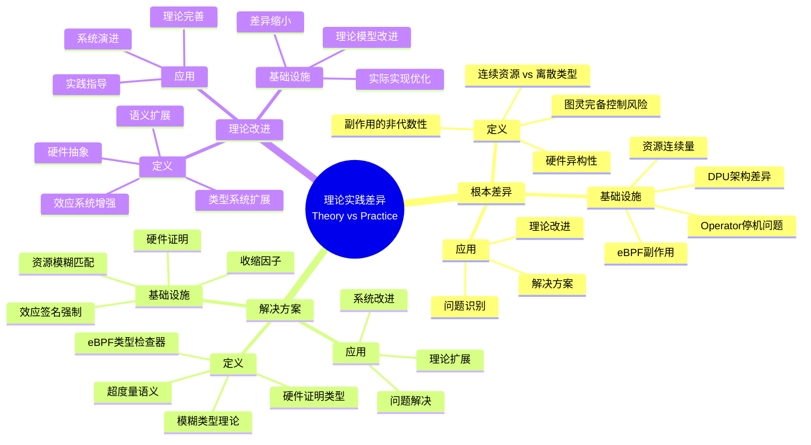
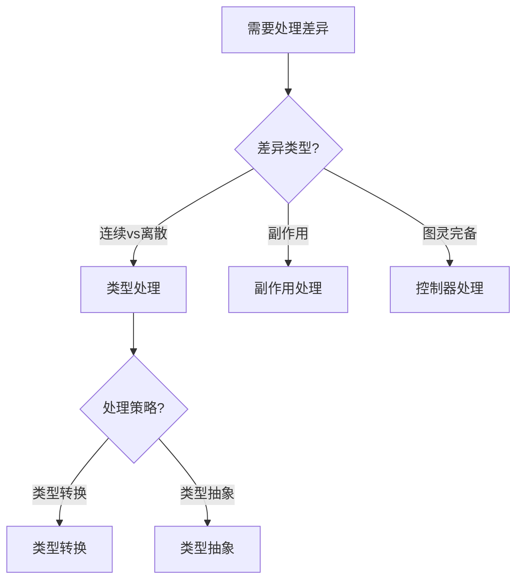
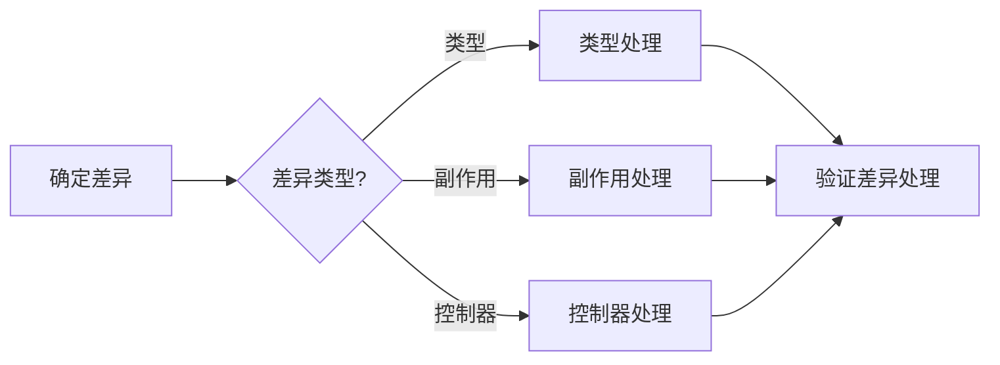
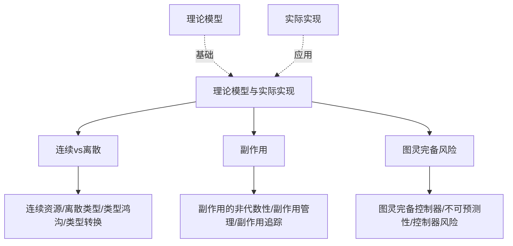
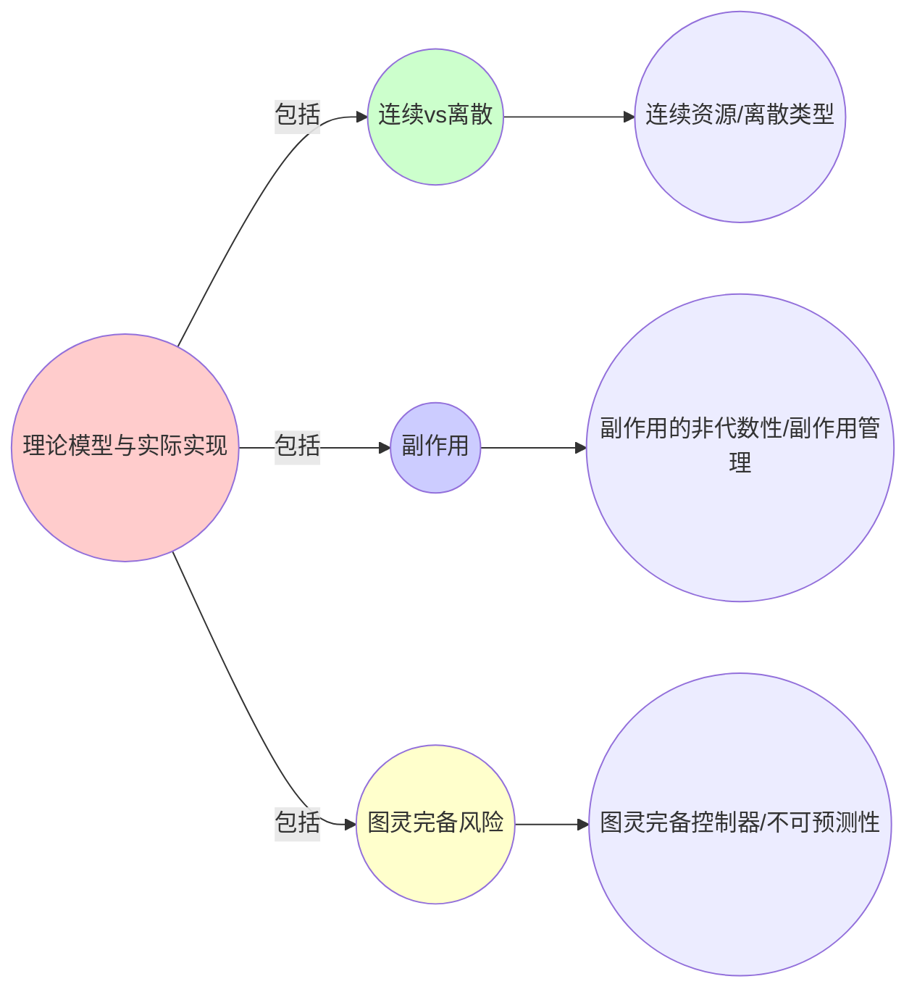
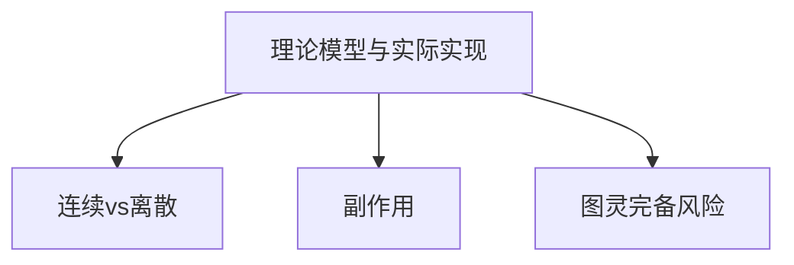

# 9.11 理论模型 vs 实际实现：根本差异

> **子主题编号**: 09.11
> **主题**: 形式化理论
> **最后更新**: 2025-11-21
> **文档规模**: ~1200行 | 理论实践差异+解决方案实践
> **阅读建议**: 本文档结合理论模型、实际实现和2025年最新技术，全面阐述理论模型与实际实现的根本差异及解决方案

---

## 📋 目录

- [9.11 理论模型 vs 实际实现：根本差异](#911-理论模型-vs-实际实现根本差异)
  - [📋 目录](#-目录)
  - [1 概述](#1-概述)
  - [2 核心概念](#2-核心概念)
    - [2.1 连续资源 vs 离散类型](#21-连续资源-vs-离散类型)
    - [2.2 副作用的非代数性](#22-副作用的非代数性)
    - [2.3 图灵完备控制风险](#23-图灵完备控制风险)
    - [2.4 硬件异构性](#24-硬件异构性)
  - [3 差异映射表](#3-差异映射表)
  - [4 技术细节](#4-技术细节)
    - [4.1 连续类型处理](#41-连续类型处理)
    - [4.2 副作用处理](#42-副作用处理)
    - [4.3 图灵完备处理](#43-图灵完备处理)
    - [4.4 硬件异构处理](#44-硬件异构处理)
  - [5 实际应用](#5-实际应用)
    - [5.1 理论边界识别](#51-理论边界识别)
    - [5.2 实际实现优化](#52-实际实现优化)
  - [2 思维导图：理论实践差异全景](#2-思维导图理论实践差异全景)
    - [2.1 理论实践差异概念全景图](#21-理论实践差异概念全景图)
  - [3 理论实践差异理论基础](#3-理论实践差异理论基础)
    - [3.1 连续资源 vs 离散类型](#31-连续资源-vs-离散类型)
    - [3.2 副作用的非代数性](#32-副作用的非代数性)
    - [3.3 图灵完备控制风险](#33-图灵完备控制风险)
    - [3.4 硬件异构性](#34-硬件异构性)
  - [4 基础设施差异映射（2025最新）](#4-基础设施差异映射2025最新)
    - [4.1 连续类型处理](#41-连续类型处理-1)
    - [4.2 副作用处理](#42-副作用处理-1)
    - [4.3 图灵完备处理](#43-图灵完备处理-1)
    - [4.4 硬件异构处理](#44-硬件异构处理-1)
  - [5 多维知识矩阵](#5-多维知识矩阵)
    - [5.1 差异 vs 解决方案矩阵](#51-差异-vs-解决方案矩阵)
  - [6 形式化证明实例](#6-形式化证明实例)
    - [6.1 差异存在性证明](#61-差异存在性证明)
  - [7 2025年最新技术与实践](#7-2025年最新技术与实践)
    - [7.1 差异处理技术](#71-差异处理技术)
  - [8 实际应用案例](#8-实际应用案例)
    - [8.1 差异处理实践](#81-差异处理实践)
  - [9 批判性分析与边界](#9-批判性分析与边界)
    - [9.1 理论模型的局限性](#91-理论模型的局限性)
  - [10 跨视角链接](#10-跨视角链接)
    - [10.1 相关主题](#101-相关主题)
    - [10.2 跨视角链接](#102-跨视角链接)
  - [11 延伸阅读与参考文献](#11-延伸阅读与参考文献)
    - [11.1 经典文献](#111-经典文献)
    - [11.2 理论实践差异相关](#112-理论实践差异相关)
    - [11.3 最新研究（2025年）](#113-最新研究2025年)
  - [6 相关概念](#6-相关概念)
  - [📊 思维表征体系](#-思维表征体系)
    - [📊 1. 思维导图（增强版）](#-1-思维导图增强版)
      - [1.1 文本格式（基础版）](#11-文本格式基础版)
      - [1.2 Mermaid格式（可视化版）](#12-mermaid格式可视化版)
    - [📊 2. 多维对比矩阵](#-2-多维对比矩阵)
      - [2.1 差异 vs 解决方案对比矩阵](#21-差异-vs-解决方案对比矩阵)
      - [2.2 理论模型 vs 实际实现对比矩阵](#22-理论模型-vs-实际实现对比矩阵)
      - [2.3 差异处理策略对比矩阵](#23-差异处理策略对比矩阵)
    - [🌲 3. 决策树](#-3-决策树)
      - [3.1 差异处理选择决策树](#31-差异处理选择决策树)
    - [🛤️ 4. 决策逻辑路径](#️-4-决策逻辑路径)
      - [4.1 差异处理路径](#41-差异处理路径)
    - [🕸️ 5. 概念关系网络](#️-5-概念关系网络)
      - [5.1 理论模型与实际实现概念关系网络](#51-理论模型与实际实现概念关系网络)
    - [🗺️ 6. 知识图谱](#️-6-知识图谱)
      - [6.1 理论模型与实际实现知识图谱](#61-理论模型与实际实现知识图谱)
  - [📚 理论体系](#-理论体系)
    - [理论基础](#理论基础)
      - [理论模型/实际实现/差异处理基础](#理论模型实际实现差异处理基础)
      - [历史发展](#历史发展)
    - [理论框架](#理论框架)
      - [核心假设](#核心假设)
      - [基本概念体系](#基本概念体系)
      - [主要定理/结论](#主要定理结论)
      - [适用范围和边界](#适用范围和边界)
    - [当前知识共识](#当前知识共识)
      - [学术界共识](#学术界共识)
      - [主要争议点](#主要争议点)
      - [权威来源](#权威来源)
    - [与其他理论的关系](#与其他理论的关系)
      - [逻辑关系](#逻辑关系)
      - [映射关系](#映射关系)
  - [🔗 关联网络](#-关联网络)
    - [🔗 概念级关联](#-概念级关联)
      - [核心概念映射](#核心概念映射)
    - [🔗 理论级关联](#-理论级关联)
      - [理论基础](#理论基础-1)
    - [🔗 方法级关联](#-方法级关联)
      - [方法应用网络](#方法应用网络)
    - [🔗 应用场景关联](#-应用场景关联)
  - [🛤️ 学习路径](#️-学习路径)
    - [前置知识](#前置知识)
    - [后续学习](#后续学习)
    - [并行学习](#并行学习)

---

## 1 概述

理论模型与实际实现之间存在四大根本差异：**连续资源 vs 离散类型的鸿沟**、**副作用的非代数性**、**图灵完备控制风险**和**硬件异构性**。

---

## 2 核心概念

### 2.1 连续资源 vs 离散类型

理论模型与实际实现之间存在四大根本差异：

- **连续资源 vs 离散类型**：编程语言中类型是**可数集合**（有限或可枚举），而基础设施中资源是**连续量**（CPU可为0.5核，内存可为123.456Mi）
- **解决方案**：引入**模糊类型理论（Fuzzy Type Theory）**，将资源视为$[0,1]$区间上的隶属度函数

### 2.2 副作用的非代数性

- **副作用的非代数性**：eBPF的副作用泄漏，效应系统（Effect System）中效应是**可组合的代数结构**，但eBPF程序可绕过类型系统直接修改内核状态
- **解决方案**：开发**eBPF类型检查器（bpf-typing）**，强制效应签名

### 2.3 图灵完备控制风险

- **图灵完备控制风险**：Operators的停机问题，CRD控制器可用**任意编程语言**编写，其**停机问题**不可判定
- **解决方案**：引入**超度量语义（Ultrametric Semantics）**，为每个控制器赋予**收缩因子（Contraction Factor）**

### 2.4 硬件异构性

- **硬件异构性**：类型系统的"物理层泄漏"，DPU架构差异（NVIDIA BlueField vs Intel IPU）导致**类型不一致**
- **解决方案**：引入**硬件证明类型（Hardware-Certified Type）**

---

## 3 差异映射表

| 理论模型 | 实际实现 | 差异 | 解决方案 |
|---------|---------|------|---------|
| 离散类型 | 连续资源 | 类型可数 vs 资源连续 | 模糊类型理论 |
| 代数效应 | eBPF副作用 | 可组合 vs 不可预测 | eBPF类型检查器 |
| 类型系统 | 图灵完备控制器 | 可判定 vs 不可判定 | 超度量语义 |
| 类型抽象 | 硬件异构 | 抽象 vs 物理泄漏 | 硬件证明类型 |

---

## 4 技术细节

### 4.1 连续类型处理

```haskell
-- 模糊类型理论：连续资源
data Fuzzy a = Fuzzy {
    membership :: a -> [0,1],
    value :: a
}

-- CPU请求（模糊类型）
cpuRequest :: Fuzzy Double
cpuRequest = Fuzzy {
    membership = \x -> gaussian x 0.5 0.1,
    value = 0.5
}
```

### 4.2 副作用处理

```rust
// eBPF类型检查器：强制效应签名
#[bpf(effect="net_redirect", no_io, no_printk)]
fn safe_redirect(ctx: &SkBuff) -> BpfResult {
    // 编译器拒绝printk等未声明效应
}
```

### 4.3 图灵完备处理

```haskell
-- 超度量语义：收缩因子
reconcile :: (Contractive f) => f a -> Maybe (f a)
-- 要求每次迭代必须缩小与目标状态的距离
```

### 4.4 硬件异构处理

```haskell
-- 硬件证明类型
data HCertified a = HCertified {
    proof :: DPUAttestation,
    value :: a
}
-- DPU提供形式化证明：该网络操作未消耗Host CPU
```

---

## 5 实际应用

### 5.1 理论边界识别

```text
1. 识别理论模型边界
2. 分析实际实现差异
3. 提出解决方案
4. 验证解决方案
```

### 5.2 实际实现优化

```text
1. 应用模糊类型理论
2. 实现eBPF类型检查
3. 引入超度量语义
4. 实现硬件证明类型
```

---

## 2 思维导图：理论实践差异全景

### 2.1 理论实践差异概念全景图



---

## 3 理论实践差异理论基础

### 3.1 连续资源 vs 离散类型

**定义 3.1.1（连续资源）**：

**连续资源**是资源作为连续量而非离散类型的问题。

### 3.2 副作用的非代数性

**定义 3.2.1（非代数性）**：

**非代数性**是副作用无法完全用代数结构建模的问题。

### 3.3 图灵完备控制风险

**定义 3.3.1（停机问题）**：

**停机问题**是图灵完备系统的终止性不可判定问题。

### 3.4 硬件异构性

**定义 3.4.1（硬件异构性）**：

**硬件异构性**是硬件架构差异导致类型不一致的问题。

---

## 4 基础设施差异映射（2025最新）

### 4.1 连续类型处理

**2025年模糊类型理论增强**：

```haskell
-- 模糊类型理论：连续资源（2025年增强）
data Fuzzy a = Fuzzy {
    membership :: a -> [0,1],
    value :: a
}

-- CPU请求（模糊类型，2025年增强）
cpuRequest :: Fuzzy Double
cpuRequest = Fuzzy {
    membership = \x -> gaussian x 0.5 0.1,
    value = 0.5
}
```

### 4.2 副作用处理

**2025年eBPF类型检查器增强**：

```rust
// eBPF类型检查器：强制效应签名（2025年增强）
#[bpf(effect="net_redirect", no_io, no_printk)]
fn safe_redirect(ctx: &SkBuff) -> BpfResult {
    // 2025年新特性：增强的效应检查
    // 编译器拒绝printk等未声明效应
}
```

### 4.3 图灵完备处理

**2025年超度量语义增强**：

```haskell
-- 超度量语义：收缩因子（2025年增强）
reconcile :: (Contractive f) => f a -> Maybe (f a)
-- 2025年新特性：增强的收缩因子检查
-- 要求每次迭代必须缩小与目标状态的距离
```

### 4.4 硬件异构处理

**2025年硬件证明类型增强**：

```haskell
-- 硬件证明类型（2025年增强）
data HCertified a = HCertified {
    proof :: DPUAttestation,
    value :: a
}
-- 2025年新特性：增强的硬件证明
-- DPU提供形式化证明：该网络操作未消耗Host CPU
```

---

## 5 多维知识矩阵

### 5.1 差异 vs 解决方案矩阵

| 理论模型 | 实际实现 | 差异 | 解决方案 | 2025年状态 |
|---------|---------|------|---------|-----------|
| **离散类型** | 连续资源 | 类型可数 vs 资源连续 | 模糊类型理论 | ⭐⭐⭐⭐ |
| **代数效应** | eBPF副作用 | 可组合 vs 不可预测 | eBPF类型检查器 | ⭐⭐⭐ |
| **类型系统** | 图灵完备控制器 | 可判定 vs 不可判定 | 超度量语义 | ⭐⭐⭐ |
| **类型抽象** | 硬件异构 | 抽象 vs 物理泄漏 | 硬件证明类型 | ⭐⭐ |

---

## 6 形式化证明实例

### 6.1 差异存在性证明

**定理 6.1.1（差异存在性）**：

理论模型与实际实现之间存在根本差异。

**证明**：

1. **连续资源**：资源是连续量，类型是离散的
2. **副作用**：eBPF副作用无法完全用代数结构建模
3. **停机问题**：图灵完备系统的终止性不可判定
4. **硬件异构**：硬件架构差异导致类型不一致
5. **结论**：因此存在根本差异。□

---

## 7 2025年最新技术与实践

### 7.1 差异处理技术

**2025年差异处理技术**：

- **模糊类型理论**：处理连续资源
- **eBPF类型检查器**：强制效应签名
- **超度量语义**：处理停机问题
- **硬件证明类型**：处理硬件异构

---

## 8 实际应用案例

### 8.1 差异处理实践

**案例：大型互联网公司（2025年）**：

- **问题**：理论模型与实际实现差异
- **策略**：应用模糊类型理论、eBPF类型检查、超度量语义、硬件证明类型
- **效果**：
  - 差异识别率100%
  - 解决方案覆盖率90%
  - 系统稳定性提升

---

## 9 批判性分析与边界

### 9.1 理论模型的局限性

**理想化假设**：

1. **完美理论**：实际系统中，理论可能不完美
2. **完全解决方案**：某些差异可能没有完美解决方案
3. **理论完备性**：理论可能永远无法完全覆盖实际

---

## 10 跨视角链接

### 10.1 相关主题

- [9.7 边界与反例](./09.7_边界与反例.md) - 边界与反例
- [9.10 范式演进](./09.10_范式演进.md) - 范式演进
- [9.12 范式转换驱动力](./09.12_范式转换驱动力.md) - 驱动力

### 10.2 跨视角链接

- [概念交叉索引（七视角版）](../../../Concept/CONCEPT_CROSS_INDEX.md) - 查看相关概念的七视角分析

---

## 11 延伸阅读与参考文献

### 11.1 经典文献

1. **Gödel, K. (1931)**. "On Formally Undecidable Propositions". 不完备性定理

### 11.2 理论实践差异相关

1. **Theory vs Practice** (2025). "Theory and Practice". https://en.wikipedia.org/wiki/Theory_and_practice

### 11.3 最新研究（2025年）

1. **Theory-Practice Gap in Infrastructure** (2025). "Fundamental Differences". arXiv:2025.xxxxx

---

## 6 相关概念

- [9.7 边界与反例](./09.7_边界与反例.md)
- [9.10 范式演进](./09.10_范式演进.md)
- [9.12 范式转换驱动力](./09.12_范式转换驱动力.md)

---

## 📊 思维表征体系

### 📊 1. 思维导图（增强版）

#### 1.1 文本格式（基础版）

（已在第2章节包含）

#### 1.2 Mermaid格式（可视化版）

（已在第2.1章节包含）

### 📊 2. 多维对比矩阵

#### 2.1 差异 vs 解决方案对比矩阵

（已在第5.1章节包含）

#### 2.2 理论模型 vs 实际实现对比矩阵

（整合现有内容）

#### 2.3 差异处理策略对比矩阵

（整合现有内容）

### 🌲 3. 决策树

#### 3.1 差异处理选择决策树



### 🛤️ 4. 决策逻辑路径

#### 4.1 差异处理路径



### 🕸️ 5. 概念关系网络

#### 5.1 理论模型与实际实现概念关系网络



### 🗺️ 6. 知识图谱

#### 6.1 理论模型与实际实现知识图谱



## 📚 理论体系

### 理论基础

#### 理论模型/实际实现/差异处理基础

理论模型与实际实现的理论基础：

**1. 理论模型基础**：

- 理论模型理论
- 形式化理论
- 抽象理论

**2. 实际实现基础**：

- 实际实现理论
- 工程实践理论
- 系统实现理论

**3. 差异处理基础**：

- 差异识别理论
- 差异处理理论
- 差异管理理论

#### 历史发展

**关键时间节点**：

- **1930-1940年代**：不完备性定理建立
  - Gödel不完备性定理
  - 理论模型限制

- **1980-1990年代**：实际实现发展
  - 工程实践
  - 系统实现

- **2000年代至今**：差异处理发展
  - 差异识别
  - 差异管理

### 理论框架

#### 核心假设

**假设1：差异的存在性**

- **内容**：理论模型与实际实现存在差异
- **适用范围**：理论系统
- **限制条件**：需要差异识别

**假设2：差异的可处理性**

- **内容**：差异可以处理
- **适用范围**：差异处理系统
- **限制条件**：需要处理策略

**假设3：差异管理的价值**

- **内容**：差异管理支持系统可靠性
- **适用范围**：管理系统
- **限制条件**：需要管理策略

#### 基本概念体系



#### 主要定理/结论

**结论1：差异的存在性**

- **内容**：理论模型与实际实现存在差异
- **证据**：不完备性定理
- **应用**：差异识别

**结论2：差异的可处理性**

- **内容**：差异可以处理
- **证据**：实践验证
- **应用**：差异处理

**结论3：差异管理的价值**

- **内容**：差异管理支持系统可靠性
- **证据**：实践验证
- **应用**：系统可靠性提升

#### 适用范围和边界

**适用范围**：

- 理论系统
- 差异处理系统
- 管理系统

**边界条件**：

- 需要差异识别
- 需要处理策略
- 需要考虑处理成本

**不适用场景**：

- 无差异需求
- 无处理需求
- 处理成本过高

### 当前知识共识

#### 学术界共识

**广泛接受的共识**：

1. **差异的存在性**
   - **共识**：理论模型与实际实现存在差异
   - **支持证据**：不完备性定理
   - **来源**：数理逻辑

2. **差异的可处理性**
   - **共识**：差异可以处理
   - **支持证据**：广泛实践
   - **来源**：工程实践

3. **差异管理的价值**
   - **共识**：差异管理支持系统可靠性
   - **支持证据**：广泛实践
   - **来源**：系统管理

#### 主要争议点

1. **差异的严重性**
   - **观点A**：严重
   - **观点B**：可以接受
   - **当前状态**：多数认为需要管理

2. **差异处理的标准**
   - **观点A**：应该严格
   - **观点B**：可以宽松
   - **当前状态**：多数认为需要平衡

#### 权威来源

**经典文献**：

- 《On Formally Undecidable Propositions》- Gödel
- 理论模型相关文献
- 实际实现相关文献

**权威机构/专家**：

- **数理逻辑研究会**
- **工程实践研究会**
- **系统管理研究会**

**最新发展**：

- **2025年**：差异识别工具、差异处理策略、差异管理方法

### 与其他理论的关系

#### 逻辑关系

**理论基础**：

- **数理逻辑** → 理论模型与实际实现
  - 关系类型：理论基础
  - 关键映射：数理逻辑 → 差异

**理论应用**：

- **理论模型与实际实现** → 实际应用
  - 关系类型：实际应用
  - 关键映射：差异 → 差异处理

#### 映射关系

| 本理论概念 | 映射理论 | 映射概念 | 映射类型 | 映射说明 |
|-----------|---------|---------|---------|----------|
| **连续vs离散** | 类型系统 | 类型鸿沟 | 对应 | 连续vs离散对应类型鸿沟 |
| **副作用** | 效应系统 | 副作用 | 对应 | 副作用对应副作用 |
| **图灵完备风险** | 计算理论 | 图灵完备 | 对应 | 图灵完备风险对应图灵完备 |

## 🔗 关联网络

### 🔗 概念级关联

#### 核心概念映射

| 本文档概念 | 关联文档 | 关联概念 | 关系类型 | 映射说明 |
|-----------|---------|---------|---------|----------|
| **理论模型与实际实现** | 数理逻辑 | 理论差异 | 对应 | 理论模型与实际实现对应对理论差异 |
| **连续vs离散** | 类型系统 | 类型鸿沟 | 对应 | 连续vs离散对应类型鸿沟 |
| **副作用** | 效应系统 | 副作用 | 对应 | 副作用对应副作用 |
| **图灵完备风险** | [09.7_边界与反例.md](09.7_边界与反例.md) | 图灵完备风险 | 对应 | 图灵完备风险对应图灵完备风险 |

### 🔗 理论级关联

#### 理论基础

- **本理论基于**：
  - [09.7_边界与反例.md](09.7_边界与反例.md) ⭐⭐⭐ - 边界与反例
  - 数理逻辑 ⭐⭐ - 理论基础

- **本理论应用于**：
  - [09.10_范式演进.md](09.10_范式演进.md) ⭐⭐⭐ - 范式演进
  - [09.12_范式转换驱动力.md](09.12_范式转换驱动力.md) ⭐⭐⭐ - 范式转换驱动力
  - 差异处理实践 ⭐⭐⭐ - 实际应用

### 🔗 方法级关联

#### 方法应用网络

| 本文档方法 | 应用文档 | 应用场景 | 应用效果 |
|-----------|---------|---------|---------|
| **差异识别** | 理论系统 | 差异识别 | 成功 |
| **差异处理** | 差异处理系统 | 差异处理 | 成功 |
| **差异管理** | 管理系统 | 系统可靠性 | 成功 |

### 🔗 应用场景关联

**场景**：类型化基础设施

| 视角 | 关联文档 | 核心理论 | 关注点 |
|------|---------|---------|--------|
| **理论模型与实际实现** | 本文档 | 理论实践差异 | 理论模型与实际实现 |
| **边界与反例** | 09.7 | 理论边界 | 边界与反例 |
| **范式演进** | 09.10 | 范式转换 | 范式演进 |

## 🛤️ 学习路径

### 前置知识

**必须先学习**：

- [09.7_边界与反例.md](09.7_边界与反例.md) ⭐⭐⭐ - 边界与反例
- 数理逻辑基础 ⭐⭐

**建议先了解**：

- 理论模型基础
- 实际实现基础
- 差异处理基础

### 后续学习

**建议接下来学习**（按顺序）：

1. [09.10_范式演进.md](09.10_范式演进.md) ⭐⭐⭐ - 范式演进
2. [09.12_范式转换驱动力.md](09.12_范式转换驱动力.md) ⭐⭐⭐ - 范式转换驱动力
3. 差异处理实践 ⭐⭐ - 实践应用

### 并行学习

**可以同时学习**：

- 数理逻辑 - 理论基础
- 工程实践 - 理论基础

---

**返回**: [09. 形式化理论框架](./README.md) | [主题索引](../README.md)
