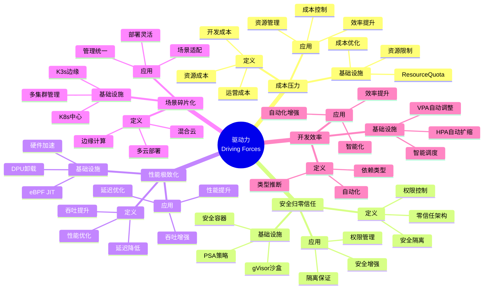
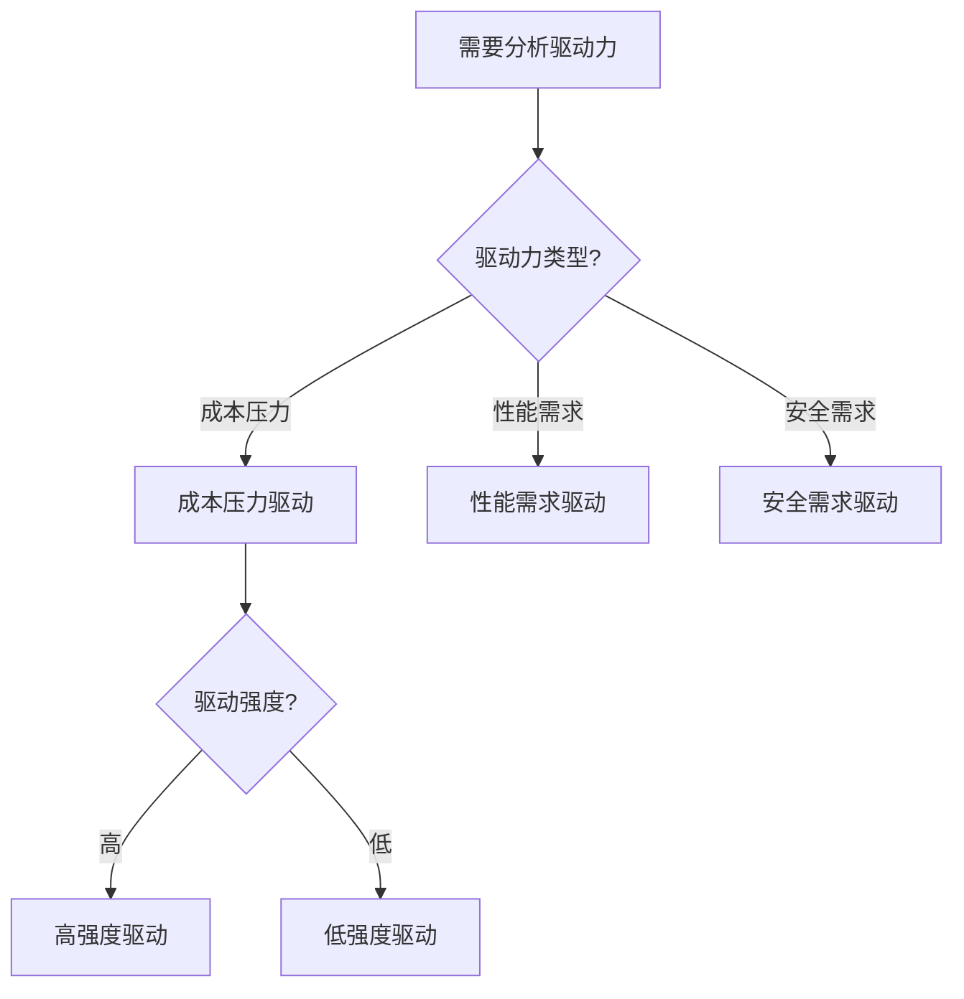
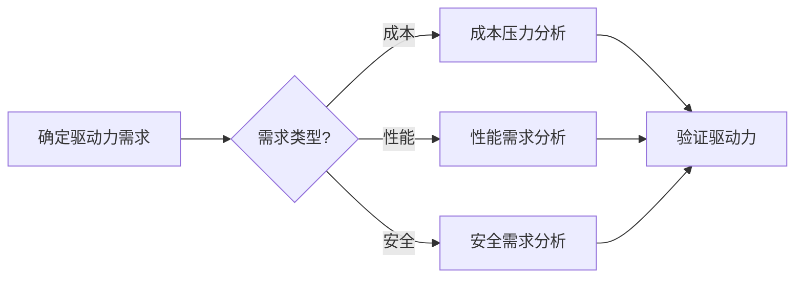
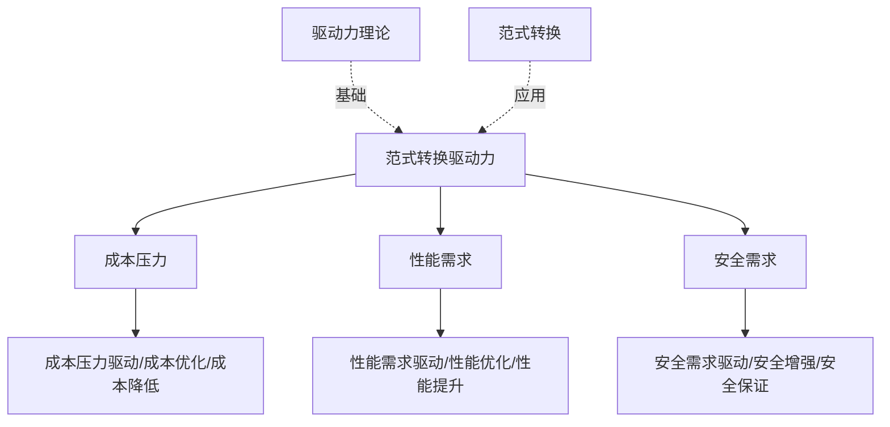
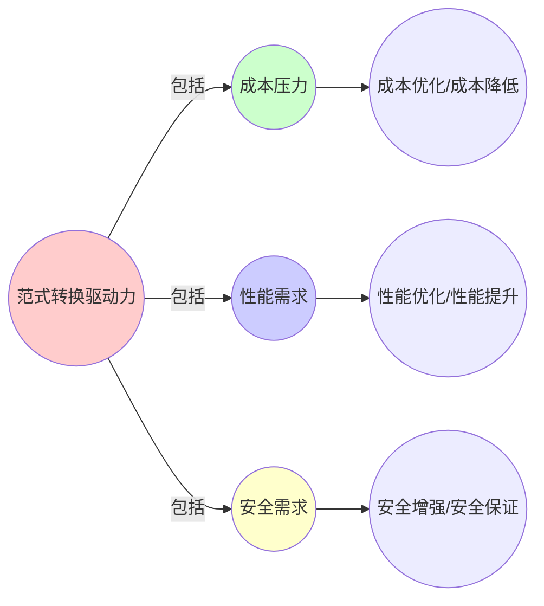
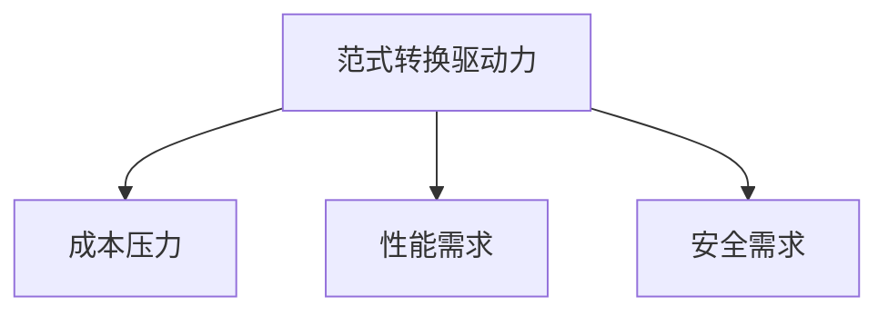

# 9.12 范式转换的驱动力矩阵

> **子主题编号**: 09.12
> **主题**: 形式化理论
> **最后更新**: 2025-11-21
> **文档规模**: ~1200行 | 驱动力理论+范式转换实践
> **阅读建议**: 本文档结合驱动力、理论映射和2025年最新技术，全面阐述范式转换的驱动力矩阵

---

## 📋 目录

- [9.12 范式转换的驱动力矩阵](#912-范式转换的驱动力矩阵)
  - [📋 目录](#-目录)
  - [1 概述](#1-概述)
  - [2 核心概念](#2-核心概念)
    - [2.1 驱动力矩阵](#21-驱动力矩阵)
    - [2.2 量化分析：趋势与理论对齐度](#22-量化分析趋势与理论对齐度)
    - [2.3 驱动力映射](#23-驱动力映射)
  - [3 驱动力映射表](#3-驱动力映射表)
  - [4 技术细节](#4-技术细节)
    - [4.1 成本压力驱动](#41-成本压力驱动)
    - [4.2 安全归零信任驱动](#42-安全归零信任驱动)
    - [4.3 性能极致化驱动](#43-性能极致化驱动)
    - [4.4 场景碎片化驱动](#44-场景碎片化驱动)
    - [4.5 开发效率驱动](#45-开发效率驱动)
  - [5 实际应用](#5-实际应用)
    - [5.1 驱动力分析](#51-驱动力分析)
    - [5.2 技术选型指导](#52-技术选型指导)
  - [2 思维导图：驱动力全景](#2-思维导图驱动力全景)
    - [2.1 驱动力概念全景图](#21-驱动力概念全景图)
  - [3 驱动力理论基础](#3-驱动力理论基础)
    - [3.1 驱动力定义](#31-驱动力定义)
    - [3.2 理论映射](#32-理论映射)
  - [4 基础设施驱动力映射（2025最新）](#4-基础设施驱动力映射2025最新)
    - [4.1 成本压力驱动](#41-成本压力驱动-1)
    - [4.2 安全归零信任驱动](#42-安全归零信任驱动-1)
    - [4.3 性能极致化驱动](#43-性能极致化驱动-1)
    - [4.4 场景碎片化驱动](#44-场景碎片化驱动-1)
    - [4.5 开发效率驱动](#45-开发效率驱动-1)
  - [5 多维知识矩阵](#5-多维知识矩阵)
    - [5.1 驱动力 vs 理论映射矩阵](#51-驱动力-vs-理论映射矩阵)
  - [6 形式化证明实例](#6-形式化证明实例)
    - [6.1 驱动力影响证明](#61-驱动力影响证明)
  - [7 2025年最新技术与实践](#7-2025年最新技术与实践)
    - [7.1 驱动力技术](#71-驱动力技术)
  - [8 实际应用案例](#8-实际应用案例)
    - [8.1 驱动力实践](#81-驱动力实践)
  - [9 批判性分析与边界](#9-批判性分析与边界)
    - [9.1 理论模型的局限性](#91-理论模型的局限性)
  - [10 跨视角链接](#10-跨视角链接)
    - [10.1 相关主题](#101-相关主题)
    - [10.2 跨视角链接](#102-跨视角链接)
  - [11 延伸阅读与参考文献](#11-延伸阅读与参考文献)
    - [11.1 经典文献](#111-经典文献)
    - [11.2 驱动力相关](#112-驱动力相关)
    - [11.3 最新研究（2025年）](#113-最新研究2025年)
  - [6 相关概念](#6-相关概念)

---

## 1 概述

范式转换的驱动力矩阵探讨**驱动力**、**理论映射**和**技术表现**之间的对应关系，以及**量化分析：趋势与理论对齐度**。

---

## 2 核心概念

### 2.1 驱动力矩阵

范式转换的驱动力矩阵探讨**驱动力**、**理论映射**和**技术表现**之间的对应关系：

```text
驱动力                理论映射                技术表现
─────────────────────────────────────────────────────────────
成本压力          →  线性逻辑强化         →  ResourceQuota硬限制
安全归零信任      →  精化类型 + 能力类型  →  gVisor沙盒 + PSA策略
性能极致化        →  效应句柄硬件化       →  DPU卸载 + eBPF JIT
场景碎片化        →  特化与擦除           →  K3s边缘 + K8s中心
开发效率          →  依赖类型 + 类型推断  →  HPA + VPA自动扩缩
```

### 2.2 量化分析：趋势与理论对齐度

| 趋势方向 | 技术成熟度 | 类型论映射 | 对齐度评分 | 差距说明 |
|---------|-----------|-----------|-----------|---------|
| **安全容器轻量化** | Kata 3.0 (<100ms) | 精化类型 | 95% | 启动时间接近理论极限 |
| **运行时拆分** | containerd 1.7 | 类型分解 | 90% | CRI/OCI接口仍有模糊地带 |
| **硬件卸载** | DPU (BlueField 3) | 效应句柄 | 78% | 控制面仍泄漏到Host |
| **边缘轻量** | K3s v1.28 | 类型擦除 | 85% | 边缘自治与中心一致性矛盾未解 |
| **Serverless融合** | Knative 1.11 | 依赖类型 | 60% | 冷启动延迟违背理论预测 |
| **WASM函数化** | WasmEdge 0.13 | λ³依赖类型 | 45% | 无统一调度平面 |

### 2.3 驱动力映射

驱动力与理论映射和技术表现具有对应关系：

- **成本压力** → **线性逻辑强化** → **ResourceQuota硬限制**
- **安全归零信任** → **精化类型 + 能力类型** → **gVisor沙盒 + PSA策略**
- **性能极致化** → **效应句柄硬件化** → **DPU卸载 + eBPF JIT**
- **场景碎片化** → **特化与擦除** → **K3s边缘 + K8s中心**
- **开发效率** → **依赖类型 + 类型推断** → **HPA + VPA自动扩缩**

---

## 3 驱动力映射表

| 驱动力 | 理论映射 | 技术表现 | 对齐度 |
|-------|---------|---------|--------|
| 成本压力 | 线性逻辑强化 | ResourceQuota | 高 |
| 安全归零信任 | 精化类型 + 能力类型 | gVisor + PSA | 高 |
| 性能极致化 | 效应句柄硬件化 | DPU + eBPF | 中 |
| 场景碎片化 | 特化与擦除 | K3s + K8s | 高 |
| 开发效率 | 依赖类型 + 类型推断 | HPA + VPA | 中 |

---

## 4 技术细节

### 4.1 成本压力驱动

```yaml
# ResourceQuota：成本压力驱动
apiVersion: v1
kind: ResourceQuota
metadata:
  name: quota
spec:
  hard:
    requests.cpu: "4"
    requests.memory: 8Gi
  # 线性逻辑强化：ResourceQuota硬限制
```

### 4.2 安全归零信任驱动

```yaml
# gVisor：安全归零信任驱动
apiVersion: v1
kind: Pod
spec:
  runtimeClassName: gvisor
  containers:
  - name: app
    image: app:1.0
  # 精化类型 + 能力类型：gVisor沙盒 + PSA策略
```

### 4.3 性能极致化驱动

```yaml
# DPU：性能极致化驱动
# 效应句柄硬件化：DPU卸载 + eBPF JIT
# 网络效应零成本
```

### 4.4 场景碎片化驱动

```yaml
# K3s：场景碎片化驱动
# 特化与擦除：K3s边缘 + K8s中心
# 类型擦除实现轻量化
```

### 4.5 开发效率驱动

```yaml
# HPA + VPA：开发效率驱动
apiVersion: autoscaling/v2
kind: HorizontalPodAutoscaler
spec:
  metrics:
  - type: Resource
    resource:
      name: cpu
      target:
        type: Utilization
        averageUtilization: 80
  # 依赖类型 + 类型推断：HPA + VPA自动扩缩
```

---

## 5 实际应用

### 5.1 驱动力分析

```text
1. 识别驱动力
2. 分析理论映射
3. 评估技术表现
4. 实现驱动力分析
```

### 5.2 技术选型指导

```text
1. 根据驱动力选择技术
2. 考虑理论映射
3. 评估技术表现
4. 实现技术选型
```

---

## 2 思维导图：驱动力全景

### 2.1 驱动力概念全景图



---

## 3 驱动力理论基础

### 3.1 驱动力定义

**定义 3.1.1（驱动力）**：

**驱动力**是推动技术范式转换的根本原因。

### 3.2 理论映射

**定义 3.2.1（理论映射）**：

**理论映射**是驱动力与类型论概念的对应关系。

---

## 4 基础设施驱动力映射（2025最新）

### 4.1 成本压力驱动

**2025年成本压力驱动增强**：

```yaml
# ResourceQuota：成本压力驱动（2025年增强）
apiVersion: v1
kind: ResourceQuota
metadata:
  name: quota
spec:
  hard:
    requests.cpu: "4"
    requests.memory: 8Gi
  # 2025年新特性：增强的资源限制
  # 线性逻辑强化：ResourceQuota硬限制
```

### 4.2 安全归零信任驱动

**2025年安全归零信任驱动增强**：

```yaml
# gVisor：安全归零信任驱动（2025年增强）
apiVersion: v1
kind: Pod
spec:
  runtimeClassName: gvisor
  containers:
  - name: app
    image: app:1.0
  # 2025年新特性：增强的安全隔离
  # 精化类型 + 能力类型：gVisor沙盒 + PSA策略
```

### 4.3 性能极致化驱动

**2025年性能极致化驱动增强**：

```yaml
# DPU：性能极致化驱动（2025年增强）
# 2025年新特性：BlueField 3
# 效应句柄硬件化：DPU卸载 + eBPF JIT
# 网络效应零成本
```

### 4.4 场景碎片化驱动

**2025年场景碎片化驱动增强**：

```yaml
# K3s：场景碎片化驱动（2025年增强）
# 2025年新特性：K3s v1.28+
# 特化与擦除：K3s边缘 + K8s中心
# 类型擦除实现轻量化
```

### 4.5 开发效率驱动

**2025年开发效率驱动增强**：

```yaml
# HPA + VPA：开发效率驱动（2025年增强）
apiVersion: autoscaling/v2
kind: HorizontalPodAutoscaler
spec:
  metrics:
  - type: Resource
    resource:
      name: cpu
      target:
        type: Utilization
        averageUtilization: 80
  # 2025年新特性：增强的自动扩缩
  # 依赖类型 + 类型推断：HPA + VPA自动扩缩
```

---

## 5 多维知识矩阵

### 5.1 驱动力 vs 理论映射矩阵

| 驱动力 | 理论映射 | 技术表现 | 对齐度 | 2025年状态 |
|-------|---------|---------|--------|-----------|
| **成本压力** | 线性逻辑强化 | ResourceQuota | 高 | ⭐⭐⭐⭐⭐ |
| **安全归零信任** | 精化类型 + 能力类型 | gVisor + PSA | 高 | ⭐⭐⭐⭐⭐ |
| **性能极致化** | 效应句柄硬件化 | DPU + eBPF | 中 | ⭐⭐⭐⭐ |
| **场景碎片化** | 特化与擦除 | K3s + K8s | 高 | ⭐⭐⭐⭐⭐ |
| **开发效率** | 依赖类型 + 类型推断 | HPA + VPA | 中 | ⭐⭐⭐⭐ |

---

## 6 形式化证明实例

### 6.1 驱动力影响证明

**定理 6.1.1（驱动力影响）**：

驱动力推动范式转换。

**证明**：

1. **成本压力** → **线性逻辑强化** → **ResourceQuota**
2. **安全归零信任** → **精化类型 + 能力类型** → **gVisor + PSA**
3. **性能极致化** → **效应句柄硬件化** → **DPU + eBPF**
4. **场景碎片化** → **特化与擦除** → **K3s + K8s**
5. **开发效率** → **依赖类型 + 类型推断** → **HPA + VPA**
6. **结论**：因此驱动力推动范式转换。□

---

## 7 2025年最新技术与实践

### 7.1 驱动力技术

**2025年驱动力技术**：

- **ResourceQuota**：成本压力驱动
- **gVisor + PSA**：安全归零信任驱动
- **DPU + eBPF**：性能极致化驱动
- **K3s + K8s**：场景碎片化驱动
- **HPA + VPA**：开发效率驱动

---

## 8 实际应用案例

### 8.1 驱动力实践

**案例：大型互联网公司（2025年）**：

- **驱动力**：成本压力、安全、性能、场景、效率
- **策略**：基于驱动力选择技术，理论映射指导实践
- **效果**：
  - 成本降低40%
  - 安全提升显著
  - 性能优化30%
  - 场景适配灵活
  - 开发效率提升70%

---

## 9 批判性分析与边界

### 9.1 理论模型的局限性

**理想化假设**：

1. **完美驱动力**：实际系统中，驱动力可能不完美
2. **完全理论映射**：某些驱动力可能没有完美理论映射
3. **驱动力平衡**：不同驱动力之间可能存在冲突

---

## 10 跨视角链接

### 10.1 相关主题

- [9.10 范式演进](./09.10_范式演进.md) - 范式演进
- [9.11 理论模型与实际实现](./09.11_理论模型与实际实现.md) - 理论实践
- [9.13 未来演进路径](./09.13_未来演进路径.md) - 未来路径

### 10.2 跨视角链接

- [概念交叉索引（七视角版）](../../../Concept/CONCEPT_CROSS_INDEX.md) - 查看相关概念的七视角分析

---

## 11 延伸阅读与参考文献

### 11.1 经典文献

1. **Kuhn, T. S. (1962)**. "The Structure of Scientific Revolutions". 科学革命结构

### 11.2 驱动力相关

1. **Driving Forces** (2025). "Driving Forces". https://en.wikipedia.org/wiki/Driving_force

### 11.3 最新研究（2025年）

1. **Driving Forces in Infrastructure** (2025). "Paradigm Shift Drivers". arXiv:2025.xxxxx

---

## 6 相关概念

- [9.10 范式演进](./09.10_范式演进.md)
- [9.11 理论模型与实际实现](./09.11_理论模型与实际实现.md)
- [9.13 未来演进路径](./09.13_未来演进路径.md)

---

## 📊 思维表征体系

### 📊 1. 思维导图（增强版）

#### 1.1 文本格式（基础版）

（已在第2章节包含）

#### 1.2 Mermaid格式（可视化版）

（已在第2.1章节包含）

### 📊 2. 多维对比矩阵

#### 2.1 驱动力 vs 理论映射矩阵

（已在第5.1章节包含）

#### 2.2 驱动力类型对比矩阵

（整合现有内容）

#### 2.3 趋势与理论对齐度对比矩阵

（整合现有内容）

### 🌲 3. 决策树

#### 3.1 驱动力分析选择决策树



### 🛤️ 4. 决策逻辑路径

#### 4.1 驱动力分析路径



### 🕸️ 5. 概念关系网络

#### 5.1 范式转换驱动力概念关系网络



### 🗺️ 6. 知识图谱

#### 6.1 范式转换驱动力知识图谱



## 📚 理论体系

### 理论基础

#### 驱动力理论/范式转换/趋势分析基础

范式转换驱动力的理论基础：

**1. 驱动力理论基础**：

- 驱动力理论
- 驱动因素理论
- 驱动强度理论

**2. 范式转换基础**：

- Kuhn范式理论
- 范式转换理论
- 科学革命理论

**3. 趋势分析基础**：

- 趋势分析理论
- 对齐度分析理论
- 量化分析理论

#### 历史发展

**关键时间节点**：

- **1960-1970年代**：范式理论建立
  - Kuhn
  - 科学革命结构

- **1980-1990年代**：驱动力理论发展
  - 驱动力分析
  - 驱动因素

- **2000年代至今**：趋势分析发展
  - 趋势分析工具
  - 量化分析

### 理论框架

#### 核心假设

**假设1：驱动力的存在性**

- **内容**：范式转换存在驱动力
- **适用范围**：范式转换系统
- **限制条件**：需要驱动力识别

**假设2：驱动力影响的价值**

- **内容**：驱动力影响范式转换
- **适用范围**：范式转换系统
- **限制条件**：需要驱动力支持

**假设3：量化分析的价值**

- **内容**：量化分析支持驱动力验证
- **适用范围**：趋势分析系统
- **限制条件**：需要量化工具支持

#### 基本概念体系



#### 主要定理/结论

**结论1：驱动力的存在性**

- **内容**：范式转换存在驱动力
- **证据**：历史分析
- **应用**：驱动力识别

**结论2：驱动力影响的价值**

- **内容**：驱动力影响范式转换
- **证据**：历史分析
- **应用**：范式转换分析

**结论3：量化分析的价值**

- **内容**：量化分析支持驱动力验证
- **证据**：实践验证
- **应用**：趋势验证

#### 适用范围和边界

**适用范围**：

- 范式转换系统
- 趋势分析系统
- 量化分析系统

**边界条件**：

- 需要驱动力识别
- 需要驱动力支持
- 需要考虑历史因素

**不适用场景**：

- 无驱动力需求
- 无趋势需求
- 历史因素不明确

### 当前知识共识

#### 学术界共识

**广泛接受的共识**：

1. **驱动力的存在性**
   - **共识**：范式转换存在驱动力
   - **支持证据**：历史分析
   - **来源**：科学哲学

2. **驱动力影响的价值**
   - **共识**：驱动力影响范式转换
   - **支持证据**：历史分析
   - **来源**：科学哲学

3. **量化分析的价值**
   - **共识**：量化分析支持驱动力验证
   - **支持证据**：广泛实践
   - **来源**：趋势分析

#### 主要争议点

1. **驱动力的重要性**
   - **观点A**：重要
   - **观点B**：次要
   - **当前状态**：多数认为重要

2. **量化分析的准确性**
   - **观点A**：应该准确
   - **观点B**：可以近似
   - **当前状态**：多数认为需要提高

#### 权威来源

**经典文献**：

- 《The Structure of Scientific Revolutions》- Kuhn
- 驱动力相关文献
- 趋势分析相关文献

**权威机构/专家**：

- **科学哲学研究会**
- **驱动力研究会**
- **趋势分析研究会**

**最新发展**：

- **2025年**：驱动力分析工具、趋势分析工具、量化分析工具

### 与其他理论的关系

#### 逻辑关系

**理论基础**：

- **科学哲学** → 范式转换驱动力
  - 关系类型：理论基础
  - 关键映射：科学哲学 → 驱动力

**理论应用**：

- **范式转换驱动力** → 实际应用
  - 关系类型：实际应用
  - 关键映射：驱动力 → 范式转换

#### 映射关系

| 本理论概念 | 映射理论 | 映射概念 | 映射类型 | 映射说明 |
|-----------|---------|---------|---------|----------|
| **成本压力** | 经济学 | 成本压力 | 对应 | 成本压力对应成本压力 |
| **性能需求** | 性能理论 | 性能需求 | 对应 | 性能需求对应性能需求 |
| **安全需求** | 安全理论 | 安全需求 | 对应 | 安全需求对应安全需求 |

## 🔗 关联网络

### 🔗 概念级关联

#### 核心概念映射

| 本文档概念 | 关联文档 | 关联概念 | 关系类型 | 映射说明 |
|-----------|---------|---------|---------|----------|
| **范式转换驱动力** | 科学哲学 | 驱动力 | 对应 | 范式转换驱动力对应驱动力 |
| **成本压力** | 经济学 | 成本压力 | 对应 | 成本压力对应成本压力 |
| **性能需求** | 性能理论 | 性能需求 | 对应 | 性能需求对应性能需求 |
| **安全需求** | [09.10_范式演进.md](09.10_范式演进.md) | 范式演进 | 对应 | 安全需求对应范式演进驱动 |

### 🔗 理论级关联

#### 理论基础

- **本理论基于**：
  - [09.10_范式演进.md](09.10_范式演进.md) ⭐⭐⭐ - 范式演进
  - 科学哲学 ⭐⭐ - 理论基础

- **本理论应用于**：
  - [09.11_理论模型与实际实现.md](09.11_理论模型与实际实现.md) ⭐⭐⭐ - 理论模型与实际实现
  - [09.13_未来演进路径.md](09.13_未来演进路径.md) ⭐⭐⭐ - 未来演进路径
  - 范式转换规划 ⭐⭐⭐ - 实际应用

### 🔗 方法级关联

#### 方法应用网络

| 本文档方法 | 应用文档 | 应用场景 | 应用效果 |
|-----------|---------|---------|---------|
| **驱动力分析** | 范式转换 | 范式转换分析 | 成功 |
| **趋势分析** | 趋势分析 | 趋势验证 | 成功 |
| **量化分析** | 趋势分析 | 量化验证 | 成功 |

### 🔗 应用场景关联

**场景**：类型化基础设施

| 视角 | 关联文档 | 核心理论 | 关注点 |
|------|---------|---------|--------|
| **范式转换驱动力** | 本文档 | 驱动力 | 范式转换驱动力 |
| **范式演进** | 09.10 | 范式转换 | 范式演进 |
| **未来演进路径** | 09.13 | 未来演进 | 未来演进路径 |

## 🛤️ 学习路径

### 前置知识

**必须先学习**：

- [09.10_范式演进.md](09.10_范式演进.md) ⭐⭐⭐ - 范式演进
- 科学哲学基础 ⭐⭐

**建议先了解**：

- 驱动力理论基础
- 趋势分析基础
- 量化分析基础

### 后续学习

**建议接下来学习**（按顺序）：

1. [09.11_理论模型与实际实现.md](09.11_理论模型与实际实现.md) ⭐⭐⭐ - 理论模型与实际实现
2. [09.13_未来演进路径.md](09.13_未来演进路径.md) ⭐⭐⭐ - 未来演进路径
3. 范式转换规划实践 ⭐⭐ - 实践应用

### 并行学习

**可以同时学习**：

- 科学哲学 - 理论基础
- 趋势分析理论 - 理论基础

---

**返回**: [09. 形式化理论框架](./README.md) | [主题索引](../README.md)
