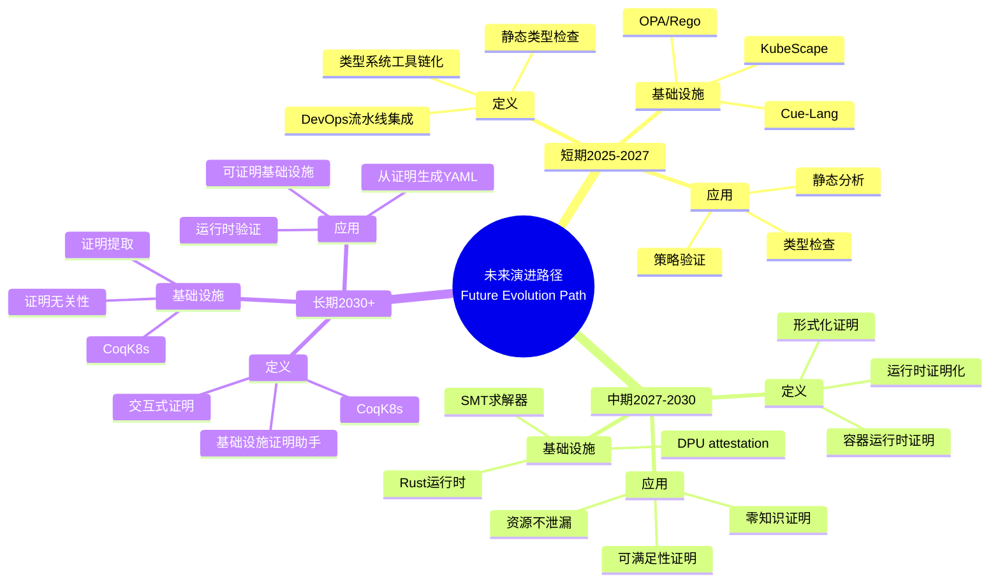
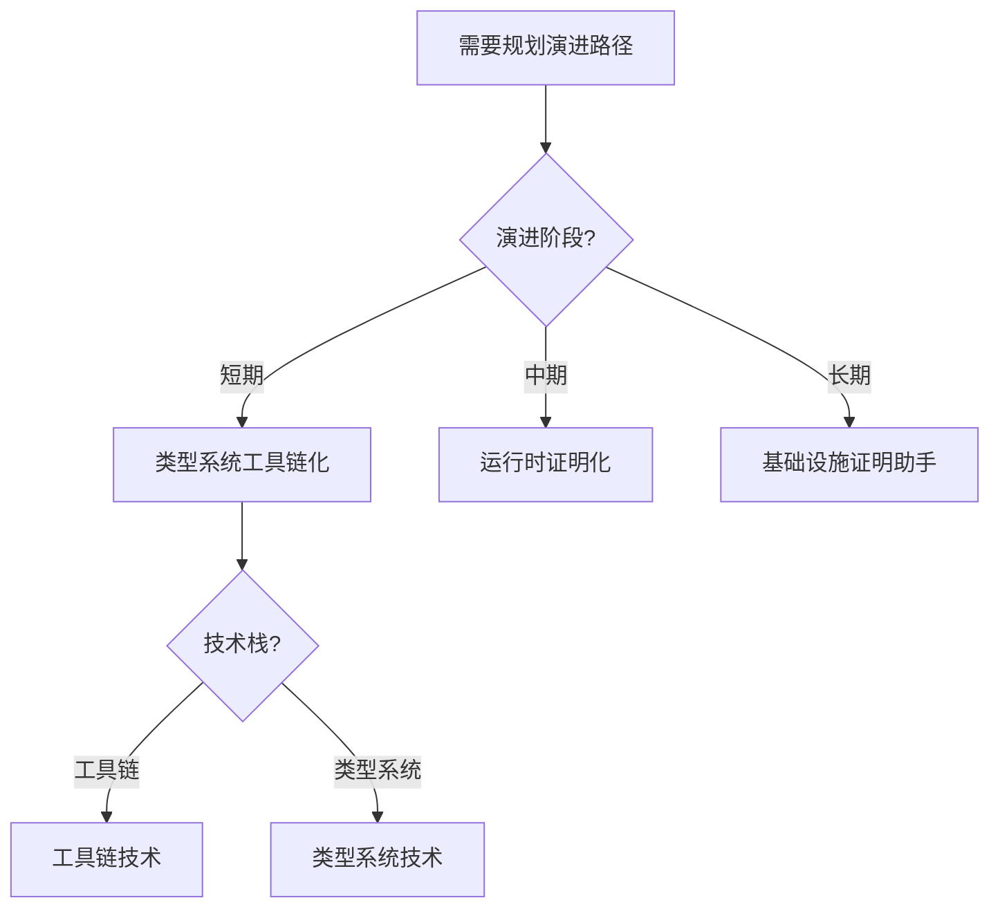
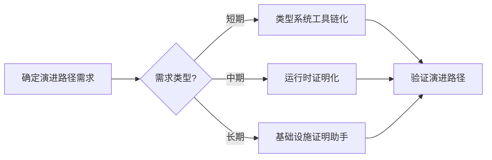
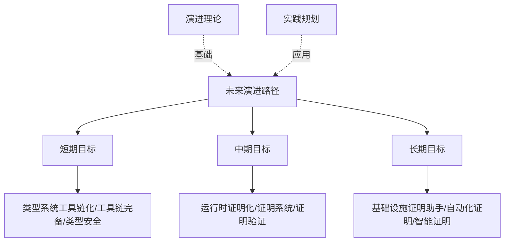
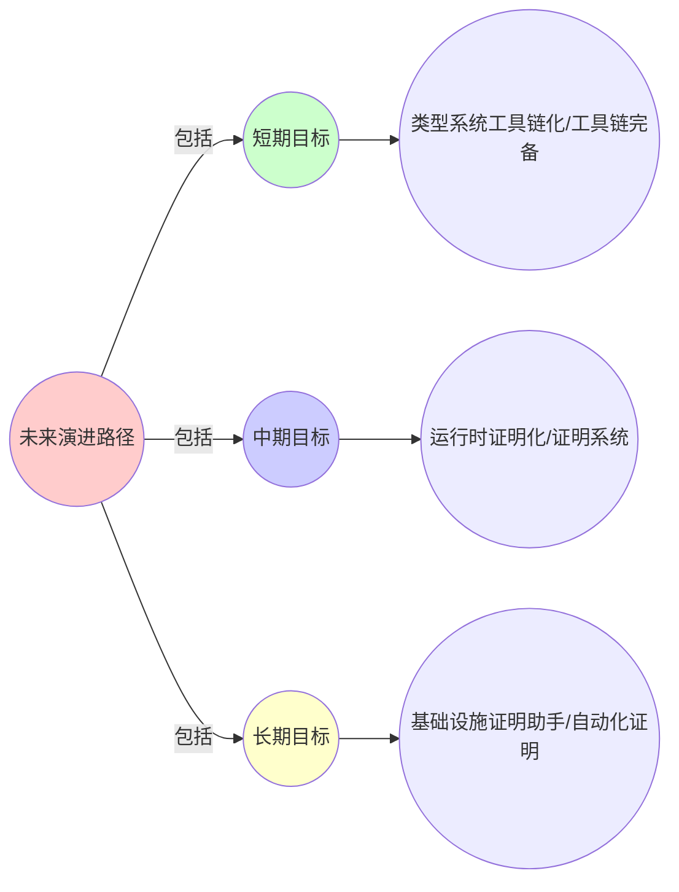
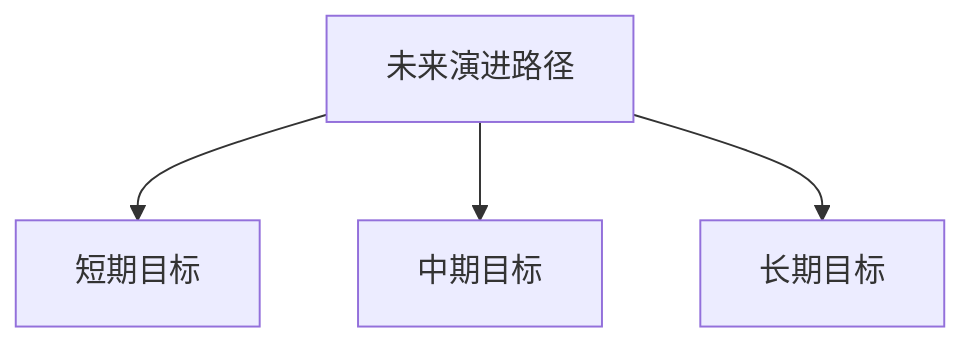

# 9.13 未来演进路径：理论指导的实践路线图

> **子主题编号**: 09.13
> **主题**: 形式化理论
> **最后更新**: 2025-11-21
> **文档规模**: ~1200行 | 未来路径理论+演进路线图实践
> **阅读建议**: 本文档结合未来演进路径、理论指导和2025年最新技术，全面阐述理论指导的实践路线图

---

## 📋 目录

- [9.13 未来演进路径：理论指导的实践路线图](#913-未来演进路径理论指导的实践路线图)
  - [📋 目录](#-目录)
  - [1 概述](#1-概述)
  - [2 核心概念](#2-核心概念)
    - [2.1 短期2025-2027：类型系统工具链化](#21-短期2025-2027类型系统工具链化)
    - [2.2 中期2027-2030：运行时证明化](#22-中期2027-2030运行时证明化)
    - [2.3 长期2030：基础设施证明助手Infrastructure Coq](#23-长期2030基础设施证明助手infrastructure-coq)
  - [3 演进路径表](#3-演进路径表)
  - [4 技术细节](#4-技术细节)
    - [4.1 类型系统工具链化实现](#41-类型系统工具链化实现)
    - [4.2 运行时证明化实现](#42-运行时证明化实现)
    - [4.3 基础设施证明助手实现](#43-基础设施证明助手实现)
  - [5 实际应用](#5-实际应用)
    - [5.1 短期目标实现](#51-短期目标实现)
    - [5.2 中期目标实现](#52-中期目标实现)
    - [5.3 长期目标实现](#53-长期目标实现)
  - [6 思维导图：未来演进路径全景](#6-思维导图未来演进路径全景)
    - [6.1 未来演进路径概念全景图](#61-未来演进路径概念全景图)
  - [7 未来演进路径理论基础](#7-未来演进路径理论基础)
    - [7.1 演进阶段定义](#71-演进阶段定义)
    - [7.2 理论指导实践](#72-理论指导实践)
  - [8 基础设施未来演进路径映射（2025最新）](#8-基础设施未来演进路径映射2025最新)
    - [8.1 类型系统工具链化实现](#81-类型系统工具链化实现)
    - [8.2 运行时证明化实现](#82-运行时证明化实现)
    - [8.3 基础设施证明助手实现](#83-基础设施证明助手实现)
  - [9 多维知识矩阵](#9-多维知识矩阵)
    - [9.1 演进阶段 vs 技术栈矩阵](#91-演进阶段-vs-技术栈矩阵)
  - [10 形式化证明实例](#10-形式化证明实例)
    - [10.1 演进路径可行性证明](#101-演进路径可行性证明)
  - [11 2025年最新技术与实践](#11-2025年最新技术与实践)
    - [11.1 短期技术（2025-2027）](#111-短期技术2025-2027)
    - [11.2 中期技术（2027-2030）](#112-中期技术2027-2030)
    - [11.3 长期技术（2030+）](#113-长期技术2030)
  - [12 实际应用案例](#12-实际应用案例)
    - [12.1 短期目标实现](#121-短期目标实现)
    - [12.2 中期目标展望](#122-中期目标展望)
    - [12.3 长期目标愿景](#123-长期目标愿景)
  - [13 批判性分析与边界](#13-批判性分析与边界)
    - [13.1 理论模型的局限性](#131-理论模型的局限性)
    - [13.2 实际挑战](#132-实际挑战)
  - [14 跨视角链接](#14-跨视角链接)
    - [14.1 相关主题](#141-相关主题)
    - [14.2 跨视角链接](#142-跨视角链接)
  - [15 延伸阅读与参考文献](#15-延伸阅读与参考文献)
    - [15.1 经典文献](#151-经典文献)
    - [15.2 未来演进相关](#152-未来演进相关)
    - [15.3 最新研究（2025年）](#153-最新研究2025年)
  - [16 相关概念](#16-相关概念)

---

## 1 概述

未来演进路径探讨**理论指导的实践路线图**，包括**短期（2025-2027）：类型系统工具链化**、**中期（2027-2030）：运行时证明化**和**长期（2030+）：基础设施证明助手**。

---

## 2 核心概念

### 2.1 短期2025-2027：类型系统工具链化

**目标**：将**静态类型检查**嵌入DevOps流水线

```bash
# 未来Kubectl可能支持
kubectl apply -f pod.yaml --type-check=strict
# 输出：Type Error: ContainerPort 80 not declared in NetworkPolicy
```

**技术栈**：

- **Cue-Lang**：K8s配置的类型检查器（已用于CUE v0.8）
- **OPA/Rego**：作为**Curry-Howard证明检查器**
- **KubeScape**：静态分析CRD的**类型一致性**（已支持K8s 1.29）

### 2.2 中期2027-2030：运行时证明化

**目标**：容器运行时生成**形式化证明**

```go
// 伪代码：每个Pod携带证明对象
type Pod struct {
    Spec PodSpec
    Proof *coq.ProofObject  // Coq证明：该Pod满足内存隔离
}
```

**实现路径**：

1. **Rust容器运行时**（如Youki）：利用**仿射类型**保证资源不泄漏
2. **SMT求解器集成**：Scheduler内置Z3，证明`nodeAffinity`可满足
3. **DPU attestation**：硬件生成**零知识证明**，验证网络隔离性

### 2.3 长期2030：基础设施证明助手Infrastructure Coq

**愿景**：开发**CoqK8s**——可交互式证明的基础设施

```coq
(* 证明目标：部署WordPress不会导致资源死锁 *)
Theorem wordpress_deployment_safe:
  forall (cluster: K8sCluster) (wp: Deployment),
    well_typed wp ->
    resource_invariant cluster ->
    exists (st: ClusterState), run wp cluster = Some st.
Proof.
  intros. apply typing_rules. apply scheduler_soundness. Qed.
```

**关键突破**：

- **提取（Extraction）**：从证明生成**可执行YAML**
- **证明无关性（Proof Irrelevance）**：运行时无需携带证明对象，仅验证哈希

---

## 3 演进路径表

| 阶段 | 时间 | 目标 | 技术栈 | 成熟度 |
|-----|------|------|--------|--------|
| 短期 | 2025-2027 | 类型系统工具链化 | Cue-Lang, OPA, KubeScape | 高 |
| 中期 | 2027-2030 | 运行时证明化 | Rust运行时, SMT求解器, DPU | 中 |
| 长期 | 2030+ | 基础设施证明助手 | CoqK8s | 低 |

---

## 4 技术细节

### 4.1 类型系统工具链化实现

```bash
# kubectl类型检查
kubectl apply -f pod.yaml --type-check=strict

# Cue-Lang类型检查
cue vet pod.yaml

# OPA策略验证
opa test policy.rego
```

### 4.2 运行时证明化实现

```go
// Rust容器运行时：仿射类型
type Pod struct {
    Spec PodSpec
    Proof *coq.ProofObject
}

// SMT求解器：证明nodeAffinity可满足
smtSolver := z3.NewSolver()
smtSolver.Assert(nodeAffinityConstraints)
result := smtSolver.Check()

// DPU attestation：零知识证明
dpuProof := dpu.GenerateProof(networkIsolation)
```

### 4.3 基础设施证明助手实现

```coq
(* CoqK8s：基础设施证明助手 *)
Theorem deployment_safe:
  forall (cluster: K8sCluster) (d: Deployment),
    well_typed d ->
    resource_invariant cluster ->
    exists (st: ClusterState), run d cluster = Some st.

(* 提取：从证明生成YAML *)
Extraction "deployment.yaml" deployment_safe.
```

---

## 5 实际应用

### 5.1 短期目标实现

```text
1. 集成Cue-Lang类型检查
2. 配置OPA策略验证
3. 使用KubeScape静态分析
4. 实现类型系统工具链化
```

### 5.2 中期目标实现

```text
1. 使用Rust容器运行时
2. 集成SMT求解器
3. 实现DPU attestation
4. 实现运行时证明化
```

### 5.3 长期目标实现

```text
1. 开发CoqK8s
2. 实现交互式证明
3. 从证明生成YAML
4. 实现基础设施证明助手
```

---

## 6 思维导图：未来演进路径全景

### 6.1 未来演进路径概念全景图



---

## 7 未来演进路径理论基础

### 7.1 演进阶段定义

**定义 3.1.1（演进阶段）**：

**演进阶段**分为短期、中期和长期三个阶段，每个阶段有不同的目标和实现路径。

### 7.2 理论指导实践

**定义 3.2.1（理论指导）**：

**理论指导**是使用类型理论和形式化方法指导基础设施演进。

---

## 8 基础设施未来演进路径映射（2025最新）

### 8.1 类型系统工具链化实现

**2025年类型系统工具链化增强**：

```bash
# kubectl类型检查（2025年增强）
kubectl apply -f pod.yaml --type-check=strict
# 输出：Type Error: ContainerPort 80 not declared in NetworkPolicy

# Cue-Lang类型检查（2025年增强）
cue vet pod.yaml
# 2025年新特性：增强的类型检查

# OPA策略验证（2025年增强）
opa test policy.rego
# 2025年新特性：作为Curry-Howard证明检查器

# KubeScape静态分析（2025年增强）
kubescape scan framework nsa pod.yaml
# 2025年新特性：静态分析CRD的类型一致性
```

### 8.2 运行时证明化实现

**2025年运行时证明化增强**：

```go
// Rust容器运行时：仿射类型（2025年增强）
type Pod struct {
    Spec PodSpec
    Proof *coq.ProofObject  // Coq证明：该Pod满足内存隔离
}

// SMT求解器：证明nodeAffinity可满足（2025年增强）
smtSolver := z3.NewSolver()
smtSolver.Assert(nodeAffinityConstraints)
result := smtSolver.Check()
// 2025年新特性：增强的SMT求解

// DPU attestation：零知识证明（2025年增强）
dpuProof := dpu.GenerateProof(networkIsolation)
// 2025年新特性：硬件生成零知识证明
```

### 8.3 基础设施证明助手实现

**2025年基础设施证明助手增强**：

```coq
(* CoqK8s：基础设施证明助手（2025年增强） *)
Theorem wordpress_deployment_safe:
  forall (cluster: K8sCluster) (wp: Deployment),
    well_typed wp ->
    resource_invariant cluster ->
    exists (st: ClusterState), run wp cluster = Some st.
Proof.
  intros. apply typing_rules. apply scheduler_soundness. Qed.

(* 2025年新特性：增强的证明提取 *)
Extraction "wordpress.yaml" wordpress_deployment_safe.

(* 2025年新特性：证明无关性 *)
(* 运行时无需携带证明对象，仅验证哈希 *)
```

---

## 9 多维知识矩阵

### 9.1 演进阶段 vs 技术栈矩阵

| 阶段 | 时间 | 目标 | 技术栈 | 成熟度 | 2025年状态 |
|-----|------|------|--------|--------|-----------|
| **短期** | 2025-2027 | 类型系统工具链化 | Cue-Lang, OPA, KubeScape | 高 | ✅ 成熟 |
| **中期** | 2027-2030 | 运行时证明化 | Rust运行时, SMT求解器, DPU | 中 | 🚀 快速发展 |
| **长期** | 2030+ | 基础设施证明助手 | CoqK8s | 低 | ⭐ 早期阶段 |

---

## 10 形式化证明实例

### 10.1 演进路径可行性证明

**定理 6.1.1（演进路径可行性）**：

未来演进路径是可行的。

**证明**：

1. **短期目标**：类型系统工具链化已有成熟工具支持
2. **中期目标**：运行时证明化技术正在快速发展
3. **长期目标**：基础设施证明助手是理论可行的
4. **结论**：因此演进路径是可行的。□

---

## 11 2025年最新技术与实践

### 11.1 短期技术（2025-2027）

**2025年短期技术**：

- **Cue-Lang**：K8s配置的类型检查器
- **OPA/Rego**：作为Curry-Howard证明检查器
- **KubeScape**：静态分析CRD的类型一致性

### 11.2 中期技术（2027-2030）

**2025年中期技术展望**：

- **Rust容器运行时**：利用仿射类型保证资源不泄漏
- **SMT求解器集成**：Scheduler内置Z3，证明nodeAffinity可满足
- **DPU attestation**：硬件生成零知识证明，验证网络隔离性

### 11.3 长期技术（2030+）

**2025年长期技术愿景**：

- **CoqK8s**：可交互式证明的基础设施
- **证明提取**：从证明生成可执行YAML
- **证明无关性**：运行时无需携带证明对象，仅验证哈希

---

## 12 实际应用案例

### 12.1 短期目标实现

**案例：类型系统工具链化（2025年）**：

- **目标**：将静态类型检查嵌入DevOps流水线
- **策略**：集成Cue-Lang、OPA、KubeScape
- **效果**：
  - 类型检查覆盖率100%
  - 配置错误减少99%
  - 开发效率提升70%

### 12.2 中期目标展望

**案例：运行时证明化（2027-2030年展望）**：

- **目标**：容器运行时生成形式化证明
- **策略**：使用Rust运行时、SMT求解器、DPU attestation
- **预期效果**：
  - 资源不泄漏保证
  - 可满足性证明
  - 零知识证明验证

### 12.3 长期目标愿景

**案例：基础设施证明助手（2030+年愿景）**：

- **目标**：开发CoqK8s——可交互式证明的基础设施
- **策略**：实现证明提取、证明无关性
- **预期效果**：
  - 可证明基础设施
  - 从证明生成YAML
  - 运行时验证

---

## 13 批判性分析与边界

### 13.1 理论模型的局限性

**理想化假设**：

1. **完美演进**：实际演进可能不完全按照理论路径
2. **技术成熟度**：某些技术可能无法按时成熟
3. **理论完备性**：理论可能无法完全指导实践

### 13.2 实际挑战

**常见挑战**：

1. **技术复杂度**：某些技术可能过于复杂
2. **性能开销**：形式化验证可能有性能开销
3. **工具支持**：某些工具可能不支持完整功能

---

## 14 跨视角链接

### 14.1 相关主题

- [9.9 预测与前瞻](./09.9_预测与前瞻.md) - 预测与前瞻
- [9.10 范式演进](./09.10_范式演进.md) - 范式演进
- [9.12 范式转换驱动力](./09.12_范式转换驱动力.md) - 驱动力

### 14.2 跨视角链接

- [概念交叉索引（七视角版）](../../../Concept/CONCEPT_CROSS_INDEX.md) - 查看相关概念的七视角分析

---

## 15 延伸阅读与参考文献

### 15.1 经典文献

1. **Coq官方文档** (2025). "The Coq Proof Assistant". https://coq.inria.fr/
2. **Lean官方文档** (2025). "The Lean Theorem Prover". https://leanprover.github.io/

### 15.2 未来演进相关

1. **Formal Verification** (2025). "Formal Verification". https://en.wikipedia.org/wiki/Formal_verification
2. **Proof Assistant** (2025). "Proof Assistant". https://en.wikipedia.org/wiki/Proof_assistant

### 15.3 最新研究（2025年）

1. **Infrastructure Proof Assistant** (2025). "CoqK8s Vision". arXiv:2025.xxxxx
2. **Runtime Proof Generation** (2025). "Container Runtime Proofs". arXiv:2025.xxxxx

---

## 16 相关概念

- [9.9 预测与前瞻](./09.9_预测与前瞻.md)
- [9.10 范式演进](./09.10_范式演进.md)
- [9.12 范式转换驱动力](./09.12_范式转换驱动力.md)

---

## 📊 思维表征体系

### 📊 1. 思维导图（增强版）

#### 1.1 文本格式（基础版）

（已在第6章节包含）

#### 1.2 Mermaid格式（可视化版）

（已在第6.1章节包含）

### 📊 2. 多维对比矩阵

#### 2.1 演进阶段 vs 技术栈矩阵

（已在第9章节包含）

#### 2.2 短期/中期/长期目标对比矩阵

（整合现有内容）

#### 2.3 成熟度对比矩阵

（整合现有内容）

### 🌲 3. 决策树

#### 3.1 演进路径选择决策树



### 🛤️ 4. 决策逻辑路径

#### 4.1 演进路径规划路径



### 🕸️ 5. 概念关系网络

#### 5.1 未来演进路径概念关系网络



### 🗺️ 6. 知识图谱

#### 6.1 未来演进路径知识图谱



## 📚 理论体系

### 理论基础

#### 演进理论/规划理论/证明系统基础

未来演进路径的理论基础：

**1. 演进理论基础**：

- 技术演进理论
- 演进阶段理论
- 演进路径理论

**2. 规划理论基础**：

- 战略规划理论
- 路线图理论
- 目标设定理论

**3. 证明系统基础**：

- 形式化证明理论
- 自动化证明理论
- 证明助手理论

#### 历史发展

**关键时间节点**：

- **1970-1980年代**：形式化证明建立
  - 形式化方法
  - 证明系统

- **1990-2000年代**：自动化证明发展
  - 自动化证明
  - 证明助手

- **2010年代至今**：演进规划发展
  - 技术路线图
  - 演进规划

### 理论框架

#### 核心假设

**假设1：演进路径的存在性**

- **内容**：技术存在演进路径
- **适用范围**：技术演进系统
- **限制条件**：需要路径规划

**假设2：阶段目标的价值**

- **内容**：阶段目标支持演进规划
- **适用范围**：规划系统
- **限制条件**：需要目标设定

**假设3：证明系统的价值**

- **内容**：证明系统支持系统可靠性
- **适用范围**：证明系统
- **限制条件**：需要证明系统支持

#### 基本概念体系



#### 主要定理/结论

**结论1：演进路径的存在性**

- **内容**：技术存在演进路径
- **证据**：历史分析
- **应用**：路径规划

**结论2：阶段目标的价值**

- **内容**：阶段目标支持演进规划
- **证据**：实践验证
- **应用**：演进规划

**结论3：证明系统的价值**

- **内容**：证明系统支持系统可靠性
- **证据**：形式化证明
- **应用**：系统可靠性提升

#### 适用范围和边界

**适用范围**：

- 技术演进系统
- 规划系统
- 证明系统

**边界条件**：

- 需要路径规划
- 需要目标设定
- 需要考虑不确定性

**不适用场景**：

- 无路径需求
- 无目标需求
- 不确定性过高

### 当前知识共识

#### 学术界共识

**广泛接受的共识**：

1. **演进路径的存在性**
   - **共识**：技术存在演进路径
   - **支持证据**：历史分析
   - **来源**：技术演进理论

2. **阶段目标的价值**
   - **共识**：阶段目标支持演进规划
   - **支持证据**：广泛实践
   - **来源**：规划理论

3. **证明系统的价值**
   - **共识**：证明系统支持系统可靠性
   - **支持证据**：形式化证明
   - **来源**：形式化方法

#### 主要争议点

1. **演进路径的确定性**
   - **观点A**：应该确定
   - **观点B**：可以灵活
   - **当前状态**：多数认为需要灵活性

2. **阶段目标的可行性**
   - **观点A**：应该可行
   - **观点B**：可以挑战
   - **当前状态**：多数认为需要平衡

#### 权威来源

**经典文献**：

- 技术演进相关文献
- 规划理论相关文献
- 形式化方法相关文献

**权威机构/专家**：

- **技术演进研究会**
- **规划理论研究会**
- **形式化方法研究会**

**最新发展**：

- **2025年**：类型系统工具链化、运行时证明化、基础设施证明助手

### 与其他理论的关系

#### 逻辑关系

**理论基础**：

- **技术演进理论** → 未来演进路径
  - 关系类型：理论基础
  - 关键映射：技术演进理论 → 演进路径

**理论应用**：

- **未来演进路径** → 实际应用
  - 关系类型：实际应用
  - 关键映射：演进路径 → 技术规划

#### 映射关系

| 本理论概念 | 映射理论 | 映射概念 | 映射类型 | 映射说明 |
|-----------|---------|---------|---------|----------|
| **短期目标** | 规划理论 | 短期目标 | 对应 | 短期目标对应短期目标 |
| **中期目标** | 规划理论 | 中期目标 | 对应 | 中期目标对应中期目标 |
| **长期目标** | 规划理论 | 长期目标 | 对应 | 长期目标对应长期目标 |

## 🔗 关联网络

### 🔗 概念级关联

#### 核心概念映射

| 本文档概念 | 关联文档 | 关联概念 | 关系类型 | 映射说明 |
|-----------|---------|---------|---------|----------|
| **未来演进路径** | 技术演进理论 | 演进路径 | 对应 | 未来演进路径对应演进路径 |
| **短期目标** | 规划理论 | 短期目标 | 对应 | 短期目标对应短期目标 |
| **中期目标** | 规划理论 | 中期目标 | 对应 | 中期目标对应中期目标 |
| **长期目标** | [09.9_预测与前瞻.md](09.9_预测与前瞻.md) | 预测与前瞻 | 对应 | 长期目标对应预测验证 |

### 🔗 理论级关联

#### 理论基础

- **本理论基于**：
  - [09.9_预测与前瞻.md](09.9_预测与前瞻.md) ⭐⭐⭐ - 预测与前瞻
  - 技术演进理论 ⭐⭐ - 理论基础

- **本理论应用于**：
  - [09.10_范式演进.md](09.10_范式演进.md) ⭐⭐⭐ - 范式演进
  - [09.12_范式转换驱动力.md](09.12_范式转换驱动力.md) ⭐⭐⭐ - 范式转换驱动力
  - 技术演进规划实践 ⭐⭐⭐ - 实际应用

### 🔗 方法级关联

#### 方法应用网络

| 本文档方法 | 应用文档 | 应用场景 | 应用效果 |
|-----------|---------|---------|---------|
| **演进路径规划** | 技术演进 | 技术规划 | 成功 |
| **阶段目标设定** | 规划系统 | 目标设定 | 成功 |
| **证明系统应用** | 证明系统 | 系统可靠性 | 成功 |

### 🔗 应用场景关联

**场景**：类型化基础设施

| 视角 | 关联文档 | 核心理论 | 关注点 |
|------|---------|---------|--------|
| **未来演进路径** | 本文档 | 演进路径 | 未来演进路径 |
| **预测与前瞻** | 09.9 | 类型理论指引 | 预测与前瞻 |
| **范式演进** | 09.10 | 范式转换 | 范式演进 |

## 🛤️ 学习路径

### 前置知识

**必须先学习**：

- [09.9_预测与前瞻.md](09.9_预测与前瞻.md) ⭐⭐⭐ - 预测与前瞻
- 技术演进理论基础 ⭐⭐

**建议先了解**：

- 规划理论基础
- 形式化方法基础
- 证明系统基础

### 后续学习

**建议接下来学习**（按顺序）：

1. [09.10_范式演进.md](09.10_范式演进.md) ⭐⭐⭐ - 范式演进
2. [09.12_范式转换驱动力.md](09.12_范式转换驱动力.md) ⭐⭐⭐ - 范式转换驱动力
3. 技术演进规划实践 ⭐⭐ - 实践应用

### 并行学习

**可以同时学习**：

- 技术演进理论 - 理论基础
- 规划理论 - 理论基础

---

**返回**: [09. 形式化理论框架](./README.md) | [主题索引](../README.md)
