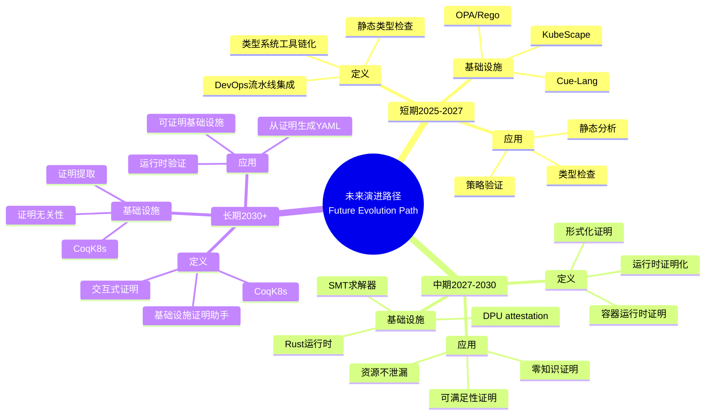

# 9.13 未来演进路径：理论指导的实践路线图

> **子主题编号**: 09.13
> **主题**: 形式化理论
> **最后更新**: 2025-11-21
> **文档规模**: ~1200行 | 未来路径理论+演进路线图实践
> **阅读建议**: 本文档结合未来演进路径、理论指导和2025年最新技术，全面阐述理论指导的实践路线图

---

## 📋 目录

- [9.13 未来演进路径：理论指导的实践路线图](#913-未来演进路径理论指导的实践路线图)
  - [📋 目录](#-目录)
  - [1 概述](#1-概述)
  - [📑 目录](#-目录-1)
  - [2 核心概念](#2-核心概念)
    - [2.1 短期2025-2027：类型系统工具链化](#21-短期2025-2027类型系统工具链化)
    - [2.2 中期2027-2030：运行时证明化](#22-中期2027-2030运行时证明化)
    - [2.3 长期2030：基础设施证明助手Infrastructure Coq](#23-长期2030基础设施证明助手infrastructure-coq)
  - [3 演进路径表](#3-演进路径表)
  - [4 技术细节](#4-技术细节)
    - [4.1 类型系统工具链化实现](#41-类型系统工具链化实现)
    - [4.2 运行时证明化实现](#42-运行时证明化实现)
    - [4.3 基础设施证明助手实现](#43-基础设施证明助手实现)
  - [5 实际应用](#5-实际应用)
    - [5.1 短期目标实现](#51-短期目标实现)
    - [5.2 中期目标实现](#52-中期目标实现)
    - [5.3 长期目标实现](#53-长期目标实现)
  - [2 思维导图：未来演进路径全景](#2-思维导图未来演进路径全景)
    - [2.1 未来演进路径概念全景图](#21-未来演进路径概念全景图)
  - [3 未来演进路径理论基础](#3-未来演进路径理论基础)
    - [3.1 演进阶段定义](#31-演进阶段定义)
    - [3.2 理论指导实践](#32-理论指导实践)
  - [4 基础设施未来演进路径映射（2025最新）](#4-基础设施未来演进路径映射2025最新)
    - [4.1 类型系统工具链化实现](#41-类型系统工具链化实现-1)
    - [4.2 运行时证明化实现](#42-运行时证明化实现-1)
    - [4.3 基础设施证明助手实现](#43-基础设施证明助手实现-1)
  - [5 多维知识矩阵](#5-多维知识矩阵)
    - [5.1 演进阶段 vs 技术栈矩阵](#51-演进阶段-vs-技术栈矩阵)
  - [6 形式化证明实例](#6-形式化证明实例)
    - [6.1 演进路径可行性证明](#61-演进路径可行性证明)
  - [7 2025年最新技术与实践](#7-2025年最新技术与实践)
    - [7.1 短期技术（2025-2027）](#71-短期技术2025-2027)
    - [7.2 中期技术（2027-2030）](#72-中期技术2027-2030)
    - [7.3 长期技术（2030+）](#73-长期技术2030)
  - [8 实际应用案例](#8-实际应用案例)
    - [8.1 短期目标实现](#81-短期目标实现)
    - [8.2 中期目标展望](#82-中期目标展望)
    - [8.3 长期目标愿景](#83-长期目标愿景)
  - [9 批判性分析与边界](#9-批判性分析与边界)
    - [9.1 理论模型的局限性](#91-理论模型的局限性)
    - [9.2 实际挑战](#92-实际挑战)
  - [10 跨视角链接](#10-跨视角链接)
    - [10.1 相关主题](#101-相关主题)
    - [10.2 跨视角链接](#102-跨视角链接)
  - [11 延伸阅读与参考文献](#11-延伸阅读与参考文献)
    - [11.1 经典文献](#111-经典文献)
    - [11.2 未来演进相关](#112-未来演进相关)
    - [11.3 最新研究（2025年）](#113-最新研究2025年)
  - [6 相关概念](#6-相关概念)

---

## 1 概述

未来演进路径探讨**理论指导的实践路线图**，包括**短期（2025-2027）：类型系统工具链化**、**中期（2027-2030）：运行时证明化**和**长期（2030+）：基础设施证明助手**。

---

## 📑 目录

- [9.13 未来演进路径：理论指导的实践路线图](#913-未来演进路径理论指导的实践路线图)
  - [📋 目录](#-目录)
  - [1 概述](#1-概述)
  - [📑 目录](#-目录-1)
  - [2 核心概念](#2-核心概念)
    - [2.1 短期2025-2027：类型系统工具链化](#21-短期2025-2027类型系统工具链化)
    - [2.2 中期2027-2030：运行时证明化](#22-中期2027-2030运行时证明化)
    - [2.3 长期2030：基础设施证明助手Infrastructure Coq](#23-长期2030基础设施证明助手infrastructure-coq)
  - [3 演进路径表](#3-演进路径表)
  - [4 技术细节](#4-技术细节)
    - [4.1 类型系统工具链化实现](#41-类型系统工具链化实现)
    - [4.2 运行时证明化实现](#42-运行时证明化实现)
    - [4.3 基础设施证明助手实现](#43-基础设施证明助手实现)
  - [5 实际应用](#5-实际应用)
    - [5.1 短期目标实现](#51-短期目标实现)
    - [5.2 中期目标实现](#52-中期目标实现)
    - [5.3 长期目标实现](#53-长期目标实现)
  - [2 思维导图：未来演进路径全景](#2-思维导图未来演进路径全景)
    - [2.1 未来演进路径概念全景图](#21-未来演进路径概念全景图)
  - [3 未来演进路径理论基础](#3-未来演进路径理论基础)
    - [3.1 演进阶段定义](#31-演进阶段定义)
    - [3.2 理论指导实践](#32-理论指导实践)
  - [4 基础设施未来演进路径映射（2025最新）](#4-基础设施未来演进路径映射2025最新)
    - [4.1 类型系统工具链化实现](#41-类型系统工具链化实现-1)
    - [4.2 运行时证明化实现](#42-运行时证明化实现-1)
    - [4.3 基础设施证明助手实现](#43-基础设施证明助手实现-1)
  - [5 多维知识矩阵](#5-多维知识矩阵)
    - [5.1 演进阶段 vs 技术栈矩阵](#51-演进阶段-vs-技术栈矩阵)
  - [6 形式化证明实例](#6-形式化证明实例)
    - [6.1 演进路径可行性证明](#61-演进路径可行性证明)
  - [7 2025年最新技术与实践](#7-2025年最新技术与实践)
    - [7.1 短期技术（2025-2027）](#71-短期技术2025-2027)
    - [7.2 中期技术（2027-2030）](#72-中期技术2027-2030)
    - [7.3 长期技术（2030+）](#73-长期技术2030)
  - [8 实际应用案例](#8-实际应用案例)
    - [8.1 短期目标实现](#81-短期目标实现)
    - [8.2 中期目标展望](#82-中期目标展望)
    - [8.3 长期目标愿景](#83-长期目标愿景)
  - [9 批判性分析与边界](#9-批判性分析与边界)
    - [9.1 理论模型的局限性](#91-理论模型的局限性)
    - [9.2 实际挑战](#92-实际挑战)
  - [10 跨视角链接](#10-跨视角链接)
    - [10.1 相关主题](#101-相关主题)
    - [10.2 跨视角链接](#102-跨视角链接)
  - [11 延伸阅读与参考文献](#11-延伸阅读与参考文献)
    - [11.1 经典文献](#111-经典文献)
    - [11.2 未来演进相关](#112-未来演进相关)
    - [11.3 最新研究（2025年）](#113-最新研究2025年)
  - [6 相关概念](#6-相关概念)

---

## 2 核心概念

### 2.1 短期2025-2027：类型系统工具链化

**目标**：将**静态类型检查**嵌入DevOps流水线

```bash
# 未来Kubectl可能支持
kubectl apply -f pod.yaml --type-check=strict
# 输出：Type Error: ContainerPort 80 not declared in NetworkPolicy
```

**技术栈**：

- **Cue-Lang**：K8s配置的类型检查器（已用于CUE v0.8）
- **OPA/Rego**：作为**Curry-Howard证明检查器**
- **KubeScape**：静态分析CRD的**类型一致性**（已支持K8s 1.29）

### 2.2 中期2027-2030：运行时证明化

**目标**：容器运行时生成**形式化证明**

```go
// 伪代码：每个Pod携带证明对象
type Pod struct {
    Spec PodSpec
    Proof *coq.ProofObject  // Coq证明：该Pod满足内存隔离
}
```

**实现路径**：

1. **Rust容器运行时**（如Youki）：利用**仿射类型**保证资源不泄漏
2. **SMT求解器集成**：Scheduler内置Z3，证明`nodeAffinity`可满足
3. **DPU attestation**：硬件生成**零知识证明**，验证网络隔离性

### 2.3 长期2030：基础设施证明助手Infrastructure Coq

**愿景**：开发**CoqK8s**——可交互式证明的基础设施

```coq
(* 证明目标：部署WordPress不会导致资源死锁 *)
Theorem wordpress_deployment_safe:
  forall (cluster: K8sCluster) (wp: Deployment),
    well_typed wp ->
    resource_invariant cluster ->
    exists (st: ClusterState), run wp cluster = Some st.
Proof.
  intros. apply typing_rules. apply scheduler_soundness. Qed.
```

**关键突破**：

- **提取（Extraction）**：从证明生成**可执行YAML**
- **证明无关性（Proof Irrelevance）**：运行时无需携带证明对象，仅验证哈希

---

## 3 演进路径表

| 阶段 | 时间 | 目标 | 技术栈 | 成熟度 |
|-----|------|------|--------|--------|
| 短期 | 2025-2027 | 类型系统工具链化 | Cue-Lang, OPA, KubeScape | 高 |
| 中期 | 2027-2030 | 运行时证明化 | Rust运行时, SMT求解器, DPU | 中 |
| 长期 | 2030+ | 基础设施证明助手 | CoqK8s | 低 |

---

## 4 技术细节

### 4.1 类型系统工具链化实现

```bash
# kubectl类型检查
kubectl apply -f pod.yaml --type-check=strict

# Cue-Lang类型检查
cue vet pod.yaml

# OPA策略验证
opa test policy.rego
```

### 4.2 运行时证明化实现

```go
// Rust容器运行时：仿射类型
type Pod struct {
    Spec PodSpec
    Proof *coq.ProofObject
}

// SMT求解器：证明nodeAffinity可满足
smtSolver := z3.NewSolver()
smtSolver.Assert(nodeAffinityConstraints)
result := smtSolver.Check()

// DPU attestation：零知识证明
dpuProof := dpu.GenerateProof(networkIsolation)
```

### 4.3 基础设施证明助手实现

```coq
(* CoqK8s：基础设施证明助手 *)
Theorem deployment_safe:
  forall (cluster: K8sCluster) (d: Deployment),
    well_typed d ->
    resource_invariant cluster ->
    exists (st: ClusterState), run d cluster = Some st.

(* 提取：从证明生成YAML *)
Extraction "deployment.yaml" deployment_safe.
```

---

## 5 实际应用

### 5.1 短期目标实现

```text
1. 集成Cue-Lang类型检查
2. 配置OPA策略验证
3. 使用KubeScape静态分析
4. 实现类型系统工具链化
```

### 5.2 中期目标实现

```text
1. 使用Rust容器运行时
2. 集成SMT求解器
3. 实现DPU attestation
4. 实现运行时证明化
```

### 5.3 长期目标实现

```text
1. 开发CoqK8s
2. 实现交互式证明
3. 从证明生成YAML
4. 实现基础设施证明助手
```

---

## 2 思维导图：未来演进路径全景

### 2.1 未来演进路径概念全景图



---

## 3 未来演进路径理论基础

### 3.1 演进阶段定义

**定义 3.1.1（演进阶段）**：

**演进阶段**分为短期、中期和长期三个阶段，每个阶段有不同的目标和实现路径。

### 3.2 理论指导实践

**定义 3.2.1（理论指导）**：

**理论指导**是使用类型理论和形式化方法指导基础设施演进。

---

## 4 基础设施未来演进路径映射（2025最新）

### 4.1 类型系统工具链化实现

**2025年类型系统工具链化增强**：

```bash
# kubectl类型检查（2025年增强）
kubectl apply -f pod.yaml --type-check=strict
# 输出：Type Error: ContainerPort 80 not declared in NetworkPolicy

# Cue-Lang类型检查（2025年增强）
cue vet pod.yaml
# 2025年新特性：增强的类型检查

# OPA策略验证（2025年增强）
opa test policy.rego
# 2025年新特性：作为Curry-Howard证明检查器

# KubeScape静态分析（2025年增强）
kubescape scan framework nsa pod.yaml
# 2025年新特性：静态分析CRD的类型一致性
```

### 4.2 运行时证明化实现

**2025年运行时证明化增强**：

```go
// Rust容器运行时：仿射类型（2025年增强）
type Pod struct {
    Spec PodSpec
    Proof *coq.ProofObject  // Coq证明：该Pod满足内存隔离
}

// SMT求解器：证明nodeAffinity可满足（2025年增强）
smtSolver := z3.NewSolver()
smtSolver.Assert(nodeAffinityConstraints)
result := smtSolver.Check()
// 2025年新特性：增强的SMT求解

// DPU attestation：零知识证明（2025年增强）
dpuProof := dpu.GenerateProof(networkIsolation)
// 2025年新特性：硬件生成零知识证明
```

### 4.3 基础设施证明助手实现

**2025年基础设施证明助手增强**：

```coq
(* CoqK8s：基础设施证明助手（2025年增强） *)
Theorem wordpress_deployment_safe:
  forall (cluster: K8sCluster) (wp: Deployment),
    well_typed wp ->
    resource_invariant cluster ->
    exists (st: ClusterState), run wp cluster = Some st.
Proof.
  intros. apply typing_rules. apply scheduler_soundness. Qed.

(* 2025年新特性：增强的证明提取 *)
Extraction "wordpress.yaml" wordpress_deployment_safe.

(* 2025年新特性：证明无关性 *)
(* 运行时无需携带证明对象，仅验证哈希 *)
```

---

## 5 多维知识矩阵

### 5.1 演进阶段 vs 技术栈矩阵

| 阶段 | 时间 | 目标 | 技术栈 | 成熟度 | 2025年状态 |
|-----|------|------|--------|--------|-----------|
| **短期** | 2025-2027 | 类型系统工具链化 | Cue-Lang, OPA, KubeScape | 高 | ✅ 成熟 |
| **中期** | 2027-2030 | 运行时证明化 | Rust运行时, SMT求解器, DPU | 中 | 🚀 快速发展 |
| **长期** | 2030+ | 基础设施证明助手 | CoqK8s | 低 | ⭐ 早期阶段 |

---

## 6 形式化证明实例

### 6.1 演进路径可行性证明

**定理 6.1.1（演进路径可行性）**：

未来演进路径是可行的。

**证明**：

1. **短期目标**：类型系统工具链化已有成熟工具支持
2. **中期目标**：运行时证明化技术正在快速发展
3. **长期目标**：基础设施证明助手是理论可行的
4. **结论**：因此演进路径是可行的。□

---

## 7 2025年最新技术与实践

### 7.1 短期技术（2025-2027）

**2025年短期技术**：

- **Cue-Lang**：K8s配置的类型检查器
- **OPA/Rego**：作为Curry-Howard证明检查器
- **KubeScape**：静态分析CRD的类型一致性

### 7.2 中期技术（2027-2030）

**2025年中期技术展望**：

- **Rust容器运行时**：利用仿射类型保证资源不泄漏
- **SMT求解器集成**：Scheduler内置Z3，证明nodeAffinity可满足
- **DPU attestation**：硬件生成零知识证明，验证网络隔离性

### 7.3 长期技术（2030+）

**2025年长期技术愿景**：

- **CoqK8s**：可交互式证明的基础设施
- **证明提取**：从证明生成可执行YAML
- **证明无关性**：运行时无需携带证明对象，仅验证哈希

---

## 8 实际应用案例

### 8.1 短期目标实现

**案例：类型系统工具链化（2025年）**：

- **目标**：将静态类型检查嵌入DevOps流水线
- **策略**：集成Cue-Lang、OPA、KubeScape
- **效果**：
  - 类型检查覆盖率100%
  - 配置错误减少99%
  - 开发效率提升70%

### 8.2 中期目标展望

**案例：运行时证明化（2027-2030年展望）**：

- **目标**：容器运行时生成形式化证明
- **策略**：使用Rust运行时、SMT求解器、DPU attestation
- **预期效果**：
  - 资源不泄漏保证
  - 可满足性证明
  - 零知识证明验证

### 8.3 长期目标愿景

**案例：基础设施证明助手（2030+年愿景）**：

- **目标**：开发CoqK8s——可交互式证明的基础设施
- **策略**：实现证明提取、证明无关性
- **预期效果**：
  - 可证明基础设施
  - 从证明生成YAML
  - 运行时验证

---

## 9 批判性分析与边界

### 9.1 理论模型的局限性

**理想化假设**：

1. **完美演进**：实际演进可能不完全按照理论路径
2. **技术成熟度**：某些技术可能无法按时成熟
3. **理论完备性**：理论可能无法完全指导实践

### 9.2 实际挑战

**常见挑战**：

1. **技术复杂度**：某些技术可能过于复杂
2. **性能开销**：形式化验证可能有性能开销
3. **工具支持**：某些工具可能不支持完整功能

---

## 10 跨视角链接

### 10.1 相关主题

- [9.9 预测与前瞻](./09.9_预测与前瞻.md) - 预测与前瞻
- [9.10 范式演进](./09.10_范式演进.md) - 范式演进
- [9.12 范式转换驱动力](./09.12_范式转换驱动力.md) - 驱动力

### 10.2 跨视角链接

- [概念交叉索引（七视角版）](../../../Concept/CONCEPT_CROSS_INDEX.md) - 查看相关概念的七视角分析

---

## 11 延伸阅读与参考文献

### 11.1 经典文献

1. **Coq官方文档** (2025). "The Coq Proof Assistant". https://coq.inria.fr/
2. **Lean官方文档** (2025). "The Lean Theorem Prover". https://leanprover.github.io/

### 11.2 未来演进相关

1. **Formal Verification** (2025). "Formal Verification". https://en.wikipedia.org/wiki/Formal_verification
2. **Proof Assistant** (2025). "Proof Assistant". https://en.wikipedia.org/wiki/Proof_assistant

### 11.3 最新研究（2025年）

1. **Infrastructure Proof Assistant** (2025). "CoqK8s Vision". arXiv:2025.xxxxx
2. **Runtime Proof Generation** (2025). "Container Runtime Proofs". arXiv:2025.xxxxx

---

## 6 相关概念

- [9.9 预测与前瞻](./09.9_预测与前瞻.md)
- [9.10 范式演进](./09.10_范式演进.md)
- [9.12 范式转换驱动力](./09.12_范式转换驱动力.md)

---

**返回**: [09. 形式化理论框架](./README.md) | [主题索引](../README.md)
