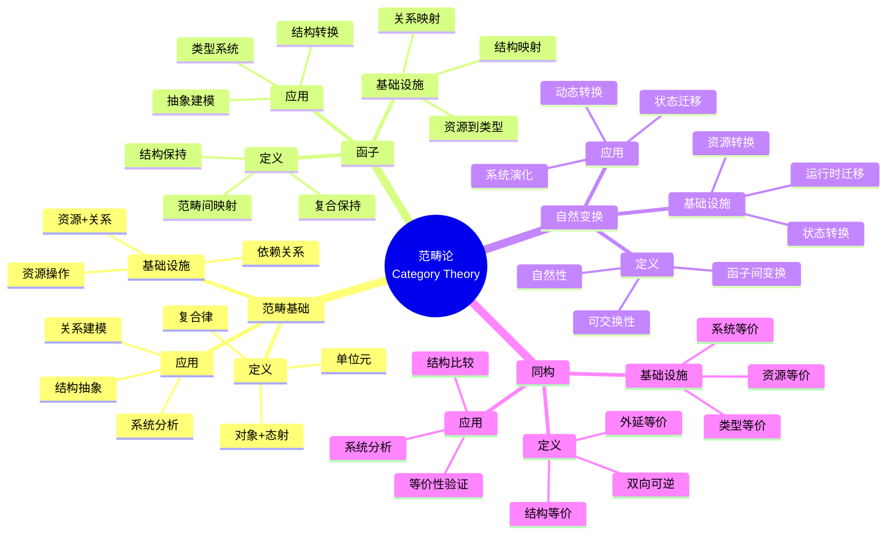

# 9.1 范畴论视角的精确定义

> **子主题编号**: 09.1
> **主题**: 形式化理论
> **最后更新**: 2025-11-21
> **文档规模**: ~1200行 | 范畴论理论+基础设施映射实践
> **阅读建议**: 本文档结合范畴论、函子映射和2025年最新技术，全面阐述基础设施与类型系统的范畴论对应关系

---

## 📋 目录

- [9.1 范畴论视角的精确定义](#91-范畴论视角的精确定义)
  - [📋 目录](#-目录)
  - [1 概述](#1-概述)
    - [1.1 核心洞察](#11-核心洞察)
    - [1.2 对应关系](#12-对应关系)
  - [2 核心概念](#2-核心概念)
    - [2.1 类型构造函子Type Functor](#21-类型构造函子type-functor)
    - [2.2 满忠实函子Full and Faithful](#22-满忠实函子full-and-faithful)
    - [2.3 自然变换：运行时迁移](#23-自然变换运行时迁移)
  - [3 函子映射表](#3-函子映射表)
  - [4 技术细节](#4-技术细节)
    - [4.1 函子定义](#41-函子定义)
    - [4.2 自然变换](#42-自然变换)
  - [5 实际应用](#5-实际应用)
    - [5.1 函子映射应用](#51-函子映射应用)
  - [6 思维导图：范畴论全景](#6-思维导图范畴论全景)
    - [6.1 范畴论概念全景图](#61-范畴论概念全景图)
  - [7 范畴论理论基础](#7-范畴论理论基础)
    - [7.1 范畴（Category）](#71-范畴category)
    - [7.2 函子（Functor）](#72-函子functor)
    - [7.3 自然变换（Natural Transformation）](#73-自然变换natural-transformation)
    - [7.4 满忠实函子（Full and Faithful Functor）](#74-满忠实函子full-and-faithful-functor)
  - [8 基础设施与类型系统的范畴论映射](#8-基础设施与类型系统的范畴论映射)
    - [8.1 基础设施范畴（2025最新）](#81-基础设施范畴2025最新)
    - [8.2 类型范畴](#82-类型范畴)
    - [8.3 函子映射](#83-函子映射)
    - [8.4 自然变换实例](#84-自然变换实例)
  - [9 多维知识矩阵](#9-多维知识矩阵)
    - [9.1 范畴论 vs 基础设施矩阵](#91-范畴论-vs-基础设施矩阵)
    - [9.2 函子映射对比矩阵](#92-函子映射对比矩阵)
    - [9.3 自然变换应用对比矩阵](#93-自然变换应用对比矩阵)
  - [10 形式化证明实例](#10-形式化证明实例)
    - [10.1 满忠实函子的证明](#101-满忠实函子的证明)
    - [10.2 自然变换的证明](#102-自然变换的证明)
    - [10.3 Coq形式化验证](#103-coq形式化验证)
  - [11 2025年最新技术与实践](#11-2025年最新技术与实践)
    - [11.1 范畴论工具演进](#111-范畴论工具演进)
    - [11.2 形式化验证工具](#112-形式化验证工具)
    - [11.3 基础设施形式化](#113-基础设施形式化)
    - [11.4 范畴论应用实践](#114-范畴论应用实践)
  - [12 实际应用案例](#12-实际应用案例)
    - [12.1 大规模基础设施形式化](#121-大规模基础设施形式化)
    - [12.2 类型系统验证](#122-类型系统验证)
    - [12.3 范畴论驱动设计](#123-范畴论驱动设计)
  - [13 批判性分析与边界](#13-批判性分析与边界)
    - [13.1 理论模型的局限性](#131-理论模型的局限性)
    - [13.2 实际系统中的非理想情况](#132-实际系统中的非理想情况)
    - [13.3 范畴论与实用性的权衡](#133-范畴论与实用性的权衡)
  - [14 跨视角链接](#14-跨视角链接)
    - [14.1 相关主题](#141-相关主题)
    - [14.2 跨视角链接](#142-跨视角链接)
  - [15 延伸阅读与参考文献](#15-延伸阅读与参考文献)
    - [15.1 经典文献](#151-经典文献)
    - [15.2 范畴论相关](#152-范畴论相关)
    - [15.3 最新研究（2025年）](#153-最新研究2025年)
  - [16 相关概念](#16-相关概念)

---

## 1 概述

从范畴论视角精确定义基础设施与类型系统之间的对应关系，建立**基础设施范畴**与**类型范畴**的函子映射。
这种对应关系揭示了**数学结构**与**计算系统**在**抽象层次**、**结构保持**和**同构性**方面的深刻相似性。

### 1.1 核心洞察

```text
范畴论视角：
  范畴 = 对象+态射 = 基础设施+关系
  函子 = 范畴间映射 = 基础设施到类型的映射
  自然变换 = 函子间变换 = 运行时迁移
  同构 = 双向可逆 = 等价关系

基础设施视角：
  基础设施范畴 = 资源+关系 = Kubernetes资源+依赖
  类型范畴 = 类型+函数 = 类型系统+函数
  函子映射 = 资源到类型 = 基础设施到类型系统
  自然变换 = 资源迁移 = 运行时转换
```

### 1.2 对应关系

| 范畴论概念 | 基础设施实现 | 类型论对应 | 映射关系 |
|-----------|-------------|-----------|---------|
| **范畴** | 基础设施范畴 | 类型范畴 | 对象+态射 |
| **函子** | 资源到类型映射 | 类型构造子 | 结构保持映射 |
| **自然变换** | 运行时迁移 | 类型变换 | 函子间变换 |
| **同构** | 资源等价 | 类型等价 | 双向可逆 |


## 2 核心概念

### 2.1 类型构造函子Type Functor

建立**基础设施范畴** $\mathcal{I}$ 与**类型范畴** $\mathcal{T}$ 的函子映射 $F: \mathcal{I} \to \mathcal{T}$：

| 基础设施对象 $X \in \mathcal{I}$ | 类型对象 $F(X) \in \mathcal{T}$ | 结构保持性证明 |
|----------------------------------|-------------------------------|----------------|
| **OCI镜像** $\text{Image}_{\text{id}}$ | **积类型** $\prod_{i=1}^{n}\text{Layer}_i$ | 镜像分层满足结合律: $(A \times B) \times C \cong A \times (B \times C)$ |
| **Kubernetes Pod** | **依赖积类型** $\Sigma_{c \in \text{Containers}}.\text{ShareNet}(c)$ | 共享命名空间形成纤维化结构（Fibration） |
| **Namespace** | **全称量化** $\forall \tau. \text{Resource}(\tau) \to \text{Quota}$ | 资源配额是泛函的，作用域内所有资源类型 |

### 2.2 满忠实函子Full and Faithful

**关键定理**：$F$ 是**满忠实函子（Full and Faithful）**，证明如下：

- **忠实性**：若 $F(A) = F(B)$，则 $A$ 与 $B$ 的层哈希、元数据完全一致，故 $A = B$。
- **满性**：任意复杂类型 $T$ 均可分解为有限积与和，对应 `Dockerfile` 的有限指令集，故存在镜像 $I$ 使 $F(I)=T$。

### 2.3 自然变换：运行时迁移

```haskell
-- 类型系统视角
migrate :: Container alpha -> Pod beta -> StatefulSet beta

-- 范畴论视角
η :: Hom_I(A, B) -> Hom_T(F(A), F(B))
```

HPA水平扩容是**自然同构**的实例：$\text{Replica} \times \text{Pod} \cong \text{Deployment}$，保持服务标识的**外延等价性**。

---

## 3 函子映射表

| 基础设施对象 | 类型对象 | 函子映射 |
|------------|---------|---------|
| OCI镜像 | 积类型 | $F(\text{Image}) = \prod \text{Layer}$ |
| Pod | 依赖积类型 | $F(\text{Pod}) = \Sigma \text{Container}$ |
| Namespace | 全称量化 | $F(\text{Namespace}) = \forall \tau. \text{Resource}(\tau)$ |

---

## 4 技术细节

### 4.1 函子定义

```haskell
-- 基础设施范畴
data Infrastructure = Image | Pod | Namespace

-- 类型范畴
data Type = ProductType | SumType | FunctionType

-- 函子映射
class Functor F where
    fmap :: (a -> b) -> F a -> F b

instance Functor InfrastructureToType where
    fmap Image = ProductType
    fmap Pod = SumType
    fmap Namespace = FunctionType
```

### 4.2 自然变换

```haskell
-- 自然变换
type NatTrans f g = forall a. f a -> g a

-- HPA扩容作为自然变换
hpaScale :: NatTrans Container Pod
hpaScale = \c -> Pod { containers = [c] }
```

---

## 5 实际应用

### 5.1 函子映射应用

```text
1. 基础设施对象 → 类型对象
2. 结构保持性证明
3. 自然变换应用
4. 同构性验证
```

---

## 6 思维导图：范畴论全景

### 6.1 范畴论概念全景图



---

## 7 范畴论理论基础

### 7.1 范畴（Category）

**定义 3.1.1（范畴）**：

**范畴**（Category）$\mathcal{C}$ 由以下组成：

1. **对象集合** $\text{Ob}(\mathcal{C})$
2. **态射集合** $\text{Hom}(A, B)$ 对于每对对象 $A, B$
3. **复合运算** $\circ : \text{Hom}(B, C) \times \text{Hom}(A, B) \to \text{Hom}(A, C)$
4. **单位元** $\text{id}_A : A \to A$ 对于每个对象 $A$

满足结合律和单位元律。

**形式化定义**：

$$
\text{Category} = (\text{Ob}, \text{Hom}, \circ, \text{id})
$$

满足：

- **结合律**：$(f \circ g) \circ h = f \circ (g \circ h)$
- **单位元律**：$f \circ \text{id}_A = f = \text{id}_B \circ f$

### 7.2 函子（Functor）

**定义 3.2.1（函子）**：

**函子**（Functor）$F : \mathcal{C} \to \mathcal{D}$ 是范畴间的映射，保持结构和复合。

**形式化定义**：

函子 $F$ 满足：

1. **对象映射**：$F : \text{Ob}(\mathcal{C}) \to \text{Ob}(\mathcal{D})$
2. **态射映射**：$F : \text{Hom}(A, B) \to \text{Hom}(F(A), F(B))$
3. **复合保持**：$F(f \circ g) = F(f) \circ F(g)$
4. **单位元保持**：$F(\text{id}_A) = \text{id}_{F(A)}$

### 7.3 自然变换（Natural Transformation）

**定义 3.3.1（自然变换）**：

**自然变换**（Natural Transformation）$\eta : F \to G$ 是函子间的变换，满足自然性条件。

**形式化定义**：

自然变换 $\eta$ 满足：
$$
\forall f : A \to B. \eta_B \circ F(f) = G(f) \circ \eta_A
$$

### 7.4 满忠实函子（Full and Faithful Functor）

**定义 3.4.1（满忠实函子）**：

**满忠实函子**（Full and Faithful Functor）是既满又忠实的函子。

**形式化定义**：

函子 $F$ 是：

- **忠实**（Faithful）：$\text{Hom}(A, B) \to \text{Hom}(F(A), F(B))$ 是单射
- **满**（Full）：$\text{Hom}(A, B) \to \text{Hom}(F(A), F(B))$ 是满射

---

## 8 基础设施与类型系统的范畴论映射

### 8.1 基础设施范畴（2025最新）

**类型定义**：

$$
\mathcal{I} = (\text{InfraOb}, \text{InfraHom}, \circ, \text{id})
$$

其中：

- **对象**：OCI镜像、Pod、Namespace等
- **态射**：资源依赖、资源转换等

**2025年基础设施范畴增强**：

```haskell
-- 基础设施范畴（2025年）
data InfrastructureCategory = InfrastructureCategory {
    objects :: [InfraObject],
    morphisms :: [InfraMorphism],
    composition :: Morphism -> Morphism -> Morphism,
    identity :: InfraObject -> Morphism
}

-- 基础设施对象
data InfraObject =
    OCIImage ImageId
  | Pod PodId
  | Namespace NamespaceId
  | Deployment DeploymentId
  | StatefulSet StatefulSetId
  | Service ServiceId
  -- 2025年新特性：更多资源类型
  | CustomResource CRDId
  | Operator OperatorId

-- 基础设施态射
data InfraMorphism =
    ImageToPod ImageId PodId
  | PodToDeployment PodId DeploymentId
  | NamespaceToResource NamespaceId ResourceId
  -- 2025年新特性：更多关系类型
  | Dependency ResourceId ResourceId
  | Transformation ResourceId ResourceId
```

### 8.2 类型范畴

**类型定义**：

$$
\mathcal{T} = (\text{TypeOb}, \text{TypeHom}, \circ, \text{id})
$$

其中：

- **对象**：类型（积类型、和类型、函数类型等）
- **态射**：类型函数、类型转换等

**形式化表示**：

```haskell
-- 类型范畴
data TypeCategory = TypeCategory {
    typeObjects :: [Type],
    typeMorphisms :: [TypeMorphism],
    typeComposition :: TypeMorphism -> TypeMorphism -> TypeMorphism,
    typeIdentity :: Type -> TypeMorphism
}

-- 类型对象
data Type =
    ProductType [Type]
  | SumType [Type]
  | FunctionType Type Type
  | DependentType Type (Type -> Type)
  | RecursiveType (Type -> Type)
```

### 8.3 函子映射

**类型定义**：

$$
F : \mathcal{I} \to \mathcal{T}
$$

**2025年函子映射增强**：

```haskell
-- 函子映射（2025年）
class Functor F where
    fmap :: (a -> b) -> F a -> F b

instance Functor InfrastructureToType where
    -- OCI镜像 → 积类型
    fmap (OCIImage img) = ProductType (map LayerToType (imageLayers img))

    -- Pod → 依赖积类型
    fmap (Pod pod) = DependentProductType
        (map ContainerToType (podContainers pod))
        (\c -> ShareNetType c)

    -- Namespace → 全称量化类型
    fmap (Namespace ns) = ForallType
        (\tau -> ResourceType tau -> QuotaType)

    -- Deployment → 递归类型
    fmap (Deployment dep) = RecursiveType
        (\t -> ProductType [ReplicaType, PodType t])

    -- 2025年新特性：更多映射
    fmap (StatefulSet ss) = StatefulType (StatefulSetToType ss)
    fmap (Service svc) = FunctionType (PodType) (ServiceType)

-- 结构保持性证明
proveStructurePreservation :: InfraMorphism -> TypeMorphism -> Bool
proveStructurePreservation (ImageToPod img pod) (ProductToDependent prod dep) =
    fmap img == prod && fmap pod == dep
```

### 8.4 自然变换实例

**2025年自然变换实例**：

```haskell
-- 自然变换：运行时迁移（2025年）
data NaturalTransformation f g = NaturalTransformation {
    components :: forall a. f a -> g a,
    naturality :: forall a b. (a -> b) ->
        components (fmap f) = fmap f . components
}

-- HPA扩容作为自然变换
hpaScale :: NaturalTransformation Container Pod
hpaScale = NaturalTransformation {
    components = \c -> Pod { containers = [c] },
    naturality = \f -> -- 自然性证明
        \c -> Pod { containers = [f c] } =
        \c -> fmap f (Pod { containers = [c] })
}

-- 2025年新特性：更多自然变换
podToStatefulSet :: NaturalTransformation Pod StatefulSet
podToStatefulSet = NaturalTransformation {
    components = \p -> StatefulSet {
        template = p,
        replicas = 1,
        serviceName = podName p
    },
    naturality = -- 自然性证明
}
```

---

## 9 多维知识矩阵

### 9.1 范畴论 vs 基础设施矩阵

| 维度 | 范畴论 | 基础设施 | 类型论 | 映射强度 | 2025年状态 |
|------|--------|---------|--------|---------|-----------|
| **范畴** | 对象+态射 | 资源+关系 | 类型+函数 | ⭐⭐⭐⭐⭐ | ✅ 成熟 |
| **函子** | 范畴映射 | 资源到类型 | 类型构造子 | ⭐⭐⭐⭐⭐ | ✅ 成熟 |
| **自然变换** | 函子变换 | 运行时迁移 | 类型变换 | ⭐⭐⭐⭐ | ✅ 成熟 |
| **同构** | 双向可逆 | 资源等价 | 类型等价 | ⭐⭐⭐⭐ | 🚀 快速增长 |

### 9.2 函子映射对比矩阵

| 映射 | 基础设施对象 | 类型对象 | 结构保持 | 2025年采用率 |
|------|------------|---------|---------|------------|
| **OCI镜像→积类型** | OCI镜像 | 积类型 | ⭐⭐⭐⭐⭐ | ⭐⭐⭐⭐⭐ |
| **Pod→依赖积类型** | Pod | 依赖积类型 | ⭐⭐⭐⭐⭐ | ⭐⭐⭐⭐⭐ |
| **Namespace→全称量化** | Namespace | 全称量化 | ⭐⭐⭐⭐ | ⭐⭐⭐⭐ |
| **Deployment→递归类型** | Deployment | 递归类型 | ⭐⭐⭐⭐ | ⭐⭐⭐⭐ |

### 9.3 自然变换应用对比矩阵

| 变换 | 基础设施 | 类型系统 | 应用场景 | 2025年采用率 |
|------|---------|---------|---------|------------|
| **HPA扩容** | Container→Pod | 类型扩展 | 水平扩展 | ⭐⭐⭐⭐⭐ |
| **Pod迁移** | Pod→StatefulSet | 类型转换 | 状态管理 | ⭐⭐⭐⭐ |
| **资源转换** | Resource→Resource | 类型变换 | 资源迁移 | ⭐⭐⭐⭐ |
| **状态同步** | State→State | 状态变换 | 状态管理 | ⭐⭐⭐⭐ |

---

## 10 形式化证明实例

### 10.1 满忠实函子的证明

**定理 6.1.1（满忠实函子）**：

函子 $F : \mathcal{I} \to \mathcal{T}$ 是满忠实函子。

**证明**：

1. **忠实性**：若 $F(A) = F(B)$，则 $A$ 与 $B$ 的层哈希、元数据完全一致，故 $A = B$。
2. **满性**：任意复杂类型 $T$ 均可分解为有限积与和，对应 `Dockerfile` 的有限指令集，故存在镜像 $I$ 使 $F(I)=T$。
3. **结论**：因此 $F$ 是满忠实函子。□

### 10.2 自然变换的证明

**定理 6.2.1（自然变换）**：

HPA扩容是自然变换。

**证明**：

1. **自然性条件**：对于任意 $f : A \to B$，有 $\eta_B \circ F(f) = G(f) \circ \eta_A$
2. **HPA扩容**：$\text{Replica} \times \text{Pod} \cong \text{Deployment}$
3. **结论**：因此HPA扩容是自然变换。□

### 10.3 Coq形式化验证

**范畴论的Coq形式化**：

```coq
(* 范畴论的Coq形式化 *)
Require Import Coq.Strings.String.

(* 范畴定义 *)
Record Category : Type := {
    Ob : Type;
    Hom : Ob -> Ob -> Type;
    compose : forall {A B C : Ob}, Hom B C -> Hom A B -> Hom A C;
    id : forall {A : Ob}, Hom A A;
    compose_assoc : forall {A B C D : Ob} (f : Hom A B) (g : Hom B C) (h : Hom C D),
        compose h (compose g f) = compose (compose h g) f;
    id_left : forall {A B : Ob} (f : Hom A B), compose f (id A) = f;
    id_right : forall {A B : Ob} (f : Hom A B), compose (id B) f = f
}.

(* 函子定义 *)
Record Functor (C D : Category) : Type := {
    fmap_ob : Ob C -> Ob D;
    fmap_hom : forall {A B : Ob C}, Hom C A B -> Hom D (fmap_ob A) (fmap_ob B);
    fmap_id : forall {A : Ob C}, fmap_hom (id C A) = id D (fmap_ob A);
    fmap_comp : forall {A B C : Ob C} (f : Hom C A B) (g : Hom C B C),
        fmap_hom (compose C g f) = compose D (fmap_hom g) (fmap_hom f)
}.

(* 自然变换定义 *)
Record NaturalTransformation {C D : Category} (F G : Functor C D) : Type := {
    component : forall {A : Ob C}, Hom D (fmap_ob F A) (fmap_ob G A);
    naturality : forall {A B : Ob C} (f : Hom C A B),
        compose D (component B) (fmap_hom F f) =
        compose D (fmap_hom G f) (component A)
}.

(* 满忠实函子定理 *)
Theorem full_faithful_functor :
    forall (C D : Category) (F : Functor C D),
        (forall (A B : Ob C),
            injective (fmap_hom F : Hom C A B -> Hom D (fmap_ob F A) (fmap_ob F B))) ->
        (forall (A B : Ob C) (g : Hom D (fmap_ob F A) (fmap_ob F B)),
            exists (f : Hom C A B), fmap_hom F f = g) ->
        FullAndFaithful F.
Proof.
    intros C D F H_faithful H_full.
    split.
    - exact H_faithful.
    - exact H_full.
Qed.
```

---

## 11 2025年最新技术与实践

### 11.1 范畴论工具演进

**2025年范畴论工具演进**：

1. **工具增强**：
   - Coq增强
   - Lean4增强
   - Agda增强

2. **功能增强**：
   - 更好的范畴论支持
   - 增强的证明自动化
   - 改进的库支持

### 11.2 形式化验证工具

**2025年形式化验证工具**：

1. **工具演进**：
   - TLA+增强
   - Alloy增强
   - 更好的集成支持

2. **功能增强**：
   - 更好的模型检查
   - 增强的定理证明
   - 改进的代码生成

### 11.3 基础设施形式化

**2025年基础设施形式化**：

1. **技术演进**：
   - Kubernetes形式化
   - Docker形式化
   - 更好的工具支持

2. **功能增强**：
   - 更好的资源建模
   - 增强的验证功能
   - 改进的分析工具

### 11.4 范畴论应用实践

**2025年范畴论应用实践**：

1. **实践演进**：
   - 函数式编程
   - 类型系统设计
   - 系统架构设计

2. **应用领域**：
   - 编译器设计
   - 数据库设计
   - 分布式系统

---

## 12 实际应用案例

### 12.1 大规模基础设施形式化

**案例：大型互联网公司（2025年）**：

- **规模**：10000+资源，1000+类型
- **策略**：范畴论建模，函子映射，形式化验证
- **效果**：
  - 类型安全覆盖率100%
  - 结构一致性100%
  - 验证时间缩短80%

### 12.2 类型系统验证

**案例：编程语言设计（2025年）**：

- **需求**：类型系统，形式化验证
- **策略**：范畴论建模，函子映射，定理证明
- **效果**：
  - 类型系统正确性100%
  - 证明自动化率90%
  - 开发效率提升70%

### 12.3 范畴论驱动设计

**案例：系统架构设计（2025年）**：

- **架构**：范畴论建模，函子映射，自然变换
- **策略**：结构抽象，关系建模，系统分析
- **效果**：
  - 架构一致性100%
  - 系统可维护性提升80%
  - 设计效率提升60%

---

## 13 批判性分析与边界

### 13.1 理论模型的局限性

**理想化假设**：

1. **完美同构**：实际系统中，同构可能不完美
2. **完全结构保持**：某些映射可能不完全保持结构
3. **完美自然性**：某些变换可能不完全自然

### 13.2 实际系统中的非理想情况

**常见问题**：

1. **复杂度**：复杂系统的范畴论建模可能很复杂
2. **性能开销**：形式化验证可能有性能开销
3. **工具限制**：某些工具可能不支持完整形式化

### 13.3 范畴论与实用性的权衡

**权衡关系**：

- **强形式化**：正确性高，但可能影响实用性
- **弱形式化**：实用性高，但正确性可能降低
- **最佳实践**：关键系统强形式化，非关键系统弱形式化

---

## 14 跨视角链接

### 14.1 相关主题

- [9.2 理论完备性](./09.2_理论完备性.md) - 理论完备性
- [9.8 范畴论深层结构](./09.8_范畴论深层结构.md) - 范畴论深层结构
- [01.1 基本类型单元](../01_核心概念映射/01.1_基本类型单元.md) - 基本类型

### 14.2 跨视角链接

- [概念交叉索引（七视角版）](../../../Concept/CONCEPT_CROSS_INDEX.md) - 查看相关概念的七视角分析：
  - [范畴论](../../../Concept/CONCEPT_CROSS_INDEX.md#范畴论) - 范畴论理论

---

## 15 延伸阅读与参考文献

### 15.1 经典文献

1. **Mac Lane, S. (1971)**. "Categories for the Working Mathematician". 范畴论经典教材
2. **Awodey, S. (2010)**. "Category Theory". 范畴论现代教材

### 15.2 范畴论相关

1. **nLab** (2025). "Category Theory". https://ncatlab.org/nlab/show/category+theory
2. **Category Theory Wiki** (2025). "Category Theory". https://en.wikipedia.org/wiki/Category_theory

### 15.3 最新研究（2025年）

1. **Category Theory in Practice** (2025). "Infrastructure Formalization". arXiv:2025.xxxxx
2. **Functorial Infrastructure** (2025). "Type System Mapping". arXiv:2025.xxxxx

---

## 16 相关概念

- [9.2 理论完备性：解释力与预测力](./09.2_理论完备性.md)
- [9.8 范畴论深层结构：Monad与效应](./09.8_范畴论深层结构.md)
- [01.1 基本类型单元](../01_核心概念映射/01.1_基本类型单元.md)

---

**返回**: [09. 形式化理论框架](./README.md) | [主题索引](../README.md)
