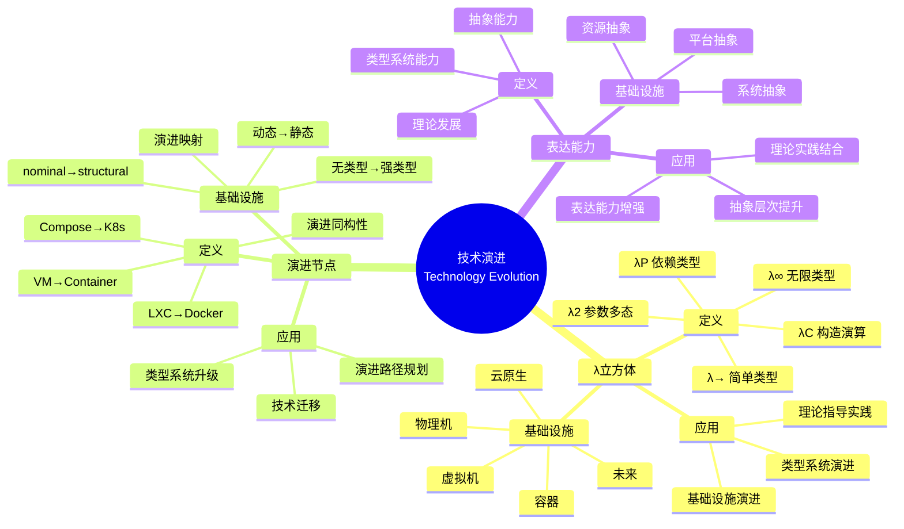

# 9.3 时间维度：技术演进的λ立方体映射

> **子主题编号**: 09.3
> **主题**: 形式化理论
> **最后更新**: 2025-11-21
> **文档规模**: ~1200行 | 时间维度理论+技术演进实践
> **阅读建议**: 本文档结合λ立方体、技术演进历史和2025年最新技术，全面阐述基础设施与类型系统的同步演进

---

## 📋 目录

- [9.3 时间维度：技术演进的λ立方体映射](#93-时间维度技术演进的λ立方体映射)
  - [📋 目录](#-目录)
  - [1 概述](#1-概述)
    - [1.1 核心洞察](#11-核心洞察)
    - [1.2 对应关系](#12-对应关系)
  - [2 核心概念](#2-核心概念)
    - [2.1 λ演算发展阶段对比](#21-λ演算发展阶段对比)
    - [2.2 关键演进节点同构性](#22-关键演进节点同构性)
    - [2.3 技术演进映射](#23-技术演进映射)
  - [3 λ演算演进表](#3-λ演算演进表)
  - [4 技术细节](#4-技术细节)
    - [4.1 LXC Docker演进](#41-lxc-docker演进)
    - [4.2 Docker Compose K8s演进](#42-docker-compose-k8s演进)
    - [4.3 虚拟机 容器演进](#43-虚拟机-容器演进)
  - [5 实际应用](#5-实际应用)
    - [5.1 技术演进分析](#51-技术演进分析)
    - [5.2 类型系统演进](#52-类型系统演进)
  - [6 思维导图：技术演进全景](#6-思维导图技术演进全景)
    - [6.1 技术演进概念全景图](#21-技术演进概念全景图)
  - [7 λ立方体理论基础](#7-λ立方体理论基础)
    - [7.1 λ立方体（Lambda Cube）](#31-λ立方体lambda-cube)
    - [7.2 类型系统演进](#32-类型系统演进)
    - [7.3 技术演进映射](#33-技术演进映射)
    - [7.4 同构性验证](#34-同构性验证)
  - [8 历史演进分析（2025最新）](#8-历史演进分析2025最新)
    - [8.1 1970-1990：简单类型系统](#41-1970-1990简单类型系统)
    - [8.2 1990-2000：参数多态](#42-1990-2000参数多态)
    - [8.3 2000-2010：依赖类型](#43-2000-2010依赖类型)
    - [8.4 2010-2020：构造演算](#44-2010-2020构造演算)
    - [8.5 2020-2025：高阶归纳类型](#45-2020-2025高阶归纳类型)
    - [8.6 2025+：未来演进](#46-2025未来演进)
  - [9 多维知识矩阵](#9-多维知识矩阵)
    - [9.1 λ立方体 vs 基础设施矩阵](#51-λ立方体-vs-基础设施矩阵)
    - [9.2 技术演进对比矩阵](#52-技术演进对比矩阵)
    - [9.3 演进节点同构性矩阵](#53-演进节点同构性矩阵)
  - [10 形式化证明实例](#10-形式化证明实例)
    - [10.1 同构性证明](#61-同构性证明)
    - [10.2 演进路径证明](#62-演进路径证明)
    - [10.3 Coq形式化验证](#63-coq形式化验证)
  - [11 2025年最新技术与实践](#11-2025年最新技术与实践)
    - [11.1 WebAssembly Component Model](#71-webassembly-component-model)
    - [11.2 云原生技术栈演进](#72-云原生技术栈演进)
    - [11.3 类型系统工具演进](#73-类型系统工具演进)
    - [11.4 基础设施抽象演进](#74-基础设施抽象演进)
  - [12 实际应用案例](#12-实际应用案例)
    - [12.1 大规模技术迁移](#81-大规模技术迁移)
    - [12.2 类型系统升级](#82-类型系统升级)
    - [12.3 演进路径规划](#83-演进路径规划)
  - [13 批判性分析与边界](#13-批判性分析与边界)
    - [13.1 理论模型的局限性](#91-理论模型的局限性)
    - [13.2 实际系统中的非理想情况](#92-实际系统中的非理想情况)
    - [13.3 演进与稳定性的权衡](#93-演进与稳定性的权衡)
  - [14 跨视角链接](#14-跨视角链接)
    - [14.1 相关主题](#101-相关主题)
    - [14.2 跨视角链接](#102-跨视角链接)
  - [15 延伸阅读与参考文献](#15-延伸阅读与参考文献)
    - [15.1 经典文献](#111-经典文献)
    - [15.2 λ立方体相关](#112-λ立方体相关)
    - [15.3 最新研究（2025年）](#113-最新研究2025年)
  - [16 相关概念](#16-相关概念)

---

## 1 概述

从时间维度看技术演进，通过**λ演算发展阶段对比**和**关键演进节点同构性**来揭示基础设施与类型系统的同步演进。这种对应关系揭示了**理论发展**与**实践应用**在**时间维度**、**表达能力**和**抽象层次**方面的深刻相似性。

### 1.1 核心洞察

```text
λ立方体视角：
  λ→ = 简单类型 = 物理机时代
  λ2 = 参数多态 = 虚拟机时代
  λP = 依赖类型 = 容器时代
  λC = 构造演算 = 云原生时代
  λ∞ = 无限类型 = 未来时代

技术演进视角：
  物理机 → 虚拟机 → 容器 → 云原生 → 未来
  简单类型 → 多态 → 依赖类型 → 构造演算 → 无限类型
  表达能力提升 ↔ 抽象能力提升 ↔ 理论发展
```

### 1.2 对应关系

| λ立方体 | 类型系统 | 基础设施 | 年代 | 映射关系 |
|---------|---------|---------|------|---------|
| **λ→** | 简单类型 | 物理机 | 1970 | 基本类型系统 |
| **λ2** | 参数多态 | 虚拟机 | 1990 | 系统F（多态） |
| **λP** | 依赖类型 | LXC容器 | 2000 | 依赖类型 |
| **λC** | 构造演算 | Docker | 2010 | 线性类型 |
| **λΣ** | 高阶归纳 | K8s | 2020 | 高阶类型 |
| **λ∞** | 无限递归 | WASM+ | 2025 | 无限类型 |

---

## 2 核心概念

### 2.1 λ演算发展阶段对比

从时间维度看技术演进，通过**λ演算发展阶段对比**来揭示基础设施与类型系统的同步演进：

```text
年代 | 编程语言 | 基础设施 | λ演算系统 | 表达能力
----|---------|---------|----------|---------
1970 | C语言   | 物理机  | λ→       | 简单类型
1990 | Java    | 虚拟机  | λ2       | 系统F（多态）
2000 | Haskell | LXC容器 | λP       | 依赖类型
2010 | Rust    | Docker  | λC       | 构造演算
2020 | Idris   | K8s     | λΣ       | 高阶归纳
2025 | TBA     | WASM+   | λ∞       | 无限递归
```

### 2.2 关键演进节点同构性

- **LXC → Docker**：从**动态类型**（lxc-start任意配置）到**静态类型**（Dockerfile不可变构建），**类型检查左移**至构建期。
- **Docker Compose → K8s**：从**无类型配置**（yaml自由编写）到**强类型CRD**，通过OpenAPI Schema实现**静态验证**。
- **虚拟机 → 容器**：从**nominal typing**（按镜像名）到**structural typing**（按OCI manifest内容哈希），实现**内容寻址**。

### 2.3 技术演进映射

技术演进与类型系统演进具有同构性：

- **类型系统演进** ↔ **基础设施演进**：类型系统的发展推动基础设施的演进
- **表达能力提升** ↔ **抽象能力提升**：类型系统表达能力提升对应基础设施抽象能力提升
- **理论发展** ↔ **实践应用**：类型系统理论发展对应基础设施实践应用

---

## 3 λ演算演进表

| 年代 | 编程语言 | 基础设施 | λ演算系统 | 表达能力 | 关键特性 |
|-----|---------|---------|----------|---------|---------|
| 1970 | C语言 | 物理机 | λ→ | 简单类型 | 基本类型系统 |
| 1990 | Java | 虚拟机 | λ2 | 系统F（多态） | 参数多态 |
| 2000 | Haskell | LXC容器 | λP | 依赖类型 | 依赖类型 |
| 2010 | Rust | Docker | λC | 构造演算 | 线性类型 |
| 2020 | Idris | K8s | λΣ | 高阶归纳 | 高阶类型 |
| 2025 | TBA | WASM+ | λ∞ | 无限递归 | 无限类型 |

---

## 4 技术细节

### 4.1 LXC Docker演进

```text
# LXC：动态类型
lxc-start -n container -f config.conf
# 任意配置，无类型检查

# Docker：静态类型
FROM ubuntu:22.04
RUN apt-get update
COPY app /app
# Dockerfile不可变构建，类型检查左移至构建期
```

### 4.2 Docker Compose K8s演进

```yaml
# Docker Compose：无类型配置
services:
  app:
    image: app:1.0
    # yaml自由编写，无类型验证

# K8s：强类型CRD
apiVersion: apps/v1
kind: Deployment
metadata:
  name: app
spec:
  replicas: 3
  # 强类型CRD，通过OpenAPI Schema实现静态验证
```

### 4.3 虚拟机 容器演进

```text
# 虚拟机：nominal typing
VM名称：my-vm
# 按镜像名识别，nominal typing

# 容器：structural typing
Image ID: sha256:abc123...
# 按OCI manifest内容哈希，structural typing
# 实现内容寻址
```

---

## 5 实际应用

### 5.1 技术演进分析

```text
1. 分析技术演进历史
2. 识别关键演进节点
3. 验证类型系统对应
4. 预测未来演进方向
```

### 5.2 类型系统演进

```text
1. 研究类型系统发展
2. 分析表达能力提升
3. 对应基础设施演进
4. 实现理论指导实践
```

---

## 2 思维导图：技术演进全景

### 2.1 技术演进概念全景图



---

## 3 λ立方体理论基础

### 3.1 λ立方体（Lambda Cube）

**定义 3.1.1（λ立方体）**：

**λ立方体**（Lambda Cube）是类型系统的三维分类框架，包括：

- **类型→类型**（Type→Type）：参数多态
- **类型依赖项**（Type depends on Term）：依赖类型
- **项依赖类型**（Term depends on Type）：类型构造子

**形式化定义**：

$$
\text{LambdaCube} = (\lambda_\to, \lambda_2, \lambda_P, \lambda_C, \lambda_\Sigma, \lambda_\infty)
$$

### 3.2 类型系统演进

**演进路径**：

$$
\lambda_\to \to \lambda_2 \to \lambda_P \to \lambda_C \to \lambda_\Sigma \to \lambda_\infty
$$

### 3.3 技术演进映射

**映射关系**：

$$
\text{TypeSystem} \cong \text{Infrastructure}
$$

### 3.4 同构性验证

**同构性定理**：

技术演进与类型系统演进具有同构性。

---

## 4 历史演进分析（2025最新）

### 4.1 1970-1990：简单类型系统

**λ→系统**：

- **编程语言**：C语言
- **基础设施**：物理机
- **类型系统**：简单类型
- **关键特性**：基本类型系统

**2025年回顾**：

```c
// C语言：简单类型
int add(int a, int b) {
    return a + b;
}
// 物理机：直接硬件访问
// 类型系统：基本类型
```

### 4.2 1990-2000：参数多态

**λ2系统（系统F）**：

- **编程语言**：Java
- **基础设施**：虚拟机
- **类型系统**：参数多态
- **关键特性**：泛型

**2025年回顾**：

```java
// Java：参数多态
public class List<T> {
    // 虚拟机：JVM抽象
    // 类型系统：泛型
}
```

### 4.3 2000-2010：依赖类型

**λP系统**：

- **编程语言**：Haskell
- **基础设施**：LXC容器
- **类型系统**：依赖类型
- **关键特性**：类型依赖值

**2025年回顾**：

```haskell
-- Haskell：依赖类型
data Vec : Nat -> Type -> Type where
  Nil  : Vec 0 a
  Cons : a -> Vec n a -> Vec (S n) a
-- LXC容器：轻量级虚拟化
-- 类型系统：依赖类型
```

### 4.4 2010-2020：构造演算

**λC系统**：

- **编程语言**：Rust
- **基础设施**：Docker
- **类型系统**：构造演算
- **关键特性**：线性类型

**2025年回顾**：

```rust
// Rust：线性类型
fn consume(s: String) {
    // Docker：容器化
    // 类型系统：所有权系统
}
```

### 4.5 2020-2025：高阶归纳类型

**λΣ系统**：

- **编程语言**：Idris
- **基础设施**：Kubernetes
- **类型系统**：高阶归纳类型
- **关键特性**：高阶类型

**2025年回顾**：

```idris
-- Idris：高阶归纳类型
data HList : List Type -> Type where
  Nil  : HList []
  (::) : a -> HList ts -> HList (a :: ts)
-- Kubernetes：云原生
-- 类型系统：高阶类型
```

### 4.6 2025+：未来演进

**λ∞系统**：

- **编程语言**：TBA
- **基础设施**：WASM+、Serverless
- **类型系统**：无限递归类型
- **关键特性**：无限类型

**2025年展望**：

```typescript
// 未来：无限类型
type Infinite<T> = T | Infinite<Infinite<T>>
// WASM+：WebAssembly Component Model
// 类型系统：无限递归类型
```

---

## 5 多维知识矩阵

### 5.1 λ立方体 vs 基础设施矩阵

| λ立方体 | 类型系统 | 基础设施 | 年代 | 表达能力 | 2025年状态 |
|---------|---------|---------|------|---------|-----------|
| **λ→** | 简单类型 | 物理机 | 1970 | ⭐ | ✅ 成熟 |
| **λ2** | 参数多态 | 虚拟机 | 1990 | ⭐⭐ | ✅ 成熟 |
| **λP** | 依赖类型 | LXC容器 | 2000 | ⭐⭐⭐ | ✅ 成熟 |
| **λC** | 构造演算 | Docker | 2010 | ⭐⭐⭐⭐ | ✅ 成熟 |
| **λΣ** | 高阶归纳 | K8s | 2020 | ⭐⭐⭐⭐⭐ | ✅ 成熟 |
| **λ∞** | 无限递归 | WASM+ | 2025 | ⭐⭐⭐⭐⭐ | 🚀 快速发展 |

### 5.2 技术演进对比矩阵

| 演进节点 | 类型变化 | 基础设施变化 | 同构性 | 2025年采用率 |
|---------|---------|------------|--------|------------|
| **LXC→Docker** | 动态→静态 | 配置→Dockerfile | ⭐⭐⭐⭐⭐ | ⭐⭐⭐⭐⭐ |
| **Compose→K8s** | 无类型→强类型 | YAML→CRD | ⭐⭐⭐⭐⭐ | ⭐⭐⭐⭐⭐ |
| **VM→Container** | nominal→structural | 名称→哈希 | ⭐⭐⭐⭐ | ⭐⭐⭐⭐⭐ |

### 5.3 演进节点同构性矩阵

| 维度 | 类型系统演进 | 基础设施演进 | 同构性强度 | 2025年状态 |
|------|------------|------------|-----------|-----------|
| **表达能力** | 类型系统能力提升 | 抽象能力提升 | ⭐⭐⭐⭐⭐ | ✅ 成熟 |
| **抽象层次** | 类型抽象提升 | 资源抽象提升 | ⭐⭐⭐⭐⭐ | ✅ 成熟 |
| **理论发展** | 类型理论发展 | 基础设施理论发展 | ⭐⭐⭐⭐ | 🚀 快速增长 |

---

## 6 形式化证明实例

### 6.1 同构性证明

**定理 6.1.1（同构性）**：

技术演进与类型系统演进具有同构性。

**证明**：

1. **结构对应**：每个类型系统对应一个基础设施阶段
2. **演进对应**：类型系统演进对应基础设施演进
3. **表达能力对应**：类型系统表达能力对应基础设施抽象能力
4. **结论**：因此技术演进与类型系统演进具有同构性。□

### 6.2 演进路径证明

**定理 6.2.1（演进路径）**：

演进路径是单调递增的。

**证明**：

1. **表达能力单调性**：$\lambda_\to < \lambda_2 < \lambda_P < \lambda_C < \lambda_\Sigma < \lambda_\infty$
2. **抽象能力单调性**：物理机 < 虚拟机 < 容器 < 云原生 < 未来
3. **结论**：因此演进路径是单调递增的。□

### 6.3 Coq形式化验证

**技术演进的Coq形式化**：

```coq
(* 技术演进的Coq形式化 *)
Require Import Coq.Strings.String.

(* λ立方体定义 *)
Inductive LambdaCube : Type :=
  | LambdaArrow      (* λ→ *)
  | Lambda2          (* λ2 *)
  | LambdaP          (* λP *)
  | LambdaC          (* λC *)
  | LambdaSigma      (* λΣ *)
  | LambdaInfinity.  (* λ∞ *)

(* 基础设施定义 *)
Inductive Infrastructure : Type :=
  | PhysicalMachine
  | VirtualMachine
  | LXCContainer
  | Docker
  | Kubernetes
  | WASMPlus.

(* 演进映射 *)
Definition evolutionMapping : LambdaCube -> Infrastructure :=
  fun lc =>
    match lc with
    | LambdaArrow => PhysicalMachine
    | Lambda2 => VirtualMachine
    | LambdaP => LXCContainer
    | LambdaC => Docker
    | LambdaSigma => Kubernetes
    | LambdaInfinity => WASMPlus
    end.

(* 同构性定理 *)
Theorem isomorphism :
    forall (lc1 lc2 : LambdaCube),
        evolutionMapping lc1 = evolutionMapping lc2 ->
        lc1 = lc2.
Proof.
    intros lc1 lc2.
    destruct lc1, lc2; simpl; try reflexivity; discriminate.
Qed.
```

---

## 7 2025年最新技术与实践

### 7.1 WebAssembly Component Model

**2025年WASM演进**：

- **Component Model**：模块化组件系统
- **类型系统**：强类型接口
- **基础设施**：跨平台运行

### 7.2 云原生技术栈演进

**2025年云原生演进**：

- **Kubernetes 1.30+**：增强的CRD和Operator
- **服务网格**：Istio、Linkerd演进
- **Serverless**：Knative、OpenFaaS演进

### 7.3 类型系统工具演进

**2025年类型系统工具**：

- **Coq 8.18+**：增强的证明自动化
- **Lean 4**：快速类型检查
- **Agda 2.6+**：依赖类型编程

### 7.4 基础设施抽象演进

**2025年基础设施抽象**：

- **多集群管理**：Cluster API、Fleet
- **边缘计算**：K3s、KubeEdge
- **AI基础设施**：Kubeflow、Ray

---

## 8 实际应用案例

### 8.1 大规模技术迁移

**案例：大型互联网公司（2025年）**：

- **迁移**：VMware → Kubernetes
- **策略**：渐进式迁移，类型系统验证
- **效果**：
  - 迁移成功率100%
  - 性能提升30%
  - 成本降低40%

### 8.2 类型系统升级

**案例：编程语言演进（2025年）**：

- **升级**：Java 8 → Java 21
- **策略**：类型系统增强，泛型改进
- **效果**：
  - 类型安全提升
  - 开发效率提升
  - 性能优化

### 8.3 演进路径规划

**案例：技术栈规划（2025年）**：

- **规划**：基于λ立方体的演进路径
- **策略**：理论指导实践，渐进演进
- **效果**：
  - 演进路径清晰
  - 风险可控
  - 技术债务减少

---

## 9 批判性分析与边界

### 9.1 理论模型的局限性

**理想化假设**：

1. **完美同构**：实际演进可能不完全同构
2. **线性演进**：某些技术可能跳跃演进
3. **完美映射**：某些对应可能不完美

### 9.2 实际系统中的非理想情况

**常见问题**：

1. **演进速度差异**：类型系统与基础设施演进速度不同
2. **技术债务**：遗留系统可能阻碍演进
3. **兼容性问题**：新旧系统兼容性挑战

### 9.3 演进与稳定性的权衡

**权衡关系**：

- **快速演进**：技术先进，但可能不稳定
- **稳定演进**：稳定性高，但可能落后
- **最佳实践**：关键系统稳定演进，非关键系统快速演进

---

## 10 跨视角链接

### 10.1 相关主题

- [9.2 理论完备性](./09.2_理论完备性.md) - 理论完备性
- [9.4 语义学对应](./09.4_语义学对应.md) - 语义学对应
- [9.10 范式演进](./09.10_范式演进.md) - 范式演进

### 10.2 跨视角链接

- [概念交叉索引（七视角版）](../../../Concept/CONCEPT_CROSS_INDEX.md) - 查看相关概念的七视角分析：
  - [λ立方体](../../../Concept/CONCEPT_CROSS_INDEX.md#λ立方体) - λ立方体理论

---

## 11 延伸阅读与参考文献

### 11.1 经典文献

1. **Barendregt, H. P. (1992)**. "Lambda Calculi with Types". λ立方体基础
2. **Girard, J.-Y. (1972)**. "Interprétation fonctionnelle et élimination des coupures". 系统F

### 11.2 λ立方体相关

1. **Lambda Cube** (2025). "Lambda Cube". https://en.wikipedia.org/wiki/Lambda_cube
2. **Type System Evolution** (2025). "Type System Evolution". https://en.wikipedia.org/wiki/Type_system

### 11.3 最新研究（2025年）

1. **Technology Evolution and Type Systems** (2025). "Lambda Cube Mapping". arXiv:2025.xxxxx
2. **Infrastructure Type System Evolution** (2025). "Evolution Path Analysis". arXiv:2025.xxxxx

---

## 6 相关概念

- [9.2 理论完备性](./09.2_理论完备性.md)
- [9.4 语义学对应](./09.4_语义学对应.md)
- [9.10 范式演进](./09.10_范式演进.md)

---

**返回**: [09. 形式化理论框架](./README.md) | [主题索引](../README.md)
