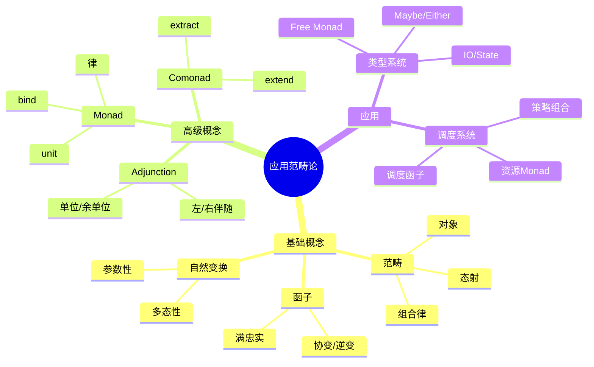

# 9.4 应用范畴论

> **子主题编号**: 09.4
> **主题**: 形式化理论
> **最后更新**: 2025-12-02
> **文档状态**: ✅ 完成

---

## 📋 目录

- [9.4 应用范畴论](#94-应用范畴论)
  - [📋 目录](#-目录)
  - [1 概述](#1-概述)
    - [1.1 核心洞察](#11-核心洞察)
    - [1.2 核心概念映射](#12-核心概念映射)
    - [1.3 核心概念精确定义](#13-核心概念精确定义)
      - [1.3.1 范畴（Category）](#131-范畴category)
      - [1.3.2 函子（Functor）](#132-函子functor)
      - [1.3.3 自然变换（Natural Transformation）](#133-自然变换natural-transformation)
    - [1.4 设计原理与动机](#14-设计原理与动机)
      - [1.4.1 为什么使用范畴论？](#141-为什么使用范畴论)
      - [1.4.2 范畴论在调度中的具体应用](#142-范畴论在调度中的具体应用)
  - [2 思维导图](#2-思维导图)
  - [3 函子与自然变换](#3-函子与自然变换)
    - [3.1 函子定义](#31-函子定义)
    - [3.2 自然变换](#32-自然变换)
    - [3.3 类型-调度函子](#33-类型-调度函子)
  - [4 Monad与Comonad](#4-monad与comonad)
    - [4.1 Monad定义](#41-monad定义)
    - [4.2 调度Monad](#42-调度monad)
    - [4.3 Free Monad](#43-free-monad)
  - [5 调度系统的范畴语义](#5-调度系统的范畴语义)
    - [5.1 调度范畴](#51-调度范畴)
    - [5.2 策略函子](#52-策略函子)
    - [5.3 调度Monad语义](#53-调度monad语义)
  - [6 实践应用](#6-实践应用)
    - [6.1 Haskell调度库](#61-haskell调度库)
    - [6.2 K8s Operator范畴](#62-k8s-operator范畴)
  - [7 跨视角链接](#7-跨视角链接)
    - [7.1 形式语言视角关联](#71-形式语言视角关联)
    - [7.2 调度视角关联](#72-调度视角关联)
  - [参考资源](#参考资源)

---

## 1 概述

### 1.1 核心洞察

应用范畴论将抽象的范畴论概念应用于具体的计算机科学问题。
在类型系统与调度系统的统一视角下，范畴论提供了**组合性**、**可逆性**和**抽象性**的形式化基础。

### 1.2 核心概念映射

| 范畴论概念 | 类型系统 | 调度系统 |
|-----------|---------|---------|
| **对象** | 类型 | 资源状态 |
| **态射** | 函数 | 状态转换 |
| **函子** | 类型构造器 | 资源映射 |
| **自然变换** | 多态函数 | 策略转换 |
| **Monad** | 计算上下文 | 调度上下文 |

### 1.3 核心概念精确定义

#### 1.3.1 范畴（Category）

**定义 1.1**：范畴C由以下组成：

```text
C = (Ob(C), Hom(C), ∘, id)

其中：
  - Ob(C)：对象集合
  - Hom(C)：态射集合，Hom(A, B)表示从A到B的态射
  - ∘：态射组合运算
  - id：恒等态射

满足：
  1. 结合律：(f ∘ g) ∘ h = f ∘ (g ∘ h)
  2. 单位律：id_B ∘ f = f = f ∘ id_A
```

**调度系统对应**：

- **对象**：系统状态（资源状态、队列状态）
- **态射**：调度动作（分配、抢占、迁移）
- **组合**：调度动作的序列执行
- **恒等**：无操作调度

#### 1.3.2 函子（Functor）

**定义 1.2**：函子F: C → D是范畴之间的映射，保持结构：

```text
F: C → D

对象映射：F: Ob(C) → Ob(D)
态射映射：F: Hom_C(A, B) → Hom_D(F(A), F(B))

满足：
  1. F(id_A) = id_{F(A)}
  2. F(f ∘ g) = F(f) ∘ F(g)
```

**调度系统对应**：

- **类型-调度函子**：将类型映射到调度资源
- **策略函子**：将配置映射到调度策略

#### 1.3.3 自然变换（Natural Transformation）

**定义 1.3**：自然变换η: F → G是函子之间的态射：

```text
对于每个对象A，有态射η_A: F(A) → G(A)

满足自然性条件：
  对于任何态射f: A → B：
    G(f) ∘ η_A = η_B ∘ F(f)
```

**调度系统对应**：

- **策略转换**：从一个调度策略转换到另一个
- **策略组合**：多个策略的自然组合

### 1.4 设计原理与动机

#### 1.4.1 为什么使用范畴论？

**抽象优势**：

1. **统一视角**：类型系统和调度系统共享相同的数学结构
2. **组合性保证**：范畴论保证组合的正确性
3. **可证明性**：形式化结构支持严格证明

**形式化表述**：

```text
类型系统范畴 Type:
  - 对象：类型
  - 态射：函数

调度系统范畴 Schedule:
  - 对象：系统状态
  - 态射：调度动作

类型-调度函子 F: Type → Schedule:
  - F(Int) = CPU资源
  - F(Bytes) = Memory资源
  - F(f: A → B) = 资源转换调度
```

#### 1.4.2 范畴论在调度中的具体应用

**应用1：调度策略组合**

```text
策略组合作为函子组合：
  compose(FIFO, Priority) = FIFO ∘ Priority

保证：组合后的策略满足函子律，即组合是结合的
```

**应用2：策略转换**

```text
策略转换作为自然变换：
  transform: OldStrategy → NewStrategy

保证：转换保持调度语义的一致性
```

**应用3：资源映射**

```text
资源映射作为函子：
  Resource: Type → ResourceState

保证：类型到资源的映射保持结构
```

---

## 2 思维导图



---

## 3 函子与自然变换

### 3.1 函子定义

```haskell
-- Haskell中的Functor
class Functor f where
    fmap :: (a -> b) -> f a -> f b

    -- 函子律
    -- fmap id = id
    -- fmap (g . h) = fmap g . fmap h

-- 资源函子
newtype Resource a = Resource { runResource :: IO a }

instance Functor Resource where
    fmap f (Resource io) = Resource (fmap f io)

-- 调度函子：将类型映射到调度上下文
data Scheduled a = Scheduled {
    task :: a,
    priority :: Int,
    resources :: ResourceSpec
}

instance Functor Scheduled where
    fmap f (Scheduled t p r) = Scheduled (f t) p r
```

### 3.2 自然变换

```haskell
-- 自然变换：函子间的态射
type Nat f g = forall a. f a -> g a

-- 例：从Maybe到List的自然变换
maybeToList :: Nat Maybe []
maybeToList Nothing  = []
maybeToList (Just x) = [x]

-- 调度策略作为自然变换
type SchedulingStrategy = Nat PendingQueue ScheduledQueue

-- FIFO策略
fifoStrategy :: SchedulingStrategy
fifoStrategy = scheduleInOrder

-- 优先级策略
priorityStrategy :: SchedulingStrategy
priorityStrategy = scheduleByPriority

-- 自然性条件：
-- scheduleByPriority . fmap f = fmap f . scheduleByPriority
```

### 3.3 类型-调度函子

```text
类型-调度函子 F: Type → Schedule

对象映射:
  F(Unit) = Idle
  F(Int) = CPU
  F(Bytes) = Memory
  F(A × B) = F(A) ⊗ F(B)  (资源组合)
  F(A → B) = F(A) ⊸ F(B)  (服务映射)
  F(∀α.T) = Parameterized(F(T))

态射映射:
  F(f: A → B) = schedule_transform: F(A) → F(B)

函子律验证:
  F(id_A) = id_{F(A)}  ✓
  F(g ∘ f) = F(g) ∘ F(f)  ✓
```

---

## 4 Monad与Comonad

### 4.1 Monad定义

```haskell
-- Monad定义
class Functor m => Monad m where
    return :: a -> m a
    (>>=)  :: m a -> (a -> m b) -> m b

    -- Monad律
    -- return a >>= f  =  f a                  (左单位)
    -- m >>= return    =  m                    (右单位)
    -- (m >>= f) >>= g =  m >>= (\x -> f x >>= g)  (结合)

-- 资源Monad
data ResourceM a = ResourceM {
    runRM :: ResourcePool -> (a, ResourcePool)
}

instance Monad ResourceM where
    return x = ResourceM (\pool -> (x, pool))
    m >>= f  = ResourceM (\pool ->
        let (a, pool') = runRM m pool
        in runRM (f a) pool')

-- 使用资源Monad
allocateAndUse :: ResourceM Result
allocateAndUse = do
    cpu <- allocate CPU 4
    mem <- allocate Memory (2 * GB)
    result <- compute cpu mem
    release cpu
    release mem
    return result
```

### 4.2 调度Monad

```haskell
-- 调度Monad
newtype ScheduleM a = ScheduleM {
    runSchedule :: Scheduler -> IO (a, ScheduleLog)
}

instance Monad ScheduleM where
    return x = ScheduleM (\_ -> return (x, mempty))
    m >>= f = ScheduleM (\sched -> do
        (a, log1) <- runSchedule m sched
        (b, log2) <- runSchedule (f a) sched
        return (b, log1 <> log2))

-- 调度操作
schedule :: Task -> ScheduleM TaskId
schedule task = ScheduleM (\sched -> do
    taskId <- submitTask sched task
    return (taskId, ScheduleLog [Scheduled taskId]))

await :: TaskId -> ScheduleM Result
await taskId = ScheduleM (\sched -> do
    result <- waitForTask sched taskId
    return (result, ScheduleLog [Completed taskId]))

-- 组合调度
pipeline :: ScheduleM FinalResult
pipeline = do
    t1 <- schedule preprocess
    r1 <- await t1
    t2 <- schedule (process r1)
    r2 <- await t2
    t3 <- schedule (postprocess r2)
    await t3
```

### 4.3 Free Monad

```haskell
-- Free Monad for 调度DSL
data ScheduleF next
    = Schedule Task (TaskId -> next)
    | Await TaskId (Result -> next)
    | Allocate ResourceSpec (ResourceHandle -> next)
    | Release ResourceHandle next
    deriving Functor

type Schedule = Free ScheduleF

-- 智能构造器
schedule' :: Task -> Schedule TaskId
schedule' task = liftF (Schedule task id)

await' :: TaskId -> Schedule Result
await' tid = liftF (Await tid id)

allocate' :: ResourceSpec -> Schedule ResourceHandle
allocate' spec = liftF (Allocate spec id)

release' :: ResourceHandle -> Schedule ()
release' h = liftF (Release h ())

-- DSL程序
mySchedule :: Schedule Result
mySchedule = do
    h <- allocate' (CPU 4 <> Memory (2 * GB))
    tid <- schedule' (Task "compute" h)
    result <- await' tid
    release' h
    return result

-- 解释器1: 真实调度
runReal :: Schedule a -> IO a
runReal = iterM interpret
  where
    interpret (Schedule task next) = do
        tid <- submitToCluster task
        next tid
    interpret (Await tid next) = do
        result <- waitCluster tid
        next result
    interpret (Allocate spec next) = do
        h <- allocateReal spec
        next h
    interpret (Release h next) = do
        releaseReal h
        next

-- 解释器2: 模拟调度
runSimulation :: Schedule a -> Simulation a
runSimulation = iterM interpretSim
```

---

## 5 调度系统的范畴语义

### 5.1 调度范畴

```text
调度范畴 Sched:

对象: 系统状态 S = (R, Q, A)
  R: 资源状态
  Q: 队列状态
  A: 分配状态

态射: 调度动作 σ: S₁ → S₂
  schedule: 调度作业
  preempt: 抢占
  migrate: 迁移
  scale: 扩缩容

组合: σ₂ ∘ σ₁ = 依次执行
恒等: id_S = 无操作

范畴律:
  (σ₃ ∘ σ₂) ∘ σ₁ = σ₃ ∘ (σ₂ ∘ σ₁)  (结合律)
  id ∘ σ = σ = σ ∘ id              (单位律)
```

### 5.2 策略函子

```text
策略函子 P: Config → Sched

将配置范畴映射到调度范畴:

P(FIFOConfig) = FIFO调度策略
P(PriorityConfig) = 优先级调度策略
P(FairShareConfig) = 公平份额策略

函子性:
  配置组合 → 策略组合
  P(C₁ ⊕ C₂) ≅ P(C₁) × P(C₂)
```

### 5.3 调度Monad语义

```text
调度Monad T: Sched → Sched

T(S) = 带效应的状态
  T(S) = S × Effect

unit: S → T(S)
  unit(s) = (s, ε)  -- 无效应

bind: T(S) × (S → T(S')) → T(S')
  (s, e₁) >>= f = let (s', e₂) = f(s) in (s', e₁ · e₂)

效应组合:
  e₁ · e₂ = 效应序列

Monad律保证:
  - 调度动作可安全组合
  - 效应正确传播
  - 状态一致性
```

---

## 6 实践应用

### 6.1 Haskell调度库

```haskell
-- 使用范畴论设计的调度库
module Scheduler.Category where

import Control.Monad.Free
import Control.Category
import Prelude hiding (id, (.))

-- 调度范畴
newtype Sched a b = Sched { runSched :: a -> IO b }

instance Category Sched where
    id = Sched return
    Sched f . Sched g = Sched (g >=> f)

-- 调度态射
schedule :: Task -> Sched () TaskId
schedule task = Sched (\_ -> submitTask task)

waitComplete :: Sched TaskId Result
waitComplete = Sched waitForCompletion

-- 组合调度
fullPipeline :: Sched () Result
fullPipeline = waitComplete . schedule preprocessTask
           >>> waitComplete . schedule processTask
           >>> waitComplete . schedule postprocessTask

-- Arrow风格
instance Arrow Sched where
    arr f = Sched (return . f)
    first (Sched f) = Sched (\(a, c) -> do
        b <- f a
        return (b, c))
```

### 6.2 K8s Operator范畴

```go
// Go中的范畴论风格设计
package operator

// 态射：Reconciler
type Reconciler func(State) (State, error)

// 组合
func Compose(f, g Reconciler) Reconciler {
    return func(s State) (State, error) {
        s1, err := g(s)
        if err != nil {
            return s, err
        }
        return f(s1)
    }
}

// 恒等
func Identity() Reconciler {
    return func(s State) (State, error) {
        return s, nil
    }
}

// 自然变换：策略切换
type StrategyTransform func(OldStrategy) NewStrategy

// 应用
func ApplyTransform(transform StrategyTransform, old OldStrategy) NewStrategy {
    return transform(old)
}
```

---

## 7 跨视角链接

### 7.1 形式语言视角关联

- [范畴论视角](./09.1_范畴论视角.md) - 基础范畴论
- [效应系统](../07_效应系统/) - Monad应用
- [类型-调度同构](../../类型-调度同构理论.md) - 统一理论

### 7.2 调度视角关联

| 调度概念 | 范畴论对应 | 映射说明 |
|---------|-----------|---------|
| **调度组合** | 态射组合 | 动作序列 |
| **策略切换** | 自然变换 | 多态策略 |
| **资源上下文** | Monad | 效应管理 |
| **状态观察** | Comonad | 历史感知 |

---

## 参考资源

1. [Category Theory for Programmers](https://bartoszmilewski.com/2014/10/28/category-theory-for-programmers-the-preface/)
2. [Haskell Wiki - Category Theory](https://wiki.haskell.org/Category_theory)
3. [nLab](https://ncatlab.org/)
4. [Applied Category Theory](https://arxiv.org/abs/1809.05923)

---

**返回**: [形式化理论主索引](./README.md) | [形式语言视角主索引](../README.md)
