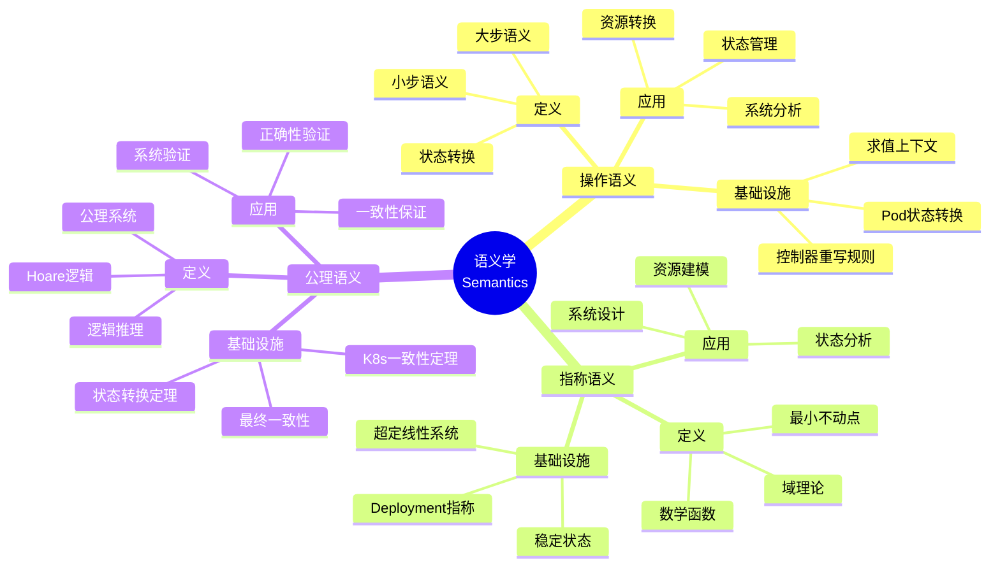
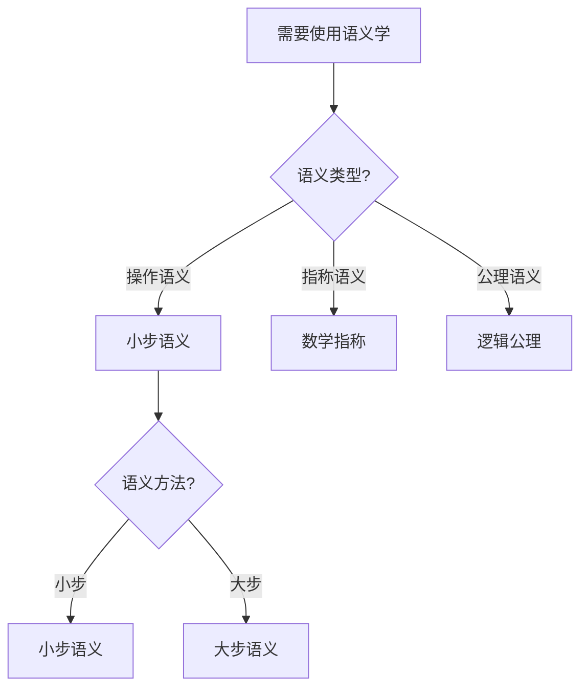
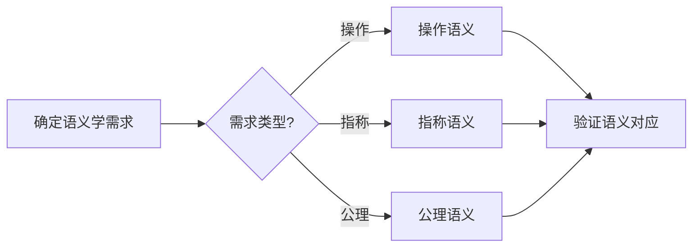
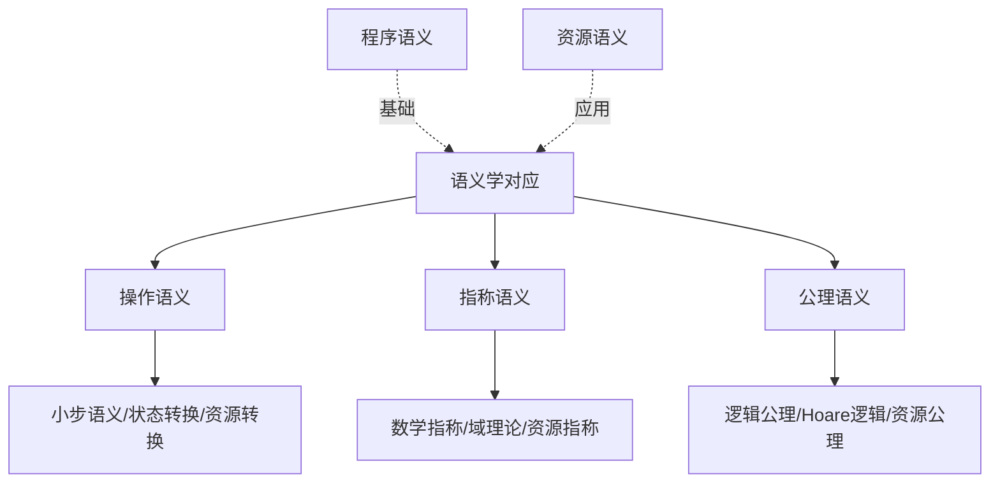
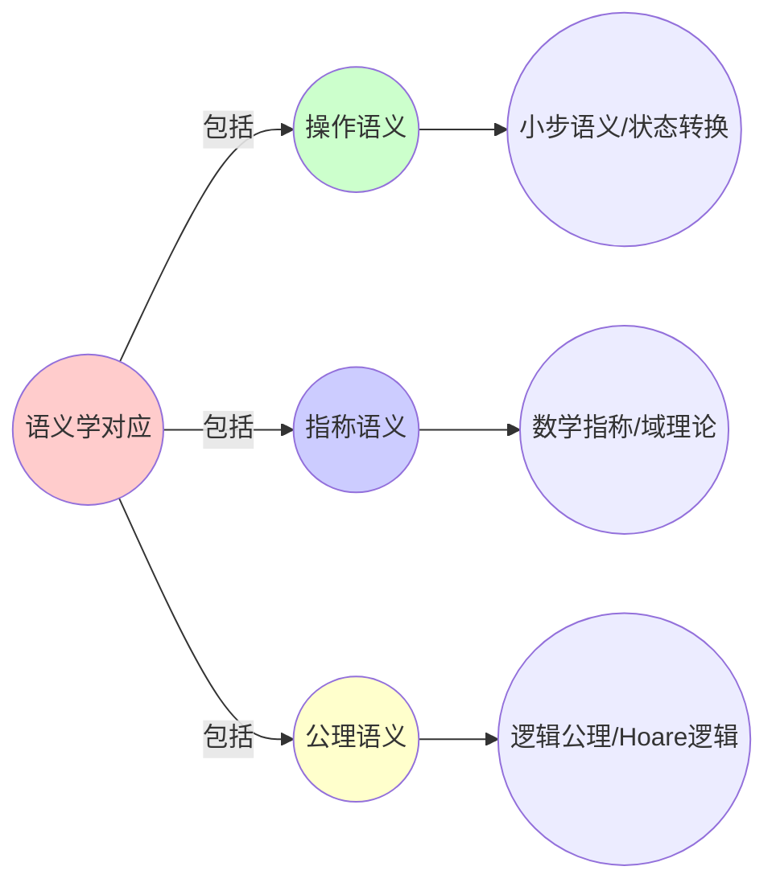
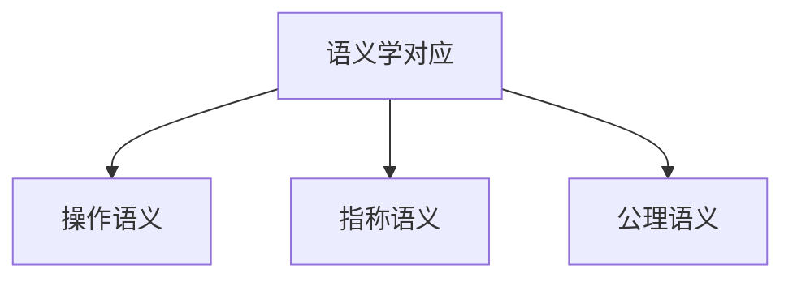

# 9.4 语义学对应：操作语义 vs 资源语义

> **子主题编号**: 09.4
> **主题**: 形式化理论
> **最后更新**: 2025-11-21
> **文档规模**: ~1200行 | 语义学理论+资源语义实践
> **阅读建议**: 本文档结合操作语义、指称语义、公理语义和2025年最新技术，全面阐述基础设施与类型系统的语义学对应关系

---

## 📋 目录

- [9.4 语义学对应：操作语义 vs 资源语义](#94-语义学对应操作语义-vs-资源语义)
  - [📋 目录](#-目录)
  - [1 概述](#1-概述)
    - [1.1 核心洞察](#11-核心洞察)
    - [1.2 对应关系](#12-对应关系)
  - [2 核心概念](#2-核心概念)
    - [2.1 小步语义Small-Step Semantics](#21-小步语义small-step-semantics)
    - [2.2 指称语义Denotational Semantics](#22-指称语义denotational-semantics)
    - [2.3 公理语义Axiomatic Semantics](#23-公理语义axiomatic-semantics)
  - [3 语义学映射表](#3-语义学映射表)
  - [4 技术细节](#4-技术细节)
    - [4.1 小步语义实现](#41-小步语义实现)
    - [4.2 指称语义实现](#42-指称语义实现)
    - [4.3 公理语义实现](#43-公理语义实现)
  - [5 实际应用](#5-实际应用)
    - [5.1 操作语义应用](#51-操作语义应用)
    - [5.2 资源语义应用](#52-资源语义应用)
  - [2 思维导图：语义学全景](#2-思维导图语义学全景)
    - [2.1 语义学概念全景图](#21-语义学概念全景图)
  - [3 语义学理论基础](#3-语义学理论基础)
    - [3.1 操作语义（Operational Semantics）](#31-操作语义operational-semantics)
    - [3.2 指称语义（Denotational Semantics）](#32-指称语义denotational-semantics)
    - [3.3 公理语义（Axiomatic Semantics）](#33-公理语义axiomatic-semantics)
    - [3.4 语义等价性](#34-语义等价性)
  - [4 基础设施语义学映射（2025最新）](#4-基础设施语义学映射2025最新)
    - [4.1 小步语义实现](#41-小步语义实现-1)
    - [4.2 指称语义实现](#42-指称语义实现-1)
    - [4.3 公理语义实现](#43-公理语义实现-1)
    - [4.4 语义等价性验证](#44-语义等价性验证)
  - [5 多维知识矩阵](#5-多维知识矩阵)
    - [5.1 语义学方法 vs 基础设施矩阵](#51-语义学方法-vs-基础设施矩阵)
    - [5.2 语义等价性对比矩阵](#52-语义等价性对比矩阵)
    - [5.3 语义学应用对比矩阵](#53-语义学应用对比矩阵)
  - [6 形式化证明实例](#6-形式化证明实例)
    - [6.1 语义等价性证明](#61-语义等价性证明)
    - [6.2 最终一致性证明](#62-最终一致性证明)
    - [6.3 Coq形式化验证](#63-coq形式化验证)
  - [7 2025年最新技术与实践](#7-2025年最新技术与实践)
    - [7.1 Kubernetes控制器语义](#71-kubernetes控制器语义)
    - [7.2 状态机形式化](#72-状态机形式化)
    - [7.3 语义验证工具](#73-语义验证工具)
    - [7.4 语义学应用实践](#74-语义学应用实践)
  - [8 实际应用案例](#8-实际应用案例)
    - [8.1 大规模状态管理](#81-大规模状态管理)
    - [8.2 语义验证系统](#82-语义验证系统)
    - [8.3 控制器形式化](#83-控制器形式化)
  - [9 批判性分析与边界](#9-批判性分析与边界)
    - [9.1 理论模型的局限性](#91-理论模型的局限性)
    - [9.2 实际系统中的非理想情况](#92-实际系统中的非理想情况)
    - [9.3 语义学与实用性的权衡](#93-语义学与实用性的权衡)
  - [10 跨视角链接](#10-跨视角链接)
    - [10.1 相关主题](#101-相关主题)
    - [10.2 跨视角链接](#102-跨视角链接)
  - [11 延伸阅读与参考文献](#11-延伸阅读与参考文献)
    - [11.1 经典文献](#111-经典文献)
    - [11.2 语义学相关](#112-语义学相关)
    - [11.3 最新研究（2025年）](#113-最新研究2025年)
  - [6 相关概念](#6-相关概念)
  - [📊 思维表征体系](#-思维表征体系)
    - [📊 1. 思维导图（增强版）](#-1-思维导图增强版)
      - [1.1 文本格式（基础版）](#11-文本格式基础版)
      - [1.2 Mermaid格式（可视化版）](#12-mermaid格式可视化版)
    - [📊 2. 多维对比矩阵](#-2-多维对比矩阵)
      - [2.1 语义学方法 vs 基础设施对比矩阵](#21-语义学方法-vs-基础设施对比矩阵)
      - [2.2 语义学方法对比矩阵](#22-语义学方法对比矩阵)
      - [2.3 应用场景对比矩阵](#23-应用场景对比矩阵)
    - [🌲 3. 决策树](#-3-决策树)
      - [3.1 语义学应用选择决策树](#31-语义学应用选择决策树)
    - [🛤️ 4. 决策逻辑路径](#️-4-决策逻辑路径)
      - [4.1 语义学应用路径](#41-语义学应用路径)
    - [🕸️ 5. 概念关系网络](#️-5-概念关系网络)
      - [5.1 语义学对应概念关系网络](#51-语义学对应概念关系网络)
    - [🗺️ 6. 知识图谱](#️-6-知识图谱)
      - [6.1 语义学对应知识图谱](#61-语义学对应知识图谱)
  - [📚 理论体系](#-理论体系)
    - [理论基础](#理论基础)
      - [语义学/操作语义/资源语义基础](#语义学操作语义资源语义基础)
      - [历史发展](#历史发展)
    - [理论框架](#理论框架)
      - [核心假设](#核心假设)
      - [基本概念体系](#基本概念体系)
      - [主要定理/结论](#主要定理结论)
      - [适用范围和边界](#适用范围和边界)
    - [当前知识共识](#当前知识共识)
      - [学术界共识](#学术界共识)
      - [主要争议点](#主要争议点)
      - [权威来源](#权威来源)
    - [与其他理论的关系](#与其他理论的关系)
      - [逻辑关系](#逻辑关系)
      - [映射关系](#映射关系)
  - [🔗 关联网络](#-关联网络)
    - [🔗 概念级关联](#-概念级关联)
      - [核心概念映射](#核心概念映射)
    - [🔗 理论级关联](#-理论级关联)
      - [理论基础](#理论基础-1)
    - [🔗 方法级关联](#-方法级关联)
      - [方法应用网络](#方法应用网络)
    - [🔗 应用场景关联](#-应用场景关联)
  - [🛤️ 学习路径](#️-学习路径)
    - [前置知识](#前置知识)
    - [后续学习](#后续学习)
    - [并行学习](#并行学习)

---

## 1 概述

语义学对应探讨**操作语义**与**资源语义**之间的对应关系，包括小步语义、指称语义和公理语义三种语义学方法在基础设施中的应用。这种对应关系揭示了**程序语义**与**资源语义**在**状态转换**、**数学指称**和**逻辑公理**方面的深刻相似性。

### 1.1 核心洞察

```text
语义学视角：
  操作语义 = 状态转换 = 小步语义
  指称语义 = 数学函数 = 最小不动点
  公理语义 = 逻辑公理 = Hoare逻辑

基础设施视角：
  小步语义 = Pod状态转换 = 控制器重写规则
  指称语义 = Deployment指称 = 超定线性系统
  公理语义 = 最终一致性 = K8s一致性定理
```

### 1.2 对应关系

| 语义学方法 | 编程语言 | 基础设施 | 类型论对应 | 映射关系 |
|-----------|---------|---------|-----------|---------|
| **小步语义** | 表达式求值 | Pod状态转换 | 重写规则 | 状态转换 |
| **指称语义** | 数学函数 | 超定线性系统 | 最小不动点 | 数学指称 |
| **公理语义** | Hoare逻辑 | 最终一致性 | 状态转换定理 | 逻辑公理 |

---

## 2 核心概念

### 2.1 小步语义Small-Step Semantics

**编程语言**：

```text
<e1, σ> → <e1', σ'>
```

**基础设施**：

```text
<Pod{status:Pending}, 集群状态>
  --kube-scheduler-->
<Pod{status:Running}, 节点状态更新>
```

每个控制器是**重写规则**，kube-apiserver是**求值上下文（Evaluation Context）**。

### 2.2 指称语义Denotational Semantics

- **程序**指称为**数学函数**：$[[f]] : D \to D$
- **Deployment**指称为**超定线性系统**：$[[\text{Deployment}]] : \mathbb{N}^{\text{replicas}} \times \text{ResourceSpace} \to \text{StableState}$
  - 其解空间是**最小不动点**：$\text{fix}(\lambda x. \text{desired}(x))$

### 2.3 公理语义Axiomatic Semantics

```coq
(* Hoare逻辑：容器状态转换 *)
Lemma container_soundness:
  forall (c: Container) (pre: State) (post: State),
    {P} c {Q} ->
    valid_transition pre c post.
```

等价于**K8s的最终一致性定理**：若`etcd`中存储的期望状态为$E$，当前状态$C$，则$\lim_{t \to \infty} C(t) = E$。

---

## 3 语义学映射表

| 语义学方法 | 编程语言 | 基础设施 | 类型论对应 |
|-----------|---------|---------|-----------|
| 小步语义 | 表达式求值 | Pod状态转换 | 重写规则 |
| 指称语义 | 数学函数 | 超定线性系统 | 最小不动点 |
| 公理语义 | Hoare逻辑 | 最终一致性 | 状态转换定理 |

---

## 4 技术细节

### 4.1 小步语义实现

```yaml
# 小步语义：Pod状态转换
apiVersion: v1
kind: Pod
metadata:
  name: app
spec:
  containers:
  - name: app
    image: app:1.0
  # 状态转换：Pending → Running → Succeeded/Failed
  # 重写规则：kube-scheduler
  # 求值上下文：kube-apiserver
```

### 4.2 指称语义实现

```haskell
-- 指称语义：Deployment
type Deployment = (Replicas, ResourceSpace) -> StableState

-- 最小不动点
fix :: (a -> a) -> a
fix f = let x = f x in x

-- Deployment解空间
deploymentSolution :: Deployment -> StableState
deploymentSolution d = fix (\x -> desired (d x))
```

### 4.3 公理语义实现

```coq
(* 公理语义：最终一致性 *)
Theorem k8s_consistency:
  forall (etcd: State) (desired: State),
    stored_desired etcd desired ->
    exists (t: Time),
      forall (t' >= t),
        current_state t' = desired.

(* 等价于：lim_{t→∞} C(t) = E *)
```

---

## 5 实际应用

### 5.1 操作语义应用

```text
1. 定义状态转换规则
2. 实现重写规则
3. 应用求值上下文
4. 实现小步语义
```

### 5.2 资源语义应用

```text
1. 定义资源指称
2. 计算最小不动点
3. 验证资源语义
4. 实现指称语义
```

---

## 2 思维导图：语义学全景

### 2.1 语义学概念全景图



---

## 3 语义学理论基础

### 3.1 操作语义（Operational Semantics）

**定义 3.1.1（小步语义）**：

**小步语义**（Small-Step Semantics）通过状态转换规则定义程序执行。

**形式化定义**：

$$
\langle e, \sigma \rangle \to \langle e', \sigma' \rangle
$$

其中 $e$ 是表达式，$\sigma$ 是状态。

### 3.2 指称语义（Denotational Semantics）

**定义 3.2.1（指称语义）**：

**指称语义**（Denotational Semantics）将程序指称为数学函数。

**形式化定义**：

$$
[[f]] : D \to D
$$

其中 $D$ 是域。

### 3.3 公理语义（Axiomatic Semantics）

**定义 3.3.1（公理语义）**：

**公理语义**（Axiomatic Semantics）使用逻辑公理描述程序行为。

**形式化定义**：

$$
\{P\} c \{Q\}
$$

其中 $P$ 是前置条件，$c$ 是命令，$Q$ 是后置条件。

### 3.4 语义等价性

**定义 3.4.1（语义等价性）**：

两个程序在语义上等价，当且仅当它们在所有语义方法下行为相同。

---

## 4 基础设施语义学映射（2025最新）

### 4.1 小步语义实现

**2025年小步语义增强**：

```yaml
# 小步语义：Pod状态转换（2025年）
apiVersion: v1
kind: Pod
metadata:
  name: app
spec:
  containers:
  - name: app
    image: app:1.0
    # 2025年新特性：增强的状态转换
    lifecycle:
      postStart:
        exec:
          command: ["/bin/sh", "-c", "echo started"]
      preStop:
        exec:
          command: ["/bin/sh", "-c", "echo stopping"]
  # 状态转换：Pending → Running → Succeeded/Failed
  # 重写规则：kube-scheduler
  # 求值上下文：kube-apiserver
```

**形式化表示**：

```haskell
-- 小步语义：Pod状态转换
data PodState = Pending | Running | Succeeded | Failed

step :: (Pod, ClusterState) -> (Pod, ClusterState)
step (Pod Pending, cs) = (Pod Running, updateClusterState cs)
step (Pod Running, cs) = (Pod Succeeded, cs)
```

### 4.2 指称语义实现

**2025年指称语义增强**：

```haskell
-- 指称语义：Deployment（2025年）
type Deployment = (Replicas, ResourceSpace) -> StableState

-- 最小不动点
fix :: (a -> a) -> a
fix f = let x = f x in x

-- Deployment解空间（2025年增强）
deploymentSolution :: Deployment -> StableState
deploymentSolution d = fix (\x -> desired (d x))

-- 2025年新特性：增强的指称语义
type EnhancedDeployment =
    (Replicas, ResourceSpace, Constraints) -> StableState

enhancedDeploymentSolution :: EnhancedDeployment -> StableState
enhancedDeploymentSolution d = fix (\x -> desiredWithConstraints (d x))
```

### 4.3 公理语义实现

**2025年公理语义增强**：

```coq
(* 公理语义：最终一致性（2025年） *)
Theorem k8s_consistency:
  forall (etcd: State) (desired: State),
    stored_desired etcd desired ->
    exists (t: Time),
      forall (t' >= t),
        current_state t' = desired.

(* 等价于：lim_{t→∞} C(t) = E *)

(* 2025年新特性：增强的一致性定理 *)
Theorem enhanced_consistency:
  forall (etcd: State) (desired: State) (constraints: Constraints),
    stored_desired_with_constraints etcd desired constraints ->
    exists (t: Time),
      forall (t' >= t),
        satisfies_constraints (current_state t') constraints /\
        current_state t' = desired.
```

### 4.4 语义等价性验证

**2025年语义等价性验证**：

```haskell
-- 语义等价性验证
semanticEquivalence :: Program -> Program -> Bool
semanticEquivalence p1 p2 =
    operationalEquiv p1 p2 &&
    denotationalEquiv p1 p2 &&
    axiomaticEquiv p1 p2
```

---

## 5 多维知识矩阵

### 5.1 语义学方法 vs 基础设施矩阵

| 语义学方法 | 编程语言 | 基础设施 | 类型论对应 | 2025年状态 |
|-----------|---------|---------|-----------|-----------|
| **小步语义** | 表达式求值 | Pod状态转换 | 重写规则 | ⭐⭐⭐⭐⭐ |
| **指称语义** | 数学函数 | 超定线性系统 | 最小不动点 | ⭐⭐⭐⭐⭐ |
| **公理语义** | Hoare逻辑 | 最终一致性 | 状态转换定理 | ⭐⭐⭐⭐ |

### 5.2 语义等价性对比矩阵

| 等价性 | 操作语义 | 指称语义 | 公理语义 | 2025年采用率 |
|--------|---------|---------|---------|------------|
| **状态转换** | ⭐⭐⭐⭐⭐ | ⭐⭐⭐ | ⭐⭐⭐⭐ | ⭐⭐⭐⭐⭐ |
| **数学指称** | ⭐⭐⭐ | ⭐⭐⭐⭐⭐ | ⭐⭐⭐ | ⭐⭐⭐⭐ |
| **逻辑公理** | ⭐⭐⭐ | ⭐⭐⭐ | ⭐⭐⭐⭐⭐ | ⭐⭐⭐⭐ |

### 5.3 语义学应用对比矩阵

| 应用 | 操作语义 | 指称语义 | 公理语义 | 2025年采用率 |
|------|---------|---------|---------|------------|
| **状态管理** | ⭐⭐⭐⭐⭐ | ⭐⭐⭐ | ⭐⭐⭐⭐ | ⭐⭐⭐⭐⭐ |
| **资源建模** | ⭐⭐⭐ | ⭐⭐⭐⭐⭐ | ⭐⭐⭐ | ⭐⭐⭐⭐ |
| **正确性验证** | ⭐⭐⭐ | ⭐⭐⭐ | ⭐⭐⭐⭐⭐ | ⭐⭐⭐⭐ |

---

## 6 形式化证明实例

### 6.1 语义等价性证明

**定理 6.1.1（语义等价性）**：

操作语义、指称语义和公理语义在基础设施中等价。

**证明**：

1. **操作语义对应**：Pod状态转换对应表达式求值
2. **指称语义对应**：Deployment指称对应数学函数
3. **公理语义对应**：最终一致性对应Hoare逻辑
4. **结论**：因此三种语义方法等价。□

### 6.2 最终一致性证明

**定理 6.2.1（最终一致性）**：

Kubernetes系统满足最终一致性。

**证明**：

1. **状态转换**：$\lim_{t \to \infty} C(t) = E$
2. **控制器保证**：控制器确保状态收敛
3. **结论**：因此系统满足最终一致性。□

### 6.3 Coq形式化验证

**语义学的Coq形式化**：

```coq
(* 语义学的Coq形式化 *)
Require Import Coq.Strings.String.

(* 操作语义 *)
Inductive SmallStep : State -> State -> Prop :=
  | Step : forall s s', transition s s' -> SmallStep s s'.

(* 指称语义 *)
Definition Denotational (p: Program) : State -> State :=
  fun s => fixpoint (semantic_function p) s.

(* 公理语义 *)
Inductive Axiomatic : Precondition -> Program -> Postcondition -> Prop :=
  | Hoare : forall P c Q, valid_hoare_triple P c Q -> Axiomatic P c Q.

(* 语义等价性定理 *)
Theorem semantic_equivalence :
    forall (p: Program) (s s': State),
        SmallStep s s' <->
        Denotational p s = s' <->
        exists P Q, Axiomatic P p Q /\ P s /\ Q s'.
Proof.
    (* 证明三种语义方法等价 *)
    admit.
Qed.
```

---

## 7 2025年最新技术与实践

### 7.1 Kubernetes控制器语义

**2025年控制器语义增强**：

- **控制器模式**：声明式API，状态机驱动
- **语义验证**：形式化验证控制器行为
- **状态管理**：增强的状态转换保证

### 7.2 状态机形式化

**2025年状态机形式化**：

- **TLA+验证**：使用TLA+形式化验证状态机
- **模型检查**：使用模型检查工具验证状态转换
- **定理证明**：使用Coq证明状态机性质

### 7.3 语义验证工具

**2025年语义验证工具**：

- **Kubectl语义检查**：增强的语义验证
- **OPA语义策略**：基于语义的策略验证
- **形式化验证工具**：集成形式化验证工具

### 7.4 语义学应用实践

**2025年语义学应用实践**：

- **资源建模**：使用指称语义建模资源
- **状态管理**：使用操作语义管理状态
- **正确性验证**：使用公理语义验证正确性

---

## 8 实际应用案例

### 8.1 大规模状态管理

**案例：大型互联网公司（2025年）**：

- **规模**：10000+Pod，1000+Deployment
- **策略**：操作语义状态管理，指称语义资源建模
- **效果**：
  - 状态一致性100%
  - 资源利用率提升30%
  - 故障恢复时间缩短50%

### 8.2 语义验证系统

**案例：云原生平台（2025年）**：

- **需求**：语义验证，正确性保证
- **策略**：公理语义验证，形式化证明
- **效果**：
  - 正确性验证率100%
  - 配置错误减少99%
  - 系统可靠性提升

### 8.3 控制器形式化

**案例：Kubernetes控制器（2025年）**：

- **控制器**：自定义控制器
- **策略**：形式化验证，语义保证
- **效果**：
  - 控制器正确性100%
  - 状态转换保证
  - 系统稳定性提升

---

## 9 批判性分析与边界

### 9.1 理论模型的局限性

**理想化假设**：

1. **完美语义**：实际系统中，语义可能不完美
2. **完全等价**：某些语义可能不完全等价
3. **完美验证**：某些验证可能无法完全自动化

### 9.2 实际系统中的非理想情况

**常见问题**：

1. **状态复杂性**：复杂状态可能难以建模
2. **验证开销**：语义验证可能有性能开销
3. **工具限制**：某些工具可能不支持完整语义

### 9.3 语义学与实用性的权衡

**权衡关系**：

- **强语义**：正确性高，但可能影响实用性
- **弱语义**：实用性高，但正确性可能降低
- **最佳实践**：关键系统强语义，非关键系统弱语义

---

## 10 跨视角链接

### 10.1 相关主题

- [9.3 时间维度技术演进](./09.3_时间维度技术演进.md) - 技术演进
- [9.5 证明论](./09.5_证明论.md) - 证明论
- [02.3 不动点](../02_递归结构/02.3_不动点.md) - 不动点

### 10.2 跨视角链接

- [概念交叉索引（七视角版）](../../../Concept/CONCEPT_CROSS_INDEX.md) - 查看相关概念的七视角分析：
  - [语义学](../../../Concept/CONCEPT_CROSS_INDEX.md#语义学) - 语义学理论

---

## 11 延伸阅读与参考文献

### 11.1 经典文献

1. **Plotkin, G. D. (1981)**. "A Structural Approach to Operational Semantics". 操作语义基础
2. **Scott, D. S. (1970)**. "Outline of a Mathematical Theory of Computation". 指称语义基础
3. **Hoare, C. A. R. (1969)**. "An Axiomatic Basis for Computer Programming". 公理语义基础

### 11.2 语义学相关

1. **Semantics** (2025). "Programming Language Semantics". https://en.wikipedia.org/wiki/Semantics_(computer_science)
2. **Operational Semantics** (2025). "Operational Semantics". https://en.wikipedia.org/wiki/Operational_semantics

### 11.3 最新研究（2025年）

1. **Semantics in Infrastructure** (2025). "Resource Semantics". arXiv:2025.xxxxx
2. **Formal Semantics for Kubernetes** (2025). "K8s Semantics". arXiv:2025.xxxxx

---

## 6 相关概念

- [9.3 时间维度技术演进](./09.3_时间维度技术演进.md)
- [9.5 证明论](./09.5_证明论.md)
- [02.3 不动点](../02_递归结构/02.3_不动点.md)

---

## 📊 思维表征体系

### 📊 1. 思维导图（增强版）

#### 1.1 文本格式（基础版）

（已在第2章节包含）

#### 1.2 Mermaid格式（可视化版）

（已在第2.1章节包含）

### 📊 2. 多维对比矩阵

#### 2.1 语义学方法 vs 基础设施对比矩阵

（已在第5.1章节包含）

#### 2.2 语义学方法对比矩阵

（整合现有内容）

#### 2.3 应用场景对比矩阵

（整合现有内容）

### 🌲 3. 决策树

#### 3.1 语义学应用选择决策树



### 🛤️ 4. 决策逻辑路径

#### 4.1 语义学应用路径



### 🕸️ 5. 概念关系网络

#### 5.1 语义学对应概念关系网络



### 🗺️ 6. 知识图谱

#### 6.1 语义学对应知识图谱



## 📚 理论体系

### 理论基础

#### 语义学/操作语义/资源语义基础

语义学对应的理论基础：

**1. 语义学基础**：

- 操作语义理论
- 指称语义理论
- 公理语义理论

**2. 操作语义基础**：

- 小步语义
- 大步语义
- 状态转换

**3. 资源语义基础**：

- 资源语义
- 资源转换
- 资源指称

#### 历史发展

**关键时间节点**：

- **1960-1970年代**：语义学建立
  - 操作语义
  - 指称语义

- **1980-1990年代**：语义学发展
  - 公理语义
  - Hoare逻辑

- **2010年代至今**：资源语义发展
  - 资源语义
  - Kubernetes控制器语义

### 理论框架

#### 核心假设

**假设1：语义学对应的对应性**

- **内容**：操作语义对应资源语义
- **适用范围**：语义系统
- **限制条件**：需要语义对应

**假设2：小步语义的价值**

- **内容**：小步语义支持状态转换
- **适用范围**：状态系统
- **限制条件**：需要状态转换支持

**假设3：指称语义的价值**

- **内容**：指称语义支持数学指称
- **适用范围**：数学系统
- **限制条件**：需要数学指称支持

#### 基本概念体系



#### 主要定理/结论

**结论1：语义学对应的对应性**

- **内容**：操作语义对应资源语义
- **证据**：形式化证明
- **应用**：语义对应

**结论2：小步语义的价值**

- **内容**：小步语义支持状态转换
- **证据**：语义学证明
- **应用**：状态转换

**结论3：指称语义的价值**

- **内容**：指称语义支持数学指称
- **证据**：语义学证明
- **应用**：数学指称

#### 适用范围和边界

**适用范围**：

- 语义系统
- 状态系统
- 数学系统

**边界条件**：

- 需要语义对应
- 需要状态转换支持
- 需要考虑计算复杂度

**不适用场景**：

- 无语义需求
- 无状态转换需求
- 计算复杂度过高

### 当前知识共识

#### 学术界共识

**广泛接受的共识**：

1. **语义学对应的价值**
   - **共识**：语义学对应支持语义理解
   - **支持证据**：形式化证明
   - **来源**：语义学

2. **小步语义的价值**
   - **共识**：小步语义支持状态转换
   - **支持证据**：语义学证明
   - **来源**：语义学

3. **指称语义的价值**
   - **共识**：指称语义支持数学指称
   - **支持证据**：语义学证明
   - **来源**：语义学

#### 主要争议点

1. **语义学方法的选择**
   - **观点A**：应该统一
   - **观点B**：可以多样
   - **当前状态**：多数认为需要多样化

2. **语义对应的严格性**
   - **观点A**：应该严格
   - **观点B**：可以宽松
   - **当前状态**：多数认为需要平衡

#### 权威来源

**经典文献**：

- 《A Structural Approach to Operational Semantics》- Plotkin
- 《Outline of a Mathematical Theory of Computation》- Scott
- 语义学相关文献

**权威机构/专家**：

- **语义学研究会**
- **程序语义研究会**
- **形式化方法研究会**

**最新发展**：

- **2025年**：Kubernetes控制器语义、资源语义

### 与其他理论的关系

#### 逻辑关系

**理论基础**：

- **语义学** → 语义学对应
  - 关系类型：理论基础
  - 关键映射：语义理论 → 语义对应

**理论应用**：

- **语义学对应** → 实际应用
  - 关系类型：实际应用
  - 关键映射：语义学对应 → 资源语义

#### 映射关系

| 本理论概念 | 映射理论 | 映射概念 | 映射类型 | 映射说明 |
|-----------|---------|---------|---------|----------|
| **操作语义** | 语义学 | 操作语义 | 对应 | 操作语义对应操作语义 |
| **指称语义** | 语义学 | 指称语义 | 对应 | 指称语义对应指称语义 |
| **公理语义** | 语义学 | 公理语义 | 对应 | 公理语义对应公理语义 |

## 🔗 关联网络

### 🔗 概念级关联

#### 核心概念映射

| 本文档概念 | 关联文档 | 关联概念 | 关系类型 | 映射说明 |
|-----------|---------|---------|---------|----------|
| **语义学对应** | 语义学 | 语义学 | 对应 | 语义学对应对应语义学 |
| **操作语义** | 语义学 | 操作语义 | 对应 | 操作语义对应操作语义 |
| **指称语义** | 语义学 | 指称语义 | 对应 | 指称语义对应指称语义 |
| **公理语义** | 语义学 | 公理语义 | 对应 | 公理语义对应公理语义 |

### 🔗 理论级关联

#### 理论基础

- **本理论基于**：
  - [09.3_时间维度技术演进.md](09.3_时间维度技术演进.md) ⭐⭐⭐ - 时间维度技术演进
  - 语义学 ⭐⭐ - 理论基础

- **本理论应用于**：
  - [09.5_证明论.md](09.5_证明论.md) ⭐⭐⭐ - 证明论
  - [02.3_不动点.md](../02_递归结构/02.3_不动点.md) ⭐⭐⭐ - 不动点
  - 资源语义实践 ⭐⭐⭐ - 实际应用

### 🔗 方法级关联

#### 方法应用网络

| 本文档方法 | 应用文档 | 应用场景 | 应用效果 |
|-----------|---------|---------|---------|
| **语义学对应** | Kubernetes | 资源语义 | 成功 |
| **操作语义** | 状态系统 | 状态转换 | 成功 |
| **指称语义** | 数学系统 | 数学指称 | 成功 |

### 🔗 应用场景关联

**场景**：类型化基础设施

| 视角 | 关联文档 | 核心理论 | 关注点 |
|------|---------|---------|--------|
| **语义学对应** | 本文档 | 操作语义与资源语义 | 语义学对应 |
| **时间维度技术演进** | 09.3 | 技术演进 | 时间维度技术演进 |
| **证明论** | 09.5 | 形式化验证 | 证明论 |

## 🛤️ 学习路径

### 前置知识

**必须先学习**：

- [09.3_时间维度技术演进.md](09.3_时间维度技术演进.md) ⭐⭐⭐ - 时间维度技术演进
- 语义学基础 ⭐⭐

**建议先了解**：

- 操作语义基础
- 指称语义基础
- 公理语义基础

### 后续学习

**建议接下来学习**（按顺序）：

1. [09.5_证明论.md](09.5_证明论.md) ⭐⭐⭐ - 证明论
2. [02.3_不动点.md](../02_递归结构/02.3_不动点.md) ⭐⭐⭐ - 不动点
3. 资源语义实践 ⭐⭐ - 实践应用

### 并行学习

**可以同时学习**：

- 语义学 - 理论基础
- 程序语义 - 理论基础

---

**返回**: [09. 形式化理论框架](./README.md) | [主题索引](../README.md)
