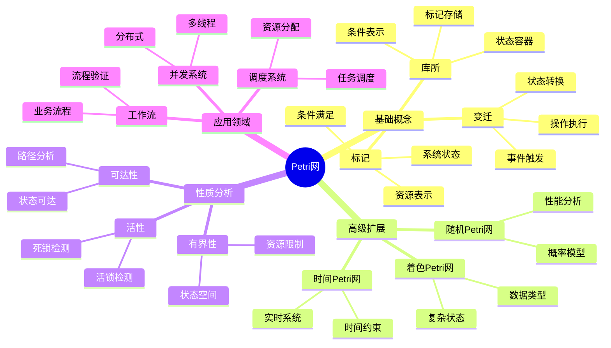

# 9.5 Petri网理论

> **子主题编号**: 09.5
> **主题**: 形式化理论
> **最后更新**: 2025-12-02
> **文档状态**: ✅ 完成

---

## 📋 目录

- [9.5 Petri网理论](#95-petri网理论)
  - [📋 目录](#-目录)
  - [1 概述](#1-概述)
    - [1.1 核心洞察](#11-核心洞察)
    - [1.2 Petri网特性](#12-petri网特性)
    - [1.3 形式化定义](#13-形式化定义)
    - [1.4 核心概念精确定义](#14-核心概念精确定义)
      - [1.4.1 库所（Place）](#141-库所place)
      - [1.4.2 变迁（Transition）](#142-变迁transition)
      - [1.4.3 标记（Marking）](#143-标记marking)
    - [1.5 设计原理与动机](#15-设计原理与动机)
      - [1.5.1 为什么Petri网适合并发系统？](#151-为什么petri网适合并发系统)
      - [1.5.2 Petri网与图灵机的等效性](#152-petri网与图灵机的等效性)
  - [2 思维导图](#2-思维导图)
  - [3 Petri网基础理论](#3-petri网基础理论)
    - [3.1 基本Petri网](#31-基本petri网)
    - [3.2 标记与变迁规则](#32-标记与变迁规则)
    - [3.3 Petri网性质](#33-petri网性质)
      - [3.3.1 可达性（Reachability）](#331-可达性reachability)
      - [3.3.2 活性（Liveness）](#332-活性liveness)
      - [3.3.3 有界性（Boundedness）](#333-有界性boundedness)
  - [4 Petri网与图灵机等效性](#4-petri网与图灵机等效性)
    - [4.1 计算能力证明](#41-计算能力证明)
    - [4.2 模拟图灵机](#42-模拟图灵机)
    - [4.3 计算复杂度](#43-计算复杂度)
  - [5 高级Petri网](#5-高级petri网)
    - [5.1 着色Petri网](#51-着色petri网)
    - [5.2 时间Petri网](#52-时间petri网)
    - [5.3 随机Petri网](#53-随机petri网)
  - [6 Petri网与类型系统映射](#6-petri网与类型系统映射)
    - [6.1 类型-库所映射](#61-类型-库所映射)
    - [6.2 函数-变迁映射](#62-函数-变迁映射)
    - [6.3 状态-标记映射](#63-状态-标记映射)
  - [7 关系属性与依赖分析](#7-关系属性与依赖分析)
    - [7.1 Petri网之间的关系](#71-petri网之间的关系)
      - [7.1.1 Petri网同态](#711-petri网同态)
      - [7.1.2 Petri网组合](#712-petri网组合)
    - [7.2 性质之间的关系](#72-性质之间的关系)
      - [7.2.1 性质依赖关系](#721-性质依赖关系)
      - [7.2.2 性质冲突](#722-性质冲突)
    - [7.3 约束关系](#73-约束关系)
      - [7.3.1 资源约束](#731-资源约束)
      - [7.3.2 时间约束](#732-时间约束)
  - [8 跨视角链接](#8-跨视角链接)
    - [8.1 形式语言视角关联](#81-形式语言视角关联)
    - [8.2 调度视角关联](#82-调度视角关联)
    - [8.3 工作流关联](#83-工作流关联)
  - [参考资源](#参考资源)

---

## 1 概述

### 1.1 核心洞察

Petri网（Petri Net）是一种**数学建模工具**，用于描述和分析**并发系统**。
Petri网与**图灵机等效**，具有相同的计算能力，能够模拟任何可计算的函数。
在工作流管理和调度系统中，Petri网提供了强大的建模和验证手段。

### 1.2 Petri网特性

| 特性 | 描述 | 应用场景 |
|------|------|---------|
| **并发建模** | 自然表示并发执行 | 多线程、分布式系统 |
| **同步机制** | 通过库所和变迁表示同步 | 进程同步、资源协调 |
| **冲突检测** | 识别资源竞争和死锁 | 死锁预防、资源管理 |
| **状态分析** | 可达性、活性、有界性分析 | 系统验证、正确性证明 |
| **图灵等效** | 与图灵机计算能力相同 | 通用计算模型 |

### 1.3 形式化定义

```text
基本Petri网 N = (P, T, F, W, M₀)

其中：
  P: 库所集合（Places，表示状态或条件）
  T: 变迁集合（Transitions，表示活动或事件）
  F: 流关系 F ⊆ (P × T) ∪ (T × P)
  W: 权重函数 W: F → ℕ⁺
  M₀: 初始标记（Initial Marking）M₀: P → ℕ

点火规则：
  变迁t使能（enabled）⟺ ∀p ∈ •t, M(p) ≥ W(p,t)

  点火后：
    M'(p) = M(p) - W(p,t) + W(t,p)
```

### 1.4 核心概念精确定义

#### 1.4.1 库所（Place）

**定义 1.1**：库所是Petri网中的**状态容器**，用于表示系统的状态或条件。

**形式化表述**：

```text
库所p ∈ P是一个状态变量，其值由标记（token）数量表示：
  M(p) ∈ ℕ 表示库所p中的标记数
```

**类型系统对应**：

- **库所** ↔ **类型**：库所表示状态类型
- **标记** ↔ **值**：标记表示类型的具体值
- **标记数** ↔ **值的数量**：多个值可以共享同一类型

#### 1.4.2 变迁（Transition）

**定义 1.2**：变迁是Petri网中的**状态转换操作**，表示系统从一种状态转换到另一种状态。

**形式化表述**：

```text
变迁t ∈ T是一个状态转换函数：
  t: M → M'

其中：
  •t = {p | (p, t) ∈ F} 是t的输入库所集合
  t• = {p | (t, p) ∈ F} 是t的输出库所集合
```

**类型系统对应**：

- **变迁** ↔ **函数**：变迁表示类型转换函数
- **输入库所** ↔ **函数参数类型**：输入库所对应函数参数
- **输出库所** ↔ **函数返回类型**：输出库所对应返回值

#### 1.4.3 标记（Marking）

**定义 1.3**：标记是Petri网在某个时刻的状态，由所有库所中的标记数组成。

**形式化表述**：

```text
标记M: P → ℕ 是一个函数，将每个库所映射到其标记数。

标记空间：
  M = {M | M: P → ℕ}

可达标记集合：
  R(N, M₀) = {M | M₀ →* M}

其中→*表示通过一系列变迁可达。
```

**类型系统对应**：

- **标记** ↔ **程序状态**：标记表示程序在某个时刻的状态
- **标记空间** ↔ **状态空间**：所有可能的状态集合
- **可达标记** ↔ **可达状态**：程序可以到达的状态

### 1.5 设计原理与动机

#### 1.5.1 为什么Petri网适合并发系统？

**核心优势**：

1. **自然并发表示**：

   ```text
   传统状态机：需要显式枚举所有并发状态组合
   Petri网：通过多个库所和变迁自然表示并发

   优势：状态空间大小从O(2^n)降低到O(n)
   ```

2. **同步机制直观**：

   ```text
   同步通过共享库所实现：
    多个变迁等待同一库所的标记
    当标记可用时，变迁可以并发执行
   ```

3. **冲突检测自动**：

   ```text
   冲突自动显现：
     如果多个变迁竞争同一标记，形成冲突
     可以通过分析自动检测死锁和活锁
   ```

#### 1.5.2 Petri网与图灵机的等效性

**定理 1.1**（Petri网-图灵机等效性）：

```text
Petri网与图灵机在计算能力上等效，即：
  1. 任何图灵机可计算的问题，Petri网也能计算
  2. 任何Petri网可表示的计算，图灵机也能表示

形式化表述：
  L(TM) = L(PN)

其中：
  L(TM)是图灵机可识别的语言集合
  L(PN)是Petri网可识别的语言集合
```

**证明思路**：

1. **Petri网模拟图灵机**：使用库所表示磁带位置，变迁表示状态转换
2. **图灵机模拟Petri网**：使用图灵机模拟Petri网的标记传播和变迁点火

**意义**：

- Petri网是**通用计算模型**
- 可以表示任何可计算的函数
- 在并发系统建模中比图灵机更直观

---

## 2 思维导图



---

## 3 Petri网基础理论

### 3.1 基本Petri网

**定义 3.1**（基本Petri网）：

```text
基本Petri网是一个三元组 N = (P, T, F)，其中：

  P: 库所集合，P ≠ ∅
  T: 变迁集合，T ≠ ∅
  P ∩ T = ∅（库所和变迁不相交）
  F ⊆ (P × T) ∪ (T × P) 是流关系
```

**图形表示**：

- 库所：圆圈 ○
- 变迁：方框 □ 或 竖线 |
- 弧：箭头 →

**示例**：

```text
简单顺序Petri网：
  P = {p₁, p₂, p₃}
  T = {t₁, t₂}
  F = {(p₁, t₁), (t₁, p₂), (p₂, t₂), (t₂, p₃)}

  图形：
    p₁ →[t₁]→ p₂ →[t₂]→ p₃
```

### 3.2 标记与变迁规则

**定义 3.2**（标记）：

```text
标记M: P → ℕ 是一个函数，将每个库所映射到非负整数。

标记的向量表示：
  M = [M(p₁), M(p₂), ..., M(pₙ)]

其中n = |P|是库所数量。
```

**定义 3.3**（变迁使能）：

```text
变迁t在标记M下使能，记作M[t⟩，当且仅当：
  ∀p ∈ •t: M(p) ≥ W(p, t)

其中W(p, t)是弧(p, t)的权重。
```

**定义 3.4**（变迁点火）：

```text
如果M[t⟩，则变迁t可以点火，产生新标记M'：
  M'[t⟩M'

标记更新规则：
  M'(p) = M(p) - W(p, t) + W(t, p)

其中：
  W(p, t)是输入弧权重（默认为1）
  W(t, p)是输出弧权重（默认为1）
```

**定理 3.1**（点火规则正确性）：

```text
点火规则保证标记守恒性：
  Σ_{p∈P} M'(p) = Σ_{p∈P} M(p) + (Σ_{p∈t•} W(t,p) - Σ_{p∈•t} W(p,t))

如果所有弧权重为1，则：
  Σ_{p∈P} M'(p) = Σ_{p∈P} M(p) + (|t•| - |•t|)
```

### 3.3 Petri网性质

#### 3.3.1 可达性（Reachability）

**定义 3.5**（可达性）：

```text
标记M'从M可达，记作M →* M'，当且仅当：
  存在变迁序列σ = t₁t₂...tₙ，使得：
    M[t₁⟩M₁[t₂⟩M₂...M_{n-1}[tₙ⟩M'
```

**可达性问题**：

```text
给定Petri网N和标记M, M'，判断M'是否从M可达。

复杂度：EXPSPACE-complete（一般情况）
特殊情况：有界Petri网是PSPACE-complete
```

#### 3.3.2 活性（Liveness）

**定义 3.6**（活性）：

```text
变迁t在标记M下是活的，当且仅当：
  从M可达的任何标记M'，都存在从M'可达的标记M''，使得M''[t⟩

Petri网N是活的，当且仅当：
  所有变迁在所有可达标记下都是活的
```

**活性级别**：

```text
L0: 死变迁（永远不能点火）
L1: 可能点火（存在可达标记使能）
L2: 可能重复点火（存在无限序列包含t）
L3: 最终可重复点火（从任何可达标记，t最终可重复点火）
L4: 活变迁（在任何可达标记下，t最终可点火）
```

#### 3.3.3 有界性（Boundedness）

**定义 3.7**（有界性）：

```text
库所p是k-有界的，当且仅当：
  在所有可达标记中，M(p) ≤ k

Petri网N是k-有界的，当且仅当：
  所有库所都是k-有界的

Petri网N是有界的，当且仅当：
  存在k使得N是k-有界的
```

**有界性意义**：

- **1-有界**：库所最多1个标记（安全Petri网）
- **k-有界**：库所最多k个标记（资源限制）
- **无界**：标记数可以无限增长（可能表示无限资源）

---

## 4 Petri网与图灵机等效性

### 4.1 计算能力证明

**定理 4.1**（Petri网计算能力）：

```text
Petri网可以模拟图灵机的计算过程，因此具有图灵机的计算能力。

证明策略：
  1. 构造Petri网模拟图灵机的磁带
  2. 使用库所表示磁带位置和状态
  3. 使用变迁表示状态转换规则
```

**构造方法**：

1. **磁带表示**：

   ```text
   为每个磁带位置p_i创建库所
   为每个符号s创建库所p_{i,s}
   标记p_{i,s}表示位置i包含符号s
   ```

2. **状态表示**：

   ```text
   为每个图灵机状态q创建库所p_q
   标记p_q表示当前状态为q
   ```

3. **转换规则**：

   ```text
   为每个转换规则δ(q, a) = (q', b, D)创建变迁t
   输入：p_q, p_{i,a}
   输出：p_{q'}, p_{i,b}, p_{i±1}（根据方向D）
   ```

### 4.2 模拟图灵机

**示例：模拟简单图灵机**

```text
图灵机M = (Q, Σ, Γ, δ, q₀, B, F)

其中：
  Q = {q₀, q₁, q_f}
  Σ = {0, 1}
  Γ = {0, 1, B}
  δ(q₀, 0) = (q₁, 1, R)
  δ(q₁, 1) = (q_f, 0, L)

对应的Petri网：
  P = {p_{q₀}, p_{q₁}, p_{q_f}, p_{0,0}, p_{0,1}, p_{0,B}, p_{1,0}, p_{1,1}, p_{1,B}}
  T = {t₁, t₂}

  t₁: (p_{q₀}, p_{0,0}) → (p_{q₁}, p_{0,1}, p_{1,B})
  t₂: (p_{q₁}, p_{1,1}) → (p_{q_f}, p_{1,0}, p_{0,B})
```

**定理 4.2**（模拟正确性）：

```text
如果图灵机M在输入w上接受，则对应的Petri网N在初始标记M₀下，
存在可达标记M_f使得M_f(p_{q_f}) > 0。

反之亦然。
```

### 4.3 计算复杂度

**定理 4.3**（Petri网复杂度）：

```text
Petri网的计算复杂度：

可达性问题：EXPSPACE-complete
有界性问题：EXPSPACE-complete
活性问题：EXPSPACE-complete

特殊情况（有界Petri网）：
  可达性：PSPACE-complete
  有界性：PSPACE-complete
  活性：PSPACE-complete
```

**与图灵机对比**：

```text
图灵机：
  停机问题：不可判定
  接受问题：不可判定（一般情况）

Petri网：
  可达性问题：可判定但复杂度高
  有界Petri网：许多问题可高效判定
```

---

## 5 高级Petri网

### 5.1 着色Petri网

**定义 5.1**（着色Petri网）：

```text
着色Petri网CPN = (P, T, F, C, W, G, E, M₀)

其中：
  C: 颜色集合（数据类型）
  W: 弧表达式（类型化标记）
  G: 守卫函数（变迁条件）
  E: 弧表达式函数
```

**类型系统对应**：

- **颜色集合** ↔ **类型系统**：颜色对应类型
- **标记颜色** ↔ **值类型**：标记携带类型信息
- **守卫函数** ↔ **类型约束**：守卫对应类型检查

### 5.2 时间Petri网

**定义 5.2**（时间Petri网）：

```text
时间Petri网TPN = (P, T, F, W, M₀, I)

其中：
  I: T → (Time, Time) 是时间间隔函数
  I(t) = [a, b] 表示变迁t必须在时间[a, b]内点火
```

**调度系统对应**：

- **时间间隔** ↔ **调度时间窗口**：变迁对应任务调度
- **时间约束** ↔ **截止时间**：时间间隔对应任务截止时间

### 5.3 随机Petri网

**定义 5.3**（随机Petri网）：

```text
随机Petri网SPN = (P, T, F, W, M₀, Λ)

其中：
  Λ: T → ℝ⁺ 是指数分布参数
  变迁t的点火时间服从指数分布Exp(Λ(t))
```

**性能分析应用**：

- **吞吐量分析**：计算系统吞吐量
- **延迟分析**：计算平均延迟
- **资源利用率**：计算资源利用率

---

## 6 Petri网与类型系统映射

### 6.1 类型-库所映射

**映射关系**：

```text
类型系统          Petri网
─────────────────────────────
类型T            ↔ 库所p_T
值v: T           ↔ 标记在p_T中
类型环境Γ        ↔ 标记M
类型检查         ↔ 变迁使能条件
类型转换         ↔ 变迁点火
```

**形式化映射**：

```text
类型-库所函子 F: Type → PetriNet

F(Unit) = p_unit
F(Int) = p_int
F(Bool) = p_bool
F(A × B) = p_A × p_B（乘积类型对应多个库所）
F(A → B) = 变迁t_{A→B}（函数对应变迁）
```

### 6.2 函数-变迁映射

**映射关系**：

```text
函数f: A → B 映射到变迁t_f：

输入库所：•t_f = {p_A}
输出库所：t_f• = {p_B}
权重：W(p_A, t_f) = 1, W(t_f, p_B) = 1
```

**函数组合**：

```text
如果f: A → B, g: B → C，则：
  g ∘ f 映射到变迁序列 t_f → t_g

类型系统：g(f(x)): C
Petri网：M[p_A⟩ →[t_f⟩M'[p_B⟩ →[t_g⟩M''[p_C⟩
```

### 6.3 状态-标记映射

**映射关系**：

```text
程序状态S映射到Petri网标记M：

变量x: T = v  ↔  M(p_T) = 1（标记在p_T中）
环境Γ = {x₁: T₁, ..., xₙ: Tₙ}  ↔  M = {p_{T₁}, ..., p_{Tₙ}}
```

**状态转换**：

```text
程序执行步骤：
  S → S'（通过执行语句）

对应Petri网：
  M →[t]→ M'（通过变迁点火）
```

---

## 7 关系属性与依赖分析

### 7.1 Petri网之间的关系

#### 7.1.1 Petri网同态

**定义 7.1**（Petri网同态）：

```text
Petri网同态h: N₁ → N₂是一个映射：
  h_P: P₁ → P₂（库所映射）
  h_T: T₁ → T₂（变迁映射）

满足：
  1. 保持流关系：如果(p, t) ∈ F₁，则(h_P(p), h_T(t)) ∈ F₂
  2. 保持标记：M₂(h_P(p)) = M₁(p)
```

**性质**：

- **同态保持可达性**：如果M₁ →_M₁'，则h(M₁) →_ h(M₁')
- **同态保持活性**：如果N₁是活的，则h(N₁)也是活的（在满足条件下）

#### 7.1.2 Petri网组合

**定义 7.2**（Petri网组合）：

```text
两个Petri网N₁和N₂可以组合：

1. 并行组合：N₁ || N₂
   - 库所：P₁ ∪ P₂
   - 变迁：T₁ ∪ T₂
   - 流关系：F₁ ∪ F₂

2. 顺序组合：N₁; N₂
   - 通过共享库所连接
   - N₁的输出库所连接到N₂的输入库所
```

### 7.2 性质之间的关系

#### 7.2.1 性质依赖关系

**定理 7.1**（性质依赖）：

```text
对于有界Petri网：
  活性 ⟹ 无死锁
  有界性 ⟹ 可达性可判定
  安全性 ⟹ 有界性（k=1）
```

**证明思路**：

- 如果Petri网是活的，则不存在死锁状态
- 如果有界，则状态空间有限，可达性可判定
- 如果安全（1-有界），则显然有界

#### 7.2.2 性质冲突

**定理 7.2**（性质冲突）：

```text
某些性质不能同时满足：

1. 无界性与安全性冲突：
   如果Petri网无界，则不可能安全

2. 完全活性与有界性可能冲突：
   某些无界Petri网才能实现完全活性
```

### 7.3 约束关系

#### 7.3.1 资源约束

**定义 7.3**（资源约束）：

```text
资源约束C限制库所中的标记数：
  C: P → ℕ

  约束：∀p ∈ P, M(p) ≤ C(p)
```

**调度系统对应**：

- **资源约束** ↔ **资源限制**：库所对应资源，标记对应资源使用量

#### 7.3.2 时间约束

**定义 7.4**（时间约束）：

```text
时间约束T限制变迁的点火时间：
  T: T → TimeInterval

  约束：变迁t必须在时间间隔T(t)内点火
```

**调度系统对应**：

- **时间约束** ↔ **截止时间**：变迁对应任务，时间间隔对应任务截止时间

---

## 8 跨视角链接

### 8.1 形式语言视角关联

- [范畴论视角](./09.1_范畴论视角.md) - Petri网的范畴语义
- [类型系统](../01_核心概念映射/01.1_基本类型单元.md) - 类型-库所映射
- [效应系统](../07_效应系统/) - 变迁-效应映射

### 8.2 调度视角关联

| Petri网概念 | 调度系统对应 | 映射说明 |
|------------|------------|---------|
| **库所** | 资源状态 | 资源可用性 |
| **变迁** | 调度动作 | 任务执行 |
| **标记** | 资源分配 | 资源使用量 |
| **可达性** | 调度可行性 | 任务可调度性 |
| **活性** | 无死锁 | 系统不会死锁 |
| **有界性** | 资源限制 | 资源使用上限 |

### 8.3 工作流关联

- [工作流调度](../30_工作流调度/README.md) - Petri网在工作流中的应用
- [工作流模式](../30_工作流调度/30.2_工作流模式.md) - WfMC 43种模式

---

## 参考资源

1. [Petri Net Theory and Applications](https://en.wikipedia.org/wiki/Petri_net)
2. [Workflow Patterns](http://www.workflowpatterns.com/)
3. [Colored Petri Nets](https://cpntools.org/)
4. [TINA Tool](http://projects.laas.fr/tina/) - Petri网分析工具

---

**返回**: [形式化理论主索引](./README.md) | [形式语言视角主索引](../README.md)
