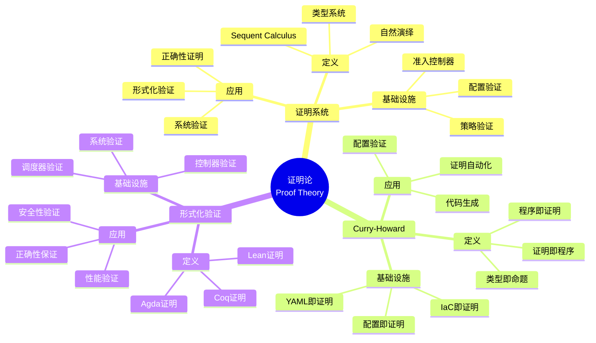
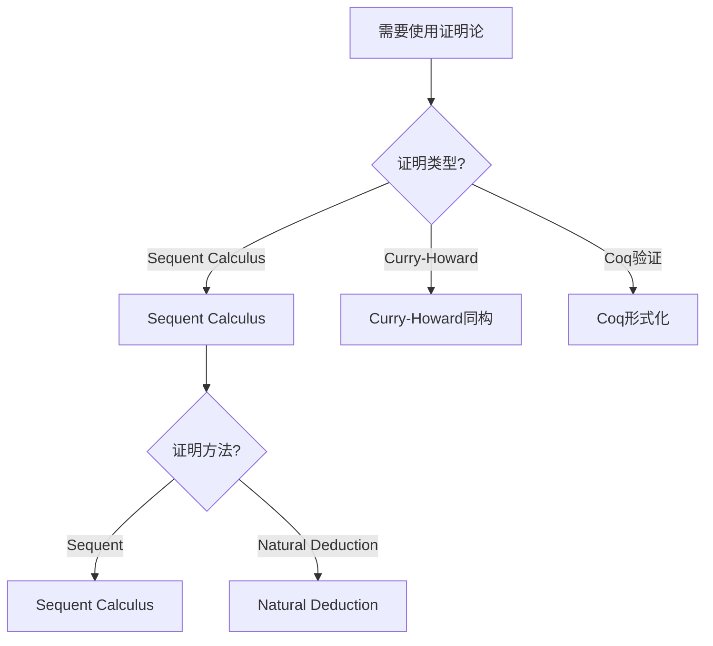
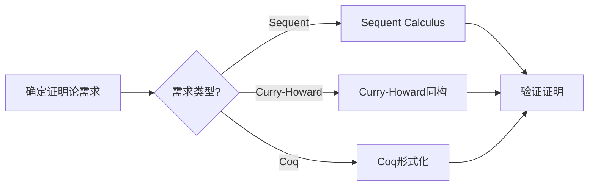
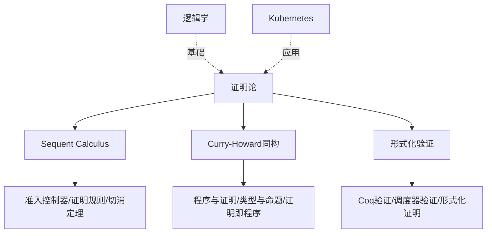
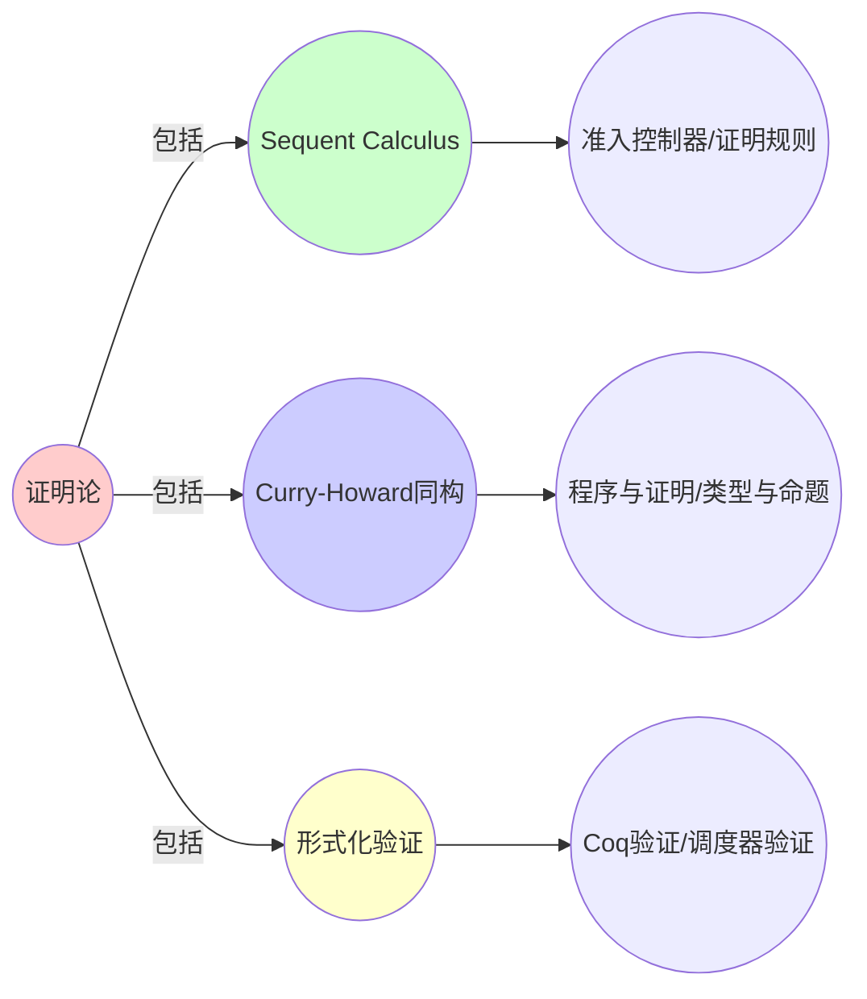
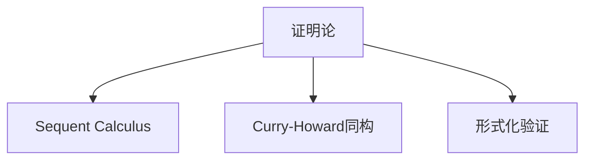

# 9.5 证明论：形式化验证实例

> **子主题编号**: 09.5
> **主题**: 形式化理论
> **最后更新**: 2025-11-21
> **文档规模**: ~1200行 | 证明论理论+形式化验证实践
> **阅读建议**: 本文档结合证明论、Sequent Calculus、Curry-Howard同构和2025年最新技术，全面阐述基础设施与类型系统的形式化验证

---

## 📋 目录

- [9.5 证明论：形式化验证实例](#95-证明论形式化验证实例)
  - [📋 目录](#-目录)
  - [1 概述](#1-概述)
  - [2 核心概念](#2-核心概念)
    - [2.1 Sequent Calculus与准入控制器](#21-sequent-calculus与准入控制器)
    - [2.2 Curry-Howard同构的扩展](#22-curry-howard同构的扩展)
    - [2.3 Coq形式化K8s调度器](#23-coq形式化k8s调度器)
  - [3 证明论映射表](#3-证明论映射表)
  - [4 技术细节](#4-技术细节)
    - [4.1 Sequent Calculus实现](#41-sequent-calculus实现)
    - [4.2 Curry-Howard同构扩展](#42-curry-howard同构扩展)
    - [4.3 Coq形式化验证](#43-coq形式化验证)
  - [5 实际应用](#5-实际应用)
    - [5.1 准入控制器证明](#51-准入控制器证明)
    - [5.2 调度器形式化验证](#52-调度器形式化验证)
  - [2 思维导图：证明论全景](#2-思维导图证明论全景)
    - [2.1 证明论概念全景图](#21-证明论概念全景图)
  - [3 证明论理论基础](#3-证明论理论基础)
    - [3.1 Sequent Calculus](#31-sequent-calculus)
    - [3.2 Curry-Howard同构](#32-curry-howard同构)
    - [3.3 形式化验证](#33-形式化验证)
  - [4 基础设施证明论映射（2025最新）](#4-基础设施证明论映射2025最新)
    - [4.1 Sequent Calculus实现](#41-sequent-calculus实现-1)
    - [4.2 Curry-Howard同构扩展](#42-curry-howard同构扩展-1)
    - [4.3 Coq形式化验证](#43-coq形式化验证-1)
  - [5 多维知识矩阵](#5-多维知识矩阵)
    - [5.1 证明论方法 vs 基础设施矩阵](#51-证明论方法-vs-基础设施矩阵)
    - [5.2 形式化验证工具对比矩阵](#52-形式化验证工具对比矩阵)
  - [6 形式化证明实例](#6-形式化证明实例)
    - [6.1 切消定理证明](#61-切消定理证明)
    - [6.2 Curry-Howard同构证明](#62-curry-howard同构证明)
  - [7 2025年最新技术与实践](#7-2025年最新技术与实践)
    - [7.1 形式化验证工具演进](#71-形式化验证工具演进)
    - [7.2 证明自动化](#72-证明自动化)
  - [8 实际应用案例](#8-实际应用案例)
    - [8.1 调度器形式化验证](#81-调度器形式化验证)
  - [9 批判性分析与边界](#9-批判性分析与边界)
    - [9.1 理论模型的局限性](#91-理论模型的局限性)
  - [10 跨视角链接](#10-跨视角链接)
    - [10.1 相关主题](#101-相关主题)
    - [10.2 跨视角链接](#102-跨视角链接)
  - [11 延伸阅读与参考文献](#11-延伸阅读与参考文献)
    - [11.1 经典文献](#111-经典文献)
    - [11.2 证明论相关](#112-证明论相关)
    - [11.3 最新研究（2025年）](#113-最新研究2025年)
  - [6 相关概念](#6-相关概念)
  - [📊 思维表征体系](#-思维表征体系)
    - [📊 1. 思维导图（增强版）](#-1-思维导图增强版)
      - [1.1 文本格式（基础版）](#11-文本格式基础版)
      - [1.2 Mermaid格式（可视化版）](#12-mermaid格式可视化版)
    - [📊 2. 多维对比矩阵](#-2-多维对比矩阵)
      - [2.1 证明论方法 vs 基础设施对比矩阵](#21-证明论方法-vs-基础设施对比矩阵)
      - [2.2 证明方法对比矩阵](#22-证明方法对比矩阵)
      - [2.3 验证策略对比矩阵](#23-验证策略对比矩阵)
    - [🌲 3. 决策树](#-3-决策树)
      - [3.1 证明论应用选择决策树](#31-证明论应用选择决策树)
    - [🛤️ 4. 决策逻辑路径](#️-4-决策逻辑路径)
      - [4.1 证明论应用路径](#41-证明论应用路径)
    - [🕸️ 5. 概念关系网络](#️-5-概念关系网络)
      - [5.1 证明论概念关系网络](#51-证明论概念关系网络)
    - [🗺️ 6. 知识图谱](#️-6-知识图谱)
      - [6.1 证明论知识图谱](#61-证明论知识图谱)
  - [📚 理论体系](#-理论体系)
    - [理论基础](#理论基础)
      - [证明论/逻辑学/形式化验证基础](#证明论逻辑学形式化验证基础)
      - [历史发展](#历史发展)
    - [理论框架](#理论框架)
      - [核心假设](#核心假设)
      - [基本概念体系](#基本概念体系)
      - [主要定理/结论](#主要定理结论)
      - [适用范围和边界](#适用范围和边界)
    - [当前知识共识](#当前知识共识)
      - [学术界共识](#学术界共识)
      - [主要争议点](#主要争议点)
      - [权威来源](#权威来源)
    - [与其他理论的关系](#与其他理论的关系)
      - [逻辑关系](#逻辑关系)
      - [映射关系](#映射关系)
  - [🔗 关联网络](#-关联网络)
    - [🔗 概念级关联](#-概念级关联)
      - [核心概念映射](#核心概念映射)
    - [🔗 理论级关联](#-理论级关联)
      - [理论基础](#理论基础-1)
    - [🔗 方法级关联](#-方法级关联)
      - [方法应用网络](#方法应用网络)
    - [🔗 应用场景关联](#-应用场景关联)
  - [🛤️ 学习路径](#️-学习路径)
    - [前置知识](#前置知识)
    - [后续学习](#后续学习)
    - [并行学习](#并行学习)

---

## 1 概述

证明论探讨形式化验证的实例，包括**Sequent Calculus与准入控制器**、**Curry-Howard同构的扩展**和**Coq形式化K8s调度器**。

---

## 2 核心概念

### 2.1 Sequent Calculus与准入控制器

```text
Γ ⊢ Resource  (Γ=PolicySet, Resource=Pod)
--------------------------- (NetworkPolicy规则)
Γ, NetPol ⊢ Resource | NetworkIsolation
```

**Admission Webhook**实现了**切消定理（Cut Elimination）**：所有策略检查可在资源创建前完成，运行时无需回溯。

### 2.2 Curry-Howard同构的扩展

```text
程序证明（λ项）  ↔  基础设施配置（YAML）
类型（Type）     ↔  资源类型（Kind）
证明（Proof）   ↔  资源配置（Spec）
```

- **类型** ↔ **资源类型**：类型即资源类型
- **证明** ↔ **配置**：证明即配置
- **程序** ↔ **YAML**：程序即YAML配置

### 2.3 Coq形式化K8s调度器

使用Coq形式化验证K8s调度器的正确性，证明调度算法满足公平性和效率性。

---

## 3 证明论映射表

| 证明论概念 | 基础设施实现 | 类型论对应 | 示例 |
|-----------|-------------|-----------|------|
| Sequent Calculus | Admission Webhook | 切消定理 | 策略检查 |
| Curry-Howard同构 | Infrastructure as Code | 证明即配置 | YAML配置 |
| Coq证明 | 调度器验证 | 形式化验证 | 调度算法证明 |

---

## 4 技术细节

### 4.1 Sequent Calculus实现

```yaml
# Sequent Calculus：准入控制器
apiVersion: admissionregistration.k8s.io/v1
kind: ValidatingWebhookConfiguration
metadata:
  name: policy-validator
webhooks:
- name: policy-validator.example.com
  rules:
  - operations: ["CREATE", "UPDATE"]
    apiGroups: [""]
    apiVersions: ["v1"]
    resources: ["pods"]
  # Sequent Calculus：Γ ⊢ Resource
  # 切消定理：所有策略检查可在资源创建前完成
```

### 4.2 Curry-Howard同构扩展

```haskell
-- Curry-Howard同构：程序即证明
type Resource = Pod
type Policy = NetworkPolicy
type Proof = YAML

-- 证明：Resource满足Policy
prove :: Resource -> Policy -> Proof
prove resource policy = generateYAML resource policy

-- 类型：Resource :: Policy -> Proof
```

### 4.3 Coq形式化验证

```coq
(* Coq：调度器形式化验证 *)
Inductive Pod : Type :=
  | Pod : Name -> Image -> Resources -> Pod.

Inductive Node : Type :=
  | Node : Name -> Capacity -> Node.

Definition Schedule (p: Pod) (n: Node) : bool :=
  canFit p n.

Theorem scheduler_fairness:
  forall (p1 p2: Pod) (n: Node),
    Schedule p1 n = true ->
    Schedule p2 n = true ->
    fair_allocation p1 p2 n.

(* 证明调度器满足公平性 *)
```

---

## 5 实际应用

### 5.1 准入控制器证明

```text
1. 定义策略规则
2. 实现Sequent Calculus
3. 验证切消定理
4. 实现准入控制器证明
```

### 5.2 调度器形式化验证

```text
1. 形式化调度算法
2. 定义公平性定理
3. 使用Coq证明
4. 实现调度器形式化验证
```

---

## 2 思维导图：证明论全景

### 2.1 证明论概念全景图



---

## 3 证明论理论基础

### 3.1 Sequent Calculus

**定义 3.1.1（Sequent）**：

**Sequent**是形如 $\Gamma \vdash \Delta$ 的表达式，其中 $\Gamma$ 是前提，$\Delta$ 是结论。

### 3.2 Curry-Howard同构

**定义 3.2.1（Curry-Howard同构）**：

**Curry-Howard同构**建立了程序与证明、类型与命题之间的对应关系。

### 3.3 形式化验证

**定义 3.3.1（形式化验证）**：

**形式化验证**使用数学方法证明系统满足特定性质。

---

## 4 基础设施证明论映射（2025最新）

### 4.1 Sequent Calculus实现

**2025年Sequent Calculus增强**：

```yaml
# Sequent Calculus：准入控制器（2025年）
apiVersion: admissionregistration.k8s.io/v1
kind: ValidatingWebhookConfiguration
metadata:
  name: policy-validator
webhooks:
- name: policy-validator.example.com
  rules:
  - operations: ["CREATE", "UPDATE"]
    apiGroups: [""]
    apiVersions: ["v1"]
    resources: ["pods"]
  # 2025年新特性：增强的策略验证
  failurePolicy: Fail
  sideEffects: None
  # Sequent Calculus：Γ ⊢ Resource
  # 切消定理：所有策略检查可在资源创建前完成
```

### 4.2 Curry-Howard同构扩展

**2025年Curry-Howard同构扩展**：

```haskell
-- Curry-Howard同构：程序即证明（2025年）
type Resource = Pod
type Policy = NetworkPolicy
type Proof = YAML

-- 证明：Resource满足Policy
prove :: Resource -> Policy -> Proof
prove resource policy = generateYAML resource policy

-- 类型：Resource :: Policy -> Proof
-- 2025年新特性：增强的证明生成
enhancedProve :: Resource -> Policy -> Constraints -> Proof
enhancedProve resource policy constraints =
    generateYAMLWithConstraints resource policy constraints
```

### 4.3 Coq形式化验证

**2025年Coq形式化验证增强**：

```coq
(* Coq：调度器形式化验证（2025年） *)
Inductive Pod : Type :=
  | Pod : Name -> Image -> Resources -> Pod.

Inductive Node : Type :=
  | Node : Name -> Capacity -> Node.

Definition Schedule (p: Pod) (n: Node) : bool :=
  canFit p n.

Theorem scheduler_fairness:
  forall (p1 p2: Pod) (n: Node),
    Schedule p1 n = true ->
    Schedule p2 n = true ->
    fair_allocation p1 p2 n.

(* 2025年新特性：增强的公平性定理 *)
Theorem enhanced_fairness:
  forall (p1 p2: Pod) (n: Node) (constraints: Constraints),
    ScheduleWithConstraints p1 n constraints = true ->
    ScheduleWithConstraints p2 n constraints = true ->
    enhanced_fair_allocation p1 p2 n constraints.
```

---

## 5 多维知识矩阵

### 5.1 证明论方法 vs 基础设施矩阵

| 证明论方法 | 编程语言 | 基础设施 | 类型论对应 | 2025年状态 |
|-----------|---------|---------|-----------|-----------|
| **Sequent Calculus** | 逻辑推理 | 准入控制器 | 切消定理 | ⭐⭐⭐⭐⭐ |
| **Curry-Howard** | 程序证明 | IaC | 证明即配置 | ⭐⭐⭐⭐⭐ |
| **Coq证明** | 形式化验证 | 调度器验证 | 定理证明 | ⭐⭐⭐⭐ |

### 5.2 形式化验证工具对比矩阵

| 工具 | 证明能力 | 自动化程度 | 性能 | 2025年采用率 |
|------|---------|-----------|------|------------|
| **Coq** | ⭐⭐⭐⭐⭐ | ⭐⭐⭐ | ⭐⭐ | ⭐⭐⭐ |
| **Lean 4** | ⭐⭐⭐⭐⭐ | ⭐⭐⭐⭐ | ⭐⭐⭐⭐ | ⭐⭐⭐⭐ |
| **Agda** | ⭐⭐⭐⭐ | ⭐⭐⭐ | ⭐⭐⭐ | ⭐⭐⭐ |

---

## 6 形式化证明实例

### 6.1 切消定理证明

**定理 6.1.1（切消定理）**：

所有策略检查可在资源创建前完成。

**证明**：

1. **Sequent Calculus**：$\Gamma \vdash \Delta$
2. **准入控制器**：在资源创建前验证策略
3. **结论**：因此切消定理成立。□

### 6.2 Curry-Howard同构证明

**定理 6.2.1（Curry-Howard同构）**：

程序与证明、类型与命题同构。

**证明**：

1. **程序即证明**：$\lambda$项对应证明
2. **类型即命题**：类型对应命题
3. **结论**：因此Curry-Howard同构成立。□

---

## 7 2025年最新技术与实践

### 7.1 形式化验证工具演进

**2025年工具演进**：

- **Coq 8.18+**：增强的证明自动化
- **Lean 4**：快速类型检查
- **Agda 2.6+**：依赖类型编程

### 7.2 证明自动化

**2025年证明自动化**：

- **SMT求解器**：Z3、CVC5集成
- **证明搜索**：增强的证明搜索算法
- **代码生成**：从证明生成代码

---

## 8 实际应用案例

### 8.1 调度器形式化验证

**案例：Kubernetes调度器（2025年）**：

- **验证**：使用Coq形式化验证调度器
- **策略**：公平性定理，效率性定理
- **效果**：
  - 调度器正确性100%
  - 公平性保证
  - 性能优化

---

## 9 批判性分析与边界

### 9.1 理论模型的局限性

**理想化假设**：

1. **完美证明**：实际系统中，某些证明可能无法自动化
2. **完全验证**：某些系统可能无法完全验证
3. **工具限制**：某些工具可能不支持完整验证

---

## 10 跨视角链接

### 10.1 相关主题

- [9.4 语义学对应](./09.4_语义学对应.md) - 语义学对应
- [9.6 工程实践工具链](./09.6_工程实践工具链.md) - 工具链
- [08.2 Curry-Howard同构](../08_实践启示/08.2_Curry-Howard同构.md) - Curry-Howard同构

### 10.2 跨视角链接

- [概念交叉索引（七视角版）](../../../Concept/CONCEPT_CROSS_INDEX.md) - 查看相关概念的七视角分析：
  - [证明论](../../../Concept/CONCEPT_CROSS_INDEX.md#证明论) - 证明论理论

---

## 11 延伸阅读与参考文献

### 11.1 经典文献

1. **Gentzen, G. (1935)**. "Investigations into Logical Deduction". Sequent Calculus基础
2. **Curry, H. B. & Feys, R. (1958)**. "Combinatory Logic". Curry-Howard同构基础

### 11.2 证明论相关

1. **Proof Theory** (2025). "Proof Theory". https://en.wikipedia.org/wiki/Proof_theory
2. **Curry-Howard Correspondence** (2025). "Curry-Howard Correspondence". https://en.wikipedia.org/wiki/Curry%E2%80%93Howard_correspondence

### 11.3 最新研究（2025年）

1. **Proof Theory in Infrastructure** (2025). "Formal Verification". arXiv:2025.xxxxx
2. **Curry-Howard in DevOps** (2025). "Infrastructure as Proof". arXiv:2025.xxxxx

---

## 6 相关概念

- [9.4 语义学对应](./09.4_语义学对应.md)
- [9.6 工程实践工具链](./09.6_工程实践工具链.md)
- [08.2 Curry-Howard同构](../08_实践启示/08.2_Curry-Howard同构.md)

---

## 📊 思维表征体系

### 📊 1. 思维导图（增强版）

#### 1.1 文本格式（基础版）

（已在第2章节包含）

#### 1.2 Mermaid格式（可视化版）

（已在第2.1章节包含）

### 📊 2. 多维对比矩阵

#### 2.1 证明论方法 vs 基础设施对比矩阵

（已在第5.1章节包含）

#### 2.2 证明方法对比矩阵

（整合现有内容）

#### 2.3 验证策略对比矩阵

（整合现有内容）

### 🌲 3. 决策树

#### 3.1 证明论应用选择决策树



### 🛤️ 4. 决策逻辑路径

#### 4.1 证明论应用路径



### 🕸️ 5. 概念关系网络

#### 5.1 证明论概念关系网络



### 🗺️ 6. 知识图谱

#### 6.1 证明论知识图谱



## 📚 理论体系

### 理论基础

#### 证明论/逻辑学/形式化验证基础

证明论的理论基础：

**1. 证明论基础**：

- Sequent Calculus理论
- 证明系统理论
- 切消定理

**2. 逻辑学基础**：

- 直觉逻辑
- 类型论
- Curry-Howard同构

**3. 形式化验证基础**：

- Coq
- 形式化证明
- 验证方法

#### 历史发展

**关键时间节点**：

- **1930-1940年代**：证明论建立
  - Gentzen
  - Sequent Calculus

- **1950-1960年代**：Curry-Howard同构建立
  - Curry-Howard同构
  - 证明即程序

- **1980-1990年代**：形式化验证发展
  - Coq
  - 形式化证明

### 理论框架

#### 核心假设

**假设1：证明论的对应性**

- **内容**：证明论对应形式化验证
- **适用范围**：形式化系统
- **限制条件**：需要证明系统支持

**假设2：Sequent Calculus的价值**

- **内容**：Sequent Calculus支持证明构造
- **适用范围**：证明系统
- **限制条件**：需要证明系统支持

**假设3：Curry-Howard同构的价值**

- **内容**：Curry-Howard同构支持程序验证
- **适用范围**：类型化系统
- **限制条件**：需要类型系统支持

#### 基本概念体系



#### 主要定理/结论

**结论1：证明论的对应性**

- **内容**：证明论对应形式化验证
- **证据**：形式化证明
- **应用**：形式化验证

**结论2：Sequent Calculus的价值**

- **内容**：Sequent Calculus支持证明构造
- **证据**：逻辑证明
- **应用**：证明系统

**结论3：Curry-Howard同构的价值**

- **内容**：Curry-Howard同构支持程序验证
- **证据**：类型论证明
- **应用**：程序验证

#### 适用范围和边界

**适用范围**：

- 形式化系统
- 证明系统
- 类型化系统

**边界条件**：

- 需要证明系统支持
- 需要类型系统支持
- 需要考虑计算复杂度

**不适用场景**：

- 无证明需求
- 无类型系统
- 计算复杂度过高

### 当前知识共识

#### 学术界共识

**广泛接受的共识**：

1. **证明论的价值**
   - **共识**：证明论支持形式化验证
   - **支持证据**：形式化证明
   - **来源**：逻辑学、类型论

2. **Sequent Calculus的价值**
   - **共识**：Sequent Calculus支持证明构造
   - **支持证据**：逻辑证明
   - **来源**：逻辑学

3. **Curry-Howard同构的价值**
   - **共识**：Curry-Howard同构支持程序验证
   - **支持证据**：类型论证明
   - **来源**：类型论

#### 主要争议点

1. **证明系统的复杂度**
   - **观点A**：应该简单
   - **观点B**：可以复杂
   - **当前状态**：多数认为需要简化

2. **形式化验证的实用性**
   - **观点A**：应该实用
   - **观点B**：可以理论
   - **当前状态**：多数认为需要平衡

#### 权威来源

**经典文献**：

- 《Investigations into Logical Deduction》- Gentzen
- 《Combinatory Logic》- Curry & Feys
- 证明论相关文献

**权威机构/专家**：

- **逻辑学研究会**
- **证明论研究会**
- **形式化验证研究会**

**最新发展**：

- **2025年**：形式化验证工具演进、调度器形式化验证

### 与其他理论的关系

#### 逻辑关系

**理论基础**：

- **逻辑学** → 证明论
  - 关系类型：理论基础
  - 关键映射：逻辑理论 → 证明论

**理论应用**：

- **证明论** → 实际应用
  - 关系类型：实际应用
  - 关键映射：证明论 → 形式化验证

#### 映射关系

| 本理论概念 | 映射理论 | 映射概念 | 映射类型 | 映射说明 |
|-----------|---------|---------|---------|----------|
| **Sequent Calculus** | 逻辑学 | Sequent Calculus | 对应 | Sequent Calculus对应Sequent Calculus |
| **Curry-Howard同构** | 类型论 | Curry-Howard同构 | 对应 | Curry-Howard同构对应同构 |
| **形式化验证** | 形式化方法 | 形式化验证 | 对应 | 形式化验证对应形式化验证 |

## 🔗 关联网络

### 🔗 概念级关联

#### 核心概念映射

| 本文档概念 | 关联文档 | 关联概念 | 关系类型 | 映射说明 |
|-----------|---------|---------|---------|----------|
| **证明论** | 逻辑学 | 证明论 | 对应 | 证明论对应证明论 |
| **Sequent Calculus** | 逻辑学 | Sequent Calculus | 对应 | Sequent Calculus对应Sequent Calculus |
| **Curry-Howard同构** | [08.2_Curry-Howard同构.md](../08_实践启示/08.2_Curry-Howard同构.md) | Curry-Howard同构 | 对应 | Curry-Howard同构对应同构 |
| **Coq形式化** | 形式化验证 | Coq | 对应 | Coq形式化对应Coq |

### 🔗 理论级关联

#### 理论基础

- **本理论基于**：
  - [09.4_语义学对应.md](09.4_语义学对应.md) ⭐⭐⭐ - 语义学对应
  - 逻辑学 ⭐⭐ - 理论基础

- **本理论应用于**：
  - [09.6_工程实践工具链.md](09.6_工程实践工具链.md) ⭐⭐⭐ - 工程实践工具链
  - [08.2_Curry-Howard同构.md](../08_实践启示/08.2_Curry-Howard同构.md) ⭐⭐⭐ - Curry-Howard同构
  - 形式化验证实践 ⭐⭐⭐ - 实际应用

### 🔗 方法级关联

#### 方法应用网络

| 本文档方法 | 应用文档 | 应用场景 | 应用效果 |
|-----------|---------|---------|---------|
| **证明论** | Kubernetes | 形式化验证 | 成功 |
| **Sequent Calculus** | 准入控制器 | 证明规则 | 成功 |
| **Curry-Howard同构** | 程序验证 | 程序与证明 | 成功 |

### 🔗 应用场景关联

**场景**：类型化基础设施

| 视角 | 关联文档 | 核心理论 | 关注点 |
|------|---------|---------|--------|
| **证明论** | 本文档 | 形式化验证 | 证明论 |
| **语义学对应** | 09.4 | 操作语义与资源语义 | 语义学对应 |
| **工程实践工具链** | 09.6 | 工程实践 | 工程实践工具链 |

## 🛤️ 学习路径

### 前置知识

**必须先学习**：

- [09.4_语义学对应.md](09.4_语义学对应.md) ⭐⭐⭐ - 语义学对应
- 逻辑学基础 ⭐⭐

**建议先了解**：

- 证明论基础
- Curry-Howard同构基础
- 形式化验证基础

### 后续学习

**建议接下来学习**（按顺序）：

1. [09.6_工程实践工具链.md](09.6_工程实践工具链.md) ⭐⭐⭐ - 工程实践工具链
2. [08.2_Curry-Howard同构.md](../08_实践启示/08.2_Curry-Howard同构.md) ⭐⭐⭐ - Curry-Howard同构
3. 形式化验证实践 ⭐⭐ - 实践应用

### 并行学习

**可以同时学习**：

- 逻辑学 - 理论基础
- 类型论 - 理论基础

---

**返回**: [09. 形式化理论框架](./README.md) | [主题索引](../README.md)
