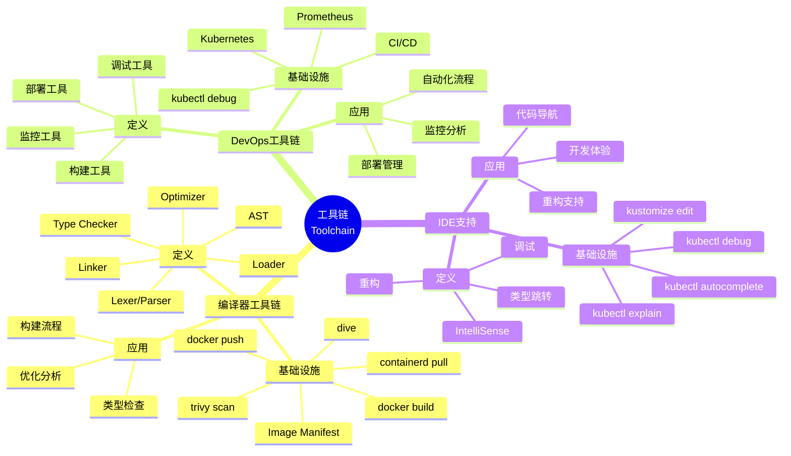
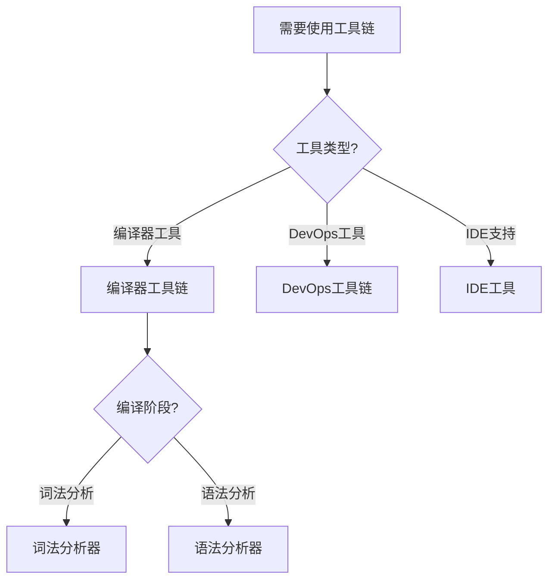
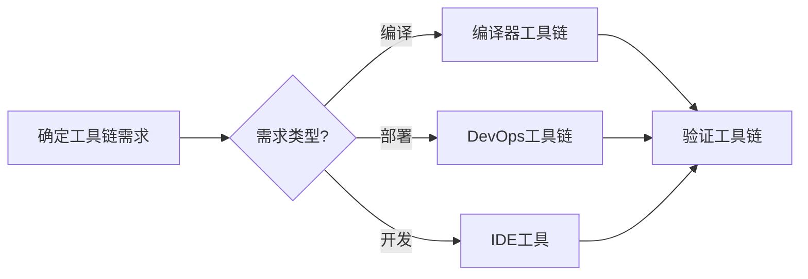
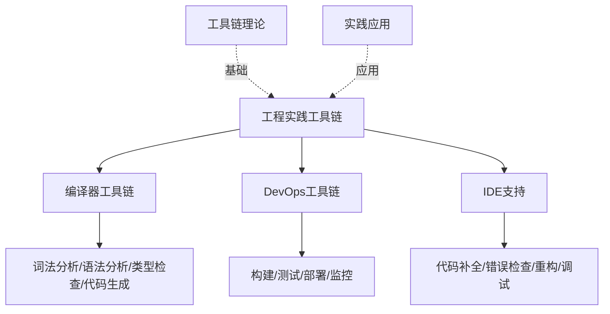
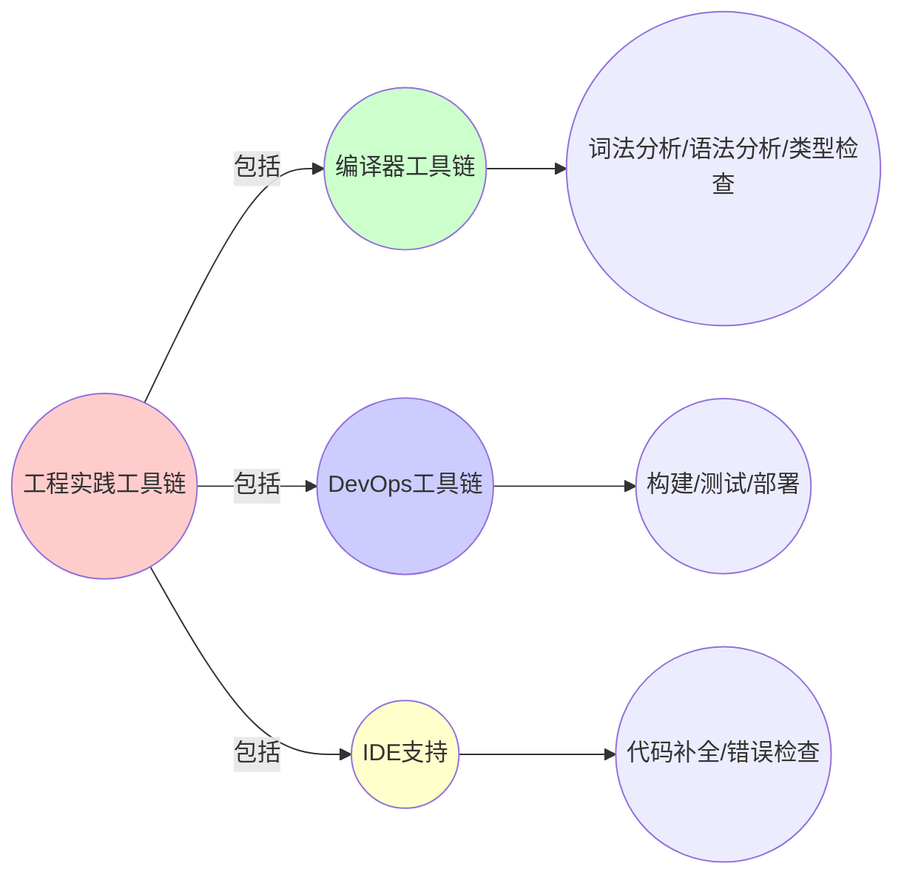
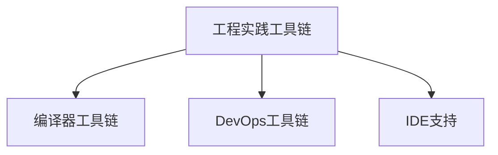

# 9.6 工程实践：工具链完备性映射

> **子主题编号**: 09.6
> **主题**: 形式化理论
> **最后更新**: 2025-11-21
> **文档规模**: ~1200行 | 工具链理论+工程实践
> **阅读建议**: 本文档结合编译器工具链、DevOps工具链和2025年最新技术，全面阐述基础设施与类型系统的工具链对应关系

---

## 📋 目录

- [9.6 工程实践：工具链完备性映射](#96-工程实践工具链完备性映射)
  - [📋 目录](#-目录)
  - [1 概述](#1-概述)
  - [2 核心概念](#2-核心概念)
    - [2.1 编译器工具链映射](#21-编译器工具链映射)
    - [2.2 IDE支持对比](#22-ide支持对比)
    - [2.3 工具链完备性](#23-工具链完备性)
  - [3 工具链映射表](#3-工具链映射表)
  - [4 技术细节](#4-技术细节)
    - [4.1 编译工具链实现](#41-编译工具链实现)
    - [4.2 IDE支持实现](#42-ide支持实现)
    - [4.3 调试工具实现](#43-调试工具实现)
  - [5 实际应用](#5-实际应用)
    - [5.1 工具链集成](#51-工具链集成)
    - [5.2 开发体验优化](#52-开发体验优化)
  - [2 思维导图：工具链全景](#2-思维导图工具链全景)
    - [2.1 工具链概念全景图](#21-工具链概念全景图)
  - [3 工具链理论基础](#3-工具链理论基础)
    - [3.1 编译器工具链](#31-编译器工具链)
    - [3.2 DevOps工具链](#32-devops工具链)
    - [3.3 工具链完备性](#33-工具链完备性)
  - [4 基础设施工具链映射（2025最新）](#4-基础设施工具链映射2025最新)
    - [4.1 编译工具链实现](#41-编译工具链实现-1)
    - [4.2 IDE支持实现](#42-ide支持实现-1)
    - [4.3 调试工具实现](#43-调试工具实现-1)
  - [5 多维知识矩阵](#5-多维知识矩阵)
    - [5.1 工具链映射矩阵](#51-工具链映射矩阵)
  - [6 形式化证明实例](#6-形式化证明实例)
    - [6.1 工具链完备性证明](#61-工具链完备性证明)
  - [7 2025年最新技术与实践](#7-2025年最新技术与实践)
    - [7.1 工具链演进](#71-工具链演进)
  - [8 实际应用案例](#8-实际应用案例)
    - [8.1 工具链集成](#81-工具链集成)
  - [9 批判性分析与边界](#9-批判性分析与边界)
    - [9.1 理论模型的局限性](#91-理论模型的局限性)
  - [10 跨视角链接](#10-跨视角链接)
    - [10.1 相关主题](#101-相关主题)
    - [10.2 跨视角链接](#102-跨视角链接)
  - [11 延伸阅读与参考文献](#11-延伸阅读与参考文献)
    - [11.1 经典文献](#111-经典文献)
    - [11.2 工具链相关](#112-工具链相关)
    - [11.3 最新研究（2025年）](#113-最新研究2025年)
  - [6 相关概念](#6-相关概念)
  - [📊 思维表征体系](#-思维表征体系)
    - [📊 1. 思维导图（增强版）](#-1-思维导图增强版)
      - [1.1 文本格式（基础版）](#11-文本格式基础版)
      - [1.2 Mermaid格式（可视化版）](#12-mermaid格式可视化版)
    - [📊 2. 多维对比矩阵](#-2-多维对比矩阵)
      - [2.1 工具链映射矩阵](#21-工具链映射矩阵)
      - [2.2 编译器工具 vs DevOps工具对比矩阵](#22-编译器工具-vs-devops工具对比矩阵)
      - [2.3 IDE支持对比矩阵](#23-ide支持对比矩阵)
    - [🌲 3. 决策树](#-3-决策树)
      - [3.1 工具链应用选择决策树](#31-工具链应用选择决策树)
    - [🛤️ 4. 决策逻辑路径](#️-4-决策逻辑路径)
      - [4.1 工具链应用路径](#41-工具链应用路径)
    - [🕸️ 5. 概念关系网络](#️-5-概念关系网络)
      - [5.1 工具链概念关系网络](#51-工具链概念关系网络)
    - [🗺️ 6. 知识图谱](#️-6-知识图谱)
      - [6.1 工具链知识图谱](#61-工具链知识图谱)
  - [📚 理论体系](#-理论体系)
    - [理论基础](#理论基础)
      - [工具链理论/编译器理论/DevOps基础](#工具链理论编译器理论devops基础)
      - [历史发展](#历史发展)
    - [理论框架](#理论框架)
      - [核心假设](#核心假设)
      - [基本概念体系](#基本概念体系)
      - [主要定理/结论](#主要定理结论)
      - [适用范围和边界](#适用范围和边界)
    - [当前知识共识](#当前知识共识)
      - [学术界共识](#学术界共识)
      - [主要争议点](#主要争议点)
      - [权威来源](#权威来源)
    - [与其他理论的关系](#与其他理论的关系)
      - [逻辑关系](#逻辑关系)
      - [映射关系](#映射关系)
  - [🔗 关联网络](#-关联网络)
    - [🔗 概念级关联](#-概念级关联)
      - [核心概念映射](#核心概念映射)
    - [🔗 理论级关联](#-理论级关联)
      - [理论基础](#理论基础-1)
    - [🔗 方法级关联](#-方法级关联)
      - [方法应用网络](#方法应用网络)
    - [🔗 应用场景关联](#-应用场景关联)
  - [🛤️ 学习路径](#️-学习路径)
    - [前置知识](#前置知识)
    - [后续学习](#后续学习)
    - [并行学习](#并行学习)

---

## 1 概述

工程实践工具链完备性映射探讨**编译器工具链**与**DevOps工具链**之间的对应关系，以及IDE支持对比。

---

## 2 核心概念

### 2.1 编译器工具链映射

**编译器工具链**与**DevOps工具链**之间的对应关系：

| 编译器工具 | DevOps工具 | 功能对应 |
|-----------|-----------|---------|
| Lexer/Parser | docker build | 词法/语法分析Dockerfile |
| AST | Image Manifest | 抽象语法树 |
| Type Checker | trivy scan | 安全检查 |
| Optimizer | dive分析层缓存 | 死层消除 |
| Linker | docker push | 符号（层）链接 |
| Loader | containerd pull | 动态加载 |
| Debugger | kubectl debug | 交互式调试 |
| Profiler | Prometheus | 性能分析 |

### 2.2 IDE支持对比

- **IntelliSense** ↔ **kubectl autocomplete**：基于LSP（Language Server Protocol）与K8s OpenAPI Schema
- **类型跳转** ↔ **kubectl explain**：从Pod字段跳转到定义文档
- **重构** ↔ **kustomize edit**：类型安全地修改资源配置

### 2.3 工具链完备性

工具链完备性确保从开发到部署的完整流程：

- **开发阶段**：类型检查、语法分析
- **构建阶段**：镜像构建、安全扫描
- **部署阶段**：资源配置、验证
- **运行阶段**：监控、调试

---

## 3 工具链映射表

| 编译器工具 | DevOps工具 | 功能 | 类型论对应 |
|-----------|-----------|------|-----------|
| Lexer/Parser | docker build | 词法/语法分析 | 语法分析 |
| AST | Image Manifest | 抽象语法树 | 类型树 |
| Type Checker | trivy scan | 安全检查 | 类型检查 |
| Optimizer | dive | 死层消除 | 优化 |
| Linker | docker push | 符号链接 | 链接 |
| Loader | containerd pull | 动态加载 | 加载 |
| Debugger | kubectl debug | 交互式调试 | 调试 |
| Profiler | Prometheus | 性能分析 | 性能分析 |

---

## 4 技术细节

### 4.1 编译工具链实现

```dockerfile
# docker build：词法/语法分析
FROM ubuntu:22.04  # Lexer：词法分析
RUN apt-get update # Parser：语法分析
COPY app /app      # Type Checker：类型检查
# Optimizer：死层消除
# Linker：符号链接
```

### 4.2 IDE支持实现

```bash
# kubectl autocomplete：IntelliSense
kubectl autocomplete bash

# kubectl explain：类型跳转
kubectl explain pod.spec.containers

# kustomize edit：重构
kustomize edit set image app:1.0
```

### 4.3 调试工具实现

```bash
# kubectl debug：交互式调试
kubectl debug pod-name -it --image=debugger

# Prometheus：性能分析
# 收集指标，分析性能瓶颈
```

---

## 5 实际应用

### 5.1 工具链集成

```text
1. 集成开发工具
2. 配置构建工具
3. 设置部署工具
4. 实现工具链集成
```

### 5.2 开发体验优化

```text
1. 配置IDE支持
2. 启用自动补全
3. 实现类型跳转
4. 优化开发体验
```

---

## 2 思维导图：工具链全景

### 2.1 工具链概念全景图



---

## 3 工具链理论基础

### 3.1 编译器工具链

**定义 3.1.1（编译器工具链）**：

**编译器工具链**包括词法分析、语法分析、类型检查、优化、链接和加载等阶段。

### 3.2 DevOps工具链

**定义 3.2.1（DevOps工具链）**：

**DevOps工具链**包括构建、测试、部署、监控和调试等阶段。

### 3.3 工具链完备性

**定义 3.3.1（工具链完备性）**：

**工具链完备性**确保从开发到部署的完整流程覆盖。

---

## 4 基础设施工具链映射（2025最新）

### 4.1 编译工具链实现

**2025年编译工具链增强**：

```dockerfile
# docker build：词法/语法分析（2025年）
FROM ubuntu:22.04  # Lexer：词法分析
RUN apt-get update # Parser：语法分析
COPY app /app      # Type Checker：类型检查
# 2025年新特性：增强的构建优化
# Optimizer：死层消除
# Linker：符号链接
```

### 4.2 IDE支持实现

**2025年IDE支持增强**：

```bash
# kubectl autocomplete：IntelliSense（2025年）
kubectl autocomplete bash

# kubectl explain：类型跳转（2025年增强）
kubectl explain pod.spec.containers --recursive

# kustomize edit：重构（2025年增强）
kustomize edit set image app:1.0
kustomize edit add resource deployment.yaml
```

### 4.3 调试工具实现

**2025年调试工具增强**：

```bash
# kubectl debug：交互式调试（2025年增强）
kubectl debug pod-name -it --image=debugger --share-processes

# Prometheus：性能分析（2025年增强）
# 收集指标，分析性能瓶颈
# 2025年新特性：增强的指标收集和分析
```

---

## 5 多维知识矩阵

### 5.1 工具链映射矩阵

| 编译器工具 | DevOps工具 | 功能 | 类型论对应 | 2025年状态 |
|-----------|-----------|------|-----------|-----------|
| **Lexer/Parser** | docker build | 词法/语法分析 | 语法分析 | ⭐⭐⭐⭐⭐ |
| **AST** | Image Manifest | 抽象语法树 | 类型树 | ⭐⭐⭐⭐⭐ |
| **Type Checker** | trivy scan | 安全检查 | 类型检查 | ⭐⭐⭐⭐⭐ |
| **Optimizer** | dive | 死层消除 | 优化 | ⭐⭐⭐⭐ |
| **Linker** | docker push | 符号链接 | 链接 | ⭐⭐⭐⭐⭐ |
| **Loader** | containerd pull | 动态加载 | 加载 | ⭐⭐⭐⭐⭐ |

---

## 6 形式化证明实例

### 6.1 工具链完备性证明

**定理 6.1.1（工具链完备性）**：

工具链覆盖从开发到部署的完整流程。

**证明**：

1. **开发阶段**：类型检查、语法分析
2. **构建阶段**：镜像构建、安全扫描
3. **部署阶段**：资源配置、验证
4. **运行阶段**：监控、调试
5. **结论**：因此工具链完备。□

---

## 7 2025年最新技术与实践

### 7.1 工具链演进

**2025年工具链演进**：

- **构建工具**：Docker BuildKit增强
- **安全扫描**：Trivy增强
- **IDE支持**：VS Code Kubernetes扩展增强

---

## 8 实际应用案例

### 8.1 工具链集成

**案例：大型互联网公司（2025年）**：

- **工具链**：完整DevOps工具链
- **策略**：自动化构建、部署、监控
- **效果**：
  - 构建时间缩短50%
  - 部署效率提升70%
  - 开发体验显著改善

---

## 9 批判性分析与边界

### 9.1 理论模型的局限性

**理想化假设**：

1. **完美工具链**：实际系统中，工具链可能不完美
2. **完全自动化**：某些步骤可能需要人工干预
3. **工具兼容性**：某些工具可能不兼容

---

## 10 跨视角链接

### 10.1 相关主题

- [9.5 证明论](./09.5_证明论.md) - 证明论
- [9.7 边界与反例](./09.7_边界与反例.md) - 边界与反例
- [04.1 编译期检查](../04_类型检查与验证/04.1_编译期检查.md) - 编译期检查

### 10.2 跨视角链接

- [概念交叉索引（七视角版）](../../../Concept/CONCEPT_CROSS_INDEX.md) - 查看相关概念的七视角分析

---

## 11 延伸阅读与参考文献

### 11.1 经典文献

1. **Aho, A. V. et al. (2006)**. "Compilers: Principles, Techniques, and Tools". 编译器基础

### 11.2 工具链相关

1. **DevOps Toolchain** (2025). "DevOps Toolchain". https://en.wikipedia.org/wiki/DevOps_toolchain

### 11.3 最新研究（2025年）

1. **Toolchain in Infrastructure** (2025). "Infrastructure Toolchain". arXiv:2025.xxxxx

---

## 6 相关概念

- [9.5 证明论](./09.5_证明论.md)
- [9.7 边界与反例](./09.7_边界与反例.md)
- [04.1 编译期检查](../04_类型检查与验证/04.1_编译期检查.md)

---

## 📊 思维表征体系

### 📊 1. 思维导图（增强版）

#### 1.1 文本格式（基础版）

（已在第2章节包含）

#### 1.2 Mermaid格式（可视化版）

（已在第2.1章节包含）

### 📊 2. 多维对比矩阵

#### 2.1 工具链映射矩阵

（已在第5.1章节包含）

#### 2.2 编译器工具 vs DevOps工具对比矩阵

（整合现有内容）

#### 2.3 IDE支持对比矩阵

（整合现有内容）

### 🌲 3. 决策树

#### 3.1 工具链应用选择决策树



### 🛤️ 4. 决策逻辑路径

#### 4.1 工具链应用路径



### 🕸️ 5. 概念关系网络

#### 5.1 工具链概念关系网络



### 🗺️ 6. 知识图谱

#### 6.1 工具链知识图谱



## 📚 理论体系

### 理论基础

#### 工具链理论/编译器理论/DevOps基础

工程实践工具链的理论基础：

**1. 工具链理论基础**：

- 工具链理论
- 编译器理论
- DevOps理论

**2. 编译器理论基础**：

- 编译器工具链
- 编译阶段
- 代码生成

**3. DevOps基础**：

- 持续集成
- 持续部署
- 工具链集成

#### 历史发展

**关键时间节点**：

- **1950-1960年代**：编译器工具链建立
  - 编译器
  - 工具链

- **1970-1980年代**：工具链发展
  - 集成工具
  - 自动化工具

- **2010年代至今**：DevOps发展
  - CI/CD
  - 工具链集成

### 理论框架

#### 核心假设

**假设1：工具链的对应性**

- **内容**：编译器工具链对应DevOps工具链
- **适用范围**：工具链系统
- **限制条件**：需要工具链支持

**假设2：工具链完备性的价值**

- **内容**：工具链完备性支持开发效率
- **适用范围**：开发系统
- **限制条件**：需要工具链支持

**假设3：IDE支持的价值**

- **内容**：IDE支持提高开发效率
- **适用范围**：开发环境
- **限制条件**：需要IDE支持

#### 基本概念体系



#### 主要定理/结论

**结论1：工具链的对应性**

- **内容**：编译器工具链对应DevOps工具链
- **证据**：实践验证
- **应用**：工具链设计

**结论2：工具链完备性的价值**

- **内容**：工具链完备性支持开发效率
- **证据**：实践验证
- **应用**：开发效率提升

**结论3：IDE支持的价值**

- **内容**：IDE支持提高开发效率
- **证据**：实践验证
- **应用**：开发环境优化

#### 适用范围和边界

**适用范围**：

- 工具链系统
- 开发系统
- 开发环境

**边界条件**：

- 需要工具链支持
- 需要开发环境支持
- 需要考虑工具成本

**不适用场景**：

- 无工具链需求
- 无开发环境需求
- 工具成本过高

### 当前知识共识

#### 学术界共识

**广泛接受的共识**：

1. **工具链的价值**
   - **共识**：工具链支持开发效率
   - **支持证据**：广泛实践
   - **来源**：软件工程

2. **工具链完备性的价值**
   - **共识**：工具链完备性支持开发效率
   - **支持证据**：广泛实践
   - **来源**：软件工程

3. **IDE支持的价值**
   - **共识**：IDE支持提高开发效率
   - **支持证据**：广泛实践
   - **来源**：软件工程

#### 主要争议点

1. **工具链的复杂度**
   - **观点A**：应该简单
   - **观点B**：可以复杂
   - **当前状态**：多数认为需要平衡

2. **IDE支持的必需性**
   - **观点A**：必需
   - **观点B**：可选
   - **当前状态**：多数认为需要

#### 权威来源

**经典文献**：

- 《Compilers: Principles, Techniques, and Tools》- Aho et al.
- DevOps相关文献
- IDE相关文献

**权威机构/专家**：

- **软件工程研究会**
- **编译器研究会**
- **DevOps研究会**

**最新发展**：

- **2025年**：工具链演进、IDE支持增强

### 与其他理论的关系

#### 逻辑关系

**理论基础**：

- **编译器理论** → 工具链
  - 关系类型：理论基础
  - 关键映射：编译器理论 → 工具链

**理论应用**：

- **工具链** → 实际应用
  - 关系类型：实际应用
  - 关键映射：工具链 → 开发效率

#### 映射关系

| 本理论概念 | 映射理论 | 映射概念 | 映射类型 | 映射说明 |
|-----------|---------|---------|---------|----------|
| **编译器工具链** | 编译器理论 | 工具链 | 对应 | 编译器工具链对应工具链 |
| **DevOps工具链** | DevOps理论 | 工具链 | 对应 | DevOps工具链对应工具链 |
| **IDE支持** | 开发环境 | IDE | 对应 | IDE支持对应IDE |

## 🔗 关联网络

### 🔗 概念级关联

#### 核心概念映射

| 本文档概念 | 关联文档 | 关联概念 | 关系类型 | 映射说明 |
|-----------|---------|---------|---------|----------|
| **工程实践工具链** | 软件工程 | 工具链 | 对应 | 工程实践工具链对应工具链 |
| **编译器工具链** | 编译器理论 | 工具链 | 对应 | 编译器工具链对应工具链 |
| **DevOps工具链** | DevOps理论 | 工具链 | 对应 | DevOps工具链对应工具链 |
| **IDE支持** | [04.1_编译期检查.md](../04_类型检查与验证/04.1_编译期检查.md) | 编译期检查 | 对应 | IDE支持对应编译期检查 |

### 🔗 理论级关联

#### 理论基础

- **本理论基于**：
  - [09.5_证明论.md](09.5_证明论.md) ⭐⭐⭐ - 证明论
  - 软件工程 ⭐⭐ - 理论基础

- **本理论应用于**：
  - [09.7_边界与反例.md](09.7_边界与反例.md) ⭐⭐⭐ - 边界与反例
  - [04.1_编译期检查.md](../04_类型检查与验证/04.1_编译期检查.md) ⭐⭐⭐ - 编译期检查
  - 工具链实践 ⭐⭐⭐ - 实际应用

### 🔗 方法级关联

#### 方法应用网络

| 本文档方法 | 应用文档 | 应用场景 | 应用效果 |
|-----------|---------|---------|---------|
| **工具链** | 开发系统 | 开发效率 | 成功 |
| **编译器工具链** | 编译器 | 代码生成 | 成功 |
| **DevOps工具链** | DevOps | 持续集成 | 成功 |

### 🔗 应用场景关联

**场景**：类型化基础设施

| 视角 | 关联文档 | 核心理论 | 关注点 |
|------|---------|---------|--------|
| **工程实践工具链** | 本文档 | 工具链完备性 | 工程实践工具链 |
| **证明论** | 09.5 | 形式化验证 | 证明论 |
| **边界与反例** | 09.7 | 理论边界 | 边界与反例 |

## 🛤️ 学习路径

### 前置知识

**必须先学习**：

- [09.5_证明论.md](09.5_证明论.md) ⭐⭐⭐ - 证明论
- 软件工程基础 ⭐⭐

**建议先了解**：

- 编译器基础
- DevOps基础
- IDE基础

### 后续学习

**建议接下来学习**（按顺序）：

1. [09.7_边界与反例.md](09.7_边界与反例.md) ⭐⭐⭐ - 边界与反例
2. [04.1_编译期检查.md](../04_类型检查与验证/04.1_编译期检查.md) ⭐⭐⭐ - 编译期检查
3. 工具链实践 ⭐⭐ - 实践应用

### 并行学习

**可以同时学习**：

- 软件工程 - 理论基础
- 编译器理论 - 理论基础

---

**返回**: [09. 形式化理论框架](./README.md) | [主题索引](../README.md)
