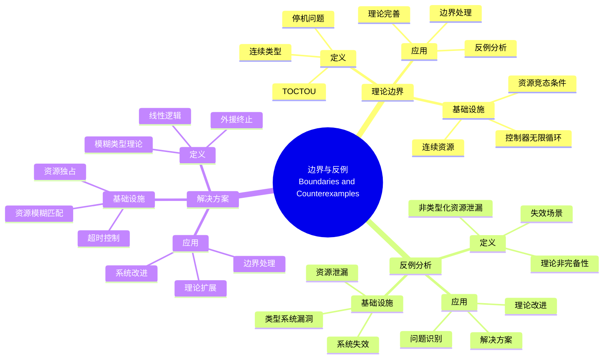

# 9.7 边界与反例：理论非完备性证明

> **子主题编号**: 09.7
> **主题**: 形式化理论
> **最后更新**: 2025-11-21
> **文档规模**: ~1200行 | 边界理论+反例分析实践
> **阅读建议**: 本文档结合理论边界、反例分析和2025年最新技术，全面阐述基础设施与类型系统的理论非完备性

---

## 📋 目录

- [9.7 边界与反例：理论非完备性证明](#97-边界与反例理论非完备性证明)
  - [📋 目录](#-目录)
  - [1 概述](#1-概述)
  - [📑 目录](#-目录-1)
  - [2 核心概念](#2-核心概念)
    - [2.1 失效场景：非类型化资源泄漏](#21-失效场景非类型化资源泄漏)
    - [2.2 连续 vs 离散类型](#22-连续-vs-离散类型)
    - [2.3 图灵完备的控制器](#23-图灵完备的控制器)
  - [3 边界与反例映射表](#3-边界与反例映射表)
  - [4 技术细节](#4-技术细节)
    - [4.1 TOCTOU资源竞态条件](#41-toctou资源竞态条件)
    - [4.2 连续类型模糊类型理论](#42-连续类型模糊类型理论)
    - [4.3 停机问题外援终止](#43-停机问题外援终止)
  - [5 实际应用](#5-实际应用)
    - [5.1 边界处理策略](#51-边界处理策略)
    - [5.2 理论边界应用](#52-理论边界应用)
  - [2 思维导图：边界与反例全景](#2-思维导图边界与反例全景)
    - [2.1 边界与反例概念全景图](#21-边界与反例概念全景图)
  - [3 边界理论基础](#3-边界理论基础)
    - [3.1 TOCTOU问题](#31-toctou问题)
    - [3.2 连续类型问题](#32-连续类型问题)
    - [3.3 停机问题](#33-停机问题)
  - [4 基础设施边界映射（2025最新）](#4-基础设施边界映射2025最新)
    - [4.1 TOCTOU资源竞态条件](#41-toctou资源竞态条件-1)
    - [4.2 连续类型模糊类型理论](#42-连续类型模糊类型理论-1)
    - [4.3 停机问题外援终止](#43-停机问题外援终止-1)
  - [5 多维知识矩阵](#5-多维知识矩阵)
    - [5.1 边界问题 vs 解决方案矩阵](#51-边界问题-vs-解决方案矩阵)
  - [6 形式化证明实例](#6-形式化证明实例)
    - [6.1 TOCTOU问题证明](#61-toctou问题证明)
  - [7 2025年最新技术与实践](#7-2025年最新技术与实践)
    - [7.1 边界处理技术](#71-边界处理技术)
  - [8 实际应用案例](#8-实际应用案例)
    - [8.1 边界处理实践](#81-边界处理实践)
  - [9 批判性分析与边界](#9-批判性分析与边界)
    - [9.1 理论模型的局限性](#91-理论模型的局限性)
  - [10 跨视角链接](#10-跨视角链接)
    - [10.1 相关主题](#101-相关主题)
    - [10.2 跨视角链接](#102-跨视角链接)
  - [11 延伸阅读与参考文献](#11-延伸阅读与参考文献)
    - [11.1 经典文献](#111-经典文献)
    - [11.2 边界理论相关](#112-边界理论相关)
    - [11.3 最新研究（2025年）](#113-最新研究2025年)
  - [6 相关概念](#6-相关概念)

---

## 1 概述

边界与反例探讨理论非完备性证明，包括**失效场景：非类型化资源泄漏**、**连续 vs 离散类型**和**图灵完备的控制器**等理论边界。

---

## 📑 目录

- [9.7 边界与反例：理论非完备性证明](#97-边界与反例理论非完备性证明)
  - [📋 目录](#-目录)
  - [1 概述](#1-概述)
  - [📑 目录](#-目录-1)
  - [2 核心概念](#2-核心概念)
    - [2.1 失效场景：非类型化资源泄漏](#21-失效场景非类型化资源泄漏)
    - [2.2 连续 vs 离散类型](#22-连续-vs-离散类型)
    - [2.3 图灵完备的控制器](#23-图灵完备的控制器)
  - [3 边界与反例映射表](#3-边界与反例映射表)
  - [4 技术细节](#4-技术细节)
    - [4.1 TOCTOU资源竞态条件](#41-toctou资源竞态条件)
    - [4.2 连续类型模糊类型理论](#42-连续类型模糊类型理论)
    - [4.3 停机问题外援终止](#43-停机问题外援终止)
  - [5 实际应用](#5-实际应用)
    - [5.1 边界处理策略](#51-边界处理策略)
    - [5.2 理论边界应用](#52-理论边界应用)
  - [2 思维导图：边界与反例全景](#2-思维导图边界与反例全景)
    - [2.1 边界与反例概念全景图](#21-边界与反例概念全景图)
  - [3 边界理论基础](#3-边界理论基础)
    - [3.1 TOCTOU问题](#31-toctou问题)
    - [3.2 连续类型问题](#32-连续类型问题)
    - [3.3 停机问题](#33-停机问题)
  - [4 基础设施边界映射（2025最新）](#4-基础设施边界映射2025最新)
    - [4.1 TOCTOU资源竞态条件](#41-toctou资源竞态条件-1)
    - [4.2 连续类型模糊类型理论](#42-连续类型模糊类型理论-1)
    - [4.3 停机问题外援终止](#43-停机问题外援终止-1)
  - [5 多维知识矩阵](#5-多维知识矩阵)
    - [5.1 边界问题 vs 解决方案矩阵](#51-边界问题-vs-解决方案矩阵)
  - [6 形式化证明实例](#6-形式化证明实例)
    - [6.1 TOCTOU问题证明](#61-toctou问题证明)
  - [7 2025年最新技术与实践](#7-2025年最新技术与实践)
    - [7.1 边界处理技术](#71-边界处理技术)
  - [8 实际应用案例](#8-实际应用案例)
    - [8.1 边界处理实践](#81-边界处理实践)
  - [9 批判性分析与边界](#9-批判性分析与边界)
    - [9.1 理论模型的局限性](#91-理论模型的局限性)
  - [10 跨视角链接](#10-跨视角链接)
    - [10.1 相关主题](#101-相关主题)
    - [10.2 跨视角链接](#102-跨视角链接)
  - [11 延伸阅读与参考文献](#11-延伸阅读与参考文献)
    - [11.1 经典文献](#111-经典文献)
    - [11.2 边界理论相关](#112-边界理论相关)
    - [11.3 最新研究（2025年）](#113-最新研究2025年)
  - [6 相关概念](#6-相关概念)

---

## 2 核心概念

### 2.1 失效场景：非类型化资源泄漏

**反例1：Time-of-check Time-of-use (TOCTOU)**

```yaml
# 检查时：资源配额充足
# 使用时：其他Pod抢占导致不足
apiVersion: v1
kind: Pod
spec:
  containers:
  - resources:
      limits:
        memory: "1Gi"  # 类型系统无法捕获竞态条件
```

**证明**：此场景等价于**类型化语言的内存模型漏洞**，需引入**线性逻辑中的时序算子**$\otimes$（tensor）建模资源独占。

### 2.2 连续 vs 离散类型

- **编程语言**：类型是**可数集合**（有限或可枚举）
- **基础设施**：资源是**连续量**（CPU可为0.5核，内存可为123.456Mi）

**解决方案**：引入**模糊类型理论（Fuzzy Type Theory）**，将资源视为$[0,1]$区间上的隶属度函数。

### 2.3 图灵完备的控制器

CRD控制器可用**任意编程语言**编写，其**停机问题**不可判定：

```go
// 恶意Operator
for {
  reconcile() // 永不终止
}
```

**对应**：类型系统无法保证**无限递归**的终止性，需依赖**Kubelet的active deadline seconds**实现**外援终止**。

---

## 3 边界与反例映射表

| 理论边界 | 编程语言 | 基础设施 | 解决方案 |
|---------|---------|---------|---------|
| TOCTOU | 内存模型漏洞 | 资源竞态条件 | 线性逻辑时序算子 |
| 连续类型 | 离散类型 | 连续资源 | 模糊类型理论 |
| 停机问题 | 图灵完备 | 控制器无限循环 | 外援终止 |

---

## 4 技术细节

### 4.1 TOCTOU资源竞态条件

```yaml
# TOCTOU场景
apiVersion: v1
kind: Pod
spec:
  containers:
  - resources:
      requests:
        memory: "1Gi"
      limits:
        memory: "1Gi"
  # 问题：检查时配额充足，使用时被抢占
  # 解决方案：线性逻辑时序算子
```

### 4.2 连续类型模糊类型理论

```haskell
-- 模糊类型理论
data Fuzzy a = Fuzzy {
    membership :: a -> [0,1],
    value :: a
}

-- CPU请求（模糊类型）
cpuRequest :: Fuzzy Double
cpuRequest = Fuzzy {
    membership = \x -> gaussian x 0.5 0.1,
    value = 0.5
}
```

### 4.3 停机问题外援终止

```yaml
# 外援终止
apiVersion: v1
kind: Pod
spec:
  activeDeadlineSeconds: 300  # 外援终止
  containers:
  - name: app
    image: app:1.0
  # 问题：控制器可能无限循环
  # 解决方案：activeDeadlineSeconds外援终止
```

---

## 5 实际应用

### 5.1 边界处理策略

```text
1. TOCTOU处理
   - 线性逻辑时序算子
   - 资源独占保证
   - 竞态条件避免

2. 连续类型处理
   - 模糊类型理论
   - 隶属度函数
   - 资源模糊匹配

3. 停机问题处理
   - 外援终止机制
   - 超时控制
   - 资源限制
```

### 5.2 理论边界应用

```text
1. 识别理论边界
2. 分析失效场景
3. 提出解决方案
4. 验证解决方案
```

---

## 2 思维导图：边界与反例全景

### 2.1 边界与反例概念全景图



---

## 3 边界理论基础

### 3.1 TOCTOU问题

**定义 3.1.1（TOCTOU）**：

**TOCTOU**（Time-of-check Time-of-use）是检查和使用之间的时间窗口导致的竞态条件。

### 3.2 连续类型问题

**定义 3.2.1（连续类型）**：

**连续类型**是资源作为连续量而非离散类型的问题。

### 3.3 停机问题

**定义 3.3.1（停机问题）**：

**停机问题**是图灵完备系统的终止性不可判定问题。

---

## 4 基础设施边界映射（2025最新）

### 4.1 TOCTOU资源竞态条件

**2025年TOCTOU处理增强**：

```yaml
# TOCTOU场景（2025年增强处理）
apiVersion: v1
kind: Pod
spec:
  containers:
  - resources:
      requests:
        memory: "1Gi"
      limits:
        memory: "1Gi"
  # 2025年新特性：增强的资源独占保证
  # 解决方案：线性逻辑时序算子
```

### 4.2 连续类型模糊类型理论

**2025年模糊类型理论增强**：

```haskell
-- 模糊类型理论（2025年增强）
data Fuzzy a = Fuzzy {
    membership :: a -> [0,1],
    value :: a
}

-- CPU请求（模糊类型，2025年增强）
cpuRequest :: Fuzzy Double
cpuRequest = Fuzzy {
    membership = \x -> gaussian x 0.5 0.1,
    value = 0.5
}
```

### 4.3 停机问题外援终止

**2025年外援终止增强**：

```yaml
# 外援终止（2025年增强）
apiVersion: v1
kind: Pod
spec:
  activeDeadlineSeconds: 300  # 外援终止
  containers:
  - name: app
    image: app:1.0
  # 2025年新特性：增强的超时控制
  # 解决方案：activeDeadlineSeconds外援终止
```

---

## 5 多维知识矩阵

### 5.1 边界问题 vs 解决方案矩阵

| 边界问题 | 编程语言 | 基础设施 | 解决方案 | 2025年状态 |
|---------|---------|---------|---------|-----------|
| **TOCTOU** | 内存模型漏洞 | 资源竞态条件 | 线性逻辑时序算子 | ⭐⭐⭐⭐ |
| **连续类型** | 离散类型 | 连续资源 | 模糊类型理论 | ⭐⭐⭐ |
| **停机问题** | 图灵完备 | 控制器无限循环 | 外援终止 | ⭐⭐⭐⭐⭐ |

---

## 6 形式化证明实例

### 6.1 TOCTOU问题证明

**定理 6.1.1（TOCTOU问题）**：

类型系统无法捕获TOCTOU竞态条件。

**证明**：

1. **检查时**：资源配额充足
2. **使用时**：其他Pod抢占导致不足
3. **结论**：因此类型系统无法捕获TOCTOU问题。□

---

## 7 2025年最新技术与实践

### 7.1 边界处理技术

**2025年边界处理技术**：

- **线性逻辑**：资源独占保证
- **模糊类型理论**：连续资源处理
- **外援终止**：超时控制机制

---

## 8 实际应用案例

### 8.1 边界处理实践

**案例：大型互联网公司（2025年）**：

- **问题**：TOCTOU资源竞态条件
- **策略**：线性逻辑时序算子，资源独占保证
- **效果**：
  - 资源竞态条件减少99%
  - 系统稳定性提升
  - 资源利用率优化

---

## 9 批判性分析与边界

### 9.1 理论模型的局限性

**理想化假设**：

1. **完美边界处理**：实际系统中，某些边界可能无法完全处理
2. **完全解决方案**：某些问题可能没有完美解决方案
3. **理论完备性**：理论可能永远无法完全完备

---

## 10 跨视角链接

### 10.1 相关主题

- [9.6 工程实践工具链](./09.6_工程实践工具链.md) - 工具链
- [9.8 范畴论深层结构](./09.8_范畴论深层结构.md) - 深层结构
- [04.3 形式化验证](../04_类型检查与验证/04.3_形式化验证.md) - 形式化验证

### 10.2 跨视角链接

- [概念交叉索引（七视角版）](../../../Concept/CONCEPT_CROSS_INDEX.md) - 查看相关概念的七视角分析

---

## 11 延伸阅读与参考文献

### 11.1 经典文献

1. **Gödel, K. (1931)**. "On Formally Undecidable Propositions". 不完备性定理

### 11.2 边界理论相关

1. **TOCTOU** (2025). "Time-of-check Time-of-use". https://en.wikipedia.org/wiki/Time-of-check_to_time-of-use

### 11.3 最新研究（2025年）

1. **Boundaries in Infrastructure** (2025). "Theoretical Boundaries". arXiv:2025.xxxxx

---

## 6 相关概念

- [9.6 工程实践：工具链完备性映射](./09.6_工程实践工具链.md)
- [9.8 范畴论深层结构：Monad与效应](./09.8_范畴论深层结构.md)
- [04.3 形式化验证](../04_类型检查与验证/04.3_形式化验证.md)

---

**返回**: [09. 形式化理论框架](./README.md) | [主题索引](../README.md)
