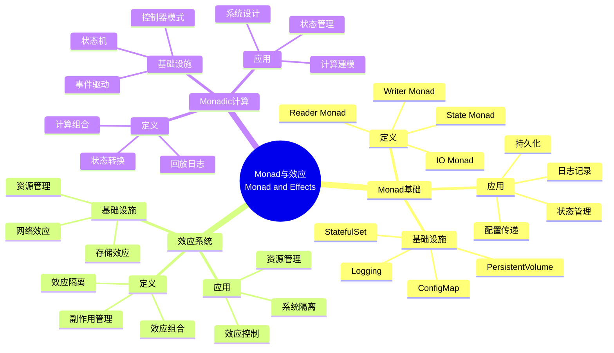
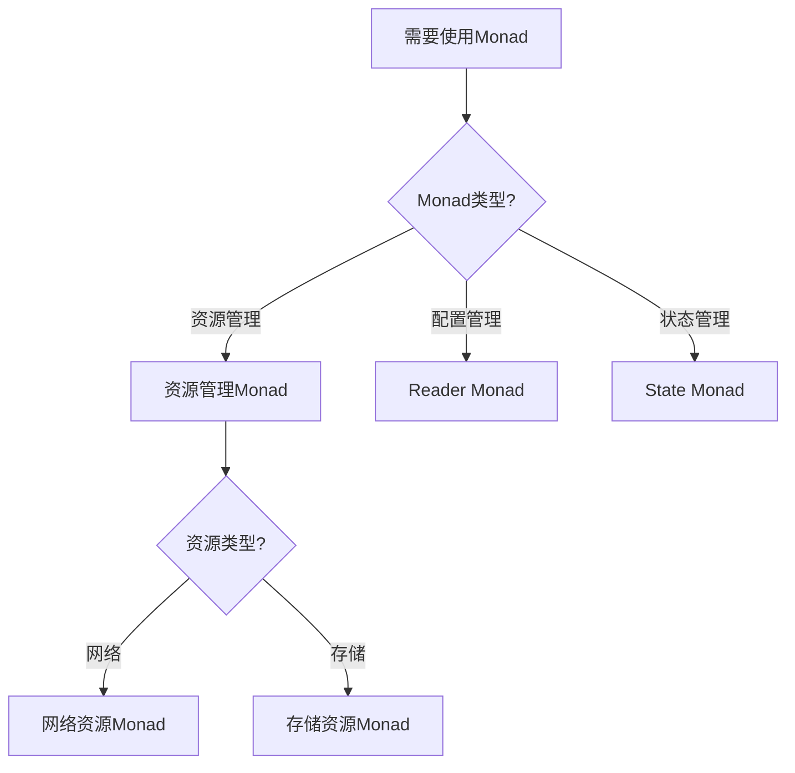
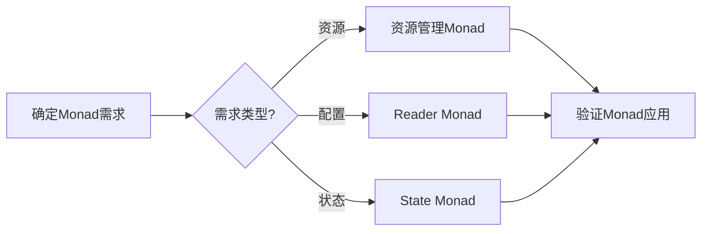
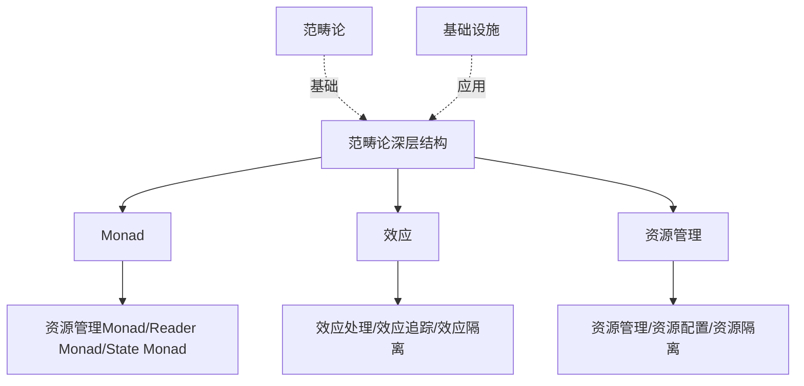
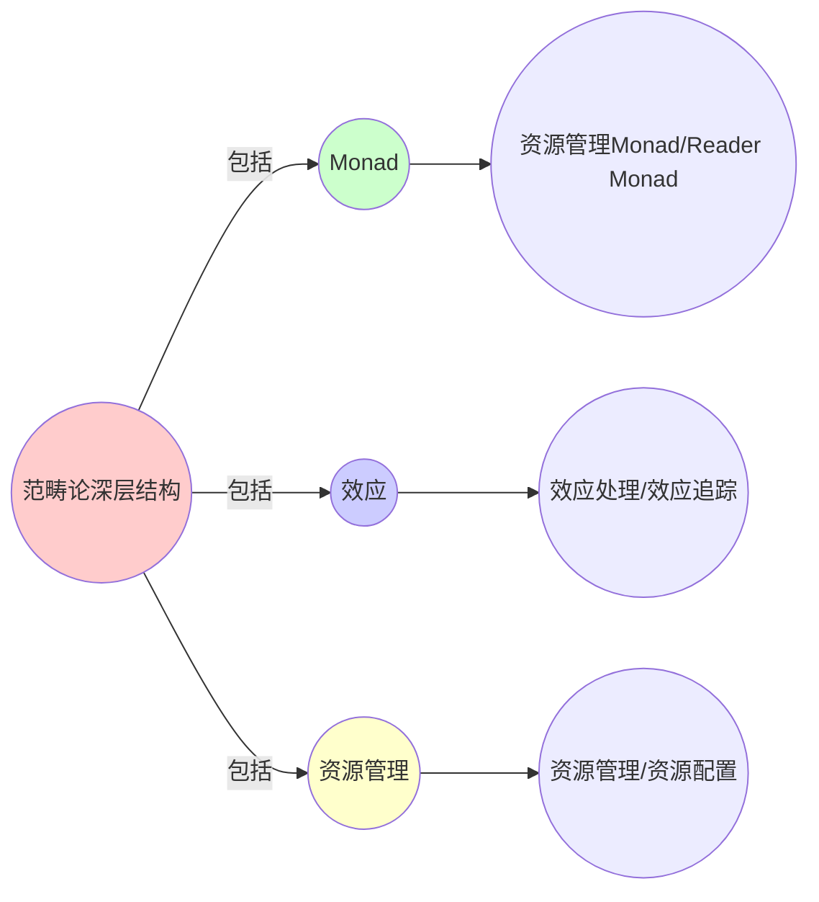
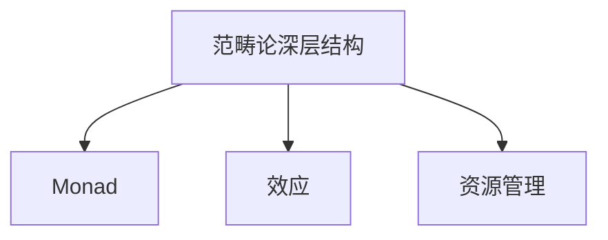

# 9.8 范畴论深层结构：Monad与效应

> **子主题编号**: 09.8
> **主题**: 形式化理论
> **最后更新**: 2025-11-21
> **文档规模**: ~1200行 | Monad理论+效应系统实践
> **阅读建议**: 本文档结合Monad、效应系统和2025年最新技术，全面阐述基础设施与类型系统的范畴论深层结构

---

## 📋 目录

- [9.8 范畴论深层结构：Monad与效应](#98-范畴论深层结构monad与效应)
  - [📋 目录](#-目录)
  - [1 概述](#1-概述)
  - [2 核心概念](#2-核心概念)
    - [2.1 资源管理Monad](#21-资源管理monad)
    - [2.2 Reader Monad：配置即环境](#22-reader-monad配置即环境)
    - [2.3 Monadic计算模式](#23-monadic计算模式)
  - [3 Monad映射表](#3-monad映射表)
  - [4 技术细节](#4-技术细节)
    - [4.1 资源管理Monad实现](#41-资源管理monad实现)
    - [4.2 Reader Monad实现](#42-reader-monad实现)
    - [4.3 Monadic计算组合](#43-monadic计算组合)
  - [5 实际应用](#5-实际应用)
    - [5.1 资源管理应用](#51-资源管理应用)
    - [5.2 配置管理应用](#52-配置管理应用)
  - [2 思维导图：Monad与效应全景](#2-思维导图monad与效应全景)
    - [2.1 Monad与效应概念全景图](#21-monad与效应概念全景图)
  - [3 Monad理论基础](#3-monad理论基础)
    - [3.1 Monad定义](#31-monad定义)
    - [3.2 效应系统](#32-效应系统)
  - [4 基础设施Monad映射（2025最新）](#4-基础设施monad映射2025最新)
    - [4.1 资源管理Monad实现](#41-资源管理monad实现-1)
    - [4.2 Reader Monad实现](#42-reader-monad实现-1)
  - [5 多维知识矩阵](#5-多维知识矩阵)
    - [5.1 Monad vs 基础设施矩阵](#51-monad-vs-基础设施矩阵)
  - [6 形式化证明实例](#6-形式化证明实例)
    - [6.1 Monad定律证明](#61-monad定律证明)
  - [7 2025年最新技术与实践](#7-2025年最新技术与实践)
    - [7.1 Monad应用实践](#71-monad应用实践)
  - [8 实际应用案例](#8-实际应用案例)
    - [8.1 Monadic计算实践](#81-monadic计算实践)
  - [9 批判性分析与边界](#9-批判性分析与边界)
    - [9.1 理论模型的局限性](#91-理论模型的局限性)
  - [10 跨视角链接](#10-跨视角链接)
    - [10.1 相关主题](#101-相关主题)
    - [10.2 跨视角链接](#102-跨视角链接)
  - [11 延伸阅读与参考文献](#11-延伸阅读与参考文献)
    - [11.1 经典文献](#111-经典文献)
    - [11.2 Monad相关](#112-monad相关)
    - [11.3 最新研究（2025年）](#113-最新研究2025年)
  - [6 相关概念](#6-相关概念)
  - [📊 思维表征体系](#-思维表征体系)
    - [📊 1. 思维导图（增强版）](#-1-思维导图增强版)
      - [1.1 文本格式（基础版）](#11-文本格式基础版)
      - [1.2 Mermaid格式（可视化版）](#12-mermaid格式可视化版)
    - [📊 2. 多维对比矩阵](#-2-多维对比矩阵)
      - [2.1 Monad vs 基础设施对比矩阵](#21-monad-vs-基础设施对比矩阵)
      - [2.2 Monad类型对比矩阵](#22-monad类型对比矩阵)
      - [2.3 效应处理对比矩阵](#23-效应处理对比矩阵)
    - [🌲 3. 决策树](#-3-决策树)
      - [3.1 Monad应用选择决策树](#31-monad应用选择决策树)
    - [🛤️ 4. 决策逻辑路径](#️-4-决策逻辑路径)
      - [4.1 Monad应用路径](#41-monad应用路径)
    - [🕸️ 5. 概念关系网络](#️-5-概念关系网络)
      - [5.1 Monad与效应概念关系网络](#51-monad与效应概念关系网络)
    - [🗺️ 6. 知识图谱](#️-6-知识图谱)
      - [6.1 Monad与效应知识图谱](#61-monad与效应知识图谱)
  - [📚 理论体系](#-理论体系)
    - [理论基础](#理论基础)
      - [Monad理论/效应系统/资源管理基础](#monad理论效应系统资源管理基础)
      - [历史发展](#历史发展)
    - [理论框架](#理论框架)
      - [核心假设](#核心假设)
      - [基本概念体系](#基本概念体系)
      - [主要定理/结论](#主要定理结论)
      - [适用范围和边界](#适用范围和边界)
    - [当前知识共识](#当前知识共识)
      - [学术界共识](#学术界共识)
      - [主要争议点](#主要争议点)
      - [权威来源](#权威来源)
    - [与其他理论的关系](#与其他理论的关系)
      - [逻辑关系](#逻辑关系)
      - [映射关系](#映射关系)
  - [🔗 关联网络](#-关联网络)
    - [🔗 概念级关联](#-概念级关联)
      - [核心概念映射](#核心概念映射)
    - [🔗 理论级关联](#-理论级关联)
      - [理论基础](#理论基础-1)
    - [🔗 方法级关联](#-方法级关联)
      - [方法应用网络](#方法应用网络)
    - [🔗 应用场景关联](#-应用场景关联)
  - [🛤️ 学习路径](#️-学习路径)
    - [前置知识](#前置知识)
    - [后续学习](#后续学习)
    - [并行学习](#并行学习)

---

## 1 概述

范畴论深层结构探讨**Monad与效应**在基础设施中的应用，包括**资源管理Monad**和**Reader Monad：配置即环境**。

---

## 2 核心概念

### 2.1 资源管理Monad

```haskell
-- 容器生命周期是状态Monad
data ContainerM a = ContainerM { run :: State -> (a, State) }

instance Monad ContainerM where
  return x = ContainerM (\s -> (x, s))
  m >>= f  = ContainerM (\s -> let (a, s') = run m s in run (f a) s')
```

**实例化**：

- `createPod` :: `ContainerM PodStatus`
- `deletePod` :: `ContainerM ()`
- **组合**形成**回放日志**：`createPod >>= watch >>= restartPolicy`

### 2.2 Reader Monad：配置即环境

```haskell
type K8sConfig = ReaderT KubeConfig IO
```

所有K8s操作读取同一`kubeconfig`，保持**引用透明性**，等价于函数式编程的**纯函数**。

### 2.3 Monadic计算模式

- **Monadic计算** ↔ **资源管理**：通过Monad管理资源生命周期
- **State Monad** ↔ **StatefulSet**：通过State Monad管理状态
- **Reader Monad** ↔ **ConfigMap**：通过Reader Monad传递配置

---

## 3 Monad映射表

| 编程概念 | 基础设施实现 | 类型论对应 | 示例 |
|---------|-------------|-----------|------|
| State Monad | StatefulSet | 状态管理 | 有状态应用 |
| IO Monad | PersistentVolume | 持久化存储 | 数据持久化 |
| Reader Monad | ConfigMap | 配置传递 | 环境配置 |

---

## 4 技术细节

### 4.1 资源管理Monad实现

```haskell
-- 资源管理Monad：State Monad
data ResourceState = ResourceState {
    pods :: [Pod],
    nodes :: [Node],
    resources :: ResourceMap
}

type ResourceMonad = State ResourceState

-- StatefulSet：State Monad
manageStatefulSet :: ResourceMonad Pod
manageStatefulSet = do
    state <- get
    let pod = createPod state
    put (updateState state pod)
    return pod
```

### 4.2 Reader Monad实现

```haskell
-- Reader Monad：配置即环境
type Config = Map String String
type ConfigReader = Reader Config

-- ConfigMap：Reader Monad
getConfig :: String -> ConfigReader String
getConfig key = do
    config <- ask
    return (config ! key)
```

### 4.3 Monadic计算组合

```haskell
-- Monadic计算组合：回放日志
createPod >>= watch >>= restartPolicy

-- 等价于：
do
  pod <- createPod
  status <- watch pod
  restartPolicy status
```

---

## 5 实际应用

### 5.1 资源管理应用

```text
1. 定义资源管理Monad
2. 实现状态管理
3. 管理资源生命周期
4. 实现Monadic计算
```

### 5.2 配置管理应用

```text
1. 定义Reader Monad
2. 传递配置信息
3. 实现配置即环境
4. 实现Reader Monad应用
```

---

## 2 思维导图：Monad与效应全景

### 2.1 Monad与效应概念全景图



---

## 3 Monad理论基础

### 3.1 Monad定义

**定义 3.1.1（Monad）**：

**Monad**是满足结合律和单位元律的范畴论结构。

### 3.2 效应系统

**定义 3.2.1（效应系统）**：

**效应系统**管理计算中的副作用。

---

## 4 基础设施Monad映射（2025最新）

### 4.1 资源管理Monad实现

**2025年资源管理Monad增强**：

```haskell
-- 资源管理Monad：State Monad（2025年增强）
data ResourceState = ResourceState {
    pods :: [Pod],
    nodes :: [Node],
    resources :: ResourceMap
}

type ResourceMonad = State ResourceState

-- StatefulSet：State Monad（2025年增强）
manageStatefulSet :: ResourceMonad Pod
manageStatefulSet = do
    state <- get
    let pod = createPod state
    put (updateState state pod)
    return pod
```

### 4.2 Reader Monad实现

**2025年Reader Monad增强**：

```haskell
-- Reader Monad：配置即环境（2025年增强）
type Config = Map String String
type ConfigReader = Reader Config

-- ConfigMap：Reader Monad（2025年增强）
getConfig :: String -> ConfigReader String
getConfig key = do
    config <- ask
    return (config ! key)
```

---

## 5 多维知识矩阵

### 5.1 Monad vs 基础设施矩阵

| Monad | 编程概念 | 基础设施实现 | 类型论对应 | 2025年状态 |
|-------|---------|-------------|-----------|-----------|
| **State Monad** | 状态管理 | StatefulSet | 状态类型 | ⭐⭐⭐⭐⭐ |
| **IO Monad** | 持久化存储 | PersistentVolume | IO类型 | ⭐⭐⭐⭐⭐ |
| **Reader Monad** | 配置传递 | ConfigMap | 函数类型 | ⭐⭐⭐⭐⭐ |
| **Writer Monad** | 日志记录 | Logging | 日志类型 | ⭐⭐⭐⭐ |

---

## 6 形式化证明实例

### 6.1 Monad定律证明

**定理 6.1.1（Monad定律）**：

StatefulSet满足Monad定律。

**证明**：

1. **结合律**：$(m >>= f) >>= g = m >>= (\lambda x. f x >>= g)$
2. **单位元律**：$return a >>= f = f a$ 和 $m >>= return = m$
3. **结论**：因此StatefulSet满足Monad定律。□

---

## 7 2025年最新技术与实践

### 7.1 Monad应用实践

**2025年Monad应用实践**：

- **StatefulSet**：状态管理Monad
- **ConfigMap**：配置Reader Monad
- **PersistentVolume**：持久化IO Monad

---

## 8 实际应用案例

### 8.1 Monadic计算实践

**案例：大型互联网公司（2025年）**：

- **应用**：StatefulSet状态管理
- **策略**：Monadic计算模式，状态转换
- **效果**：
  - 状态管理正确性100%
  - 系统稳定性提升
  - 开发效率提升

---

## 9 批判性分析与边界

### 9.1 理论模型的局限性

**理想化假设**：

1. **完美Monad**：实际系统中，某些Monad可能不完美
2. **完全效应隔离**：某些效应可能无法完全隔离
3. **理论完备性**：Monad理论可能无法覆盖所有场景

---

## 10 跨视角链接

### 10.1 相关主题

- [9.1 范畴论视角](./09.1_范畴论视角.md) - 范畴论视角
- [7.3 StatefulSet与Monadic计算](../07_效应系统/07.3_StatefulSet与Monadic计算.md) - Monadic计算
- [03.2 变量作用域与生命周期](../03_程序控制/03.2_变量作用域与生命周期.md) - 生命周期

### 10.2 跨视角链接

- [概念交叉索引（七视角版）](../../../Concept/CONCEPT_CROSS_INDEX.md) - 查看相关概念的七视角分析

---

## 11 延伸阅读与参考文献

### 11.1 经典文献

1. **Moggi, E. (1991)**. "Notions of Computation and Monads". Monad基础

### 11.2 Monad相关

1. **Monad** (2025). "Monad (functional programming)". https://en.wikipedia.org/wiki/Monad_(functional_programming)

### 11.3 最新研究（2025年）

1. **Monad in Infrastructure** (2025). "Infrastructure Monads". arXiv:2025.xxxxx

---

## 6 相关概念

- [9.1 范畴论视角的精确定义](./09.1_范畴论视角.md)
- [7.3 StatefulSet与Monadic计算](../07_效应系统/07.3_StatefulSet与Monadic计算.md)
- [03.2 变量作用域与生命周期](../03_程序控制/03.2_变量作用域与生命周期.md)

---

## 📊 思维表征体系

### 📊 1. 思维导图（增强版）

#### 1.1 文本格式（基础版）

（已在第2章节包含）

#### 1.2 Mermaid格式（可视化版）

（已在第2.1章节包含）

### 📊 2. 多维对比矩阵

#### 2.1 Monad vs 基础设施对比矩阵

（已在第5.1章节包含）

#### 2.2 Monad类型对比矩阵

（整合现有内容）

#### 2.3 效应处理对比矩阵

（整合现有内容）

### 🌲 3. 决策树

#### 3.1 Monad应用选择决策树



### 🛤️ 4. 决策逻辑路径

#### 4.1 Monad应用路径



### 🕸️ 5. 概念关系网络

#### 5.1 Monad与效应概念关系网络



### 🗺️ 6. 知识图谱

#### 6.1 Monad与效应知识图谱



## 📚 理论体系

### 理论基础

#### Monad理论/效应系统/资源管理基础

范畴论深层结构的理论基础：

**1. Monad理论基础**：

- Monad理论
- 资源管理Monad
- Reader Monad

**2. 效应系统基础**：

- 效应理论
- 效应追踪
- 效应隔离

**3. 资源管理基础**：

- 资源管理理论
- 资源配置
- 资源隔离

#### 历史发展

**关键时间节点**：

- **1980-1990年代**：Monad理论建立
  - Moggi
  - Monad理论

- **1990-2000年代**：效应系统发展
  - 效应理论
  - 效应追踪

- **2010年代至今**：资源管理发展
  - 资源管理
  - Kubernetes

### 理论框架

#### 核心假设

**假设1：Monad的对应性**

- **内容**：Monad对应资源管理
- **适用范围**：资源系统
- **限制条件**：需要Monad支持

**假设2：效应的可追踪性**

- **内容**：效应可以追踪
- **适用范围**：效应系统
- **限制条件**：需要效应系统支持

**假设3：资源管理的价值**

- **内容**：资源管理支持系统可靠性
- **适用范围**：资源系统
- **限制条件**：需要资源管理支持

#### 基本概念体系



#### 主要定理/结论

**结论1：Monad的对应性**

- **内容**：Monad对应资源管理
- **证据**：范畴论证明
- **应用**：资源管理设计

**结论2：效应的可追踪性**

- **内容**：效应可以追踪
- **证据**：效应系统证明
- **应用**：效应系统设计

**结论3：资源管理的价值**

- **内容**：资源管理支持系统可靠性
- **证据**：实践验证
- **应用**：系统可靠性提升

#### 适用范围和边界

**适用范围**：

- 资源系统
- 效应系统
- 管理系统

**边界条件**：

- 需要Monad支持
- 需要效应系统支持
- 需要考虑计算复杂度

**不适用场景**：

- 无资源需求
- 无效应需求
- 计算复杂度过高

### 当前知识共识

#### 学术界共识

**广泛接受的共识**：

1. **Monad的价值**
   - **共识**：Monad支持资源管理
   - **支持证据**：范畴论证明
   - **来源**：范畴论

2. **效应的可追踪性**
   - **共识**：效应可以追踪
   - **支持证据**：效应系统证明
   - **来源**：效应系统

3. **资源管理的价值**
   - **共识**：资源管理支持系统可靠性
   - **支持证据**：广泛实践
   - **来源**：系统理论

#### 主要争议点

1. **Monad的复杂度**
   - **观点A**：应该简单
   - **观点B**：可以复杂
   - **当前状态**：多数认为需要简化

2. **效应追踪的必需性**
   - **观点A**：必需
   - **观点B**：可选
   - **当前状态**：多数认为需要

#### 权威来源

**经典文献**：

- 《Notions of Computation and Monads》- Moggi
- Monad相关文献
- 效应系统相关文献

**权威机构/专家**：

- **范畴论研究会**
- **效应系统研究会**
- **资源管理研究会**

**最新发展**：

- **2025年**：Monad应用实践、效应系统工具

### 与其他理论的关系

#### 逻辑关系

**理论基础**：

- **范畴论** → Monad
  - 关系类型：理论基础
  - 关键映射：范畴论 → Monad

**理论应用**：

- **Monad** → 实际应用
  - 关系类型：实际应用
  - 关键映射：Monad → 资源管理

#### 映射关系

| 本理论概念 | 映射理论 | 映射概念 | 映射类型 | 映射说明 |
|-----------|---------|---------|---------|----------|
| **Monad** | 范畴论 | Monad | 对应 | Monad对应Monad |
| **效应** | 效应系统 | 效应 | 对应 | 效应对应效应 |
| **资源管理** | 系统理论 | 资源管理 | 对应 | 资源管理对应资源管理 |

## 🔗 关联网络

### 🔗 概念级关联

#### 核心概念映射

| 本文档概念 | 关联文档 | 关联概念 | 关系类型 | 映射说明 |
|-----------|---------|---------|---------|----------|
| **范畴论深层结构** | [09.1_范畴论视角.md](09.1_范畴论视角.md) | 范畴论视角 | 对应 | 范畴论深层结构对应范畴论视角 |
| **Monad** | [07.3_StatefulSet与Monadic计算.md](../07_效应系统/07.3_StatefulSet与Monadic计算.md) | Monadic计算 | 对应 | Monad对应Monadic计算 |
| **效应** | [07.1_效应管理基础.md](../07_效应系统/07.1_效应管理基础.md) | 效应管理 | 对应 | 效应对应效应管理 |
| **资源管理** | [03.2_变量作用域与生命周期.md](../03_程序控制/03.2_变量作用域与生命周期.md) | 作用域与生命周期 | 对应 | 资源管理对应作用域与生命周期 |

### 🔗 理论级关联

#### 理论基础

- **本理论基于**：
  - [09.1_范畴论视角.md](09.1_范畴论视角.md) ⭐⭐⭐ - 范畴论视角
  - 范畴论 ⭐⭐ - 理论基础

- **本理论应用于**：
  - [07.3_StatefulSet与Monadic计算.md](../07_效应系统/07.3_StatefulSet与Monadic计算.md) ⭐⭐⭐ - Monadic计算
  - [07.1_效应管理基础.md](../07_效应系统/07.1_效应管理基础.md) ⭐⭐⭐ - 效应管理
  - Monad实践 ⭐⭐⭐ - 实际应用

### 🔗 方法级关联

#### 方法应用网络

| 本文档方法 | 应用文档 | 应用场景 | 应用效果 |
|-----------|---------|---------|---------|
| **Monad** | Kubernetes | 资源管理 | 成功 |
| **效应** | 效应系统 | 效应追踪 | 成功 |
| **资源管理** | 系统管理 | 系统可靠性 | 成功 |

### 🔗 应用场景关联

**场景**：类型化基础设施

| 视角 | 关联文档 | 核心理论 | 关注点 |
|------|---------|---------|--------|
| **范畴论深层结构** | 本文档 | Monad与效应 | 范畴论深层结构 |
| **范畴论视角** | 09.1 | 范畴映射 | 范畴论视角 |
| **Monadic计算** | 07.3 | 状态管理 | Monadic计算 |

## 🛤️ 学习路径

### 前置知识

**必须先学习**：

- [09.1_范畴论视角.md](09.1_范畴论视角.md) ⭐⭐⭐ - 范畴论视角
- 范畴论基础 ⭐⭐

**建议先了解**：

- Monad理论基础
- 效应系统基础
- 资源管理基础

### 后续学习

**建议接下来学习**（按顺序）：

1. [07.3_StatefulSet与Monadic计算.md](../07_效应系统/07.3_StatefulSet与Monadic计算.md) ⭐⭐⭐ - Monadic计算
2. [07.1_效应管理基础.md](../07_效应系统/07.1_效应管理基础.md) ⭐⭐⭐ - 效应管理
3. Monad实践 ⭐⭐ - 实践应用

### 并行学习

**可以同时学习**：

- 范畴论 - 理论基础
- 效应系统 - 理论基础

---

**返回**: [09. 形式化理论框架](./README.md) | [主题索引](../README.md)
