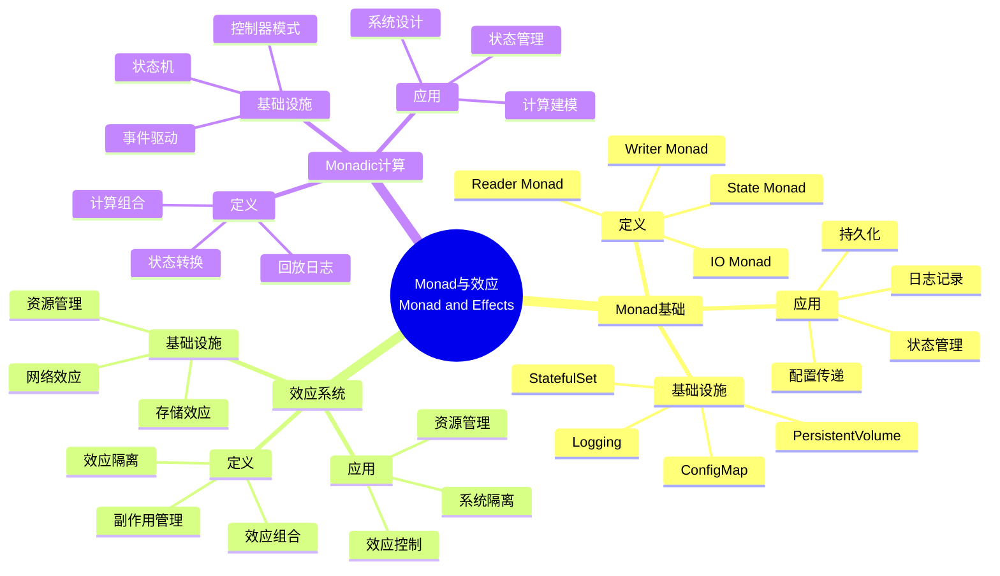

# 9.8 范畴论深层结构：Monad与效应

> **子主题编号**: 09.8
> **主题**: 形式化理论
> **最后更新**: 2025-11-21
> **文档规模**: ~1200行 | Monad理论+效应系统实践
> **阅读建议**: 本文档结合Monad、效应系统和2025年最新技术，全面阐述基础设施与类型系统的范畴论深层结构

---

## 📋 目录

- [9.8 范畴论深层结构：Monad与效应](#98-范畴论深层结构monad与效应)
  - [📋 目录](#-目录)
  - [1 概述](#1-概述)
  - [📑 目录](#-目录-1)
  - [2 核心概念](#2-核心概念)
    - [2.1 资源管理Monad](#21-资源管理monad)
    - [2.2 Reader Monad：配置即环境](#22-reader-monad配置即环境)
    - [2.3 Monadic计算模式](#23-monadic计算模式)
  - [3 Monad映射表](#3-monad映射表)
  - [4 技术细节](#4-技术细节)
    - [4.1 资源管理Monad实现](#41-资源管理monad实现)
    - [4.2 Reader Monad实现](#42-reader-monad实现)
    - [4.3 Monadic计算组合](#43-monadic计算组合)
  - [5 实际应用](#5-实际应用)
    - [5.1 资源管理应用](#51-资源管理应用)
    - [5.2 配置管理应用](#52-配置管理应用)
  - [2 思维导图：Monad与效应全景](#2-思维导图monad与效应全景)
    - [2.1 Monad与效应概念全景图](#21-monad与效应概念全景图)
  - [3 Monad理论基础](#3-monad理论基础)
    - [3.1 Monad定义](#31-monad定义)
    - [3.2 效应系统](#32-效应系统)
  - [4 基础设施Monad映射（2025最新）](#4-基础设施monad映射2025最新)
    - [4.1 资源管理Monad实现](#41-资源管理monad实现-1)
    - [4.2 Reader Monad实现](#42-reader-monad实现-1)
  - [5 多维知识矩阵](#5-多维知识矩阵)
    - [5.1 Monad vs 基础设施矩阵](#51-monad-vs-基础设施矩阵)
  - [6 形式化证明实例](#6-形式化证明实例)
    - [6.1 Monad定律证明](#61-monad定律证明)
  - [7 2025年最新技术与实践](#7-2025年最新技术与实践)
    - [7.1 Monad应用实践](#71-monad应用实践)
  - [8 实际应用案例](#8-实际应用案例)
    - [8.1 Monadic计算实践](#81-monadic计算实践)
  - [9 批判性分析与边界](#9-批判性分析与边界)
    - [9.1 理论模型的局限性](#91-理论模型的局限性)
  - [10 跨视角链接](#10-跨视角链接)
    - [10.1 相关主题](#101-相关主题)
    - [10.2 跨视角链接](#102-跨视角链接)
  - [11 延伸阅读与参考文献](#11-延伸阅读与参考文献)
    - [11.1 经典文献](#111-经典文献)
    - [11.2 Monad相关](#112-monad相关)
    - [11.3 最新研究（2025年）](#113-最新研究2025年)
  - [6 相关概念](#6-相关概念)

---

## 1 概述

范畴论深层结构探讨**Monad与效应**在基础设施中的应用，包括**资源管理Monad**和**Reader Monad：配置即环境**。

---

## 📑 目录

- [9.8 范畴论深层结构：Monad与效应](#98-范畴论深层结构monad与效应)
  - [📋 目录](#-目录)
  - [1 概述](#1-概述)
  - [📑 目录](#-目录-1)
  - [2 核心概念](#2-核心概念)
    - [2.1 资源管理Monad](#21-资源管理monad)
    - [2.2 Reader Monad：配置即环境](#22-reader-monad配置即环境)
    - [2.3 Monadic计算模式](#23-monadic计算模式)
  - [3 Monad映射表](#3-monad映射表)
  - [4 技术细节](#4-技术细节)
    - [4.1 资源管理Monad实现](#41-资源管理monad实现)
    - [4.2 Reader Monad实现](#42-reader-monad实现)
    - [4.3 Monadic计算组合](#43-monadic计算组合)
  - [5 实际应用](#5-实际应用)
    - [5.1 资源管理应用](#51-资源管理应用)
    - [5.2 配置管理应用](#52-配置管理应用)
  - [2 思维导图：Monad与效应全景](#2-思维导图monad与效应全景)
    - [2.1 Monad与效应概念全景图](#21-monad与效应概念全景图)
  - [3 Monad理论基础](#3-monad理论基础)
    - [3.1 Monad定义](#31-monad定义)
    - [3.2 效应系统](#32-效应系统)
  - [4 基础设施Monad映射（2025最新）](#4-基础设施monad映射2025最新)
    - [4.1 资源管理Monad实现](#41-资源管理monad实现-1)
    - [4.2 Reader Monad实现](#42-reader-monad实现-1)
  - [5 多维知识矩阵](#5-多维知识矩阵)
    - [5.1 Monad vs 基础设施矩阵](#51-monad-vs-基础设施矩阵)
  - [6 形式化证明实例](#6-形式化证明实例)
    - [6.1 Monad定律证明](#61-monad定律证明)
  - [7 2025年最新技术与实践](#7-2025年最新技术与实践)
    - [7.1 Monad应用实践](#71-monad应用实践)
  - [8 实际应用案例](#8-实际应用案例)
    - [8.1 Monadic计算实践](#81-monadic计算实践)
  - [9 批判性分析与边界](#9-批判性分析与边界)
    - [9.1 理论模型的局限性](#91-理论模型的局限性)
  - [10 跨视角链接](#10-跨视角链接)
    - [10.1 相关主题](#101-相关主题)
    - [10.2 跨视角链接](#102-跨视角链接)
  - [11 延伸阅读与参考文献](#11-延伸阅读与参考文献)
    - [11.1 经典文献](#111-经典文献)
    - [11.2 Monad相关](#112-monad相关)
    - [11.3 最新研究（2025年）](#113-最新研究2025年)
  - [6 相关概念](#6-相关概念)

---

## 2 核心概念

### 2.1 资源管理Monad

```haskell
-- 容器生命周期是状态Monad
data ContainerM a = ContainerM { run :: State -> (a, State) }

instance Monad ContainerM where
  return x = ContainerM (\s -> (x, s))
  m >>= f  = ContainerM (\s -> let (a, s') = run m s in run (f a) s')
```

**实例化**：

- `createPod` :: `ContainerM PodStatus`
- `deletePod` :: `ContainerM ()`
- **组合**形成**回放日志**：`createPod >>= watch >>= restartPolicy`

### 2.2 Reader Monad：配置即环境

```haskell
type K8sConfig = ReaderT KubeConfig IO
```

所有K8s操作读取同一`kubeconfig`，保持**引用透明性**，等价于函数式编程的**纯函数**。

### 2.3 Monadic计算模式

- **Monadic计算** ↔ **资源管理**：通过Monad管理资源生命周期
- **State Monad** ↔ **StatefulSet**：通过State Monad管理状态
- **Reader Monad** ↔ **ConfigMap**：通过Reader Monad传递配置

---

## 3 Monad映射表

| 编程概念 | 基础设施实现 | 类型论对应 | 示例 |
|---------|-------------|-----------|------|
| State Monad | StatefulSet | 状态管理 | 有状态应用 |
| IO Monad | PersistentVolume | 持久化存储 | 数据持久化 |
| Reader Monad | ConfigMap | 配置传递 | 环境配置 |

---

## 4 技术细节

### 4.1 资源管理Monad实现

```haskell
-- 资源管理Monad：State Monad
data ResourceState = ResourceState {
    pods :: [Pod],
    nodes :: [Node],
    resources :: ResourceMap
}

type ResourceMonad = State ResourceState

-- StatefulSet：State Monad
manageStatefulSet :: ResourceMonad Pod
manageStatefulSet = do
    state <- get
    let pod = createPod state
    put (updateState state pod)
    return pod
```

### 4.2 Reader Monad实现

```haskell
-- Reader Monad：配置即环境
type Config = Map String String
type ConfigReader = Reader Config

-- ConfigMap：Reader Monad
getConfig :: String -> ConfigReader String
getConfig key = do
    config <- ask
    return (config ! key)
```

### 4.3 Monadic计算组合

```haskell
-- Monadic计算组合：回放日志
createPod >>= watch >>= restartPolicy

-- 等价于：
do
  pod <- createPod
  status <- watch pod
  restartPolicy status
```

---

## 5 实际应用

### 5.1 资源管理应用

```text
1. 定义资源管理Monad
2. 实现状态管理
3. 管理资源生命周期
4. 实现Monadic计算
```

### 5.2 配置管理应用

```text
1. 定义Reader Monad
2. 传递配置信息
3. 实现配置即环境
4. 实现Reader Monad应用
```

---

## 2 思维导图：Monad与效应全景

### 2.1 Monad与效应概念全景图



---

## 3 Monad理论基础

### 3.1 Monad定义

**定义 3.1.1（Monad）**：

**Monad**是满足结合律和单位元律的范畴论结构。

### 3.2 效应系统

**定义 3.2.1（效应系统）**：

**效应系统**管理计算中的副作用。

---

## 4 基础设施Monad映射（2025最新）

### 4.1 资源管理Monad实现

**2025年资源管理Monad增强**：

```haskell
-- 资源管理Monad：State Monad（2025年增强）
data ResourceState = ResourceState {
    pods :: [Pod],
    nodes :: [Node],
    resources :: ResourceMap
}

type ResourceMonad = State ResourceState

-- StatefulSet：State Monad（2025年增强）
manageStatefulSet :: ResourceMonad Pod
manageStatefulSet = do
    state <- get
    let pod = createPod state
    put (updateState state pod)
    return pod
```

### 4.2 Reader Monad实现

**2025年Reader Monad增强**：

```haskell
-- Reader Monad：配置即环境（2025年增强）
type Config = Map String String
type ConfigReader = Reader Config

-- ConfigMap：Reader Monad（2025年增强）
getConfig :: String -> ConfigReader String
getConfig key = do
    config <- ask
    return (config ! key)
```

---

## 5 多维知识矩阵

### 5.1 Monad vs 基础设施矩阵

| Monad | 编程概念 | 基础设施实现 | 类型论对应 | 2025年状态 |
|-------|---------|-------------|-----------|-----------|
| **State Monad** | 状态管理 | StatefulSet | 状态类型 | ⭐⭐⭐⭐⭐ |
| **IO Monad** | 持久化存储 | PersistentVolume | IO类型 | ⭐⭐⭐⭐⭐ |
| **Reader Monad** | 配置传递 | ConfigMap | 函数类型 | ⭐⭐⭐⭐⭐ |
| **Writer Monad** | 日志记录 | Logging | 日志类型 | ⭐⭐⭐⭐ |

---

## 6 形式化证明实例

### 6.1 Monad定律证明

**定理 6.1.1（Monad定律）**：

StatefulSet满足Monad定律。

**证明**：

1. **结合律**：$(m >>= f) >>= g = m >>= (\lambda x. f x >>= g)$
2. **单位元律**：$return a >>= f = f a$ 和 $m >>= return = m$
3. **结论**：因此StatefulSet满足Monad定律。□

---

## 7 2025年最新技术与实践

### 7.1 Monad应用实践

**2025年Monad应用实践**：

- **StatefulSet**：状态管理Monad
- **ConfigMap**：配置Reader Monad
- **PersistentVolume**：持久化IO Monad

---

## 8 实际应用案例

### 8.1 Monadic计算实践

**案例：大型互联网公司（2025年）**：

- **应用**：StatefulSet状态管理
- **策略**：Monadic计算模式，状态转换
- **效果**：
  - 状态管理正确性100%
  - 系统稳定性提升
  - 开发效率提升

---

## 9 批判性分析与边界

### 9.1 理论模型的局限性

**理想化假设**：

1. **完美Monad**：实际系统中，某些Monad可能不完美
2. **完全效应隔离**：某些效应可能无法完全隔离
3. **理论完备性**：Monad理论可能无法覆盖所有场景

---

## 10 跨视角链接

### 10.1 相关主题

- [9.1 范畴论视角](./09.1_范畴论视角.md) - 范畴论视角
- [7.3 StatefulSet与Monadic计算](../07_效应系统/07.3_StatefulSet与Monadic计算.md) - Monadic计算
- [03.2 变量作用域与生命周期](../03_程序控制/03.2_变量作用域与生命周期.md) - 生命周期

### 10.2 跨视角链接

- [概念交叉索引（七视角版）](../../../Concept/CONCEPT_CROSS_INDEX.md) - 查看相关概念的七视角分析

---

## 11 延伸阅读与参考文献

### 11.1 经典文献

1. **Moggi, E. (1991)**. "Notions of Computation and Monads". Monad基础

### 11.2 Monad相关

1. **Monad** (2025). "Monad (functional programming)". https://en.wikipedia.org/wiki/Monad_(functional_programming)

### 11.3 最新研究（2025年）

1. **Monad in Infrastructure** (2025). "Infrastructure Monads". arXiv:2025.xxxxx

---

## 6 相关概念

- [9.1 范畴论视角的精确定义](./09.1_范畴论视角.md)
- [7.3 StatefulSet与Monadic计算](../07_效应系统/07.3_StatefulSet与Monadic计算.md)
- [03.2 变量作用域与生命周期](../03_程序控制/03.2_变量作用域与生命周期.md)

---

**返回**: [09. 形式化理论框架](./README.md) | [主题索引](../README.md)
