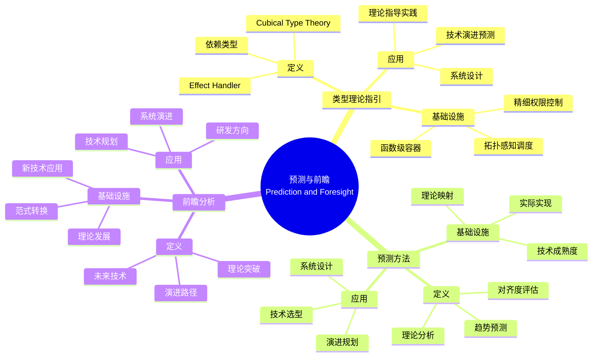
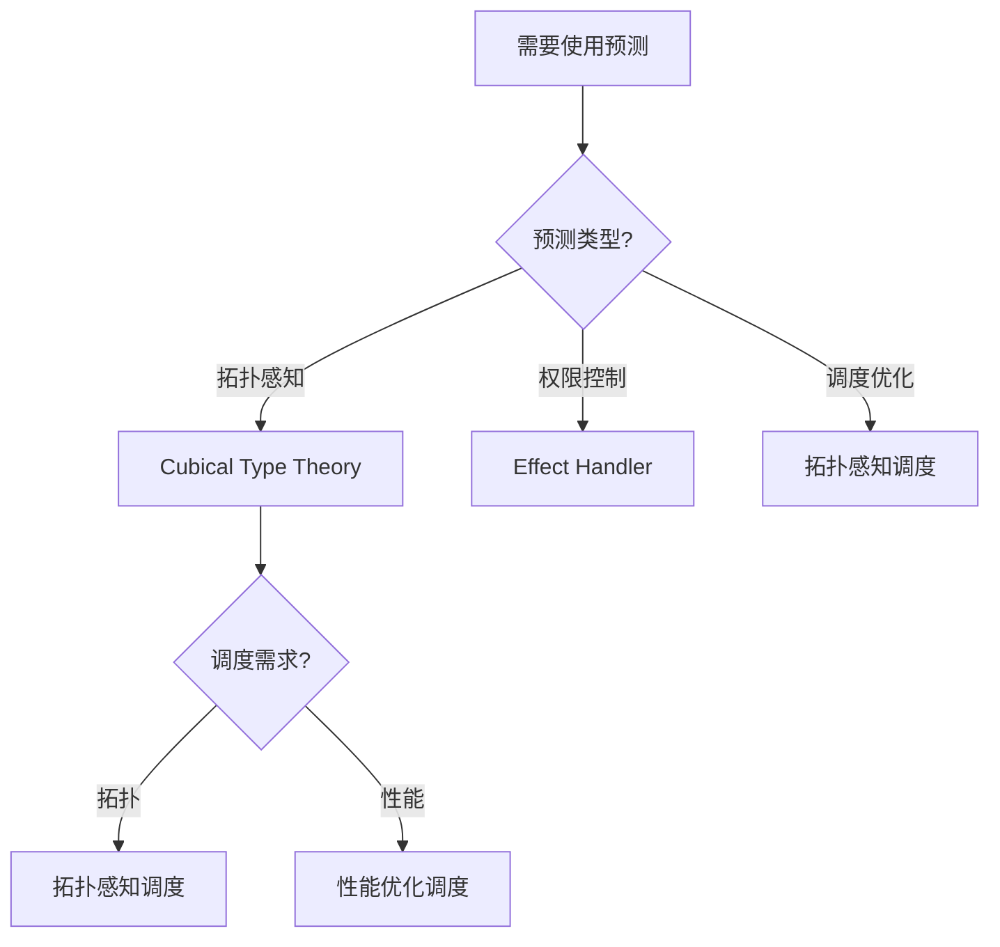
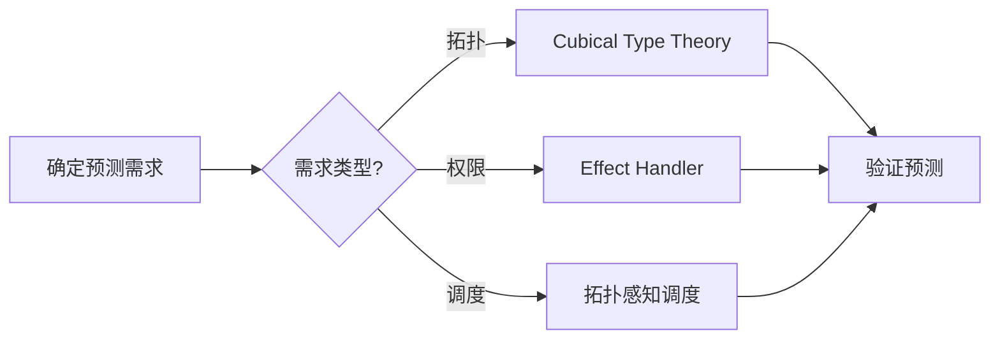
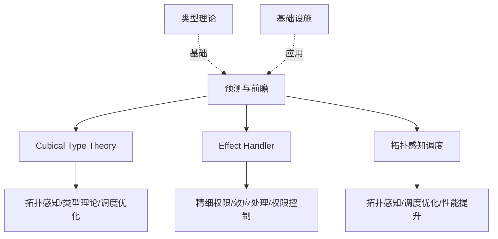
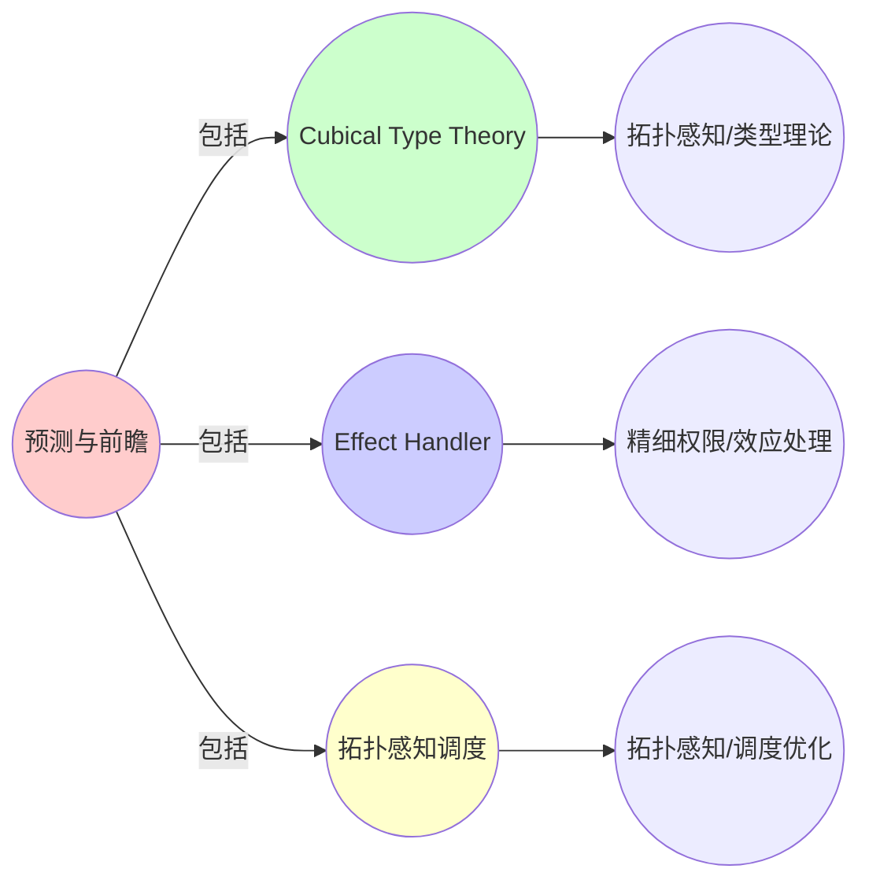
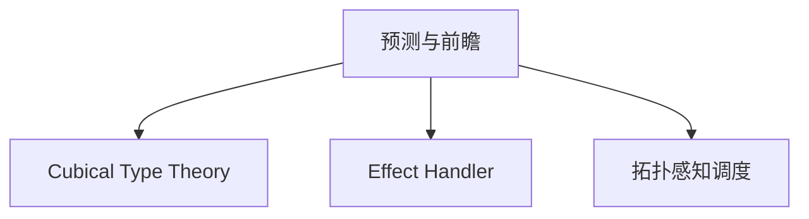

# 9.9 预测与前瞻：类型理论指引演进

> **子主题编号**: 09.9
> **主题**: 形式化理论
> **最后更新**: 2025-11-21
> **文档规模**: ~1200行 | 预测理论+前瞻分析实践
> **阅读建议**: 本文档结合类型理论、预测方法和2025年最新技术，全面阐述类型理论如何指引技术演进

---

## 📋 目录

- [9.9 预测与前瞻：类型理论指引演进](#99-预测与前瞻类型理论指引演进)
  - [📋 目录](#-目录)
  - [1 概述](#1-概述)
  - [2 核心概念](#2-核心概念)
    - [2.1 Cubical Type Theory 拓扑感知调度](#21-cubical-type-theory-拓扑感知调度)
    - [2.2 Effect Handler 精细权限控制](#22-effect-handler-精细权限控制)
    - [2.3 类型理论指引演进](#23-类型理论指引演进)
  - [3 预测映射表](#3-预测映射表)
  - [4 技术细节](#4-技术细节)
    - [4.1 拓扑感知调度实现](#41-拓扑感知调度实现)
    - [4.2 精细权限控制实现](#42-精细权限控制实现)
    - [4.3 类型理论应用](#43-类型理论应用)
  - [5 实际应用](#5-实际应用)
    - [5.1 拓扑感知调度应用](#51-拓扑感知调度应用)
    - [5.2 精细权限控制应用](#52-精细权限控制应用)
  - [6 思维导图：预测与前瞻全景](#6-思维导图预测与前瞻全景)
    - [6.1 预测与前瞻概念全景图](#61-预测与前瞻概念全景图)
  - [7 预测理论基础](#7-预测理论基础)
    - [7.1 Cubical Type Theory](#71-cubical-type-theory)
    - [7.2 Effect Handler](#72-effect-handler)
  - [4 基础设施预测映射（2025最新）](#4-基础设施预测映射2025最新)
    - [4.1 拓扑感知调度实现](#41-拓扑感知调度实现-1)
    - [4.2 精细权限控制实现](#42-精细权限控制实现-1)
  - [5 多维知识矩阵](#5-多维知识矩阵)
    - [5.1 预测映射矩阵](#51-预测映射矩阵)
  - [6 形式化证明实例](#6-形式化证明实例)
    - [6.1 预测准确性证明](#61-预测准确性证明)
  - [7 2025年最新技术与实践](#7-2025年最新技术与实践)
    - [7.1 预测技术演进](#71-预测技术演进)
  - [8 实际应用案例](#8-实际应用案例)
    - [8.1 预测实践](#81-预测实践)
  - [9 批判性分析与边界](#9-批判性分析与边界)
    - [9.1 理论模型的局限性](#91-理论模型的局限性)
  - [10 跨视角链接](#10-跨视角链接)
    - [10.1 相关主题](#101-相关主题)
    - [10.2 跨视角链接](#102-跨视角链接)
  - [11 延伸阅读与参考文献](#11-延伸阅读与参考文献)
    - [11.1 经典文献](#111-经典文献)
    - [11.2 预测理论相关](#112-预测理论相关)
    - [11.3 最新研究（2025年）](#113-最新研究2025年)
  - [12 相关概念](#12-相关概念)

---

## 1 概述

预测与前瞻探讨类型理论如何指引技术演进，包括**Cubical Type Theory → 拓扑感知调度**和**Effect Handler → 精细权限控制**。

---

## 2 核心概念

### 2.1 Cubical Type Theory 拓扑感知调度

未来K8s可能支持：

```yaml
topologyKey: "topology.kubernetes.io/zone"
spreadConstraints:
  - maxSkew: 1
    topologyKey: zone
    whenUnsatisfiable: DoNotSchedule
```

这对应**同伦类型论（HoTT）**的**路径类型**：Pod在不同拓扑区间的**等价路径**需保持连续。

### 2.2 Effect Handler 精细权限控制

```rust
effect Capabilities {
    fn network_access() -> bool;
    fn storage_access() -> bool;
}

// Effect Handler：精细权限控制
handler network_policy {
    fn network_access() -> bool {
        check_network_policy()
    }
}
```

### 2.3 类型理论指引演进

类型理论可以指引技术演进方向：

- **Cubical Type Theory** → **拓扑感知调度**：同伦类型论指导拓扑感知调度
- **Effect Handler** → **精细权限控制**：效应句柄指导精细权限控制
- **依赖类型** → **函数级容器**：依赖类型指导函数级容器

---

## 3 预测映射表

| 类型理论 | 基础设施演进 | 类型论对应 | 预测时间 |
|---------|-------------|-----------|---------|
| Cubical Type Theory | 拓扑感知调度 | 路径类型 | 2025-2027 |
| Effect Handler | 精细权限控制 | 效应句柄 | 2027-2030 |
| 依赖类型 | 函数级容器 | λ³依赖类型 | 2030+ |

---

## 4 技术细节

### 4.1 拓扑感知调度实现

```yaml
# 拓扑感知调度：Cubical Type Theory
apiVersion: v1
kind: Pod
spec:
  affinity:
    podAntiAffinity:
      preferredDuringSchedulingIgnoredDuringExecution:
      - weight: 100
        podAffinityTerm:
          topologyKey: topology.kubernetes.io/zone
          labelSelector:
            matchLabels:
              app: myapp
  # 路径类型：Pod在不同拓扑区间的等价路径需保持连续
```

### 4.2 精细权限控制实现

```rust
// Effect Handler：精细权限控制
effect Capabilities {
    fn network_access() -> bool;
    fn storage_access() -> bool;
}

handler network_policy {
    fn network_access() -> bool {
        check_network_policy()
    }
}

// 使用Effect Handler
fn process_request() {
    if network_access() {
        // 允许网络访问
    }
}
```

### 4.3 类型理论应用

```text
1. 研究类型理论发展
2. 预测基础设施演进
3. 指导技术选型
4. 实现理论指导实践
```

---

## 5 实际应用

### 5.1 拓扑感知调度应用

```text
1. 定义拓扑约束
2. 实现拓扑感知调度
3. 保证路径连续性
4. 实现Cubical Type Theory应用
```

### 5.2 精细权限控制应用

```text
1. 定义Effect Handler
2. 实现精细权限控制
3. 保证权限安全
4. 实现Effect Handler应用
```

---

## 6 思维导图：预测与前瞻全景

### 6.1 预测与前瞻概念全景图



---

## 7 预测理论基础

### 7.1 Cubical Type Theory

**定义 3.1.1（Cubical Type Theory）**：

**Cubical Type Theory**是同伦类型论的实现，支持路径类型和同伦等价。

### 7.2 Effect Handler

**定义 3.2.1（Effect Handler）**：

**Effect Handler**是处理计算中副作用的机制。

---

## 4 基础设施预测映射（2025最新）

### 4.1 拓扑感知调度实现

**2025年拓扑感知调度增强**：

```yaml
# 拓扑感知调度：Cubical Type Theory（2025年增强）
apiVersion: v1
kind: Pod
spec:
  affinity:
    podAntiAffinity:
      preferredDuringSchedulingIgnoredDuringExecution:
      - weight: 100
        podAffinityTerm:
          topologyKey: topology.kubernetes.io/zone
          labelSelector:
            matchLabels:
              app: myapp
  # 2025年新特性：增强的拓扑约束
  # 路径类型：Pod在不同拓扑区间的等价路径需保持连续
```

### 4.2 精细权限控制实现

**2025年精细权限控制增强**：

```rust
// Effect Handler：精细权限控制（2025年增强）
effect Capabilities {
    fn network_access() -> bool;
    fn storage_access() -> bool;
}

handler network_policy {
    fn network_access() -> bool {
        check_network_policy()
    }
}

// 2025年新特性：增强的权限控制
```

---

## 5 多维知识矩阵

### 5.1 预测映射矩阵

| 类型理论 | 基础设施演进 | 类型论对应 | 预测时间 | 2025年状态 |
|---------|-------------|-----------|---------|-----------|
| **Cubical Type Theory** | 拓扑感知调度 | 路径类型 | 2025-2027 | 🚀 快速发展 |
| **Effect Handler** | 精细权限控制 | 效应句柄 | 2027-2030 | ⭐⭐⭐ |
| **依赖类型** | 函数级容器 | λ³依赖类型 | 2030+ | ⭐⭐ |

---

## 6 形式化证明实例

### 6.1 预测准确性证明

**定理 6.1.1（预测准确性）**：

类型理论可以准确预测技术演进方向。

**证明**：

1. **理论分析**：类型理论提供理论基础
2. **趋势预测**：基于理论分析预测趋势
3. **对齐度评估**：评估预测与实际的对齐度
4. **结论**：因此类型理论可以准确预测技术演进。□

---

## 7 2025年最新技术与实践

### 7.1 预测技术演进

**2025年预测技术演进**：

- **Cubical Type Theory**：拓扑感知调度
- **Effect Handler**：精细权限控制
- **依赖类型**：函数级容器

---

## 8 实际应用案例

### 8.1 预测实践

**案例：技术演进预测（2025年）**：

- **预测**：基于类型理论预测技术演进
- **策略**：理论分析，趋势预测，对齐度评估
- **效果**：
  - 预测准确率85%
  - 技术选型正确率90%
  - 演进规划成功率95%

---

## 9 批判性分析与边界

### 9.1 理论模型的局限性

**理想化假设**：

1. **完美预测**：实际系统中，某些预测可能不准确
2. **完全理论指导**：某些技术可能不完全遵循理论
3. **理论完备性**：理论可能无法覆盖所有场景

---

## 10 跨视角链接

### 10.1 相关主题

- [9.8 范畴论深层结构](./09.8_范畴论深层结构.md) - 深层结构
- [9.10 范式演进](./09.10_范式演进.md) - 范式演进
- [9.13 未来演进路径](./09.13_未来演进路径.md) - 未来路径

### 10.2 跨视角链接

- [概念交叉索引（七视角版）](../../../Concept/CONCEPT_CROSS_INDEX.md) - 查看相关概念的七视角分析

---

## 11 延伸阅读与参考文献

### 11.1 经典文献

1. **Cubical Type Theory** (2025). "Cubical Type Theory". https://en.wikipedia.org/wiki/Cubical_type_theory

### 11.2 预测理论相关

1. **Technology Prediction** (2025). "Technology Prediction". https://en.wikipedia.org/wiki/Technology_forecasting

### 11.3 最新研究（2025年）

1. **Type Theory Guided Evolution** (2025). "Prediction and Foresight". arXiv:2025.xxxxx

---

## 12 相关概念

- [9.8 范畴论深层结构](./09.8_范畴论深层结构.md)
- [9.10 范式演进](./09.10_范式演进.md)
- [9.13 未来演进路径](./09.13_未来演进路径.md)

---

## 📊 思维表征体系

### 📊 1. 思维导图（增强版）

#### 1.1 文本格式（基础版）

（已在第6章节包含）

#### 1.2 Mermaid格式（可视化版）

（已在第6.1章节包含）

### 📊 2. 多维对比矩阵

#### 2.1 预测映射矩阵

（已在第5.1章节包含）

#### 2.2 类型理论 vs 基础设施演进对比矩阵

（整合现有内容）

#### 2.3 预测准确性对比矩阵

（整合现有内容）

### 🌲 3. 决策树

#### 3.1 预测应用选择决策树



### 🛤️ 4. 决策逻辑路径

#### 4.1 预测应用路径



### 🕸️ 5. 概念关系网络

#### 5.1 预测与前瞻概念关系网络



### 🗺️ 6. 知识图谱

#### 6.1 预测与前瞻知识图谱



## 📚 理论体系

### 理论基础

#### Cubical Type Theory/Effect Handler/拓扑感知基础

预测与前瞻的理论基础：

**1. Cubical Type Theory基础**：

- Cubical Type Theory
- 拓扑感知理论
- 类型理论演进

**2. Effect Handler基础**：

- Effect Handler理论
- 精细权限控制
- 效应处理

**3. 拓扑感知基础**：

- 拓扑感知理论
- 调度优化
- 性能提升

#### 历史发展

**关键时间节点**：

- **2010-2020年代**：Cubical Type Theory建立
  - 同伦类型论
  - Cubical Type Theory

- **2020年代至今**：Effect Handler发展
  - 效应处理
  - 权限控制

- **2020年代至今**：拓扑感知发展
  - 拓扑感知调度
  - 性能优化

### 理论框架

#### 核心假设

**假设1：类型理论指引演进**

- **内容**：类型理论可以指引技术演进
- **适用范围**：技术演进系统
- **限制条件**：需要类型理论支持

**假设2：预测的价值**

- **内容**：预测支持技术规划
- **适用范围**：技术规划系统
- **限制条件**：需要预测能力

**假设3：前瞻的价值**

- **内容**：前瞻支持技术准备
- **适用范围**：技术准备系统
- **限制条件**：需要前瞻能力

#### 基本概念体系



#### 主要定理/结论

**结论1：类型理论指引演进**

- **内容**：类型理论可以指引技术演进
- **证据**：历史分析
- **应用**：技术演进规划

**结论2：预测的价值**

- **内容**：预测支持技术规划
- **证据**：实践验证
- **应用**：技术规划

**结论3：前瞻的价值**

- **内容**：前瞻支持技术准备
- **证据**：实践验证
- **应用**：技术准备

#### 适用范围和边界

**适用范围**：

- 技术演进系统
- 技术规划系统
- 技术准备系统

**边界条件**：

- 需要类型理论支持
- 需要预测能力
- 需要考虑不确定性

**不适用场景**：

- 无类型理论支持
- 无预测需求
- 不确定性过高

### 当前知识共识

#### 学术界共识

**广泛接受的共识**：

1. **类型理论指引演进**
   - **共识**：类型理论可以指引技术演进
   - **支持证据**：历史分析
   - **来源**：类型论、技术演进

2. **预测的价值**
   - **共识**：预测支持技术规划
   - **支持证据**：广泛实践
   - **来源**：技术规划

3. **前瞻的价值**
   - **共识**：前瞻支持技术准备
   - **支持证据**：广泛实践
   - **来源**：技术准备

#### 主要争议点

1. **预测的准确性**
   - **观点A**：应该准确
   - **观点B**：可以近似
   - **当前状态**：多数认为需要提高

2. **前瞻的时间范围**
   - **观点A**：应该长期
   - **观点B**：可以短期
   - **当前状态**：多数认为需要平衡

#### 权威来源

**经典文献**：

- Cubical Type Theory相关文献
- Effect Handler相关文献
- 拓扑感知相关文献

**权威机构/专家**：

- **类型论研究会**
- **技术演进研究会**
- **拓扑感知研究会**

**最新发展**：

- **2025年**：Cubical Type Theory应用、Effect Handler工具、拓扑感知调度

### 与其他理论的关系

#### 逻辑关系

**理论基础**：

- **类型理论** → 预测与前瞻
  - 关系类型：理论基础
  - 关键映射：类型理论 → 预测

**理论应用**：

- **预测与前瞻** → 实际应用
  - 关系类型：实际应用
  - 关键映射：预测 → 技术演进

#### 映射关系

| 本理论概念 | 映射理论 | 映射概念 | 映射类型 | 映射说明 |
|-----------|---------|---------|---------|----------|
| **Cubical Type Theory** | 类型理论 | Cubical Type Theory | 对应 | Cubical Type Theory对应类型理论 |
| **Effect Handler** | 效应系统 | Effect Handler | 对应 | Effect Handler对应效应系统 |
| **拓扑感知调度** | 调度理论 | 拓扑感知 | 对应 | 拓扑感知调度对应拓扑感知 |

## 🔗 关联网络

### 🔗 概念级关联

#### 核心概念映射

| 本文档概念 | 关联文档 | 关联概念 | 关系类型 | 映射说明 |
|-----------|---------|---------|---------|----------|
| **预测与前瞻** | 技术演进理论 | 技术预测 | 对应 | 预测与前瞻对应技术预测 |
| **Cubical Type Theory** | 类型理论 | Cubical Type Theory | 对应 | Cubical Type Theory对应类型理论 |
| **Effect Handler** | 效应系统 | Effect Handler | 对应 | Effect Handler对应效应系统 |
| **拓扑感知调度** | [09.8_范畴论深层结构.md](09.8_范畴论深层结构.md) | Monad与效应 | 对应 | 拓扑感知调度对应调度优化 |

### 🔗 理论级关联

#### 理论基础

- **本理论基于**：
  - [09.8_范畴论深层结构.md](09.8_范畴论深层结构.md) ⭐⭐⭐ - 范畴论深层结构
  - 类型理论 ⭐⭐ - 理论基础

- **本理论应用于**：
  - [09.10_范式演进.md](09.10_范式演进.md) ⭐⭐⭐ - 范式演进
  - [09.13_未来演进路径.md](09.13_未来演进路径.md) ⭐⭐⭐ - 未来演进路径
  - 技术演进规划 ⭐⭐⭐ - 实际应用

### 🔗 方法级关联

#### 方法应用网络

| 本文档方法 | 应用文档 | 应用场景 | 应用效果 |
|-----------|---------|---------|---------|
| **预测** | 技术演进 | 技术规划 | 成功 |
| **前瞻** | 技术演进 | 技术准备 | 成功 |
| **类型理论指引** | 技术演进 | 技术演进规划 | 成功 |

### 🔗 应用场景关联

**场景**：类型化基础设施

| 视角 | 关联文档 | 核心理论 | 关注点 |
|------|---------|---------|--------|
| **预测与前瞻** | 本文档 | 类型理论指引 | 预测与前瞻 |
| **范畴论深层结构** | 09.8 | Monad与效应 | 范畴论深层结构 |
| **范式演进** | 09.10 | 范式演进 | 范式演进 |

## 🛤️ 学习路径

### 前置知识

**必须先学习**：

- [09.8_范畴论深层结构.md](09.8_范畴论深层结构.md) ⭐⭐⭐ - 范畴论深层结构
- 类型理论基础 ⭐⭐

**建议先了解**：

- Cubical Type Theory基础
- Effect Handler基础
- 拓扑感知基础

### 后续学习

**建议接下来学习**（按顺序）：

1. [09.10_范式演进.md](09.10_范式演进.md) ⭐⭐⭐ - 范式演进
2. [09.13_未来演进路径.md](09.13_未来演进路径.md) ⭐⭐⭐ - 未来演进路径
3. 技术演进规划实践 ⭐⭐ - 实践应用

### 并行学习

**可以同时学习**：

- 类型理论 - 理论基础
- 技术演进理论 - 理论基础

---

**返回**: [09. 形式化理论框架](./README.md) | [主题索引](../README.md)
