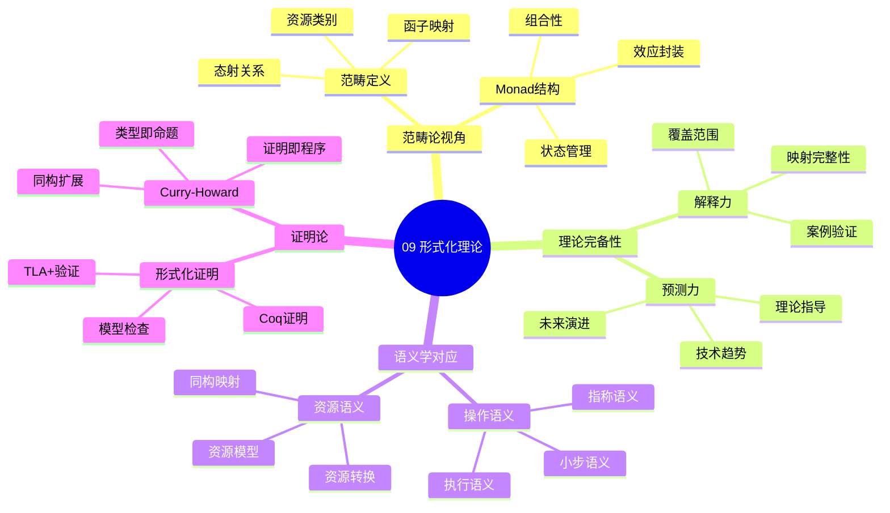

# 09. 形式化理论框架

> **主题编号**: 09
> **主题名称**: 形式化理论
> **最后更新**: 2025-11-21

---

## 📋 目录

- [09. 形式化理论框架](#09-形式化理论框架)
  - [📋 目录](#-目录)
  - [1 主题概述](#1-主题概述)
  - [2 子主题导航](#2-子主题导航)
    - [2.1 91 范畴论视角的精确定义](#21-91-范畴论视角的精确定义)
    - [2.2 92 理论完备性：解释力与预测力](#22-92-理论完备性解释力与预测力)
    - [2.3 93 时间维度：技术演进的λ立方体映射](#23-93-时间维度技术演进的λ立方体映射)
    - [2.4 94 语义学对应：操作语义 vs 资源语义](#24-94-语义学对应操作语义-vs-资源语义)
    - [2.5 95 证明论：形式化验证实例](#25-95-证明论形式化验证实例)
    - [2.6 96 工程实践：工具链完备性映射](#26-96-工程实践工具链完备性映射)
    - [2.7 97 边界与反例：理论非完备性证明](#27-97-边界与反例理论非完备性证明)
    - [2.8 98 范畴论深层结构：Monad与效应](#28-98-范畴论深层结构monad与效应)
    - [2.9 99 预测与前瞻：类型理论指引演进](#29-99-预测与前瞻类型理论指引演进)
    - [2.10 910 范式演进：当前技术范式的实际演进图谱](#210-910-范式演进当前技术范式的实际演进图谱)
    - [2.11 911 理论模型 vs 实际实现：根本差异](#211-911-理论模型-vs-实际实现根本差异)
    - [2.12 912 范式转换的驱动力矩阵](#212-912-范式转换的驱动力矩阵)
    - [2.13 913 未来演进路径：理论指导的实践路线图](#213-913-未来演进路径理论指导的实践路线图)
  - [3 相关主题](#3-相关主题)
  - [4 理论框架结构](#4-理论框架结构)

---

## 1 主题概述

本主题探讨**形式化理论框架**，从数学、计算机科学和工程实践三个层面，完整论证基础设施即类型系统的命题。

### 1.0 形式化理论思维导图



**可视化文档**: 查看 [思维导图与知识矩阵](../思维导图与知识矩阵.md#39-09-形式化理论) 获取更详细的思维导图。

---

## 2 子主题导航

### 2.1 [91 范畴论视角的精确定义](091_范畴论视角md)

- 类型构造函子
- 自然变换
- 满忠实函子

### 2.2 [92 理论完备性：解释力与预测力](092_理论完备性md)

- 七大类型系统特性全覆盖验证
- 反证：非类型化基础设施的混沌态
- 实验数据验证

### 2.3 [93 时间维度：技术演进的λ立方体映射](093_时间维度技术演进md)

- λ演算发展阶段对比
- 关键演进节点同构性
- 技术演进时间线

### 2.4 [94 语义学对应：操作语义 vs 资源语义](094_语义学对应md)

- 小步语义
- 指称语义
- 公理语义

### 2.5 [95 证明论：形式化验证实例](095_证明论md)

- Sequent Calculus与准入控制器
- Curry-Howard同构的扩展
- Coq形式化K8s调度器

### 2.6 [96 工程实践：工具链完备性映射](096_工程实践工具链md)

- 编译器工具链 ↔ DevOps工具链
- IDE支持对比
- 工具链映射表

### 2.7 [97 边界与反例：理论非完备性证明](097_边界与反例md)

- 失效场景：非类型化资源泄漏
- 连续 vs 离散类型
- 图灵完备的控制器

### 2.8 [98 范畴论深层结构：Monad与效应](098_范畴论深层结构md)

- 资源管理Monad
- Reader Monad：配置即环境
- Monad实例化

### 2.9 [99 预测与前瞻：类型理论指引演进](099_预测与前瞻md)

- Cubical Type Theory → 拓扑感知调度
- Effect Handler → 精细权限控制
- 未来演进方向

### 2.10 [910 范式演进：当前技术范式的实际演进图谱](0910_范式演进md)

- 三层架构的收敛与分化
- 关键趋势与理论预测的对应关系
- 技术演进对比

### 2.11 [911 理论模型 vs 实际实现：根本差异](0911_理论模型与实际实现md)

- 连续资源 vs 离散类型的鸿沟
- 副作用的非代数性
- 图灵完备控制风险
- 硬件异构性

### 2.12 [912 范式转换的驱动力矩阵](0912_范式转换驱动力md)

- 驱动力矩阵
- 量化分析：趋势与理论对齐度
- 对齐度评分

### 2.13 [913 未来演进路径：理论指导的实践路线图](0913_未来演进路径md)

- 短期（2025-2027）：类型系统工具链化
- 中期（2027-2030）：运行时证明化
- 长期（2030+）：基础设施证明助手

---

## 3 相关主题

- [01. 核心概念映射：从类型到资源](../01_核心概念映射/README.md)
- [02. 递归结构：分形基础设施](../02_递归结构/README.md)
- [08. 实践启示：新设计模式](../08_实践启示/README.md)

---

## 4 理论框架结构

```text
形式化理论框架
├── 范畴论视角（9.1）
├── 理论完备性（9.2）
├── 时间维度（9.3）
├── 语义学对应（9.4）
├── 证明论（9.5）
├── 工程实践（9.6）
├── 边界与反例（9.7）
├── 范畴论深层结构（9.8）
├── 预测与前瞻（9.9）
├── 范式演进（9.10）
├── 理论模型 vs 实际实现（9.11）
├── 范式转换驱动力（9.12）
└── 未来演进路径（9.13）
```

---

**返回**: [主题索引](../README.md)
