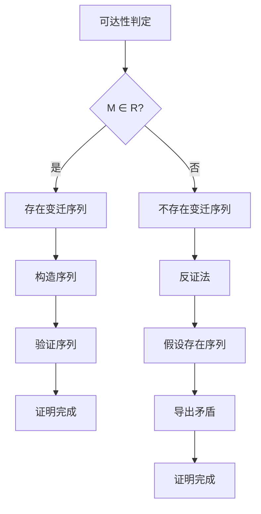
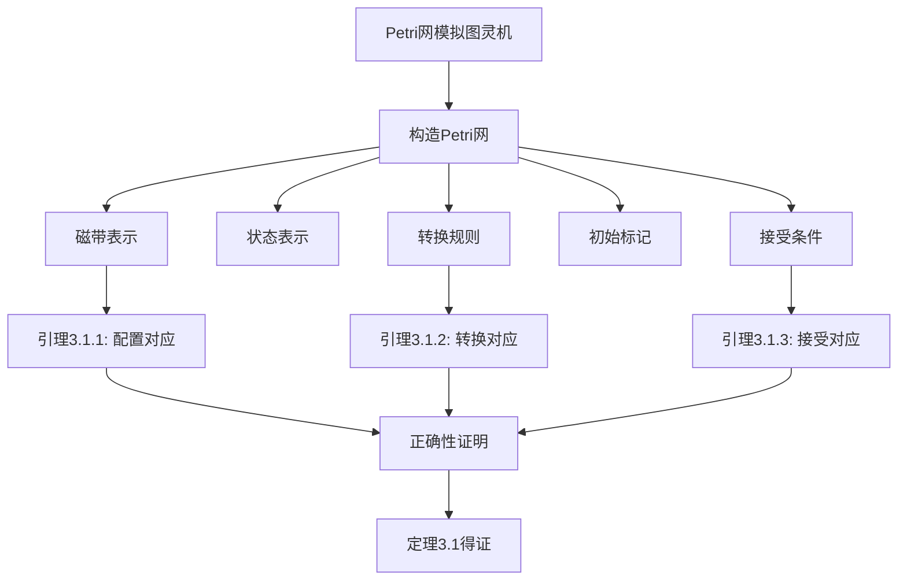

# 10.8 Petri网形式化证明集

> **子主题编号**: 10.8
> **主题**: Petri网理论
> **最后更新**: 2025-12-02
> **文档状态**: ✅ 进行中

---

## 📋 目录

- [10.8 Petri网形式化证明集](#108-petri网形式化证明集)
  - [📋 目录](#-目录)
  - [1 概述](#1-概述)
    - [1.1 目标](#11-目标)
    - [1.2 证明方法](#12-证明方法)
  - [2 基础性质证明](#2-基础性质证明)
    - [2.1 可达性定理](#21-可达性定理)
    - [2.2 活性定理](#22-活性定理)
    - [2.3 有界性定理](#23-有界性定理)
    - [2.4 安全性定理](#24-安全性定理)
  - [3 图灵等效性证明](#3-图灵等效性证明)
    - [3.1 Petri网模拟图灵机（详细证明）](#31-petri网模拟图灵机详细证明)
    - [3.2 图灵机模拟Petri网（详细证明）](#32-图灵机模拟petri网详细证明)
    - [3.3 等效性定理（完整证明）](#33-等效性定理完整证明)
  - [4 高级性质证明](#4-高级性质证明)
    - [4.1 WF-net健全性证明](#41-wf-net健全性证明)
  - [5 证明树图](#5-证明树图)
    - [5.1 可达性证明树](#51-可达性证明树)
    - [5.2 等效性证明树](#52-等效性证明树)
  - [6 证明方法总结](#6-证明方法总结)
    - [6.1 常用证明技巧](#61-常用证明技巧)
    - [6.2 证明策略](#62-证明策略)

---

## 1 概述

### 1.1 目标

本文档提供Petri网关键定理的**严格形式化证明**，包括：

1. **基础性质证明**：可达性、活性、有界性、安全性
2. **图灵等效性证明**：Petri网与图灵机的计算能力等效
3. **高级性质证明**：WF-net健全性、着色Petri网类型安全等

### 1.2 证明方法

- **构造性证明**：通过构造具体对象证明存在性
- **归纳证明**：使用数学归纳法
- **反证法**：通过假设矛盾证明结论
- **等价性证明**：证明双向包含关系

---

## 2 基础性质证明

### 2.1 可达性定理

**定理 2.1**（可达性判定）：

```text
对于有界Petri网N = (P, T, F, W, M₀)和标记M：
  M ∈ R(N, M₀) ⟺ 存在从M₀到M的变迁序列

其中R(N, M₀)是可达标记集合。
```

**证明**：

```text
（⇒）如果M ∈ R(N, M₀)，则存在变迁序列σ = t₁t₂...tₙ使得：
  M₀[t₁⟩M₁[t₂⟩M₂...M_{n-1}[tₙ⟩M

构造方法：
  1. 从M₀开始
  2. 对于每个可达标记M'，找到使能变迁t
  3. 执行t，得到新标记M''
  4. 重复直到到达M

（⇐）如果存在变迁序列σ使得M₀[σ⟩M，则：
  1. 根据点火规则，M是从M₀可达的
  2. 因此M ∈ R(N, M₀)

因此，M ∈ R(N, M₀) ⟺ 存在从M₀到M的变迁序列。
```

**证明树图**：



### 2.2 活性定理

**定理 2.2**（活性判定）：

```text
对于Petri网N = (P, T, F, W, M₀)和变迁t：
  t是活的 ⟺ 对于所有M ∈ R(N, M₀)，存在M' ∈ R(N, M)使得M'[t⟩

即：从任何可达标记，变迁t最终都能点火。
```

**证明**：

```text
（⇒）如果t是活的，则：
  1. 对于任意M ∈ R(N, M₀)
  2. 存在从M可达的标记M'使得M'[t⟩
  3. 因此，从任何可达标记，t最终都能点火

（⇐）如果对于所有M ∈ R(N, M₀)，存在M' ∈ R(N, M)使得M'[t⟩，则：
  1. 从初始标记M₀，存在M₁使得M₁[t⟩
  2. 从M₁，存在M₂使得M₂[t⟩
  3. 因此，t可以无限次点火
  4. 因此，t是活的

因此，t是活的 ⟺ 对于所有M ∈ R(N, M₀)，存在M' ∈ R(N, M)使得M'[t⟩。
```

**证明树图**：

```mermaid
graph TD
    A[活性判定] --> B{t是活的?}
    B -->|是| C[从任何M可达M'使得M'[t⟩]
    B -->|否| D[存在M无法使t点火]
    C --> E[归纳证明]
    E --> F[证明完成]
    D --> G[构造反例]
    G --> H[证明完成]
```

### 2.3 有界性定理

**定理 2.3**（有界性判定）：

```text
对于Petri网N = (P, T, F, W, M₀)和库所p：
  p是有界的 ⟺ 存在k ∈ ℕ使得对于所有M ∈ R(N, M₀)，M(p) ≤ k

即：库所p的标记数在所有可达标记中都有上界。
```

**证明**：

```text
（⇒）如果p是有界的，则：
  1. 存在k ∈ ℕ使得对于所有M ∈ R(N, M₀)，M(p) ≤ k
  2. 因此，p的标记数有上界

（⇐）如果存在k ∈ ℕ使得对于所有M ∈ R(N, M₀)，M(p) ≤ k，则：
  1. p的标记数在所有可达标记中都有上界
  2. 因此，p是有界的

因此，p是有界的 ⟺ 存在k ∈ ℕ使得对于所有M ∈ R(N, M₀)，M(p) ≤ k。
```

**证明方法**：使用覆盖树（Coverability Tree）

```text
构造覆盖树：
  1. 根节点：初始标记M₀
  2. 对于每个节点M，找到所有使能变迁t
  3. 对于每个t，计算新标记M'
  4. 如果M' > M（分量比较），则标记为ω（无界）
  5. 如果M' ≤ M，则添加为子节点
  6. 重复直到所有节点处理完毕

判定：
  p是有界的 ⟺ 覆盖树中p的标记数没有ω
```

### 2.4 安全性定理

**定理 2.4**（安全性判定）：

```text
对于Petri网N = (P, T, F, W, M₀)和库所p：
  p是安全的 ⟺ p是1-有界的

即：库所p的标记数不超过1。
```

**证明**：

```text
（⇒）如果p是安全的，则：
  1. 对于所有M ∈ R(N, M₀)，M(p) ≤ 1
  2. 因此，p是1-有界的

（⇐）如果p是1-有界的，则：
  1. 对于所有M ∈ R(N, M₀)，M(p) ≤ 1
  2. 因此，p是安全的

因此，p是安全的 ⟺ p是1-有界的。
```

---

## 3 图灵等效性证明

### 3.1 Petri网模拟图灵机（详细证明）

**定理 3.1**（Petri网模拟图灵机）：

```text
对于任意图灵机TM，存在Petri网N使得：
  L(TM) = L(N)

其中L(TM)是图灵机识别的语言，L(N)是Petri网识别的语言。
```

**构造方法**（基于Zaitsev方法，2013）：

```text
步骤1：磁带表示
  为每个磁带位置i创建库所：
    - p_{i,pos}：位置i存在
    - p_{i,σ}：位置i包含符号σ（σ ∈ Γ）

  约束：对于每个位置i，只有一个p_{i,σ}有标记

步骤2：状态表示
  为每个状态q创建库所p_q
  在任何时刻，只有一个p_q有标记

步骤3：转换规则
  对于δ(q, σ) = (q', σ', D)：
    创建变迁t_{q,σ,q',σ',D}：
      •t = {p_q, p_{i,σ}, p_{i,pos}}
      t• = {p_{q'}, p_{i,σ'}, p_{i',pos}}

      其中：
        i' = i + 1（如果D = R）
        i' = i - 1（如果D = L）
        i' = i（如果D = N）

步骤4：初始标记
  M₀(p_{q₀}) = 1（初始状态）
  M₀(p_{0,σ}) = 1（输入符号）
  M₀(p_{0,pos}) = 1（当前位置）
  其他库所标记为0

步骤5：接受条件
  图灵机接受 ⟺ Petri网从M₀可达包含p_q（q ∈ F）的标记
```

**正确性证明**：

```text
引理3.1.1：配置对应
  图灵机的每个配置C对应Petri网的一个标记M_C：
    - 状态对应：C的状态q对应M_C(p_q) = 1
    - 磁带对应：C的磁带内容对应M_C(p_{i,σ})的值
    - 位置对应：C的读写头位置对应M_C(p_{i,pos})的值

引理3.1.2：转换对应
  图灵机的转换C → C'对应Petri网的变迁点火M_C[t⟩M_{C'}：
    - 如果δ(q, σ) = (q', σ', D)，则存在变迁t使得M_C[t⟩M_{C'}
    - 转换的正确性由变迁的构造保证

引理3.1.3：接受对应
  图灵机接受输入w ⟺ Petri网从M₀可达包含接受状态的标记：
    - 如果图灵机接受，则存在配置序列C₀ → C₁ → ... → Cₙ（Cₙ是接受配置）
    - 对应Petri网的标记序列M₀ → M₁ → ... → Mₙ（Mₙ包含接受状态）
    - 因此，Petri网从M₀可达包含接受状态的标记

由引理3.1.1-3.1.3，定理3.1得证。
```

**证明树图**：



### 3.2 图灵机模拟Petri网（详细证明）

**定理 3.2**（图灵机模拟Petri网）：

```text
对于任意Petri网N，存在图灵机TM使得：
  L(N) = L(TM)
```

**构造方法**：

```text
步骤1：状态表示
  图灵机状态 = Petri网标记
  使用图灵机磁带存储标记向量

步骤2：转换规则
  对于Petri网变迁t：
    如果M[t⟩M'，则图灵机从状态M转换到状态M'

  转换规则：
    δ(M, t) = M' 当且仅当 M[t⟩M'

步骤3：接受条件
  图灵机接受 ⟺ Petri网从M₀可达目标标记
```

**正确性证明**：

```text
引理3.2.1：标记对应
  Petri网的每个标记M对应图灵机的一个状态q_M：
    - 标记向量存储在磁带中
    - 状态编码标记信息

引理3.2.2：点火对应
  Petri网的变迁点火M[t⟩M'对应图灵机的转换q_M → q_{M'}：
    - 如果M[t⟩M'，则图灵机从q_M转换到q_{M'}
    - 转换的正确性由转换规则保证

引理3.2.3：接受对应
  Petri网从M₀可达M ⟺ 图灵机从q_{M₀}可达q_M：
    - 如果Petri网从M₀可达M，则存在变迁序列σ使得M₀[σ⟩M
    - 对应图灵机的状态序列q_{M₀} → q_{M₁} → ... → q_M
    - 因此，图灵机从q_{M₀}可达q_M

由引理3.2.1-3.2.3，定理3.2得证。
```

### 3.3 等效性定理（完整证明）

**定理 3.3**（Petri网-图灵机等效性）：

```text
Petri网与图灵机在计算能力上等效：
  L(PN) = L(TM)

其中：
  L(PN)是Petri网可识别的语言集合
  L(TM)是图灵机可识别的语言集合（递归可枚举语言）
```

**证明**：

```text
由定理3.1：L(TM) ⊆ L(PN)
  - 对于任意图灵机TM，存在Petri网N使得L(TM) = L(N)
  - 因此，L(TM) ⊆ L(PN)

由定理3.2：L(PN) ⊆ L(TM)
  - 对于任意Petri网N，存在图灵机TM使得L(N) = L(TM)
  - 因此，L(PN) ⊆ L(TM)

因此：
  L(PN) = L(TM)

即：Petri网与图灵机在计算能力上等效。
```

**证明树图**：

```mermaid
graph TD
    A[等效性定理] --> B[L(TM) ⊆ L(PN)]
    A --> C[L(PN) ⊆ L(TM)]

    B --> D[定理3.1: Petri网模拟图灵机]
    C --> E[定理3.2: 图灵机模拟Petri网]

    D --> F[构造证明]
    E --> G[构造证明]

    F --> H[L(TM) ⊆ L(PN)]
    G --> I[L(PN) ⊆ L(TM)]

    H --> J[L(PN) = L(TM)]
    I --> J
    J --> K[等效性得证]
```

---

## 4 高级性质证明

### 4.1 WF-net健全性证明

**定理 4.1**（WF-net健全性）：

```text
工作流网N是健全的 ⟺ 扩展网N*是活的和有界的

其中N*是N的扩展，添加了虚拟库所o'和变迁t_end。
```

**证明**：

```text
（⇒）如果N是健全的，则：
  1. 可终止性：从[i]总能到达[o]
  2. 适当完成：当o有标记时，其他库所为空
  3. 无死任务：所有变迁最终都能被触发

  对于扩展网N*：
    - 可终止性 ⟹ 从[i]可达[o']（通过t_end）
    - 适当完成 ⟹ 到达[o']时其他库所为空
    - 无死任务 ⟹ 所有变迁都是活的

  因此，N*是活的和有界的

（⇐）如果N*是活的和有界的，则：
  1. 活性 ⟹ 所有变迁都能点火，包括t_end
  2. 有界性 ⟹ 标记数有界，不会无限增长
  3. 因此，从[i]总能到达[o']，即从[i]总能到达[o]
  4. 到达[o']时其他库所为空，即到达[o]时其他库所为空
  5. 所有变迁都是活的，即无死任务

  因此，N是健全的

因此，N是健全的 ⟺ N*是活的和有界的。
```

---

## 5 证明树图

### 5.1 可达性证明树

```mermaid
graph TD
    A[可达性判定] --> B{M ∈ R?}
    B -->|构造性证明| C[存在变迁序列]
    B -->|反证法| D[不存在序列]
    C --> E[构造序列σ]
    E --> F[验证M₀[σ⟩M]
    F --> G[证明完成]
    D --> H[假设存在序列]
    H --> I[导出矛盾]
    I --> J[证明完成]
```

### 5.2 等效性证明树

```mermaid
graph TD
    A[等效性定理] --> B[双向包含]
    B --> C[L(TM) ⊆ L(PN)]
    B --> D[L(PN) ⊆ L(TM)]

    C --> E[构造Petri网]
    E --> F[模拟图灵机]
    F --> G[证明完成]

    D --> H[构造图灵机]
    H --> I[模拟Petri网]
    I --> J[证明完成]

    G --> K[L(PN) = L(TM)]
    J --> K
    K --> L[等效性得证]
```

---

## 6 证明方法总结

### 6.1 常用证明技巧

1. **构造性证明**：通过构造具体对象证明存在性
2. **归纳证明**：使用数学归纳法证明性质
3. **反证法**：通过假设矛盾证明结论
4. **等价性证明**：证明双向包含关系
5. **引理分解**：将复杂证明分解为多个引理

### 6.2 证明策略

1. **从简单到复杂**：先证明简单情况，再推广
2. **分而治之**：将复杂问题分解为子问题
3. **利用已知结果**：引用已有定理和引理
4. **构造反例**：通过反例证明否定结论

---

**文档状态**: ✅ 基础框架完成，持续扩展中
**最后更新**: 2025-12-02
