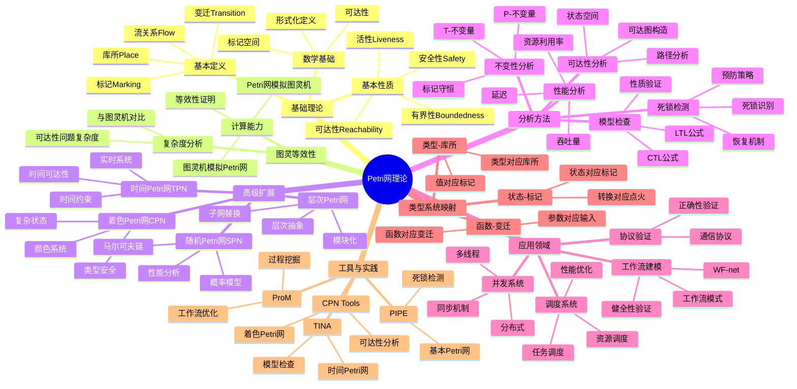
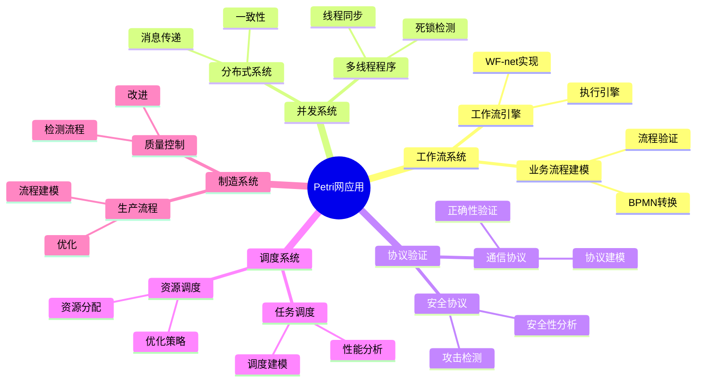
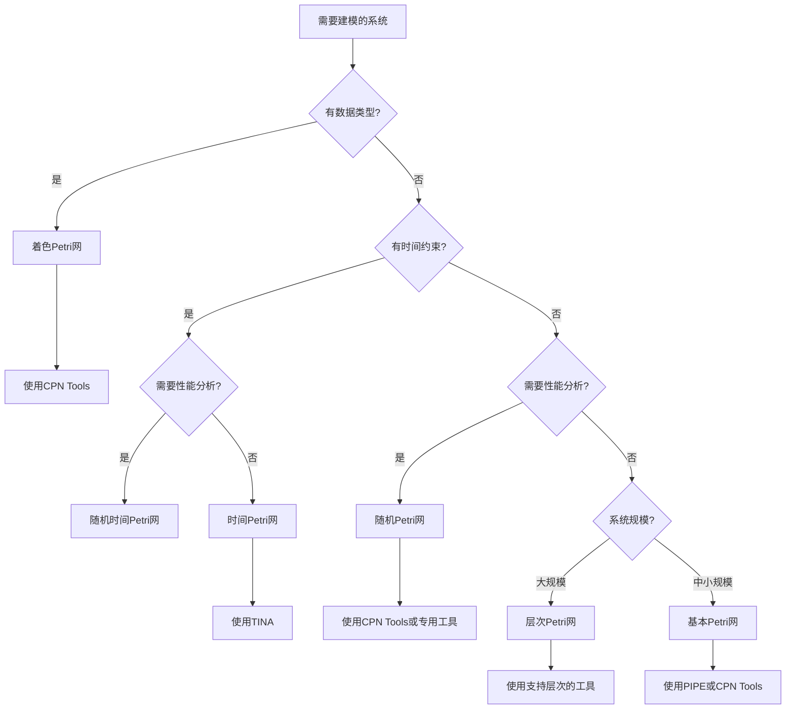
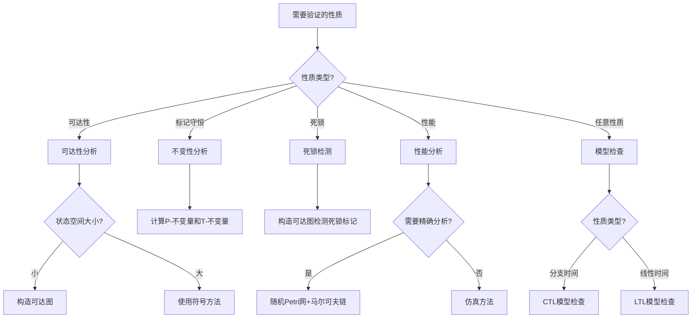
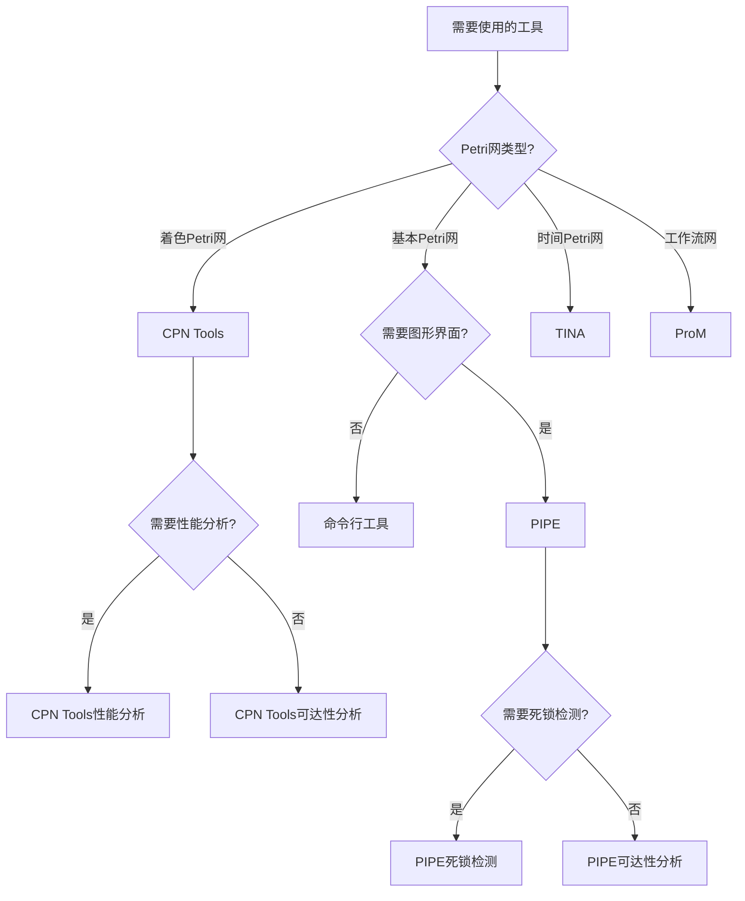
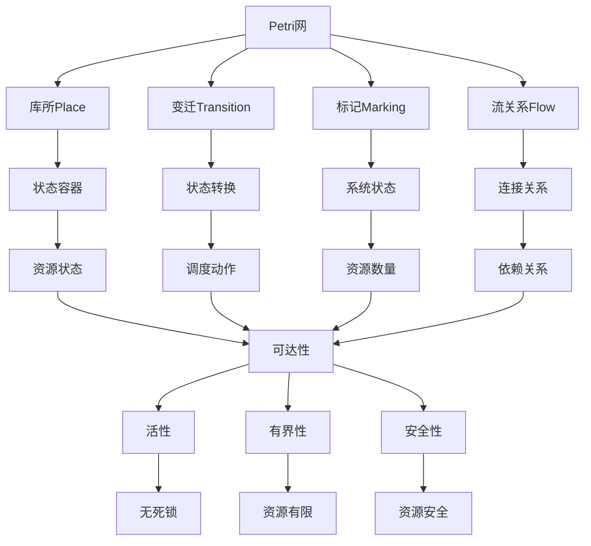
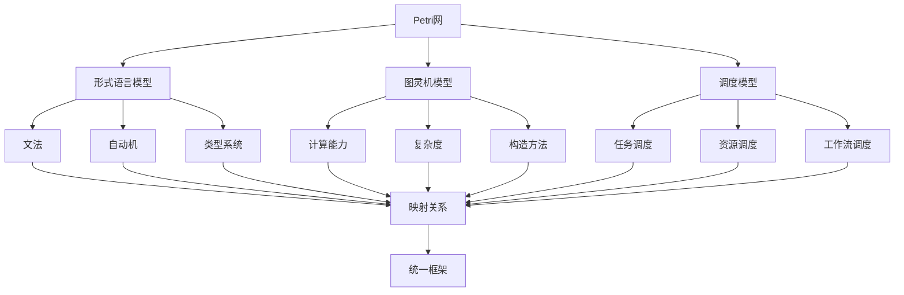
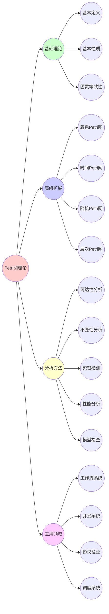
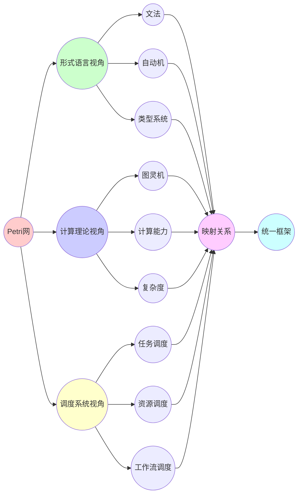

# 10.9 Petri网思维表征方式集

> **子主题编号**: 10.9
> **主题**: Petri网理论
> **最后更新**: 2025-12-02
> **文档状态**: ✅ 进行中

---

## 📋 目录

- [10.9 Petri网思维表征方式集](#109-petri网思维表征方式集)
  - [📋 目录](#-目录)
  - [1 概述](#1-概述)
    - [1.1 目标](#11-目标)
    - [1.2 使用说明](#12-使用说明)
  - [2 思维导图](#2-思维导图)
    - [2.1 Petri网理论完整思维导图](#21-petri网理论完整思维导图)
    - [2.2 Petri网应用领域思维导图](#22-petri网应用领域思维导图)
  - [3 多维对比矩阵](#3-多维对比矩阵)
    - [3.1 Petri网类型对比矩阵](#31-petri网类型对比矩阵)
    - [3.2 分析方法对比矩阵](#32-分析方法对比矩阵)
    - [3.3 工具功能对比矩阵](#33-工具功能对比矩阵)
    - [3.4 应用场景对比矩阵](#34-应用场景对比矩阵)
  - [4 决策树](#4-决策树)
    - [4.1 Petri网类型选择决策树](#41-petri网类型选择决策树)
    - [4.2 分析方法选择决策树](#42-分析方法选择决策树)
    - [4.3 工具选择决策树](#43-工具选择决策树)
  - [5 证明树图](#5-证明树图)
    - [5.1 可达性证明树](#51-可达性证明树)
    - [5.2 等效性证明树](#52-等效性证明树)
    - [5.3 健全性证明树](#53-健全性证明树)
  - [6 概念关系网络](#6-概念关系网络)
    - [6.1 Petri网核心概念关系图](#61-petri网核心概念关系图)
    - [6.2 Petri网与其他模型关系图](#62-petri网与其他模型关系图)
  - [7 知识图谱](#7-知识图谱)
    - [7.1 Petri网知识图谱](#71-petri网知识图谱)
    - [7.2 多视角知识图谱](#72-多视角知识图谱)

---

## 1 概述

### 1.1 目标

本文档提供Petri网理论的**多种思维表征方式**，包括：

1. **思维导图**：整体知识结构可视化
2. **对比矩阵**：多维度对比分析
3. **决策树**：方法选择和应用指导
4. **证明树图**：证明过程可视化
5. **概念关系网络**：概念间关系图
6. **知识图谱**：知识体系图谱

### 1.2 使用说明

- **思维导图**：快速把握整体结构
- **对比矩阵**：深入理解差异和联系
- **决策树**：指导实际应用选择
- **证明树图**：理解证明逻辑
- **关系网络**：理解概念关联
- **知识图谱**：全面知识体系

---

## 2 思维导图

### 2.1 Petri网理论完整思维导图



### 2.2 Petri网应用领域思维导图



---

## 3 多维对比矩阵

### 3.1 Petri网类型对比矩阵

| 维度 | 基本Petri网 | 着色Petri网 | 时间Petri网 | 随机Petri网 | 层次Petri网 |
|------|------------|------------|------------|------------|------------|
| **数据类型** | 无（仅标记数） | 有（颜色系统） | 无 | 无 | 无 |
| **时间建模** | 无 | 无 | 有（时间间隔） | 有（概率分布） | 无 |
| **概率建模** | 无 | 无 | 无 | 有（指数分布） | 无 |
| **层次结构** | 无 | 无 | 无 | 无 | 有（子网） |
| **状态空间** | 大 | 非常大 | 大 | 大 | 中等（层次抽象） |
| **建模能力** | 基础 | 强 | 实时系统 | 性能分析 | 大规模系统 |
| **验证能力** | 基础 | 强 | 实时性验证 | 性能验证 | 模块化验证 |
| **工具支持** | 多 | 多（CPN Tools） | 中（TINA） | 中 | 少 |
| **学习曲线** | 低 | 中 | 中 | 高 | 中 |
| **适用场景** | 基础建模 | 复杂系统 | 实时系统 | 性能分析 | 大规模系统 |

### 3.2 分析方法对比矩阵

| 维度 | 可达性分析 | 不变性分析 | 死锁检测 | 性能分析 | 模型检查 |
|------|-----------|-----------|---------|---------|---------|
| **复杂度** | 高（状态空间爆炸） | 中（线性代数） | 中 | 高（随机过程） | 高（状态空间） |
| **适用Petri网** | 所有类型 | 所有类型 | 所有类型 | 随机Petri网 | 所有类型 |
| **验证性质** | 可达性 | 标记守恒、循环 | 死锁 | 吞吐量、延迟 | 任意性质（CTL/LTL） |
| **工具支持** | 多 | 中 | 多 | 中 | 中 |
| **可扩展性** | 低（状态空间限制） | 高 | 中 | 中 | 低（状态空间限制） |
| **精确性** | 精确 | 精确 | 精确 | 概率性 | 精确 |
| **应用场景** | 正确性验证 | 结构分析 | 安全性验证 | 性能优化 | 性质验证 |

### 3.3 工具功能对比矩阵

| 维度 | CPN Tools | PIPE | TINA | ProM |
|------|----------|------|------|------|
| **Petri网类型** | 着色Petri网 | 基本Petri网 | 时间Petri网 | 工作流网 |
| **建模能力** | 强 | 中 | 中 | 强 |
| **可达性分析** | 支持 | 支持 | 支持 | 支持 |
| **死锁检测** | 支持 | 支持 | 支持 | 支持 |
| **性能分析** | 支持 | 不支持 | 不支持 | 支持 |
| **模型检查** | 不支持 | 不支持 | 支持 | 不支持 |
| **工作流支持** | 不支持 | 不支持 | 不支持 | 强 |
| **用户界面** | 图形化 | 图形化 | 命令行 | 图形化 |
| **学习曲线** | 中 | 低 | 中 | 中 |
| **开源** | 否 | 是 | 是 | 是 |

### 3.4 应用场景对比矩阵

| 维度 | 工作流系统 | 并发系统 | 协议验证 | 调度系统 | 制造系统 |
|------|-----------|---------|---------|---------|---------|
| **Petri网类型** | WF-net | 基本/着色 | 基本/时间 | 基本/随机 | 基本/着色 |
| **主要性质** | 健全性 | 活性、死锁 | 正确性 | 可行性、性能 | 可达性、性能 |
| **分析方法** | 可达性、不变性 | 死锁检测 | 模型检查 | 性能分析 | 可达性、性能 |
| **工具选择** | ProM | PIPE、CPN Tools | TINA | CPN Tools、TINA | CPN Tools |
| **复杂度** | 中 | 高 | 高 | 高 | 中 |
| **验证重点** | 可终止性 | 无死锁 | 正确性 | 性能 | 可达性 |

---

## 4 决策树

### 4.1 Petri网类型选择决策树



### 4.2 分析方法选择决策树



### 4.3 工具选择决策树



---

## 5 证明树图

### 5.1 可达性证明树

```mermaid
graph TD
    A[可达性判定: M ∈ R?] --> B{构造性证明}
    A --> C{反证法}

    B --> D[存在变迁序列σ]
    D --> E[构造序列: M₀[t₁⟩M₁[t₂⟩...M]
    E --> F[验证: M₀[σ⟩M]
    F --> G[证明: M ∈ R]

    C --> H[假设: M ∉ R]
    H --> I[假设存在序列σ使得M₀[σ⟩M]
    I --> J[由定义: M ∈ R]
    J --> K[矛盾]
    K --> L[证明: M ∉ R不成立]
    L --> M[因此: M ∈ R]
```

### 5.2 等效性证明树

```mermaid
graph TD
    A[等效性定理: L(PN) = L(TM)] --> B[双向包含证明]

    B --> C[L(TM) ⊆ L(PN)]
    B --> D[L(PN) ⊆ L(TM)]

    C --> E[定理3.1: Petri网模拟图灵机]
    E --> F[构造Petri网N]
    F --> G[证明L(TM) = L(N)]
    G --> H[因此L(TM) ⊆ L(PN)]

    D --> I[定理3.2: 图灵机模拟Petri网]
    I --> J[构造图灵机TM]
    J --> K[证明L(N) = L(TM)]
    K --> L[因此L(PN) ⊆ L(TM)]

    H --> M[L(PN) = L(TM)]
    L --> M
    M --> N[等效性得证]
```

### 5.3 健全性证明树

```mermaid
graph TD
    A[WF-net健全性] --> B[等价性证明]

    B --> C[N健全 ⟺ N*活且有界]

    C --> D[⇒方向]
    C --> E[⇐方向]

    D --> F[可终止性]
    D --> G[适当完成]
    D --> H[无死任务]

    F --> I[从[i]可达[o']]
    G --> J[到达[o']时其他库所为空]
    H --> K[所有变迁都是活的]

    I --> L[N*是活的和有界的]
    J --> L
    K --> L

    E --> M[N*活且有界]
    M --> N[所有变迁都能点火]
    M --> O[标记数有界]
    M --> P[从[i]可达[o']]

    N --> Q[N可终止]
    O --> R[N适当完成]
    P --> Q
    P --> R

    Q --> S[N健全]
    R --> S
    H --> S

    L --> T[等价性得证]
    S --> T
```

---

## 6 概念关系网络

### 6.1 Petri网核心概念关系图



### 6.2 Petri网与其他模型关系图



---

## 7 知识图谱

### 7.1 Petri网知识图谱



### 7.2 多视角知识图谱



---

**文档状态**: ✅ 基础框架完成，持续扩展中
**最后更新**: 2025-12-02
