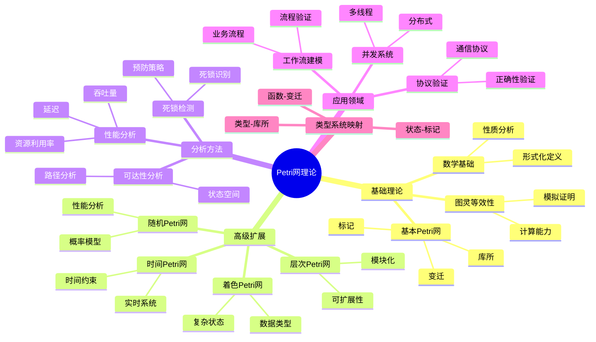

# 10. Petri网理论

> **主题编号**: 10
> **主题名称**: Petri网理论
> **最后更新**: 2025-12-02
> **文档状态**: ✅ 完成

---

## 📋 目录

- [10. Petri网理论](#10-petri网理论)
  - [📋 目录](#-目录)
  - [1 主题概述](#1-主题概述)
    - [1.0 Petri网理论思维导图](#10-petri网理论思维导图)
  - [2 子主题导航](#2-子主题导航)
    - [2.1 10.1 Petri网基础理论](#21-101-petri网基础理论)
    - [2.2 10.2 Petri网与图灵机等效性](#22-102-petri网与图灵机等效性)
    - [2.3 10.3 高级Petri网](#23-103-高级petri网)
    - [2.4 10.4 Petri网分析方法](#24-104-petri网分析方法)
    - [2.5 10.5 Petri网与类型系统映射](#25-105-petri网与类型系统映射)
    - [2.6 10.6 Petri网与并发系统](#26-106-petri网与并发系统)
    - [2.7 10.7 Petri网工具与实践](#27-107-petri网工具与实践)
    - [2.8 10.8 Petri网形式化证明集 ⭐ **新增**](#28-108-petri网形式化证明集--新增)
    - [2.9 10.9 Petri网思维表征方式集 ⭐ **新增**](#29-109-petri网思维表征方式集--新增)
    - [2.10 10.10 Petri网多模型详细对应关系 ⭐ **新增**](#210-1010-petri网多模型详细对应关系--新增)
  - [3 相关主题](#3-相关主题)
  - [4 理论框架结构](#4-理论框架结构)

---

## 1 主题概述

本主题全面探讨**Petri网理论**，从基础理论到高级扩展，从分析方法到实际应用，建立完整的Petri网知识体系。

### 1.0 Petri网理论思维导图



**可视化文档**: 查看 [思维导图与知识矩阵](../思维导图与知识矩阵.md#310-10-petri网理论) 获取更详细的思维导图。

---

## 2 子主题导航

### 2.1 [10.1 Petri网基础理论](10.1_Petri网基础理论.md)

- 基本Petri网定义
- 库所、变迁、标记
- 点火规则
- 基本性质（可达性、活性、有界性）

### 2.2 [10.2 Petri网与图灵机等效性](10.2_Petri网与图灵机等效性.md)

- 计算能力证明
- 图灵机模拟
- 复杂度分析
- 理论意义

### 2.3 [10.3 高级Petri网](10.3_高级Petri网.md)

- 着色Petri网（Colored Petri Nets）
- 时间Petri网（Timed Petri Nets）
- 随机Petri网（Stochastic Petri Nets）
- 层次Petri网（Hierarchical Petri Nets）
- 自修改Petri网（Self-Modifying Petri Nets）

### 2.4 [10.4 Petri网分析方法](10.4_Petri网分析方法.md)

- 可达性分析
- 不变性分析
- 死锁检测
- 性能分析
- 模型检查

### 2.5 [10.5 Petri网与类型系统映射](10.5_Petri网与类型系统映射.md)

- 类型-库所映射
- 函数-变迁映射
- 状态-标记映射
- 类型安全与Petri网性质

### 2.6 [10.6 Petri网与并发系统](10.6_Petri网与并发系统.md)

- 并发建模
- 同步机制
- 冲突检测
- 资源竞争

### 2.7 [10.7 Petri网工具与实践](10.7_Petri网工具与实践.md)

- CPN Tools
- PIPE
- TINA
- ProM
- 实际应用案例

### 2.8 [10.8 Petri网形式化证明集](10.8_Petri网形式化证明集.md) ⭐ **新增**

- 基础性质证明（可达性、活性、有界性、安全性）
- 图灵等效性证明（详细构造方法）
- 高级性质证明（WF-net健全性等）
- 证明树图与证明方法总结

### 2.9 [10.9 Petri网思维表征方式集](10.9_Petri网思维表征方式集.md) ⭐ **新增**

- 思维导图（完整知识结构）
- 多维对比矩阵（类型、方法、工具、应用）
- 决策树（类型选择、方法选择、工具选择）
- 证明树图（证明过程可视化）
- 概念关系网络（概念关联图）
- 知识图谱（知识体系图谱）

### 2.10 [10.10 Petri网多模型详细对应关系](10.10_Petri网多模型详细对应关系.md) ⭐ **新增**

- Petri网与形式语言模型详细对应（文法、自动机、类型系统）
- Petri网与图灵机模型详细对应（Zaitsev方法、构造算法）
- Petri网与调度模型详细对应（任务调度、资源调度、工作流）
- 统一映射框架与定理
- 对应关系证明

---

## 3 相关主题

- [09. 形式化理论](../09_形式化理论/README.md) - 形式化理论基础
- [07. 效应系统](../07_效应系统/) - 并发控制
- [03. 程序控制](../03_程序控制/) - 控制流
- [30. 工作流调度](../../schedule_formal_view/30_工作流调度/) - 工作流应用

---

## 4 理论框架结构

```text
Petri网理论框架
├── 基础理论（10.1）
│   ├── 基本定义
│   ├── 数学基础
│   └── 基本性质
├── 理论深度（10.2）
│   ├── 图灵等效性
│   └── 计算复杂度
├── 高级扩展（10.3）
│   ├── 着色Petri网
│   ├── 时间Petri网
│   ├── 随机Petri网
│   └── 层次Petri网
├── 分析方法（10.4）
│   ├── 可达性分析
│   ├── 死锁检测
│   └── 性能分析
├── 类型映射（10.5）
│   ├── 类型-库所
│   ├── 函数-变迁
│   └── 状态-标记
├── 并发应用（10.6）
│   ├── 并发建模
│   └── 同步机制
├── 工具实践（10.7）
│   ├── 工具介绍
│   └── 应用案例
├── 形式化证明（10.8）⭐ **新增**
│   ├── 基础性质证明
│   ├── 图灵等效性证明
│   └── 高级性质证明
├── 思维表征方式（10.9）⭐ **新增**
│   ├── 思维导图
│   ├── 对比矩阵
│   ├── 决策树
│   ├── 证明树图
│   └── 知识图谱
└── 多模型对应（10.10）⭐ **新增**
    ├── 形式语言对应
    ├── 图灵机对应
    ├── 调度模型对应
    └── 统一映射框架
```

---

**返回**: [主题索引](../README.md)
