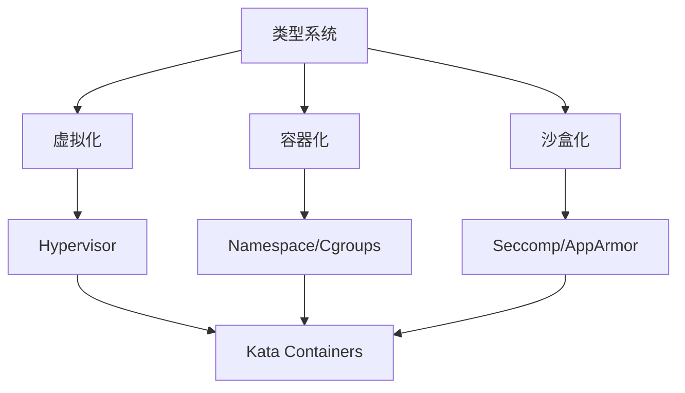
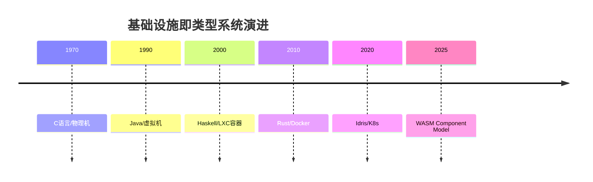

# 基础设施即类型系统 - 主题索引

> **文档版本**: v1.0
> **最后更新**: 2025-01-XX
> **文档结构**: 主题化组织，覆盖虚拟化容器化沙盒化核心概念

---

## 📋 目录

- [基础设施即类型系统 - 主题索引](#基础设施即类型系统---主题索引)
  - [📋 目录](#-目录)
  - [1 主题导航](#1-主题导航)
    - [1.1 01 核心概念映射：从类型到资源](#11-01-核心概念映射从类型到资源)
    - [1.2 02 递归结构：分形基础设施](#12-02-递归结构分形基础设施)
    - [1.3 03 程序控制：声明式即类型推导](#13-03-程序控制声明式即类型推导)
    - [1.4 04 类型检查与验证](#14-04-类型检查与验证)
    - [1.5 05 高级类型特性映射](#15-05-高级类型特性映射)
    - [1.6 06 动态性与反射](#16-06-动态性与反射)
    - [1.7 07 效应系统与副作用](#17-07-效应系统与副作用)
    - [1.8 08 实践启示：新设计模式](#18-08-实践启示新设计模式)
    - [1.9 09 形式化理论框架](#19-09-形式化理论框架)
    - [1.10 10 Petri网理论 ⭐ 新增专门主题](#110-10-petri网理论--新增专门主题)
  - [2 相关文档](#2-相关文档)
  - [3 知识图谱与形式化分析](#3-知识图谱与形式化分析)
    - [3.1 核心概念关系](#31-核心概念关系)
    - [3.2 技术演进时间线](#32-技术演进时间线)
    - [3.3 形式化分析与认知图谱](#33-形式化分析与认知图谱)
  - [4 快速导航](#4-快速导航)
  - [5 文档规范](#5-文档规范)

---

## 1 主题导航

### 1.1 [01 核心概念映射：从类型到资源](01_核心概念映射READMEmd)

- [1.1 基本类型单元](./01_核心概念映射/01.1_基本类型单元.md)
- [1.2 复合类型与组合运算符](./01_核心概念映射/01.2_复合类型与组合运算符.md)
- [1.3 类型层级与继承](./01_核心概念映射/01.3_类型层级与继承.md)

### 1.2 [02 递归结构：分形基础设施](02_递归结构READMEmd)

- [2.1 自相似性（Fractal Architecture）](./02_递归结构/02.1_自相似性.md)
- [2.2 类型递归的具体体现](./02_递归结构/02.2_类型递归的具体体现.md)
- [2.3 不动点（Fixed Point）](./02_递归结构/02.3_不动点.md)

### 1.3 [03 程序控制：声明式即类型推导](03_程序控制READMEmd)

- [3.1 控制流映射](./03_程序控制/03.1_控制流映射.md)
- [3.2 变量作用域与生命周期](./03_程序控制/03.2_变量作用域与生命周期.md)
- [3.3 多租户：高阶类型](./03_程序控制/03.3_多租户高阶类型.md)

### 1.4 [04 类型检查与验证](04_类型检查与验证READMEmd)

- [4.1 编译期检查 ↔ CI/CD 流水线](./04_类型检查与验证/04.1_编译期检查.md)
- [4.2 运行时检查 ↔ 准入控制器](./04_类型检查与验证/04.2_运行时检查.md)
- [4.3 形式化验证](./04_类型检查与验证/04.3_形式化验证.md)

### 1.5 [05 高级类型特性映射](05_高级类型特性READMEmd)

- [5.1 泛型（Generics）](./05_高级类型特性/05.1_泛型.md)
- [5.2 类型类（Type Classes）](./05_高级类型特性/05.2_类型类.md)
- [5.3 依赖类型（Dependent Types）](./05_高级类型特性/05.3_依赖类型.md)

### 1.6 [06 动态性与反射](06_动态性与反射READMEmd)

- [6.1 反射（Reflection）](./06_动态性与反射/06.1_反射.md)
- [6.2 动态类型 ↔ 弹性伸缩](./06_动态性与反射/06.2_动态类型与弹性伸缩.md)

### 1.7 [07 效应系统与副作用](07_效应系统READMEmd)

- [7.1 效应管理基础](./07_效应系统/07.1_效应管理基础.md)
- [7.2 无状态容器与纯函数](./07_效应系统/07.2_无状态容器与纯函数.md)
- [7.3 StatefulSet与Monadic计算](./07_效应系统/07.3_StatefulSet与Monadic计算.md)

### 1.8 [08 实践启示：新设计模式](08_实践启示READMEmd)

- [8.1 类型驱动的基础设施设计](./08_实践启示/08.1_类型驱动设计.md)
- [8.2 Curry-Howard 同构在DevOps](./08_实践启示/08.2_Curry-Howard同构.md)
- [8.3 错误处理新视角](./08_实践启示/08.3_错误处理新视角.md)

### 1.9 [09 形式化理论框架](09_形式化理论READMEmd)

- [9.1 范畴论视角的精确定义](./09_形式化理论/09.1_范畴论视角.md)
- [9.2 理论完备性：解释力与预测力](./09_形式化理论/09.2_理论完备性.md)
- [9.3 时间维度：技术演进的λ立方体映射](./09_形式化理论/09.3_时间维度技术演进.md)
- [9.4 语义学对应：操作语义 vs 资源语义](./09_形式化理论/09.4_语义学对应.md)
- [9.4 应用范畴论](./09_形式化理论/09.4_应用范畴论.md) ⭐ 新增
- [9.5 证明论：形式化验证实例](./09_形式化理论/09.5_证明论.md)
- [9.5 Petri网理论](./09_形式化理论/09.5_Petri网理论.md) ⭐ 新增
- [9.6 工程实践：工具链完备性映射](./09_形式化理论/09.6_工程实践工具链.md)
- [9.7 边界与反例：理论非完备性证明](./09_形式化理论/09.7_边界与反例.md)
- [9.8 范畴论深层结构：Monad与效应](./09_形式化理论/09.8_范畴论深层结构.md)
- [9.9 预测与前瞻：类型理论指引演进](./09_形式化理论/09.9_预测与前瞻.md)
- [9.10 范式演进：当前技术范式的实际演进图谱](./09_形式化理论/09.10_范式演进.md)
- [9.11 理论模型 vs 实际实现：根本差异](./09_形式化理论/09.11_理论模型与实际实现.md)
- [9.12 范式转换的驱动力矩阵](./09_形式化理论/09.12_范式转换驱动力.md)
- [9.13 未来演进路径：理论指导的实践路线图](./09_形式化理论/09.13_未来演进路径.md)

### 1.10 [10 Petri网理论](10_Petri网理论/README.md) ⭐ 新增专门主题

- [10.1 Petri网基础理论](./10_Petri网理论/10.1_Petri网基础理论.md)
- [10.2 Petri网与图灵机等效性](./10_Petri网理论/10.2_Petri网与图灵机等效性.md)
- [10.3 高级Petri网](./10_Petri网理论/10.3_高级Petri网.md)
- [10.4 Petri网分析方法](./10_Petri网理论/10.4_Petri网分析方法.md)
- [10.5 Petri网与类型系统映射](./10_Petri网理论/10.5_Petri网与类型系统映射.md)
- [10.6 Petri网与并发系统](./10_Petri网理论/10.6_Petri网与并发系统.md)
- [10.7 Petri网工具与实践](./10_Petri网理论/10.7_Petri网工具与实践.md)

---

## 2 相关文档

- [原始文档：基础设施即类型系统](./type_formal_view.md)
- [形式化分析与认知图谱](./形式化分析与认知图谱.md) ⭐ **新增**
- [文档结构说明](./文档结构说明.md)
- [快速参考指南](./快速参考指南.md)
- [完成总结](./完成总结.md)
- [更新日志](./更新日志.md)
- [概念目录：虚拟化容器化沙盒化](../Concept/TuningCompute/)

---

## 3 知识图谱与形式化分析

### 3.1 核心概念关系

### 3.2 技术演进时间线

### 3.3 形式化分析与认知图谱

- **[形式化分析与认知图谱](./形式化分析与认知图谱.md)** - 完整的形式化论证、思维导图、多维度对比矩阵和2025年最新技术发展

---

## 4 快速导航

- **新手入门**: 从 [01. 核心概念映射](./01_核心概念映射/README.md) 开始
- **理论深入**: 查看 [09. 形式化理论框架](./09_形式化理论/README.md)
- **实践应用**: 参考 [08. 实践启示](./08_实践启示/README.md)
- **技术演进**: 了解 [09.10 范式演进](./09_形式化理论/09.10_范式演进.md)

---

## 5 文档规范

所有文档遵循以下结构规范：

1. **标题层级**: 使用统一的编号系统（01-09主题，子主题使用小数点编号）
2. **内部链接**: 使用相对路径，格式为 `[文本](./路径)`
3. **代码块**: 使用适当的语言标记
4. **表格**: 使用Markdown表格格式
5. **数学公式**: 使用LaTeX语法

---

**最后更新**: 2025-01-XX
