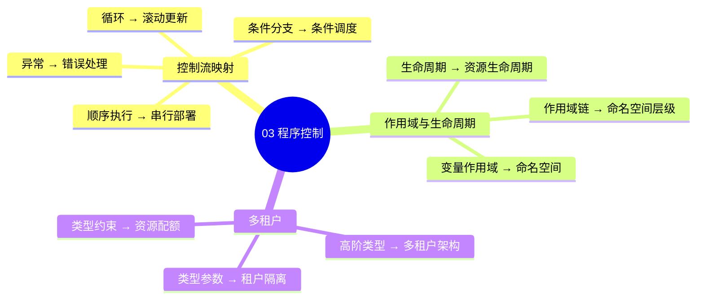

# 形式语言视角：思维导图与多维知识矩阵

> **文档版本**: v1.0
> **创建日期**: 2025-01-XX
> **文档性质**: [可视化] - 形式语言视角的思维导图和多维知识矩阵
> **目的**: 提供直观的知识结构可视化和多维度对比分析

---

## 📋 目录

- [形式语言视角：思维导图与多维知识矩阵](#形式语言视角思维导图与多维知识矩阵)
  - [📋 目录](#-目录)
  - [1 概述](#1-概述)
  - [2 核心概念思维导图](#2-核心概念思维导图)
    - [2.1 类型系统与基础设施映射全景图](#21-类型系统与基础设施映射全景图)
    - [2.2 类型系统层次结构](#22-类型系统层次结构)
    - [2.3 基础设施类型系统架构](#23-基础设施类型系统架构)
  - [3 主题模块思维导图](#3-主题模块思维导图)
    - [3.1 01 核心概念映射](#31-01-核心概念映射)
    - [3.2 02 递归结构](#32-02-递归结构)
    - [3.3 03 程序控制](#33-03-程序控制)
    - [3.4 04 类型检查与验证](#34-04-类型检查与验证)
    - [3.5 05 高级类型特性](#35-05-高级类型特性)
    - [3.6 06 动态性与反射](#36-06-动态性与反射)
    - [3.7 07 效应系统](#37-07-效应系统)
    - [3.8 08 实践启示](#38-08-实践启示)
    - [3.9 09 形式化理论](#39-09-形式化理论)
  - [4 多维知识矩阵](#4-多维知识矩阵)
    - [4.1 类型系统特性 vs 基础设施实现矩阵](#41-类型系统特性-vs-基础设施实现矩阵)
    - [4.2 技术演进时间线矩阵](#42-技术演进时间线矩阵)
    - [4.3 形式化验证工具链对比矩阵](#43-形式化验证工具链对比矩阵)
    - [4.4 类型系统表达能力矩阵](#44-类型系统表达能力矩阵)
    - [4.5 技术成熟度与理论对齐度矩阵](#45-技术成熟度与理论对齐度矩阵)
  - [5 跨主题关联网络](#5-跨主题关联网络)
  - [6 学习路径思维导图](#6-学习路径思维导图)
  - [7 实践应用决策树](#7-实践应用决策树)
  - [8 总结](#8-总结)

---

## 1 概述

本文档提供形式语言视角的**系统化思维导图**和**多维知识矩阵**，帮助理解：

- **类型系统**与**基础设施**的映射关系
- **9个主题模块**之间的关联
- **技术演进**的时间维度
- **形式化验证**工具链的完备性
- **实践应用**的决策路径

---

## 2 核心概念思维导图

### 2.1 类型系统与基础设施映射全景图

### 2.2 类型系统层次结构

### 2.3 基础设施类型系统架构

---

## 3 主题模块思维导图

### 3.1 01 核心概念映射

### 3.2 02 递归结构

### 3.3 03 程序控制

### 3.4 04 类型检查与验证

### 3.5 05 高级类型特性

### 3.6 06 动态性与反射

### 3.7 07 效应系统

### 3.8 08 实践启示

### 3.9 09 形式化理论

---

## 4 多维知识矩阵

### 4.1 类型系统特性 vs 基础设施实现矩阵

| 类型系统特性 | 编程语言示例 | 基础设施对应 | 实现技术 | 成熟度 |
|------------|------------|------------|---------|--------|
| **基本类型** | `int`, `string`, `bool` | OCI镜像层 | Docker, containerd | ⭐⭐⭐⭐⭐ |
| **乘积类型** | `struct`, `tuple` | Pod | Kubernetes | ⭐⭐⭐⭐⭐ |
| **和类型** | `union`, `enum` | Deployment策略 | Kubernetes | ⭐⭐⭐⭐ |
| **函数类型** | `function`, `lambda` | Service, Ingress | Kubernetes | ⭐⭐⭐⭐⭐ |
| **类型继承** | `class extends` | 镜像分层 | Docker | ⭐⭐⭐⭐⭐ |
| **泛型** | `List<T>`, `Map<K,V>` | Helm模板 | Helm | ⭐⭐⭐⭐ |
| **类型类** | `trait`, `interface` | CNI/CSI接口 | Kubernetes | ⭐⭐⭐⭐ |
| **依赖类型** | `Vec<n>` | HPA, VPA | Kubernetes | ⭐⭐⭐ |
| **线性类型** | Rust `&mut` | ResourceQuota | Kubernetes | ⭐⭐⭐ |
| **效应系统** | Haskell Monad | StatefulSet | Kubernetes | ⭐⭐⭐ |
| **反射** | Java Reflection | 动态配置 | ConfigMap | ⭐⭐⭐⭐ |
| **类型擦除** | Java泛型 | 弹性伸缩 | HPA/VPA | ⭐⭐⭐⭐ |

### 4.2 技术演进时间线矩阵

| 年代 | 类型系统发展 | 基础设施发展 | 映射关系 | 关键突破 |
|------|------------|------------|---------|---------|
| **1970s** | C语言基本类型 | 物理机 | 类型 ↔ 硬件资源 | 基础映射 |
| **1980s** | 面向对象类型 | 虚拟机 | 继承 ↔ 虚拟化 | 抽象层次 |
| **1990s** | 泛型编程 | 容器技术(LXC) | 泛型 ↔ 模板化 | 参数化 |
| **2000s** | 函数式类型 | Java虚拟机 | 高阶类型 ↔ 运行时 | 类型推断 |
| **2010s** | 依赖类型 | Docker容器 | 依赖类型 ↔ 动态配置 | 类型安全 |
| **2020s** | 线性类型 | Kubernetes | 所有权 ↔ 资源管理 | 资源安全 |
| **2025** | WASM Component Model | 云原生 | 组件类型 ↔ 微服务 | 类型系统统一 |

### 4.3 形式化验证工具链对比矩阵

| 工具 | 类型 | 适用场景 | 基础设施应用 | 成熟度 | 学习曲线 |
|------|------|---------|------------|--------|---------|
| **CUE** | 类型检查 | 配置验证 | K8s资源验证 | ⭐⭐⭐⭐ | 中等 |
| **OPA** | 策略验证 | 准入控制 | K8s策略 | ⭐⭐⭐⭐ | 中等 |
| **TLA+** | 形式化规范 | 系统验证 | 分布式系统 | ⭐⭐⭐ | 高 |
| **Coq** | 定理证明 | 形式化证明 | 调度算法证明 | ⭐⭐ | 很高 |
| **Agda** | 依赖类型 | 类型证明 | 类型系统证明 | ⭐⭐ | 很高 |
| **Lean4** | 定理证明 | 现代证明 | 现代类型系统 | ⭐⭐⭐ | 高 |
| **Alloy** | 模型检查 | 系统建模 | 系统架构验证 | ⭐⭐⭐ | 中等 |

### 4.4 类型系统表达能力矩阵

| 类型系统特性 | 表达能力 | 类型安全 | 运行时开销 | 基础设施适用性 |
|------------|---------|---------|-----------|---------------|
| **基本类型** | ⭐⭐ | ⭐⭐⭐⭐⭐ | 无 | ⭐⭐⭐⭐⭐ |
| **复合类型** | ⭐⭐⭐ | ⭐⭐⭐⭐ | 低 | ⭐⭐⭐⭐⭐ |
| **泛型** | ⭐⭐⭐⭐ | ⭐⭐⭐⭐ | 低 | ⭐⭐⭐⭐ |
| **类型类** | ⭐⭐⭐⭐ | ⭐⭐⭐⭐ | 低 | ⭐⭐⭐⭐ |
| **依赖类型** | ⭐⭐⭐⭐⭐ | ⭐⭐⭐⭐⭐ | 中 | ⭐⭐⭐ |
| **线性类型** | ⭐⭐⭐⭐ | ⭐⭐⭐⭐⭐ | 低 | ⭐⭐⭐ |
| **效应系统** | ⭐⭐⭐⭐⭐ | ⭐⭐⭐⭐ | 中 | ⭐⭐⭐ |

### 4.5 技术成熟度与理论对齐度矩阵

| 技术 | 成熟度 | 理论对齐度 | 实践应用 | 形式化程度 |
|------|--------|-----------|---------|-----------|
| **Docker镜像** | ⭐⭐⭐⭐⭐ | ⭐⭐⭐⭐ | ⭐⭐⭐⭐⭐ | ⭐⭐ |
| **Kubernetes** | ⭐⭐⭐⭐⭐ | ⭐⭐⭐⭐ | ⭐⭐⭐⭐⭐ | ⭐⭐⭐ |
| **Helm** | ⭐⭐⭐⭐ | ⭐⭐⭐ | ⭐⭐⭐⭐ | ⭐⭐ |
| **CUE** | ⭐⭐⭐⭐ | ⭐⭐⭐⭐⭐ | ⭐⭐⭐ | ⭐⭐⭐⭐ |
| **OPA** | ⭐⭐⭐⭐ | ⭐⭐⭐⭐ | ⭐⭐⭐⭐ | ⭐⭐⭐ |
| **TLA+** | ⭐⭐⭐ | ⭐⭐⭐⭐⭐ | ⭐⭐ | ⭐⭐⭐⭐⭐ |
| **WASM Component** | ⭐⭐⭐ | ⭐⭐⭐⭐⭐ | ⭐⭐ | ⭐⭐⭐⭐ |

---

## 5 跨主题关联网络

---

## 6 学习路径思维导图

---

## 7 实践应用决策树

---

## 8 总结

本文档提供了形式语言视角的**系统化思维导图**和**多维知识矩阵**，包括：

✅ **9个主题模块**的思维导图
✅ **5个多维知识矩阵**的对比分析
✅ **跨主题关联网络**的可视化
✅ **学习路径**和**实践应用决策树**

**下一步**：

- 查看 [形式化分析与认知图谱](./形式化分析与认知图谱.md) 获取更详细的分析
- 参考各主题模块的具体文档获取技术细节
- 使用思维导图快速定位知识点

---

**返回**: [README](./README.md) | [主题索引](../README.md)
