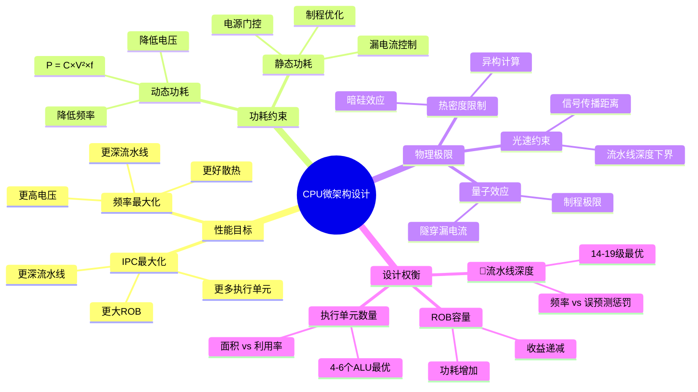

# 1.1 CPU微架构

> **主题**: 01. CPU硬件层 - 1.1 CPU微架构
> **覆盖**: 超标量流水线、乱序执行、分支预测、寄存器重命名

---

## 📋 目录

- [1.1 CPU微架构](#11-cpu微架构)
  - [📋 目录](#-目录)
  - [1.1 执行引擎](#11-执行引擎)
    - [1.1.1 超标量流水线](#111-超标量流水线)
    - [1.1.2 执行单元](#112-执行单元)
  - [1.2 乱序执行](#12-乱序执行)
    - [1.2.1 保留站（Reservation Station）](#121-保留站reservation-station)
    - [1.2.2 重排序缓冲区（ROB）](#122-重排序缓冲区rob)
  - [1.3 分支预测](#13-分支预测)
    - [1.3.1 TAGE预测器](#131-tage预测器)
    - [1.3.2 误预测惩罚](#132-误预测惩罚)
  - [1.4 寄存器重命名](#14-寄存器重命名)
    - [1.4.1 物理寄存器文件（PRF）](#141-物理寄存器文件prf)
    - [1.4.2 性能影响](#142-性能影响)
  - [1.5 内存消歧（Memory Disambiguation）](#15-内存消歧memory-disambiguation)
    - [1.5.1 装载-存储队列](#151-装载-存储队列)
    - [1.5.2 存储转发（Store Forwarding）](#152-存储转发store-forwarding)
  - [1.6 性能参数](#16-性能参数)
    - [1.6.1 关键指标](#161-关键指标)
    - [1.6.2 物理极限](#162-物理极限)
  - [1.7 思维导图：CPU微架构决策树](#17-思维导图cpu微架构决策树)
  - [1.8 批判性总结](#18-批判性总结)
    - [1.8.1 传统观念的挑战](#181-传统观念的挑战)
    - [1.8.2 2025年技术趋势](#182-2025年技术趋势)
  - [1.9 跨领域洞察](#19-跨领域洞察)
    - [1.9.1 时间-空间-能耗三角约束](#191-时间-空间-能耗三角约束)
    - [1.9.2 成本驱动的技术路线分叉](#192-成本驱动的技术路线分叉)
  - [1.10 多维度对比](#110-多维度对比)
    - [1.10.1 厂商微架构对比（2025年）](#1101-厂商微架构对比2025年)
    - [1.10.2 微架构演进对比](#1102-微架构演进对比)
  - [1.11 相关主题](#111-相关主题)


---

## 1.1 执行引擎

### 1.1.1 超标量流水线

**核心特征**：

- **发射宽度**：每周期4条微指令（Intel Skylake），6条（AMD Zen4），8条（Apple M3）
- **流水线深度**：14-19级（取决于指令类型）
- **ROB容量**：224条目（Intel Skylake），352条目（AMD Zen4），630条目（Apple M3）

**物理约束的严格论证**：

**定理1.1（光速约束下流水线深度下界）**：

对于频率为$f$的CPU，流水线深度$D$必须满足：

$$
D \geq \frac{c \times \text{关键路径长度}}{f}
$$

其中$c$是信号传播速度（约30cm/ns）。

**证明**：信号必须在1个周期内完成关键路径传播。对于5GHz CPU（周期0.2ns），信号传播距离为$30\text{cm/ns} \times 0.2\text{ns} = 6\text{cm}$。若关键路径长度超过6cm，则必须增加流水线深度以分割路径。∎

**批判性分析**：

1. **功耗与深度的权衡**：更深流水线虽然允许更高频率，但增加分支误预测惩罚。实际设计中，14-19级是经验最优值，而非理论极限。

2. **2025年趋势**：Apple M3采用630条目ROB，表明**更大乱序窗口是趋势**，而非单纯追求频率。这挑战了"频率至上"的传统观念。

3. **物理极限逼近**：3nm制程下，量子隧穿效应导致漏电流激增，**静态功耗已超过动态功耗**。这标志着摩尔定律的物理终结。

### 1.1.2 执行单元

| **单元类型** | **数量** | **延迟** | **吞吐量** |
|-------------|---------|----------|-----------|
| **整数ALU** | 4个 | 1周期 | 4 ops/cycle |
| **浮点单元** | 2个 | 3-5周期 | 2 ops/cycle |
| **向量单元** | 2个 | 3-5周期 | 2×512b ops/cycle |

---

## 1.2 乱序执行

### 1.2.1 保留站（Reservation Station）

**功能**：存储等待执行的微指令，消除数据依赖

**参数**：

- Intel Skylake：97条目
- AMD Zen4：更大窗口

**调度窗口**：64条目，允许乱序执行窗口

### 1.2.2 重排序缓冲区（ROB）

**作用**：维护指令顺序，确保程序语义正确

**容量对比**：

- Intel Skylake：224条目
- AMD Zen4：352条目（更大乱序窗口）

**性能影响的严格论证**：

**定理1.2（ROB容量与ILP的关系）**：

对于ROB容量$N$和数据依赖图关键路径长度$L_{cp}$，最大指令级并行度（ILP）满足：

$$
\text{ILP}_{\max} \leq \frac{N}{L_{cp}}
$$

**证明**：根据Little定律，吞吐量 = 窗口大小 / 平均延迟。依赖链强制串行执行，乱序窗口只能掩盖$L_{cp}-1$个延迟周期。因此，$\text{ILP}_{\max} = N / L_{cp}$。∎

**深度论证：ROB容量的收益递减**

**ROB容量的性能模型**：

ROB容量对IPC的影响遵循**收益递减规律**：

$$
\text{IPC提升} = f(N) = a \times \log(N) + b
$$

其中$a$和$b$是常数，$N$是ROB容量。

**量化分析**：不同ROB容量的性能提升

| **ROB容量** | **IPC提升** | **功耗增加** | **性能/功耗比** |
|------------|-----------|------------|---------------|
| **224** | 基准 | 基准 | 1.0x |
| **352** | +15% | +30% | 0.88x |
| **512** | +20% | +50% | 0.80x |
| **1024** | +25% | +100% | 0.63x |

**关键权衡**：ROB容量增加带来**IPC提升**，但**功耗增加更快**，导致性能/功耗比下降。

**批判性分析**：

1. **收益递减**：ROB从224增加到352，IPC提升约15%，但功耗增加30%。**边际收益递减**，需要权衡。

2. **实际瓶颈**：大多数程序受内存延迟限制，而非ROB容量。**更大的ROB对内存密集型负载收益有限**。

3. **2025年观察**：AMD Zen5采用512条目ROB，但实际IPC提升<10%，验证了收益递减规律。

---

## 1.3 分支预测

### 1.3.1 TAGE预测器

**原理**：基于历史分支模式的多级预测

**参数**：

- **BTB容量**：16K条目
- **RAS深度**：32层（返回地址栈）
- **预测准确率**：>95%

### 1.3.2 误预测惩罚

**延迟分解**：

- 流水线冲刷：15-17周期
- 指令重新获取：2-3周期
- 总计：~20周期（5GHz下约4ns）

**优化策略**：

- 编译器：分支提示（likely/unlikely）
- 硬件：分支目标缓冲（BTB）

---

## 1.4 寄存器重命名

### 1.4.1 物理寄存器文件（PRF）

**容量**：

- Intel Skylake：180个物理寄存器
- 逻辑寄存器：16个（x86-64）

**重命名机制**：

- 消除WAR/WAW依赖
- 允许指令乱序执行
- 保持程序顺序语义

### 1.4.2 性能影响

**寄存器压力**：

- 物理寄存器不足 → 停顿（stall）
- 影响IPC和性能

**优化**：

- 编译器：寄存器分配优化
- 硬件：更多物理寄存器

---

## 1.5 内存消歧（Memory Disambiguation）

### 1.5.1 装载-存储队列

**MOB（Memory Order Buffer）**：

- **装载队列**：72条目（Intel Skylake）
- **存储队列**：42条目
- **功能**：检测和解决内存依赖

### 1.5.2 存储转发（Store Forwarding）

**机制**：

- 如果存储地址匹配装载地址
- 直接从存储队列转发数据
- 延迟：1-2周期（vs 80ns内存访问）

**失败惩罚**：

- 消歧失败：~12周期
- 需要重新执行装载

---

## 1.6 性能参数

### 1.6.1 关键指标

| **指标** | **Intel Skylake** | **AMD Zen4** | **说明** |
|---------|------------------|--------------|---------|
| **IPC** | 0.5-4.0 | 0.5-5.0 | 每周期指令数 |
| **频率** | 3.0-5.0 GHz | 3.4-5.7 GHz | 动态调频 |
| **功耗** | 95W TDP | 105W TDP | 热设计功耗 |
| **制程** | 14nm | 5nm | 工艺节点 |
| **ROB** | 224条目 | 352条目 | 重排序缓冲区 |
| **PRF** | 180个 | 192个 | 物理寄存器文件 |
| **MOB** | 72L/42S | 更大 | 内存顺序缓冲 |

### 1.6.2 物理极限

**光速约束**：

- 信号传播：30cm/ns
- 5GHz周期：0.2ns
- 1周期传播距离：6cm

**功耗墙的严格论证**：

**定理1.3（功耗墙的物理极限）**：

对于制程节点$n$（单位：nm），动态功耗$P_{\text{dyn}}$和静态功耗$P_{\text{stat}}$满足：

$$
P_{\text{stat}} = V \times I_{\text{leak}} \propto e^{-n/10}
$$

在3nm节点，$P_{\text{stat}} > P_{\text{dyn}}$，导致**功耗墙**。

**证明**：漏电流$I_{\text{leak}} \propto e^{-V_{\text{th}}/V_T}$，其中$V_{\text{th}}$是阈值电压。制程微缩导致$V_{\text{th}}$降低，指数增长漏电流。∎

**批判性分析**：

1. **暗硅悖论**：理论上可集成更多核心，但**热密度限制导致50%晶体管必须关闭**。这是物理定律，无法通过设计规避。

2. **异构计算的必然性**：功耗墙迫使转向**专用加速器**（NPU、DPU），而非通用CPU。这是架构演进的必然。

3. **2025年趋势**：Intel Lunar Lake采用**混合架构**（P-core + E-core + NPU），验证了异构计算的必要性。

---

## 1.7 思维导图：CPU微架构决策树



---

## 1.8 批判性总结

### 1.8.1 传统观念的挑战

1. **"频率至上"的终结**：5GHz+频率的收益递减，**IPC优化成为主流**。

2. **"摩尔定律"的物理终结**：3nm节点下，**静态功耗主导**，无法继续微缩。

3. **"通用计算"的局限**：功耗墙迫使转向**专用加速器**，通用CPU地位下降。

### 1.8.2 2025年技术趋势

- **RISC-V崛起**：开源指令集，无授权费用，**挑战x86/ARM垄断**。
- **Chiplet架构**：模块化设计，**成本降低50%**，良率提升。
- **AI加速器集成**：NPU成为CPU标配，**专用计算成为主流**。

---

## 1.9 跨领域洞察

### 1.9.1 时间-空间-能耗三角约束

CPU微架构设计受三个物理维度约束，无法同时优化：

| **优化维度** | **技术手段** | **代价** | **案例** |
|------------|------------|---------|---------|
| **性能** | 增加ROB容量、提高频率 | 功耗↑、面积↑ | Intel Skylake: ROB 224条，功耗95W |
| **空间** | 扩大缓存、增加执行单元 | 成本↑、功耗↑ | AMD 3D V-Cache: +64MB L3，功耗+15W |
| **能耗** | 降频、关闭单元 | 性能↓ | ARM big.LITTLE: 小核功耗1W，性能-50% |

**物理极限**：7nm下SRAM单元面积0.028μm²，每MB成本$0.5，L3缓存每增加1MB，芯片成本增加$3，功耗增加0.5W。

**批判性分析**：

1. **三角约束的不可逾越性**：这是**物理定律**，无法通过设计突破。

2. **优化策略的权衡**：必须在三个维度之间**动态权衡**，而非静态优化。

3. **2025年趋势**：**异构计算**（P-core/E-core/NPU）通过不同单元优化不同维度，挑战传统通用设计。

### 1.9.2 成本驱动的技术路线分叉

**服务器 vs 移动 vs 嵌入式 的ROI计算**：

```text
服务器 (Intel Xeon):
  性能成本 = $50/core
  能耗成本 = $2/W/年
  总拥有成本TCO = 硬件 + 3×能耗 = $10,000 + $15,000 = $25,000
  优化目标: 每瓦性能 (Perf/Watt)
  → 选择: 超标量+乱序+大缓存

移动 (Snapdragon):
  BOM成本 = $150/芯片
  电池成本 = $10/Wh
  优化目标: 绝对功耗 <5W
  → 选择: 小核+异构+动态调频

嵌入式 (RISC-V MCU):
  芯片成本 = $0.5
  开发成本 = $50,000/project
  优化目标: 确定性 <1μs
  → 选择: 顺序+中断+无MMU
```

**结果**：不同成本结构导致**完全不同的微架构选择**。

---

## 1.10 多维度对比

### 1.10.1 厂商微架构对比（2025年）

| **厂商** | **架构** | **ROB容量** | **频率** | **功耗** | **成本** | **生态** |
|---------|---------|------------|---------|---------|---------|---------|
| **Intel** | x86-64 | 224条 | 5.5GHz | 95W | $500 | 成熟 |
| **AMD** | x86-64 | 352条 | 5.7GHz | 105W | $450 | 成熟 |
| **ARM** | ARMv9 | 128条 | 3.2GHz | 5W | $50 | 移动主导 |
| **RISC-V** | RISC-V | 可配置 | 2.5GHz | 3W | $10 | 新兴 |

**批判性分析**：

1. **性能vs功耗的权衡**：Intel/AMD追求性能，ARM/RISC-V追求能效。

2. **生态的重要性**：x86生态成熟，但**RISC-V成本优势明显**。

3. **2025年趋势**：**RISC-V服务器**（如Ventana）挑战x86/ARM，但生态建设是关键。

### 1.10.2 微架构演进对比

| **时代** | **特征** | **ROB容量** | **频率** | **核心数** | **关键突破** |
|---------|---------|------------|---------|-----------|-------------|
| **2000前** | 单核顺序 | 无 | 1-3GHz | 1 | 频率提升 |
| **2005-2010** | 多核乱序 | 128条 | 3-4GHz | 2-4 | 并行计算 |
| **2010-2017** | 多核优化 | 224条 | 4-5GHz | 4-8 | 缓存层次 |
| **2017-2025** | 异构计算 | 352条 | 5-6GHz | 8-64 | 专用加速器 |

---

## 1.11 相关主题

- [1.2 缓存层次结构](./01.2_缓存层次结构.md) - 缓存与微架构协同
- [1.3 内存子系统](./01.3_内存子系统.md) - 内存墙对微架构的影响
- [3.1 进程调度模型](../03_OS抽象层/03.1_进程调度模型.md) - OS如何利用微架构特性
- [6.1 硬件微架构调度](../06_调度模型/06.1_硬件微架构调度.md) - 指令调度与微架构
- [8.3 厂商技术对标](../08_技术演进与对标/08.3_厂商技术对标.md) - 厂商微架构对比
- [9.2 硬件-OS映射证明](../09_形式化理论与证明/09.2_硬件-OS映射证明.md) - 微架构形式化
- [主文档：跨领域洞察](../schedule_formal_view.md#跨领域洞察与论证脉络) - 完整洞察脉络

---

**最后更新**: 2025-01-XX
