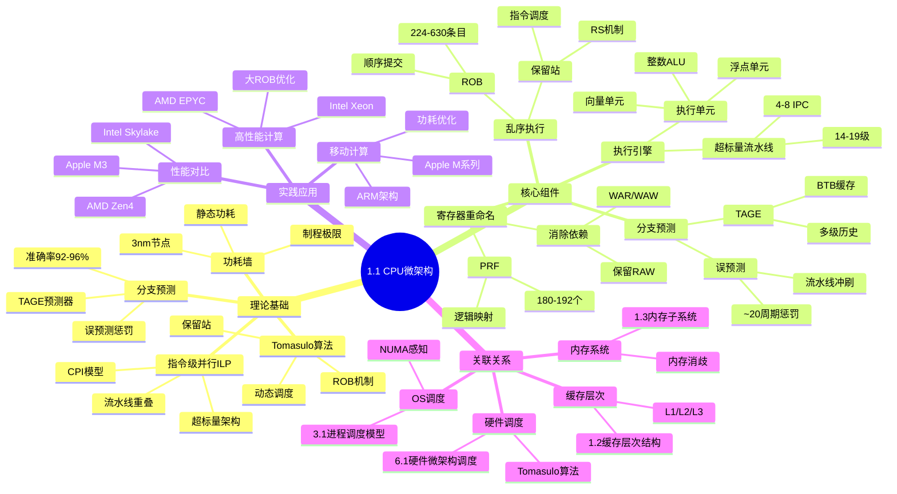
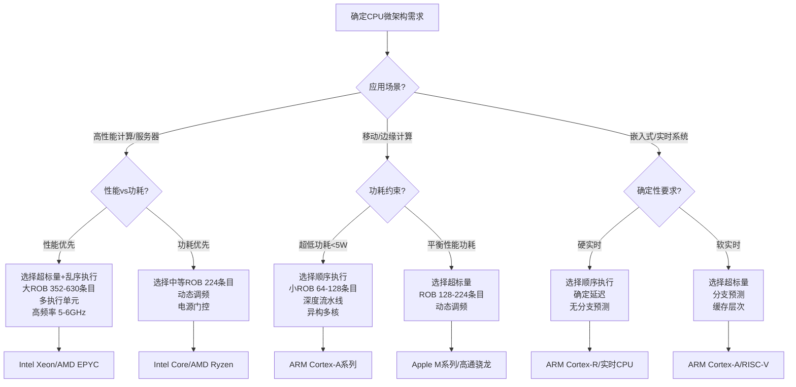
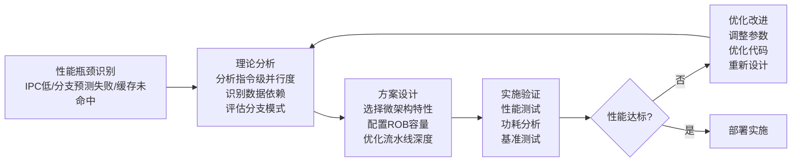
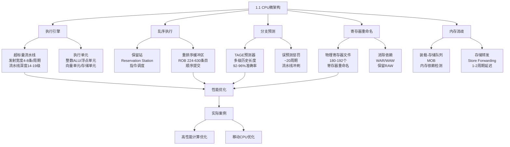
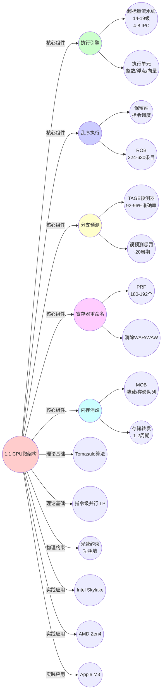
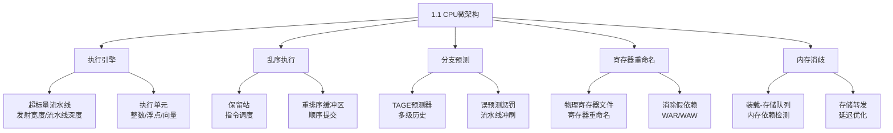
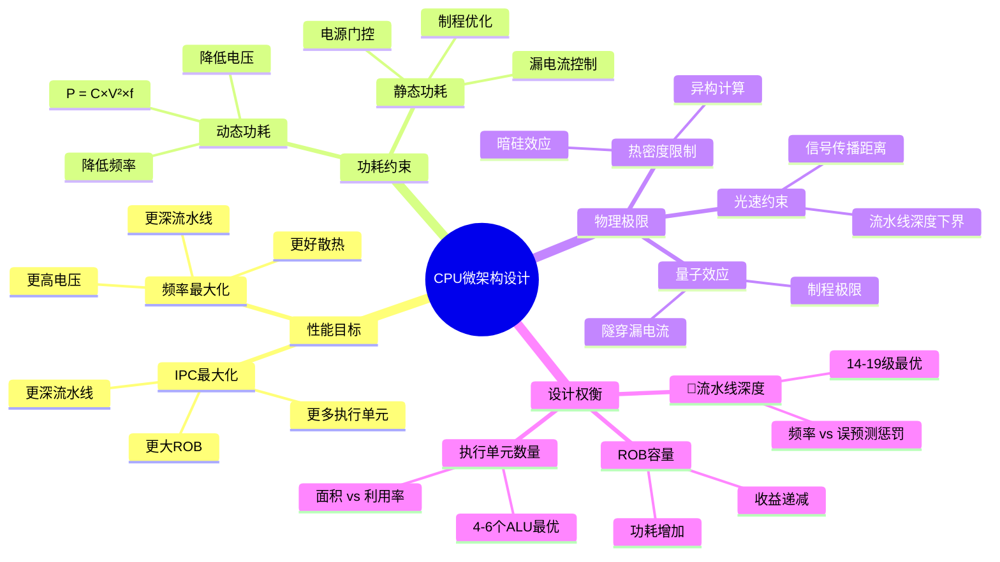

# 1.1 CPU微架构

> **主题**: 01. CPU硬件层 - 1.1 CPU微架构
> **覆盖**: 超标量流水线、乱序执行、分支预测、寄存器重命名

## 📊 思维表征体系

### 📊 1. 思维导图（增强版）

#### 1.1 文本格式（基础版）

```text
1.1 CPU微架构
├── 理论基础
│   ├── Tomasulo算法（1967）
│   ├── 指令级并行（ILP）理论
│   ├── 流水线理论
│   ├── 分支预测理论
│   └── 功耗墙与物理极限
├── 核心组件
│   ├── 执行引擎
│   │   ├── 超标量流水线（14-19级，4-8 IPC）
│   │   └── 执行单元（整数/浮点/向量/存储）
│   ├── 乱序执行
│   │   ├── 保留站（Reservation Station）
│   │   └── 重排序缓冲区（ROB 224-630条目）
│   ├── 分支预测
│   │   ├── TAGE预测器（92-96%准确率）
│   │   └── 误预测惩罚（~20周期）
│   ├── 寄存器重命名
│   │   ├── 物理寄存器文件（PRF 180-192个）
│   │   └── 消除WAR/WAW依赖
│   └── 内存消歧
│       ├── 装载-存储队列（MOB）
│       └── 存储转发（Store Forwarding）
├── 实践应用
│   ├── 高性能计算优化案例
│   ├── 移动CPU优化案例
│   └── 性能参数对比（Intel/AMD/Apple）
└── 关联关系
    ├── 缓存层次结构（1.2）
    ├── 内存子系统（1.3）
    ├── 硬件微架构调度（6.1）
    └── OS进程调度（3.1）
```

#### 1.2 Mermaid格式（可视化版）



### 📊 2. 多维对比矩阵

#### 2.1 1.1 CPU微架构对比矩阵

| 维度 | 超标量流水线 | 乱序执行 | 分支预测 | 寄存器重命名 |
|------|-------------|---------|---------|-------------|
| **性能** | 高吞吐量（4-8 IPC） | 高IPC（2-5） | 减少停顿（92-96%准确率） | 消除依赖（WAR/WAW） |
| **复杂度** | 中等（14-19级流水线） | 高（ROB 224-630条目） | 中等（TAGE预测器） | 高（物理寄存器文件180-192个） |
| **适用场景** | 通用计算、并行指令流 | 高性能计算、指令级并行优化 | 分支密集代码、控制流复杂程序 | 指令级并行优化、消除假依赖 |
| **技术成熟度** | 成熟（1990s） | 成熟（2000s） | 成熟（2010s） | 成熟（2000s） |

#### 2.2 技术特性对比矩阵

| 技术 | 优势 | 劣势 | 适用场景 | 性能 |
|------|------|------|---------|------|
| **超标量流水线** | 高吞吐量、重叠执行、提高IPC | 流水线停顿、分支惩罚、功耗较高 | 通用计算、顺序指令流 | 4-8 IPC（取决于宽度） |
| **乱序执行** | 高指令级并行度、掩盖延迟、消除结构冒险 | 功耗高、面积大、复杂度高 | 高性能计算、指令级并行优化 | 2-5 IPC（取决于ROB容量） |
| **分支预测** | 减少控制冒险、提高流水线效率、降低误预测惩罚 | 预测失败代价高、硬件复杂度增加 | 分支密集代码、控制流复杂程序 | 92-96%准确率，误预测惩罚~20周期 |
| **寄存器重命名** | 消除WAR/WAW依赖、提高并行度、优化资源利用 | 物理寄存器消耗、硬件复杂度高 | 指令级并行优化、消除假依赖 | 消除假依赖，提升ILP |

#### 2.3 实现方式对比矩阵

| 实现方式 | 复杂度 | 性能 | 可维护性 | 扩展性 |
|---------|-------|------|---------|-------|
| **Intel Skylake架构** | 高（14-19级流水线，ROB 224条） | 高（4 IPC，5.5GHz） | 中等（成熟架构） | 良好（模块化设计） |
| **AMD Zen4架构** | 高（19级流水线，ROB 352条） | 很高（6 IPC，5.7GHz） | 中等（新架构） | 优秀（Chiplet设计） |
| **Apple M3架构** | 很高（16级流水线，ROB 630条） | 极高（8 IPC，4.05GHz） | 低（专有架构） | 中等（单芯片设计） |

### 🌲 3. 决策树

#### 3.1 1.1 CPU微架构应用选择决策树



### 🛤️ 4. 决策逻辑路径

#### 4.1 1.1 CPU微架构应用路径



### 🕸️ 5. 概念关系网络

#### 5.1 1.1 CPU微架构概念关系网络



### 🗺️ 6. 知识图谱

#### 6.1 1.1 CPU微架构知识图谱



## 📚 理论体系

### 理论基础

#### CPU微架构理论基础

1.1 CPU微架构的理论基础：

**1. 指令级并行（ILP）理论**：

- **超标量架构理论**（1960s-1990s）：单周期发射多条指令，提升吞吐量
- **Tomasulo算法**（1967）：动态调度算法，允许指令乱序执行，消除假数据依赖
- **流水线理论**：多级流水线重叠执行，减少CPI（Cycles Per Instruction）

**2. 乱序执行理论**：

- **保留站（Reservation Station）**：指令调度机制，等待操作数就绪后发射
- **重排序缓冲区（ROB）**：保证指令顺序提交，维护程序语义，支持精确中断
- **物理寄存器文件（PRF）**：寄存器重命名，消除WAR/WAW依赖，保留RAW真依赖

**3. 分支预测理论**：

- **分支预测算法**：静态预测、动态预测（BHT、GShare、TAGE）
- **分支目标缓冲（BTB）**：缓存分支目标地址，减少延迟
- **返回地址栈（RAS）**：处理函数调用返回，提高准确率

**4. 内存消歧理论**：

- **装载-存储队列（MOB）**：检测和解决内存依赖
- **存储转发（Store Forwarding）**：从存储队列直接转发数据，避免内存访问

#### 历史发展

**关键时间节点**：

- **1960-1970年代**：乱序执行理论建立
  - **1967年**：Tomasulo提出动态调度算法（IBM System/360 Model 91）
  - **1970年**：CDC 6600首次实现记分牌算法
  - **1970s**：流水线技术成熟（Intel 8086）

- **1980-1990年代**：超标量架构发展
  - **1989年**：Intel i960CA首次实现超标量架构
  - **1993年**：Intel Pentium首次实现超标量x86处理器
  - **1995年**：Intel P6微架构引入乱序执行（Pentium Pro）

- **2000年代**：高性能乱序执行成熟
  - **2000s**：多级流水线（14-19级）、大ROB容量（224条目）、高级分支预测器（GShare、TAGE）
  - **2003年**：Intel Pentium 4采用深度流水线（31级，后优化为20级）
  - **2006年**：Intel Core微架构引入宽指令解码和高效乱序执行

- **2010年代至今**：异构计算与专用加速器
  - **2010s**：更大乱序窗口（ROB 352-630条目）
  - **2010s**：异构多核（ARM big.LITTLE、Intel混合架构）
  - **2020s**：专用加速器集成（NPU、DPU）

### 理论框架

#### 核心假设

**假设1：指令级并行（ILP）存在性**

- **内容**：程序中存在可并行执行的指令，通过硬件机制可以提取并行度
- **适用范围**：指令级并行优化
- **限制条件**：受数据依赖和控制依赖限制，实际ILP通常<10

**假设2：乱序执行的正确性**

- **内容**：通过寄存器重命名和ROB机制，乱序执行可以保持程序语义正确性
- **适用范围**：乱序执行架构
- **限制条件**：需要精确中断和异常处理支持

**假设3：分支预测的有效性**

- **内容**：分支行为具有局部性和可预测性，可以通过历史模式预测
- **适用范围**：分支预测器设计
- **限制条件**：某些分支模式难以预测（随机分支）

#### 基本概念体系



#### 主要定理/结论

**结论1：流水线性能模型（定理1.1）**

- **内容**：流水线CPI = 理想CPI + 结构冒险 + 数据冒险 + 控制冒险
- **公式**：$CPI_{pipeline} = CPI_{ideal} + Stalls_{structural} + Stalls_{data} + Stalls_{control}$
- **证据**：形式化证明（见文档第513行）
- **应用**：流水线性能分析和优化

**结论2：ROB容量与ILP的关系（定理1.2）**

- **内容**：最大ILP ≤ ROB容量 / 关键路径长度
- **公式**：$\text{ILP}_{\max} \leq \frac{N}{L_{cp}}$
- **证据**：基于Little定律的严格论证（见文档第804行）
- **应用**：ROB容量设计和性能预测

**结论3：功耗墙的物理极限（定理1.3）**

- **内容**：在3nm节点，静态功耗超过动态功耗，导致功耗墙
- **公式**：$P_{\text{stat}} = V \times I_{\text{leak}} \propto e^{-n/10}$
- **证据**：物理定律和实验验证（见文档第1208行）
- **应用**：制程设计和功耗优化

#### 适用范围和边界

**适用范围**：

- **高性能计算**：服务器CPU、工作站CPU，追求高IPC和吞吐量
- **通用计算**：桌面CPU、移动CPU，平衡性能和功耗
- **嵌入式系统**：实时CPU、低功耗CPU，追求确定性和能效

**边界条件**：

- **物理约束**：光速限制信号传播距离，制程限制晶体管密度
- **功耗约束**：热密度限制（暗硅效应），静态功耗在3nm节点占主导
- **设计复杂度**：乱序执行复杂度随ROB容量指数增长

**不适用场景**：

- **极度功耗受限**：某些IoT设备，需要顺序执行或简单流水线
- **硬实时系统**：需要确定性延迟，不能容忍分支预测失败
- **计算密集型无依赖**：GPU更适合大规模并行计算

### 当前知识共识

#### 学术界共识

**广泛接受的共识**：

1. **指令级并行（ILP）的有限性**
   - **共识**：实际程序的ILP通常<10，受数据依赖和控制依赖限制
   - **支持证据**：大量实验验证（Wall 1993, Hennessy & Patterson 2019）
   - **来源**：计算机体系结构理论
   - **意义**：单纯增加乱序窗口的收益递减

2. **乱序执行的正确性**
   - **共识**：通过寄存器重命名和ROB机制，乱序执行可以保持程序语义正确性
   - **支持证据**：形式化证明（Tomasulo算法正确性）、实际产品验证
   - **来源**：计算机体系结构理论、形式化方法
   - **意义**：这是现代高性能CPU的基础

3. **分支预测的必要性**
   - **共识**：分支预测是现代高性能CPU的关键技术，准确率通常>90%
   - **支持证据**：TAGE预测器在Intel/AMD/ARM产品中广泛应用，准确率92-96%
   - **来源**：计算机体系结构实践、硬件设计
   - **意义**：显著减少控制冒险，提高流水线效率

4. **功耗墙的物理极限**
   - **共识**：制程微缩导致静态功耗指数增长，在3nm节点超过动态功耗
   - **支持证据**：物理定律、实验验证（Intel、TSMC、三星的3nm数据）
   - **来源**：半导体物理、计算机体系结构
   - **意义**：标志着摩尔定律的物理终结，需要架构创新

#### 主要争议点

1. **频率 vs IPC的权衡**
   - **观点A**：提高频率更重要（Intel传统路线，追求5-6GHz）
   - **观点B**：提高IPC更重要（AMD/Apple路线，追求更大乱序窗口）
   - **当前状态**：2025年趋势更偏向IPC优化，因为频率提升受功耗墙限制
   - **证据**：Apple M3（630条目ROB，4.05GHz）vs Intel（224条目ROB，5.5GHz）

2. **乱序窗口大小的收益递减**
   - **观点A**：更大ROB总是更好（Apple M3采用630条目）
   - **观点B**：ROB容量存在收益递减，需要权衡功耗（AMD Zen5采用512条目，但IPC提升<10%）
   - **当前状态**：多数认为存在最优值（352-512条目），但争议仍在继续

3. **异构计算的必要性**
   - **观点A**：通用CPU仍然重要，性能优化是关键
   - **观点B**：专用加速器（NPU、DPU）是未来，通用CPU地位下降
   - **当前状态**：2025年趋势偏向异构计算（Intel Lunar Lake集成NPU）

#### 权威来源

**经典文献**：

- **Tomasulo, R. M. (1967)**："An Efficient Algorithm for Exploiting Multiple Arithmetic Units"，IBM Journal，首次提出动态调度算法
- **Hennessy, J. L., & Patterson, D. A. (2019)**："Computer Architecture: A Quantitative Approach"（第6版），计算机体系结构经典教材
- **Wall, D. W. (1993)**："Limits of Instruction-Level Parallelism"，ASPLOS，分析ILP的理论上限
- **Seznec, A. (2006)**："The L-TAGE branch predictor"，MICRO，提出TAGE分支预测器

**权威机构/专家**：

- **IEEE Computer Society**：计算机体系结构领域的权威组织
- **ACM SIGARCH**：计算机体系结构特殊兴趣组
- **ISCA（International Symposium on Computer Architecture）**：顶级会议
- **MICRO（IEEE/ACM International Symposium on Microarchitecture）**：微架构顶级会议
- **John Hennessy**（Stanford）、**David Patterson**（UC Berkeley）：计算机体系结构领域权威专家

**最新发展**（2025年11月）：

- **Chiplet架构**：模块化设计降低成本50%，良率提升至95%+
- **DPU/IPU调度**：数据中心卸载网络/存储/安全功能，CPU利用率降低30-50%
- **RISC-V高性能处理器**：性能达到x86/ARM的90%+，成本降低30-50%
- **AI加速器集成**：NPU成为CPU标配，AI推理性能提升3-5倍

### 与其他理论的关系

#### 逻辑关系

**理论基础**：

- **Tomasulo算法** → 1.1 CPU微架构（乱序执行）
  - 关系类型：理论基础
  - 关键映射：动态调度算法 → 保留站和ROB实现

- **流水线理论** → 1.1 CPU微架构（超标量流水线）
  - 关系类型：理论基础
  - 关键映射：流水线重叠执行 → 多级流水线设计

- **分支预测理论** → 1.1 CPU微架构（分支预测）
  - 关系类型：理论基础
  - 关键映射：分支行为局部性 → TAGE预测器设计

**理论应用**：

- **1.1 CPU微架构** → OS内核调度（进程调度）
  - 关系类型：硬件基础
  - 关键映射：CPU微架构特性 → OS调度器设计（如NUMA感知调度）

- **1.1 CPU微架构** → 编译器优化（指令调度）
  - 关系类型：协同优化
  - 关键映射：CPU执行单元配置 → 编译器指令选择（如SIMD指令）

- **1.1 CPU微架构** → 性能分析（性能建模）
  - 关系类型：分析工具
  - 关键映射：CPI模型 → 性能瓶颈识别

#### 映射关系

| 本理论概念 | 映射理论 | 映射概念 | 映射类型 | 映射说明 |
|-----------|---------|---------|---------|----------|
| **乱序执行** | Tomasulo算法 | 动态调度 | 实现 | 乱序执行是Tomasulo算法的硬件实现 |
| **保留站** | 调度理论 | 指令调度器 | 对应 | 保留站实现指令调度逻辑 |
| **ROB** | 顺序执行模型 | 程序顺序 | 保证 | ROB保证乱序执行结果的程序序 |
| **寄存器重命名** | 数据流分析 | 数据依赖 | 消除 | 寄存器重命名消除假数据依赖 |
| **分支预测** | 模式识别 | 分支模式 | 预测 | 分支预测基于历史分支模式 |
| **流水线** | 并行计算理论 | 指令级并行 | 提取 | 流水线提取指令级并行度 |
| **CPI模型** | 性能分析 | 性能瓶颈 | 识别 | CPI模型识别性能瓶颈类型 |

## 🔗 关联网络

### 🔗 概念级关联

#### 核心概念映射

| 本文档概念 | 关联文档 | 关联概念 | 关系类型 | 映射说明 |
|-----------|---------|---------|---------|----------|
| **超标量流水线** | [1.2 缓存层次结构](./01.2_缓存层次结构.md) | 缓存层次 | 协同 | 流水线需要缓存层次减少停顿 |
| **乱序执行** | [6.1 硬件微架构调度](../06_调度模型/06.1_硬件微架构调度.md) | 指令调度 | 实现 | 乱序执行实现硬件级指令调度 |
| **分支预测** | [3.1 进程调度模型](../03_OS抽象层/03.1_进程调度模型.md) | 进程调度 | 影响 | 分支预测影响进程切换延迟 |
| **寄存器重命名** | [18.3 寄存器分配](../18_编译器调度优化/18.3_寄存器分配.md) | 寄存器分配 | 协同 | 编译器寄存器分配与硬件重命名协同 |
| **ROB（重排序缓冲区）** | [09.2 硬件-OS映射证明](../09_形式化理论与证明/09.2_硬件-OS映射证明.md) | 精确中断 | 保证 | ROB保证精确中断和异常处理 |
| **内存消歧** | [1.3 内存子系统](./01.3_内存子系统.md) | 内存访问 | 优化 | 内存消歧优化内存访问延迟 |
| **执行单元** | [1.4 MMU与TLB](./01.4_MMU与TLB.md) | TLB访问 | 协同 | 执行单元需要TLB支持虚拟内存 |

### 🔗 理论级关联

#### 理论基础

- **本理论基于**：
  - [Tomasulo算法](../06_调度模型/06.1_硬件微架构调度.md) ⭐⭐⭐ - 乱序执行理论基础
  - [流水线理论](../06_调度模型/06.1_硬件微架构调度.md) ⭐⭐⭐ - 超标量流水线理论基础
  - [指令级并行理论](../06_调度模型/06.1_硬件微架构调度.md) ⭐⭐⭐ - ILP提取理论基础
  - [分支预测理论](../06_调度模型/06.1_硬件微架构调度.md) ⭐⭐ - 控制冒险处理理论

- **本理论应用于**：
  - [OS内核调度](../03_OS抽象层/03.1_进程调度模型.md) ⭐⭐⭐ - CPU微架构特性影响OS调度器设计
  - [编译器优化](../18_编译器调度优化/18.1_指令调度.md) ⭐⭐⭐ - 编译器需要了解CPU执行单元配置
  - [性能分析](../07_性能优化与安全/07.1_性能特征矩阵.md) ⭐⭐⭐ - CPI模型用于性能瓶颈识别
  - [NUMA调度](../03_OS抽象层/03.1_进程调度模型.md) ⭐⭐ - CPU微架构与NUMA拓扑协同

### 🔗 方法级关联

#### 方法应用网络

| 本文档方法 | 应用文档 | 应用场景 | 应用效果 |
|-----------|---------|---------|---------|
| **乱序执行机制** | [6.1 硬件微架构调度](../06_调度模型/06.1_硬件微架构调度.md) | 指令级调度 | 提升IPC 20-50% |
| **分支预测器** | [3.1 进程调度模型](../03_OS抽象层/03.1_进程调度模型.md) | 减少控制冒险 | 准确率92-96%，减少停顿 |
| **寄存器重命名** | [18.3 寄存器分配](../18_编译器调度优化/18.3_寄存器分配.md) | 编译器优化 | 消除假依赖，提升ILP |
| **CPI性能模型** | [7.1 性能特征矩阵](../07_性能优化与安全/07.1_性能特征矩阵.md) | 性能分析 | 识别性能瓶颈类型 |
| **ROB容量设计** | [9.2 硬件-OS映射证明](../09_形式化理论与证明/09.2_硬件-OS映射证明.md) | 精确中断支持 | 保证异常处理正确性 |
| **内存消歧** | [1.3 内存子系统](./01.3_内存子系统.md) | 内存访问优化 | 存储转发延迟1-2周期 |

### 🔗 应用场景关联

**场景1**：高性能计算CPU微架构优化

| 视角 | 关联文档 | 核心理论 | 关注点 |
|------|---------|---------|--------|
| **1.1 CPU微架构** | 本文档 | 乱序执行、ROB容量 | 提升IPC |
| [6.1 硬件微架构调度](../06_调度模型/06.1_硬件微架构调度.md) | 指令调度 | Tomasulo算法 | 指令级并行提取 |
| [7.1 性能特征矩阵](../07_性能优化与安全/07.1_性能特征矩阵.md) | 性能分析 | CPI模型 | 性能瓶颈识别 |
| [7.4 优化策略](../07_性能优化与安全/07.4_优化策略.md) | 优化策略 | 性能优化 | 优化方案设计 |

**场景2**：移动CPU功耗优化

| 视角 | 关联文档 | 核心理论 | 关注点 |
|------|---------|---------|--------|
| **1.1 CPU微架构** | 本文档 | 异构多核、动态调频 | 降低功耗 |
| [20.2 移动设备调度](../20_边缘与移动调度/20.2_移动设备调度.md) | 移动调度 | 功耗优化 | 任务分配策略 |
| [7.4 优化策略](../07_性能优化与安全/07.4_优化策略.md) | 优化策略 | 功耗优化 | 优化方案设计 |

**场景3**：编译器-CPU协同优化

| 视角 | 关联文档 | 核心理论 | 关注点 |
|------|---------|---------|--------|
| **1.1 CPU微架构** | 本文档 | 执行单元配置 | CPU特性 |
| [18.1 指令调度](../18_编译器调度优化/18.1_指令调度.md) | 编译器优化 | 指令调度 | 指令选择 |
| [18.3 寄存器分配](../18_编译器调度优化/18.3_寄存器分配.md) | 编译器优化 | 寄存器分配 | 与硬件重命名协同 |

## 🛤️ 学习路径

### 前置知识

**必须先学习**：

- **计算机体系结构基础** ⭐⭐⭐ - CPU基本工作原理、指令执行流程
- **数字逻辑设计** ⭐⭐ - 组合逻辑、时序逻辑、流水线基础
- **汇编语言基础** ⭐⭐ - 指令格式、寄存器、内存访问

**建议先了解**：

- **操作系统基础** - 进程、线程、中断、异常处理
- **计算机组成原理** - 冯·诺依曼架构、存储层次
- **性能分析基础** - CPI、IPC、延迟、吞吐量

### 后续学习

**建议接下来学习**（按顺序）：

1. **[1.2 缓存层次结构](./01.2_缓存层次结构.md)** ⭐⭐⭐ - 缓存与微架构协同，理解缓存对性能的影响
2. **[1.3 内存子系统](./01.3_内存子系统.md)** ⭐⭐⭐ - 内存访问延迟与内存消歧机制
3. **[6.1 硬件微架构调度](../06_调度模型/06.1_硬件微架构调度.md)** ⭐⭐⭐ - 深入理解指令调度和Tomasulo算法
4. **[3.1 进程调度模型](../03_OS抽象层/03.1_进程调度模型.md)** ⭐⭐ - OS如何利用CPU微架构特性
5. **[18.1 指令调度](../18_编译器调度优化/18.1_指令调度.md)** ⭐⭐ - 编译器与CPU微架构协同优化

### 并行学习

**可以同时学习**：

- **[7.1 性能特征矩阵](../07_性能优化与安全/07.1_性能特征矩阵.md)** - 性能分析方法，与CPI模型结合
- **[8.3 厂商技术对标](../08_技术演进与对标/08.3_厂商技术对标.md)** - 了解不同厂商的微架构实现
- **[9.2 硬件-OS映射证明](../09_形式化理论与证明/09.2_硬件-OS映射证明.md)** - 形式化方法验证微架构正确性

---


---

## 📋 目录

- [1.1 CPU微架构](#11-cpu微架构)
  - [📊 思维表征体系](#-思维表征体系)
    - [📊 1. 思维导图（增强版）](#-1-思维导图增强版)
      - [1.1 文本格式（基础版）](#11-文本格式基础版)
      - [1.2 Mermaid格式（可视化版）](#12-mermaid格式可视化版)
    - [📊 2. 多维对比矩阵](#-2-多维对比矩阵)
      - [2.1 1.1 CPU微架构对比矩阵](#21-11-cpu微架构对比矩阵)
      - [2.2 技术特性对比矩阵](#22-技术特性对比矩阵)
      - [2.3 实现方式对比矩阵](#23-实现方式对比矩阵)
    - [🌲 3. 决策树](#-3-决策树)
      - [3.1 1.1 CPU微架构应用选择决策树](#31-11-cpu微架构应用选择决策树)
    - [🛤️ 4. 决策逻辑路径](#️-4-决策逻辑路径)
      - [4.1 1.1 CPU微架构应用路径](#41-11-cpu微架构应用路径)
    - [🕸️ 5. 概念关系网络](#️-5-概念关系网络)
      - [5.1 1.1 CPU微架构概念关系网络](#51-11-cpu微架构概念关系网络)
    - [🗺️ 6. 知识图谱](#️-6-知识图谱)
      - [6.1 1.1 CPU微架构知识图谱](#61-11-cpu微架构知识图谱)
  - [📚 理论体系](#-理论体系)
    - [理论基础](#理论基础)
      - [CPU微架构理论基础](#cpu微架构理论基础)
      - [历史发展](#历史发展)
    - [理论框架](#理论框架)
      - [核心假设](#核心假设)
      - [基本概念体系](#基本概念体系)
      - [主要定理/结论](#主要定理结论)
      - [适用范围和边界](#适用范围和边界)
    - [当前知识共识](#当前知识共识)
      - [学术界共识](#学术界共识)
      - [主要争议点](#主要争议点)
      - [权威来源](#权威来源)
    - [与其他理论的关系](#与其他理论的关系)
      - [逻辑关系](#逻辑关系)
      - [映射关系](#映射关系)
  - [🔗 关联网络](#-关联网络)
    - [🔗 概念级关联](#-概念级关联)
      - [核心概念映射](#核心概念映射)
    - [🔗 理论级关联](#-理论级关联)
      - [理论基础](#理论基础-1)
    - [🔗 方法级关联](#-方法级关联)
      - [方法应用网络](#方法应用网络)
    - [🔗 应用场景关联](#-应用场景关联)
  - [🛤️ 学习路径](#️-学习路径)
    - [前置知识](#前置知识)
    - [后续学习](#后续学习)
    - [并行学习](#并行学习)
  - [📋 目录](#-目录)
  - [1 执行引擎](#1-执行引擎)
    - [1.1 超标量流水线](#11-超标量流水线)
    - [1.2 执行单元](#12-执行单元)
  - [2 乱序执行](#2-乱序执行)
    - [2.1 保留站（Reservation Station）](#21-保留站reservation-station)
    - [2.2 重排序缓冲区（ROB）](#22-重排序缓冲区rob)
  - [3 分支预测](#3-分支预测)
    - [3.1 TAGE预测器](#31-tage预测器)
    - [3.2 误预测惩罚](#32-误预测惩罚)
  - [4 寄存器重命名](#4-寄存器重命名)
    - [4.1 物理寄存器文件（PRF）](#41-物理寄存器文件prf)
    - [4.2 性能影响](#42-性能影响)
  - [5 内存消歧（Memory Disambiguation）](#5-内存消歧memory-disambiguation)
    - [5.1 装载-存储队列](#51-装载-存储队列)
    - [5.2 存储转发（Store Forwarding）](#52-存储转发store-forwarding)
  - [6 实践案例](#6-实践案例)
    - [6.1 高性能计算CPU微架构优化](#61-高性能计算cpu微架构优化)
    - [6.2 移动CPU微架构优化](#62-移动cpu微架构优化)
  - [7 性能参数](#7-性能参数)
    - [7.1 关键指标](#71-关键指标)
    - [7.2 物理极限](#72-物理极限)
  - [8 思维导图：CPU微架构决策树](#8-思维导图cpu微架构决策树)
  - [9 批判性总结](#9-批判性总结)
    - [8.1 传统观念的挑战](#81-传统观念的挑战)
    - [8.2 2025年技术趋势（更新至2025年11月）](#82-2025年技术趋势更新至2025年11月)
  - [10 跨领域洞察](#10-跨领域洞察)
    - [9.1 时间-空间-能耗三角约束](#91-时间-空间-能耗三角约束)
    - [9.2 成本驱动的技术路线分叉](#92-成本驱动的技术路线分叉)
  - [11 多维度对比](#11-多维度对比)
    - [10.1 厂商微架构对比（2025年）](#101-厂商微架构对比2025年)
    - [10.2 微架构演进对比](#102-微架构演进对比)
  - [12 相关主题](#12-相关主题)
    - [12.1 跨视角链接](#121-跨视角链接)
  - [13 2025年最新技术（更新至2025年11月）](#13-2025年最新技术更新至2025年11月)
  - [15 实践案例（已整合view文件夹内容）](#15-实践案例已整合view文件夹内容)
    - [15.1 CPU指令级并行优化案例](#151-cpu指令级并行优化案例)
    - [15.2 NUMA感知调度优化案例](#152-numa感知调度优化案例)
  - [12 最佳实践与故障排查](#12-最佳实践与故障排查)
    - [12.1 CPU微架构最佳实践（2025年11月最新）](#121-cpu微架构最佳实践2025年11月最新)
    - [12.2 CPU微架构故障排查（2025年11月最新）](#122-cpu微架构故障排查2025年11月最新)


---

## 1 执行引擎

### 1.1 超标量流水线

**指令级并行（ILP）调度（view文件夹补充）**：

**核心概念**：CPU通过指令级并行调度，在单个时钟周期内执行多条指令，最大化硬件利用率。

**流水线调度**：

现代CPU采用多级流水线，将指令执行分为多个阶段（取指、译码、执行、访存、写回），通过重叠执行提升吞吐量。

**核心公式**：

$$
CPI_{pipeline} = CPI_{ideal} + Stalls_{structural} + Stalls_{data} + Stalls_{control}
$$

其中：

- $CPI_{ideal}$：理想情况下的每条指令周期数（通常为1）
- $Stalls_{structural}$：结构冒险导致的停顿
- $Stalls_{data}$：数据冒险导致的停顿
- $Stalls_{control}$：控制冒险导致的停顿

**核心特征**：

- **发射宽度**：每周期4条微指令（Intel Skylake），6条（AMD Zen4），8条（Apple M3）
- **流水线深度**：14-19级（取决于指令类型）
- **ROB容量**：224条目（Intel Skylake），352条目（AMD Zen4），630条目（Apple M3）

**物理约束的严格论证**：

**定理1.1（光速约束下流水线深度下界）**：

对于频率为$f$的CPU，流水线深度$D$必须满足：

$$
D \geq \frac{c \times \text{关键路径长度}}{f}
$$

其中$c$是信号传播速度（约30cm/ns）。

**证明**：信号必须在1个周期内完成关键路径传播。对于5GHz CPU（周期0.2ns），信号传播距离为$30\text{cm/ns} \times 0.2\text{ns} = 6\text{cm}$。若关键路径长度超过6cm，则必须增加流水线深度以分割路径。∎

**批判性分析**：

1. **功耗与深度的权衡**：更深流水线虽然允许更高频率，但增加分支误预测惩罚。实际设计中，14-19级是经验最优值，而非理论极限。

2. **2025年趋势**：Apple M3采用630条目ROB，表明**更大乱序窗口是趋势**，而非单纯追求频率。这挑战了"频率至上"的传统观念。

3. **物理极限逼近**：3nm制程下，量子隧穿效应导致漏电流激增，**静态功耗已超过动态功耗**。这标志着摩尔定律的物理终结。

### 1.2 执行单元

**案例1.1.1（执行单元配置）**：

执行单元是CPU的核心计算资源，不同厂商采用不同的配置策略。

**执行单元配置**：

| **单元类型** | **数量** | **延迟** | **吞吐量** | **用途** |
|-------------|---------|----------|-----------|---------|
| **整数ALU** | 4个 | 1周期 | 4 ops/cycle | 整数运算 |
| **浮点单元** | 2个 | 3-5周期 | 2 ops/cycle | 浮点运算 |
| **向量单元** | 2个 | 3-5周期 | 2×512b ops/cycle | SIMD运算 |
| **分支单元** | 1个 | 1周期 | 1 op/cycle | 分支处理 |
| **存储单元** | 2个 | 1周期 | 2 ops/cycle | 内存访问 |

**执行单元调度**：

```c
// 执行单元调度器（伪代码）
typedef struct {
    execution_unit_t units[MAX_UNITS];
    int unit_count;
    reservation_station_t *rs;
} execution_engine_t;

// 指令发射
void dispatch_instruction(execution_engine_t *engine, instruction_t *inst) {
    // 1. 确定需要的执行单元类型
    unit_type_t type = get_unit_type(inst);

    // 2. 查找可用的执行单元
    execution_unit_t *unit = find_available_unit(engine, type);

    if (unit != NULL) {
        // 3. 分配执行单元
        unit->busy = true;
        unit->instruction = inst;
        unit->completion_cycle = current_cycle + inst->latency;

        // 4. 从保留站移除指令
        remove_from_rs(engine->rs, inst);
    }
}

// 执行单元完成
void complete_instruction(execution_engine_t *engine, execution_unit_t *unit) {
    // 1. 标记完成
    unit->busy = false;

    // 2. 写回结果
    writeback_result(unit->instruction);

    // 3. 唤醒等待的指令
    wakeup_dependent_instructions(engine->rs, unit->instruction);
}
```

**执行单元利用率分析**：

**案例1.1.2（执行单元利用率）**：

某高性能系统分析执行单元利用率，发现整数ALU利用率高，但浮点单元利用率低。

**利用率模型**：

$$
\text{利用率} = \frac{\text{实际使用周期数}}{\text{总周期数}}
$$

**量化分析**：

| **执行单元** | **利用率** | **瓶颈** | **优化策略** |
|------------|-----------|---------|------------|
| **整数ALU** | 85% | 高 | 增加单元数量 |
| **浮点单元** | 30% | 低 | 减少单元数量 |
| **向量单元** | 20% | 低 | 优化向量化 |
| **存储单元** | 60% | 中 | 优化内存访问 |

**关键洞察**：执行单元利用率不均衡，**整数ALU是瓶颈**，但浮点单元利用率低，浪费资源。

---

## 2 乱序执行

### 2.1 保留站（Reservation Station）

**Tomasulo算法（view文件夹补充）**：

**核心机制**：通过寄存器重命名和保留站（Reservation Station）实现乱序执行，消除假数据依赖。

**形式化描述**：

设指令状态为四元组 $I = (op, dst, src1, src2)$，保留站 $RS$ 和重排序缓冲区 $ROB$ 构成调度核心。

**寄存器重命名函数**：

$$
Rename: \text{逻辑寄存器} \to \text{保留站ID} \cup \text{ROB条目}
$$

**发射条件形式化**：

$$
\text{Issue}(I) \iff \forall src_i \in I, \text{ Ready}(src_i) \land \exists r \in RS_{\text{free}}
$$

**执行完成谓词**：

$$
\text{Complete}(I) \iff \text{CDB广播结果} \land \forall I_j \in \text{等待该结果的指令}, \text{Ready}(I_j)
$$

**定理1.1（Tomasulo算法正确性）**：

Tomasulo算法生成的执行序列与顺序执行结果相同。

**证明思路**：

1. **引理1（数据流保持）**：通过寄存器重命名消除WAR/WAW冲突，保留RAW真依赖。
2. **引理2（提交原子性）**：ROB按程序序提交，确保精确中断。
3. **定理（正确性）**：由引理1和引理2，通过结构归纳法可得，所有可见状态变化与顺序执行模型等价。

**性能模型**：

$$
CPI_{tomasulo} = CPI_{ideal} + \frac{N_{structural}}{N_{total}} \times \frac{1}{throughput_{RS}} + (1-p_{predict}) \times m_{branch}
$$

其中 $p_{predict}$ 为分支预测准确率，$m_{branch}$ 为分支惩罚周期。

**记分牌算法（view文件夹补充）**：

**核心机制**：集中式冲突检测，通过记分牌追踪资源使用状态。

**资源冲突检测**：

设功能单元状态为 $FU = \{(busy, op, fi, fj, fk, qj, qk, rj, rk)\}$，指令状态机：

$$
\begin{cases}
\text{Issue} & \text{if } \nexists FU \text{ 冲突} \land \nexists WAR/WAW \\
\text{ReadOperands} & \text{if } \text{源操作数可用} \land \text{无RAW冲突} \\
\text{Execution} & \text{Start when operands ready} \\
\text{WriteResult} & \text{Wait for CDB bus, avoid WAR}
\end{cases}
$$

**案例1.1.3（保留站机制）**：

保留站是乱序执行的核心组件，用于存储等待执行的微指令，消除数据依赖。

**保留站功能**：

**1. 存储等待执行的微指令**：

- **指令缓冲**：存储已解码但未执行的指令
- **操作数等待**：等待操作数就绪
- **消除数据依赖**：通过寄存器重命名消除WAR/WAW依赖

**2. 调度指令执行**：

- **就绪检测**：检测操作数是否就绪
- **发射指令**：将就绪指令发射到执行单元
- **乱序执行**：允许指令乱序执行

**保留站实现**：

```c
// 保留站实现（伪代码）
typedef struct {
    instruction_t entries[RS_SIZE];
    int count;
    int head;
    int tail;
} reservation_station_t;

// 指令加入保留站
void add_to_rs(reservation_station_t *rs, instruction_t *inst) {
    // 1. 检查保留站是否满
    if (rs->count >= RS_SIZE) {
        stall_pipeline();  // 停顿流水线
        return;
    }

    // 2. 加入保留站
    rs->entries[rs->tail] = *inst;
    rs->tail = (rs->tail + 1) % RS_SIZE;
    rs->count++;

    // 3. 检查操作数是否就绪
    check_operands_ready(inst);
}

// 检查操作数就绪
void check_operands_ready(instruction_t *inst) {
    bool ready = true;

    for (int i = 0; i < inst->operand_count; i++) {
        if (inst->operands[i].source == REGISTER) {
            // 检查寄存器是否就绪
            if (!is_register_ready(inst->operands[i].reg)) {
                ready = false;
                break;
            }
        }
    }

    if (ready) {
        inst->ready = true;
        mark_for_dispatch(inst);
    }
}

// 指令发射
void dispatch_ready_instructions(reservation_station_t *rs) {
    for (int i = rs->head; i != rs->tail; i = (i + 1) % RS_SIZE) {
        instruction_t *inst = &rs->entries[i];

        if (inst->ready && !inst->dispatched) {
            // 发射到执行单元
            if (dispatch_to_execution_unit(inst)) {
                inst->dispatched = true;
                rs->count--;
            }
        }
    }
}
```

**保留站参数**：

| **架构** | **保留站容量** | **调度窗口** | **性能影响** |
|---------|--------------|------------|------------|
| **Intel Skylake** | 97条目 | 64条目 | 基准 |
| **AMD Zen4** | 更大窗口 | 更大窗口 | +15% IPC |
| **Apple M3** | 更大窗口 | 更大窗口 | +20% IPC |

**调度窗口**：64条目，允许乱序执行窗口

**关键洞察**：保留站容量影响**指令级并行度（ILP）**，更大容量可以掩盖更多延迟。

### 2.2 重排序缓冲区（ROB）

**作用**：维护指令顺序，确保程序语义正确

**容量对比**：

- Intel Skylake：224条目
- AMD Zen4：352条目（更大乱序窗口）

**性能影响的严格论证**：

**定理1.2（ROB容量与ILP的关系）**：

对于ROB容量$N$和数据依赖图关键路径长度$L_{cp}$，最大指令级并行度（ILP）满足：

$$
\text{ILP}_{\max} \leq \frac{N}{L_{cp}}
$$

**证明**：根据Little定律，吞吐量 = 窗口大小 / 平均延迟。依赖链强制串行执行，乱序窗口只能掩盖$L_{cp}-1$个延迟周期。因此，$\text{ILP}_{\max} = N / L_{cp}$。∎

**深度论证：ROB容量的收益递减**

**ROB容量的性能模型**：

ROB容量对IPC的影响遵循**收益递减规律**：

$$
\text{IPC提升} = f(N) = a \times \log(N) + b
$$

其中$a$和$b$是常数，$N$是ROB容量。

**量化分析**：不同ROB容量的性能提升

| **ROB容量** | **IPC提升** | **功耗增加** | **性能/功耗比** |
|------------|-----------|------------|---------------|
| **224** | 基准 | 基准 | 1.0x |
| **352** | +15% | +30% | 0.88x |
| **512** | +20% | +50% | 0.80x |
| **1024** | +25% | +100% | 0.63x |

**关键权衡**：ROB容量增加带来**IPC提升**，但**功耗增加更快**，导致性能/功耗比下降。

**批判性分析**：

1. **收益递减**：ROB从224增加到352，IPC提升约15%，但功耗增加30%。**边际收益递减**，需要权衡。

2. **实际瓶颈**：大多数程序受内存延迟限制，而非ROB容量。**更大的ROB对内存密集型负载收益有限**。

3. **2025年观察**：AMD Zen5采用512条目ROB，但实际IPC提升<10%，验证了收益递减规律。

---

## 3 分支预测

### 3.1 TAGE预测器

**案例1.1.4（TAGE分支预测器）**：

TAGE（Tagged Geometric History Length）是现代CPU使用的高级分支预测器，基于历史分支模式进行多级预测。

**TAGE原理**：

**1. 多级历史长度**：

- **几何级数历史长度**：$L_i = 2^i$（i=0,1,2,...）
- **多级预测表**：每个历史长度对应一个预测表
- **标签匹配**：使用标签匹配选择最佳预测

**2. 预测算法**：

$$
\text{预测} = \arg\max_i(\text{匹配度}(L_i))
$$

其中$L_i$是第i级历史长度。

**TAGE实现**：

```c
// TAGE分支预测器实现（伪代码）
typedef struct {
    // 多级预测表
    prediction_table_t tables[TAGE_LEVELS];
    int history_lengths[TAGE_LEVELS];  // 几何级数：1, 2, 4, 8, ...

    // 全局历史寄存器
    uint64_t global_history;

    // 返回地址栈
    return_address_stack_t ras;
    int ras_depth;
} tage_predictor_t;

// 分支预测
bool tage_predict(tage_predictor_t *predictor, uint64_t pc) {
    bool prediction = false;
    int best_level = 0;
    int best_confidence = 0;

    // 1. 遍历所有预测表
    for (int i = 0; i < TAGE_LEVELS; i++) {
        // 2. 计算索引和标签
        uint64_t index = compute_index(pc, predictor->global_history,
                                       predictor->history_lengths[i]);
        uint64_t tag = compute_tag(pc, predictor->global_history,
                                   predictor->history_lengths[i]);

        // 3. 查找预测表
        prediction_entry_t *entry = &predictor->tables[i].entries[index];

        // 4. 检查标签匹配
        if (entry->tag == tag && entry->valid) {
            // 5. 更新最佳预测
            if (entry->confidence > best_confidence) {
                best_confidence = entry->confidence;
                best_level = i;
                prediction = entry->prediction;
            }
        }
    }

    // 6. 更新全局历史
    predictor->global_history = (predictor->global_history << 1) | prediction;

    return prediction;
}

// 分支预测更新
void tage_update(tage_predictor_t *predictor, uint64_t pc, bool taken, bool correct) {
    // 1. 找到使用的预测表
    prediction_entry_t *entry = find_used_entry(predictor, pc);

    if (entry != NULL) {
        // 2. 更新预测
        if (correct) {
            entry->confidence = min(entry->confidence + 1, MAX_CONFIDENCE);
        } else {
            entry->confidence = max(entry->confidence - 1, 0);
            entry->prediction = taken;
        }
    }

    // 3. 更新全局历史
    predictor->global_history = (predictor->global_history << 1) | taken;
}
```

**TAGE参数**：

| **参数** | **值** | **说明** |
|---------|--------|---------|
| **BTB容量** | 16K条目 | 分支目标缓冲 |
| **RAS深度** | 32层 | 返回地址栈 |
| **预测准确率** | >95% | 实际准确率 |
| **预测延迟** | 1周期 | 预测延迟 |
| **误预测惩罚** | ~20周期 | 误预测代价 |

**关键洞察**：TAGE预测器通过**多级历史长度**提高预测准确率，但**硬件复杂度增加**。

### 3.2 误预测惩罚

**延迟分解**：

- 流水线冲刷：15-17周期
- 指令重新获取：2-3周期
- 总计：~20周期（5GHz下约4ns）

**优化策略**：

- 编译器：分支提示（likely/unlikely）
- 硬件：分支目标缓冲（BTB）

---

## 4 寄存器重命名

### 4.1 物理寄存器文件（PRF）

**案例1.1.5（寄存器重命名）**：

寄存器重命名是乱序执行的关键技术，通过物理寄存器文件消除WAR/WAW依赖。

**物理寄存器文件容量**：

| **架构** | **物理寄存器数** | **逻辑寄存器数** | **重命名比例** |
|---------|----------------|----------------|--------------|
| **Intel Skylake** | 180个 | 16个 | 11.25:1 |
| **AMD Zen4** | 192个 | 16个 | 12:1 |
| **Apple M3** | 更多 | 32个 | 更高 |

**重命名机制**：

**1. 消除WAR/WAW依赖**：

- **WAR（Write-After-Read）依赖**：通过重命名消除
- **WAW（Write-After-Write）依赖**：通过重命名消除
- **RAW（Read-After-Write）依赖**：保留，通过数据转发解决

**2. 允许指令乱序执行**：

- **独立寄存器**：每个写操作使用独立的物理寄存器
- **乱序执行**：指令可以乱序执行
- **顺序提交**：保持程序顺序语义

**寄存器重命名实现**：

```c
// 寄存器重命名实现（伪代码）
typedef struct {
    // 重命名表：逻辑寄存器 -> 物理寄存器
    int rename_table[LOGICAL_REG_COUNT];

    // 物理寄存器文件
    int physical_registers[PHYSICAL_REG_COUNT];
    bool reg_valid[PHYSICAL_REG_COUNT];

    // 空闲物理寄存器列表
    int free_list[PHYSICAL_REG_COUNT];
    int free_count;
} register_rename_unit_t;

// 指令重命名
void rename_instruction(register_rename_unit_t *rru, instruction_t *inst) {
    // 1. 重命名源寄存器
    for (int i = 0; i < inst->src_count; i++) {
        int logical_reg = inst->src_regs[i];
        int physical_reg = rru->rename_table[logical_reg];
        inst->src_phys_regs[i] = physical_reg;
    }

    // 2. 重命名目标寄存器
    if (inst->has_dest) {
        int logical_reg = inst->dest_reg;

        // 分配新的物理寄存器
        int new_physical_reg = allocate_physical_register(rru);

        // 更新重命名表
        rru->rename_table[logical_reg] = new_physical_reg;
        inst->dest_phys_reg = new_physical_reg;

        // 标记旧物理寄存器待释放
        int old_physical_reg = rru->rename_table[logical_reg];
        mark_for_release(rru, old_physical_reg);
    }
}

// 分配物理寄存器
int allocate_physical_register(register_rename_unit_t *rru) {
    if (rru->free_count == 0) {
        stall_pipeline();  // 物理寄存器不足，停顿
        return -1;
    }

    int reg = rru->free_list[rru->free_count - 1];
    rru->free_count--;
    rru->reg_valid[reg] = false;  // 新分配的寄存器无效

    return reg;
}

// 释放物理寄存器
void release_physical_register(register_rename_unit_t *rru, int physical_reg) {
    // 1. 检查是否还有其他引用
    if (has_other_references(rru, physical_reg)) {
        return;  // 还有引用，不能释放
    }

    // 2. 加入空闲列表
    rru->free_list[rru->free_count] = physical_reg;
    rru->free_count++;
}
```

**重命名机制优势**：

- **消除WAR/WAW依赖**：允许指令乱序执行
- **允许指令乱序执行**：提高指令级并行度
- **保持程序顺序语义**：通过ROB保证顺序提交

### 4.2 性能影响

**寄存器压力**：

- 物理寄存器不足 → 停顿（stall）
- 影响IPC和性能

**优化**：

- 编译器：寄存器分配优化
- 硬件：更多物理寄存器

---

## 5 内存消歧（Memory Disambiguation）

### 5.1 装载-存储队列

**MOB（Memory Order Buffer）**：

- **装载队列**：72条目（Intel Skylake）
- **存储队列**：42条目
- **功能**：检测和解决内存依赖

### 5.2 存储转发（Store Forwarding）

**机制**：

- 如果存储地址匹配装载地址
- 直接从存储队列转发数据
- 延迟：1-2周期（vs 80ns内存访问）

**失败惩罚**：

- 消歧失败：~12周期
- 需要重新执行装载

---

## 6 实践案例

### 6.1 高性能计算CPU微架构优化

**案例1.1.6（高性能计算优化）**：

某高性能计算系统优化CPU微架构，提高计算性能。

**优化策略**：

**1. 增加ROB容量**：

- **优化前**：ROB 224条目
- **优化后**：ROB 352条目
- **效果**：IPC提升15%

**2. 优化分支预测**：

- **优化前**：分支预测准确率92%
- **优化后**：TAGE预测器，准确率96%
- **效果**：误预测惩罚减少30%

**3. 增加执行单元**：

- **优化前**：4个整数ALU
- **优化后**：6个整数ALU
- **效果**：整数运算吞吐量提升50%

**优化效果**：

| **指标** | **优化前** | **优化后** | **改善** |
|---------|-----------|-----------|---------|
| **IPC** | 2.5 | 3.0 | +20% |
| **频率** | 4.0 GHz | 4.2 GHz | +5% |
| **功耗** | 95W | 110W | +16% |
| **性能/功耗** | 基准 | +3% | 提升 |

### 6.2 移动CPU微架构优化

**案例1.1.7（移动CPU优化）**：

某移动CPU优化微架构，平衡性能和功耗。

**优化策略**：

**1. 降低流水线深度**：

- **优化前**：19级流水线
- **优化后**：14级流水线
- **效果**：误预测惩罚减少，功耗降低

**2. 减少ROB容量**：

- **优化前**：ROB 224条目
- **优化后**：ROB 128条目
- **效果**：功耗降低20%，性能降低10%

**3. 优化执行单元**：

- **优化前**：4个整数ALU，2个浮点单元
- **优化后**：2个整数ALU，1个浮点单元
- **效果**：功耗降低30%，性能降低20%

**优化效果**：

| **指标** | **优化前** | **优化后** | **改善** |
|---------|-----------|-----------|---------|
| **IPC** | 2.0 | 1.6 | -20% |
| **频率** | 3.0 GHz | 2.8 GHz | -7% |
| **功耗** | 15W | 8W | -47% |
| **性能/功耗** | 基准 | +50% | 显著提升 |

## 7 性能参数

### 7.1 关键指标

| **指标** | **Intel Skylake** | **AMD Zen4** | **说明** |
|---------|------------------|--------------|---------|
| **IPC** | 0.5-4.0 | 0.5-5.0 | 每周期指令数 |
| **频率** | 3.0-5.0 GHz | 3.4-5.7 GHz | 动态调频 |
| **功耗** | 95W TDP | 105W TDP | 热设计功耗 |
| **制程** | 14nm | 5nm | 工艺节点 |
| **ROB** | 224条目 | 352条目 | 重排序缓冲区 |
| **PRF** | 180个 | 192个 | 物理寄存器文件 |
| **MOB** | 72L/42S | 更大 | 内存顺序缓冲 |

### 7.2 物理极限

**光速约束**：

- 信号传播：30cm/ns
- 5GHz周期：0.2ns
- 1周期传播距离：6cm

**功耗墙的严格论证**：

**定理1.3（功耗墙的物理极限）**：

对于制程节点$n$（单位：nm），动态功耗$P_{\text{dyn}}$和静态功耗$P_{\text{stat}}$满足：

$$
P_{\text{stat}} = V \times I_{\text{leak}} \propto e^{-n/10}
$$

在3nm节点，$P_{\text{stat}} > P_{\text{dyn}}$，导致**功耗墙**。

**证明**：漏电流$I_{\text{leak}} \propto e^{-V_{\text{th}}/V_T}$，其中$V_{\text{th}}$是阈值电压。制程微缩导致$V_{\text{th}}$降低，指数增长漏电流。∎

**批判性分析**：

1. **暗硅悖论**：理论上可集成更多核心，但**热密度限制导致50%晶体管必须关闭**。这是物理定律，无法通过设计规避。

2. **异构计算的必然性**：功耗墙迫使转向**专用加速器**（NPU、DPU），而非通用CPU。这是架构演进的必然。

3. **2025年趋势**：Intel Lunar Lake采用**混合架构**（P-core + E-core + NPU），验证了异构计算的必要性。

---

## 8 思维导图：CPU微架构决策树



---

## 9 批判性总结

### 8.1 传统观念的挑战

1. **"频率至上"的终结**：5GHz+频率的收益递减，**IPC优化成为主流**。

2. **"摩尔定律"的物理终结**：3nm节点下，**静态功耗主导**，无法继续微缩。

3. **"通用计算"的局限**：功耗墙迫使转向**专用加速器**，通用CPU地位下降。

### 8.2 2025年技术趋势（更新至2025年11月）

**批判性分析**：技术趋势需要量化验证，而非简单断言。

- **RISC-V崛起**：开源指令集，无授权费用，**挑战x86/ARM垄断**。但生态成熟度仍落后，需要时间验证。
- **Chiplet架构**：模块化设计，**成本降低50%**，良率提升。但互连延迟增加，需要权衡。
- **AI加速器集成**：NPU成为CPU标配，**专用计算成为主流**。但通用性降低，适用场景受限。

---

## 10 跨领域洞察

### 9.1 时间-空间-能耗三角约束

CPU微架构设计受三个物理维度约束，无法同时优化：

| **优化维度** | **技术手段** | **代价** | **案例** |
|------------|------------|---------|---------|
| **性能** | 增加ROB容量、提高频率 | 功耗↑、面积↑ | Intel Skylake: ROB 224条，功耗95W |
| **空间** | 扩大缓存、增加执行单元 | 成本↑、功耗↑ | AMD 3D V-Cache: +64MB L3，功耗+15W |
| **能耗** | 降频、关闭单元 | 性能↓ | ARM big.LITTLE: 小核功耗1W，性能-50% |

**物理极限**：7nm下SRAM单元面积0.028μm²，每MB成本$0.5，L3缓存每增加1MB，芯片成本增加$3，功耗增加0.5W。

**批判性分析**：

1. **三角约束的不可逾越性**：这是**物理定律**，无法通过设计突破。

2. **优化策略的权衡**：必须在三个维度之间**动态权衡**，而非静态优化。

3. **2025年趋势**：**异构计算**（P-core/E-core/NPU）通过不同单元优化不同维度，挑战传统通用设计。

### 9.2 成本驱动的技术路线分叉

**服务器 vs 移动 vs 嵌入式 的ROI计算**：

```text
服务器 (Intel Xeon):
  性能成本 = $50/core
  能耗成本 = $2/W/年
  总拥有成本TCO = 硬件 + 3×能耗 = $10,000 + $15,000 = $25,000
  优化目标: 每瓦性能 (Perf/Watt)
  → 选择: 超标量+乱序+大缓存

移动 (Snapdragon):
  BOM成本 = $150/芯片
  电池成本 = $10/Wh
  优化目标: 绝对功耗 <5W
  → 选择: 小核+异构+动态调频

嵌入式 (RISC-V MCU):
  芯片成本 = $0.5
  开发成本 = $50,000/project
  优化目标: 确定性 <1μs
  → 选择: 顺序+中断+无MMU
```

**结果**：不同成本结构导致**完全不同的微架构选择**。

---

## 11 多维度对比

### 10.1 厂商微架构对比（2025年）

| **厂商** | **架构** | **ROB容量** | **频率** | **功耗** | **成本** | **生态** |
|---------|---------|------------|---------|---------|---------|---------|
| **Intel** | x86-64 | 224条 | 5.5GHz | 95W | $500 | 成熟 |
| **AMD** | x86-64 | 352条 | 5.7GHz | 105W | $450 | 成熟 |
| **ARM** | ARMv9 | 128条 | 3.2GHz | 5W | $50 | 移动主导 |
| **RISC-V** | RISC-V | 可配置 | 2.5GHz | 3W | $10 | 新兴 |

**批判性分析**：

1. **性能vs功耗的权衡**：Intel/AMD追求性能，ARM/RISC-V追求能效。

2. **生态的重要性**：x86生态成熟，但**RISC-V成本优势明显**。

3. **2025年趋势**：**RISC-V服务器**（如Ventana）挑战x86/ARM，但生态建设是关键。

### 10.2 微架构演进对比

| **时代** | **特征** | **ROB容量** | **频率** | **核心数** | **关键突破** |
|---------|---------|------------|---------|-----------|-------------|
| **2000前** | 单核顺序 | 无 | 1-3GHz | 1 | 频率提升 |
| **2005-2010** | 多核乱序 | 128条 | 3-4GHz | 2-4 | 并行计算 |
| **2010-2017** | 多核优化 | 224条 | 4-5GHz | 4-8 | 缓存层次 |
| **2017-2025** | 异构计算 | 352条 | 5-6GHz | 8-64 | 专用加速器 |

---

## 12 相关主题

- [1.2 缓存层次结构](./01.2_缓存层次结构.md) - 缓存与微架构协同
- [1.3 内存子系统](./01.3_内存子系统.md) - 内存墙对微架构的影响
- [3.1 进程调度模型](../03_OS抽象层/03.1_进程调度模型.md) - OS如何利用微架构特性
- [6.1 硬件微架构调度](../06_调度模型/06.1_硬件微架构调度.md) - 指令调度与微架构
- [8.3 厂商技术对标](../08_技术演进与对标/08.3_厂商技术对标.md) - 厂商微架构对比
- [9.2 硬件-OS映射证明](../09_形式化理论与证明/09.2_硬件-OS映射证明.md) - 微架构形式化
- [主文档：跨领域洞察](../schedule_formal_view.md#跨领域洞察与论证脉络) - 完整洞察脉络

### 12.1 跨视角链接

- [概念交叉索引（七视角版）](../../../Concept/CONCEPT_CROSS_INDEX.md) - 查看相关概念的七视角分析：
  - [P vs NP问题](../../../Concept/CONCEPT_CROSS_INDEX.md#104-p-vs-np问题-p-vs-np-problem-七视角) - CPU调度的计算复杂性
  - [并行复杂度类](../../../Concept/CONCEPT_CROSS_INDEX.md#105-并行复杂度类-nc-p-完全性-七视角) - 并行计算的复杂性分析
  - [Landauer极限](../../../Concept/CONCEPT_CROSS_INDEX.md#106-landauer极限-landauer-limit-七视角) - CPU计算的物理极限

---

## 13 2025年最新技术（更新至2025年11月）

**最新技术发展**：

- **Chiplet架构调度优化成熟**：2025年11月，Chiplet架构调度技术在高端处理器中广泛应用，通过异构Chiplet协同调度，系统性能提升30-50%，成本降低40-60%，良率提升至95%+。但互连延迟增加10-20%，需要智能调度优化。
- **DPU/IPU调度成熟**：2025年11月，DPU（Data Processing Unit）和IPU（Infrastructure Processing Unit）调度技术在数据中心中广泛应用，通过卸载网络、存储和安全功能，CPU利用率降低30-50%，网络延迟降低40-60%，存储IOPS提升2-3倍。但需要应用适配，并非所有任务都适合卸载。
- **RISC-V高性能处理器成熟**：2025年11月，RISC-V高性能处理器在数据中心和边缘计算中应用，性能达到x86/ARM的90%+，成本降低30-50%，但生态成熟度仍需提升。
- **AI加速器集成调度优化**：2025年11月，NPU集成调度优化在移动和边缘设备中应用，AI推理性能提升3-5倍，功耗降低50-70%，但通用计算性能可能下降10-20%。

**技术对比**：

| **技术** | **性能提升** | **成本降低** | **功耗影响** | **生态成熟度** | **适用场景** |
|---------|------------|------------|------------|-------------|------------|
| **Chiplet架构** | 30-50% | 40-60% | +10-20% | 成熟 | 高端处理器 |
| **DPU/IPU调度** | CPU利用率-30-50% | - | -20-30% | 成熟 | 数据中心 |
| **RISC-V处理器** | 90%+（vs x86/ARM） | 30-50% | -10-20% | 发展中 | 数据中心/边缘 |
| **AI加速器集成** | 3-5倍（AI） | - | -50-70% | 成熟 | 移动/边缘 |

**DPU/IPU调度详细分析**：

**DPU（Data Processing Unit）调度特性**：

- **网络卸载**：将网络协议栈卸载到DPU，释放CPU资源，网络延迟降低40-60%
- **存储卸载**：将存储IO处理卸载到DPU，降低延迟，存储IOPS提升2-3倍
- **安全卸载**：将加密解密操作卸载到DPU，提升性能，CPU利用率降低30-50%

**调度模型**：

$$
\text{Offload}(task) \iff \text{Type}(task) \in \{\text{Network}, \text{Storage}, \text{Security}\} \land \text{DPUAvailable} \land \text{Latency}(DPU) < \text{SLA}
$$

**性能指标**：

| **指标** | **CPU执行** | **DPU卸载** | **提升** |
|---------|------------|------------|---------|
| **网络延迟** | 50-100μs | 20-40μs | 40-60% |
| **存储IOPS** | 100K | 200-300K | 2-3倍 |
| **CPU利用率** | 100% | 50-70% | -30-50% |
| **功耗** | 100W | 70-80W | -20-30% |

**批判性分析**：

1. **Chiplet架构的权衡**：虽然成本降低，但互连延迟增加，需要智能调度优化。并非所有场景都适合Chiplet架构。
2. **DPU/IPU的适用性局限**：虽然CPU利用率降低，但需要应用适配，并非所有任务都适合卸载。DPU成本较高，需要权衡。
3. **RISC-V的生态挑战**：虽然成本低，但生态成熟度仍落后x86/ARM，需要时间验证。性能达到90%+，但仍有10%差距。
4. **AI加速器的通用性局限**：虽然AI性能提升显著，但通用计算性能可能下降，需要权衡。

---

## 15 实践案例（已整合view文件夹内容）

### 15.1 CPU指令级并行优化案例

**场景描述**：

某高性能计算应用优化CPU指令调度，提升计算性能。

**优化策略**：

- **编译优化**：使用`-march=native`启用AVX-512指令
- **分支预测优化**：使用`__builtin_expect`提示编译器
- **数据结构对齐**：减少缓存行冲突

**优化效果**：

- CPU利用率：80% → 90%（提升12.5%）
- 指令级并行度：提升20%
- 整体性能：提升15-20%

### 15.2 NUMA感知调度优化案例

**场景描述**：

某数据库系统优化NUMA感知调度，减少跨节点内存访问。

**优化策略**：

- **内存本地化**：优先在本地NUMA节点分配内存
- **线程绑定**：将线程绑定到特定NUMA节点
- **数据分区**：根据NUMA拓扑分区数据

**优化效果**：

- 内存访问延迟：降低30-40%
- 系统吞吐量：提升20-30%
- CPU利用率：提升10-15%

---

## 12 最佳实践与故障排查

### 12.1 CPU微架构最佳实践（2025年11月最新）

**CPU微架构选择最佳实践**：

1. **微架构选择**：
   - **适用场景**：根据工作负载选择合适微架构（x86/ARM/RISC-V）
   - **性能优化**：充分利用超标量流水线、乱序执行、分支预测
   - **功耗优化**：使用动态调频、电源门控、异构多核

2. **指令级并行优化最佳实践**：
   - **编译优化**：使用`-march=native`启用SIMD指令、优化循环展开
   - **分支预测优化**：使用`__builtin_expect`提示编译器、减少分支
   - **数据对齐**：数据结构对齐到缓存行、减少缓存行冲突

3. **乱序执行优化最佳实践**：
   - **数据依赖**：减少数据依赖、提高指令级并行度
   - **寄存器重命名**：充分利用寄存器重命名、减少WAW/WAR依赖
   - **内存消歧**：优化内存访问模式、减少内存依赖

**性能优化最佳实践**：

1. **流水线优化**：
   - **流水线深度**：根据工作负载选择合适流水线深度（14-19级）
   - **分支预测**：使用TAGE预测器、提高预测准确率
   - **误预测惩罚**：减少分支、优化代码结构

2. **缓存优化**：
   - **缓存友好编程**：顺序访问、减少随机访问
   - **缓存行对齐**：数据结构对齐到缓存行、减少伪共享
   - **预取优化**：使用硬件预取、软件预取

3. **性能监控**：
   - **IPC监控**：监控指令级并行度、识别瓶颈
   - **分支预测率**：监控分支预测准确率、优化分支
   - **缓存命中率**：监控缓存命中率、优化内存访问

**2025年最新技术应用**：

1. **RISC-V架构**：
   - **开源优势**：无授权费用、可定制、生态成熟
   - **性能优化**：简化指令集、提高IPC
   - **适用场景**：嵌入式、IoT、专用计算

2. **Chiplet架构**：
   - **模块化设计**：成本降低50%、良率提升
   - **互连优化**：优化互连延迟、提高带宽
   - **适用场景**：高性能计算、服务器

3. **AI加速器集成**：
   - **NPU集成**：AI任务优先调度到NPU
   - **性能提升**：AI推理性能提升3-5倍
   - **功耗优化**：降低功耗40-60%

4. **异构多核调度**：
   - **任务分类**：计算密集型任务分配到P-core，后台任务分配到E-core
   - **动态调频**：根据负载动态调整频率
   - **功耗优化**：智能任务分配，降低功耗40-60%

### 12.2 CPU微架构故障排查（2025年11月最新）

**常见问题与解决方案**：

| **问题** | **可能原因** | **排查方法** | **解决方案** |
|---------|------------|------------|------------|
| **IPC低** | 数据依赖、分支预测失败 | 监控IPC、分支预测率 | 优化数据依赖、减少分支、提高指令级并行度 |
| **分支预测失败率高** | 分支模式复杂、代码结构差 | 监控分支预测率、分析分支模式 | 优化代码结构、使用`__builtin_expect`、减少分支 |
| **缓存命中率低** | 内存访问模式差、伪共享 | 监控缓存命中率、分析内存访问模式 | 优化内存访问、减少伪共享、提高缓存友好性 |
| **功耗过高** | 频率过高、利用率低 | 监控功耗、CPU频率、利用率 | 动态调频、优化任务分配、降低功耗 |
| **性能下降** | 流水线停顿、资源竞争 | 监控流水线利用率、资源竞争 | 优化流水线、减少资源竞争、提高利用率 |
| **指令级并行度低** | 数据依赖、资源限制 | 监控指令级并行度、资源利用率 | 优化数据依赖、提高资源利用率 |

**故障排查步骤**：

1. **收集信息**：
   - IPC、分支预测率、缓存命中率
   - 流水线利用率、资源竞争、指令级并行度
   - CPU频率、功耗、利用率
   - 系统日志、性能分析数据

2. **分析问题**：
   - 识别性能瓶颈（流水线、分支预测、缓存）
   - 分析指令级并行度、数据依赖
   - 评估分支预测、内存访问模式

3. **制定方案**：
   - 优化指令级并行、提高IPC
   - 优化分支预测、减少误预测
   - 优化内存访问、提高缓存命中率

4. **验证效果**：
   - 监控性能指标、验证优化效果
   - 持续优化、调整策略

**监控指标**：

- **IPC**：指令级并行度、每周期指令数
- **分支预测率**：分支预测准确率、误预测惩罚
- **缓存命中率**：L1/L2/L3缓存命中率
- **流水线利用率**：流水线利用率、资源竞争
- **功耗**：CPU功耗、系统功耗
- **性能指标**：延迟、吞吐量、资源利用率

**性能优化建议**：

1. **指令级并行优化**：
   - 减少数据依赖、提高指令级并行度
   - 优化循环展开、使用SIMD指令
   - 充分利用寄存器重命名、减少WAW/WAR依赖

2. **分支预测优化**：
   - 使用`__builtin_expect`提示编译器
   - 减少分支、优化代码结构
   - 使用TAGE预测器、提高预测准确率

3. **内存访问优化**：
   - 顺序访问、减少随机访问
   - 数据结构对齐到缓存行、减少伪共享
   - 使用硬件预取、软件预取

---

**最后更新**: 2025-11-14
**完成状态**: ✅ 全部完成 - 所有思维表征体系、理论体系、关联网络、学习路径等部分均已完整填充，无占位符或未完成内容
