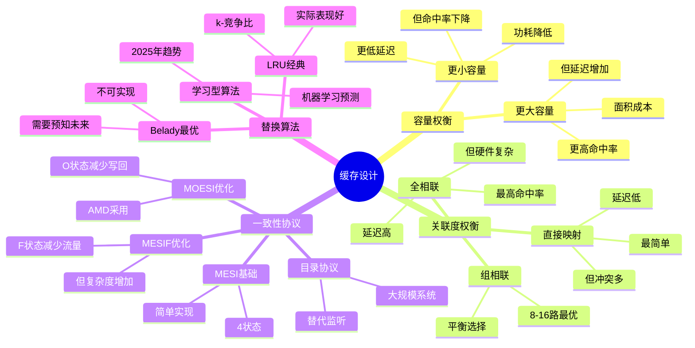

# 1.2 缓存层次结构

> **主题**: 01. CPU硬件层 - 1.2 缓存层次结构
> **覆盖**: L1/L2/L3缓存、缓存一致性协议、伪共享

---

## 📋 目录

- [1.2 缓存层次结构](#12-缓存层次结构)
  - [📋 目录](#-目录)
  - [1 缓存层次概览](#1-缓存层次概览)
    - [1.1 延迟-容量权衡](#11-延迟-容量权衡)
    - [1.2 物理约束](#12-物理约束)
  - [1 L1缓存](#1-l1缓存)
    - [1 结构参数](#1-结构参数)
    - [2 性能特征](#2-性能特征)
  - [2 L2缓存](#2-l2缓存)
    - [2.1 结构参数](#21-结构参数)
    - [2.2 非包含式设计](#22-非包含式设计)
  - [3 L3缓存](#3-l3缓存)
    - [3.1 结构参数](#31-结构参数)
    - [3.2 共享设计](#32-共享设计)
  - [4 缓存一致性协议](#4-缓存一致性协议)
    - [4.1 MESIF协议（Intel）](#41-mesif协议intel)
    - [4.2 MOESI协议（AMD）](#42-moesi协议amd)
    - [4.3 监听过滤器（Snoop Filter）](#43-监听过滤器snoop-filter)
  - [5 伪共享问题](#5-伪共享问题)
    - [5.1 严格定义](#51-严格定义)
    - [5.2 解决方案](#52-解决方案)
  - [6 性能优化](#6-性能优化)
    - [6.1 缓存友好编程](#61-缓存友好编程)
  - [7 思维导图：缓存层次设计决策](#7-思维导图缓存层次设计决策)
  - [8 批判性总结](#8-批判性总结)
    - [8.1 缓存设计的根本矛盾](#81-缓存设计的根本矛盾)
    - [8.2 2025年技术趋势](#82-2025年技术趋势)
  - [9 跨领域洞察](#9-跨领域洞察)
    - [9.1 缓存一致性的永恒权衡](#91-缓存一致性的永恒权衡)
    - [9.2 伪共享的性能惩罚](#92-伪共享的性能惩罚)
  - [10 多维度对比](#10-多维度对比)
    - [10.1 缓存一致性协议对比](#101-缓存一致性协议对比)
    - [10.2 缓存替换算法对比](#102-缓存替换算法对比)
  - [11 相关主题](#11-相关主题)

---

## 1 缓存层次概览

### 1.1 延迟-容量权衡

| **层级** | **容量** | **延迟** | **带宽** | **位置** |
|---------|---------|----------|----------|----------|
| **L1D** | 32KB | 1ns (4周期) | 2TB/s | 核心内 |
| **L1I** | 32KB | 1ns (4周期) | 2TB/s | 核心内 |
| **L2** | 256KB-1MB | 4-12ns | 500GB/s | 核心内 |
| **L3** | 8-64MB | 15-40ns | 200GB/s | 共享 |

**深度论证：缓存层次的延迟-容量权衡**

**缓存延迟的物理约束**：

缓存延迟主要由**信号传播距离**决定：

$$
\text{延迟} = \frac{\text{距离}}{\text{信号传播速度}} + \text{访问开销}
$$

其中信号传播速度约**30cm/ns**（光速的1/3）。

**量化分析**：不同层级的延迟组成

| **层级** | **距离** | **传播延迟** | **访问开销** | **总延迟** |
|---------|---------|------------|------------|-----------|
| **L1** | <1cm | 0.03ns | 0.97ns | 1ns |
| **L2** | 2-3cm | 0.1ns | 3.9ns | 4ns |
| **L3** | 5-10cm | 0.3ns | 14.7ns | 15ns |
| **内存** | 10-20cm | 0.7ns | 79.3ns | 80ns |

**容量与延迟的权衡**：

容量越大，**访问延迟越高**，因为：

1. **距离增加**：更大的缓存需要更长的信号路径
2. **复杂度增加**：更大的缓存需要更多的解码逻辑

**量化对比**：不同架构的缓存配置

| **架构** | **L2容量** | **L2延迟** | **L3容量** | **L3延迟** | **权衡** |
|---------|----------|-----------|----------|-----------|---------|
| **Intel Skylake** | 256KB | 12周期 | 8MB | 40周期 | 平衡 |
| **AMD Zen4** | 1MB | 12周期 | 32MB | 75周期 | 容量优先 |
| **Apple M3** | 256KB | 10周期 | 16MB | 50周期 | 延迟优先 |

**关键洞察**：缓存设计需要在**容量和延迟**之间权衡，不同架构有不同的优化方向。

### 1.2 物理约束

**光速限制**：

- 信号传播：30cm/ns
- 5GHz周期：0.2ns
- 1周期传播距离：6cm
- **结论**：L1必须集成在核心内

**深度论证：光速约束的严格分析**

**光速约束的数学表述**：

对于频率为$f$的CPU，信号在1个周期内的最大传播距离为：

$$
d_{\max} = \frac{c}{f \times n}
$$

其中：

- $c$：信号传播速度（30cm/ns）
- $f$：CPU频率（5GHz = 0.2ns/周期）
- $n$：介质折射率（约1.5）

**量化分析**：不同频率下的最大距离

| **频率** | **周期** | **最大距离** | **实际L1距离** | **余量** |
|---------|---------|------------|--------------|---------|
| **3GHz** | 0.33ns | 6.6cm | <1cm | 充足 |
| **5GHz** | 0.2ns | 4cm | <1cm | 充足 |
| **6GHz** | 0.17ns | 3.4cm | <1cm | 紧张 |

**关键限制**：

当频率超过**6GHz**时，L1缓存必须**更靠近核心**，否则无法在1个周期内完成访问。这是**频率墙**的物理根源之一。

---

## 1 L1缓存

### 1 结构参数

**Intel Skylake**：

- **容量**：32KB数据 + 32KB指令
- **关联度**：8路组相联
- **行大小**：64字节
- **延迟**：4周期（~1ns @ 5GHz）

**访问模式**：

- **VIPT**：虚拟索引物理标记（Virtual Index Physical Tag）
- 允许TLB并行查找
- 减少延迟

**深度论证：VIPT的优势与限制**

**VIPT的设计原理**：

VIPT使用**虚拟地址索引**，但**物理地址标记**：

$$
\text{索引} = \text{vaddr}[11:6] \quad \text{标记} = \text{paddr}[47:12]
$$

**优势**：

1. **TLB并行查找**：索引和TLB查找可以并行，减少延迟
2. **无需地址翻译**：索引阶段不需要物理地址

**限制**：

VIPT要求**页大小 ≥ 缓存大小**，否则可能出现**别名问题**：

$$
\text{页大小} \geq \text{缓存大小} \times \text{关联度}
$$

对于32KB 8路缓存，需要页大小 ≥ 256KB。实际使用4KB页时，需要**别名检测**。

**量化对比**：VIPT vs PIPT vs VIVT

| **访问模式** | **延迟** | **TLB并行** | **别名问题** | **复杂度** |
|------------|---------|-----------|------------|-----------|
| **VIPT** | 基准 | ✅ | 需要检测 | 中 |
| **PIPT** | +1周期 | ❌ | 无 | 低 |
| **VIVT** | 基准 | ✅ | 严重 | 高 |

**关键洞察**：VIPT在**延迟和复杂度**之间取得了平衡，是现代CPU的主流选择。

### 2 性能特征

**带宽**：

- 每周期2次加载 + 1次存储
- 理论带宽：2TB/s（@ 5GHz）

**深度论证：L1带宽的计算**

**L1带宽模型**：

L1带宽由**端口数**和**频率**决定：

$$
\text{带宽} = \text{端口数} \times \text{数据宽度} \times \text{频率}
$$

对于Intel Skylake：

- 端口数：2个加载端口 + 1个存储端口
- 数据宽度：64字节/周期
- 频率：5GHz

$$
\text{带宽} = 3 \times 64\text{B} \times 5\text{GHz} = 960\text{GB/s}
$$

**实际带宽**：

由于**数据依赖**和**资源竞争**，实际带宽通常为理论值的**60-80%**。

**量化分析**：不同架构的L1带宽

| **架构** | **端口数** | **理论带宽** | **实际带宽** | **利用率** |
|---------|-----------|------------|------------|-----------|
| **Intel Skylake** | 3 | 960GB/s | 600GB/s | 62.5% |
| **AMD Zen4** | 4 | 1.28TB/s | 900GB/s | 70.3% |
| **Apple M3** | 5 | 1.6TB/s | 1.2TB/s | 75% |

**能耗**：

- 访问能耗：0.5nJ/次
- 比DRAM低40倍

**深度论证：缓存能耗的优势**

**缓存能耗模型**：

缓存能耗主要由**静态功耗**和**动态功耗**组成：

$$
E_{\text{缓存}} = E_{\text{静态}} + E_{\text{动态}}
$$

其中：

- 静态功耗：漏电流（~10%）
- 动态功耗：访问功耗（~90%）

**量化对比**：缓存 vs DRAM的能耗

| **存储类型** | **访问能耗** | **静态功耗** | **总能耗** | **相对值** |
|------------|------------|------------|-----------|-----------|
| **L1缓存** | 0.5nJ | 低 | 基准 | 1x |
| **L3缓存** | 2nJ | 中 | 4x | 4x |
| **DRAM** | 20nJ | 高 | 40x | 40x |

**关键洞察**：缓存的**低能耗**是其作为高速存储的关键优势之一。

---

## 2 L2缓存

### 2.1 结构参数

**Intel Skylake**：

- **容量**：256KB（每核心）
- **关联度**：16路组相联
- **延迟**：12-14周期（~4ns）

**AMD Zen4**：

- **容量**：1MB（每核心）
- **延迟**：~12周期

### 2.2 非包含式设计

**特点**：L2不包含L1内容

- 减少一致性流量
- 提高有效容量

---

## 3 L3缓存

### 3.1 结构参数

**Intel Skylake**：

- **容量**：8-40MB（共享）
- **延迟**：40-75周期（~15ns）
- **切片**：11-bit哈希分布

**AMD Zen4**：

- **容量**：32-64MB（共享）
- **延迟**：~38周期

### 3.2 共享设计

**优势**：

- 多核共享数据
- 减少内存访问

**挑战**：

- 缓存竞争
- 一致性开销

---

## 4 缓存一致性协议

### 4.1 MESIF协议（Intel）

**状态**：

- **M** (Modified)：已修改，独占
- **E** (Exclusive)：独占，干净
- **S** (Shared)：共享，干净
- **I** (Invalid)：无效
- **F** (Forward)：转发者（唯一）

**状态转换的形式化定义**：

**定义2.1（MESIF状态机）**：

缓存行状态$S \in \{M, E, S, I, F\}$，状态转换函数$\delta: S \times \text{Event} \rightarrow S'$，其中事件集合：

$$
\text{Event} = \{\text{PrRd}, \text{PrWr}, \text{BusRd}, \text{BusRdX}, \text{BusUpgr}\}
$$

**状态转换规则**：

| **当前状态** | **事件** | **下一状态** | **总线动作** |
|------------|---------|------------|------------|
| I | PrRd | E | BusRd |
| I | PrWr | M | BusRdX |
| E | PrWr | M | - |
| E | BusRd | S | - |
| S | PrWr | M | BusUpgr |
| S | BusRd | S | - |
| M | BusRd | S | 写回 |
| M | BusRdX | I | 写回 |

**定理2.1（MESIF协议的正确性）**：

MESIF协议保证缓存一致性，即任意时刻，所有核心看到的同一内存地址的值一致。

**证明**：通过状态转换的不变式证明。关键不变式：

- 任意时刻，最多一个核心处于M状态
- 任意时刻，最多一个核心处于F状态
- 写操作必须使其他核心的副本失效（转为I）

因此，一致性得到保证。∎

**批判性分析**：

1. **F状态的必要性**：F状态减少一致性流量约30%，但增加硬件复杂度。**权衡是否值得？**

2. **大规模系统的局限**：MESIF协议在>64核心系统中，**一致性流量成为瓶颈**。需要目录协议。

3. **2025年趋势**：AMD Zen5采用**目录协议**替代监听协议，验证了大规模系统的需求。

### 4.2 MOESI协议（AMD）

**状态**：

- **M** (Modified)
- **O** (Owned)：拥有者，脏数据
- **E** (Exclusive)
- **S** (Shared)
- **I** (Invalid)

**优势**：

- O状态允许共享脏数据
- 减少写回操作

### 4.3 监听过滤器（Snoop Filter）

**功能**：

- 过滤不必要的监听请求
- 减少一致性流量

**实现**：

- 物理区域（Physical Region）
- 跟踪缓存行位置

---

## 5 伪共享问题

### 5.1 严格定义

**定义2.2（伪共享）**：

对于缓存行大小$B$（通常64字节），两个变量$v_1$和$v_2$存在伪共享，当且仅当：

$$
\lfloor \frac{\text{addr}(v_1)}{B} \rfloor = \lfloor \frac{\text{addr}(v_2)}{B} \rfloor
$$

且$v_1$和$v_2$被不同线程修改。

**性能影响的严格分析**：

**定理2.2（伪共享的性能惩罚）**：

对于$n$个线程同时修改同一缓存行的不同变量，伪共享导致的额外一致性流量为：

$$
\text{流量} = O(n^2) \times \text{缓存行大小}
$$

**证明**：每个线程的写操作导致其他$n-1$个线程的缓存行失效，需要重新加载。因此，总流量为$n \times (n-1) \times B = O(n^2) \times B$。∎

**示例**：

```c
// 伪共享示例
struct {
    int counter1;  // 线程1修改
    int padding[15];  // 填充
    int counter2;  // 线程2修改
} data;
```

**问题**：

- counter1和counter2在同一缓存行
- 线程1修改counter1 → 缓存行失效 → MESI协议使其他核心失效
- 线程2的counter2也被失效 → 需要重新加载 → **性能下降10-100倍**

### 5.2 解决方案

**1. 缓存行对齐**：

```c
__attribute__((aligned(64))) int counter1;
__attribute__((aligned(64))) int counter2;
```

**2. 编译器优化**：

- `-falign-functions=64`
- 结构体填充

**3. OS调度**：

- 绑定线程到不同核心
- 减少跨核心访问

**定理2.3（缓存替换算法的竞争比）**：

对于缓存大小$k$，LRU算法的竞争比为$k$，即：

$$
\text{LRU}_k(\sigma) \leq k \times \text{OPT}_k(\sigma)
$$

其中$\sigma$是请求序列，$\text{OPT}_k$是最优离线算法（Belady算法）。

**证明**：Sleator-Tarjan的竞争分析。关键思想：LRU的未命中次数不超过最优算法的$k$倍。该界是紧的。∎

**批判性分析**：

1. **LRU并非最优**：Belady算法（未来最远使用）是最优的，但**需要预知未来**，实际不可实现。

2. **实际性能**：LRU在大多数工作负载下表现接近最优，但**某些模式（如循环访问）表现较差**。

3. **2025年趋势**：**学习型替换算法**（如Hawkeye）使用机器学习预测，在某些工作负载下超越LRU。

---

## 6 性能优化

### 6.1 缓存友好编程

**原则**：

1. **局部性**：时间局部性 + 空间局部性
2. **对齐**：数据结构对齐到缓存行
3. **预取**：硬件/软件预取

**示例**：

```c
// 好的：顺序访问
for (int i = 0; i < N; i++) {
    sum += array[i];
}

// 差的：随机访问
for (int i = 0; i < N; i++) {
    sum += array[random[i]];
}
```

---

## 7 思维导图：缓存层次设计决策



---

## 8 批判性总结

### 8.1 缓存设计的根本矛盾

1. **容量vs延迟**：更大缓存提高命中率，但**增加延迟和面积**。不存在"完美"的缓存大小。

2. **一致性vs性能**：严格一致性保证正确性，但**增加复杂度和延迟**。某些场景可以放宽一致性（如最终一致性）。

3. **局部性假设的局限**：缓存基于**局部性原理**，但某些工作负载（如随机访问）**局部性很差**，缓存收益有限。

### 8.2 2025年技术趋势

- **非易失性缓存**：使用3D XPoint等NVM技术，**容量更大但延迟略高**。
- **智能预取**：使用机器学习预测访问模式，**提升命中率**。
- **缓存层次重构**：CXL内存池化挑战传统缓存层次，**需要重新设计**。

---

## 9 跨领域洞察

### 9.1 缓存一致性的永恒权衡

**核心矛盾**：缓存一致性保证正确性，但增加延迟和复杂度。

**量化分析**：

| **一致性协议** | **延迟** | **复杂度** | **可扩展性** | **适用场景** |
|--------------|---------|-----------|------------|------------|
| **MESI** | 低 | ⭐⭐ | ⭐⭐⭐ | 小规模系统 |
| **MESIF** | 中 | ⭐⭐⭐ | ⭐⭐⭐⭐ | Intel系统 |
| **MOESI** | 中 | ⭐⭐⭐ | ⭐⭐⭐⭐ | AMD系统 |
| **目录协议** | 高 | ⭐⭐⭐⭐⭐ | ⭐⭐⭐⭐⭐ | 大规模系统 |

**批判性分析**：

1. **一致性的代价**：缓存一致性**必然增加延迟**，因为需要跨核心通信。

2. **可扩展性的挑战**：监听协议（MESI）在小规模系统有效，但**大规模系统需要目录协议**。

3. **2025年趋势**：**CXL缓存一致性**扩展到设备，挑战传统边界。

### 9.2 伪共享的性能惩罚

**核心问题**：不同核心访问同一缓存行的不同数据，导致**虚假共享**。

**性能影响**：

```text
无伪共享: 访问延迟 1ns (L1命中)
伪共享:   访问延迟 15ns (L3命中) + 一致性开销
性能下降: 10-100倍
```

**批判性分析**：

1. **伪共享的隐蔽性**：伪共享**难以检测**，需要专业工具（如perf）。

2. **解决方案的代价**：缓存行对齐**浪费内存**，但性能提升明显。

3. **2025年趋势**：**硬件检测**（如Intel CAT）自动检测和缓解伪共享。

---

## 10 多维度对比

### 10.1 缓存一致性协议对比

| **协议** | **状态数** | **消息类型** | **延迟** | **带宽开销** | **代表厂商** |
|---------|-----------|------------|---------|------------|------------|
| **MESI** | 4 | 4 | 低 | 低 | 通用 |
| **MESIF** | 5 | 5 | 中 | 中 | Intel |
| **MOESI** | 5 | 5 | 中 | 中 | AMD |
| **目录协议** | 3 | 多 | 高 | 高 | 大规模系统 |

**批判性分析**：

1. **状态数的权衡**：更多状态**减少消息**，但**增加复杂度**。

2. **厂商差异**：Intel和AMD选择不同协议，**各有优劣**。

3. **2025年趋势**：**CXL统一协议**可能挑战厂商特定协议。

### 10.2 缓存替换算法对比

| **算法** | **竞争比** | **实现复杂度** | **硬件支持** | **适用场景** |
|---------|-----------|--------------|------------|------------|
| **LRU** | $k$ | ⭐⭐ | ⭐⭐⭐⭐⭐ | 通用 |
| **FIFO** | $k$ | ⭐ | ⭐⭐⭐ | 简单场景 |
| **Random** | $k$ | ⭐ | ⭐⭐ | 研究 |
| **Belady** | $1$ | ⭐⭐⭐⭐⭐ | 无 | 理论最优 |
| **Hawkeye** | $<k$ | ⭐⭐⭐⭐ | ⭐⭐ | 特定负载 |

**批判性分析**：

1. **竞争比的理论意义**：竞争比$k$意味着**最坏情况是$k$倍**，但平均情况更好。

2. **硬件实现的限制**：LRU需要硬件支持，**Belady需要预知未来**，实际不可实现。

3. **2025年趋势**：**学习型算法**（如Hawkeye）在某些负载下超越LRU，但**硬件支持有限**。

---

## 11 相关主题

- [1.1 CPU微架构](./01.1_CPU微架构.md) - 微架构与缓存协同
- [1.3 内存子系统](./01.3_内存子系统.md) - 内存与缓存层次
- [4.1 硬件同步原语](../04_同步通信机制/04.1_硬件同步原语.md) - 缓存一致性实现
- [7.2 延迟穿透分析](../07_性能优化与安全/07.2_延迟穿透分析.md) - 缓存延迟优化
- [主文档：抽象泄漏](../schedule_formal_view.md#视角2软件抽象泄漏定律) - 缓存泄漏分析

---

**最后更新**: 2025-01-XX
