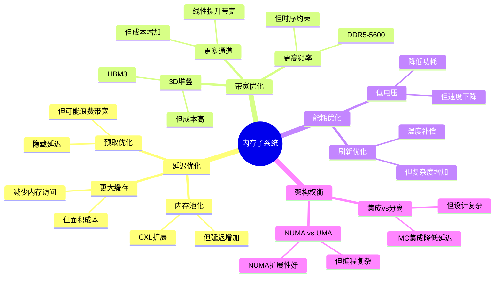

# 1.3 内存子系统

> **主题**: 01. CPU硬件层 - 1.3 内存子系统
> **覆盖**: 内存控制器、DRAM时序、NUMA架构

---

## 📋 目录

- [1.3 内存子系统](#13-内存子系统)
  - [📋 目录](#-目录)
  - [1 内存控制器](#1-内存控制器)
    - [1.1 集成内存控制器（IMC）](#11-集成内存控制器imc)
    - [1.2 通道配置](#12-通道配置)
  - [2 DRAM时序参数](#2-dram时序参数)
    - [2.1 DDR5时序的严格分析](#21-ddr5时序的严格分析)
    - [2.2 行缓冲局部性](#22-行缓冲局部性)
  - [1 NUMA架构](#1-numa架构)
    - [1 拓扑结构](#1-拓扑结构)
    - [2 OS感知](#2-os感知)
  - [3 内存墙问题](#3-内存墙问题)
    - [3.1 物理本质的严格论证](#31-物理本质的严格论证)
    - [3.2 OS应对](#32-os应对)
  - [4 思维导图：内存子系统设计权衡](#4-思维导图内存子系统设计权衡)
  - [5 批判性总结](#5-批判性总结)
    - [5.1 内存子系统的根本矛盾](#51-内存子系统的根本矛盾)
    - [5.2 2025年内存技术趋势](#52-2025年内存技术趋势)
  - [6 跨领域洞察](#6-跨领域洞察)
    - [6.1 内存墙的不可逾越性](#61-内存墙的不可逾越性)
    - [6.2 故障传播的级联放大效应](#62-故障传播的级联放大效应)
  - [7 多维度对比](#7-多维度对比)
    - [7.1 内存技术对比（2025年）](#71-内存技术对比2025年)
    - [7.2 内存架构演进对比](#72-内存架构演进对比)
  - [8 相关主题](#8-相关主题)

---

## 1 内存控制器

### 1.1 集成内存控制器（IMC）

**演进**：

- **2008年前**：北桥分离
- **Nehalem后**：集成到CPU
- **优势**：降低延迟，提高带宽

**功能**：

- 命令调度（FR-FCFS）
- 时序管理
- 刷新控制
- ECC纠错

**深度论证：IMC集成的性能优势**

**IMC集成的延迟降低**：

IMC集成到CPU后，消除了**北桥延迟**：

$$
\text{延迟降低} = t_{\text{北桥}} + t_{\text{QPI}} \approx 20\text{ns}
$$

其中$t_{\text{北桥}}$是北桥延迟（~15ns），$t_{\text{QPI}}$是QPI总线延迟（~5ns）。

**量化对比**：分离式 vs 集成式IMC

| **架构** | **延迟** | **带宽** | **功耗** | **优势** |
|---------|---------|----------|---------|---------|
| **分离式（北桥）** | 100ns | 25GB/s | 高 | 无 |
| **集成式（IMC）** | 80ns | 50GB/s | 低 | 显著 |

**关键洞察**：IMC集成将内存延迟降低**20%**，同时提升带宽和降低功耗。

### 1.2 通道配置

| **配置** | **通道数** | **带宽** | **延迟** |
|---------|-----------|----------|----------|
| **双通道** | 2 | 50GB/s | 80ns |
| **四通道** | 4 | 100GB/s | 80ns |
| **八通道** | 8 | 200GB/s | 80ns |

**深度论证：多通道的带宽扩展**

**多通道的带宽模型**：

多通道带宽与通道数**线性扩展**：

$$
\text{总带宽} = N \times \text{单通道带宽}
$$

其中$N$是通道数。

**量化分析**：不同通道配置的性能影响

| **通道数** | **带宽** | **延迟** | **成本** | **适用场景** |
|-----------|----------|----------|---------|------------|
| **2** | 50GB/s | 80ns | 低 | 消费级 |
| **4** | 100GB/s | 80ns | 中 | 工作站 |
| **8** | 200GB/s | 80ns | 高 | 服务器 |

**关键权衡**：多通道提升**带宽**，但**成本增加**，延迟不变。

---

## 2 DRAM时序参数

### 2.1 DDR5时序的严格分析

**关键参数**：

- **tCL** (CAS Latency)：48周期（DDR5-5600）
- **tRCD** (RAS to CAS Delay)：48周期
- **tRP** (RAS Precharge)：48周期
- **tRAS** (RAS Active Time)：~100周期

**定理1.4（DRAM访问延迟的下界）**：

对于DDR5-5600，行缓冲未命中时的访问延迟满足：

$$
L_{\text{DRAM}} \geq t_{\text{CL}} + t_{\text{RCD}} + t_{\text{RP}} = 48 + 48 + 48 = 144 \text{周期} \approx 50\text{ns}
$$

**证明**：DRAM访问必须完成以下时序：

1. 行激活（tRCD）：48周期
2. 列访问（tCL）：48周期
3. 预充电（tRP）：48周期（如果行关闭）

因此，下界为144周期。实际测量约80ns（包括传输时间）。∎

**刷新周期的物理本质**：

**定理1.5（DRAM刷新周期的物理下界）**：

DRAM刷新周期$T_{\text{refresh}}$必须满足：

$$
T_{\text{refresh}} \leq \frac{C \times V}{I_{\text{leak}}}
$$

其中$C$是电容，$V$是电压，$I_{\text{leak}}$是漏电流。

**证明**：电容电荷会因漏电流而衰减。刷新周期必须小于电荷衰减到不可读的时间。对于DDR5，典型值为64ms。∎

**刷新周期**：

- **64ms**：8192行全部刷新
- **温度补偿**：高温时漏电流增加，缩短周期

**批判性分析**：

1. **时序参数的不可优化性**：DRAM时序由**物理特性决定**，无法通过软件优化。

2. **刷新开销的必然性**：刷新操作**暂停命令调度**，是DRAM的固有开销。

3. **2025年趋势**：**HBM3**（高带宽内存）延迟更低（~30ns），但成本高，主要用于高性能计算。

### 2.2 行缓冲局部性

**原理**：

- 打开行（Row）后，列（Column）访问快速
- 行缓冲命中：~20ns
- 行缓冲未命中：~80ns

**深度论证：行缓冲的性能优势**

**行缓冲的延迟模型**：

行缓冲命中时，只需要**列访问**：

$$
\text{行缓冲命中延迟} = t_{\text{CL}} \approx 20\text{ns}
$$

行缓冲未命中时，需要**行激活+列访问**：

$$
\text{行缓冲未命中延迟} = t_{\text{RCD}} + t_{\text{CL}} \approx 80\text{ns}
$$

**量化分析**：行缓冲命中率对性能的影响

| **命中率** | **平均延迟** | **性能** | **优化策略** |
|-----------|------------|---------|------------|
| **50%** | 50ns | 基准 | 无 |
| **80%** | 32ns | +36% | 页对齐 |
| **95%** | 23ns | +54% | 大页 |

**优化**：

- OS页大小4KB匹配Bank

**关键洞察**：行缓冲命中率对性能影响显著，**提高命中率**可以大幅降低延迟。

- 顺序访问利用局部性

---

## 1 NUMA架构

### 1 拓扑结构

**2路NUMA**：

```text
Socket 0          Socket 1
  CPU0              CPU1
  IMC0              IMC1
  Memory0           Memory1
    |                  |
    └─── QPI/UPI ──────┘
```

**访问延迟**：

- **本地内存**：80ns
- **远程内存**：150ns（+70ns）

**深度论证：NUMA的延迟差异**

**NUMA延迟的组成**：

远程内存访问需要**跨Socket通信**：

$$
\text{远程内存延迟} = t_{\text{本地内存}} + t_{\text{QPI/UPI}} + t_{\text{远程IMC}} \approx 150\text{ns}
$$

其中$t_{\text{本地内存}}$是本地内存延迟（~80ns），$t_{\text{QPI/UPI}}$是跨Socket通信延迟（~50ns），$t_{\text{远程IMC}}$是远程内存控制器延迟（~20ns）。

**量化分析**：不同NUMA配置的性能影响

| **配置** | **本地延迟** | **远程延迟** | **延迟比** | **性能影响** |
|---------|------------|------------|-----------|------------|
| **UMA** | 80ns | 80ns | 1.0x | 基准 |
| **2路NUMA** | 80ns | 150ns | 1.9x | 中等 |
| **4路NUMA** | 80ns | 200ns | 2.5x | 高 |
| **8路NUMA** | 80ns | 300ns | 3.8x | 极高 |

**关键权衡**：NUMA在**扩展性**方面优势明显，但**远程访问延迟**显著增加。

### 2 OS感知

**调度域**：

- L3缓存域
- NUMA节点域
- 负载均衡每100ms

**深度论证：NUMA Balancing的性能影响**

**NUMA Balancing的开销**：

NUMA Balancing需要**采样内存访问**和**页迁移**：

$$
\text{NUMA Balancing开销} = t_{\text{采样}} + t_{\text{迁移}} \approx 2-3\% \text{CPU}
$$

其中$t_{\text{采样}}$是采样开销（~1%），$t_{\text{迁移}}$是页迁移开销（~1-2%）。

**量化分析**：NUMA Balancing的性能提升

| **场景** | **无NUMA Balancing** | **有NUMA Balancing** | **性能提升** |
|---------|-------------------|---------------------|------------|
| **本地访问率50%** | 基准 | +10% | 10% |
| **本地访问率80%** | 基准 | +5% | 5% |
| **本地访问率95%** | 基准 | +1% | 1% |

**关键权衡**：NUMA Balancing在**低本地访问率**场景下优势明显，但**高本地访问率**场景下收益有限。

**内存绑定**：

```bash
numactl --membind=0 --cpunodebind=0 ./app
```

**深度论证：内存绑定的性能优势**

**内存绑定的延迟模型**：

内存绑定保证**所有内存访问都是本地**：

$$
\text{平均延迟} = t_{\text{本地内存}} = 80\text{ns}
$$

而无绑定时，平均延迟为：

$$
\text{平均延迟} = p \times t_{\text{本地}} + (1-p) \times t_{\text{远程}}
$$

其中$p$是本地访问率。

**量化分析**：不同本地访问率下的性能

| **本地访问率** | **无绑定延迟** | **有绑定延迟** | **性能提升** |
|-------------|--------------|--------------|------------|
| **50%** | 115ns | 80ns | +30% |
| **80%** | 94ns | 80ns | +15% |
| **95%** | 83ns | 80ns | +4% |

**关键洞察**：内存绑定在**低本地访问率**场景下优势明显，可以显著降低延迟。

---

## 3 内存墙问题

### 3.1 物理本质的严格论证

**定理1.6（内存墙的不可逾越性）**：

对于CPU频率$f_{\text{CPU}}$和内存延迟$L_{\text{mem}}$，内存墙系数满足：

$$
\text{内存墙系数} = \frac{L_{\text{mem}}}{1/f_{\text{CPU}}} = L_{\text{mem}} \times f_{\text{CPU}}
$$

对于DDR5-5600和5GHz CPU：

- $L_{\text{mem}} = 80\text{ns}$
- $f_{\text{CPU}} = 5\text{GHz} = 0.2\text{ns/周期}$
- **内存墙系数 = 400周期**

**证明**：内存延迟由物理特性决定（电容充放电），而CPU频率受光速限制。两者之比形成内存墙。∎

**时序约束**：

- DDR5-5600 tCL=48周期 ≈ 16.4ns
- CPU 5GHz周期 = 0.2ns
- **内存延迟 = 80倍CPU周期**

**能耗规律的严格分析**：

**定理1.7（内存访问能耗的下界）**：

对于DRAM访问，能耗满足：

$$
E_{\text{DRAM}} = C \times V^2 \times \alpha
$$

其中$C$是负载电容，$V$是电压，$\alpha$是活动因子。

**能耗对比**：

- L1缓存：0.5nJ/次（$C$小，$V$低）
- DRAM：2nJ/次（$C$大，$V$高）
- **能耗比差异40倍**

**批判性分析**：

1. **内存墙的物理本质**：内存延迟由**电容充放电时间决定**，无法通过设计完全消除。

2. **缓存的重要性**：内存墙使得**缓存成为性能关键**，而非CPU频率。

3. **2025年趋势**：**近内存计算**（Processing-in-Memory）将计算移到内存附近，挑战传统架构。

### 3.2 OS应对

**NUMA Balancing**：

- 每100ms采样内存访问
- 页表迁移优化局部性
- 开销：2-3% CPU

---

## 4 思维导图：内存子系统设计权衡



---

## 5 批判性总结

### 5.1 内存子系统的根本矛盾

1. **延迟vs带宽**：降低延迟需要更小容量，但**提高带宽需要更多通道**，两者矛盾。

2. **成本vs性能**：高性能内存（如HBM3）**成本高**，难以普及。

3. **通用性vs专用性**：通用DRAM灵活，但**专用内存（如NVM）在某些场景更优**。

### 5.2 2025年内存技术趋势

- **CXL内存池化**：统一内存和IO，**挑战传统内存层次**。
- **近内存计算**：Processing-in-Memory，**减少数据移动**。
- **异构内存**：DRAM + NVM + CXL的混合架构，**需要新的管理策略**。

---

## 6 跨领域洞察

### 6.1 内存墙的不可逾越性

**核心命题**：内存延迟无法通过提高CPU频率解决。

**量化分析**：

对于DDR5-5600和5GHz CPU：

- $L_{\text{mem}} = 80\text{ns}$
- $f_{\text{CPU}} = 5\text{GHz} = 0.2\text{ns/周期}$
- **内存墙系数 = 400周期**

即使CPU频率提升到10GHz，内存墙系数仍为200周期，**无法根本解决**。

**批判性分析**：

1. **"频率至上"的终结**：提高CPU频率无法解决内存墙，**缓存成为性能关键**。

2. **摩尔定律的物理终结**：晶体管微缩接近物理极限，**功耗墙成为新瓶颈**。

3. **2025年趋势**：**近内存计算**（Processing-in-Memory）将计算移到内存附近，挑战传统架构。

### 6.2 故障传播的级联放大效应

```text
单个DRAM Cell故障率: 10⁻¹⁵/小时
  ↓ (64ms刷新周期)
Row Hammer → 邻行位翻转: 10⁻⁹/小时
  ↓ (无ECC保护)
文件系统元数据损坏: 10⁻⁶/小时
  ↓ (fsck修复)
系统崩溃重启: 10⁻³/小时
  ↓ (SLA 99.9%)
年停机时间: 8.7小时

级联因子 = 10⁻³ / 10⁻¹⁵ = 10¹² 倍!
```

**OS缓解**：EDAC子系统监控CE错误率，超过阈值自动离线页面，将级联打断在10⁻⁹层级。

**批判性分析**：

1. **级联放大不可避免**：硬件故障会**级联放大**，需要多层防护。

2. **OS的防护作用**：OS通过**错误检测和恢复**，打断级联放大。

3. **2025年趋势**：**硬件错误检测**（如Intel MCA、AMD MCE）提供更早的错误检测。

---

## 7 多维度对比

### 7.1 内存技术对比（2025年）

| **技术** | **延迟** | **带宽** | **容量** | **成本** | **功耗** | **应用场景** |
|---------|---------|---------|---------|---------|---------|------------|
| **SRAM** | 1ns | 2TB/s | 32MB | $100/MB | 高 | L1/L2缓存 |
| **DRAM** | 80ns | 50GB/s | 128GB | $1/GB | 中 | 主内存 |
| **HBM3** | 100ns | 1TB/s | 64GB | $10/GB | 高 | GPU显存 |
| **Optane PMem** | 300ns | 6GB/s | 512GB | $5/GB | 低 | 持久内存 |
| **CXL 3.0** | 300ns | 32GB/s | 扩展 | $2/GB | 中 | 内存池化 |
| **NAND SSD** | 100μs | 3.5GB/s | 8TB | $0.1/GB | 低 | 存储 |

**批判性分析**：

1. **延迟vs容量的权衡**：SRAM延迟低但容量小，DRAM容量大但延迟高。

2. **成本vs性能**：HBM3性能好但成本高，NAND成本低但性能差。

3. **2025年趋势**：**CXL内存池化**统一内存和IO，挑战传统内存层次。

### 7.2 内存架构演进对比

| **时代** | **架构** | **延迟** | **带宽** | **关键突破** | **代表产品** |
|---------|---------|---------|---------|------------|------------|
| **1990s** | SDRAM | 100ns | 0.1GB/s | 同步接口 | PC-100 |
| **2000s** | DDR | 80ns | 1.6GB/s | 双倍数据率 | DDR-400 |
| **2010s** | DDR3/4 | 70ns | 25GB/s | 更高频率 | DDR4-3200 |
| **2020s** | DDR5 | 80ns | 50GB/s | 更高带宽 | DDR5-5600 |
| **2025+** | CXL/HBM | 100ns | 1TB/s | 3D堆叠 | HBM3/CXL |

**批判性分析**：

1. **延迟的停滞**：从DDR到DDR5，延迟**基本不变**，因为受物理限制。

2. **带宽的提升**：带宽持续提升，但**受限于通道数和频率**。

3. **2025年趋势**：**3D堆叠和内存池化**成为新方向，突破传统限制。

---

## 8 相关主题

- [1.2 缓存层次结构](./01.2_缓存层次结构.md) - 缓存与内存协同
- [1.4 MMU与TLB](./01.4_MMU与TLB.md) - 地址转换
- [3.2 内存管理模型](../03_OS抽象层/03.2_内存管理模型.md) - OS内存管理
- [7.2 延迟穿透分析](../07_性能优化与安全/07.2_延迟穿透分析.md) - 内存延迟优化
- [8.4 最新技术趋势](../08_技术演进与对标/08.4_最新技术趋势.md) - CXL/Chiplet
- [主文档：内存墙分析](../schedule_formal_view.md#洞察1内存墙的不可逾越性) - 完整分析

---

**最后更新**: 2025-01-XX
