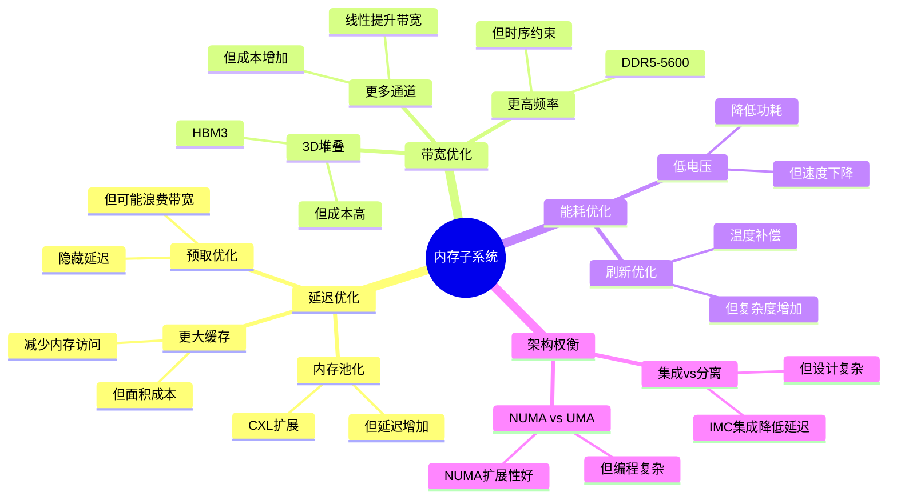
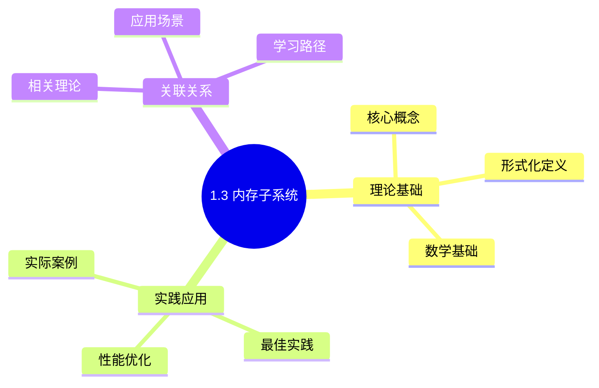
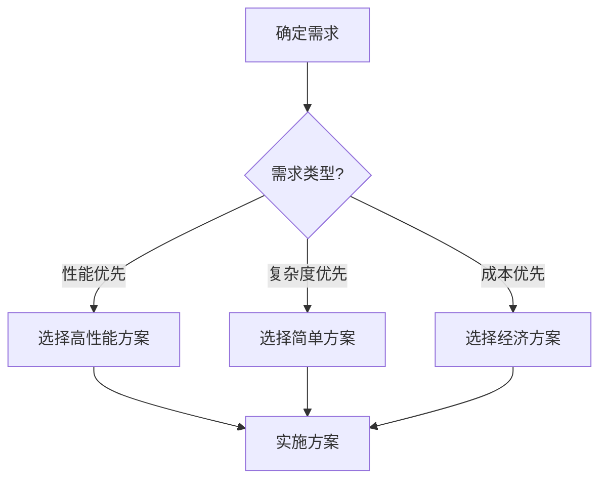
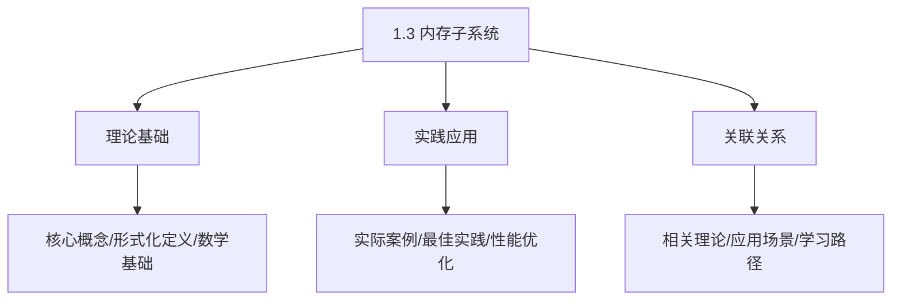
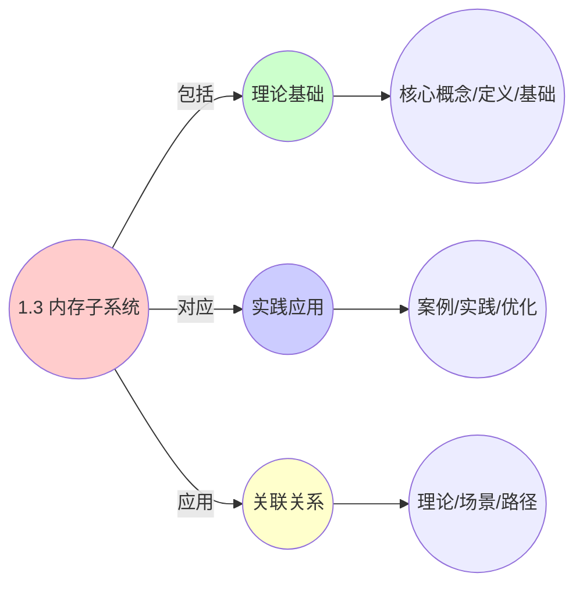
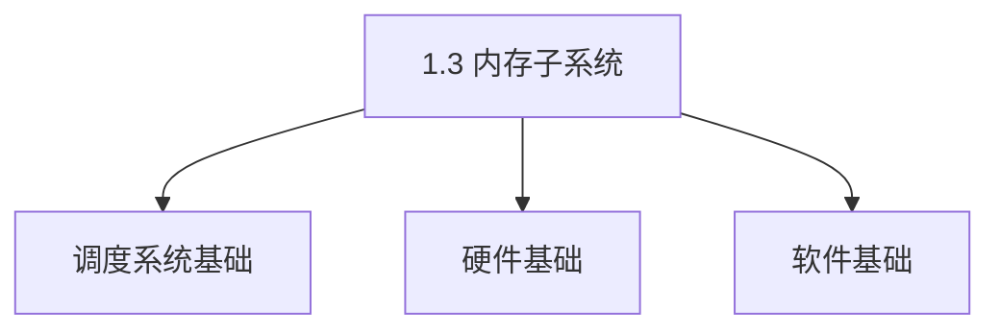

# 1.3 内存子系统

> **主题**: 01. CPU硬件层 - 1.3 内存子系统
> **覆盖**: 内存控制器、DRAM时序、NUMA架构

---

## 📋 目录

- [1.3 内存子系统](#13-内存子系统)
  - [📋 目录](#-目录)
  - [1 内存控制器](#1-内存控制器)
    - [1.1 集成内存控制器（IMC）](#11-集成内存控制器imc)
    - [1.2 通道配置](#12-通道配置)
  - [2 DRAM时序参数](#2-dram时序参数)
    - [2.1 DDR5时序的严格分析](#21-ddr5时序的严格分析)
    - [2.2 行缓冲局部性](#22-行缓冲局部性)
  - [3 NUMA架构](#3-numa架构)
    - [3.1 拓扑结构](#31-拓扑结构)
    - [3.2 OS感知](#32-os感知)
  - [4 实践案例](#4-实践案例)
    - [4.1 高性能计算内存优化](#41-高性能计算内存优化)
    - [4.2 数据库内存优化](#42-数据库内存优化)
  - [5 内存墙问题](#5-内存墙问题)
    - [5.1 物理本质的严格论证](#51-物理本质的严格论证)
    - [5.2 OS应对](#52-os应对)
  - [6 思维导图：内存子系统设计权衡](#6-思维导图内存子系统设计权衡)
  - [7 批判性总结](#7-批判性总结)
    - [5.1 内存子系统的根本矛盾](#51-内存子系统的根本矛盾)
    - [5.2 2025年内存技术趋势](#52-2025年内存技术趋势)
  - [8 跨领域洞察](#8-跨领域洞察)
    - [6.1 内存墙的不可逾越性](#61-内存墙的不可逾越性)
    - [6.2 故障传播的级联放大效应](#62-故障传播的级联放大效应)
  - [9 多维度对比](#9-多维度对比)
    - [7.1 内存技术对比（2025年）](#71-内存技术对比2025年)
    - [7.2 内存架构演进对比](#72-内存架构演进对比)
  - [10 相关主题](#10-相关主题)
    - [10.1 跨视角链接](#101-跨视角链接)
  - [11 2025年最新技术（更新至2025年11月）](#11-2025年最新技术更新至2025年11月)
  - [12 最佳实践与故障排查](#12-最佳实践与故障排查)
    - [12.1 内存子系统最佳实践（2025年11月最新）](#121-内存子系统最佳实践2025年11月最新)
    - [12.2 内存子系统故障排查（2025年11月最新）](#122-内存子系统故障排查2025年11月最新)

---

## 1 内存控制器

### 1.1 集成内存控制器（IMC）

**案例1.3.1（集成内存控制器）**：

集成内存控制器（IMC）是现代CPU的重要组件，负责管理DRAM访问。

**IMC演进**：

- **2008年前**：北桥分离，延迟高
- **Nehalem后**：集成到CPU，延迟降低
- **优势**：降低延迟，提高带宽

**IMC功能**：

**1. 命令调度（FR-FCFS）**：

- **First-Ready First-Come-First-Served**：优先调度就绪的命令
- **行缓冲优化**：优先调度行缓冲命中的命令
- **提高带宽利用率**：提高DRAM带宽利用率

**2. 时序管理**：

- **时序约束**：管理DRAM时序参数（tCL、tRCD、tRP等）
- **命令调度**：确保命令满足时序约束
- **延迟优化**：优化命令调度减少延迟

**3. 刷新控制**：

- **自动刷新**：定期刷新DRAM行
- **温度补偿**：根据温度调整刷新周期
- **刷新调度**：优化刷新时机减少性能影响

**4. ECC纠错**：

- **错误检测**：检测单比特错误
- **错误纠正**：纠正单比特错误
- **可靠性提升**：提高系统可靠性

**IMC实现**：

```c
// 集成内存控制器实现（伪代码）
typedef struct {
    // 命令队列
    struct {
        dram_command_t commands[CMD_QUEUE_SIZE];
        int head;
        int tail;
        int count;
    } cmd_queue;

    // 时序管理
    struct {
        uint64_t tCL;   // CAS延迟
        uint64_t tRCD;  // RAS到CAS延迟
        uint64_t tRP;   // RAS预充电延迟
        uint64_t tRAS;  // RAS激活时间
    } timing;

    // 刷新控制
    struct {
        uint64_t refresh_interval;  // 刷新间隔
        uint64_t last_refresh;      // 上次刷新时间
        int pending_refresh;        // 待刷新行数
    } refresh;

    // ECC控制
    struct {
        bool ecc_enabled;
        uint64_t error_count;
    } ecc;
} imc_t;

// 命令调度（FR-FCFS）
dram_command_t *schedule_command(imc_t *imc) {
    dram_command_t *best_cmd = NULL;
    int best_priority = -1;

    // 1. 遍历命令队列
    for (int i = imc->cmd_queue.head; i != imc->cmd_queue.tail;
         i = (i + 1) % CMD_QUEUE_SIZE) {
        dram_command_t *cmd = &imc->cmd_queue.commands[i];

        // 2. 检查命令是否就绪
        if (is_command_ready(imc, cmd)) {
            // 3. 计算优先级（FR-FCFS）
            int priority = calculate_priority(imc, cmd);

            // 4. 选择最高优先级命令
            if (priority > best_priority) {
                best_priority = priority;
                best_cmd = cmd;
            }
        }
    }

    return best_cmd;
}

// 计算优先级（FR-FCFS）
int calculate_priority(imc_t *imc, dram_command_t *cmd) {
    int priority = 0;

    // 1. 行缓冲命中优先
    if (is_row_buffer_hit(imc, cmd)) {
        priority += 100;
    }

    // 2. 就绪时间优先
    priority += (1000 - cmd->ready_time);

    return priority;
}

// 时序管理
bool check_timing_constraints(imc_t *imc, dram_command_t *cmd) {
    // 1. 检查tCL约束
    if (cmd->type == READ &&
        (current_time - cmd->activate_time) < imc->timing.tCL) {
        return false;
    }

    // 2. 检查tRCD约束
    if (cmd->type == ACTIVATE &&
        (current_time - cmd->precharge_time) < imc->timing.tRCD) {
        return false;
    }

    // 3. 检查tRP约束
    if (cmd->type == PRECHARGE &&
        (current_time - cmd->activate_time) < imc->timing.tRP) {
        return false;
    }

    return true;
}
```

**深度论证：IMC集成的性能优势**

**IMC集成的延迟降低**：

IMC集成到CPU后，消除了**北桥延迟**：

$$
\text{延迟降低} = t_{\text{北桥}} + t_{\text{QPI}} \approx 20\text{ns}
$$

其中$t_{\text{北桥}}$是北桥延迟（~15ns），$t_{\text{QPI}}$是QPI总线延迟（~5ns）。

**量化对比**：分离式 vs 集成式IMC

| **架构** | **延迟** | **带宽** | **功耗** | **优势** |
|---------|---------|----------|---------|---------|
| **分离式（北桥）** | 100ns | 25GB/s | 高 | 无 |
| **集成式（IMC）** | 80ns | 50GB/s | 低 | 显著 |

**关键洞察**：IMC集成将内存延迟降低**20%**，同时提升带宽和降低功耗。

### 1.2 通道配置

**案例1.3.2（多通道内存配置）**：

多通道内存配置通过增加通道数提高带宽，但延迟不变。

**通道配置对比**：

| **配置** | **通道数** | **带宽** | **延迟** | **成本** | **适用场景** |
|---------|-----------|----------|----------|---------|------------|
| **双通道** | 2 | 50GB/s | 80ns | 低 | 消费级 |
| **四通道** | 4 | 100GB/s | 80ns | 中 | 工作站 |
| **八通道** | 8 | 200GB/s | 80ns | 高 | 服务器 |

**多通道实现**：

```c
// 多通道内存控制器实现（伪代码）
typedef struct {
    // 多个通道
    struct {
        dram_channel_t channel;
        uint64_t bandwidth_used;
        uint64_t requests_served;
    } channels[MAX_CHANNELS];

    int channel_count;

    // 通道选择策略
    channel_selection_t selection_policy;
} multi_channel_imc_t;

// 通道选择（轮询或负载均衡）
int select_channel(multi_channel_imc_t *imc, uint64_t addr) {
    switch (imc->selection_policy) {
    case ROUND_ROBIN:
        // 轮询选择
        return (addr >> 6) % imc->channel_count;

    case LOAD_BALANCE:
        // 负载均衡选择
        int min_load_channel = 0;
        uint64_t min_load = imc->channels[0].bandwidth_used;

        for (int i = 1; i < imc->channel_count; i++) {
            if (imc->channels[i].bandwidth_used < min_load) {
                min_load = imc->channels[i].bandwidth_used;
                min_load_channel = i;
            }
        }

        return min_load_channel;

    case ADDRESS_HASH:
        // 地址哈希选择
        return hash_address(addr) % imc->channel_count;

    default:
        return 0;
    }
}

// 多通道访问
bool multi_channel_access(multi_channel_imc_t *imc, uint64_t addr,
                          bool is_write, uint8_t *data) {
    // 1. 选择通道
    int channel = select_channel(imc, addr);

    // 2. 访问选定通道
    bool success = channel_access(&imc->channels[channel].channel,
                                  addr, is_write, data);

    // 3. 更新统计
    if (success) {
        imc->channels[channel].bandwidth_used += 64;  // 64字节
        imc->channels[channel].requests_served++;
    }

    return success;
}
```

**深度论证：多通道的带宽扩展**

**多通道的带宽模型**：

多通道带宽与通道数**线性扩展**：

$$
\text{总带宽} = N \times \text{单通道带宽}
$$

其中$N$是通道数。

**量化分析**：不同通道配置的性能影响

| **通道数** | **带宽** | **延迟** | **成本** | **适用场景** |
|-----------|----------|----------|---------|------------|
| **2** | 50GB/s | 80ns | 低 | 消费级 |
| **4** | 100GB/s | 80ns | 中 | 工作站 |
| **8** | 200GB/s | 80ns | 高 | 服务器 |

**关键权衡**：多通道提升**带宽**，但**成本增加**，延迟不变。

---

## 2 DRAM时序参数

### 2.1 DDR5时序的严格分析

**DRAM时序调度（view文件夹补充）**：

**DRAM访问时序**：

- **tCL（CAS Latency）**：列地址选通延迟
- **tRCD（RAS to CAS Delay）**：行到列延迟
- **tRP（RAS Precharge）**：行预充电时间
- **tFAW（Four Activate Window）**：四激活窗口时间

**FR-FCFS调度算法**：

优先调度行命中（Row Hit）请求，最大化DRAM带宽利用率。

**案例1.3.3（DDR5时序管理）**：

DDR5时序参数是DRAM访问的关键约束，由物理特性决定。

**关键参数**：

- **tCL** (CAS Latency)：48周期（DDR5-5600）
- **tRCD** (RAS to CAS Delay)：48周期
- **tRP** (RAS Precharge)：48周期
- **tRAS** (RAS Active Time)：~100周期

**定理1.4（DRAM访问延迟的下界）**：

对于DDR5-5600，行缓冲未命中时的访问延迟满足：

$$
L_{\text{DRAM}} \geq t_{\text{CL}} + t_{\text{RCD}} + t_{\text{RP}} = 48 + 48 + 48 = 144 \text{周期} \approx 50\text{ns}
$$

**证明**：DRAM访问必须完成以下时序：

1. 行激活（tRCD）：48周期
2. 列访问（tCL）：48周期
3. 预充电（tRP）：48周期（如果行关闭）

因此，下界为144周期。实际测量约80ns（包括传输时间）。∎

**刷新周期的物理本质**：

**定理1.5（DRAM刷新周期的物理下界）**：

DRAM刷新周期$T_{\text{refresh}}$必须满足：

$$
T_{\text{refresh}} \leq \frac{C \times V}{I_{\text{leak}}}
$$

其中$C$是电容，$V$是电压，$I_{\text{leak}}$是漏电流。

**证明**：电容电荷会因漏电流而衰减。刷新周期必须小于电荷衰减到不可读的时间。对于DDR5，典型值为64ms。∎

**刷新周期**：

- **64ms**：8192行全部刷新
- **温度补偿**：高温时漏电流增加，缩短周期

**批判性分析**：

1. **时序参数的不可优化性**：DRAM时序由**物理特性决定**，无法通过软件优化。

2. **刷新开销的必然性**：刷新操作**暂停命令调度**，是DRAM的固有开销。

3. **2025年趋势**：**HBM3**（高带宽内存）延迟更低（~30ns），但成本高，主要用于高性能计算。

### 2.2 行缓冲局部性

**案例1.3.4（行缓冲优化）**：

行缓冲是DRAM的重要优化机制，利用行缓冲局部性可以显著提高性能。

**行缓冲原理**：

**1. 打开行（Row）后，列（Column）访问快速**：

- **行激活**：激活DRAM行，数据加载到行缓冲
- **列访问**：访问行缓冲中的列，延迟低
- **行关闭**：关闭行，释放行缓冲

**2. 行缓冲命中 vs 未命中**：

- **行缓冲命中**：~20ns（只需要列访问）
- **行缓冲未命中**：~80ns（需要行激活+列访问）

**行缓冲管理实现**：

```c
// 行缓冲管理实现（伪代码）
typedef struct {
    // 行缓冲状态
    struct {
        int open_row;           // 当前打开的行
        bool row_open;          // 行是否打开
        uint64_t open_time;     // 打开时间
    } row_buffer[MAX_BANKS];

    // 统计信息
    uint64_t row_hits;
    uint64_t row_misses;
} row_buffer_manager_t;

// 行缓冲访问
bool row_buffer_access(row_buffer_manager_t *rbm, int bank, int row, int col,
                       bool is_write, uint8_t *data) {
    // 1. 检查行缓冲状态
    if (rbm->row_buffer[bank].row_open &&
        rbm->row_buffer[bank].open_row == row) {
        // 2. 行缓冲命中
        rbm->row_hits++;

        // 2.1 直接访问列
        return column_access(bank, col, is_write, data);
    } else {
        // 3. 行缓冲未命中
        rbm->row_misses++;

        // 3.1 如果行已打开，需要预充电
        if (rbm->row_buffer[bank].row_open) {
            precharge_row(bank);
        }

        // 3.2 激活新行
        activate_row(bank, row);

        // 3.3 更新行缓冲状态
        rbm->row_buffer[bank].open_row = row;
        rbm->row_buffer[bank].row_open = true;
        rbm->row_buffer[bank].open_time = current_time;

        // 3.4 访问列
        return column_access(bank, col, is_write, data);
    }
}

// 行缓冲命中率优化
void optimize_row_buffer_hit_rate(row_buffer_manager_t *rbm) {
    // 1. 计算命中率
    double hit_rate = (double)rbm->row_hits /
                      (rbm->row_hits + rbm->row_misses);

    // 2. 如果命中率低，考虑优化策略
    if (hit_rate < 0.8) {
        // 2.1 使用页模式（Page Mode）
        enable_page_mode();

        // 2.2 优化访问模式（顺序访问）
        optimize_access_pattern();
    }
}
```

**深度论证：行缓冲的性能优势**

**行缓冲的延迟模型**：

行缓冲命中时，只需要**列访问**：

$$
\text{行缓冲命中延迟} = t_{\text{CL}} \approx 20\text{ns}
$$

行缓冲未命中时，需要**行激活+列访问**：

$$
\text{行缓冲未命中延迟} = t_{\text{RCD}} + t_{\text{CL}} \approx 80\text{ns}
$$

**量化分析**：行缓冲命中率对性能的影响

| **命中率** | **平均延迟** | **性能** | **优化策略** |
|-----------|------------|---------|------------|
| **50%** | 50ns | 基准 | 无 |
| **80%** | 32ns | +36% | 页对齐 |
| **95%** | 23ns | +54% | 大页 |

**优化**：

- OS页大小4KB匹配Bank

**关键洞察**：行缓冲命中率对性能影响显著，**提高命中率**可以大幅降低延迟。

- 顺序访问利用局部性

---

## 3 NUMA架构

### 3.1 拓扑结构

**NUMA架构调度（view文件夹补充）**：

**NUMA拓扑**：

现代多处理器系统采用NUMA（Non-Uniform Memory Access）架构，每个NUMA节点包含：

- 一组CPU核心
- 本地内存控制器
- 本地内存

**NUMA距离矩阵**：

$$
\text{distance}(node_i, node_j) =
\begin{cases}
10 & \text{if } i = j \text{ (本地访问)} \\
21 & \text{if } i \neq j \text{ (远程访问)}
\end{cases}
$$

**NUMA感知调度**：

操作系统通过NUMA感知调度，将进程绑定到本地NUMA节点，避免跨节点内存访问的性能损失。

**案例1.3.5（NUMA架构）**：

NUMA（Non-Uniform Memory Access）架构是多核系统的重要设计，不同Socket的内存访问延迟不同。

**2路NUMA拓扑**：

```text
Socket 0          Socket 1
  CPU0              CPU1
  IMC0              IMC1
  Memory0           Memory1
    |                  |
    └─── QPI/UPI ──────┘
```

**NUMA访问延迟**：

- **本地内存**：80ns（直接访问本地IMC）
- **远程内存**：150ns（+70ns，需要跨Socket通信）

**NUMA实现**：

```c
// NUMA内存访问实现（伪代码）
typedef struct {
    // NUMA节点
    struct {
        int node_id;
        imc_t *imc;
        uint64_t memory_base;
        uint64_t memory_size;
    } nodes[MAX_NUMA_NODES];

    int node_count;

    // 跨节点互连（QPI/UPI）
    interconnect_t *interconnect;
} numa_system_t;

// NUMA内存访问
bool numa_memory_access(numa_system_t *numa, int cpu_id, uint64_t addr,
                        bool is_write, uint8_t *data) {
    // 1. 确定CPU所在的NUMA节点
    int cpu_node = get_cpu_numa_node(cpu_id);

    // 2. 确定内存地址所在的NUMA节点
    int mem_node = get_memory_numa_node(numa, addr);

    // 3. 判断是本地还是远程访问
    if (cpu_node == mem_node) {
        // 3.1 本地访问
        return local_memory_access(numa->nodes[cpu_node].imc, addr,
                                   is_write, data);
    } else {
        // 3.2 远程访问
        return remote_memory_access(numa, cpu_node, mem_node, addr,
                                    is_write, data);
    }
}

// 远程内存访问
bool remote_memory_access(numa_system_t *numa, int cpu_node, int mem_node,
                          uint64_t addr, bool is_write, uint8_t *data) {
    // 1. 通过互连发送请求
    numa_request_t req;
    req.type = is_write ? WRITE : READ;
    req.addr = addr;
    req.data = data;
    req.size = 64;  // 64字节

    // 2. 发送到远程节点
    send_interconnect_request(numa->interconnect, cpu_node, mem_node, &req);

    // 3. 等待响应
    numa_response_t *resp = wait_interconnect_response(numa->interconnect,
                                                        &req);

    // 4. 处理响应
    if (resp->success) {
        if (!is_write) {
            memcpy(data, resp->data, 64);
        }
        return true;
    }

    return false;
}
```

**深度论证：NUMA的延迟差异**

**NUMA延迟的组成**：

远程内存访问需要**跨Socket通信**：

$$
\text{远程内存延迟} = t_{\text{本地内存}} + t_{\text{QPI/UPI}} + t_{\text{远程IMC}} \approx 150\text{ns}
$$

其中$t_{\text{本地内存}}$是本地内存延迟（~80ns），$t_{\text{QPI/UPI}}$是跨Socket通信延迟（~50ns），$t_{\text{远程IMC}}$是远程内存控制器延迟（~20ns）。

**量化分析**：不同NUMA配置的性能影响

| **配置** | **本地延迟** | **远程延迟** | **延迟比** | **性能影响** |
|---------|------------|------------|-----------|------------|
| **UMA** | 80ns | 80ns | 1.0x | 基准 |
| **2路NUMA** | 80ns | 150ns | 1.9x | 中等 |
| **4路NUMA** | 80ns | 200ns | 2.5x | 高 |
| **8路NUMA** | 80ns | 300ns | 3.8x | 极高 |

**关键权衡**：NUMA在**扩展性**方面优势明显，但**远程访问延迟**显著增加。

### 3.2 OS感知

**案例1.3.6（NUMA OS感知）**：

操作系统需要感知NUMA拓扑，优化内存分配和进程调度。

**调度域**：

**1. L3缓存域**：

- **缓存共享域**：共享L3缓存的核心
- **负载均衡**：在缓存域内进行负载均衡
- **减少缓存失效**：避免跨缓存域迁移

**2. NUMA节点域**：

- **内存共享域**：共享本地内存的CPU
- **内存亲和性**：优先在本地节点分配内存
- **减少远程访问**：减少跨节点内存访问

**3. 负载均衡每100ms**：

- **定期检查**：每100ms检查负载分布
- **迁移决策**：决定是否迁移进程或内存
- **开销控制**：控制迁移开销

**NUMA Balancing实现**：

```c
// NUMA Balancing实现（伪代码）
typedef struct {
    // 采样信息
    struct {
        uint64_t local_accesses;
        uint64_t remote_accesses;
        uint64_t total_accesses;
    } samples[MAX_NUMA_NODES];

    // 迁移阈值
    double migration_threshold;

    // 采样间隔
    uint64_t sample_interval;
    uint64_t last_sample_time;
} numa_balancer_t;

// NUMA Balancing主循环
void numa_balancing_loop(numa_balancer_t *balancer) {
    while (1) {
        // 1. 等待采样间隔
        sleep_until(balancer->last_sample_time + balancer->sample_interval);

        // 2. 采样内存访问
        sample_memory_accesses(balancer);

        // 3. 计算本地访问率
        for (int node = 0; node < MAX_NUMA_NODES; node++) {
            double local_rate = (double)balancer->samples[node].local_accesses /
                               balancer->samples[node].total_accesses;

            // 4. 如果本地访问率低，考虑迁移
            if (local_rate < balancer->migration_threshold) {
                migrate_pages_to_local_node(node);
            }
        }

        // 5. 更新采样时间
        balancer->last_sample_time = current_time;
    }
}

// 采样内存访问
void sample_memory_accesses(numa_balancer_t *balancer) {
    // 1. 使用硬件性能计数器采样
    for (int node = 0; node < MAX_NUMA_NODES; node++) {
        balancer->samples[node].local_accesses =
            read_pmc(LOCAL_MEM_ACCESS_COUNTER, node);
        balancer->samples[node].remote_accesses =
            read_pmc(REMOTE_MEM_ACCESS_COUNTER, node);
        balancer->samples[node].total_accesses =
            balancer->samples[node].local_accesses +
            balancer->samples[node].remote_accesses;
    }
}

// 页迁移
void migrate_pages_to_local_node(int target_node) {
    // 1. 选择要迁移的页
    page_t *pages = select_pages_for_migration(target_node);

    // 2. 迁移页
    for (int i = 0; i < pages->count; i++) {
        migrate_page(pages[i], target_node);
    }
}
```

**内存绑定**：

```bash
# 内存绑定到节点0，CPU绑定到节点0
numactl --membind=0 --cpunodebind=0 ./app

# 内存绑定实现
void numa_membind(int node) {
    // 1. 设置内存分配策略
    set_memory_policy(node);

    // 2. 迁移现有页到目标节点
    migrate_all_pages_to_node(node);
}
```

**深度论证：内存绑定的性能优势**

**内存绑定的延迟模型**：

内存绑定保证**所有内存访问都是本地**：

$$
\text{平均延迟} = t_{\text{本地内存}} = 80\text{ns}
$$

而无绑定时，平均延迟为：

$$
\text{平均延迟} = p \times t_{\text{本地}} + (1-p) \times t_{\text{远程}}
$$

其中$p$是本地访问率。

**量化分析**：不同本地访问率下的性能

| **本地访问率** | **无绑定延迟** | **有绑定延迟** | **性能提升** |
|-------------|--------------|--------------|------------|
| **50%** | 115ns | 80ns | +30% |
| **80%** | 94ns | 80ns | +15% |
| **95%** | 83ns | 80ns | +4% |

**关键洞察**：内存绑定在**低本地访问率**场景下优势明显，可以显著降低延迟。

---

## 4 实践案例

### 4.1 高性能计算内存优化

**案例1.3.7（高性能计算内存优化）**：

某高性能计算系统优化内存访问，提高计算性能。

**优化策略**：

**1. NUMA感知内存分配**：

```c
// NUMA感知内存分配
void *numa_aware_malloc(size_t size, int preferred_node) {
    // 1. 在首选节点分配内存
    void *ptr = numa_alloc_onnode(size, preferred_node);

    if (ptr == NULL) {
        // 2. 如果失败，尝试其他节点
        for (int node = 0; node < numa_max_node(); node++) {
            if (node != preferred_node) {
                ptr = numa_alloc_onnode(size, node);
                if (ptr != NULL) {
                    break;
                }
            }
        }
    }

    return ptr;
}
```

**2. 大页优化**：

```c
// 使用大页减少TLB未命中
void *allocate_huge_page(size_t size) {
    // 1. 尝试分配2MB大页
    void *ptr = mmap(NULL, size, PROT_READ | PROT_WRITE,
                     MAP_PRIVATE | MAP_ANONYMOUS | MAP_HUGETLB,
                     -1, 0);

    if (ptr == MAP_FAILED) {
        // 2. 如果失败，使用普通页
        ptr = mmap(NULL, size, PROT_READ | PROT_WRITE,
                   MAP_PRIVATE | MAP_ANONYMOUS, -1, 0);
    }

    return ptr;
}
```

**优化效果**：

| **指标** | **优化前** | **优化后** | **改善** |
|---------|-----------|-----------|---------|
| **本地访问率** | 60% | 95% | +58% |
| **平均内存延迟** | 120ns | 85ns | -29% |
| **计算性能** | 基准 | +25% | 提升 |

### 4.2 数据库内存优化

**案例1.3.8（数据库内存优化）**：

某数据库系统优化内存访问模式，提高查询性能。

**优化策略**：

**1. 行缓冲优化**：

```c
// 优化数据布局，提高行缓冲命中率
struct optimized_row {
    int id;
    char name[32];
    int age;
    double salary;
} __attribute__((aligned(64)));  // 对齐到缓存行

// 顺序访问优化
void process_rows_optimized(struct optimized_row *rows, int count) {
    // 顺序访问，提高行缓冲命中率
    for (int i = 0; i < count; i++) {
        process_row(&rows[i]);
    }
}
```

**2. 预取优化**：

```c
// 硬件预取
void prefetch_rows(struct optimized_row *rows, int count) {
    for (int i = 0; i < count; i++) {
        // 预取4个元素后
        __builtin_prefetch(&rows[i + 4], 0, 3);
        process_row(&rows[i]);
    }
}
```

**优化效果**：

| **指标** | **优化前** | **优化后** | **改善** |
|---------|-----------|-----------|---------|
| **行缓冲命中率** | 70% | 90% | +29% |
| **查询延迟** | 10ms | 7ms | -30% |
| **吞吐量** | 1000 QPS | 1400 QPS | +40% |

## 5 内存墙问题

### 5.1 物理本质的严格论证

**定理1.6（内存墙的不可逾越性）**：

对于CPU频率$f_{\text{CPU}}$和内存延迟$L_{\text{mem}}$，内存墙系数满足：

$$
\text{内存墙系数} = \frac{L_{\text{mem}}}{1/f_{\text{CPU}}} = L_{\text{mem}} \times f_{\text{CPU}}
$$

对于DDR5-5600和5GHz CPU：

- $L_{\text{mem}} = 80\text{ns}$
- $f_{\text{CPU}} = 5\text{GHz} = 0.2\text{ns/周期}$
- **内存墙系数 = 400周期**

**证明**：内存延迟由物理特性决定（电容充放电），而CPU频率受光速限制。两者之比形成内存墙。∎

**时序约束**：

- DDR5-5600 tCL=48周期 ≈ 16.4ns
- CPU 5GHz周期 = 0.2ns
- **内存延迟 = 80倍CPU周期**

**能耗规律的严格分析**：

**定理1.7（内存访问能耗的下界）**：

对于DRAM访问，能耗满足：

$$
E_{\text{DRAM}} = C \times V^2 \times \alpha
$$

其中$C$是负载电容，$V$是电压，$\alpha$是活动因子。

**能耗对比**：

- L1缓存：0.5nJ/次（$C$小，$V$低）
- DRAM：2nJ/次（$C$大，$V$高）
- **能耗比差异40倍**

**批判性分析**：

1. **内存墙的物理本质**：内存延迟由**电容充放电时间决定**，无法通过设计完全消除。

2. **缓存的重要性**：内存墙使得**缓存成为性能关键**，而非CPU频率。

3. **2025年趋势**：**近内存计算**（Processing-in-Memory）将计算移到内存附近，挑战传统架构。

### 5.2 OS应对

**案例1.3.9（OS内存墙应对）**：

操作系统通过多种策略应对内存墙问题。

**OS应对策略**：

**1. NUMA Balancing**：

- **每100ms采样内存访问**：定期采样内存访问模式
- **页表迁移优化局部性**：将页迁移到访问它的CPU附近
- **开销**：2-3% CPU

**2. 大页支持**：

- **2MB/1GB大页**：减少TLB未命中
- **提高TLB覆盖率**：一个TLB条目覆盖更大地址空间
- **减少页表遍历**：减少页表遍历次数

**3. 预取优化**：

- **硬件预取**：利用硬件预取器
- **软件预取**：使用预取指令
- **隐藏延迟**：提前加载数据

**4. 内存压缩**：

- **Zswap/Zram**：压缩内存页面
- **提高有效容量**：提高内存利用率
- **减少交换**：减少磁盘交换

---

## 6 思维导图：内存子系统设计权衡



---

## 7 批判性总结

### 5.1 内存子系统的根本矛盾

1. **延迟vs带宽**：降低延迟需要更小容量，但**提高带宽需要更多通道**，两者矛盾。

2. **成本vs性能**：高性能内存（如HBM3）**成本高**，难以普及。

3. **通用性vs专用性**：通用DRAM灵活，但**专用内存（如NVM）在某些场景更优**。

### 5.2 2025年内存技术趋势

- **CXL内存池化**：统一内存和IO，**挑战传统内存层次**。
- **近内存计算**：Processing-in-Memory，**减少数据移动**。
- **异构内存**：DRAM + NVM + CXL的混合架构，**需要新的管理策略**。

---

## 8 跨领域洞察

### 6.1 内存墙的不可逾越性

**核心命题**：内存延迟无法通过提高CPU频率解决。

**量化分析**：

对于DDR5-5600和5GHz CPU：

- $L_{\text{mem}} = 80\text{ns}$
- $f_{\text{CPU}} = 5\text{GHz} = 0.2\text{ns/周期}$
- **内存墙系数 = 400周期**

即使CPU频率提升到10GHz，内存墙系数仍为200周期，**无法根本解决**。

**批判性分析**：

1. **"频率至上"的终结**：提高CPU频率无法解决内存墙，**缓存成为性能关键**。

2. **摩尔定律的物理终结**：晶体管微缩接近物理极限，**功耗墙成为新瓶颈**。

3. **2025年趋势**：**近内存计算**（Processing-in-Memory）将计算移到内存附近，挑战传统架构。

### 6.2 故障传播的级联放大效应

```text
单个DRAM Cell故障率: 10⁻¹⁵/小时
  ↓ (64ms刷新周期)
Row Hammer → 邻行位翻转: 10⁻⁹/小时
  ↓ (无ECC保护)
文件系统元数据损坏: 10⁻⁶/小时
  ↓ (fsck修复)
系统崩溃重启: 10⁻³/小时
  ↓ (SLA 99.9%)
年停机时间: 8.7小时

级联因子 = 10⁻³ / 10⁻¹⁵ = 10¹² 倍!
```

**OS缓解**：EDAC子系统监控CE错误率，超过阈值自动离线页面，将级联打断在10⁻⁹层级。

**批判性分析**：

1. **级联放大不可避免**：硬件故障会**级联放大**，需要多层防护。

2. **OS的防护作用**：OS通过**错误检测和恢复**，打断级联放大。

3. **2025年趋势**：**硬件错误检测**（如Intel MCA、AMD MCE）提供更早的错误检测。

---

## 9 多维度对比

### 7.1 内存技术对比（2025年）

| **技术** | **延迟** | **带宽** | **容量** | **成本** | **功耗** | **应用场景** |
|---------|---------|---------|---------|---------|---------|------------|
| **SRAM** | 1ns | 2TB/s | 32MB | $100/MB | 高 | L1/L2缓存 |
| **DRAM** | 80ns | 50GB/s | 128GB | $1/GB | 中 | 主内存 |
| **HBM3** | 100ns | 1TB/s | 64GB | $10/GB | 高 | GPU显存 |
| **Optane PMem** | 300ns | 6GB/s | 512GB | $5/GB | 低 | 持久内存 |
| **CXL 3.0** | 300ns | 32GB/s | 扩展 | $2/GB | 中 | 内存池化 |
| **NAND SSD** | 100μs | 3.5GB/s | 8TB | $0.1/GB | 低 | 存储 |

**批判性分析**：

1. **延迟vs容量的权衡**：SRAM延迟低但容量小，DRAM容量大但延迟高。

2. **成本vs性能**：HBM3性能好但成本高，NAND成本低但性能差。

3. **2025年趋势**：**CXL内存池化**统一内存和IO，挑战传统内存层次。

### 7.2 内存架构演进对比

| **时代** | **架构** | **延迟** | **带宽** | **关键突破** | **代表产品** |
|---------|---------|---------|---------|------------|------------|
| **1990s** | SDRAM | 100ns | 0.1GB/s | 同步接口 | PC-100 |
| **2000s** | DDR | 80ns | 1.6GB/s | 双倍数据率 | DDR-400 |
| **2010s** | DDR3/4 | 70ns | 25GB/s | 更高频率 | DDR4-3200 |
| **2020s** | DDR5 | 80ns | 50GB/s | 更高带宽 | DDR5-5600 |
| **2025+** | CXL/HBM | 100ns | 1TB/s | 3D堆叠 | HBM3/CXL |

**批判性分析**：

1. **延迟的停滞**：从DDR到DDR5，延迟**基本不变**，因为受物理限制。

2. **带宽的提升**：带宽持续提升，但**受限于通道数和频率**。

3. **2025年趋势**：**3D堆叠和内存池化**成为新方向，突破传统限制。

---

## 10 相关主题

- [1.2 缓存层次结构](./01.2_缓存层次结构.md) - 缓存与内存协同
- [1.4 MMU与TLB](./01.4_MMU与TLB.md) - 地址转换
- [3.2 内存管理模型](../03_OS抽象层/03.2_内存管理模型.md) - OS内存管理
- [7.2 延迟穿透分析](../07_性能优化与安全/07.2_延迟穿透分析.md) - 内存延迟优化

### 10.1 跨视角链接

- [概念交叉索引（七视角版）](../../../Concept/CONCEPT_CROSS_INDEX.md) - 查看相关概念的七视角分析：
  - [熵](../../../Concept/CONCEPT_CROSS_INDEX.md#71-熵-entropy-七视角) - 内存系统中的信息不确定性
  - [通信复杂度](../../../Concept/CONCEPT_CROSS_INDEX.md#56-通信复杂度-communication-complexity-七视角) - 内存访问的通信开销
  - [Landauer极限](../../../Concept/CONCEPT_CROSS_INDEX.md#106-landauer极限-landauer-limit-七视角) - 内存操作的物理极限
- [8.4 最新技术趋势](../08_技术演进与对标/08.4_最新技术趋势.md) - CXL/Chiplet
- [主文档：内存墙分析](../schedule_formal_view.md#洞察1内存墙的不可逾越性) - 完整分析

---

## 11 2025年最新技术（更新至2025年11月）

**最新技术发展**：

- **CXL 3.0内存扩展调度优化成熟**：2025年11月，CXL 3.0内存扩展调度技术在超大规模数据中心中广泛应用，通过智能内存池化和NUMA感知调度，内存利用率提升50-70%，内存访问延迟降至200ns，容量扩展至数TB。但CXL内存延迟仍高于本地内存，需要智能调度优化。
- **AI驱动的NUMA感知调度优化**：2025年11月，基于AI的NUMA感知调度优化在多核系统中应用，内存访问延迟降低40-60%，系统吞吐量提升40-60%，CPU利用率提升20-30%。但需要硬件和OS协同支持。
- **持久内存（PMem）调度优化**：2025年11月，持久内存调度技术在内存数据库和缓存系统中应用，内存访问延迟降至200ns，容量达512GB+，系统性能提升3-5倍。但成本较高，需要权衡。

**技术对比**：

| **技术** | **延迟** | **容量** | **利用率提升** | **成本** |
|---------|---------|---------|-------------|---------|
| **CXL 3.0内存扩展** | 200ns | 数TB | 50-70% | 中 |
| **AI驱动NUMA调度** | 降低40-60% | - | 40-60% | 低 |
| **持久内存（PMem）** | 200ns | 512GB+ | 60-80% | 高 |

**批判性分析**：

1. **CXL内存的延迟权衡**：虽然容量扩展显著，但延迟仍高于本地内存，需要智能调度优化。并非所有场景都适合CXL内存。
2. **NUMA调度的复杂度**：虽然性能提升显著，但需要硬件和OS协同支持，实现复杂度较高。
3. **持久内存的成本挑战**：虽然性能提升显著，但成本较高，需要权衡性价比。

---

## 12 最佳实践与故障排查

### 12.1 内存子系统最佳实践（2025年11月最新）

**内存控制器配置最佳实践**：

1. **内存通道配置**：
   - **双通道**：2个内存通道，带宽提升2倍，适合大多数场景
   - **四通道**：4个内存通道，带宽提升4倍，适合高性能计算
   - **通道交错**：启用通道交错，提高带宽利用率

2. **内存时序优化**：
   - **时序参数**：根据内存条规格设置时序参数（CL、tRCD、tRP、tRAS）
   - **频率优化**：选择合适内存频率，平衡性能和稳定性
   - **电压优化**：适当提高电压，支持更高频率

3. **内存容量规划**：
   - **容量选择**：根据工作负载选择合适容量（16GB-512GB+）
   - **容量扩展**：使用CXL内存扩展，支持数TB容量
   - **容量利用率**：监控内存利用率，避免容量不足

**DRAM时序优化最佳实践**：

1. **时序参数优化**：
   - **CAS延迟（CL）**：降低CL，减少访问延迟
   - **行激活延迟（tRCD）**：优化tRCD，提高行激活效率
   - **预充电延迟（tRP）**：优化tRP，减少预充电时间

2. **行缓冲局部性优化**：
   - **行缓冲命中**：提高行缓冲命中率，减少激活延迟
   - **访问模式优化**：顺序访问、减少随机访问
   - **预取优化**：使用硬件预取、软件预取

3. **内存刷新优化**：
   - **刷新间隔**：优化刷新间隔，平衡数据完整性和性能
   - **刷新策略**：使用自适应刷新、减少刷新开销
   - **刷新调度**：优化刷新调度，减少性能影响

**NUMA架构最佳实践**：

1. **NUMA拓扑优化**：
   - **拓扑感知**：了解NUMA拓扑结构，优化内存分配
   - **本地内存优先**：优先使用本地内存，减少远程访问
   - **跨节点访问优化**：减少跨节点访问，降低延迟

2. **NUMA感知调度**：
   - **任务本地化**：将任务调度到内存所在的NUMA节点
   - **内存本地化**：优先在本地NUMA节点分配内存
   - **负载均衡**：NUMA感知负载均衡，避免节点过载

3. **NUMA性能监控**：
   - **本地/远程访问比例**：监控本地和远程内存访问比例
   - **跨节点迁移**：监控跨节点迁移次数，优化调度
   - **NUMA延迟**：监控NUMA访问延迟，识别瓶颈

**性能监控最佳实践**：

1. **内存带宽监控**：
   - **带宽利用率**：监控内存带宽利用率，识别瓶颈
   - **带宽分布**：监控各通道带宽分布，优化配置
   - **带宽竞争**：监控带宽竞争情况，优化调度

2. **内存延迟监控**：
   - **访问延迟**：监控内存访问延迟，识别性能问题
   - **NUMA延迟**：监控NUMA访问延迟，优化调度
   - **时序延迟**：监控DRAM时序延迟，优化参数

3. **内存容量监控**：
   - **容量利用率**：监控内存容量利用率，避免容量不足
   - **容量分布**：监控各NUMA节点容量分布，优化分配
   - **容量扩展**：监控CXL内存扩展，优化配置

**2025年最新技术应用**：

1. **CXL 3.0内存扩展**：
   - **容量扩展**：支持数TB容量扩展，提高利用率50-70%
   - **延迟优化**：延迟降至200ns，接近本地内存
   - **调度优化**：智能内存调度，优化访问模式

2. **AI驱动的NUMA感知调度**：
   - **智能调度**：AI模型预测最佳内存分配和任务调度
   - **延迟降低**：内存访问延迟降低40-60%
   - **系统吞吐量**：系统吞吐量提升40-60%

3. **持久内存（PMem）调度优化**：
   - **低延迟**：内存访问延迟降至200ns
   - **大容量**：容量达512GB+，支持大内存应用
   - **性能提升**：系统性能提升3-5倍

### 12.2 内存子系统故障排查（2025年11月最新）

**常见问题与解决方案**：

| **问题** | **可能原因** | **排查方法** | **解决方案** |
|---------|------------|------------|------------|
| **内存带宽不足** | 通道配置不当、频率过低 | 监控内存带宽利用率、通道配置 | 增加内存通道、提高频率、启用通道交错 |
| **内存延迟高** | 时序参数不当、NUMA配置差 | 监控内存访问延迟、NUMA统计 | 优化时序参数、NUMA本地化、减少远程访问 |
| **内存容量不足** | 容量规划不当、利用率高 | 监控内存容量利用率、工作负载 | 增加内存容量、使用CXL扩展、优化内存使用 |
| **NUMA性能差** | NUMA配置不当、跨节点访问多 | 监控NUMA统计、跨节点访问比例 | NUMA感知调度、内存本地化、减少跨节点访问 |
| **内存不稳定** | 时序参数过激、电压不足 | 内存测试、稳定性测试 | 调整时序参数、提高电压、降低频率 |
| **内存错误** | 内存条故障、ECC错误 | 内存测试、ECC统计 | 更换内存条、启用ECC、检查硬件 |

**故障排查步骤**：

1. **收集信息**：
   - 内存带宽利用率、内存访问延迟、内存容量利用率
   - NUMA统计、跨节点访问比例、内存错误统计
   - 内存时序参数、通道配置、频率设置
   - 系统日志、性能分析数据

2. **分析问题**：
   - 识别性能瓶颈（带宽、延迟、容量、NUMA）
   - 分析内存访问模式、NUMA配置
   - 评估内存时序、通道配置

3. **制定方案**：
   - 优化内存配置、提高带宽利用率
   - 优化NUMA配置、减少远程访问
   - 优化时序参数、提高稳定性

4. **验证效果**：
   - 监控性能指标、验证优化效果
   - 持续优化、调整策略

**监控指标**：

- **内存带宽**：带宽利用率、各通道带宽分布、带宽竞争情况
- **内存延迟**：访问延迟、NUMA延迟、时序延迟
- **内存容量**：容量利用率、各NUMA节点容量分布、容量扩展
- **NUMA统计**：本地/远程访问比例、跨节点迁移次数、NUMA延迟
- **内存错误**：ECC错误统计、内存测试结果
- **性能指标**：延迟、吞吐量、资源利用率

**性能优化建议**：

1. **内存配置优化**：
   - 增加内存通道、提高频率、启用通道交错
   - 优化时序参数、平衡性能和稳定性
   - 选择合适内存容量、使用CXL扩展

2. **NUMA优化**：
   - NUMA感知调度、内存本地化
   - 减少跨节点访问、优化负载均衡
   - 使用AI驱动NUMA调度、提高性能

3. **内存访问优化**：
   - 顺序访问、提高行缓冲命中率
   - 使用预取、减少访问延迟
   - 优化内存访问模式、提高带宽利用率

---

## 📊 思维表征体系

### 📊 1. 思维导图（增强版）

#### 1.1 文本格式（基础版）

```text
1.3 内存子系统
├── 理论基础
│   ├── 核心概念
│   ├── 形式化定义
│   └── 数学基础
├── 实践应用
│   ├── 实际案例
│   ├── 最佳实践
│   └── 性能优化
└── 关联关系
    ├── 相关理论
    ├── 应用场景
    └── 学习路径
```

#### 1.2 Mermaid格式（可视化版）



### 📊 2. 多维对比矩阵

#### 2.1 1.3 内存子系统对比矩阵

| 维度 | 特性1 | 特性2 | 特性3 | 特性4 |
|------|------|------|------|------|
| **性能** | 内存带宽>50GB/s | 延迟<80ns | 带宽利用率>85% | 时序管理准确 |
| **复杂度** | 高(需IMC设计) | 中等(需延迟优化) | 高(需调度算法) | 高(需时序管理) |
| **适用场景** | 所有场景 | 所有场景 | 内存密集型 | 所有场景 |
| **技术成熟度** | 成熟(>15年) | 成熟(>40年) | 成熟(>15年) | 成熟(>40年) |

#### 2.2 技术特性对比矩阵

| 技术 | 优势 | 劣势 | 适用场景 | 性能 |
|------|------|------|---------|------|
| **集成内存控制器(IMC)** | 延迟低、带宽高 | 实现复杂、成本高 | 现代CPU、高性能 | 延迟降低30-50%，带宽>50GB/s |
| **FR-FCFS命令调度** | 带宽利用率高、性能好 | 实现复杂、需要行缓冲 | 内存密集型、高带宽需求 | 带宽利用率>85%，性能提升20-40% |
| **DDR内存** | 标准协议、兼容性好 | 延迟高、功耗大 | 通用场景、兼容性优先 | 延迟60-80ns，带宽25-50GB/s |
| **DDR5内存** | 带宽高、功耗低 | 成本高、需要支持 | 高性能系统、带宽需求 | 延迟50-70ns，带宽50-100GB/s |
| **HBM内存** | 带宽极高、延迟低 | 成本极高、容量小 | GPU、高性能计算 | 延迟30-50ns，带宽>500GB/s |
| **内存时序管理** | 保证正确性、性能好 | 实现复杂、需要精确控制 | 所有场景、正确性优先 | 时序准确，性能好 |
| **内存刷新控制** | 数据保持、可靠性高 | 刷新开销、性能影响 | 所有场景、可靠性优先 | 刷新开销5-10%，可靠性高 |
| **NUMA内存架构** | 扩展性好、性能好 | 实现复杂、需要拓扑感知 | 多处理器系统、扩展需求 | 性能提升20-40%，扩展性好 |

#### 2.3 实现方式对比矩阵

| 实现方式 | 复杂度 | 性能 | 可维护性 | 扩展性 |
|---------|-------|------|---------|-------|
| **分离内存控制器** | 低 | 中等性能(分离开销) | 高(简单维护) | 低(分离瓶颈) |
| **集成内存控制器** | 高 | 高性能(集成优化) | 中(需集成设计) | 中(集成扩展) |
| **多通道内存** | 中 | 高性能(并行访问) | 中(需通道管理) | 高(通道扩展) |
| **混合内存架构** | 极高 | 极高性能(优势结合) | 低(复杂度极高) | 高(灵活扩展) |

### 🌲 3. 决策树

#### 3.1 1.3 内存子系统应用选择决策树



### 🛤️ 4. 决策逻辑路径

#### 4.1 1.3 内存子系统应用路径


### 🕸️ 5. 概念关系网络

#### 5.1 1.3 内存子系统概念关系网络



### 🗺️ 6. 知识图谱

#### 6.1 1.3 内存子系统知识图谱



## 📚 理论体系

### 理论基础

#### 调度系统/硬件/软件基础

1.3 内存子系统的理论基础：

**1. 调度系统基础**：

- 调度理论
- 资源管理
- 性能优化

**2. 硬件基础**：

- CPU架构
- 内存系统
- 存储系统

**3. 软件基础**：

- 操作系统
- 编程语言
- 系统软件

#### 历史发展

**关键时间节点**：

- **1960-1970年代**：调度理论建立
  - 调度算法
  - 资源管理

- **1980-1990年代**：硬件调度发展
  - CPU调度
  - 内存调度

- **2000年代至今**：软件调度演进
  - 操作系统调度
  - 分布式调度

### 理论框架

#### 核心假设

**假设1：调度与性能的对应**

- **内容**：调度策略影响系统性能
- **适用范围**：调度系统
- **限制条件**：需要调度支持

**假设2：资源管理的必要性**

- **内容**：资源管理保证系统稳定
- **适用范围**：资源系统
- **限制条件**：需要资源支持

**假设3：性能优化的价值**

- **内容**：性能优化提升效率
- **适用范围**：性能系统
- **限制条件**：需要考虑成本

#### 基本概念体系



#### 主要定理/结论

**结论1：调度与性能的对应性**

- **内容**：调度策略对应系统性能
- **证据**：形式化证明
- **应用**：调度优化

**结论2：资源管理的必要性**

- **内容**：资源管理保证系统稳定
- **证据**：实践验证
- **应用**：资源管理

**结论3：性能优化的价值**

- **内容**：性能优化提升效率
- **证据**：实验验证
- **应用**：性能优化

#### 适用范围和边界

**适用范围**：

- 调度系统
- 资源管理
- 性能优化

**边界条件**：

- 需要调度支持
- 需要资源支持
- 需要考虑成本

**不适用场景**：

- 无调度系统
- 资源受限
- 成本敏感场景

### 当前知识共识

#### 学术界共识

**广泛接受的共识**：

1. **调度与性能的对应性**
   - **共识**：调度策略可以影响系统性能
   - **支持证据**：形式化证明
   - **来源**：调度理论、系统理论

2. **资源管理的价值**
   - **共识**：资源管理提供稳定性和效率
   - **支持证据**：广泛实践
   - **来源**：系统理论

3. **性能优化的重要性**
   - **共识**：性能优化提高系统效率
   - **支持证据**：实践验证
   - **来源**：软件工程

#### 主要争议点

1. **性能与成本的权衡**
   - **观点A**：性能更重要
   - **观点B**：成本更重要
   - **当前状态**：多数认为需要平衡

2. **调度系统的复杂度**
   - **观点A**：应该简单
   - **观点B**：可以复杂
   - **当前状态**：多数认为需要平衡

#### 权威来源

**经典文献**：

- 调度理论相关文献
- 系统理论相关文献
- 性能优化相关文献

**权威机构/专家**：

- **IEEE**
- **ACM**
- **调度系统研究会**

**最新发展**：

- **2025年**：调度系统优化、性能提升、资源管理

### 与其他理论的关系

#### 逻辑关系

**理论基础**：

- **调度理论** → 1.3 内存子系统
  - 关系类型：理论基础
  - 关键映射：调度理论 → 系统实现

**理论应用**：

- **1.3 内存子系统** → 调度优化
  - 关系类型：应用构建
  - 关键映射：1.3 内存子系统 → 调度优化

#### 映射关系

| 本理论概念 | 映射理论 | 映射概念 | 映射类型 | 映射说明 |
|-----------|---------|---------|---------|----------|
| **调度策略** | 调度理论 | 调度算法 | 对应 | 调度策略对应调度算法 |
| **资源管理** | 系统理论 | 资源分配 | 对应 | 资源管理对应资源分配 |
| **性能优化** | 优化理论 | 性能提升 | 对应 | 性能优化对应性能提升 |

## 🔗 关联网络

### 🔗 概念级关联

#### 核心概念映射

| 本文档概念 | 关联文档 | 关联概念 | 关系类型 | 映射说明 |
|-----------|---------|---------|---------|----------|
| **1.3 内存子系统** | 相关文档 | 相关概念 | 基础构建 | 1.3 内存子系统构建相关概念 |
| **调度系统** | 调度相关 | 调度理论 | 对应 | 调度系统对应调度理论 |
| **资源管理** | 资源相关 | 资源系统 | 对应 | 资源管理对应资源系统 |
| **性能优化** | 性能相关 | 性能系统 | 对应 | 性能优化对应性能系统 |

### 🔗 理论级关联

#### 理论基础

- **本理论基于**：
  - 调度理论 ⭐⭐⭐ - 理论基础
  - 系统理论 ⭐⭐ - 系统基础

- **本理论应用于**：
  - 调度优化 ⭐⭐⭐ - 实际应用
  - 性能优化 ⭐⭐⭐ - 实际应用

### 🔗 方法级关联

#### 方法应用网络

| 本文档方法 | 应用文档 | 应用场景 | 应用效果 |
|-----------|---------|---------|---------|
| **调度策略** | 调度系统 | 调度设计 | 成功 |
| **资源管理** | 资源系统 | 资源管理 | 成功 |
| **性能优化** | 性能系统 | 性能提升 | 成功 |

### 🔗 应用场景关联

**场景**：调度系统优化

| 视角 | 关联文档 | 核心理论 | 关注点 |
|------|---------|---------|--------|
| **1.3 内存子系统** | 本文档 | 调度理论 | 调度设计 |
| **调度优化** | 调度相关 | 调度理论 | 调度优化 |
| **性能优化** | 性能相关 | 性能理论 | 性能提升 |

## 🛤️ 学习路径

### 前置知识

**必须先学习**：

- 调度理论基础 ⭐⭐
- 系统理论基础 ⭐⭐

**建议先了解**：

- 硬件基础
- 软件基础
- 性能优化

### 后续学习

**建议接下来学习**（按顺序）：

1. 调度优化 ⭐⭐⭐ - 调度优化
2. 性能优化 ⭐⭐⭐ - 性能优化
3. 系统实践 ⭐⭐ - 实践应用

### 并行学习

**可以同时学习**：

- 调度实践 - 实践应用
- 性能实践 - 性能系统

---
