# 1.3 内存子系统

> **主题**: 01. CPU硬件层 - 1.3 内存子系统
> **覆盖**: 内存控制器、DRAM时序、NUMA架构

---

## 📋 目录

- [1.3 内存子系统](#13-内存子系统)
  - [📋 目录](#-目录)
  - [1 内存控制器](#1-内存控制器)
    - [1.1 集成内存控制器（IMC）](#11-集成内存控制器imc)
    - [1.2 通道配置](#12-通道配置)
  - [2 DRAM时序参数](#2-dram时序参数)
    - [2.1 DDR5时序的严格分析](#21-ddr5时序的严格分析)
    - [2.2 行缓冲局部性](#22-行缓冲局部性)
  - [3 NUMA架构](#3-numa架构)
    - [3.1 拓扑结构](#31-拓扑结构)
    - [3.2 OS感知](#32-os感知)
  - [4 实践案例](#4-实践案例)
    - [4.1 高性能计算内存优化](#41-高性能计算内存优化)
    - [4.2 数据库内存优化](#42-数据库内存优化)
  - [5 内存墙问题](#5-内存墙问题)
    - [5.1 物理本质的严格论证](#51-物理本质的严格论证)
    - [5.2 OS应对](#52-os应对)
  - [6 思维导图：内存子系统设计权衡](#6-思维导图内存子系统设计权衡)
  - [7 批判性总结](#7-批判性总结)
    - [5.1 内存子系统的根本矛盾](#51-内存子系统的根本矛盾)
    - [5.2 2025年内存技术趋势](#52-2025年内存技术趋势)
  - [8 跨领域洞察](#8-跨领域洞察)
    - [6.1 内存墙的不可逾越性](#61-内存墙的不可逾越性)
    - [6.2 故障传播的级联放大效应](#62-故障传播的级联放大效应)
  - [9 多维度对比](#9-多维度对比)
    - [7.1 内存技术对比（2025年）](#71-内存技术对比2025年)
    - [7.2 内存架构演进对比](#72-内存架构演进对比)
  - [10 相关主题](#10-相关主题)
  - [9 2025年最新技术（已整合view文件夹内容）](#9-2025年最新技术已整合view文件夹内容)
    - [9.1 CXL 3.0内存扩展调度（2025年新增）](#91-cxl-30内存扩展调度2025年新增)
    - [9.2 NUMA感知调度优化（2025年新增）](#92-numa感知调度优化2025年新增)

---

## 1 内存控制器

### 1.1 集成内存控制器（IMC）

**案例1.3.1（集成内存控制器）**：

集成内存控制器（IMC）是现代CPU的重要组件，负责管理DRAM访问。

**IMC演进**：

- **2008年前**：北桥分离，延迟高
- **Nehalem后**：集成到CPU，延迟降低
- **优势**：降低延迟，提高带宽

**IMC功能**：

**1. 命令调度（FR-FCFS）**：

- **First-Ready First-Come-First-Served**：优先调度就绪的命令
- **行缓冲优化**：优先调度行缓冲命中的命令
- **提高带宽利用率**：提高DRAM带宽利用率

**2. 时序管理**：

- **时序约束**：管理DRAM时序参数（tCL、tRCD、tRP等）
- **命令调度**：确保命令满足时序约束
- **延迟优化**：优化命令调度减少延迟

**3. 刷新控制**：

- **自动刷新**：定期刷新DRAM行
- **温度补偿**：根据温度调整刷新周期
- **刷新调度**：优化刷新时机减少性能影响

**4. ECC纠错**：

- **错误检测**：检测单比特错误
- **错误纠正**：纠正单比特错误
- **可靠性提升**：提高系统可靠性

**IMC实现**：

```c
// 集成内存控制器实现（伪代码）
typedef struct {
    // 命令队列
    struct {
        dram_command_t commands[CMD_QUEUE_SIZE];
        int head;
        int tail;
        int count;
    } cmd_queue;

    // 时序管理
    struct {
        uint64_t tCL;   // CAS延迟
        uint64_t tRCD;  // RAS到CAS延迟
        uint64_t tRP;   // RAS预充电延迟
        uint64_t tRAS;  // RAS激活时间
    } timing;

    // 刷新控制
    struct {
        uint64_t refresh_interval;  // 刷新间隔
        uint64_t last_refresh;      // 上次刷新时间
        int pending_refresh;        // 待刷新行数
    } refresh;

    // ECC控制
    struct {
        bool ecc_enabled;
        uint64_t error_count;
    } ecc;
} imc_t;

// 命令调度（FR-FCFS）
dram_command_t *schedule_command(imc_t *imc) {
    dram_command_t *best_cmd = NULL;
    int best_priority = -1;

    // 1. 遍历命令队列
    for (int i = imc->cmd_queue.head; i != imc->cmd_queue.tail;
         i = (i + 1) % CMD_QUEUE_SIZE) {
        dram_command_t *cmd = &imc->cmd_queue.commands[i];

        // 2. 检查命令是否就绪
        if (is_command_ready(imc, cmd)) {
            // 3. 计算优先级（FR-FCFS）
            int priority = calculate_priority(imc, cmd);

            // 4. 选择最高优先级命令
            if (priority > best_priority) {
                best_priority = priority;
                best_cmd = cmd;
            }
        }
    }

    return best_cmd;
}

// 计算优先级（FR-FCFS）
int calculate_priority(imc_t *imc, dram_command_t *cmd) {
    int priority = 0;

    // 1. 行缓冲命中优先
    if (is_row_buffer_hit(imc, cmd)) {
        priority += 100;
    }

    // 2. 就绪时间优先
    priority += (1000 - cmd->ready_time);

    return priority;
}

// 时序管理
bool check_timing_constraints(imc_t *imc, dram_command_t *cmd) {
    // 1. 检查tCL约束
    if (cmd->type == READ &&
        (current_time - cmd->activate_time) < imc->timing.tCL) {
        return false;
    }

    // 2. 检查tRCD约束
    if (cmd->type == ACTIVATE &&
        (current_time - cmd->precharge_time) < imc->timing.tRCD) {
        return false;
    }

    // 3. 检查tRP约束
    if (cmd->type == PRECHARGE &&
        (current_time - cmd->activate_time) < imc->timing.tRP) {
        return false;
    }

    return true;
}
```

**深度论证：IMC集成的性能优势**

**IMC集成的延迟降低**：

IMC集成到CPU后，消除了**北桥延迟**：

$$
\text{延迟降低} = t_{\text{北桥}} + t_{\text{QPI}} \approx 20\text{ns}
$$

其中$t_{\text{北桥}}$是北桥延迟（~15ns），$t_{\text{QPI}}$是QPI总线延迟（~5ns）。

**量化对比**：分离式 vs 集成式IMC

| **架构** | **延迟** | **带宽** | **功耗** | **优势** |
|---------|---------|----------|---------|---------|
| **分离式（北桥）** | 100ns | 25GB/s | 高 | 无 |
| **集成式（IMC）** | 80ns | 50GB/s | 低 | 显著 |

**关键洞察**：IMC集成将内存延迟降低**20%**，同时提升带宽和降低功耗。

### 1.2 通道配置

**案例1.3.2（多通道内存配置）**：

多通道内存配置通过增加通道数提高带宽，但延迟不变。

**通道配置对比**：

| **配置** | **通道数** | **带宽** | **延迟** | **成本** | **适用场景** |
|---------|-----------|----------|----------|---------|------------|
| **双通道** | 2 | 50GB/s | 80ns | 低 | 消费级 |
| **四通道** | 4 | 100GB/s | 80ns | 中 | 工作站 |
| **八通道** | 8 | 200GB/s | 80ns | 高 | 服务器 |

**多通道实现**：

```c
// 多通道内存控制器实现（伪代码）
typedef struct {
    // 多个通道
    struct {
        dram_channel_t channel;
        uint64_t bandwidth_used;
        uint64_t requests_served;
    } channels[MAX_CHANNELS];

    int channel_count;

    // 通道选择策略
    channel_selection_t selection_policy;
} multi_channel_imc_t;

// 通道选择（轮询或负载均衡）
int select_channel(multi_channel_imc_t *imc, uint64_t addr) {
    switch (imc->selection_policy) {
    case ROUND_ROBIN:
        // 轮询选择
        return (addr >> 6) % imc->channel_count;

    case LOAD_BALANCE:
        // 负载均衡选择
        int min_load_channel = 0;
        uint64_t min_load = imc->channels[0].bandwidth_used;

        for (int i = 1; i < imc->channel_count; i++) {
            if (imc->channels[i].bandwidth_used < min_load) {
                min_load = imc->channels[i].bandwidth_used;
                min_load_channel = i;
            }
        }

        return min_load_channel;

    case ADDRESS_HASH:
        // 地址哈希选择
        return hash_address(addr) % imc->channel_count;

    default:
        return 0;
    }
}

// 多通道访问
bool multi_channel_access(multi_channel_imc_t *imc, uint64_t addr,
                          bool is_write, uint8_t *data) {
    // 1. 选择通道
    int channel = select_channel(imc, addr);

    // 2. 访问选定通道
    bool success = channel_access(&imc->channels[channel].channel,
                                  addr, is_write, data);

    // 3. 更新统计
    if (success) {
        imc->channels[channel].bandwidth_used += 64;  // 64字节
        imc->channels[channel].requests_served++;
    }

    return success;
}
```

**深度论证：多通道的带宽扩展**

**多通道的带宽模型**：

多通道带宽与通道数**线性扩展**：

$$
\text{总带宽} = N \times \text{单通道带宽}
$$

其中$N$是通道数。

**量化分析**：不同通道配置的性能影响

| **通道数** | **带宽** | **延迟** | **成本** | **适用场景** |
|-----------|----------|----------|---------|------------|
| **2** | 50GB/s | 80ns | 低 | 消费级 |
| **4** | 100GB/s | 80ns | 中 | 工作站 |
| **8** | 200GB/s | 80ns | 高 | 服务器 |

**关键权衡**：多通道提升**带宽**，但**成本增加**，延迟不变。

---

## 2 DRAM时序参数

### 2.1 DDR5时序的严格分析

**DRAM时序调度（view文件夹补充）**：

**DRAM访问时序**：

- **tCL（CAS Latency）**：列地址选通延迟
- **tRCD（RAS to CAS Delay）**：行到列延迟
- **tRP（RAS Precharge）**：行预充电时间
- **tFAW（Four Activate Window）**：四激活窗口时间

**FR-FCFS调度算法**：

优先调度行命中（Row Hit）请求，最大化DRAM带宽利用率。

**案例1.3.3（DDR5时序管理）**：

DDR5时序参数是DRAM访问的关键约束，由物理特性决定。

**关键参数**：

- **tCL** (CAS Latency)：48周期（DDR5-5600）
- **tRCD** (RAS to CAS Delay)：48周期
- **tRP** (RAS Precharge)：48周期
- **tRAS** (RAS Active Time)：~100周期

**定理1.4（DRAM访问延迟的下界）**：

对于DDR5-5600，行缓冲未命中时的访问延迟满足：

$$
L_{\text{DRAM}} \geq t_{\text{CL}} + t_{\text{RCD}} + t_{\text{RP}} = 48 + 48 + 48 = 144 \text{周期} \approx 50\text{ns}
$$

**证明**：DRAM访问必须完成以下时序：

1. 行激活（tRCD）：48周期
2. 列访问（tCL）：48周期
3. 预充电（tRP）：48周期（如果行关闭）

因此，下界为144周期。实际测量约80ns（包括传输时间）。∎

**刷新周期的物理本质**：

**定理1.5（DRAM刷新周期的物理下界）**：

DRAM刷新周期$T_{\text{refresh}}$必须满足：

$$
T_{\text{refresh}} \leq \frac{C \times V}{I_{\text{leak}}}
$$

其中$C$是电容，$V$是电压，$I_{\text{leak}}$是漏电流。

**证明**：电容电荷会因漏电流而衰减。刷新周期必须小于电荷衰减到不可读的时间。对于DDR5，典型值为64ms。∎

**刷新周期**：

- **64ms**：8192行全部刷新
- **温度补偿**：高温时漏电流增加，缩短周期

**批判性分析**：

1. **时序参数的不可优化性**：DRAM时序由**物理特性决定**，无法通过软件优化。

2. **刷新开销的必然性**：刷新操作**暂停命令调度**，是DRAM的固有开销。

3. **2025年趋势**：**HBM3**（高带宽内存）延迟更低（~30ns），但成本高，主要用于高性能计算。

### 2.2 行缓冲局部性

**案例1.3.4（行缓冲优化）**：

行缓冲是DRAM的重要优化机制，利用行缓冲局部性可以显著提高性能。

**行缓冲原理**：

**1. 打开行（Row）后，列（Column）访问快速**：

- **行激活**：激活DRAM行，数据加载到行缓冲
- **列访问**：访问行缓冲中的列，延迟低
- **行关闭**：关闭行，释放行缓冲

**2. 行缓冲命中 vs 未命中**：

- **行缓冲命中**：~20ns（只需要列访问）
- **行缓冲未命中**：~80ns（需要行激活+列访问）

**行缓冲管理实现**：

```c
// 行缓冲管理实现（伪代码）
typedef struct {
    // 行缓冲状态
    struct {
        int open_row;           // 当前打开的行
        bool row_open;          // 行是否打开
        uint64_t open_time;     // 打开时间
    } row_buffer[MAX_BANKS];

    // 统计信息
    uint64_t row_hits;
    uint64_t row_misses;
} row_buffer_manager_t;

// 行缓冲访问
bool row_buffer_access(row_buffer_manager_t *rbm, int bank, int row, int col,
                       bool is_write, uint8_t *data) {
    // 1. 检查行缓冲状态
    if (rbm->row_buffer[bank].row_open &&
        rbm->row_buffer[bank].open_row == row) {
        // 2. 行缓冲命中
        rbm->row_hits++;

        // 2.1 直接访问列
        return column_access(bank, col, is_write, data);
    } else {
        // 3. 行缓冲未命中
        rbm->row_misses++;

        // 3.1 如果行已打开，需要预充电
        if (rbm->row_buffer[bank].row_open) {
            precharge_row(bank);
        }

        // 3.2 激活新行
        activate_row(bank, row);

        // 3.3 更新行缓冲状态
        rbm->row_buffer[bank].open_row = row;
        rbm->row_buffer[bank].row_open = true;
        rbm->row_buffer[bank].open_time = current_time;

        // 3.4 访问列
        return column_access(bank, col, is_write, data);
    }
}

// 行缓冲命中率优化
void optimize_row_buffer_hit_rate(row_buffer_manager_t *rbm) {
    // 1. 计算命中率
    double hit_rate = (double)rbm->row_hits /
                      (rbm->row_hits + rbm->row_misses);

    // 2. 如果命中率低，考虑优化策略
    if (hit_rate < 0.8) {
        // 2.1 使用页模式（Page Mode）
        enable_page_mode();

        // 2.2 优化访问模式（顺序访问）
        optimize_access_pattern();
    }
}
```

**深度论证：行缓冲的性能优势**

**行缓冲的延迟模型**：

行缓冲命中时，只需要**列访问**：

$$
\text{行缓冲命中延迟} = t_{\text{CL}} \approx 20\text{ns}
$$

行缓冲未命中时，需要**行激活+列访问**：

$$
\text{行缓冲未命中延迟} = t_{\text{RCD}} + t_{\text{CL}} \approx 80\text{ns}
$$

**量化分析**：行缓冲命中率对性能的影响

| **命中率** | **平均延迟** | **性能** | **优化策略** |
|-----------|------------|---------|------------|
| **50%** | 50ns | 基准 | 无 |
| **80%** | 32ns | +36% | 页对齐 |
| **95%** | 23ns | +54% | 大页 |

**优化**：

- OS页大小4KB匹配Bank

**关键洞察**：行缓冲命中率对性能影响显著，**提高命中率**可以大幅降低延迟。

- 顺序访问利用局部性

---

## 3 NUMA架构

### 3.1 拓扑结构

**NUMA架构调度（view文件夹补充）**：

**NUMA拓扑**：

现代多处理器系统采用NUMA（Non-Uniform Memory Access）架构，每个NUMA节点包含：

- 一组CPU核心
- 本地内存控制器
- 本地内存

**NUMA距离矩阵**：

$$
\text{distance}(node_i, node_j) =
\begin{cases}
10 & \text{if } i = j \text{ (本地访问)} \\
21 & \text{if } i \neq j \text{ (远程访问)}
\end{cases}
$$

**NUMA感知调度**：

操作系统通过NUMA感知调度，将进程绑定到本地NUMA节点，避免跨节点内存访问的性能损失。

**案例1.3.5（NUMA架构）**：

NUMA（Non-Uniform Memory Access）架构是多核系统的重要设计，不同Socket的内存访问延迟不同。

**2路NUMA拓扑**：

```text
Socket 0          Socket 1
  CPU0              CPU1
  IMC0              IMC1
  Memory0           Memory1
    |                  |
    └─── QPI/UPI ──────┘
```

**NUMA访问延迟**：

- **本地内存**：80ns（直接访问本地IMC）
- **远程内存**：150ns（+70ns，需要跨Socket通信）

**NUMA实现**：

```c
// NUMA内存访问实现（伪代码）
typedef struct {
    // NUMA节点
    struct {
        int node_id;
        imc_t *imc;
        uint64_t memory_base;
        uint64_t memory_size;
    } nodes[MAX_NUMA_NODES];

    int node_count;

    // 跨节点互连（QPI/UPI）
    interconnect_t *interconnect;
} numa_system_t;

// NUMA内存访问
bool numa_memory_access(numa_system_t *numa, int cpu_id, uint64_t addr,
                        bool is_write, uint8_t *data) {
    // 1. 确定CPU所在的NUMA节点
    int cpu_node = get_cpu_numa_node(cpu_id);

    // 2. 确定内存地址所在的NUMA节点
    int mem_node = get_memory_numa_node(numa, addr);

    // 3. 判断是本地还是远程访问
    if (cpu_node == mem_node) {
        // 3.1 本地访问
        return local_memory_access(numa->nodes[cpu_node].imc, addr,
                                   is_write, data);
    } else {
        // 3.2 远程访问
        return remote_memory_access(numa, cpu_node, mem_node, addr,
                                    is_write, data);
    }
}

// 远程内存访问
bool remote_memory_access(numa_system_t *numa, int cpu_node, int mem_node,
                          uint64_t addr, bool is_write, uint8_t *data) {
    // 1. 通过互连发送请求
    numa_request_t req;
    req.type = is_write ? WRITE : READ;
    req.addr = addr;
    req.data = data;
    req.size = 64;  // 64字节

    // 2. 发送到远程节点
    send_interconnect_request(numa->interconnect, cpu_node, mem_node, &req);

    // 3. 等待响应
    numa_response_t *resp = wait_interconnect_response(numa->interconnect,
                                                        &req);

    // 4. 处理响应
    if (resp->success) {
        if (!is_write) {
            memcpy(data, resp->data, 64);
        }
        return true;
    }

    return false;
}
```

**深度论证：NUMA的延迟差异**

**NUMA延迟的组成**：

远程内存访问需要**跨Socket通信**：

$$
\text{远程内存延迟} = t_{\text{本地内存}} + t_{\text{QPI/UPI}} + t_{\text{远程IMC}} \approx 150\text{ns}
$$

其中$t_{\text{本地内存}}$是本地内存延迟（~80ns），$t_{\text{QPI/UPI}}$是跨Socket通信延迟（~50ns），$t_{\text{远程IMC}}$是远程内存控制器延迟（~20ns）。

**量化分析**：不同NUMA配置的性能影响

| **配置** | **本地延迟** | **远程延迟** | **延迟比** | **性能影响** |
|---------|------------|------------|-----------|------------|
| **UMA** | 80ns | 80ns | 1.0x | 基准 |
| **2路NUMA** | 80ns | 150ns | 1.9x | 中等 |
| **4路NUMA** | 80ns | 200ns | 2.5x | 高 |
| **8路NUMA** | 80ns | 300ns | 3.8x | 极高 |

**关键权衡**：NUMA在**扩展性**方面优势明显，但**远程访问延迟**显著增加。

### 3.2 OS感知

**案例1.3.6（NUMA OS感知）**：

操作系统需要感知NUMA拓扑，优化内存分配和进程调度。

**调度域**：

**1. L3缓存域**：

- **缓存共享域**：共享L3缓存的核心
- **负载均衡**：在缓存域内进行负载均衡
- **减少缓存失效**：避免跨缓存域迁移

**2. NUMA节点域**：

- **内存共享域**：共享本地内存的CPU
- **内存亲和性**：优先在本地节点分配内存
- **减少远程访问**：减少跨节点内存访问

**3. 负载均衡每100ms**：

- **定期检查**：每100ms检查负载分布
- **迁移决策**：决定是否迁移进程或内存
- **开销控制**：控制迁移开销

**NUMA Balancing实现**：

```c
// NUMA Balancing实现（伪代码）
typedef struct {
    // 采样信息
    struct {
        uint64_t local_accesses;
        uint64_t remote_accesses;
        uint64_t total_accesses;
    } samples[MAX_NUMA_NODES];

    // 迁移阈值
    double migration_threshold;

    // 采样间隔
    uint64_t sample_interval;
    uint64_t last_sample_time;
} numa_balancer_t;

// NUMA Balancing主循环
void numa_balancing_loop(numa_balancer_t *balancer) {
    while (1) {
        // 1. 等待采样间隔
        sleep_until(balancer->last_sample_time + balancer->sample_interval);

        // 2. 采样内存访问
        sample_memory_accesses(balancer);

        // 3. 计算本地访问率
        for (int node = 0; node < MAX_NUMA_NODES; node++) {
            double local_rate = (double)balancer->samples[node].local_accesses /
                               balancer->samples[node].total_accesses;

            // 4. 如果本地访问率低，考虑迁移
            if (local_rate < balancer->migration_threshold) {
                migrate_pages_to_local_node(node);
            }
        }

        // 5. 更新采样时间
        balancer->last_sample_time = current_time;
    }
}

// 采样内存访问
void sample_memory_accesses(numa_balancer_t *balancer) {
    // 1. 使用硬件性能计数器采样
    for (int node = 0; node < MAX_NUMA_NODES; node++) {
        balancer->samples[node].local_accesses =
            read_pmc(LOCAL_MEM_ACCESS_COUNTER, node);
        balancer->samples[node].remote_accesses =
            read_pmc(REMOTE_MEM_ACCESS_COUNTER, node);
        balancer->samples[node].total_accesses =
            balancer->samples[node].local_accesses +
            balancer->samples[node].remote_accesses;
    }
}

// 页迁移
void migrate_pages_to_local_node(int target_node) {
    // 1. 选择要迁移的页
    page_t *pages = select_pages_for_migration(target_node);

    // 2. 迁移页
    for (int i = 0; i < pages->count; i++) {
        migrate_page(pages[i], target_node);
    }
}
```

**内存绑定**：

```bash
# 内存绑定到节点0，CPU绑定到节点0
numactl --membind=0 --cpunodebind=0 ./app

# 内存绑定实现
void numa_membind(int node) {
    // 1. 设置内存分配策略
    set_memory_policy(node);

    // 2. 迁移现有页到目标节点
    migrate_all_pages_to_node(node);
}
```

**深度论证：内存绑定的性能优势**

**内存绑定的延迟模型**：

内存绑定保证**所有内存访问都是本地**：

$$
\text{平均延迟} = t_{\text{本地内存}} = 80\text{ns}
$$

而无绑定时，平均延迟为：

$$
\text{平均延迟} = p \times t_{\text{本地}} + (1-p) \times t_{\text{远程}}
$$

其中$p$是本地访问率。

**量化分析**：不同本地访问率下的性能

| **本地访问率** | **无绑定延迟** | **有绑定延迟** | **性能提升** |
|-------------|--------------|--------------|------------|
| **50%** | 115ns | 80ns | +30% |
| **80%** | 94ns | 80ns | +15% |
| **95%** | 83ns | 80ns | +4% |

**关键洞察**：内存绑定在**低本地访问率**场景下优势明显，可以显著降低延迟。

---

## 4 实践案例

### 4.1 高性能计算内存优化

**案例1.3.7（高性能计算内存优化）**：

某高性能计算系统优化内存访问，提高计算性能。

**优化策略**：

**1. NUMA感知内存分配**：

```c
// NUMA感知内存分配
void *numa_aware_malloc(size_t size, int preferred_node) {
    // 1. 在首选节点分配内存
    void *ptr = numa_alloc_onnode(size, preferred_node);

    if (ptr == NULL) {
        // 2. 如果失败，尝试其他节点
        for (int node = 0; node < numa_max_node(); node++) {
            if (node != preferred_node) {
                ptr = numa_alloc_onnode(size, node);
                if (ptr != NULL) {
                    break;
                }
            }
        }
    }

    return ptr;
}
```

**2. 大页优化**：

```c
// 使用大页减少TLB未命中
void *allocate_huge_page(size_t size) {
    // 1. 尝试分配2MB大页
    void *ptr = mmap(NULL, size, PROT_READ | PROT_WRITE,
                     MAP_PRIVATE | MAP_ANONYMOUS | MAP_HUGETLB,
                     -1, 0);

    if (ptr == MAP_FAILED) {
        // 2. 如果失败，使用普通页
        ptr = mmap(NULL, size, PROT_READ | PROT_WRITE,
                   MAP_PRIVATE | MAP_ANONYMOUS, -1, 0);
    }

    return ptr;
}
```

**优化效果**：

| **指标** | **优化前** | **优化后** | **改善** |
|---------|-----------|-----------|---------|
| **本地访问率** | 60% | 95% | +58% |
| **平均内存延迟** | 120ns | 85ns | -29% |
| **计算性能** | 基准 | +25% | 提升 |

### 4.2 数据库内存优化

**案例1.3.8（数据库内存优化）**：

某数据库系统优化内存访问模式，提高查询性能。

**优化策略**：

**1. 行缓冲优化**：

```c
// 优化数据布局，提高行缓冲命中率
struct optimized_row {
    int id;
    char name[32];
    int age;
    double salary;
} __attribute__((aligned(64)));  // 对齐到缓存行

// 顺序访问优化
void process_rows_optimized(struct optimized_row *rows, int count) {
    // 顺序访问，提高行缓冲命中率
    for (int i = 0; i < count; i++) {
        process_row(&rows[i]);
    }
}
```

**2. 预取优化**：

```c
// 硬件预取
void prefetch_rows(struct optimized_row *rows, int count) {
    for (int i = 0; i < count; i++) {
        // 预取4个元素后
        __builtin_prefetch(&rows[i + 4], 0, 3);
        process_row(&rows[i]);
    }
}
```

**优化效果**：

| **指标** | **优化前** | **优化后** | **改善** |
|---------|-----------|-----------|---------|
| **行缓冲命中率** | 70% | 90% | +29% |
| **查询延迟** | 10ms | 7ms | -30% |
| **吞吐量** | 1000 QPS | 1400 QPS | +40% |

## 5 内存墙问题

### 5.1 物理本质的严格论证

**定理1.6（内存墙的不可逾越性）**：

对于CPU频率$f_{\text{CPU}}$和内存延迟$L_{\text{mem}}$，内存墙系数满足：

$$
\text{内存墙系数} = \frac{L_{\text{mem}}}{1/f_{\text{CPU}}} = L_{\text{mem}} \times f_{\text{CPU}}
$$

对于DDR5-5600和5GHz CPU：

- $L_{\text{mem}} = 80\text{ns}$
- $f_{\text{CPU}} = 5\text{GHz} = 0.2\text{ns/周期}$
- **内存墙系数 = 400周期**

**证明**：内存延迟由物理特性决定（电容充放电），而CPU频率受光速限制。两者之比形成内存墙。∎

**时序约束**：

- DDR5-5600 tCL=48周期 ≈ 16.4ns
- CPU 5GHz周期 = 0.2ns
- **内存延迟 = 80倍CPU周期**

**能耗规律的严格分析**：

**定理1.7（内存访问能耗的下界）**：

对于DRAM访问，能耗满足：

$$
E_{\text{DRAM}} = C \times V^2 \times \alpha
$$

其中$C$是负载电容，$V$是电压，$\alpha$是活动因子。

**能耗对比**：

- L1缓存：0.5nJ/次（$C$小，$V$低）
- DRAM：2nJ/次（$C$大，$V$高）
- **能耗比差异40倍**

**批判性分析**：

1. **内存墙的物理本质**：内存延迟由**电容充放电时间决定**，无法通过设计完全消除。

2. **缓存的重要性**：内存墙使得**缓存成为性能关键**，而非CPU频率。

3. **2025年趋势**：**近内存计算**（Processing-in-Memory）将计算移到内存附近，挑战传统架构。

### 5.2 OS应对

**案例1.3.9（OS内存墙应对）**：

操作系统通过多种策略应对内存墙问题。

**OS应对策略**：

**1. NUMA Balancing**：

- **每100ms采样内存访问**：定期采样内存访问模式
- **页表迁移优化局部性**：将页迁移到访问它的CPU附近
- **开销**：2-3% CPU

**2. 大页支持**：

- **2MB/1GB大页**：减少TLB未命中
- **提高TLB覆盖率**：一个TLB条目覆盖更大地址空间
- **减少页表遍历**：减少页表遍历次数

**3. 预取优化**：

- **硬件预取**：利用硬件预取器
- **软件预取**：使用预取指令
- **隐藏延迟**：提前加载数据

**4. 内存压缩**：

- **Zswap/Zram**：压缩内存页面
- **提高有效容量**：提高内存利用率
- **减少交换**：减少磁盘交换

---

## 6 思维导图：内存子系统设计权衡

```mermaid
mindmap
  root((内存子系统))
    延迟优化
      更大缓存
        减少内存访问
        但面积成本
      预取优化
        隐藏延迟
        但可能浪费带宽
      内存池化
        CXL扩展
        但延迟增加
    带宽优化
      更多通道
        线性提升带宽
        但成本增加
      更高频率
        DDR5-5600
        但时序约束
      3D堆叠
        HBM3
        但成本高
    能耗优化
      低电压
        降低功耗
        但速度下降
      刷新优化
        温度补偿
        但复杂度增加
    架构权衡
      集成vs分离
        IMC集成降低延迟
        但设计复杂
      NUMA vs UMA
        NUMA扩展性好
        但编程复杂
```



---

## 7 批判性总结

### 5.1 内存子系统的根本矛盾

1. **延迟vs带宽**：降低延迟需要更小容量，但**提高带宽需要更多通道**，两者矛盾。

2. **成本vs性能**：高性能内存（如HBM3）**成本高**，难以普及。

3. **通用性vs专用性**：通用DRAM灵活，但**专用内存（如NVM）在某些场景更优**。

### 5.2 2025年内存技术趋势

- **CXL内存池化**：统一内存和IO，**挑战传统内存层次**。
- **近内存计算**：Processing-in-Memory，**减少数据移动**。
- **异构内存**：DRAM + NVM + CXL的混合架构，**需要新的管理策略**。

---

## 8 跨领域洞察

### 6.1 内存墙的不可逾越性

**核心命题**：内存延迟无法通过提高CPU频率解决。

**量化分析**：

对于DDR5-5600和5GHz CPU：

- $L_{\text{mem}} = 80\text{ns}$
- $f_{\text{CPU}} = 5\text{GHz} = 0.2\text{ns/周期}$
- **内存墙系数 = 400周期**

即使CPU频率提升到10GHz，内存墙系数仍为200周期，**无法根本解决**。

**批判性分析**：

1. **"频率至上"的终结**：提高CPU频率无法解决内存墙，**缓存成为性能关键**。

2. **摩尔定律的物理终结**：晶体管微缩接近物理极限，**功耗墙成为新瓶颈**。

3. **2025年趋势**：**近内存计算**（Processing-in-Memory）将计算移到内存附近，挑战传统架构。

### 6.2 故障传播的级联放大效应

```text
单个DRAM Cell故障率: 10⁻¹⁵/小时
  ↓ (64ms刷新周期)
Row Hammer → 邻行位翻转: 10⁻⁹/小时
  ↓ (无ECC保护)
文件系统元数据损坏: 10⁻⁶/小时
  ↓ (fsck修复)
系统崩溃重启: 10⁻³/小时
  ↓ (SLA 99.9%)
年停机时间: 8.7小时

级联因子 = 10⁻³ / 10⁻¹⁵ = 10¹² 倍!
```

**OS缓解**：EDAC子系统监控CE错误率，超过阈值自动离线页面，将级联打断在10⁻⁹层级。

**批判性分析**：

1. **级联放大不可避免**：硬件故障会**级联放大**，需要多层防护。

2. **OS的防护作用**：OS通过**错误检测和恢复**，打断级联放大。

3. **2025年趋势**：**硬件错误检测**（如Intel MCA、AMD MCE）提供更早的错误检测。

---

## 9 多维度对比

### 7.1 内存技术对比（2025年）

| **技术** | **延迟** | **带宽** | **容量** | **成本** | **功耗** | **应用场景** |
|---------|---------|---------|---------|---------|---------|------------|
| **SRAM** | 1ns | 2TB/s | 32MB | $100/MB | 高 | L1/L2缓存 |
| **DRAM** | 80ns | 50GB/s | 128GB | $1/GB | 中 | 主内存 |
| **HBM3** | 100ns | 1TB/s | 64GB | $10/GB | 高 | GPU显存 |
| **Optane PMem** | 300ns | 6GB/s | 512GB | $5/GB | 低 | 持久内存 |
| **CXL 3.0** | 300ns | 32GB/s | 扩展 | $2/GB | 中 | 内存池化 |
| **NAND SSD** | 100μs | 3.5GB/s | 8TB | $0.1/GB | 低 | 存储 |

**批判性分析**：

1. **延迟vs容量的权衡**：SRAM延迟低但容量小，DRAM容量大但延迟高。

2. **成本vs性能**：HBM3性能好但成本高，NAND成本低但性能差。

3. **2025年趋势**：**CXL内存池化**统一内存和IO，挑战传统内存层次。

### 7.2 内存架构演进对比

| **时代** | **架构** | **延迟** | **带宽** | **关键突破** | **代表产品** |
|---------|---------|---------|---------|------------|------------|
| **1990s** | SDRAM | 100ns | 0.1GB/s | 同步接口 | PC-100 |
| **2000s** | DDR | 80ns | 1.6GB/s | 双倍数据率 | DDR-400 |
| **2010s** | DDR3/4 | 70ns | 25GB/s | 更高频率 | DDR4-3200 |
| **2020s** | DDR5 | 80ns | 50GB/s | 更高带宽 | DDR5-5600 |
| **2025+** | CXL/HBM | 100ns | 1TB/s | 3D堆叠 | HBM3/CXL |

**批判性分析**：

1. **延迟的停滞**：从DDR到DDR5，延迟**基本不变**，因为受物理限制。

2. **带宽的提升**：带宽持续提升，但**受限于通道数和频率**。

3. **2025年趋势**：**3D堆叠和内存池化**成为新方向，突破传统限制。

---

## 10 相关主题

- [1.2 缓存层次结构](./01.2_缓存层次结构.md) - 缓存与内存协同
- [1.4 MMU与TLB](./01.4_MMU与TLB.md) - 地址转换
- [3.2 内存管理模型](../03_OS抽象层/03.2_内存管理模型.md) - OS内存管理
- [7.2 延迟穿透分析](../07_性能优化与安全/07.2_延迟穿透分析.md) - 内存延迟优化
- [8.4 最新技术趋势](../08_技术演进与对标/08.4_最新技术趋势.md) - CXL/Chiplet
- [主文档：内存墙分析](../schedule_formal_view.md#洞察1内存墙的不可逾越性) - 完整分析

---

## 9 2025年最新技术（已整合view文件夹内容）

### 9.1 CXL 3.0内存扩展调度（2025年新增）

**CXL（Compute Express Link）3.0**：

CXL 3.0提供高速、低延迟的内存扩展和缓存一致性协议。

**调度特性**：

- **内存池化**：多个CPU共享CXL内存池
- **缓存一致性**：CXL设备与CPU缓存保持一致性
- **低延迟访问**：延迟约100-200ns，接近本地内存

**调度策略**：

$$
\text{Allocate}(memory, CXL) \iff \text{LocalMemoryFull} \land \text{CXLAvailable} \land \text{Latency}(CXL) < \text{SLA}
$$

### 9.2 NUMA感知调度优化（2025年新增）

**NUMA调度优化**：

操作系统通过NUMA感知调度，将进程绑定到本地NUMA节点，避免跨节点内存访问的性能损失。

**优化策略**：

- **内存本地化**：优先在本地NUMA节点分配内存
- **线程绑定**：将线程绑定到特定NUMA节点
- **数据分区**：根据NUMA拓扑分区数据

**性能提升**：

- 内存访问延迟：降低30-40%
- 系统吞吐量：提升20-30%
- CPU利用率：提升10-15%

---

**最后更新**: 2025-01-XX（已整合view文件夹归纳内容）
