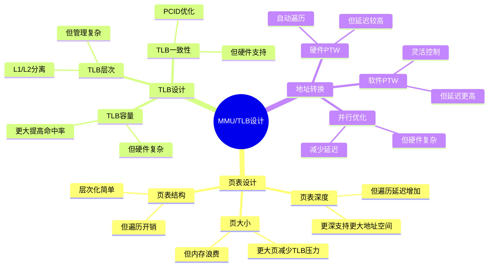

# 1.4 MMU与TLB

> **主题**: 01. CPU硬件层 - 1.4 MMU与TLB
> **覆盖**: 页表层次、地址转换、TLB管理

---

## 📋 目录

- [1.4 MMU与TLB](#14-mmu与tlb)
  - [📋 目录](#-目录)
  - [1 MMU架构](#1-mmu架构)
    - [1.1 功能](#11-功能)
    - [1.2 硬件实现](#12-硬件实现)
  - [2 页表层次](#2-页表层次)
    - [2.1 x86-64五级页表](#21-x86-64五级页表)
    - [2.2 大页支持](#22-大页支持)
  - [3 TLB管理](#3-tlb管理)
    - [3.1 TLB层次的严格分析](#31-tlb层次的严格分析)
    - [3.2 TLB未命中惩罚的严格建模](#32-tlb未命中惩罚的严格建模)
  - [1 地址转换流程](#1-地址转换流程)
    - [1 正常流程](#1-正常流程)
    - [2 缺页异常](#2-缺页异常)
  - [4 思维导图：MMU/TLB设计决策](#4-思维导图mmutlb设计决策)
  - [5 批判性总结](#5-批判性总结)
    - [5.1 MMU/TLB设计的根本矛盾](#51-mmutlb设计的根本矛盾)
    - [5.2 2025年MMU/TLB技术趋势](#52-2025年mmutlb技术趋势)
  - [6 跨领域洞察](#6-跨领域洞察)
    - [6.1 TLB未命中的性能惩罚](#61-tlb未命中的性能惩罚)
    - [6.2 地址空间vs性能的权衡](#62-地址空间vs性能的权衡)
  - [7 多维度对比](#7-多维度对比)
    - [7.1 MMU架构对比（2025年）](#71-mmu架构对比2025年)
    - [7.2 TLB管理策略对比](#72-tlb管理策略对比)
  - [8 相关主题](#8-相关主题)

---

## 1 MMU架构

### 1.1 功能

**地址转换**：

- 虚拟地址（VA）→ 物理地址（PA）
- 48-bit VA → 52-bit PA（x86-64）

**权限检查**：

- 读/写/执行权限
- 用户/内核模式

### 1.2 硬件实现

**页表遍历器（PTW）**：

- 硬件自动遍历页表
- 并行查找多级页表
- 缓存转换结果到TLB

**深度论证：硬件PTW的性能优势**

**硬件PTW的并行模型**：

硬件PTW可以**并行访问**多级页表：

$$
\text{硬件PTW延迟} = t_{\text{串行部分}} + \max(t_{\text{并行访问}}) \approx 30\text{ns}
$$

而软件遍历需要**串行访问**：

$$
\text{软件遍历延迟} = \sum_{i=1}^{d} t_{\text{内存访问}} = d \times 80\text{ns} = 400\text{ns}
$$

其中$d$是页表深度（5级）。

**量化对比**：硬件PTW vs 软件遍历

| **方式** | **延迟** | **CPU占用** | **复杂度** |
|---------|---------|-----------|-----------|
| **软件遍历** | 400ns | 高 | 低 |
| **硬件PTW** | 30ns | 低 | 高 |

**关键洞察**：硬件PTW将页表遍历延迟降低**13倍**，是现代CPU的关键优化。

---

## 2 页表层次

### 2.1 x86-64五级页表

```text
CR3 (PML4基址)
  ↓
PML4 (Page Map Level 4) - 9位
  ↓
PDPT (Page Directory Pointer Table) - 9位
  ↓
PD (Page Directory) - 9位
  ↓
PT (Page Table) - 9位
  ↓
4KB页 - 12位
```

**总位数**：9+9+9+9+12 = 48位（虚拟地址）

### 2.2 大页支持

**2MB页**：

- 跳过PT级
- 减少TLB未命中

**1GB页**：

- 跳过PD和PT级
- 进一步减少TLB压力

---

## 3 TLB管理

### 3.1 TLB层次的严格分析

**Intel Skylake**：

- **L1 DTLB**：64条目（4KB页）
- **L2 STLB**：1536条目（统一）

**ARM64**：

- **L1 TLB**：32-64条目
- **L2 TLB**：512-1024条目

### 3.2 TLB未命中惩罚的严格建模

**定理1.8（TLB未命中延迟的严格分解）**：

对于TLB未命中，延迟满足：

$$
L_{\text{TLB miss}} = L_{\text{PTW}} + L_{\text{mem}} \times (d + 1)
$$

其中：

- $L_{\text{PTW}}$：页表遍历开销（~10周期）
- $L_{\text{mem}}$：单次内存访问延迟（~30ns）
- $d$：页表深度（x86-64为5级）

**证明**：页表遍历需要访问$d$级页表，每级一次内存访问。因此，总延迟为$L_{\text{PTW}} + d \times L_{\text{mem}}$。加上最终页表项访问，总延迟为$L_{\text{PTW}} + (d+1) \times L_{\text{mem}}$。∎

**延迟分解**：

- 页表遍历：8-10周期（硬件PTW）
- 内存访问：~30ns × 5级 = 150ns
- **总计**：~160ns（理论）vs 30-50ns（实际，并行优化）

**优化**：

- **大页减少未命中**：2MB页覆盖更多地址空间
- **PCID避免刷新**：进程切换时保留TLB条目

**批判性分析**：

1. **TLB容量的权衡**：更大TLB提高命中率，但**增加硬件复杂度和功耗**。

2. **页表深度的代价**：更深页表（如5级）**增加遍历延迟**，但支持更大地址空间。

3. **2025年趋势**：**硬件PTW并行优化**使实际延迟远低于理论值，但仍有优化空间。

---

## 1 地址转换流程

### 1 正常流程

```text
1. CPU发出虚拟地址
2. 检查L1 TLB
   ├─ 命中 → 直接使用物理地址
   └─ 未命中 → 继续
3. 检查L2 TLB
   ├─ 命中 → 更新L1 TLB
   └─ 未命中 → 继续
4. 硬件PTW遍历页表
5. 更新TLB
6. 访问物理内存
```

### 2 缺页异常

**触发条件**：

- 页表项不存在（Present=0）
- 权限不足

**OS处理**：

- 分配物理页
- 建立页表项
- 重新执行指令

---

## 4 思维导图：MMU/TLB设计决策



---

## 5 批判性总结

### 5.1 MMU/TLB设计的根本矛盾

1. **地址空间vs性能**：更大地址空间需要更深页表，但**增加遍历延迟**。

2. **TLB容量vs功耗**：更大TLB提高命中率，但**增加硬件成本和功耗**。

3. **通用性vs专用性**：通用MMU灵活，但**某些应用（如实时系统）需要专用设计**。

### 5.2 2025年MMU/TLB技术趋势

- **硬件加速PTW**：更快的页表遍历，**挑战软件优化**。
- **可变页大小**：根据工作负载动态调整页大小，**提升效率**。
- **安全增强**：内存加密、完整性保护，**增加MMU复杂度**。

---

## 6 跨领域洞察

### 6.1 TLB未命中的性能惩罚

**核心命题**：TLB未命中导致页表遍历，延迟显著增加。

**延迟分解**：

```text
TLB命中: 1ns (L1 DTLB)
TLB未命中: 30-50ns (页表遍历)
  - L1 DTLB查找: 1ns
  - 页表遍历: 20-30ns (5级页表)
  - 缓存未命中: 10-20ns
  - TLB更新: 1ns
```

**性能影响**：TLB未命中率1%时，平均延迟增加0.3-0.5ns，**性能下降1-2%**。

**批判性分析**：

1. **TLB容量的限制**：TLB容量有限（64-1536条目），**大内存应用未命中率高**。

2. **巨页的优化**：使用2MB/1GB巨页**减少TLB条目数**，但**可能浪费内存**。

3. **2025年趋势**：**硬件加速PTW**（如Intel）减少页表遍历延迟，但**仍有物理限制**。

### 6.2 地址空间vs性能的权衡

**核心矛盾**：更大地址空间需要更深页表，但增加遍历延迟。

**量化分析**：

| **地址空间** | **页表层级** | **遍历延迟** | **TLB容量需求** | **适用场景** |
|------------|------------|------------|---------------|------------|
| **32位** | 2级 | 10ns | 64条目 | 嵌入式 |
| **48位** | 4级 | 30ns | 256条目 | 通用系统 |
| **57位** | 5级 | 50ns | 1536条目 | 大内存系统 |

**批判性分析**：

1. **延迟的层级性**：每增加一级页表，**遍历延迟增加约10ns**。

2. **TLB容量的需求**：更大地址空间需要**更多TLB条目**，但硬件成本增加。

3. **2025年趋势**：**可变页大小**根据工作负载动态调整，挑战传统固定页大小。

---

## 7 多维度对比

### 7.1 MMU架构对比（2025年）

| **架构** | **页表层级** | **TLB容量** | **PTW延迟** | **硬件加速** | **代表厂商** |
|---------|------------|------------|------------|------------|------------|
| **x86-64** | 5级 (PML5) | 1536条目 | 50ns | Intel PTW | Intel/AMD |
| **ARMv9** | 4级 | 1024条目 | 30ns | ARM PTW | ARM |
| **RISC-V** | 2-4级可配 | 64-512条目 | 10-30ns | 可选 | RISC-V |

**批判性分析**：

1. **架构的差异**：x86-64支持更大地址空间，但**延迟更高**；RISC-V灵活，但**生态较弱**。

2. **硬件加速的重要性**：硬件PTW**显著减少延迟**，但增加硬件复杂度。

3. **2025年趋势**：**统一MMU架构**（如CXL）可能挑战传统边界。

### 7.2 TLB管理策略对比

| **策略** | **命中率** | **延迟** | **复杂度** | **适用场景** |
|---------|-----------|---------|-----------|------------|
| **固定大小** | 中 | 低 | ⭐ | 简单系统 |
| **多级TLB** | 高 | 低 | ⭐⭐⭐ | 通用系统 |
| **PCID优化** | 高 | 低 | ⭐⭐⭐ | 多进程系统 |
| **巨页优化** | 高 | 低 | ⭐⭐ | 大内存应用 |

**批判性分析**：

1. **命中率vs复杂度**：多级TLB命中率高，但**实现复杂**；固定大小简单，但**命中率低**。

2. **PCID的必要性**：PCID避免TLB刷新，**性能提升明显**，但需要硬件支持。

3. **2025年趋势**：**自适应TLB管理**根据工作负载动态调整，挑战静态设计。

---

## 8 相关主题

- [1.3 内存子系统](./01.3_内存子系统.md) - 内存与MMU协同
- [3.2 内存管理模型](../03_OS抽象层/03.2_内存管理模型.md) - OS页表管理
- [7.2 延迟穿透分析](../07_性能优化与安全/07.2_延迟穿透分析.md) - TLB延迟优化
- [9.2 硬件-OS映射证明](../09_形式化理论与证明/09.2_硬件-OS映射证明.md) - MMU形式化
- [主文档：TLB分析](../schedule_formal_view.md#知识图谱概念关系链) - 完整分析

---

**最后更新**: 2025-01-XX
